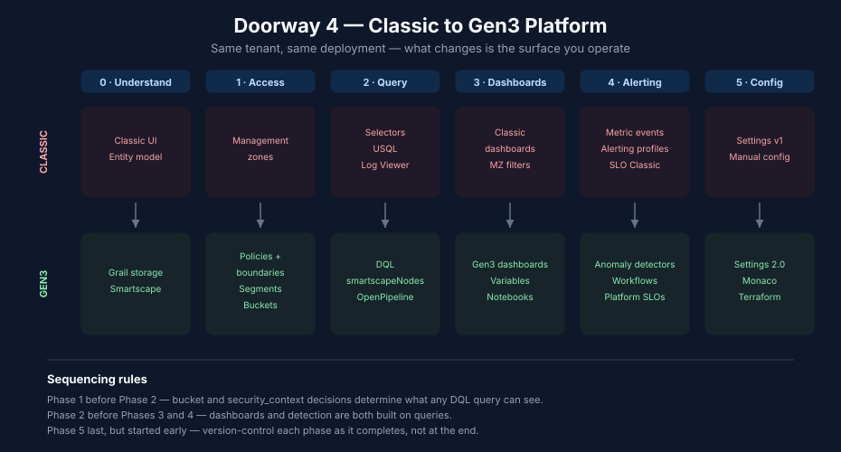

# Doorway 4 — Classic → Gen3 Platform

> **Purpose:** Reading order for existing Dynatrace SaaS customers moving off classic surfaces onto platform equivalents — management zones used as permissions, metric events, alerting profiles, classic dashboards, Classic Logs, USQL. Same tenant, same deployment model; what changes is which surface you operate.
> **Last Updated:** 07/23/2026

<!-- MARKDOWN_TABLE_ALTERNATIVE
| Phase | Classic surface | Gen3 surface |
|-------|-----------------|--------------|
| 0 | Classic UI, entity model | Grail, Smartscape, new navigation |
| 1 | Management zones as permissions | Policies, boundaries, security_context, buckets |
| 2 | Metric/entity selectors, USQL, Log Viewer | DQL, Smartscape queries, OpenPipeline |
| 3 | Classic dashboards, MZ filters | Gen3 dashboards, variables, segments |
| 4 | Metric events, alerting profiles, SLO Classic | Anomaly detectors, workflows, platform SLOs |
| 5 | Settings v1, manual config | Settings 2.0, Monaco, Terraform |
For environments where SVG doesn't render
-->

---

## Table of Contents

1. [You Are Here If…](#you-are-here-if)
2. [Why This Is Its Own Doorway](#why-this-is-its-own-doorway)
3. [Phase Overview](#phase-overview)
4. [Phase 0 — Understand the Shift](#phase-0--understand-the-shift)
5. [Phase 1 — Access and Data Architecture](#phase-1--access-and-data-architecture)
6. [Phase 2 — Query Surfaces](#phase-2--query-surfaces)
7. [Phase 3 — Dashboards and Notebooks](#phase-3--dashboards-and-notebooks)
8. [Phase 4 — Alerting and SLOs](#phase-4--alerting-and-slos)
9. [Phase 5 — Config-as-Code and Go-Live](#phase-5--config-as-code-and-go-live)
10. [Sequencing Rules](#sequencing-rules)
11. [Where to Next](#where-to-next)

---

## You Are Here If…

- You already have a working Dynatrace SaaS tenant, and you are **not** changing where it runs
- Your tenant still operates one or more classic constructs:
  - Management zones used for **access control** rather than filtering
  - **Metric events** and **alerting profiles** rather than anomaly detectors and workflows
  - **Classic dashboards** rather than Gen3 dashboards or notebooks
  - **Classic Logs** rather than OpenPipeline
  - **USQL** for session analysis, or classic **metric/entity selectors** rather than DQL
- You want the platform capabilities that only exist on the Gen3 side — Grail retention economics, Davis CoPilot, Workflows, segments, bucket-level access control

If you have no tenant yet, see [Doorway 1 — Net New](01-net-new.md). If you are adding scope to a tenant that is already Gen3-native, see [Doorway 2 — Expanding or Consolidating](02-expand-consolidate.md). If you are changing deployment model — Managed → SaaS or SaaS → SaaS — see [Doorway 3 — Deployment Migration](03-deployment-migration.md) first; it lands you on a Gen3 tenant, after which this doorway covers the surface-by-surface work.

---

## Why This Is Its Own Doorway

Doorways 1–3 are each keyed to a **change in circumstance** — a new tenant, new scope, a new deployment model. This one is keyed to a change in **surface**: nothing about your environment moves, but the constructs you operate it with are replaced.

That distinction matters for sequencing. A deployment migration has a natural cutover date that forces the work into a schedule. A surface migration has none, so it tends to stall halfway — a tenant ends up with policies *and* management zones, workflows *and* alerting profiles, running in parallel indefinitely. Partial migration is more expensive than either end state, because every construct has to be maintained twice and every troubleshooting session starts by asking which surface owns the answer.

[FAQ](../FAQ%20-%20Frequently%20Asked%20Questions/) — entry 12 (coverage gaps from partial enablement) describes the same failure shape from the enablement angle and is worth reading before you plan the phases.

---

## Phase Overview

| Phase | What changes | Time |
|---|---|---|
| [0 — Understand the Shift](#phase-0--understand-the-shift) | Grail, Smartscape, navigation | 1 week |
| [1 — Access and Data Architecture](#phase-1--access-and-data-architecture) | MZs → policies, boundaries, segments; tags; security_context; buckets | 4–8 weeks |
| [2 — Query Surfaces](#phase-2--query-surfaces) | Selectors and USQL → DQL; Classic Logs → OpenPipeline | 3–6 weeks |
| [3 — Dashboards and Notebooks](#phase-3--dashboards-and-notebooks) | Classic dashboards → Gen3; MZ filters → variables and segments | 2–4 weeks |
| [4 — Alerting and SLOs](#phase-4--alerting-and-slos) | Metric events → anomaly detectors; alerting profiles → workflows; SLO Classic → platform SLOs | 3–6 weeks |
| [5 — Config-as-Code and Go-Live](#phase-5--config-as-code-and-go-live) | Settings 2.0, Monaco, Terraform, cutover | 2–4 weeks |

Estimates are calendar weeks for a small to mid-sized team, assuming the migration runs alongside normal operations rather than as a dedicated project. Phases 2–4 can overlap once Phase 1 is settled; Phase 1 cannot be parallelized with the rest — see [Sequencing Rules](#sequencing-rules).

---

## Phase 0 — Understand the Shift

Before changing anything, understand what Grail changes about storage, retention, and access, and what Smartscape changes about the entity model.

| Step | Reading | Notes |
|---|---|---|
| 1. Storage and retention model | [ORGNZ](../ORGNZ%20-%20Organize%20Data:%20Buckets,%20Segments,%20Security/) — notebook 02 (understanding Grail buckets) | Buckets, retention, and what they cost |
| 2. Metrics mechanics | [FAQ](../FAQ%20-%20Frequently%20Asked%20Questions/) — entry 11 (how metrics work) | Covers the Classic ↔ Grail dual-write, the `builtin:` ↔ `dt.*` split, and selector → DQL conversion |
| 3. Partial-enablement risk | [FAQ](../FAQ%20-%20Frequently%20Asked%20Questions/) — entry 12 (coverage gaps from partial enablement) | Why a half-migrated tenant costs more than either end state |
| 4. Navigation and launchers | [FAQ](../FAQ%20-%20Frequently%20Asked%20Questions/) — entry 07 (launcher page setup) | The Gen3 app model and how users find things |
| 5. Where you are today | [ADOPT](../ADOPT%20-%20Observability%20Adoption%20&%20Maturity/) — notebook 02 (platform health assessment) | Baseline before you start moving surfaces |

Deliverable: a written inventory of which classic constructs your tenant actually uses. Most tenants over-estimate — many management zones turn out to be filtering conveniences rather than permission boundaries, which changes the Phase 1 path substantially.

---

## Phase 1 — Access and Data Architecture

The largest phase, and the one everything else depends on. Management zones split into three separate Gen3 concepts depending on the job they were doing.

| Step | Reading | Notes |
|---|---|---|
| 1. Understand the split | [MZ2POL](../MZ2POL%20-%20Management%20Zone%20to%20Policy%20Migration/) — notebooks 01 (why migrate), 02 (access control model) | Management zones did three jobs; Gen3 separates them |
| 2. Assess your MZs | [MZ2POL](../MZ2POL%20-%20Management%20Zone%20to%20Policy%20Migration/) — notebook 03 (assessment and planning) | Classify each MZ by job: access, filtering, or alerting scope |
| 3a. MZs used for **access** | [MZ2POL](../MZ2POL%20-%20Management%20Zone%20to%20Policy%20Migration/) — notebooks 04 (policies and boundaries), 08 (templated policies); [IAM](../IAM%20-%20IAM%20Administration/) — notebooks 04 (policy authoring), 05 (boundary design), 10 (templated policy assignments) | The bulk of the work for most tenants |
| 3b. MZs used for **filtering** | [MZ2POL](../MZ2POL%20-%20Management%20Zone%20to%20Policy%20Migration/) — notebook 05 (segments); [ORGNZ](../ORGNZ%20-%20Organize%20Data:%20Buckets,%20Segments,%20Security/) — notebooks 08 (Grail segments), 10 (advanced segment definitions) | If this is all your MZs do, notebook 05 alone may be the whole migration |
| 3c. MZs used for **alerting scope** | [MZ2POL](../MZ2POL%20-%20Management%20Zone%20to%20Policy%20Migration/) — notebook 09 (alerting and notification migration) | Hands off to Phase 4 |
| 4. Tagging rationalization | [FAQ](../FAQ%20-%20Frequently%20Asked%20Questions/) — entry 02 (tagging sources, standards, strategy); [ORGNZ](../ORGNZ%20-%20Organize%20Data:%20Buckets,%20Segments,%20Security/) — notebook 01 | Gen3 access control leans on tags far more than Gen2 did |
| 5. security_context | [ORGNZ](../ORGNZ%20-%20Organize%20Data:%20Buckets,%20Segments,%20Security/) — notebook 06 | The universal scope field; without it, IAM boundaries are limited |
| 6. Bucket strategy | [ORGNZ](../ORGNZ%20-%20Organize%20Data:%20Buckets,%20Segments,%20Security/) — notebooks 03 (bucket strategy and design), 05 (bucket-level access control) | Determines retention, cost, and what any given policy can see |
| 7. Execute and validate | [MZ2POL](../MZ2POL%20-%20Management%20Zone%20to%20Policy%20Migration/) — notebooks 06 (migration execution), 07 (validation and troubleshooting) | Run policies and MZs in parallel, then retire the MZs |
| Reference | [MZ2POL](../MZ2POL%20-%20Management%20Zone%20to%20Policy%20Migration/) — notebook 99; [ORGNZ](../ORGNZ%20-%20Organize%20Data:%20Buckets,%20Segments,%20Security/) — notebook 99 | One-page syntheses |

---

## Phase 2 — Query Surfaces

Every classic query language and selector has a DQL equivalent. This phase is mostly mechanical translation, with one structural workstream (Classic Logs).

| Step | Reading | Notes |
|---|---|---|
| 1. DQL grounding | [ORGNZ](../ORGNZ%20-%20Organize%20Data:%20Buckets,%20Segments,%20Security/) — notebook 99 (DQL reference); [SPANS](../SPANS%20-%20Distributed%20Tracing%20and%20Spans/) — query reference | Official Dynatrace DQL documentation is authoritative |
| 2. Metric selectors → `timeseries` | [FAQ](../FAQ%20-%20Frequently%20Asked%20Questions/) — entry 11 (how metrics work) | Covers selector → DQL conversion and the `builtin:` ↔ `dt.*` mapping |
| 3. Entity selectors → Smartscape | [FAQ](../FAQ%20-%20Frequently%20Asked%20Questions/) — entry 16 (migrating classic entity selectors to Smartscape) | `dt.entity.*` is deprecated in favour of `dt.smartscape.*` and `smartscapeNodes`; legacy form still runs |
| 4. USQL → DQL for RUM | [WEBRUM](../WEBRUM%20-%20Web%20Real%20User%20Monitoring/) — notebook 09 (migrating USQL to DQL) | Grammar and field mapping, plus the classic-RUM-on-Grail vs New RUM split that decides which field names apply |
| 5. Classic Logs → OpenPipeline | [OPMIG](../OPMIG%20-%20OpenPipeline%20Migration/) — full series | The one genuinely structural workstream here; treat as its own project |
| 6. Log metric extraction | [OPMIG](../OPMIG%20-%20OpenPipeline%20Migration/) — notebook 07 (metric event extraction) | Classic log metrics map onto OpenPipeline extraction |

---

## Phase 3 — Dashboards and Notebooks

Classic dashboards do not convert automatically. Treat this as a rebuild against a rationalized list, not a port — most tenants find a large fraction of classic dashboards are unused.

| Step | Reading | Notes |
|---|---|---|
| 1. Inventory and prune | [DASH](../DASH%20-%20Dashboard%20Design%20&%20Building/) — notebook 02 (dashboard hierarchy) | Rebuild what is used; retire the rest rather than porting it |
| 2. Rebuild | [DASH](../DASH%20-%20Dashboard%20Design%20&%20Building/) — notebooks 01 (fundamentals), 03–05 (executive, operations, engineering) | Built on the Phase 2 DQL |
| 3. MZ filters → variables and segments | [DASH](../DASH%20-%20Dashboard%20Design%20&%20Building/) — notebook 06 (variables and filters); [ORGNZ](../ORGNZ%20-%20Organize%20Data:%20Buckets,%20Segments,%20Security/) — notebook 08 (Grail segments) | The dashboard-side half of Phase 1 step 3b |
| 4. Notebooks for investigation | [DASH](../DASH%20-%20Dashboard%20Design%20&%20Building/) — notebook 01; [AIOPS](../AIOPS%20-%20Dynatrace%20Intelligence/) — notebook 04 (Davis CoPilot and Dynatrace Assist) | Notebooks replace much of what classic ad-hoc dashboards were used for |
| 5. Distribution | [DASH](../DASH%20-%20Dashboard%20Design%20&%20Building/) — notebook 07 (sharing and reporting) | |

---

## Phase 4 — Alerting and SLOs

Metric events and alerting profiles map onto anomaly detectors and workflows, but rarely one-to-one — this is the phase where a lift-and-shift produces the worst results.

| Step | Reading | Notes |
|---|---|---|
| 1. Target architecture | [ALERT](../ALERT%20-%20Alerting%20Strategy%20and%20Design/) — notebook 01 (end-to-end architecture) | Read before migrating any individual alert |
| 2. Metric events → detection | [ALERT](../ALERT%20-%20Alerting%20Strategy%20and%20Design/) — notebook 02 (choosing and building detection); [AIOPS](../AIOPS%20-%20Dynatrace%20Intelligence/) — notebook 02 (anomaly detection) | Static thresholds ported as-is are the main source of Gen3 alert noise; many should become baselines |
| 3. Alerting profiles → workflows | [MZ2POL](../MZ2POL%20-%20Management%20Zone%20to%20Policy%20Migration/) — notebook 09; [WFLOW](../WFLOW%20-%20Workflows%20and%20Alert%20Notifications/) — notebooks 04 (notification routing), 05 (incident management) | MZ-scoped alerting profiles become problem-triggered workflows |
| 4. Routing and cost | [ALERT](../ALERT%20-%20Alerting%20Strategy%20and%20Design/) — notebook 03 (routing, destinations, cost) | Simple vs multi-step workflow billing differs — check before fanning out |
| 5. ITSM integration | [ALERT](../ALERT%20-%20Alerting%20Strategy%20and%20Design/) — notebook 04 (ServiceNow integration) | If alerting profiles fed ServiceNow, rebuild the payload rather than translating it |
| 6. SLO Classic → platform SLOs | [SLO](../SLO%20-%20Service%20Level%20Objectives/) — notebooks 01 (fundamentals), 05 (SLOs as code) | |
| 7. Auto-remediation | [WFLOW](../WFLOW%20-%20Workflows%20and%20Alert%20Notifications/) — full series; [AIOPS](../AIOPS%20-%20Dynatrace%20Intelligence/) — notebook 06 (integrations and agentic workflows) | Only available on the Gen3 side; a reason to finish the phase rather than stall in parallel |
| Reference | [ALERT](../ALERT%20-%20Alerting%20Strategy%20and%20Design/) — notebook 99 (checklist and cross-series map) | |

---

## Phase 5 — Config-as-Code and Go-Live

Put the new configuration under version control before you retire the old surfaces, so the migration end state is reproducible.

| Step | Reading | Notes |
|---|---|---|
| 1. Automation landscape | [AUTOM](../AUTOM%20-%20Dynatrace%20Automation/) — notebook 01 | Which tool for which config surface |
| 2. Settings v1 → Settings 2.0 | [AUTOM](../AUTOM%20-%20Dynatrace%20Automation/) — notebook 02 (Settings API) | |
| 3. Monaco or Terraform | [AUTOM](../AUTOM%20-%20Dynatrace%20Automation/) — notebooks 03 (Monaco), 04 (Terraform), 09 (Terraform GitOps setup recipe) | |
| 4. IAM as code | [IAM](../IAM%20-%20IAM%20Administration/) — appendix LABs 95 (Terraform provisioning), 96 (Python provisioning) | Locks in the Phase 1 policy model |
| 5. Retire classic surfaces | *No cross-journey checklist yet* | Per-journey checklists exist in [M2S](../M2S%20-%20Managed%20to%20SaaS%20Migration/) — notebook 99 and [MZ2POL](../MZ2POL%20-%20Management%20Zone%20to%20Policy%20Migration/) — notebook 06 |
| 6. Optimize | [FINOPS](../FINOPS%20-%20Cost%20Management%20&%20FinOps/) — full series; [ADOPT](../ADOPT%20-%20Observability%20Adoption%20&%20Maturity/) — notebook 06 (staged enablement) | Grail retention and bucket choices are the main cost levers post-migration |

---

## Sequencing Rules

Three ordering constraints are worth respecting; the rest of the phases are flexible.

| Rule | Why |
|---|---|
| **Phase 1 before Phase 2** | Bucket assignment and `security_context` determine what any DQL query can see. Writing queries first means rewriting them after the boundaries land. |
| **Phase 2 before Phases 3 and 4** | Dashboards and detection are both built on queries. A dashboard rebuilt against pre-migration field names is rework. |
| **Phase 5 last, but started early** | Put configuration under version control as each phase completes rather than at the end — otherwise the migration end state exists only as manual tenant state. |

Phases 3 and 4 are independent of each other and can run in parallel by different teams.

**On running both surfaces in parallel:** a parallel window is correct and expected during each phase — it is the validation mechanism. What causes trouble is a parallel window with no end date. Set a retirement date for the classic construct when you start each phase, and treat the phase as incomplete until the old surface is switched off.

---

## Where to Next

- [Operationalize Module](07-operationalize.md) — once the surfaces are migrated, for the ongoing operations sequence
- [Maturity Module](08-maturity.md) — continuous improvement framing via [ADOPT](../ADOPT%20-%20Observability%20Adoption%20&%20Maturity/)
- [Domain Enablement Module](06-domain-enablement.md) — to add domains that were deferred during the migration
- [Overlap Map](09-overlap-map.md) — when the same topic appears in multiple series
- [Foundation Module](05-foundation.md) — if the assessment in Phase 0 turns up Foundation gaps rather than migration work

---

> *This playbook was AI-generated from community-submitted and publicly available sources. It is not officially supported by Dynatrace. Always verify information against official Dynatrace documentation.*
