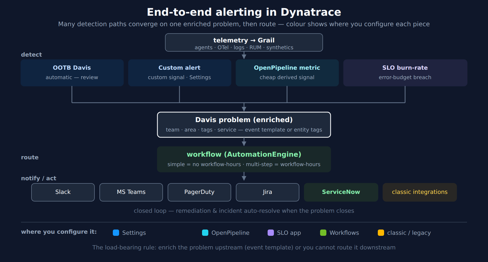

# ALERT-01: End-to-End Alerting Architecture

> **Series:** ALERT — Alerting Strategy and Design | **Notebook:** 01 of 05 | **Created:** June 2026 | **Last Updated:** 10/06/2026

## Overview

Alerting in Dynatrace is a cross-cutting concern: detection lives in one app, routing in another, reliability targets in a third. Teams that try to assemble it ad hoc end up with noise, gaps, and the wrong people paged. This notebook draws the **whole board on one canvas** — what you set up, where, and how it connects end to end — so you can see the complete solution before building any one piece.

This is the doorway for the ALERT series. It does not re-document mechanics; it orchestrates them and points at the series that own each piece (AIOPS for detection, SLO for reliability, WFLOW for routing).

---

## Table of Contents

1. [The Whole Board](#board)
2. [The Anti-Noise Funnel](#funnel)
3. [What to Set Up, Where](#where)
4. [The One Rule That Makes Routing Work](#rule)
5. [Where to Go Next](#next)

---

## Prerequisites

| Requirement | Details |
|-------------|---------|
| **Dynatrace Environment** | SaaS Gen3 with Grail, **Settings** for custom alerts (the Anomaly Detection app before SaaS 1.344 — § 3), the SLO app, and AutomationEngine (Workflows) |
| **Audience** | Platform owners and SREs standing up alerting for the first time, or rationalising an ad-hoc setup |
| **Companion series** | AIOPS (detection), SLO (reliability targets), WFLOW (routing) |

## 1. The Whole Board

Every Dynatrace alert, regardless of source, follows the same spine: **telemetry → detection → one enriched problem → routing → destination**, with an optional closed loop back. The diagram shows the complete picture, colour-coded by *where you configure each piece*.

<!-- MARKDOWN_TABLE_ALTERNATIVE
| Layer | Pieces | Where configured |
|-------|--------|------------------|
| Detect | OOTB Davis · custom alert (anomaly detector) · OpenPipeline metric · SLO burn-rate | Settings (Davis automatic, custom alerts) / OpenPipeline / SLO app |
| Converge | one enriched Davis problem (team, area, tags, service) | event template + primary Grail tags / entity tags / ownership |
| Route | workflow — simple (no workflow-hours) vs multi-step (workflow-hours) | AutomationEngine |
| Notify/act | Slack · Teams · PagerDuty · Jira · ServiceNow · classic integrations | workflow connectors (HTTP Request where there is no connector, e.g. xMatters) / existing classic profiles |
| Closed loop | remediation · incident resolved when the problem closes | workflow / ServiceNow connector or store app |
For environments where SVG doesn't render
-->

The key insight the diagram makes visible: **many detection paths, one convergence point.** You do not build a separate alerting stack per signal type — every mechanism produces a Davis problem, and everything downstream operates on that.

## 2. The Anti-Noise Funnel

The order in which you reach for detection mechanisms determines how much noise you live with. Work top-down; only descend when the layer above cannot express the condition:

1. **Out-of-the-box Davis first.** It already detects latency spikes, error anomalies, resource saturation, and service degradation — with seasonal baselines you do not have to tune. Most "we need an alert for X" requests are already covered. Review and adjust sensitivity before building anything custom (AIOPS-02 §1–§3).
2. **Custom Davis anomaly detector** only when a business-specific condition is not covered. Use auto-adaptive or seasonal analyzers, not static thresholds on traffic-correlated metrics (AIOPS-02 §4).
3. **OpenPipeline-derived metric** when the signal lives in logs or spans. Extract a metric once at ingest, then alert on the metric — querying logs/traces directly in a detector incurs query cost on every evaluation; a derived metric does not (OPIPE, FINOPS-03).
4. **SLO burn-rate** for the reliability of a user journey — the highest-signal alert of all, because it fires on "we are about to break our promise to users" (SLO-04).

Each step down costs more to build and maintain. Staying as high as possible is the single biggest lever on alert noise.

**Know whether the funnel is actually working.** The measure is not how many alerts you have — it is how much of the time a *healthy* service sits in an alert state. The working yardstick is 0.1% of observed time, roughly 1 to 1.5 minutes a day; ALERT-99 §3 carries the rule and the audit loop that applies it, and AIOPS-02 §8 the query that ranks your noisiest detectors. Run it against a service you believe is well-monitored before assuming the funnel is doing its job.

## 3. What to Set Up, Where

| Layer | What you configure | Where | Cost note |
|-------|--------------------|-------|-----------|
| Detection — automatic | Review & tune sensitivity | OOTB Davis (Settings 2.0) | included |
| Detection — custom signal | Custom alert (analyzer + event template) | Settings (Anomaly Detection app before SaaS 1.344) → config-as-code | included for metric (`timeseries`) queries; a log or record query bills query usage on every evaluation |
| Detection — cheap custom metric | Metric extraction from logs/spans | OpenPipeline | ingest cost, no query cost |
| Detection — reliability | SLO + burn-rate alert | SLO app | included |
| Convergence | Enrichment (team, area, service) so routing has something to filter | event template / primary Grail tags / entity tags / ownership | — |
| Routing | Problem-trigger workflow | AutomationEngine — simple (no workflow-hours) vs multi-step (workflow-hours) | choose deliberately |
| Destinations | Connector per channel | workflow connectors, or HTTP Request where there is none; existing classic integrations via alerting profiles | — |
| Closed loop | Remediation / resolve the incident when the problem closes | workflow / ServiceNow connector or store app | — |

> **Custom alerts live in Settings (SaaS 1.344+).** *"Starting with Dynatrace version 1.344, custom alerts have moved to Settings. Because Anomaly Detection is deprecated, we highly recommend that you use Settings to access your existing configurations and create new ones."* SaaS 1.344's staged rollout started 07/29/2026. On a tenant still below 1.344, the **Anomaly Detection** app is where custom alerts are created.

> **What "included" means for a custom alert.** A custom alert runs its query on every evaluation, by default once a minute. A metric query costs nothing extra: *"Querying metrics using the timeseries command is always included."* A query over logs or other records is billed each time it runs, which is why the docs pair records-based alerts with a long window and execution delay: *"instead of the custom alert running 60 times per hour at the default 1-minute interval, it runs only once per hour."*

> **Sources:** [Anomaly Detection (DT docs)](https://docs.dynatrace.com/docs/dynatrace-intelligence/anomaly-detection/anomaly-detection-app) — *"Starting with Dynatrace version 1.344, custom alerts have moved to Settings."*, [Metrics powered by Grail overview (DPS) (DT docs)](https://docs.dynatrace.com/docs/license/capabilities/metrics) — *"Querying metrics using the timeseries command is always included."*, [Avoid overalerting (DT docs)](https://docs.dynatrace.com/docs/dynatrace-intelligence/use-cases/avoid-overalerting) — *"instead of the custom alert running 60 times per hour at the default 1-minute interval, it runs only once per hour."*

### A noise control on the routing side

**Available (SaaS 1.344):** the workflow **Problem trigger** has a **Minimum duration** option (under *Advanced options*) that postpones the trigger until the problem has been open for at least the configured duration: 5 minutes up to one week. SaaS 1.344's rollout started **07/29/2026**; verify it has reached your tenant before designing around it.

Note *where* this sits on the board, because it is easy to file in the wrong place. It is **not** an analyzer parameter, and it does not delay the problem. The problem opens, and shows in the Problems app, as soon as Davis creates it. What Minimum duration holds back is the *notification*: a problem that closes before reaching the threshold never triggers the workflow. Analyzer settings such as `violatingSamples` and `slidingWindow` decide whether a series is anomalous at all; Minimum duration decides whether a problem has lasted long enough to tell someone. The two compose rather than substitute. Because it applies at the trigger, it damps notifications from flapping detectors you do not own. It does not reduce problem counts or the alert-state time the 0.1% yardstick measures (ALERT-99 §3). That is still the detector's job.

Where Minimum duration is not available yet, the sliding-window minimum on the analyzer remains the control to rely on for this class of noise (ALERT-02, AIOPS-02 §4).

ALERT-02 covers choosing detection; ALERT-03 covers routing and cost; ALERT-04 covers ServiceNow.

> **Sources:** [SaaS 1.344 release notes (DT docs)](https://docs.dynatrace.com/docs/whats-new/saas/sprint-344), [Event triggers for workflows (DT docs)](https://docs.dynatrace.com/docs/analyze-explore-automate/workflows/build/trigger/event-trigger) — *"The Minimum duration option postpones the trigger until the problem has been open for at least the configured duration."* **Derived:** the "different layer, composes rather than substitutes" placement follows from the delay acting on the problem-to-notification step while analyzer parameters act on the series.

## 4. The One Rule That Makes Routing Work

> **Enrich the problem upstream, or you cannot route it downstream.**

A workflow routes by *filtering* — "send problems where `team == checkout` to #checkout-alerts." That only works if the problem carries a `team` property. Three ways it gets there:

- **Primary Grail tags** — primary Grail fields and tags (`primary_tags.*`) are copied from the alerting events onto the problem record, so the trigger can filter on them directly. A problem that groups several entities holds the deduplicated union of their values, so one problem can carry two teams (ALERT-04 §2).
- **The detector's event template** — when you build a custom anomaly detector, its event template defines the properties on the event it raises (AIOPS-02 §4). Put team / service / area there.
- **Entity tags and ownership** — for OOTB problems, the affected entity's tags carry the metadata. Since SaaS 1.337, ownership is also available on Smartscape nodes, and a workflow reads it with the Ownership `get_owners` action. That is a second task, so the workflow becomes a standard one (ALERT-03 §1, WFLOW-04).

A problem that fires with no team or ownership metadata forces every workflow to re-derive routing from scratch — the most common reason an alerting setup degenerates into "everything goes to one channel." Spend the effort upstream.

> **Sources:** [Upgrade from Classic problem notification to simple workflows (DT docs)](https://docs.dynatrace.com/docs/platform/upgrade/keep-problems-and-alerting-working/upgrade-guide-alert-notification) — *"You can filter and template on them directly on the problem"*; *"The problem carries the deduplicated union."*, [SaaS 1.337 release notes (DT docs)](https://docs.dynatrace.com/docs/whats-new/saas/sprint-337) — *"Ownership information is now available in Smartscape and for Smartscape nodes."*, [Create a simple workflow (DT docs)](https://docs.dynatrace.com/docs/analyze-explore-automate/workflows/build/simple-workflow) — *"limited to only one task"*.

## 5. Where to Go Next

| You want to… | Go to |
|--------------|-------|
| Choose and build a detection mechanism | ALERT-02 → AIOPS-02 |
| Set reliability targets and alert on burn rate | SLO-04 |
| Route alerts to teams without noise (simple vs multi-step cost) | ALERT-03 → WFLOW-04 |
| Create ServiceNow incidents (and resolve them when the problem closes) | ALERT-04 |
| See the complete setup checklist | ALERT-99 |

> **Sources:** [Alerting and notifications (DT docs)](https://docs.dynatrace.com/docs/analyze-explore-automate/alerting-and-notifications), [Anomaly Detection app (DT docs)](https://docs.dynatrace.com/docs/dynatrace-intelligence/anomaly-detection/anomaly-detection-app). **Derived:** the anti-noise funnel ordering is a synthesis of OOTB-first guidance and the query-cost economics in OPIPE/FINOPS.

---

*This notebook was AI-generated from community-submitted and publicly available sources. This notebook series is not officially supported by Dynatrace. Always verify information against official Dynatrace documentation.*
