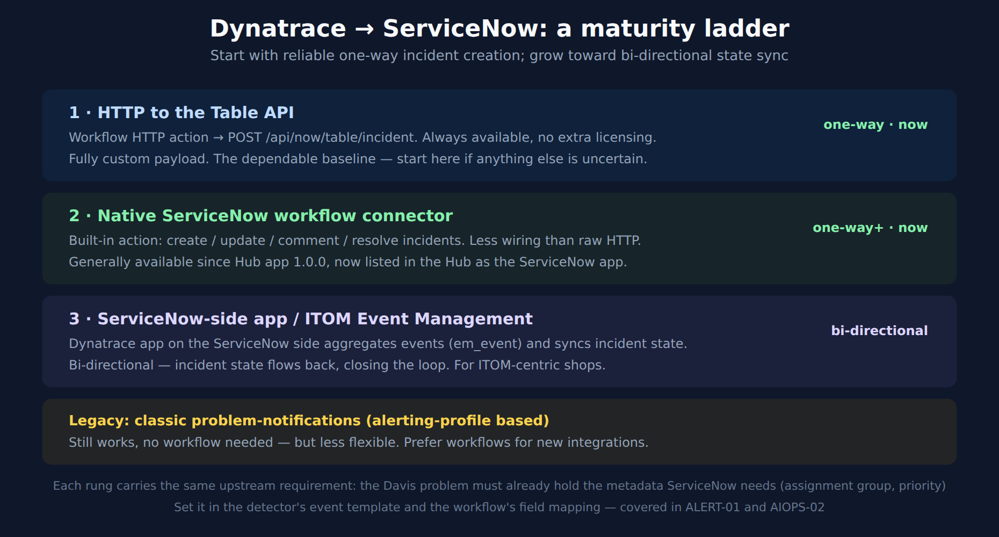

# ALERT-04: ITSM Integration: ServiceNow

> **Series:** ALERT — Alerting Strategy and Design | **Notebook:** 04 of 05 | **Created:** June 2026 | **Last Updated:** 09/24/2026

## Overview

For many enterprises, an alert is not "done" until it is an incident in ServiceNow. This notebook covers the integration as a **maturity ladder** — from dependable one-way incident creation you can stand up today, to bi-directional state sync — and shows the worked Table API path so you are never blocked waiting on a connector's availability.

---

## Table of Contents

1. [The Integration Ladder](#ladder)
2. [Rung 1 — HTTP to the Table API](#http)
3. [Rung 2 — Native ServiceNow Connector](#connector)
4. [Rung 3 — Bi-Directional Sync](#bidirectional)
5. [What ServiceNow Needs From the Problem](#fields)

---

## Prerequisites

| Requirement | Details |
|-------------|---------|
| **Dynatrace Environment** | SaaS Gen3 with AutomationEngine (Workflows) |
| **ServiceNow** | An instance + a service account with rights to create incidents (Table API) or the Dynatrace-side connector configured |
| **Prior reading** | ALERT-01 (enrichment), ALERT-03 (routing) |

<a id="ladder"></a>
## 1. The Integration Ladder

There are several current ways to integrate, and they form a maturity ladder. Start at the rung you can stand up reliably today and climb as your needs grow.



<!-- MARKDOWN_TABLE_ALTERNATIVE
| Rung | Mechanism | Direction | When |
|------|-----------|-----------|------|
| 1 | Workflow HTTP → Table API (POST /api/now/table/incident) | one-way | now — the dependable baseline |
| 2 | Native ServiceNow workflow connector (create/update/comment/resolve) | one-way+ | now — GA (Hub app 1.0.0+) |
| 3 | ServiceNow-side Dynatrace app / ITOM Event Management (em_event) | bi-directional | ITOM-centric shops |
| Legacy | Classic problem-notifications (alerting-profile based) | one-way | works, less flexible — prefer workflows |
For environments where SVG doesn't render
-->


### Adjacent, and deliberately not a rung: issue-tracker deep-links

Dynatrace documents a pattern (published 06/30/2026) that looks adjacent enough to belong on this ladder but does not: **dedicated issue-tracking dashboard tiles that build a deep link into the tracker's own native search UI**, pre-filtered with the selected release context. The URL is assembled in DQL with `concat()`. It is documented for **Jira Cloud and Jira on-premises, GitHub, GitLab, and ServiceNow** — and works for any tracker that offers a URL — and per the docs, *"to configure the links, you don't need to store credentials in Dynatrace."* The link is followed in the operator's own authenticated browser session.

**It is not Rung 0, and it does not substitute for Rung 1 even temporarily.** The distinction is not maturity or effort — it is that **the pattern creates no ServiceNow record at all.** It navigates an operator to the right query; it does not open, update, comment on, or resolve an incident. Nothing downstream of ServiceNow — assignment, SLA clocks, CAB visibility, reporting — sees anything happen. So it cannot stand in for the ladder while you build Rung 1, and a team that adopts it believing otherwise has an "integration" that produces no incidents.

What it *is* good for is pairing with whichever rung you are on: once an incident exists, the deep link is the fastest way for whoever picks it up to reach the related issue records without hand-assembling a query.

**Its one real prerequisite is data discipline.** The link is built from process version metadata — `DT_RELEASE_STAGE`, `DT_RELEASE_PRODUCT`, `DT_RELEASE_VERSION` — and the docs require **slug-style values** for `DT_RELEASE_PRODUCT` and `DT_RELEASE_VERSION` (e.g. `cart-service`, `1.2.1`), warning that *"values with spaces, quotes, or special characters will produce broken URLs."* Note how that fails: the tile still renders a link and the link still opens — it just lands on the wrong query or an error page. Set those values deliberately at deploy time rather than letting them inherit a human-readable product name.

The **dashboard mechanics** — building the tile, the `concat()` URL expression, and where it sits on a dashboard — belong to the **DASH** series, not here. This section's only claim about the pattern is where it sits relative to the ladder.

> <sub>**Sources:** [Issue-tracking integration (DT docs)](https://docs.dynatrace.com/docs/deliver/release-monitoring/issue-tracking-integration-latest) — dedicated issue-tracking dashboard tiles deep-linking to the tracker's native search UI pre-filtered with release context; Jira Cloud/on-premises, GitHub, GitLab, ServiceNow; *"you don't need to store credentials in Dynatrace"*; slug-style `DT_RELEASE_PRODUCT` / `DT_RELEASE_VERSION` values, and *"values with spaces, quotes, or special characters will produce broken URLs."* **Derived:** the "adjacent, not a rung" placement follows from the pattern creating no ServiceNow record — every rung on this ladder does.</sub>

<a id="http"></a>
## 2. Rung 1 — HTTP to the Table API

The most portable approach, available regardless of connector status: a problem-trigger workflow whose HTTP action POSTs to the ServiceNow Table API.

Preview which problems the trigger would act on before configuring it. `dt.davis.problems` is one row per problem (validated on a live tenant 09/24/2026):

```dql
// Preview the problems a Problem trigger would act on: one row per problem.
// The trigger itself is configured in the workflow (state, category, severity, entity tags,
// DQL matcher) and applies its own de-duplication. Filter on enriched team metadata in production.
fetch dt.davis.problems, from:-1h
| filter event.status == "ACTIVE"
| fields display_id, event.name, event.category, event.status
| limit 5
```

The workflow's HTTP action then creates the incident. Map Dynatrace fields to ServiceNow incident fields in the payload:

```json
// Workflow HTTP action → ServiceNow Table API
// POST https://<instance>.service-now.com/api/now/table/incident
// Auth: service account (basic) or OAuth; store the secret in the workflow connection, never inline.
// Problem-record fields have dotted names — use bracket access: event()['event.name'].
{
  "short_description": "{{ event()['event.name'] }} ({{ event()['display_id'] }})",
  "description": "Dynatrace problem {{ event()['display_id'] }} — category {{ event()['event.category'] }}.\nDetails: {{ problem_link() }}",
  "urgency": "2",
  "impact": "2",
  "assignment_group": "<this workflow's team group>",
  "u_dynatrace_problem_id": "{{ event()['display_id'] }}"
}
```

Carry the Dynatrace problem id into a ServiceNow field (`u_dynatrace_problem_id` above) — it is what lets a later update or resolve find the same incident instead of creating a duplicate. The `assignment_group` is a constant per workflow. One routing workflow per team (ALERT-03 §2), filtered on the team tag you enriched upstream (ALERT-01 §4), sets that team's group. Don't template it from the problem: a problem's tag fields hold the deduplicated union across every affected entity, so a single value is not guaranteed.

<a id="connector"></a>
## 3. Rung 2 — Native ServiceNow Connector

Dynatrace provides a native ServiceNow action for workflows that handles **Create Incident / Resolve incident / Comment on an incident / Update record** (plus Search incidents, Get Groups, and Create a vulnerability item) without hand-building HTTP calls — less wiring, and resolve/comment give you de-duplication and auto-close when the Dynatrace problem closes.

The connection authenticates with **Basic Authentication** or **OAuth Client Credentials** (there is no API-key option). On Create Incident, `Category`, `Subcategory`, `Impact`, `Urgency`, and `Assignment Group` are required, and `Correlation ID` is optional (the docs describe it as a *"Unique identifier (in most cases, this is the Dynatrace event ID)."*), but set it anyway. It is what a ServiceNow-side rule, or a *Search incidents* step before *Create Incident*, can match on to avoid a duplicate. **WFLOW-05** walks the worked workflow setup — connection, each operation, the severity→Impact/Urgency mapping, and production hardening.

> **Availability.** The native connector left preview at app version 1.0.0 (Hub release notes: *"Improve wording and remove preview label"*) and is now listed as the *ServiceNow* app. Rung 1 remains the fallback where the app is not installed or the connection cannot be approved, and the most portable option across tenants.

> <sub>**Sources:** [ServiceNow for Workflows action (DT docs)](https://docs.dynatrace.com/docs/analyze-explore-automate/workflows/default-workflow-actions/actions/service-now), [ServiceNow for Workflows (Dynatrace Hub)](https://www.dynatrace.com/hub/detail/servicenow-for-workflows-preview) — version history, release 1.0.0: *"Improve wording and remove preview label"*.</sub>

<a id="bidirectional"></a>
## 4. Rung 3 — Bi-Directional Sync

For ITOM-centric organisations, the **ServiceNow-side Dynatrace app** (and ITOM Event Management) is the richest option. It ingests Dynatrace events into ServiceNow's event table (`em_event`), transforms them into incidents, and **synchronises state both ways** — when the incident is worked or closed in ServiceNow, that flows back, closing the loop shown as the feedback arrow in ALERT-01.

This is configured largely on the ServiceNow side and suits shops already running ITOM Event Management. It is the destination of the maturity ladder, not the starting point — reach for it when one-way creation is no longer enough and you want incident lifecycle unified across both platforms.

<a id="fields"></a>
## 5. What ServiceNow Needs From the Problem

Every rung shares one requirement: the Davis problem must already carry the metadata ServiceNow incidents need. Decide these upstream (detector event template per AIOPS-02 §4, or entity tags/ownership):

| ServiceNow field | Source in Dynatrace |
|------------------|---------------------|
| `assignment_group` | enriched `team` property / Smartscape ownership |
| `urgency` / `impact` / priority | `event.severity` (the 1–5 unified severity) compressed to ServiceNow's 1 (High)–3 (Low) — mapping table in WFLOW-05 §5 |
| `short_description` | `event.name` + `display_id` |
| correlation key (de-dup) | `display_id` carried into a custom field |

If the problem fires without these, the incident lands in a default queue with no priority — the ITSM equivalent of "everything goes to one channel." Enrich upstream.

> **Breaking — SaaS 1.348 (pre-release; staged tenant rollout planned from 09/22/2026): `event.severity` is no longer defaulted.** *"Davis events and problems no longer default `event.severity` to `3`."* The priority row above assumes every problem carries a severity. Once 1.348 reaches your tenant, a problem whose events never set one arrives without it, so decide what the mapping does for a missing severity rather than letting it fall through; and if the trigger also filters on severity: *"Workflows with a Davis event/problem trigger that filter on `event.severity=3` expecting it to be defaulted, might need to be changed to filter for `Any` severity to keep the alerts."* Until 1.348 reaches your tenant, the defaulting behavior still applies.

> **Harden whichever rung you pick.** One-way creation that silently fails is worse than no integration — problems open in Dynatrace but never reach the queue. Retry transient failures, dead-letter permanent ones (don't retry a 4xx), link the incident number back onto the problem, and monitor the workflow itself. WFLOW-05 §8 has the patterns.

> <sub>**Sources:**</sub>
> - <sub>[Send Dynatrace notifications to ServiceNow (DT docs)](https://docs.dynatrace.com/docs/analyze-explore-automate/notifications-and-alerting/problem-notifications/servicenow-integration)</sub>
> - <sub>[ServiceNow for Workflows action (DT docs)](https://docs.dynatrace.com/docs/analyze-explore-automate/workflows/default-workflow-actions/actions/service-now) — native-connector operations, required fields (Category/Subcategory/Impact/Urgency/Assignment Group), and Basic/OAuth-Client-Credentials auth confirmed 06/17/2026</sub>
> - <sub>[ServiceNow for Workflows (Dynatrace Hub)](https://www.dynatrace.com/hub/detail/servicenow-for-workflows-preview)</sub>
> - <sub>[Dynatrace + ServiceNow integrations (Dynatrace News)](https://www.dynatrace.com/news/blog/accelerate-your-autonomous-it-operations-journey-with-dynatrace-and-servicenow-integrations/)</sub>
> - <sub>[Upgrade from Classic problem notification to simple workflows (DT docs)](https://docs.dynatrace.com/docs/platform/upgrade/keep-problems-and-alerting-working/upgrade-guide-alert-notification) — *"In a workflow, you reference Grail problem record fields through Jinja instead"* (its example is `{{ event()["event.name"] }}`); `{{ problem_link() }}` *"Evaluates only in workflows with a Davis problem trigger"*; on multi-entity problems, *"The problem carries the deduplicated union."*</sub>
> - <sub>[Event triggers for workflows (DT docs)](https://docs.dynatrace.com/docs/analyze-explore-automate/workflows/build/trigger/event-trigger) — *"To browse past occurrences, explore available fields, and test filter conditions before configuring the trigger, run this query in a notebook"* (the query is `fetch dt.davis.problems`). Problem-trigger preview query validated on a live tenant 09/24/2026</sub>
> - <sub>[What's new in Dynatrace SaaS 1.348 (DT docs)](https://docs.dynatrace.com/docs/whats-new/saas/sprint-348) — pre-release, read 09/24/2026</sub>

---

<sub>*This notebook was AI-generated from community-submitted and publicly available sources. This notebook series is not officially supported by Dynatrace. Always verify information against official Dynatrace documentation.*</sub>
