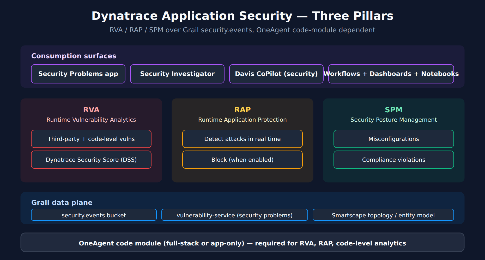

# APPSEC-01: Fundamentals and the Three Pillars of Application Security

> **Series:** APPSEC — Application Security | **Notebook:** 1 of 10 | **Created:** June 2026 | **Last Updated:** 09/18/2026

## Overview

**Dynatrace Application Security** is the platform's security data plane in Gen3 SaaS. It rests on three product pillars — Runtime Vulnerability Analytics (RVA), Runtime Application Protection (RAP), and Security Posture Management (SPM) — and on the same Grail foundation that backs observability data. Findings are first-class entities that flow through workflows, dashboards, and Davis CoPilot like any other Dynatrace signal.

This notebook orients you to the surface area: what each pillar does, what data plane backs it, what OneAgent deployment mode you need, and how the Dynatrace Security Score (DSS) ranks individual vulnerabilities.

**Audience:** Security engineer, platform owner, AppDev lead onboarding to Dynatrace AppSec.

**Outcome:** A mental map of Dynatrace AppSec — and a starting place for any AppSec initiative.



<!-- MARKDOWN_TABLE_ALTERNATIVE
| Pillar | Code | Focus |
|--------|------|-------|
| Runtime Vulnerability Analytics | RVA | Third-party + first-party vulnerabilities with production-execution context |
| Runtime Application Protection | RAP | Real-time attack detection and blocking |
| Security Posture Management | SPM | Misconfiguration / compliance findings |
-->

---

## Table of Contents

1. [The Three Pillars](#three-pillars)
2. [The Data Plane: Grail and the Vulnerability Service](#data-plane)
3. [Deployment-Mode Dependency](#deployment-mode)
4. [Dynatrace Security Score (DSS)](#dss)
5. [The Series Map](#series-map)
6. [Next Steps](#next-steps)
7. [References](#references)

---

## Prerequisites

| Requirement | Details |
|-------------|---------|
| **Dynatrace Environment** | Gen3 SaaS with Grail (Managed not supported for this series) |
| **OneAgent** | Full-Stack monitoring recommended for the full assessment; Infrastructure and Discovery modes give limited vulnerability detection plus RAP, but no environmental DSS adjustment (Discovery also needs code-module injection) — see § 3 |
| **AppSec entitlement** | Application Security must be enabled on the tenant (consumption-billed in DPS) |
| **DQL familiarity** | This series assumes working DQL knowledge. New to DQL? See the SPANS and ORGNZ series first |
| **IAM** | Reader needs at minimum `environment:roles:view-security-problems` and `storage:security.events:read` to follow the queries — see APPSEC-09 for the full permission catalog |

<a id="three-pillars"></a>
## 1. The Three Pillars

Application Security in Gen3 is a single product with three operational surfaces. The pillars are not three separate products you license individually — they share the OneAgent, share the Grail data plane, and share the entity model. What differs is the analysis Dynatrace applies and the kind of finding produced.

### Runtime Vulnerability Analytics (RVA)

Continuously inspects the running process inventory and answers two questions: *which CVEs are reachable from production code paths*, and *which production data assets are exposed to those code paths*. RVA covers both third-party (library) vulnerabilities and code-level (first-party) vulnerabilities where supported.

Distinguishing feature vs scanner-based tools: RVA observes the **executed** code paths, so a CVE in an imported-but-never-called library is de-prioritized automatically. This is the *"reachable"* signal that feeds DSS.

### Runtime Application Protection (RAP)

Sits in the OneAgent code module and watches request traffic for four documented attack classes — SQL injection, command injection, JNDI injection, and SSRF — on Java, .NET, and Go. Each technology's attack control is **Off**, **Monitor** (detect only), or **Block**; custom monitoring rules scoped to process groups or vulnerability types override that global control. Start in Monitor and promote to Block once detection has been tuned (APPSEC-04).

RAP needs deep monitoring of the process — the RAP docs list it as a prerequisite — so processes without deep monitoring produce no detections.

### Security Posture Management (SPM)

Evaluates the configuration state of Kubernetes clusters, cloud accounts (AWS, Azure, GCP), and VMware environments against compliance standards (CIS, PCI DSS, NIST, DORA, and others) and surfaces the results as findings in the same `security.events` table as RVA/RAP events.

Where RVA/RAP are *runtime* signals (what's executing right now), SPM is a *config* signal (what's been declared in the platform).

> <sub>**Sources:** [Application Security (DT docs)](https://docs.dynatrace.com/docs/secure/application-security) for the three-pillar framing and RVA/RAP/SPM definitions; [Runtime Application Protection (DT docs)](https://docs.dynatrace.com/docs/secure/application-security/application-protection) — *"Detection of SQL injection, JNDI injection, command injection, and SSRF attacks"* and *"For Runtime Application Protection to work properly, make sure deep monitoring is enabled"*; [Security Posture Management (DT docs)](https://docs.dynatrace.com/docs/secure/application-security/spm) — *"Security Posture Management provides comprehensive visibility into the security posture of your Kubernetes, cloud, and VMware environments."* (all re-read 09/18/2026). **Derived:** the *runtime vs config* distinction is a synthesis aid; the hub page does not phrase it this way directly.</sub>

<a id="data-plane"></a>
## 2. The Data Plane: Grail and the Vulnerability Service

AppSec produces two kinds of records that you'll query, alert on, and dashboard:

| Surface | Where it lives | How to read it | How to manage it |
|---------|----------------|----------------|------------------|
| **Security events** (RVA state and change events, RAP detection findings, SPM compliance findings) | Grail `security.events` bucket | DQL: `fetch security.events` | Acknowledged through workflows / API; IAM scope: `storage:security.events:read` |
| **Security problems** (deduped, Davis-grouped vulnerabilities) | `vulnerability-service` (not a Grail bucket) | Security Problems UI; API; Davis CoPilot | UI / API; IAM scope: `vulnerability-service:vulnerabilities:read` (programmatic) + `environment:roles:view-security-problems` (UI) |

This split matters for two reasons:

1. **DQL works on events, not problems.** Custom dashboards built on DQL pull from `security.events`. You can't `fetch security.problems` — that surface is exposed via the vulnerability-service API and the Security Problems app.
2. **IAM is dual-surface.** Granting a reviewer access to security problems requires *both* `environment:roles:view-security-problems` (the UI role) and `vulnerability-service:vulnerabilities:read` (the API) if they'll consume via automation. There is no single `storage:security_problems:read` token — see APPSEC-09 for the complete model.

A first DQL to run against your tenant to see what's actually flowing:

```dql
// All security events in the last 24h grouped by event.type
// Use this to discover which event types your tenant is producing
fetch security.events, from:-24h
| summarize count = count(), by:{event.type}
| sort count desc

```

If that query returns rows, AppSec is producing data. If it returns zero rows, either AppSec is not enabled on the tenant, no vulnerabilities have been detected yet, or the OneAgent code module is not attached to your monitored processes.

> <sub>**Sources:** [Application Security (DT docs)](https://docs.dynatrace.com/docs/secure/application-security), [IAM policy statements reference (DT docs)](https://docs.dynatrace.com/docs/manage/identity-access-management/permission-management/manage-user-permissions-policies/advanced/iam-policystatements) for permission-token names verified verbatim. **Softened:** the absence of a `storage:security_problems:read` token reflects the IAM reference as of 06/04/2026; verify in your tenant's policy editor before relying on this gap to inform a policy design.</sub>

<a id="deployment-mode"></a>
## 3. Deployment-Mode Dependency

AppSec coverage is not a license toggle alone — it depends on **how OneAgent is deployed on each host**. The difference between modes is less about *whether* findings appear and more about *how well they are assessed*.

| OneAgent mode | Third-party vulnerabilities | Code-level vulnerabilities | RAP | DSS environmental adjustment | SPM |
|---------------|------------------------------|-----------------------------|-----|------------------------------|-----|
| Full-Stack | ✓ | ✓ | ✓ | ✓ | independent of mode |
| Infrastructure | limited | limited | ✓ | ✗ — DSS equals the CVSS base score | independent of mode |
| Discovery | limited (needs code-module injection) | limited (needs code-module injection) | ✓ (needs code-module injection) | ✗ — DSS equals the CVSS base score | independent of mode |

**Practical implication:** a tenant where most hosts run in Infrastructure or Discovery mode still produces vulnerability findings and RAP detections, but their risk ranking is flat. Without Full-Stack topology, Dynatrace cannot tell whether a vulnerable process is exposed to the public internet or reaches sensitive data assets — those values show as *Not available* — so every finding keeps its CVSS base score. The failure mode is mis-prioritization, not silence: a CVE on an internal batch host ranks the same as one on an internet-facing payment service.

Recommended rollout order: put business-critical, internet-facing workloads on Full-Stack first (or enable code-module injection where Discovery mode is used), let RVA accumulate a baseline (typically 24–72 hours), *then* start prioritizing on DSS. Reading DSS on a fleet that is mostly Infrastructure mode reads CVSS with a different label.

> <sub>**Sources:** [Application Security (DT docs)](https://docs.dynatrace.com/docs/secure/application-security) — the *Monitoring modes coverage* table (third-party and code-level detection *limited* in Infrastructure and Discovery; RAP in all three), *"In an Infrastructure Monitoring deployment, Dynatrace Intelligence cannot adapt the Dynatrace Security Score"*, *"the DSS will be the same as the CVSS base score"*, *"Infrastructure Monitoring mode lacks environmental information, such as reachable data assets or public internet exposure"*, *"For Application Security to work in Discovery mode, after enabling Discovery mode, you also need to enable code-module injection."*, and *"Dynatrace Security Posture Management (SPM) works independently of monitoring modes."* (re-read 09/18/2026). **Softened:** the 24–72 hour baseline is community-practice guidance — verify against your environment's vulnerability cadence.</sub>

<a id="dss"></a>
## 4. Dynatrace Security Score (DSS)

DSS is a **per-vulnerability** risk score (1–10) that starts from the CVSS base score and adjusts it with environmental context from your topology. It is not a tenant-wide posture number: every vulnerability carries its own DSS. In Grail the score is `vulnerability.davis_assessment.score` and its level is `vulnerability.risk.level` (the semantic dictionary still describes the score as the *Davis Security Score*). A higher DSS means a more severe vulnerability.

Environmental context that adjusts the score:

- **Public internet exposure** — a vulnerable process reachable from the public internet is rated higher than the same vulnerability on an internal-only process. One caveat: on Linux hosts where topology cannot supply this, exposure is detected via eBPF instead, and those eBPF-derived states (*Public network* / *Not detected*) do **not** influence DSS.
- **Reachable data assets** — does the vulnerable process actually touch the database / file storage / message bus where sensitive data lives?
- **Related-entity analysis** — Smartscape topology context: upstream/downstream services, data flows.

Where that context is missing — hosts in Infrastructure or Discovery mode (§ 3) — no adjustment happens and DSS equals the CVSS base score.

What's not published: the exact weighting formula.

**How to consume DSS in practice:**

- Use the per-vulnerability DSS to **prioritize** — work the CRITICAL and HIGH levels first.
- To **trend posture**, count open vulnerabilities per DSS level and chart the counts over time (the APPSEC-02 § 3 query, run on a schedule). Rising CRITICAL/HIGH counts are deterioration; falling counts are progress.
- Pair those counts with the backlog burn-rate from APPSEC-08: a rising count with a flat close rate means remediation is not keeping up.
- Don't set absolute count thresholds across business units without normalizing for estate size and monitoring-mode coverage — a Full-Stack estate surfaces more adjusted-upward findings than an Infrastructure-mode one.

> <sub>**Sources:** [Vulnerabilities concepts (DT docs)](https://docs.dynatrace.com/docs/secure/vulnerabilities/concepts) — *"This scoring system forms the foundation for the Dynatrace Security Score (DSS), which adds environmental context to help prioritize remediation."*; [Application Security (DT docs)](https://docs.dynatrace.com/docs/secure/application-security) for the environmental signals and *"public internet exposure is detected via eBPF. Potential states are Public network and Not detected. Dynatrace Security Score isn't influenced by either of these states."* (re-read 09/18/2026). **Dictionary:** `vulnerability.davis_assessment.score` (`stable`), `vulnerability.risk.level` (`stable`), read 09/18/2026. **Softened:** the cross-unit normalization guidance is community practice.</sub>

<a id="series-map"></a>
## 5. The Series Map

Where to go next depending on what you're trying to do.

| # | Notebook | When to read |
|---|----------|--------------|
| **02** | Runtime Vulnerability Analytics | You need to triage third-party vulnerabilities by reachability + exposure |
| **03** | Code-Level Vulnerability Analytics | You're responsible for first-party application code and need to action vulnerable-function findings |
| **04** | Runtime Application Protection | You're setting up RAP detection rules and deciding when to promote to blocking |
| **05** | Security Posture Management | You're auditing configuration drift against CIS/PCI/NIST baselines |
| **06** | Kubernetes & Container Security | You're running workloads under DynaKube and need image + cluster posture together |
| **07** | Security Investigator & Davis CoPilot for Security | You're conducting an investigation and want AI-assisted pivots |
| **08** | Workflows, Notifications & Remediation | You need security problems to reach Jira / ServiceNow / PagerDuty / Slack |
| **09** | IAM and Gen3 Permissions for AppSec | You're designing the permission model — who can see what, who can manage what |
| **10** | Dashboards, Reporting & Governance | You're building the executive view and governance cadence |

If you're net-new to AppSec on this tenant: read 01 → 09 (IAM) → 02 (RVA) → 04 (RAP) → 10 (dashboards). IAM comes early because rolling out AppSec to users without a permission plan creates either over-exposure of sensitive payloads or under-exposure that blocks the SOC.

<a id="next-steps"></a>
## 6. Next Steps

1. **Verify AppSec is producing data** — run the `fetch security.events` query above. If it returns zero rows, work the enablement and deployment-mode questions before continuing.
2. **Map your OneAgent coverage** — for each business-critical workload, confirm Full-Stack mode; Infrastructure and Discovery hosts still report findings, but without the environmental DSS adjustment (§ 3).
3. **Read APPSEC-09 next** — get the permission model right before granting the SOC access to security problems. Mistakes here are reversible but visible.
4. **Then read APPSEC-02** — third-party vulnerabilities are usually the loudest finding type at first, so triaging RVA is where most AppSec rollouts start producing measurable signal.

<a id="references"></a>
## 7. References

| Source | Coverage |
|--------|----------|
| [Application Security (DT docs)](https://docs.dynatrace.com/docs/secure/application-security) | Three-pillar hub page; DSS signals; monitoring-modes coverage table |
| [Vulnerabilities concepts (DT docs)](https://docs.dynatrace.com/docs/secure/vulnerabilities/concepts) | DSS as a per-vulnerability score built on CVSS |
| [Runtime Application Protection (DT docs)](https://docs.dynatrace.com/docs/secure/application-security/application-protection) | RAP attack classes, supported technologies, attack control |
| [Security Posture Management (DT docs)](https://docs.dynatrace.com/docs/secure/application-security/spm) | SPM flavors (KSPM / CSPM / VSPM) and compliance standards |
| [Secure (DT docs)](https://docs.dynatrace.com/docs/secure) | Top-level Secure navigation |
| [Secure / FAQ (DT docs)](https://docs.dynatrace.com/docs/secure/faq) | Official AppSec FAQ |
| [IAM policy statements reference (DT docs)](https://docs.dynatrace.com/docs/manage/identity-access-management/permission-management/manage-user-permissions-policies/advanced/iam-policystatements) | Verified AppSec permission tokens |

---

> <sub>**⚠️ DISCLAIMER**: This information was AI generated and is provided "as-is" without warranty. It was produced as an independent, community-driven project and **not supported by Dynatrace**. Always refer to official [Dynatrace documentation](https://docs.dynatrace.com/docs) for the most current information.</sub>
