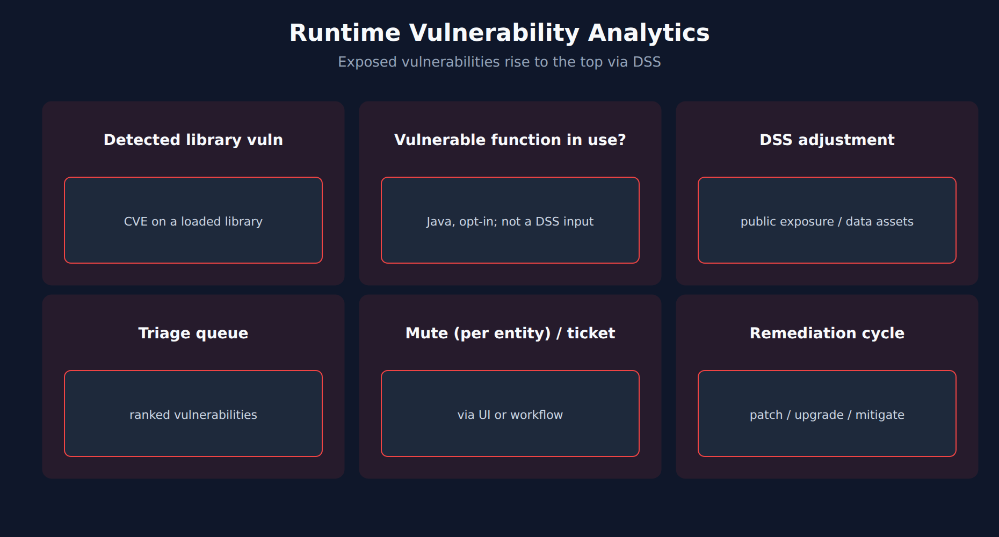

# APPSEC-02: Runtime Vulnerability Analytics

> **Series:** APPSEC — Application Security | **Notebook:** 2 of 10 | **Created:** June 2026 | **Last Updated:** 10/02/2026

## Overview

**Runtime Vulnerability Analytics (RVA)** is the pillar of Dynatrace AppSec that continuously inspects running processes and answers: *which CVEs are reachable from production code paths, and which production data assets are exposed to those code paths?* This notebook covers third-party (library) vulnerability detection — the loudest, highest-volume signal in most AppSec rollouts. Code-level (first-party) vulnerabilities are covered in APPSEC-03.

The distinguishing capability vs scanner-based tools: RVA reports a vulnerability only for components a running process has actually loaded, not for every declared dependency. For Java, the optional *Java vulnerable function reporting* OneAgent feature also shows whether the vulnerable function is in use — a triage filter, not a DSS input.



<!-- MARKDOWN_TABLE_ALTERNATIVE
| Layer | Signal | Action |
|-------|--------|--------|
| Library loaded | CVE matched | Catalog |
| Vulnerable function in use (Java, opt-in) | Function called | Triage filter (not a DSS input) |
| Exposed | Public internet / database access | DSS stays high — remediate first |
-->

---

## Table of Contents

1. [1. What RVA Detects](#what-rva-detects)
2. [2. Loaded, In Use, Exposed](#reachability-signal)
3. [3. Triage with DQL](#triage-dql)
4. [4. Triage by Affected Entity](#triage-by-entity)
5. [5. Acknowledge / Mute / Exception Lifecycle](#lifecycle)
6. [6. Next Steps](#next)
7. [References](#references)

---

## Prerequisites

| Requirement | Details |
|-------------|---------|
| **Dynatrace Environment** | Gen3 SaaS with Grail; AppSec entitlement enabled |
| **OneAgent** | Full-Stack mode (or code-module attached) on monitored hosts |
| **Read access** | To run the DQL: `storage:security.events:read` **plus** `storage:buckets:read` (a table permission alone reads nothing). The Vulnerabilities and Threats & Exploits apps have their own requirements — see APPSEC-09 for the full model |
| **Background** | APPSEC-01 (fundamentals + three-pillar framing) |

<a id="what-rva-detects"></a>
## 1. What RVA Detects

> **Broader malicious-package coverage in RVA (SaaS 1.344, released 07/29/2026 — staged rollout).** Malicious package detection coverage in the Dynatrace Vulnerability Feed has been expanded. These records use the same structure as vulnerability records, so they arrive through the same `security.events` surface used throughout this notebook; titles begin with *Malicious code* and each record carries CWE-506 (Embedded Malicious Code). The distinction matters for triage: a CVE is a defect in legitimate software and is scored on exploitability and reachability, whereas a malicious package is hostile by construction — the reachability question that governs CVE prioritisation below does not soften it, and the response is removal, not patching.
>
> <sub>Source: [What's new in Dynatrace SaaS 1.344 (DT docs)](https://docs.dynatrace.com/docs/whats-new/saas/sprint-344) — *"Malicious package detection coverage in the Dynatrace Vulnerability Feed has been expanded."* and *"Titles begin with Malicious code to distinguish them from known vulnerabilities."*</sub>

RVA continuously inventories libraries loaded by monitored processes, correlates them against vulnerability feeds, and produces two kinds of records:

| Record | Where | What it represents |
|--------|-------|--------------------|
| **Security events** | Grail `security.events` | Periodic state snapshots (`VULNERABILITY_STATE_REPORT_EVENT`) and status transitions (`VULNERABILITY_STATUS_CHANGE_EVENT`), each at two levels: per vulnerability (`event.level == "VULNERABILITY"`) and per affected entity (`event.level == "ENTITY"`) |
| **Security problem** | `vulnerability-service` | Deduped, Davis-grouped view of one underlying CVE across all affected entities |

A single CVE in `log4j-core-2.14.1` running on 47 hosts is **one security problem** with 47 affected entities — and, in Grail, a recurring stream of snapshots at both levels.

Practical implication: RVA re-reports the open state of every vulnerability at regular intervals, so a raw `count()` of state events grows with the time window and the re-report frequency, not with the number of vulnerabilities. Every DQL query in this series therefore picks one `event.level`, keeps the **latest** snapshot per vulnerability (or per vulnerability + entity), and only then counts.

> <sub>**Sources:** [Application Security (DT docs)](https://docs.dynatrace.com/docs/secure/application-security) for the RVA framing; [Vulnerability events (DT semantic dictionary)](https://docs.dynatrace.com/docs/semantic-dictionary/model/security-events/vulnerability) — *"An entity state event is a periodic snapshot, emitted by Dynatrace Runtime Vulnerability Analytics (RVA), of a vulnerability's current status on a single affected entity."* and *"RVA re-reports the open state at regular intervals and reports a resolved state once"* (re-read 09/18/2026).</sub>

<a id="reachability-signal"></a>
## 2. Loaded, In Use, Exposed

RVA's prioritization model has three layers. From least to most actionable:

1. **Library loaded** — a running process has loaded the vulnerable component. RVA reports only these, which already removes declared-but-unloaded dependencies from a scanner's list.
2. **Vulnerable function in use** (Java only, opt-in) — with the *Java vulnerable function reporting* OneAgent feature enabled, `vulnerability.davis_assessment.vulnerable_function_status` is `IN_USE`, `NOT_IN_USE` or `NOT_AVAILABLE`. Use it to filter triage. It is **not** a DSS input, so nothing is de-prioritized automatically — you have to filter on it.
3. **Exposed** — the affected process is reachable from the public internet or has database access. These are the DSS inputs: without them DSS is lowered from the CVSS base score (APPSEC-01 § 4). This is the smallest set, and the one to remediate first.

> <sub>**Sources:** [Vulnerability Analytics (DT docs)](https://docs.dynatrace.com/docs/secure/application-security/vulnerability-analytics) — *"Issues a vulnerability only when the component is in use."*; [Vulnerabilities concepts (DT docs)](https://docs.dynatrace.com/docs/secure/vulnerabilities/concepts) — a vulnerable function is *"One of the risk factors to consider when evaluating a vulnerability (yet they are not considered for the DSS calculation)"*; [Secure FAQ (DT docs)](https://docs.dynatrace.com/docs/secure/faq) — *"If the Dynatrace Vulnerability feed provides information about the vulnerable function, and OneAgent monitoring for Java vulnerable functions is enabled, OneAgent determines whether the vulnerable function is in use."* (all re-read 10/02/2026). **Dictionary:** `vulnerability.davis_assessment.vulnerable_function_status` (`stable`; `IN_USE ; NOT_AVAILABLE ; NOT_IN_USE`), read 10/02/2026.</sub>

<a id="triage-dql"></a>
## 3. Triage with DQL

The **Vulnerabilities** app is the day-to-day triage surface, but DQL gives you fleet-wide rollups the UI cannot. Two patterns to know. The first counts **current open vulnerabilities by risk level** — the vulnerability-level snapshot, deduplicated to the latest record per vulnerability, then filtered to open and not muted.

```dql
// Current open vulnerabilities by risk level (latest snapshot per vulnerability)
fetch security.events, from:-7d
| filter event.provider == "Dynatrace"
| filter event.category == "VULNERABILITY_MANAGEMENT"
| filter event.type == "VULNERABILITY_STATE_REPORT_EVENT"
| filter event.level == "VULNERABILITY"
| dedup {vulnerability.display_id}, sort:{timestamp desc}
| filter vulnerability.resolution.status == "OPEN"
| filter vulnerability.mute.status == "NOT_MUTED"
| summarize open = count(), by:{vulnerability.risk.level}
| sort open desc

```

<a id="triage-by-entity"></a>
## 4. Triage by Affected Entity

A second pattern: which process groups and hosts are carrying the most open vulnerabilities right now? This is the cheapest way to find a stale base image or unmaintained dependency. It uses the **entity-level** snapshot, deduplicated per vulnerability + affected entity.

```dql
// Top affected entities by current open vulnerabilities (latest snapshot per vulnerability + entity)
fetch security.events, from:-7d
| filter event.provider == "Dynatrace"
| filter event.category == "VULNERABILITY_MANAGEMENT"
| filter event.type == "VULNERABILITY_STATE_REPORT_EVENT"
| filter event.level == "ENTITY"
| dedup {vulnerability.display_id, affected_entity.id}, sort:{timestamp desc}
| filter vulnerability.resolution.status == "OPEN"
| filter vulnerability.mute.status == "NOT_MUTED"
| summarize open = count(), by:{affected_entity.name, vulnerability.risk.level}
| sort open desc
| limit 25

```

> **Validation note:** both queries were validated for syntax and field names on 09/18/2026 and execute cleanly; the validation tenant has no RVA data, so they returned 0 rows there. The dedup-then-filter logic was additionally exercised on synthetic records. Expect real counts only on a tenant with RVA enabled.
>
> <sub>**Sources:** [Vulnerability events (DT semantic dictionary)](https://docs.dynatrace.com/docs/semantic-dictionary/model/security-events/vulnerability) — the event types, `event.level` values, and dedup pattern follow the page's own queries; *"A vulnerability state event is a periodic snapshot, emitted by Dynatrace Runtime Vulnerability Analytics (RVA), of a vulnerability's current status and risk aggregated across every entity it affects."* (re-read 09/18/2026). **Dictionary:** `vulnerability.risk.level` (`stable`), `vulnerability.resolution.status` (`stable`), `vulnerability.mute.status` (`stable`), `vulnerability.display_id` (`stable`), `event.provider` (`stable`), `event.type` (`stable`), read 09/18/2026; `event.level`, `event.category`, `affected_entity.id` and `affected_entity.name` are documented as `stable` on the page above.</sub>

<a id="lifecycle"></a>
## 5. Acknowledge / Mute / Exception Lifecycle

The product has three vulnerability states. **Open** — the vulnerability is active. **Resolved** — closed automatically because the root cause is no longer present. **Muted (Open)** — still active, but every affected entity was muted by request. Muting is per affected entity and is **not** the same as fixing: muted vulnerabilities still appear in audit queries.

*Acknowledge* and *exception* are not product states. In community practice they are conventions layered on top:
- **Acknowledge** = triaged and ticketed (Jira/ServiceNow link captured in the workflow — see APPSEC-08).
- **Mute** only when the CVE is genuinely false-positive or a compensating control is in place. Always capture the reason; the audit trail is the artifact.
- **Exception** = time-boxed accepted risk (waiting on a vendor patch), recorded as a mute reason or a ticket, paired with an SLA reminder so it expires.

For governance reporting, treat open, not-muted vulnerabilities without a ticket as the open backlog.

> <sub>**Sources:** [Vulnerabilities concepts (DT docs)](https://docs.dynatrace.com/docs/secure/vulnerabilities/concepts) — *"Muted (Open) The vulnerability is active but all its affected entities were muted by request."* (re-read 10/02/2026). **Softened:** the *acknowledge vs mute vs exception* discipline is community practice — the docs define the states, not the governance recipe.</sub>

<a id="next"></a>
## 6. Next Steps

1. Run the two DQL queries above against your tenant. Zero rows means either no RVA data (check enablement) or no open vulnerabilities — confirm with `fetch security.events, from:-7d | summarize n = count(), by:{event.type}` before concluding.
2. Read **APPSEC-03** for first-party (code-level) vulnerability analytics — same Grail surface, different finding type.
3. Read **APPSEC-08** for the workflow patterns that route RVA findings to your ticketing system.
4. Read **APPSEC-09** before granting the SOC write access to vulnerabilities — the privacy-sensitive carve-outs matter.

<a id="references"></a>
## References

| Source | Coverage |
|--------|----------|
| [Application Security (DT docs)](https://docs.dynatrace.com/docs/secure/application-security) | Three-pillar hub including RVA |
| [Vulnerability events (DT semantic dictionary)](https://docs.dynatrace.com/docs/semantic-dictionary/model/security-events/vulnerability) | Event types, `event.level`, field definitions and stability for RVA records |
| [What's new in Dynatrace SaaS 1.344 (DT docs)](https://docs.dynatrace.com/docs/whats-new/saas/sprint-344) | Expanded malicious-package coverage |
| [Secure / FAQ (DT docs)](https://docs.dynatrace.com/docs/secure/faq) | Official AppSec FAQ |
| [IAM policy statements reference (DT docs)](https://docs.dynatrace.com/docs/manage/identity-access-management/permission-management/manage-user-permissions-policies/advanced/iam-policystatements) | Permission tokens for security data |

---

> <sub>**⚠️ DISCLAIMER**: This information was AI generated and is provided "as-is" without warranty. It was produced as an independent, community-driven project and **not supported by Dynatrace**. Always refer to official [Dynatrace documentation](https://docs.dynatrace.com/docs) for the most current information.</sub>
