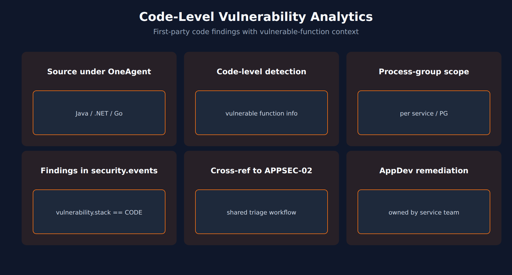

# APPSEC-03: Code-Level Vulnerability Analytics

> **Series:** APPSEC — Application Security | **Notebook:** 3 of 10 | **Created:** June 2026 | **Last Updated:** 09/18/2026

## Overview

**Code-Level Vulnerability Analytics** is the first-party counterpart to APPSEC-02's third-party (library) scope. Where RVA's library tier asks "which dependencies have known CVEs?", the code-level tier asks "which patterns in your own application code are vulnerable to known attack classes?"

This is the pillar where AppDev teams own remediation directly — there's no upstream library to upgrade, just code to change. Coverage depends on the runtime — code-level detection is documented for Java, .NET, and Go only — and on the OneAgent code module being attached.



<!-- MARKDOWN_TABLE_ALTERNATIVE
| Runtime | Code-level detection |
|---------|----------------------|
| Java 8+ | Supported (OneAgent 1.259) |
| .NET | Supported (OneAgent 1.289) |
| Go | Supported (OneAgent 1.311) |
| Node.js / Python / PHP | Third-party detection only |
| Ruby | Not supported |
-->

---

## Table of Contents

1. [1. First-Party vs Third-Party](#first-vs-third)
2. [2. Supported Runtimes](#runtimes)
3. [3. Vulnerable Function Information](#vulnerable-function)
4. [4. DQL: Code-Level Findings](#dql-code-level)
5. [5. Process-Group Scoping](#process-group)
6. [6. Next Steps](#next)
7. [References](#references)

---

## Prerequisites

| Requirement | Details |
|-------------|---------|
| **Dynatrace Environment** | Gen3 SaaS with Grail; AppSec entitlement enabled |
| **OneAgent** | Full-Stack mode (or code-module attached) on monitored hosts |
| **Read access** | At minimum `environment:roles:view-security-problems` and `storage:security.events:read` — see APPSEC-09 for the full model |
| **Background** | APPSEC-01 (fundamentals + three-pillar framing) |

<a id="first-vs-third"></a>
## 1. First-Party vs Third-Party

Both kinds of findings land in the same Grail bucket (`security.events`) and the same Security Problems surface, but they're not the same thing:

| Dimension | Third-party (APPSEC-02) | Code-level (this notebook) |
|-----------|-------------------------|-----------------------------|
| What's vulnerable | An imported library (a CVE record) | A pattern in your own source code |
| Remediation | Upgrade / patch / replace dep | Code change + redeploy |
| Owner | Platform / dependency lead | Service / AppDev team |
| Volume | High (every CVE feed update) | Lower (per-class, per-pattern detections) |
| Reachability signal | Same RVA reachability model | Inherent — code-level findings only fire on executed code |

In practice these belong on the same dashboard but in separate queues — confusing the two slows remediation because the wrong team gets paged.

> <sub>**Sources:** [Application Security (DT docs)](https://docs.dynatrace.com/docs/secure/application-security) for the third-party + code-level scope confirmation. **Derived:** the side-by-side comparison and team-ownership framing is a synthesis.</sub>

<a id="runtimes"></a>
## 2. Supported Runtimes

Code-level analytics requires deep introspection into the running application, so it is documented for a narrower set of runtimes than third-party (library) detection.

| Runtime | Code-level detection | Minimum OneAgent | Notes |
|---------|----------------------|------------------|-------|
| Java 8 or higher | ✓ | 1.259 | Windows x86 and Linux x86 only |
| .NET | ✓ | 1.289 | .NET Framework 4.5, .NET Core 3.0 or higher, 64-bit processes only; deep monitoring must be enabled manually per host |
| Go | ✓ | 1.311 | Deep monitoring must be enabled manually per host |

**Node.js, Python and PHP** have third-party (library) detection only — no code-level detection. **Ruby** has neither.

Code-level analytics is also opt-in: enable *Code-level Vulnerability Analytics* in the Application Security settings, then set the per-technology detection control (Monitor / Do not monitor), which custom rules per process group can override (§ 5).

The support matrix updates per OneAgent release — re-verify against the docs at rollout time for each runtime you care about.

> <sub>**Sources:** [Runtime Vulnerability Analytics (DT docs)](https://docs.dynatrace.com/docs/secure/application-security/vulnerability-analytics) — the *Supported technologies* tables for third-party and code-level detection, *"Dynatrace detects code-level vulnerabilities in the following technologies."*, *"Only .NET Framework 4.5, .NET Core 3.0 or higher, and 64-bit processes are supported."*, and *"custom rules override the global detection control for the selected technology"* (re-read 09/18/2026).</sub>

<a id="vulnerable-function"></a>
## 3. Vulnerable Function Information

When a code-level finding fires, RVA can attach the specific function or method involved — not just "an SQL-injection-shaped pattern in this service" but "this method in this file in this commit." This is what turns a finding into a one-line task for the developer.

Two things to verify when you onboard code-level coverage:

1. **Vulnerable-function info is populated** for your runtime. If the field is null, the finding is harder to action.
2. **Service ownership is mapped** in Dynatrace (via tags or naming convention) so the workflow in APPSEC-08 can route the ticket to the right AppDev team automatically.

> <sub>**Sources:** [Application Security (DT docs)](https://docs.dynatrace.com/docs/secure/application-security) for the framing of vulnerable function info. **Softened:** how much vulnerable-function detail is populated varies by runtime — confirm it on a sample finding before building routing on it.</sub>

<a id="dql-code-level"></a>
## 4. DQL: Code-Level Findings

Code-level findings are the same `VULNERABILITY_STATE_REPORT_EVENT` records as third-party ones, distinguished by `vulnerability.stack == "CODE"` (an `experimental` field; library findings carry `CODE_LIBRARY`). Do **not** filter on `vulnerability.type` for this — that field is a CWE-style classification, so a filter such as `vulnerability.type == "CODE_LEVEL"` is valid DQL that silently matches nothing.

The query uses the entity-level snapshot, keeps the latest record per vulnerability + affected entity, and counts what is still open.

```dql
// Code-level vulnerabilities currently open, by affected entity (latest snapshot)
fetch security.events, from:-7d
| filter event.provider == "Dynatrace"
| filter event.category == "VULNERABILITY_MANAGEMENT"
| filter event.type == "VULNERABILITY_STATE_REPORT_EVENT"
| filter event.level == "ENTITY"
| filter vulnerability.stack == "CODE"
| dedup {vulnerability.display_id, affected_entity.id}, sort:{timestamp desc}
| filter vulnerability.resolution.status == "OPEN"
| filter vulnerability.mute.status == "NOT_MUTED"
| summarize open = count(), by:{affected_entity.name, vulnerability.risk.level}
| sort open desc

```

> **Validation note:** validated for syntax and field names on 09/18/2026 and executes cleanly; the validation tenant has no RVA data, so it returned 0 rows there. Expect real counts only on a tenant with code-level vulnerability detection enabled.
>
> <sub>**Sources:** [Vulnerability events (DT semantic dictionary)](https://docs.dynatrace.com/docs/semantic-dictionary/model/security-events/vulnerability) — `vulnerability.stack` examples `CODE ; CODE_LIBRARY ; SOFTWARE ; CONTAINER_ORCHESTRATION` (re-read 09/18/2026). **Dictionary:** `vulnerability.stack` (`experimental`) — *"Level of the vulnerable component in the technological stack."*; `vulnerability.type` (`stable`) — *"Classification of the vulnerability based on commonly accepted enums, such as CWE."*; `vulnerability.risk.level`, `vulnerability.resolution.status`, `vulnerability.mute.status`, `vulnerability.display_id` (all `stable`), read 09/18/2026.</sub>

<a id="process-group"></a>
## 5. Process-Group Scoping

Code-level coverage is enabled per process group (PG) in many tenants. This matters operationally:

- A PG with code-level disabled produces *zero* code-level findings — easily mistaken for "this service is secure."
- Rolling out code-level coverage incrementally (per service, per team) is safer than flipping it tenant-wide.
- Confirm code-level coverage status as a regular item in the AppSec governance review (APPSEC-10) — coverage drift is a known posture risk.

> <sub>**Sources:** [Application Security (DT docs)](https://docs.dynatrace.com/docs/secure/application-security) for the process-group / code-module dependency framing. **Softened:** the *coverage as governance check* recipe is community practice.</sub>

<a id="next"></a>
## 6. Next Steps

1. Confirm code-level coverage on the runtimes you care about — don't infer from APPSEC-02's volume.
2. Verify vulnerable-function info is populated in a sample finding.
3. Read **APPSEC-08** to wire findings to AppDev team ticket queues.
4. Read **APPSEC-09** so AppDev gets the narrow-scoped read access they need without seeing other teams' findings.

<a id="references"></a>
## References

| Source | Coverage |
|--------|----------|
| [Application Security (DT docs)](https://docs.dynatrace.com/docs/secure/application-security) | Code-level scope reference |
| [Runtime Vulnerability Analytics (DT docs)](https://docs.dynatrace.com/docs/secure/application-security/vulnerability-analytics) | Supported technologies for third-party and code-level detection |
| [Vulnerability events (DT semantic dictionary)](https://docs.dynatrace.com/docs/semantic-dictionary/model/security-events/vulnerability) | `vulnerability.stack` and related fields |
| [IAM policy statements reference (DT docs)](https://docs.dynatrace.com/docs/manage/identity-access-management/permission-management/manage-user-permissions-policies/advanced/iam-policystatements) | Permission tokens |

---

> <sub>**⚠️ DISCLAIMER**: This information was AI generated and is provided "as-is" without warranty. It was produced as an independent, community-driven project and **not supported by Dynatrace**. Always refer to official [Dynatrace documentation](https://docs.dynatrace.com/docs) for the most current information.</sub>
