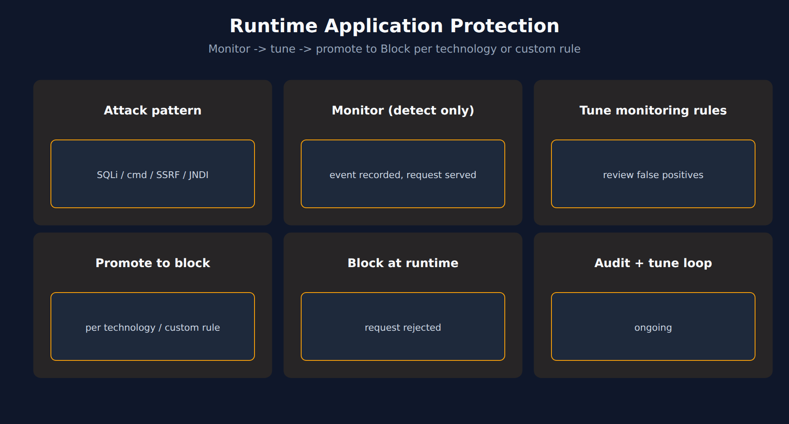

# APPSEC-04: Runtime Application Protection

> **Series:** APPSEC — Application Security | **Notebook:** 4 of 10 | **Created:** June 2026 | **Last Updated:** 09/18/2026

## Overview

**Runtime Application Protection (RAP)** sits in the OneAgent code module and watches request traffic for four documented attack classes — SQL injection, command injection, JNDI injection, and SSRF — on Java, .NET, and Go. Each technology's attack control is **Off**, **Monitor** (detect only), or **Block**, and custom monitoring rules scoped to process groups or vulnerability types override that global control. Run in Monitor first and promote to Block once detection has been tuned.

RAP is unique among the AppSec pillars in that it has a *real-time enforcement* dimension. RVA and SPM tell you what's wrong; RAP can stop the request mid-flight. This power is also the reason the rollout discipline matters — blocking the wrong traffic is a customer-visible incident.



<!-- MARKDOWN_TABLE_ALTERNATIVE
| Stage | Mode | Cost of FP |
|-------|------|-------------|
| Day 1-30 | Monitor | Dashboard noise |
| Day 30-60 | Monitor + tune | Operator time |
| Day 60+ | Promote to Block per custom rule, then per technology | Customer-visible 5xx |
-->

---

## Table of Contents

1. [1. How RAP Works in the OneAgent](#how-it-works)
2. [2. Attack Types Covered](#attack-types)
3. [3. Detection vs Blocking Modes](#detect-vs-block)
4. [4. DQL: RAP Detections](#dql-attacks)
5. [5. Attacks Per Service](#dql-attacks-per-svc)
6. [6. Next Steps](#next)
7. [References](#references)

---

## Prerequisites

| Requirement | Details |
|-------------|---------|
| **Dynatrace Environment** | Gen3 SaaS with Grail; AppSec entitlement enabled |
| **OneAgent** | Full-Stack mode (or code-module attached) on monitored hosts |
| **Read access** | At minimum `environment:roles:view-security-problems` and `storage:security.events:read` — see APPSEC-09 for the full model |
| **Background** | APPSEC-01 (fundamentals + three-pillar framing) |

<a id="how-it-works"></a>
## 1. How RAP Works in the OneAgent

RAP is part of the same code-module instrumentation that powers code-level RVA. When a request enters a monitored process:

1. The code module sees the request and the application's intent (SQL it's about to execute, OS command it's about to spawn, etc.).
2. RAP compares the request payload + intent against attack-pattern signatures.
3. If a match fires:
   - In **Monitor** mode: a detection finding (`event.type == "DETECTION_FINDING"`, `product.name == "Runtime Application Protection"`) is recorded in `security.events`; the request continues.
   - In **Block** mode: the request is rejected before the dangerous operation executes; a detection finding is still recorded.

Crucially, RAP makes the call **after** the request has been parsed but **before** the dangerous operation runs. This is why pattern fidelity is higher than network-layer WAF detection — RAP sees the actual SQL string, not just the HTTP body.

> <sub>**Sources:** [Runtime Application Protection (DT docs)](https://docs.dynatrace.com/docs/secure/application-security/application-protection) — *"Dynatrace OneAgent tracks user input and analyzes how it interacts with sensitive code paths, such as SQL queries, OS commands, or JNDI lookups."* and *"If attack blocking is enabled, OneAgent throws an exception to stop the malicious request before it executes."*; [Detection events (DT semantic dictionary)](https://docs.dynatrace.com/docs/semantic-dictionary/model/security-events/detection) — *"A detection finding generated by Dynatrace Runtime Application Protection, reporting a blocked SQL injection attempt against a Node.js process."* (both re-read 09/18/2026). **Softened:** the comparison with network-layer WAF fidelity is community-practice framing.</sub>

<a id="attack-types"></a>
## 2. Attack Types Covered

The documented attack catalog covers four classes:

- **SQL Injection** — untrusted input reaching a SQL query
- **Command Injection** — OS command spawned with untrusted input
- **SSRF (Server-Side Request Forgery)** — outbound requests with untrusted target URLs (with OneAgent 1.309+, SSRF attack evaluation must also be enabled in the OneAgent features settings)
- **JNDI Injection** — Log4Shell-class lookups

Other runtime attack classes — path traversal, for example — are **not** in the documented catalog; do not assume RAP protects against them.

Supported technologies: **Java 8+, .NET, and Go** — see the RAP docs for the minimum OneAgent version per technology. The catalog evolves per OneAgent release; re-check the docs rather than inferring it from a static document.

> <sub>**Sources:** [Runtime Application Protection (DT docs)](https://docs.dynatrace.com/docs/secure/application-security/application-protection) — *"Detection of SQL injection, JNDI injection, command injection, and SSRF attacks"*, plus the page's *Supported technologies* table (Java 8 or higher, .NET, Go) and its SSRF enablement step (re-read 09/18/2026).</sub>

<a id="detect-vs-block"></a>
## 3. Detection vs Blocking Modes

The transition from Monitor to Block is the most important operational decision in RAP. The cost asymmetry is large: false-positive in Monitor = noise in a dashboard; false-positive in Block = HTTP 5xx and customer-visible incident.

Recommended rollout pattern:

1. **Day 1–30: Monitor only.** Let RAP observe production traffic. Build a baseline of detection volume and false-positive patterns.
2. **Day 30–60: per-class and per-process-group analysis.** Identify which attack classes and process groups produce only real attacks (high precision) vs which fire on legitimate traffic too. Tune or exclude the noisy ones.
3. **Day 60+: promote selectively to Block.** Start with high-precision rules in lower-traffic environments. Promote in production only after staging-environment data confirms zero false positives.

Blocking is set per technology in the global attack control (**Off** / **Monitor** / **Block**) and can be overridden by custom monitoring rules scoped to process groups or vulnerability types. Promote through custom rules first — one process group at a time — and change the global control for a technology only once its custom rules have proven clean. Treat it as a release process, not a configuration change.

> <sub>**Sources:** [Runtime Application Protection (DT docs)](https://docs.dynatrace.com/docs/secure/application-security/application-protection) — *"Block; incoming attacks detected and blocked."* and *"the custom rules override the global attack control for the selected technology"* (re-read 09/18/2026). **Softened:** the day-30/60/60+ phasing and the "release process not config change" guidance are community practice — verify the cadence against your traffic volume.</sub>

<a id="dql-attacks"></a>
## 4. DQL: RAP Detections

RAP findings are `DETECTION_FINDING` records whose `product.name` is `Runtime Application Protection`; the attack class is in `finding.type` (for example `SQL injection`) and the normalized severity in `dt.security.risk.level`. There is no `ATTACK_EVENT` type and no `attack.*` fields — a query built on them is valid DQL that returns zero rows forever. Two patterns for monitoring RAP volume in dashboards.

```dql
// RAP detections by attack class and risk level, last 24h
fetch security.events, from:-24h
| filter event.type == "DETECTION_FINDING"
| filter product.name == "Runtime Application Protection"
| summarize detections = count(), by:{finding.type, dt.security.risk.level}
| sort detections desc

```

<a id="dql-attacks-per-svc"></a>
## 5. Attacks Per Service

Which processes are being attacked most? Often the answer guides which process groups to promote to Block first. RAP records the targeted process in `object.name` (with `object.type == "PROCESS"`).

```dql
// RAP detections per targeted process, last 24h
fetch security.events, from:-24h
| filter event.type == "DETECTION_FINDING"
| filter product.name == "Runtime Application Protection"
| summarize detections = count(), by:{object.name, finding.type}
| sort detections desc
| limit 25

```

> **Validation note:** both queries were validated for syntax and field names on 09/18/2026 and execute cleanly; the validation tenant has no RAP data, so they returned 0 rows there.
>
> <sub>**Sources:** [Detection events (DT semantic dictionary)](https://docs.dynatrace.com/docs/semantic-dictionary/model/security-events/detection) — `event.type` `DETECTION_FINDING`, its RAP example record (`"product.name" : "Runtime Application Protection"`, `"finding.type" : "SQL injection"`, `"object.type" : "PROCESS"`), and *"A detection finding is an alert raised by a security tool or a Dynatrace detection rule when it observes suspicious or malicious activity"* (re-read 09/18/2026). **Dictionary:** no row for any `attack.*` field under `filter startsWith(name, "attack")`, read 09/18/2026 (control: the same query shape on `"vulnerability"` → 70 rows).</sub>

<a id="next"></a>
## 6. Next Steps

1. Confirm RAP is producing `DETECTION_FINDING` records by running the queries above. Zero rows can mean no attacks in the window — widen it to `from:-30d` first; if it is still empty on a public-facing service, confirm RAP is enabled, the technology's attack control is not **Off**, and deep monitoring is on for the process group.
2. Build a per-class, per-process-group precision baseline before promoting anything to Block.
3. Read **APPSEC-08** for the workflow patterns that route attack alerts to the SOC.
4. Read **APPSEC-09** — `view-sensitive-request-data` controls whether attack payloads are visible; the SOC may need it, AppDev probably should not.

<a id="references"></a>
## References

| Source | Coverage |
|--------|----------|
| [Application Security (DT docs)](https://docs.dynatrace.com/docs/secure/application-security) | RAP positioning |
| [Runtime Application Protection (DT docs)](https://docs.dynatrace.com/docs/secure/application-security/application-protection) | Attack classes, supported technologies, global attack control and custom rules |
| [Detection events (DT semantic dictionary)](https://docs.dynatrace.com/docs/semantic-dictionary/model/security-events/detection) | `DETECTION_FINDING` fields and the RAP example record |
| [IAM policy statements reference (DT docs)](https://docs.dynatrace.com/docs/manage/identity-access-management/permission-management/manage-user-permissions-policies/advanced/iam-policystatements) | view-sensitive-request-data scope |

---

> <sub>**⚠️ DISCLAIMER**: This information was AI generated and is provided "as-is" without warranty. It was produced as an independent, community-driven project and **not supported by Dynatrace**. Always refer to official [Dynatrace documentation](https://docs.dynatrace.com/docs) for the most current information.</sub>
