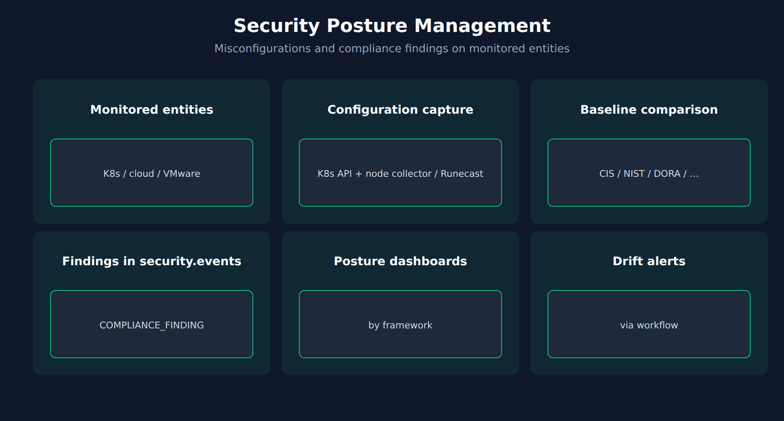

# APPSEC-05: Security Posture Management

> **Series:** APPSEC — Application Security | **Notebook:** 5 of 10 | **Created:** June 2026 | **Last Updated:** 10/02/2026

## Overview

**Security Posture Management (SPM)** evaluates the configuration state of Kubernetes clusters, cloud accounts (AWS, Azure, GCP), and VMware environments against hardening guidelines and compliance standards (CIS, PCI DSS, NIST, DORA, and others) and records the results as findings in the same `security.events` table as RVA and RAP.

Where RVA and RAP are *runtime* signals (what's executing right now), SPM is a *config* signal (what's been declared in the platform). The two complement each other — a fully-patched runtime on a misconfigured platform is still vulnerable.



<!-- MARKDOWN_TABLE_ALTERNATIVE
| Environment | SPM flavor |
|-------------|------------|
| Kubernetes clusters | KSPM (Dynatrace) |
| AWS / Azure / GCP accounts | CSPM (Runecast) |
| VMware vSphere / NSX | VSPM (Runecast) |
-->

---

## Table of Contents

1. [1. SPM Scope](#scope)
2. [2. Compliance Frameworks](#frameworks)
3. [3. DQL: SPM Findings](#dql-spm)
4. [4. Finding Lifecycle](#lifecycle)
5. [5. Next Steps](#next)
6. [References](#references)

---

## Prerequisites

| Requirement | Details |
|-------------|---------|
| **Dynatrace Environment** | Gen3 SaaS with Grail; AppSec entitlement enabled |
| **Monitoring mode** | SPM works independently of OneAgent monitoring mode. KSPM collects from the Kubernetes API server and the Node Configuration Collector via ActiveGate; CSPM and VSPM ingest Runecast Analyzer findings |
| **Read access** | To run the DQL: `storage:security.events:read` **plus** `storage:buckets:read` (a table permission alone reads nothing). The Vulnerabilities and Threats & Exploits apps have their own requirements — see APPSEC-09 for the full model |
| **Background** | APPSEC-01 (fundamentals + three-pillar framing) |

<a id="scope"></a>
## 1. SPM Scope

SPM's scope is broader than the application — it covers the platform the applications run on. It comes in three flavors:

| Flavor | Evaluates | Provided by |
|--------|-----------|-------------|
| **KSPM** — Kubernetes Security Posture Management | Kubernetes clusters: misconfigurations, hardening guidelines, compliance violations | Dynatrace (native) |
| **CSPM** — Cloud Security Posture Management | AWS, Azure, and GCP accounts | Runecast integration |
| **VSPM** — VMware Security Posture Management | VMware environments, including vCenter and NSX-T | Runecast integration |

Container-image vulnerabilities are **not** SPM — they are RVA findings (APPSEC-06 § 2). The exact catalog of checks lives in the SPM product surface and evolves per release.

> <sub>**Sources:** [Security Posture Management (DT docs)](https://docs.dynatrace.com/docs/secure/application-security/spm) — *"Security Posture Management provides comprehensive visibility into the security posture of your Kubernetes, cloud, and VMware environments."* and *"Analyzed data originates from the Kubernetes API Server and the Kubernetes Node Configuration Collector via ActiveGate."*; [Application Security (DT docs)](https://docs.dynatrace.com/docs/secure/application-security) — *"Dynatrace Security Posture Management (SPM) works independently of monitoring modes."* (re-read 09/18/2026).</sub>

<a id="frameworks"></a>
## 2. Compliance Frameworks

SPM findings are grouped by compliance standard so a single misconfiguration shows up under each relevant one. The documented standards are BSI C5, BSI IT-Grundschutz, CIS, Cyber Essentials, DISA STIG, DORA, Essential Eight, GDPR, HIPAA, ISO 27001, KVKK, NIST, PCI DSS, Security Essentials, TISAX, and VMware SCG. Coverage differs by environment (Kubernetes, AWS, Azure, GCP, vSphere, NSX) — check the standards table in the SPM docs for your combination. In Grail the standard is `compliance.standard.short_name` (for example `CIS`).

A single finding (e.g., "S3 bucket without encryption") often maps to controls in multiple frameworks. Don't double-count by framework when measuring posture; pick a primary framework for governance reporting and let the others be a secondary view.

> <sub>**Sources:** [Security Posture Management (DT docs)](https://docs.dynatrace.com/docs/secure/application-security/spm) — the *Compliance standards* table (re-read 09/18/2026). **Softened:** the pick-one-primary-framework recommendation is community practice.</sub>

<a id="dql-spm"></a>
## 3. DQL: SPM Findings

SPM results are `COMPLIANCE_FINDING` records with `product.name == "Security Posture Management"` (other `product.name` values are ingested third-party compliance findings, such as AWS Security Hub) — and most of them are **not** failures. Each scan writes one result per rule × object, with `compliance.result.status.level` set to `FAILED`, `PASSED`, `MANUAL`, or `NOT_RELEVANT`, and every scan writes a fresh set. Counting records therefore counts scan results, not misconfigurations. The query below keeps the latest result per object and rule, then counts only the ones still failing.

```dql
// Currently failing compliance rules by standard and severity (latest result per object + rule)
fetch security.events, from:-7d
| filter event.type == "COMPLIANCE_FINDING"
| filter product.name == "Security Posture Management"  // SPM only; third-party compliance findings share the event type
| dedup {object.id, compliance.rule.id}, sort:{timestamp desc}
| filter compliance.result.status.level == "FAILED"
| summarize failing = count(), by:{compliance.standard.short_name, compliance.rule.severity.level}
| sort failing desc

```

> <sub>**Sources:** [Compliance (Semantic Dictionary) (DT docs)](https://docs.dynatrace.com/docs/semantic-dictionary/model/security-events/compliance) — `compliance.result.status.level` (*"Result status of the given resource object as evaluated by a scan."*, values `FAILED ; PASSED ; MANUAL ; NOT_RELEVANT`), `compliance.rule.id`, `object.id` (re-read 10/02/2026); the same page: *"Both Dynatrace-generated and third-party ingested data are supported."* **Dictionary (docs page):** `compliance.rule.id`, `compliance.standard.short_name`, `compliance.rule.severity.level`, `object.id` (all `experimental`), read 10/02/2026. **Live-verified 09/18/2026, re-run 10/02/2026** against a tenant with KSPM enabled (last scan 08/28/2026, so it was run at `from:-60d` at the time of verification): of 313,391 `COMPLIANCE_FINDING` records, 302,281 were `NOT_RELEVANT`, 8,320 `PASSED`, 1,191 `MANUAL`, and only 1,599 `FAILED`. After keeping the latest result per object and rule, the query above returns 60 current failures — CIS CRITICAL 1 · HIGH 3 · MEDIUM 47 · LOW 9. Counting every record for the same state reports CIS CRITICAL 107,841 · MEDIUM 152,839 · HIGH 44,359 · LOW 8,352: always filter on `compliance.result.status.level` and deduplicate to the latest scan. If scans have stopped, the `-7d` window returns nothing — widen it before concluding the environment is compliant. An earlier revision of this entry filtered `event.type == "POSTURE_FINDING"` and grouped by `compliance.framework` / `finding.severity`; **all three identifiers were wrong** and returned nothing. That is the failure mode SPM queries are most prone to: a wrong identifier — or a wrong grain — is valid DQL, executes cleanly, and returns a result that looks plausible.</sub>

<a id="lifecycle"></a>
## 4. Finding Lifecycle

SPM results do **not** have the open / resolved / muted lifecycle of RVA vulnerabilities — the compliance event model has no mute or status field. Each scan re-evaluates every rule and writes a fresh result, so a fixed configuration shows up as `PASSED` (or the object disappears) on the next scan. Which standards are assessed is configurable: for KSPM in the Dynatrace Settings (*Configure assessment scope*), for CSPM/VSPM in the Runecast Analyzer.

In community practice, two patterns follow — verify both against your own findings:

1. **Fix and let the next scan close it** — there is nothing to acknowledge in the product.
2. **Record accepted deviations outside the product** — many failing rules reflect legitimate architectural choices (a public-facing bucket holding intentionally-public assets). Without a per-finding mute, keep a register of accepted deviations with a documented reason, and exclude them in your reporting query.

> <sub>**Sources:** [Compliance (Semantic Dictionary) (DT docs)](https://docs.dynatrace.com/docs/semantic-dictionary/model/security-events/compliance) — the result values are *"FAILED ; PASSED ; MANUAL ; NOT_RELEVANT"*, and the page defines no mute or status field (read 10/02/2026); [Security Posture Management (DT docs)](https://docs.dynatrace.com/docs/secure/application-security/spm) — *"For Dynatrace Kubernetes Security Posture Management (KSPM) , you can manage compliance standards in the Dynatrace Settings , see Configure assessment scope ."* **Softened:** the deviation-register pattern is community practice.</sub>

<a id="next"></a>
## 5. Next Steps

1. Run the query above, then check the same window with `summarize n = count(), by:{compliance.result.status.level}` to see how much of your SPM volume is actually failing.
2. Pick a primary framework for governance reporting; use others as secondary views.
3. Read **APPSEC-06** for Kubernetes + container security overlap with SPM.
4. Read **APPSEC-10** for SPM dashboard patterns and the executive view.

<a id="references"></a>
## References

| Source | Coverage |
|--------|----------|
| [Application Security (DT docs)](https://docs.dynatrace.com/docs/secure/application-security) | SPM as the third pillar; independent of monitoring modes |
| [Security Posture Management (DT docs)](https://docs.dynatrace.com/docs/secure/application-security/spm) | KSPM / CSPM / VSPM flavors and supported compliance standards |
| [Compliance (Semantic Dictionary) (DT docs)](https://docs.dynatrace.com/docs/semantic-dictionary/model/security-events/compliance) | `COMPLIANCE_FINDING` fields |

---

> <sub>**⚠️ DISCLAIMER**: This information was AI generated and is provided "as-is" without warranty. It was produced as an independent, community-driven project and **not supported by Dynatrace**. Always refer to official [Dynatrace documentation](https://docs.dynatrace.com/docs) for the most current information.</sub>
