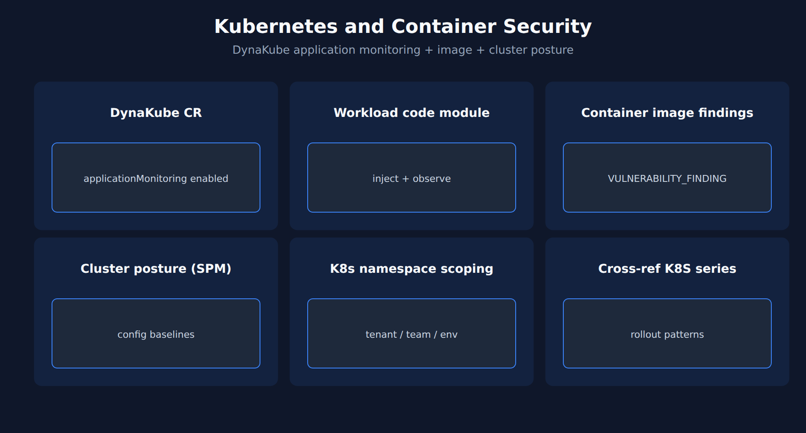

# APPSEC-06: Kubernetes and Container Security

> **Series:** APPSEC — Application Security | **Notebook:** 6 of 10 | **Created:** June 2026 | **Last Updated:** 10/02/2026

## Overview

Kubernetes and container workloads produce findings across all three AppSec pillars at once — RVA on the running containerized application, RAP on its request traffic, and SPM on the cluster + image configuration. This notebook covers how the pieces fit together and the K8s-specific levers.

For K8s rollout patterns themselves (DynaKube CR, operator install, namespace selectors), see the K8S series. This notebook focuses on the *security* dimension specifically.



<!-- MARKDOWN_TABLE_ALTERNATIVE
| Layer | Dynatrace surface |
|-------|---------------------|
| Application | RVA + RAP (via code module) |
| Container image | Vulnerability findings (incl. ingested third-party image scanners) |
| Cluster config | SPM |
-->

---

## Table of Contents

1. [1. DynaKube and applicationMonitoring](#dynakube)
2. [2. Container Image Vulnerabilities](#image-vulns)
3. [3. Cluster SPM Findings](#cluster-spm)
4. [4. DQL: K8s-Scoped Findings](#dql-k8s)
5. [5. Namespace Scoping for IAM](#namespace-scoping)
6. [6. Next Steps](#next)
7. [References](#references)

---

## Prerequisites

| Requirement | Details |
|-------------|---------|
| **Dynatrace Environment** | Gen3 SaaS with Grail; AppSec entitlement enabled |
| **OneAgent** | Full-Stack mode (or code-module attached) on monitored hosts |
| **Read access** | To run the DQL: `storage:security.events:read` **plus** `storage:buckets:read` (a table permission alone reads nothing). The Vulnerabilities and Threats & Exploits apps have their own requirements — see APPSEC-09 for the full model |
| **Background** | APPSEC-01 (fundamentals + three-pillar framing) |

<a id="dynakube"></a>
## 1. DynaKube and applicationMonitoring

The DynaKube custom resource is the entry point for AppSec on Kubernetes. The relevant fields:

```yaml
apiVersion: dynatrace.com/v1beta5
kind: DynaKube
metadata:
  name: dynakube
  namespace: dynatrace
spec:
  apiUrl: https://<tenant>.live.dynatrace.com/api
  oneAgent:
    applicationMonitoring: {}
```

`useCSIDriver` is not a `v1beta5` field: the DynaKube parameters reference lists it only for the retired `v1beta1`/`v1beta2` APIs. Through Operator 1.10.x, whether code modules come from the CSI driver is decided when the Operator is installed (CSI or *Without CSI driver* variant), and that remains the working path on those versions.

**Operator 1.11.0+ (released 10/01/2026): image volumes.** Dynatrace now recommends image volume-based code-module injection, which *"replaces the CSI driver as the recommended approach"*: each node pulls the code-modules image once and shares it with every instrumented pod, with no CSI DaemonSet. Turn it on per DynaKube with the annotation `feature.dynatrace.com/mount-code-modules-via-image-volume: "true"` (mutually exclusive with `feature.dynatrace.com/node-image-pull`). It needs **Kubernetes 1.35+** and **containerd 2.2+ or CRI-O 1.33+**, and *"Image volume injection is not compatible with the Dynatrace built-in tenant registry."* Try it on one workload first with the pod annotation `oneagent.dynatrace.com/volume-type: "image"`; *"A full migration requires a rolling restart of all injected workloads."* Clusters that do not meet those requirements stay on the CSI driver or ephemeral volumes. The delivery mode changes how code modules reach the pod; RVA and RAP still depend only on code-module injection being enabled.

> <sub>**Sources:**</sub>
> - <sub>[DynaKube parameters (DT docs)](https://docs.dynatrace.com/docs/ingest-from/setup-on-k8s/reference/dynakube-parameters) — *"DynaKube API version v1beta2 is no longer available with Dynatrace Operator version 1.7.0"*</sub>
> - <sub>[Application observability setup (DT docs)](https://docs.dynatrace.com/docs/ingest-from/setup-on-k8s/deployment/application-observability) — *"CSI driver is optional (see step 2). If enabled, it gets deployed as DaemonSet and results in a CSI driver pod on each node."*</sub>
> - <sub>[Operator 1.11.0 release notes (DT docs)](https://docs.dynatrace.com/docs/whats-new/dynatrace-operator/dto-fix-1-11-0)</sub>
> - <sub>[Use image volumes for code modules injection (DT docs)](https://docs.dynatrace.com/docs/ingest-from/setup-on-k8s/guides/deployment-and-configuration/use-image-volumes) — requirements, both annotations, and the registry limit</sub>
> - <sub>[Migrate to image volumes (DT docs)](https://docs.dynatrace.com/docs/ingest-from/setup-on-k8s/guides/migration/migrate-to-image-volume)</sub>

`applicationMonitoring` enables the code-module injection that RVA and RAP rely on inside workload containers. Monitoring mode then decides how well findings are assessed: per the Application Security docs, Infrastructure and Discovery modes still provide third-party and code-level detection (limited) and RAP — Discovery only once code-module injection is enabled — but without the Full-Stack topology that adjusts the Dynatrace Security Score, so DSS stays at the CVSS base score (APPSEC-01 § 3). SPM findings on the cluster itself do not depend on monitoring mode.

For cluster rollout the K8S series covers per-namespace targeting, monitoring modes, and operator versioning. APPSEC concerns are downstream of that.

> <sub>**Sources:** [Application Security (DT docs)](https://docs.dynatrace.com/docs/secure/application-security) — the *Monitoring modes coverage* table and *"For Application Security to work in Discovery mode, after enabling Discovery mode, you also need to enable code-module injection."* (re-read 09/18/2026). **Softened:** the exact DynaKube schema may shift per operator release — verify against the current K8S series and the operator CRD.</sub>

<a id="image-vulns"></a>
## 2. Container Image Vulnerabilities

RVA reports vulnerable libraries loaded by processes running in containers, plus vulnerabilities on Kubernetes nodes. A container image is a *related* entity of those findings, not the thing RVA scans. RVA vulnerability events identify the cluster and workload through the arrays `related_entities.kubernetes_clusters.names` and `related_entities.kubernetes_workloads.names`; they carry no `k8s.namespace.name`.

Container-*image* findings are a different record: `VULNERABILITY_FINDING` events with `object.type == "CONTAINER_IMAGE"`, `container_image.registry` / `container_image.repository`, and the Kubernetes resource fields (`k8s.cluster.name`, `k8s.namespace.name`). These come from vulnerability findings, including ingested third-party image scanners.

Practical pattern: report image findings **by namespace** rather than by individual workload — namespaces are usually a stable team/service boundary, while workload names churn with deployments.

> <sub>**Sources:** [Vulnerabilities concepts (DT docs)](https://docs.dynatrace.com/docs/secure/vulnerabilities/concepts) — *"Affected entities Entities (process groups, processes, and Kubernetes nodes) for which a vulnerability was detected"* and *"Related container image In Kubernetes environments, the container image used by the affected processes."*; [Vulnerability events (DT semantic dictionary)](https://docs.dynatrace.com/docs/semantic-dictionary/model/security-events/vulnerability) — the Kubernetes resource fields appear under the vulnerability finding and scan events, whose example query filters `object.type == "CONTAINER_IMAGE"` (re-read 10/02/2026). **Softened:** the namespace-as-stable-boundary recommendation is community practice — verify the namespace-naming discipline in your tenant before relying on it for reports.</sub>

<a id="cluster-spm"></a>
## 3. Cluster SPM Findings

SPM (APPSEC-05) covers Kubernetes cluster configuration: RBAC bindings, pod security, network policies, secret management. Common high-impact findings:

- Cluster-admin-bound users that shouldn't be cluster-admin
- Pods running as root without explicit need
- Network policies absent on namespaces that should be isolated
- Secrets stored as ConfigMaps instead of Secrets (or unencrypted at rest)
- Public LoadBalancer services exposing internal-only workloads

These findings are durable — they reflect the cluster's declared state and don't churn the way runtime events do.

> <sub>**Sources:** [Application Security (DT docs)](https://docs.dynatrace.com/docs/secure/application-security) for SPM scope. **Softened:** the high-impact finding list reflects the standard CIS-K8s control set; the exact Dynatrace SPM catalog should be confirmed against current docs.</sub>

<a id="dql-k8s"></a>
## 4. DQL: K8s-Scoped Findings

Filter AppSec events to a specific cluster + namespace to slice findings by team boundary.

```dql
// Currently failing compliance rules in one cluster + namespace (latest result per object + rule)
// Counting every record counts scan results, most of them PASSED or NOT_RELEVANT (APPSEC-05 § 3).
fetch security.events, from:-7d
| filter event.type == "COMPLIANCE_FINDING"
| filter k8s.cluster.name == "prod-cluster-01" and k8s.namespace.name == "team-payments"
| dedup {object.id, compliance.rule.id}, sort:{timestamp desc}
| filter compliance.result.status.level == "FAILED"
| summarize {failing = count()}, by:{compliance.standard.short_name, compliance.rule.severity.level}
| sort failing desc

// Container-image vulnerability findings in the same namespace (docs pattern; run separately):
// fetch security.events, from:-7d
// | filter event.type == "VULNERABILITY_FINDING" and object.type == "CONTAINER_IMAGE"
// | filter k8s.namespace.name == "team-payments"
// | dedup {object.id, vulnerability.id, component.name, component.version}, sort:{timestamp desc}
// | summarize {findings = count()}, by:{dt.security.risk.level}
```

> <sub>**Sources:** [IAM policy statements reference (DT docs)](https://docs.dynatrace.com/docs/manage/identity-access-management/permission-management/manage-user-permissions-policies/advanced/iam-policystatements) lists `storage:k8s.cluster.name` and `storage:k8s.namespace.name` as conditions on `storage:security.events:read`; [Vulnerability events (DT semantic dictionary)](https://docs.dynatrace.com/docs/semantic-dictionary/model/security-events/vulnerability) for the `VULNERABILITY_FINDING` dedup pattern (re-read 10/02/2026). **Dictionary:** `k8s.namespace.name` (`stable`), read 09/18/2026. **Live-verified 10/02/2026:** on one validation namespace the previous count-everything form returned 31,400 `COMPLIANCE_FINDING` records; the deduplicated, `FAILED`-only form returns 16. The cluster and namespace names above are placeholders — replace them with your own. The image query is the docs' pattern; the validation tenant has no vulnerability findings to run it against.</sub>

<a id="namespace-scoping"></a>
## 5. Namespace Scoping for IAM

K8s namespace is the natural IAM boundary for AppSec findings: AppDev team X should see findings in its own namespaces, not in team Y's. The IAM permission model supports this via boundary conditions:

```
ALLOW storage:buckets:read WHERE storage:table-name = "security.events";
ALLOW storage:security.events:read
  WHERE storage:k8s.namespace.name IN ("team-payments-prod", "team-payments-staging");
```

Two details make or break this policy. IAM lists use `IN ("…", "…")` with parentheses — DQL's `{…}` array syntax does not validate here. And `storage:buckets:read` is required in addition to the table permission; without it the namespace-scoped grant reads nothing. Two limits follow from the data. RVA vulnerability state and change events carry no `k8s.namespace.name`, so this condition cannot match them — the team sees compliance and vulnerability *findings* only; scope RVA visibility by `dt.security_context` instead (APPSEC-09 § 3). And `vulnerability-service:vulnerabilities:read` takes no conditions, so granting it shows every vulnerability in the tenant in the Vulnerabilities app.

See APPSEC-09 for the full pattern including the policy-vs-managed-policy decision and the privacy carve-out for `view-sensitive-request-data`.

> <sub>**Sources:** [IAM policy statements reference (DT docs)](https://docs.dynatrace.com/docs/manage/identity-access-management/permission-management/manage-user-permissions-policies/advanced/iam-policystatements) confirms K8s namespace as an available boundary condition on `storage:security.events:read` and says of `storage:buckets:read`: *"Grants permission to read records from Grail buckets. Required additionally to a table permission."*; [IAM policy statement syntax (DT docs)](https://docs.dynatrace.com/docs/manage/identity-access-management/permission-management/manage-user-permissions-policies/iam-policystatement-syntax) — its `IN` example is `WHERE settings:schemaId IN ("builtin:container.monitoring-rule", "builtin:container.built-in-monitoring-rule")` (both re-read 09/18/2026). The full IAM model is in APPSEC-09.</sub>

<a id="next"></a>
## 6. Next Steps

1. Confirm DynaKube `applicationMonitoring` is enabled on clusters where AppDev-tier vulnerability data matters.
2. Run the namespace-scoped DQL above against a known-active namespace to verify field names match.
3. Read the **K8S series** for the rollout mechanics — this notebook intentionally defers to it.
4. Read **APPSEC-09** for the full K8s namespace IAM scoping pattern.

<a id="references"></a>
## References

| Source | Coverage |
|--------|----------|
| [Application Security (DT docs)](https://docs.dynatrace.com/docs/secure/application-security) | K8s + container security framing |
| [IAM policy statements reference (DT docs)](https://docs.dynatrace.com/docs/manage/identity-access-management/permission-management/manage-user-permissions-policies/advanced/iam-policystatements) | k8s.namespace.name boundary condition |
| [IAM policy statement syntax (DT docs)](https://docs.dynatrace.com/docs/manage/identity-access-management/permission-management/manage-user-permissions-policies/iam-policystatement-syntax) | Condition operators (`=`, `IN (…)`, `startsWith`, `MATCH`) |

---

> <sub>**⚠️ DISCLAIMER**: This information was AI generated and is provided "as-is" without warranty. It was produced as an independent, community-driven project and **not supported by Dynatrace**. Always refer to official [Dynatrace documentation](https://docs.dynatrace.com/docs) for the most current information.</sub>
