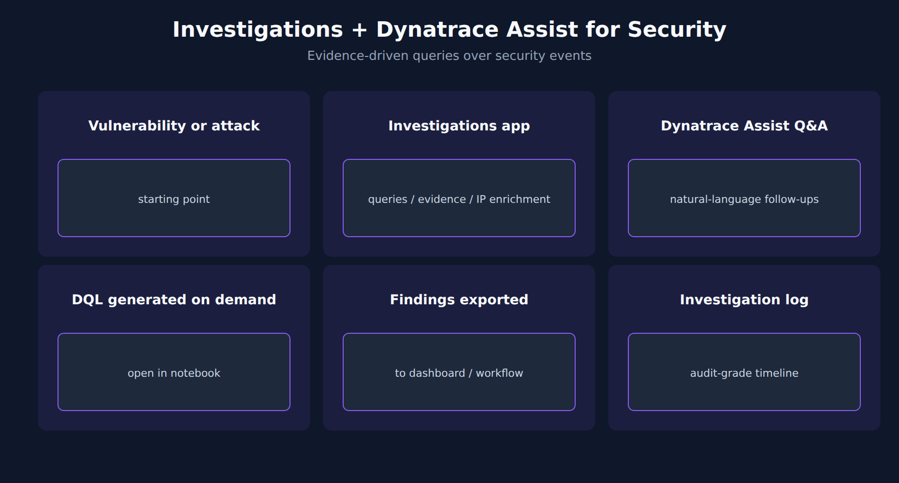

# APPSEC-07: Investigations and Dynatrace Assist for Security

> **Series:** APPSEC — Application Security | **Notebook:** 7 of 10 | **Created:** June 2026 | **Last Updated:** 10/02/2026

## Overview

When a vulnerability opens or RAP reports an attack, an analyst's job is to follow the chain: which entities are affected, what else changed in the topology around that time, what's the most likely remediation? Dynatrace gives you two complementary surfaces for this work — the **Investigations** app (evidence-driven investigation over Grail data — queries, evidence, history, IP enrichment; earlier revisions of this series called it *Security Investigator*) and **Dynatrace Assist**, Dynatrace Intelligence's generative AI (natural language to DQL; formerly *Davis CoPilot*).

This notebook covers when to reach for each, and the integration points back to the rest of the AppSec series.



<!-- MARKDOWN_TABLE_ALTERNATIVE
| Surface | Best for |
|---------|----------|
| Investigations app | Query, enrich and keep evidence over Grail data |
| Dynatrace Assist | Natural-language Q to DQL |
| Notebook | Durable investigation record |
-->

---

## Table of Contents

1. [1. Investigations Workflow](#investigator)
2. [2. Dynatrace Assist for Security Questions](#copilot)
3. [3. DQL Generated On Demand](#dql-export)
4. [4. Investigation Log as Audit Artifact](#audit)
5. [5. Next Steps](#next)
6. [References](#references)

---

## Prerequisites

| Requirement | Details |
|-------------|---------|
| **Dynatrace Environment** | Gen3 SaaS with Grail; AppSec entitlement enabled |
| **OneAgent** | Full-Stack mode (or code-module attached) on monitored hosts |
| **Read access** | To run the DQL: `storage:security.events:read` **plus** `storage:buckets:read` (a table permission alone reads nothing). The Vulnerabilities and Threats & Exploits apps have their own requirements — see APPSEC-09 for the full model |
| **Background** | APPSEC-01 (fundamentals + three-pillar framing) |

<a id="investigator"></a>
## 1. Investigations Workflow

Investigations starts from a query over Grail data — for a security case, `security.events` filtered to the vulnerability or the RAP detection in front of you — and keeps the path you take. The documented capabilities that matter for security work:

- **Combine queries** and refine them without losing the earlier steps; the investigation history lets you go back.
- **Attach findings as evidence**, keeping the context they came from.
- **IP enrichment** — reputation context on attacker IP addresses from third-party threat intelligence.
- **Lookup tables** to enrich events with your own context (asset owner, business unit).
- **Collaborate** on an investigation with controlled access, and hand off to compatible apps for further detail.

A flat list of events is a triage queue; a query path with evidence is an investigation.

> <sub>**Sources:** [Investigations (DT docs)](https://docs.dynatrace.com/docs/secure/investigations) — *"Define and execute queries while combining functionalities."*, *"Attach relevant findings as evidence, while preserving the investigation context."*, *"Add reputation context to IP addresses with IP enrichment powered by third-party threat intelligence."* and *"Create and use lookup tables to enrich investigations with contextual data."* (re-read 10/02/2026).</sub>

<a id="copilot"></a>
## 2. Dynatrace Assist for Security Questions

Dynatrace Assist accepts natural-language questions and translates them into DQL, which it can also run. Examples:

- "Which services were attacked the most in the last 24 hours?" → DQL over `security.events` filtered to `DETECTION_FINDING` from `Runtime Application Protection` (APPSEC-04 § 4)
- "Show me the vulnerabilities opened on payments services this week" → DQL over vulnerability status-change events
- "Are any of these vulnerabilities exposed to the public internet?" → DQL on `vulnerability.davis_assessment.exposure_status` (§ 3)

Assist is most useful when you can verbalize the question but the DQL is non-obvious — exactly the situation a security analyst hits often. Treat the generated DQL as a starting point; review and refine before pinning to a dashboard.

> <sub>**Sources:** [Agentic and generative AI (DT docs)](https://docs.dynatrace.com/docs/dynatrace-intelligence/agentic-and-generative-ai) — *"Dynatrace Intelligence agentic and generative AI takes your prompt and translates it to DQL, and is capable of auto-executing generated DQL queries."* (re-read 10/02/2026). **Softened:** the example prompts are illustrative — verify the generated DQL in your tenant. The AIOPS series covers Dynatrace Assist in depth.</sub>

<a id="dql-export"></a>
## 3. DQL Generated On Demand

When Assist generates a query you want to keep, the path is: open it in a notebook (this surface), refine, then pin to a dashboard. The pattern below is the kind of query a well-formed prompt should produce — compare generated DQL against it, because generated queries often skip the dedup step and count every periodic snapshot: *"Show me the open vulnerabilities grouped by severity and internet exposure."*

```dql
// Current open vulnerabilities by risk level and internet exposure (latest snapshot per vulnerability)
fetch security.events, from:-7d
| filter event.provider == "Dynatrace"
| filter event.category == "VULNERABILITY_MANAGEMENT"
| filter event.type == "VULNERABILITY_STATE_REPORT_EVENT"
| filter event.level == "VULNERABILITY"
| dedup {vulnerability.display_id}, sort:{timestamp desc}
| filter vulnerability.resolution.status == "OPEN"
| filter vulnerability.mute.status == "NOT_MUTED"
| summarize open = count(), by:{vulnerability.risk.level, vulnerability.davis_assessment.exposure_status}
| sort open desc

```

> **Validation note:** validated for syntax and field names on 09/18/2026 and executes cleanly; the validation tenant has no RVA data, so it returned 0 rows there.
>
> <sub>**Sources:** [Vulnerability events (DT semantic dictionary)](https://docs.dynatrace.com/docs/semantic-dictionary/model/security-events/vulnerability) — `vulnerability.davis_assessment.exposure_status` examples `NOT_AVAILABLE ; NOT_DETECTED ; PUBLIC_NETWORK ; ADJACENT_NETWORK`, and *"a deduplicated latest snapshot per vulnerability reflects present exposure"* (re-read 09/18/2026). **Dictionary:** `vulnerability.davis_assessment.exposure_status` (`stable`), `vulnerability.risk.level` (`stable`), `vulnerability.resolution.status` (`stable`), `vulnerability.mute.status` (`stable`), read 09/18/2026; no row for `vulnerability.public_exposure` under `filter startsWith(name, "vulnerability.public")`, read 09/18/2026 (control: `filter startsWith(name, "vulnerability")` → 70 rows).</sub>

<a id="audit"></a>
## 4. Investigation Log as Audit Artifact

In community practice in regulated environments, the investigation itself is treated as an audit artifact, with two habits:

1. **Open each investigation in a notebook**, not just the Investigations app. The notebook captures the queries, the reasoning, and the conclusion as a durable record.
2. **Attach the notebook to the ticketing system** (Jira/ServiceNow link) so the security-problem record links to the investigation record. APPSEC-08 covers the workflow patterns.

This is more discipline than tooling. Both surfaces support it; the question is whether the team commits to using them this way.

> <sub>**Sources:** [Investigations (DT docs)](https://docs.dynatrace.com/docs/secure/investigations) — *"Attach relevant findings as evidence, while preserving the investigation context."* and *"view your investigation history"* (re-read 09/28/2026).</sub>

<a id="next"></a>
## 5. Next Steps

1. Start an investigation in Investigations from a recent vulnerability or RAP detection query. Attach one finding as evidence.
2. Ask Dynatrace Assist one of the example prompts above. Review the generated DQL.
3. Read **APPSEC-08** to wire the investigation outcome to a remediation ticket.
4. Read **APPSEC-09** — Assist can only run queries against data the user has IAM access to; the policy model bounds the assistant's reach.

<a id="references"></a>
## References

| Source | Coverage |
|--------|----------|
| [Investigations (DT docs)](https://docs.dynatrace.com/docs/secure/investigations) | The investigation app: queries, evidence, history, collaboration |
| [Vulnerability events (DT semantic dictionary)](https://docs.dynatrace.com/docs/semantic-dictionary/model/security-events/vulnerability) | Exposure and risk fields used in § 3 |
| [Application Security (DT docs)](https://docs.dynatrace.com/docs/secure/application-security) | AppSec hub |

---

> <sub>**⚠️ DISCLAIMER**: This information was AI generated and is provided "as-is" without warranty. It was produced as an independent, community-driven project and **not supported by Dynatrace**. Always refer to official [Dynatrace documentation](https://docs.dynatrace.com/docs) for the most current information.</sub>
