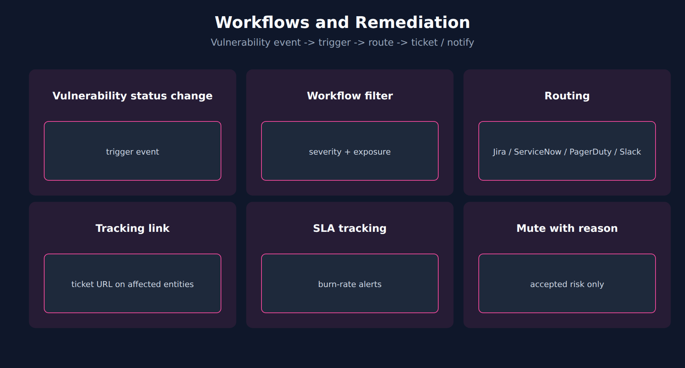

# APPSEC-08: Workflows, Notifications and Remediation

> **Series:** APPSEC — Application Security | **Notebook:** 8 of 10 | **Created:** June 2026 | **Last Updated:** 10/02/2026

## Overview

A vulnerability that sits in the Dynatrace UI helps nobody. The value of AppSec is realized when findings reach the people who can act on them — the SOC for triage, AppDev for code fixes, the platform team for infrastructure changes. **Workflows** are the bridge.

This notebook covers the trigger patterns, the routing decisions, the SLA + burn-rate alerting, and the ticket linkage that ties a Dynatrace vulnerability to its ticket.



<!-- MARKDOWN_TABLE_ALTERNATIVE
| Destination | Content | Trigger |
|-------------|---------|---------|
| Jira | AppDev backlog | Risk level >= High, exposed |
| ServiceNow | Platform changes | SPM findings (CIS/PCI) |
| PagerDuty | SOC paging | RAP DETECTION_FINDING in prod |
| Slack | Awareness | Critical or digest |
-->

---

## Table of Contents

1. [1. Triggers on Security Events](#triggers)
2. [2. Routing: Jira / ServiceNow / PagerDuty / Slack](#routing)
3. [3. Ticket Linkage](#ack-loopback)
4. [4. SLA and Burn-Rate Alerts](#sla-alerts)
5. [5. DQL: Backlog Burn-Rate](#dql-sla)
6. [6. Next Steps](#next)
7. [References](#references)

---

## Prerequisites

| Requirement | Details |
|-------------|---------|
| **Dynatrace Environment** | Gen3 SaaS with Grail; AppSec entitlement enabled |
| **OneAgent** | Full-Stack mode (or code-module attached) on monitored hosts |
| **Read access** | To run the DQL: `storage:security.events:read` **plus** `storage:buckets:read` (a table permission alone reads nothing). The Vulnerabilities and Threats & Exploits apps have their own requirements — see APPSEC-09 for the full model |
| **Background** | APPSEC-01 (fundamentals + three-pillar framing) |

<a id="triggers"></a>
## 1. Triggers on Security Events

Security routing uses the workflow **Event trigger** with event type `security.events` and a DQL matcher; a **Schedule** trigger covers digests and SLA sweeps.

| Trigger | Filter (DQL matcher) | Use for |
|---------|----------------------|---------|
| Event trigger on `security.events` | `event.type == "VULNERABILITY_STATUS_CHANGE_EVENT" and event.level == "VULNERABILITY" and in(event.status_transition, {"NEW_OPEN", "REOPEN"}) and vulnerability.mute.status != "MUTED"` | New or reopened vulnerabilities — SOC triage (add a `CLOSE` row if you want closures too) |
| Event trigger on `security.events` | `event.type == "DETECTION_FINDING" and product.name == "Runtime Application Protection"` | RAP attack alerting |
| Schedule | — | Digests and SLA sweeps |

Do **not** use the **Problem trigger** for vulnerabilities. It fires on Davis problems — the correlated performance and availability problems — so a SOC workflow built on it never runs for a new vulnerability. Filter the vulnerability trigger to the vulnerability level (`event.level == "VULNERABILITY"`) so each vulnerability transition fires once, not once per affected entity; narrow further with `event.status_transition` (`NEW_OPEN`, `REOPEN`, `CLOSE`, `MUTE`, `UNMUTE` — an `experimental` field) and `vulnerability.risk.level` as needed. Without the `event.status_transition` filter the trigger also fires on mute / unmute and on risk-score changes — the change event is emitted *"whenever a vulnerability's overall status or risk assessment changes"*. Dynatrace's own mapping of the classic *Vulnerability (re)opened* condition filters on `event.level == "ENTITY"`, which fires once per affected entity; the vulnerability level above fires once per vulnerability. RAP detections are one record per observed attack, so that trigger needs a tight filter (production only, risk level) before it pages anyone — event triggers are limited to 1,000 executions per hour.

> <sub>**Sources:** [Event trigger (DT docs)](https://docs.dynatrace.com/docs/analyze-explore-automate/workflows/build/trigger/event-trigger) — *"The Problem trigger starts a workflow when a problem opens, changes, or resolves."*, with Davis problems as its event source, and for `security.events`: *"Use this type to automate remediation or ticketing when new vulnerabilities are detected."* and *"the 1,000 executions per hour limit and the 1,000-character filter expression limit"* (re-read 10/02/2026); [Vulnerability events (DT semantic dictionary)](https://docs.dynatrace.com/docs/semantic-dictionary/model/security-events/vulnerability) — *"A vulnerability change event is generated by Dynatrace Runtime Vulnerability Analytics (RVA) whenever a vulnerability's overall status or risk assessment changes"*, transition values `NEW_OPEN ; REOPEN ; CLOSE ; MUTE ; UNMUTE`; [Upgrade security notifications (DT docs)](https://docs.dynatrace.com/docs/platform/upgrade/best-practices/stage-09-team-based-global-alerting/upgrade-security-notifications) for the classic *Vulnerability (re)opened* mapping.</sub>

<a id="routing"></a>
## 2. Routing: Jira / ServiceNow / PagerDuty / Slack

In community practice, a common routing split looks like this — verify it against your SOC's ownership model:

| Destination | What goes there | Trigger filter |
|-------------|------------------|----------------|
| **Jira** | AppDev backlog: code-level vulns + third-party vulns scoped to service team | New/reopened vulnerability, risk level ≥ High, owner-tag mapped |
| **ServiceNow** | Platform/infra changes: SPM findings on cluster, cloud-account config | Severity ≥ High, framework in {CIS, PCI} |
| **PagerDuty** | Real-time SOC paging: RAP detections in production | `event.type == "DETECTION_FINDING"`, `product.name == "Runtime Application Protection"`, production scope |
| **Slack** | Awareness channel: new critical vulnerabilities, weekly digest | Risk level = Critical OR scheduled summary |

A finding can fire into multiple destinations — there's no requirement to pick one. What matters is that each destination has a clear ownership boundary so no finding falls between teams.

**Coming from classic security notifications.** If your tenant still sends security alerts through the global notification settings in Settings (Classic), those do not carry over. The upgrade guide lists the difference in one line, *"You create and orchestrate alerts via Workflows"* versus *"You configure security notifications globally in Settings (Classic)"*, and gives the action as *"Recreate notifications using workflows."* The routing matrix above is where to start: a global classic notification usually becomes several narrower workflows, one per destination. If you opt into Phase 3, this is not optional: *"migrating security alerting profiles to Workflows is mandatory; classic security alerting profiles will not function after the Phase 3 transition."* In-product, the ready-made *Check your upgrade readiness* dashboard listed the legacy security notifications still active on the validation tenant (observed 09/2026; no public docs page describes it).

> <sub>**Sources:** [Upgrade Third‑party and Code‑level vulnerabilities to the Latest Dynatrace (DT docs)](https://docs.dynatrace.com/docs/platform/upgrade/get-apps-and-surfaces-working/vulnerabilities-upgrade-classic-to-latest) — the three quotes on classic security notifications; [Upgrade security notifications (DT docs)](https://docs.dynatrace.com/docs/platform/upgrade/best-practices/stage-09-team-based-global-alerting/upgrade-security-notifications) — the Phase 3 quote (re-read 10/02/2026). **Softened:** the routing split is community practice.</sub>

<a id="ack-loopback"></a>
## 3. Ticket Linkage

Dynatrace has no *acknowledged* or *exception* state for a vulnerability. Its states are **Open**, **Resolved** — set automatically when the root cause is no longer present — and **Muted (Open)**, when every affected entity has been muted. The documented write-backs are two: links to tickets on affected entities, and the mute status of affected entities.

So the loop runs one way:

1. **On ticket creation**, a workflow writes the ticket URL as a tracking link on the affected entities. Analysts see the ticket from the Vulnerabilities app, and the open-vulnerability count stays honest.
2. **Resolution comes from Dynatrace**, not from the ticket. When the fix is deployed and the vulnerable component is gone, Dynatrace resolves the vulnerability on its own. Closing a ticket should change nothing in Dynatrace.
3. **Mute only for accepted risk or false positives**, with a reason. Muting on ticket close would hide vulnerabilities that are still present.

For programmatic changes, the IAM scope is `vulnerability-service:vulnerabilities:write`, held by the service user the workflow runs as (APPSEC-09 § 7).

> <sub>**Sources:** [Vulnerabilities concepts (DT docs)](https://docs.dynatrace.com/docs/secure/vulnerabilities/concepts) — *"Resolved The vulnerability was closed automatically because the root cause is no longer present."* and *"Muted (Open) The vulnerability is active but all its affected entities were muted by request."*; [Address and track remediation (DT docs)](https://docs.dynatrace.com/docs/secure/vulnerabilities/address-remediation) — *"You can add links to tickets created in your issue tracking system for affected entities"* (re-read 10/02/2026); [IAM policy statements reference (DT docs)](https://docs.dynatrace.com/docs/manage/identity-access-management/permission-management/manage-user-permissions-policies/advanced/iam-policystatements) for `vulnerability-service:vulnerabilities:write`. **Softened:** the one-way loop is community practice built on those documented features.</sub>

<a id="sla-alerts"></a>
## 4. SLA and Burn-Rate Alerts

For regulated environments, security findings have remediation SLAs (e.g., Critical: 7 days, High: 30 days, Medium: 90 days). In community practice — borrowed from SLO burn-rate alerting — two complementary alerts are common; verify the pairing against your governance model:

1. **Per-problem SLA breach** — fires when an individual problem crosses its deadline.
2. **Backlog burn-rate** — fires when the *rate of new high-severity findings* exceeds the *rate of remediation* for several days running, signaling the team can't keep up.

Burn-rate alerts catch the systemic-overload pattern that per-problem alerts miss — a team can close every individual ticket on time and still be accumulating debt if new findings outpace remediation.

> <sub>**Softened:** the SLA tiers and the burn-rate pairing above are community practice, not Dynatrace defaults.</sub>

<a id="dql-sla"></a>
## 5. DQL: Backlog Burn-Rate

A starter query for backlog burn-rate dashboards: critical vulnerabilities opened (new or reopened) vs closed per day, over the trailing 7 days. It counts **status transitions** from `VULNERABILITY_STATUS_CHANGE_EVENT`, not state snapshots — RVA re-reports every open vulnerability at regular intervals, so counting `OPEN` snapshots would count the same vulnerability again on every report and inflate the "opened" side.

```dql
// Critical vulnerabilities: opened (new or reopened) vs closed per day, from status transitions, last 7 days
fetch security.events, from:-7d
| filter event.provider == "Dynatrace"
| filter event.category == "VULNERABILITY_MANAGEMENT"
| filter event.type == "VULNERABILITY_STATUS_CHANGE_EVENT"
| filter event.level == "VULNERABILITY"
| filter vulnerability.risk.level == "CRITICAL"
| summarize {opened = countIf(in(event.status_transition, {"NEW_OPEN", "REOPEN"})), closed = countIf(event.status_transition == "CLOSE")}, by:{day = bin(timestamp, 24h)}
| sort day asc

```

> **Validation note:** validated for syntax and field names on 09/18/2026 and executes cleanly; the validation tenant has no RVA data, so it returned 0 rows there. The `countIf` logic was additionally exercised on synthetic records.
>
> <sub>**Sources:** [Vulnerability events (DT semantic dictionary)](https://docs.dynatrace.com/docs/semantic-dictionary/model/security-events/vulnerability) — *"A vulnerability change event is generated by Dynatrace Runtime Vulnerability Analytics (RVA) whenever a vulnerability's overall status or risk assessment changes"*, `event.status_transition` examples `NEW_OPEN ; REOPEN ; CLOSE ; MUTE ; UNMUTE`, and *"RVA re-reports the open state at regular intervals and reports a resolved state once"* (re-read 09/18/2026). **Dictionary:** `event.status_transition` (`experimental`), `vulnerability.risk.level` (`stable`), `event.type` (`stable`), read 09/18/2026. Because `event.status_transition` is `experimental`, re-check its values before building an alert on this query.</sub>

<a id="next"></a>
## 6. Next Steps

1. Decide which findings go to which destination. Write down the routing matrix before building the first workflow.
2. Build the ticket linkage before the first finding flows, so every ticketed vulnerability carries its link from day one.
3. Read **APPSEC-09** to get the Service User permissions right for workflow execution.
4. Read **APPSEC-10** for the governance dashboards that read off the burn-rate query above.

<a id="references"></a>
## References

| Source | Coverage |
|--------|----------|
| [Application Security (DT docs)](https://docs.dynatrace.com/docs/secure/application-security) | Workflow + notification framing |
| [Upgrade Third‑party and Code‑level vulnerabilities to the Latest Dynatrace (DT docs)](https://docs.dynatrace.com/docs/platform/upgrade/get-apps-and-surfaces-working/vulnerabilities-upgrade-classic-to-latest) | Classic security notifications → workflows |
| [Event trigger (DT docs)](https://docs.dynatrace.com/docs/analyze-explore-automate/workflows/build/trigger/event-trigger) | Problem trigger vs Event trigger on `security.events` |
| [Vulnerability events (DT semantic dictionary)](https://docs.dynatrace.com/docs/semantic-dictionary/model/security-events/vulnerability) | Status-change events and transition values |
| [IAM policy statements reference (DT docs)](https://docs.dynatrace.com/docs/manage/identity-access-management/permission-management/manage-user-permissions-policies/advanced/iam-policystatements) | vulnerability-service:vulnerabilities:write scope |

---

> <sub>**⚠️ DISCLAIMER**: This information was AI generated and is provided "as-is" without warranty. It was produced as an independent, community-driven project and **not supported by Dynatrace**. Always refer to official [Dynatrace documentation](https://docs.dynatrace.com/docs) for the most current information.</sub>
