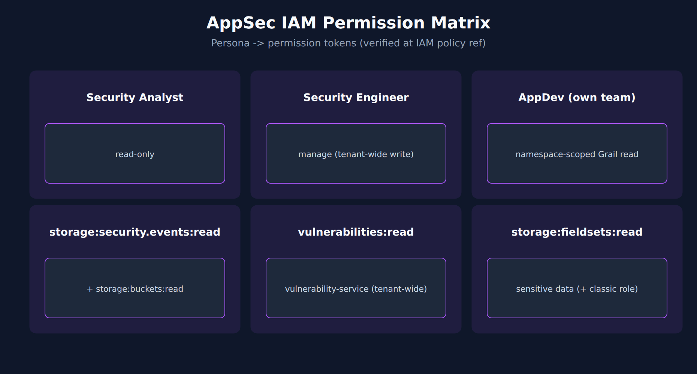

# APPSEC-09: IAM and Gen3 Permissions for AppSec

> **Series:** APPSEC — Application Security | **Notebook:** 9 of 10 | **Created:** June 2026 | **Last Updated:** 10/02/2026

## Overview

AppSec data is among the most sensitive material in Dynatrace — vulnerability inventory, captured attack payloads, compliance findings. Granting too much access exposes private payloads; granting too little blocks the SOC from doing its job. This notebook is the IAM-design notebook for AppSec: the permission catalog (verified verbatim against the IAM policy statements reference), three persona policies, boundary patterns, and the privacy carve-out for `view-sensitive-request-data`.

This is the most-grounded notebook in the series — the [IAM policy statements reference (DT docs)](https://docs.dynatrace.com/docs/manage/identity-access-management/permission-management/manage-user-permissions-policies/advanced/iam-policystatements) was resolvable at series-creation time and the tokens below were verified verbatim on 06/04/2026.



<!-- MARKDOWN_TABLE_ALTERNATIVE
| Persona | Read | Manage | Sensitive payload |
|---------|------|--------|-------------------|
| Analyst | yes | no | no |
| Security Engineer | yes | yes (tenant-wide — write takes no conditions) | optional |
| AppDev | namespace-scoped Grail findings | no | no |
-->

---

## Table of Contents

1. [1. AppSec IAM in Gen3 — Same DSL, Specific Tokens](#appsec-iam-different)
2. [2. The AppSec Permission Catalog (Verified)](#permission-catalog)
3. [3. Persona Policies (Worked Examples)](#personas)
4. [4. Boundary Patterns for AppSec Data](#boundary-patterns)
5. [5. Privacy: view-sensitive-request-data](#sensitive-payload)
6. [6. Reach for Managed Policies First](#managed-policies)
7. [7. OAuth Client vs Platform Token Scope Routing](#auth-routing)
8. [8. Audit and Periodic Review](#audit)
9. [9. What's Still Evolving](#evolving)
10. [10. Next Steps](#next)
11. [References](#references)

---

## Prerequisites

| Requirement | Details |
|-------------|---------|
| **Dynatrace Environment** | Gen3 SaaS with Grail; AppSec entitlement enabled |
| **OneAgent** | Full-Stack mode (or code-module attached) on monitored hosts |
| **Read access** | To run the DQL: `storage:security.events:read` **plus** `storage:buckets:read` (a table permission alone reads nothing). The Vulnerabilities and Threats & Exploits apps have their own requirements — see APPSEC-09 for the full model |
| **Background** | APPSEC-01 (fundamentals + three-pillar framing) |

<a id="appsec-iam-different"></a>
## 1. AppSec IAM in Gen3 — Same DSL, Specific Tokens

AppSec data in Gen3 lives in Grail (`security.events`) and the `vulnerability-service` API. Both are governed by the same `ALLOW <service>:<resource>:<action> WHERE <conditions>` policy DSL as the rest of Gen3 — not by classic environment roles.

The `environment:roles:*` permissions — `view-security-problems`, `manage-security-problems`, `view-sensitive-request-data` — belong to the **deprecated classic apps** (Third-Party Vulnerabilities, Security Overview). In Latest Dynatrace the surfaces are:

- Grail data → `storage:security.events:read` **plus** `storage:buckets:read` (and `storage:fieldsets:read` for sensitive fields — § 5)
- The Vulnerabilities app and API → `vulnerability-service:vulnerabilities:read` / `:write`, plus the app's documented default policies: *Read Entities*, *Read Security Events*, and one of *Admin User*, *Pro User* or *Standard User*
- Classic apps only → `environment:roles:*`

A complete AppSec persona policy needs the Grail grants and the vulnerability-service grants; the classic roles matter only while you still use the classic apps. See IAM-04 § Policy Authoring for the underlying DSL grammar.

> <sub>**Sources:** [IAM policy statements reference (DT docs)](https://docs.dynatrace.com/docs/manage/identity-access-management/permission-management/manage-user-permissions-policies/advanced/iam-policystatements) — `storage:security.events:read`: *"Read security.events from grail"*; `vulnerability-service:vulnerabilities:read`: *"Allows viewing vulnerabilities"*; [Vulnerability Analytics (DT docs)](https://docs.dynatrace.com/docs/secure/application-security/vulnerability-analytics) — *"This permissions section refers to the classic Third-Party Vulnerabilities and Security Overview apps, which are deprecated."*; [Vulnerabilities (DT docs)](https://docs.dynatrace.com/docs/secure/vulnerabilities) — *"Read Entities Read Security Events One of the following user policies: Admin User , Pro User , Standard User"* (all re-read 10/02/2026).</sub>

<a id="permission-catalog"></a>
## 2. The AppSec Permission Catalog (Verified)

Tokens below were verified verbatim on 10/02/2026 against the IAM policy statements reference. Re-verify before pinning these into a production policy.

### AppSec-specific tokens

| Token | Purpose | Optional conditions |
|-------|---------|---------------------|
| `environment:roles:view-security-problems` | Classic apps only: view security problems | Management zone scope |
| `environment:roles:manage-security-problems` | Classic apps only: manage security problems | Management zone scope |
| `environment:roles:view-sensitive-request-data` | View sensitive request data (classic; the *Read Sensitive Data* default policy pairs it with `storage:fieldsets:read`) | Management zone scope |
| `environment:roles:configure-request-capture-data` | Configure capture of sensitive data | — |
| `storage:security.events:read` | Read security events from Grail | Bucket, event-type, K8s namespace, cluster, host, cloud account |
| `storage:buckets:read` | Read records from Grail buckets — **required in addition to** `storage:security.events:read`; scope it with `WHERE storage:table-name = "security.events"` | Table name, bucket name |
| `storage:fieldsets:read` | Read data from fieldsets — the Grail half of sensitive-data access (§ 5) | Table, bucket, fieldset name |
| `openpipeline:security.events:ingest` | Ingest security events into OpenPipeline | — |
| `vulnerability-service:vulnerabilities:read` | View vulnerabilities (programmatic) | — |
| `vulnerability-service:vulnerabilities:write` | Modify vulnerability information — in the app: mute status and ticket links of affected entities | — |
| `security-intelligence:enrichments:run` | Run enrichments (IP-address attribution, integration-app discovery) — relevant for Threats & Exploits / RAP investigation | — |

### Platform-collateral tokens AppSec apps load on top of the above

The AppSec product surfaces (Vulnerabilities app, Threats & Exploits app, Security Posture Management app) also need general Gen3 platform reads to load and operate — these are **not AppSec-specific**, they're what every Gen3 app needs:

`storage:entities:read`, `storage:logs:read`, `storage:filter-segments:read`, `document:documents:read`, `settings:objects:read`, `hub:catalog:read`, `state:user-app-states:read`, `state:user-app-states:write`

These are usually already granted by the managed user policies covered in § 6 — call them out explicitly in audit conversations so reviewers know they're collateral, not AppSec-elevated access. `storage:buckets:read` is deliberately **not** in this list: every `fetch security.events` needs it, so the persona policies in § 3 grant it explicitly rather than assume it.

### Critical corrections (verified)

1. **There is no `storage:security_problems:read` token.** Vulnerability read access in Latest Dynatrace is `vulnerability-service:vulnerabilities:read`; `environment:roles:view-security-problems` only serves the classic apps. Common mistake when copying patterns from other Grail tables.
2. **The storage token is `security.events` with a dot**, not `security_events` with an underscore. The ingest token lives in the `openpipeline` service — `openpipeline:security.events:ingest` — not in `storage`.
3. **`environment-api:security-problems:read` is NOT in the IAM policy reference** as of 10/02/2026. If you see this token cited (some docs assistants surface it), it's not a current IAM permission token — use `vulnerability-service:vulnerabilities:read` for programmatic vuln access instead.

> <sub>**Sources:** [IAM policy statements reference (DT docs)](https://docs.dynatrace.com/docs/manage/identity-access-management/permission-management/manage-user-permissions-policies/advanced/iam-policystatements) — every token re-read 10/02/2026, including `storage:buckets:read` (*"Grants permission to read records from Grail buckets. Required additionally to a table permission."*) and `openpipeline:security.events:ingest` (*"Grants permission to ingest security events into OpenPipeline"*).</sub>

<a id="personas"></a>
## 3. Persona Policies (Worked Examples)

Three personas, three policies. Copy and adapt to your tenant's group structure. Each assumes the group also holds the Vulnerabilities app's documented default policies (*Read Entities*, *Read Security Events*, one of *Admin/Pro/Standard User*) — the statements below are the AppSec-specific part.

### Persona A — Security Analyst (read-only)

```
ALLOW storage:buckets:read WHERE storage:table-name = "security.events";
ALLOW storage:security.events:read;
ALLOW vulnerability-service:vulnerabilities:read;
```

This is the SOC's daily-driver policy. Read everything, change nothing. Does **not** include sensitive-data access — see § 5.

### Persona B — Security Engineer (manage)

```
ALLOW storage:buckets:read WHERE storage:table-name = "security.events";
ALLOW storage:security.events:read;
ALLOW vulnerability-service:vulnerabilities:read;
ALLOW vulnerability-service:vulnerabilities:write;
```

`vulnerability-service:vulnerabilities:write` takes no conditions, so in Latest Dynatrace it **cannot be limited to production**: whoever holds it can change mute status and ticket links on any vulnerability in the environment. Separate production from non-production by using separate environments, or by keeping the group that holds write small. A `WHERE environment:management-zone = …` condition on `environment:roles:manage-security-problems` only affects the deprecated classic apps — and management zones are not available in Latest Dynatrace.

### Persona C — AppDev (namespace-scoped Grail read)

```
ALLOW storage:buckets:read WHERE storage:table-name = "security.events";
ALLOW storage:security.events:read
  WHERE storage:k8s.namespace.name IN ("team-payments-prod", "team-payments-staging");
```

This scopes **Grail reads of records that carry `k8s.namespace.name`** — compliance findings and vulnerability findings (APPSEC-06 § 2). It does not give the team its own view of RVA vulnerabilities:

- **RVA vulnerability events carry no `k8s.namespace.name`**, so the namespace condition cannot match them. To scope them, set `dt.security_context` on security events with OpenPipeline enrichment and condition on that instead — and test with a scoped user before rollout.
- **`vulnerability-service:vulnerabilities:read` is tenant-wide.** Adding it would show the team every vulnerability in the Vulnerabilities app. Leave it out unless tenant-wide visibility is acceptable.

Two syntax details: IAM lists use `IN ("…", "…")` with parentheses — DQL's `{…}` array syntax fails policy validation — and every persona needs `storage:buckets:read` alongside the table permission, or `fetch security.events` returns nothing.

> <sub>**Sources:** [IAM policy statements reference (DT docs)](https://docs.dynatrace.com/docs/manage/identity-access-management/permission-management/manage-user-permissions-policies/advanced/iam-policystatements) for the conditions and operators on each token (`storage:k8s.namespace.name` accepts `=`, `IN`, `startsWith`, `MATCH`; `vulnerability-service:vulnerabilities:write` — *"Allows modifying vulnerability related information"* — lists none); [IAM policy statement syntax (DT docs)](https://docs.dynatrace.com/docs/manage/identity-access-management/permission-management/manage-user-permissions-policies/iam-policystatement-syntax) for the `IN ("…", "…")` list form; [Upgrade security notifications (DT docs)](https://docs.dynatrace.com/docs/platform/upgrade/best-practices/stage-09-team-based-global-alerting/upgrade-security-notifications) — *"Management zones are not available in Latest Dynatrace. Replace management zone scoping with Grail record-based field filters."*; [Vulnerability events (DT semantic dictionary)](https://docs.dynatrace.com/docs/semantic-dictionary/model/security-events/vulnerability) — RVA vulnerability events name clusters and workloads in `related_entities.*` arrays, and the Kubernetes resource fields appear only on finding and scan events (all re-read 10/02/2026). **Derived:** a namespace condition cannot match records that lack the field — not tested with a scoped user on RVA data, which the validation tenant does not have.</sub>

<a id="boundary-patterns"></a>
## 4. Boundary Patterns for AppSec Data

Beyond the three personas above, in community practice three boundary patterns recur in AppSec IAM:

1. **Small write group** — Persona B above. Write cannot be environment-scoped inside one environment, so keep the group that holds it small, or split production into its own environment.
2. **Namespace-scoped read** — Persona C above. AppDev team sees only its own namespaces.
3. **Sensitive-payload carve-out** — sensitive-data access (`storage:fieldsets:read`, plus `view-sensitive-request-data` for the classic apps) granted separately to a small named group (SOC tier 2 / incident responders), not to the general read-only group.

For workflows that change vulnerabilities (ticket links, mute status), grant `vulnerability-service:vulnerabilities:write` to the dedicated service user the workflow runs as (§ 7), not to a shared OAuth client.

> <sub>**Sources:** [IAM policy statements reference (DT docs)](https://docs.dynatrace.com/docs/manage/identity-access-management/permission-management/manage-user-permissions-policies/advanced/iam-policystatements) for boundary syntax.</sub>

<a id="sensitive-payload"></a>
## 5. Privacy: view-sensitive-request-data

RAP attack events can include the actual request payload that triggered the detection — the SQL injection string, the JNDI lookup URL, the command-injection input. These payloads frequently contain PII or other sensitive material that came through the application boundary.

Dynatrace's *Read Sensitive Data* default policy grants two statements: `storage:fieldsets:read` (Grail) and `environment:roles:view-sensitive-request-data` (classic). Track both — an audit that lists only the role misses the Grail half. In community practice in regulated environments, three operating rules are common:

1. **Don't grant it broadly.** Grant to incident responders + SOC tier 2, not to general read-only roles. The default-deny posture matters.
2. **Pair with `configure-request-capture-data`** for the small group responsible for tuning what gets captured.
3. **Audit access regularly.** Who has either permission, when did they last use it, against which events? Captured-payload access is exactly the surface auditors scrutinize.

This is the carve-out where AppSec IAM most often gets too generous — make it explicit who has it and why.

> <sub>**Sources:** [Default policies (DT docs)](https://docs.dynatrace.com/docs/manage/identity-access-management/permission-management/default-policies) — *"Read Sensitive Data Grants unconditional permissions to read sensitive data in Dynatrace."*, whose policy is `ALLOW storage:fieldsets:read;` plus `ALLOW environment:roles:view-sensitive-request-data;` under `//Classic`; [IAM policy statements reference (DT docs)](https://docs.dynatrace.com/docs/manage/identity-access-management/permission-management/manage-user-permissions-policies/advanced/iam-policystatements) — `environment:roles:configure-request-capture-data`: *"Grants user the Configure capture of sensitive data permission."* (re-read 10/02/2026). **Softened:** the three operating rules are community practice.</sub>

<a id="managed-policies"></a>
## 6. Reach for Managed Policies First

Following IAM-04 § 6 guidance, prefer Dynatrace's default policies over hand-rolled custom policies wherever they cover the use case. The ones that matter for AppSec are documented by name:

- **Read Security Events** — security events from the `events` and `security.events` tables and the default security-event buckets (includes `storage:buckets:read` for `security.events`)
- **Read Entities** — required by the Vulnerabilities app
- **Admin User / Pro User / Standard User** — one of these is required by the Vulnerabilities app
- **Read Sensitive Data** — `storage:fieldsets:read` + the classic sensitive-data role (§ 5)

If a default policy covers 80% of a persona's need, use it and add a small custom policy for the deltas, rather than rebuilding the whole grant set from scratch. This shrinks the audit surface and reduces drift across persona definitions.

> <sub>**Sources:** [Default policies (DT docs)](https://docs.dynatrace.com/docs/manage/identity-access-management/permission-management/default-policies) — *"Read Security Events Grants unconditional access to the security events from both, events and security.events tables and to the default security event buckets."*; [Vulnerabilities (DT docs)](https://docs.dynatrace.com/docs/secure/vulnerabilities) — *"Read Entities Read Security Events One of the following user policies: Admin User , Pro User , Standard User"* (re-read 10/02/2026).</sub>

<a id="auth-routing"></a>
## 7. OAuth Client vs Platform Token Scope Routing

Workflows and external automation authenticate differently:

- **Workflows** run as their *actor* — by default the user who created the workflow, or a non-interactive service user you select. No token is involved: the workflow gets that identity's policies. For security workflows, give **both** the creating user and the service user `storage:security.events:read` (plus `storage:buckets:read`).
- **External automation** (scripts, CI, Terraform) calling Grail or the vulnerability-service API: a platform token on a service user. AUTOM-04 § 3, *Provider Configuration*, covers the three-things-align model.
- **For classic config APIs** that AppSec workflows occasionally touch (rare in v1 AppSec, more common as workflows chain into broader automation): classic API Token may still be required for some endpoints.

In community practice, teams avoid granting `vulnerability-service:vulnerabilities:write` on a long-lived shared OAuth client — too much blast radius — and bind it to a dedicated Service User that holds only this permission. The policy-statement reference lists no conditions for `vulnerability-service:vulnerabilities:write`, so the permission itself cannot be narrowed — and management zones are not available in Latest Dynatrace to narrow it with. Scope *which* findings the workflow acts on in its trigger filter instead, using `dt.security_context`, a primary Grail field, or `primary_tags.*`.

> <sub>**Sources:** [Workflow security (DT docs)](https://docs.dynatrace.com/docs/analyze-explore-automate/workflows/security) — *"By default, the workflow actor is the user who created the workflow. However, there is the option to select a non-interactive service user as the actor of a workflow."*; [Upgrade security notifications (DT docs)](https://docs.dynatrace.com/docs/platform/upgrade/best-practices/stage-09-team-based-global-alerting/upgrade-security-notifications) — *"Management zones are not available in Latest Dynatrace. Replace management zone scoping with Grail record-based field filters."* and *"Use custom metadata enrichment to set dt.security_context on security events via OpenPipeline, then filter by it in the workflow trigger."* and *"Assign this permission to both the human user creating the Workflow and the service user the Workflow runs as."*; [IAM policy statements (DT docs)](https://docs.dynatrace.com/docs/manage/identity-access-management/permission-management/manage-user-permissions-policies/advanced/iam-policystatements) — `vulnerability-service:vulnerabilities:write` is listed with no conditions.</sub>

<a id="audit"></a>
## 8. Audit and Periodic Review

Audit IAM bindings for AppSec the same way you would audit any sensitive-data access. In community practice a quarterly minimum cadence is common — adapt it to your audit regime:

1. **Who has `storage:fieldsets:read` or `view-sensitive-request-data`?** Pull the group memberships; remove anyone who hasn't used it in 90 days.
2. **Who has `vulnerability-service:vulnerabilities:write`** (and, while classic apps remain, `manage-security-problems`)? Write is a privileged, tenant-wide grant.
3. **Which service users act as workflow actors** with AppSec permissions? Confirm each one is still in active workflow service.
4. **Are namespace-scoped policies still aligned with team ownership?** Team boundaries shift; policies don't auto-update.

The query for "who can read security.events in production?" can be answered via the IAM API (see IAM-04 § 7 Policy Testing and Validation).

> <sub>**Sources:** [IAM policy statements reference (DT docs)](https://docs.dynatrace.com/docs/manage/identity-access-management/permission-management/manage-user-permissions-policies/advanced/iam-policystatements).</sub>

<a id="evolving"></a>
## 9. What's Still Evolving

Three areas where the AppSec IAM model is less settled and verification-at-policy-time is warranted:

1. **Boundary conditions on `vulnerability-service:vulnerabilities:read`** — at 10/02/2026 the policy reference shows no condition options for this token. If this changes, narrower programmatic AppDev access becomes possible.
2. **Default-policy catalog** — coverage changes per release. Re-read the default-policies page before relying on one in a persona design.
3. **Cross-tenant AppSec access patterns** — multi-tenant SOC operations are still operator-discipline rather than first-class IAM features.

> <sub>**Softened:** none of the three are official Dynatrace roadmap items — they're observations of where the model is thinner than the rest of Gen3 IAM as of 10/02/2026. Re-verify at policy-author time.</sub>

<a id="next"></a>
## 10. Next Steps

1. Adopt the three persona policies as starting points. Adapt the namespace names to your tenant, and decide how you will scope RVA visibility (`dt.security_context`).
2. List who has `storage:fieldsets:read` or `view-sensitive-request-data` today. If the list is longer than your incident-responder roster, narrow it.
3. Read **APPSEC-08** for workflow actors and ticket linkage.
4. Read **IAM-04** and **IAM-05** for the underlying DSL grammar and review patterns — this notebook only covers the AppSec-specific overlay.

<a id="references"></a>
## References

| Source | Coverage |
|--------|----------|
| [IAM policy statements reference (DT docs)](https://docs.dynatrace.com/docs/manage/identity-access-management/permission-management/manage-user-permissions-policies/advanced/iam-policystatements) | Every permission token verified verbatim |
| [Default policies (DT docs)](https://docs.dynatrace.com/docs/manage/identity-access-management/permission-management/default-policies) | Read Security Events, Read Sensitive Data, user policies |
| [Vulnerabilities (DT docs)](https://docs.dynatrace.com/docs/secure/vulnerabilities) | Vulnerabilities app permission requirements |
| [Application Security (DT docs)](https://docs.dynatrace.com/docs/secure/application-security) | Three-pillar framing |

---

> <sub>**⚠️ DISCLAIMER**: This information was AI generated and is provided "as-is" without warranty. It was produced as an independent, community-driven project and **not supported by Dynatrace**. Always refer to official [Dynatrace documentation](https://docs.dynatrace.com/docs) for the most current information.</sub>
