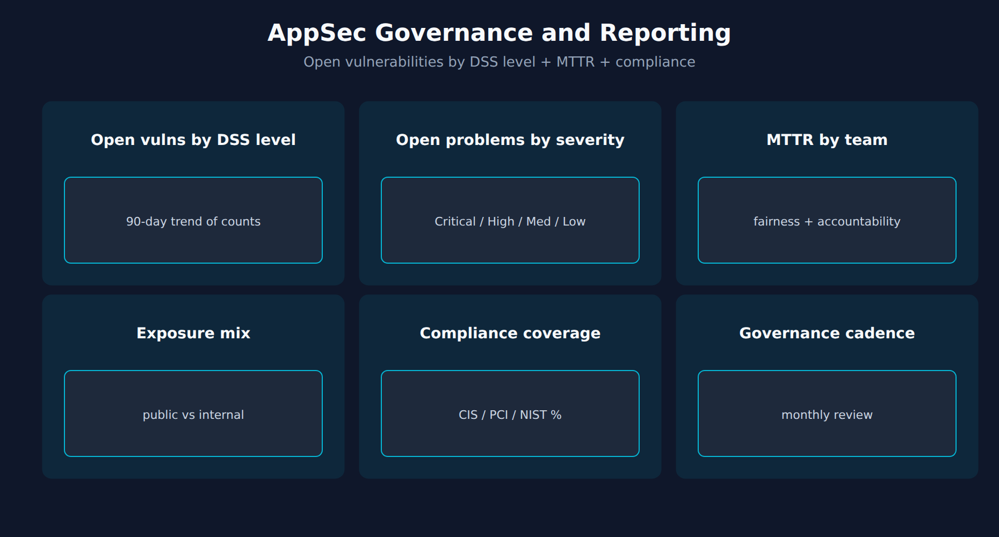

# APPSEC-10: Dashboards, Reporting and Governance

> **Series:** APPSEC — Application Security | **Notebook:** 10 of 10 | **Created:** June 2026 | **Last Updated:** 09/18/2026

## Overview

AppSec produces signal continuously — dashboards and governance turn that signal into decisions. This closing notebook covers the executive-facing dashboard composition, the cadence of the governance review, and the FinOps angle (RVA and RAP are DPS-billed per monitored GiB-hour, so cost follows where they are enabled).

This is the final notebook in the series. The other nine cover the data sources; this one covers what to do with them at the leadership and program level.



<!-- MARKDOWN_TABLE_ALTERNATIVE
| View | Audience | Cadence |
|------|----------|---------|
| Open vulnerabilities by DSS level (trend) | Exec / CISO | Quarterly |
| Severity mix | Security eng | Weekly |
| MTTR by team | Program lead | Monthly |
| Compliance % | Auditor / CISO | Quarterly |
-->

---

## Table of Contents

1. [1. Open Vulnerabilities by DSS Level — the Trend](#dss-trend)
2. [2. Open Problems by Severity](#severity-mix)
3. [3. MTTR by Team](#mttr)
4. [4. Compliance Framework Coverage](#compliance-coverage)
5. [5. Governance Cadence](#cadence)
6. [6. DPS Cost Awareness](#dps-cost)
7. [7. Series Wrap](#series-wrap)
8. [References](#references)

---

## Prerequisites

| Requirement | Details |
|-------------|---------|
| **Dynatrace Environment** | Gen3 SaaS with Grail; AppSec entitlement enabled |
| **OneAgent** | Full-Stack mode (or code-module attached) on monitored hosts |
| **Read access** | At minimum `environment:roles:view-security-problems` and `storage:security.events:read` — see APPSEC-09 for the full model |
| **Background** | APPSEC-01 (fundamentals + three-pillar framing) |

<a id="dss-trend"></a>
## 1. Open Vulnerabilities by DSS Level — the Trend

DSS is a per-vulnerability score (APPSEC-01 § 4), so there is no single tenant-wide "DSS" to chart. The board-facing metric is the **count of open vulnerabilities at each DSS level**, trended over a 90-day window — § 2's query, run on a schedule. Treat it as directional:

- **More open vulnerabilities at CRITICAL / HIGH** = posture deteriorating. Investigate which applications or libraries added them.
- **Flat** = posture stable. Could mean no new risk, or could mean stalled remediation — pair with backlog burn-rate from APPSEC-08 to disambiguate.
- **Fewer open vulnerabilities at CRITICAL / HIGH** = remediation is outpacing new findings.

Do **not** compare these counts across tenants or business units without normalizing for estate size and monitoring-mode coverage (per APPSEC-01 § 3–4) — Infrastructure-mode hosts keep DSS at the CVSS base score, which shifts the level mix. Use within-tenant deltas.

> <sub>**Sources:** [Vulnerabilities concepts (DT docs)](https://docs.dynatrace.com/docs/secure/vulnerabilities/concepts) — *"This scoring system forms the foundation for the Dynatrace Security Score (DSS), which adds environmental context to help prioritize remediation."*; [Application Security (DT docs)](https://docs.dynatrace.com/docs/secure/application-security) — *"the DSS will be the same as the CVSS base score"* in Infrastructure Monitoring deployments (both re-read 09/18/2026). **Derived:** the trending-direction interpretation guide is community practice.</sub>

<a id="severity-mix"></a>
## 2. Open Problems by Severity

The underlying view: how many vulnerabilities are open right now, by DSS level? The query keeps the latest vulnerability-level snapshot per vulnerability, so each open vulnerability counts once however often RVA re-reports it.

| Severity | Treatment |
|----------|-----------|
| Critical | Daily review; SLA 7 days |
| High | Weekly review; SLA 30 days |
| Medium | Sprint review; SLA 90 days |
| Low | Quarterly cleanup |

A healthy mix has Critical near zero, High in single digits, Medium and Low forming the long tail. A growing Critical count is the strongest early-warning signal.

```dql
// Current open vulnerabilities by risk level (latest snapshot per vulnerability)
fetch security.events, from:-7d
| filter event.provider == "Dynatrace"
| filter event.category == "VULNERABILITY_MANAGEMENT"
| filter event.type == "VULNERABILITY_STATE_REPORT_EVENT"
| filter event.level == "VULNERABILITY"
| dedup {vulnerability.display_id}, sort:{timestamp desc}
| filter vulnerability.resolution.status == "OPEN"
| filter vulnerability.mute.status == "NOT_MUTED"
| summarize open = count(), by:{vulnerability.risk.level}
| sort open desc

```

> **Validation note:** validated for syntax and field names on 09/18/2026 and executes cleanly; the validation tenant has no RVA data, so it returned 0 rows there.
>
> <sub>**Sources:** [Vulnerability events (DT semantic dictionary)](https://docs.dynatrace.com/docs/semantic-dictionary/model/security-events/vulnerability) — *"A vulnerability state event is a periodic snapshot, emitted by Dynatrace Runtime Vulnerability Analytics (RVA), of a vulnerability's current status and risk aggregated across every entity it affects."* (re-read 09/18/2026). **Dictionary:** `vulnerability.risk.level` (`stable`), `vulnerability.resolution.status` (`stable`), `vulnerability.mute.status` (`stable`), `vulnerability.display_id` (`stable`), read 09/18/2026. **Softened:** the SLA day counts (7/30/90) are common but should be set per your governance regime, not adopted blindly.</sub>

<a id="mttr"></a>
## 3. MTTR by Team

Mean Time To Remediate by team is the fairness metric. It tells you which teams are keeping up and which need help (engineering capacity, blocked dependencies, prioritization conflict).

For accountability dashboards, group by team or by namespace owner — not by individual developer. The latter creates the wrong incentives and surfaces noise.

> <sub>**Derived:** MTTR-by-team is borrowed from SRE / incident-management practice; the AppSec docs do not prescribe it directly. The *don't group by individual* guidance is community practice and a non-trivial governance design choice.</sub>

<a id="compliance-coverage"></a>
## 4. Compliance Framework Coverage

For organizations subject to specific compliance regimes (PCI, HIPAA, SOC 2, ISO 27001), the dashboard view that matters is *percent of controls in compliance* by framework, not total finding counts.

Pick the primary framework (one) for governance reporting. Use the others as secondary views. Cross-framework rollups are usually misleading because the same finding lands in multiple frameworks.

> <sub>**Sources:** [Application Security (DT docs)](https://docs.dynatrace.com/docs/secure/application-security) for SPM compliance framing. **Derived:** the *one primary framework* recommendation is community practice — verify against your audit regime.</sub>

<a id="cadence"></a>
## 5. Governance Cadence

A workable cadence for most organizations:

| Cadence | Audience | Content |
|---------|----------|---------|
| Daily | Security on-call | New Critical vulnerabilities, RAP detection spikes |
| Weekly | Security engineering | Open backlog by team, MTTR trend, burn-rate |
| Monthly | AppSec program lead + AppDev leadership | Open-vulnerability trend by DSS level, compliance coverage, IAM access review |
| Quarterly | CISO + exec staff | 90-day trend of open vulnerabilities by DSS level, compliance posture by framework, capacity asks |

The artifacts above (open-vulnerability trend by DSS level, severity mix, MTTR, compliance) feed all four cadences — what differs is the aggregation level and the audience-appropriate framing.

> <sub>**Derived:** the four-cadence model is common but not prescribed by Dynatrace docs. Adapt to your organization's existing security-governance rhythm.</sub>

<a id="dps-cost"></a>
## 6. DPS Cost Awareness

Runtime Vulnerability Analytics and Runtime Application Protection are DPS-billed in **GiB-hours** — per monitored host or container, based on its memory — not per `security.events` record. Cost is therefore driven by *which hosts have RVA and RAP enabled*, not by how many findings or detections they produce. Three FinOps practices:

1. **Scope enablement, not events.** Use monitoring rules for process groups to enable RVA and RAP where the risk justifies it; dropping or sampling detection records saves nothing and discards attack evidence.
2. **Track consumption per capability and host** — FINOPS-01 § 5 covers the host-based capability queries, and FINOPS-02 the forecasting model. AppSec is one tenant-wide consumer among many.
3. **Watch detection volume as a signal-quality metric, not a cost metric.** A spike in RAP detections with no matching incident suggests rules generating false positives — tune them (APPSEC-04 § 3) for the analysts' sake.

Don't sacrifice security signal for cost savings without an explicit risk acceptance. But don't ignore cost either — it's a budget reality.

> <sub>**Sources:** [Runtime Vulnerability Analytics (DPS) (DT docs)](https://docs.dynatrace.com/docs/license/capabilities/application-security/runtime-vulnerability-analytics) — *"The unit of measure for Runtime Vulnerability Analytics is the GiB-hour"*; [Runtime Application Protection (DPS) (DT docs)](https://docs.dynatrace.com/docs/license/capabilities/application-security/runtime-application-protection) — *"The unit of measure for Runtime Application Protection is a GiB hour"* (both re-read 09/18/2026). **Derived:** practice 1 follows from the GiB-hour unit; practices 2–3 are community guidance — verify against your organization's DPS-management discipline.</sub>

<a id="series-wrap"></a>
## 7. Series Wrap

The series in one paragraph: AppSec in Gen3 SaaS is **three pillars** (RVA + RAP + SPM) over **one Grail data plane** (security.events + vulnerability-service), with **dual-surface IAM** (Grail + environment roles), consumed via **dashboards / workflows / Davis CoPilot**, and governed at the **monthly + quarterly** cadence with **open vulnerabilities by DSS level** as the headline metric. The OneAgent code module is the load-bearing dependency under all of it.

Where to go from here:
- Open APPSEC-01 again with the rest of the series fresh and confirm the mental map.
- Stand up the persona policies from APPSEC-09 before granting broad access.
- Wire one end-to-end workflow per APPSEC-08 to prove the loop closes.
- Set the governance cadence and the first review date for the open-vulnerability trend.

<a id="references"></a>
## References

| Source | Coverage |
|--------|----------|
| [Application Security (DT docs)](https://docs.dynatrace.com/docs/secure/application-security) | DSS + posture framing |
| [Vulnerabilities concepts (DT docs)](https://docs.dynatrace.com/docs/secure/vulnerabilities/concepts) | DSS as a per-vulnerability score |
| [Vulnerability events (DT semantic dictionary)](https://docs.dynatrace.com/docs/semantic-dictionary/model/security-events/vulnerability) | Fields used in § 2 |
| [Runtime Vulnerability Analytics (DPS) (DT docs)](https://docs.dynatrace.com/docs/license/capabilities/application-security/runtime-vulnerability-analytics) | RVA billing unit |
| [Runtime Application Protection (DPS) (DT docs)](https://docs.dynatrace.com/docs/license/capabilities/application-security/runtime-application-protection) | RAP billing unit |

---

> <sub>**⚠️ DISCLAIMER**: This information was AI generated and is provided "as-is" without warranty. It was produced as an independent, community-driven project and **not supported by Dynatrace**. Always refer to official [Dynatrace documentation](https://docs.dynatrace.com/docs) for the most current information.</sub>
