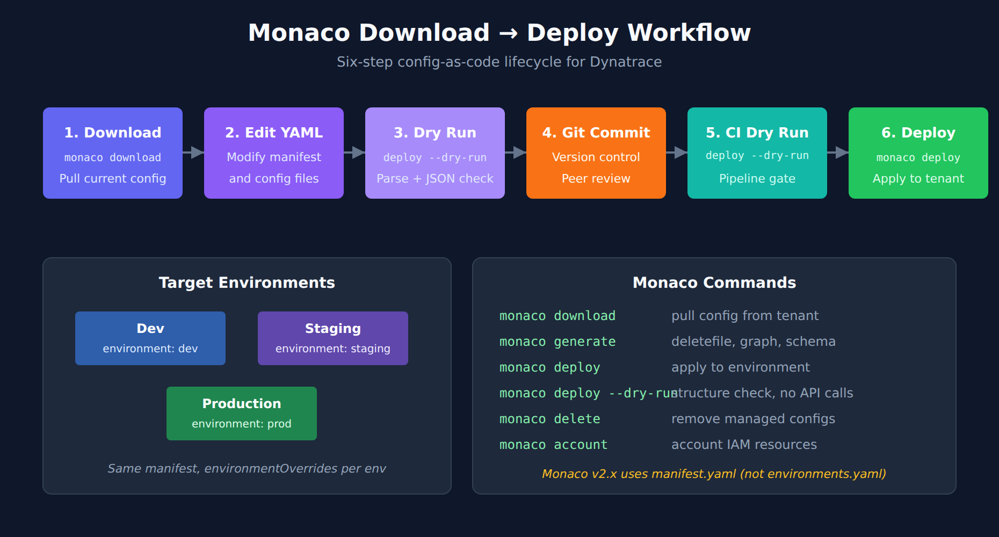

# AUTOM-03: Monaco Configuration-as-Code

> **Series:** AUTOM — Dynatrace Automation | **Notebook:** 3 of 9 | **Created:** January 2026 | **Last Updated:** 07/31/2026

Monaco (Monitoring as Code) is Dynatrace's official CLI tool for configuration management. It uses YAML files to define configurations and supports version control, CI/CD integration, and multi-environment deployments.

---

## Table of Contents

1. [Introduction](#introduction)
2. [Getting Started](#getting-started)
3. [Project Structure](#project-structure)
4. [Configuration Files](#configuration-files)
5. [Common Operations](#common-operations)
6. [Advanced Features](#advanced-features)

---

## Prerequisites

Before starting this notebook, ensure you have:

| Requirement | Description |
|-------------|-------------|
| Monaco CLI | Installed via GitHub releases or brew |
| API Token | Token with `settings.read`, `settings.write`, `ReadConfig`, `WriteConfig` |
| Tenant URL | Your Dynatrace SaaS tenant URL |

---

## Learning Objectives

By the end of this notebook, you will:

- Understand Monaco's configuration-as-code model
- Know how to download existing configurations
- Be able to create and deploy configurations via YAML
- Handle multi-environment deployments

---

<a id="introduction"></a>
## 1. Introduction
### Why Monaco?

| Benefit | Description |
|---------|-------------|
| **Version Control** | Track all changes in Git |
| **Repeatability** | Deploy same config to multiple environments |
| **Review Process** | Use pull requests for config changes |
| **Disaster Recovery** | Quickly restore configurations |
| **Documentation** | YAML files serve as living documentation |

### Monaco vs Direct API

| Aspect | Monaco | Settings API |
|--------|--------|---------------|
| Format | YAML files | JSON payloads |
| State management | Implicit (by name) | Manual tracking |
| Multi-tenant | Built-in support | Custom scripting |
| Dry run | Yes (`--dry-run`) | No |
| Delete orphans | Yes (`delete` command) | Manual |

> **Already a Terraform shop?** See **AUTOM-01 §5: When a Terraform Shop Should Add Monaco** for the five patterns where Monaco still earns its place — most commonly bulk download from an existing tenant, multi-tenant identical-config deployment, and app-team self-service without state management.


---

<a id="getting-started"></a>
## 2. Getting Started
### Installation

**macOS (Homebrew):**
```bash
brew install dynatrace-oss/monaco/monaco
```

**Linux/Windows:**
```bash
# Download from GitHub releases
curl -L https://github.com/Dynatrace/dynatrace-configuration-as-code/releases/latest/download/monaco-linux-amd64 -o monaco
chmod +x monaco
```

**Verify installation:**
```bash
monaco version
```

### Environment Setup

Create environment variables for authentication:

```bash
export DT_TENANT_URL="https://{tenant-id}.live.dynatrace.com"
export DT_API_TOKEN="<your-api-token>"
```

---

### Your First Download

Download all configurations from your tenant:

```bash
monaco download \
  --environment-url "$DT_TENANT_URL" \
  --api-token "$DT_API_TOKEN" \
  --output-folder ./downloaded-config
```

Download specific configuration types:

```bash
monaco download \
  --environment-url "$DT_TENANT_URL" \
  --api-token "$DT_API_TOKEN" \
  --output-folder ./downloaded-config \
  --api builtin:management-zones,builtin:tags.auto-tagging
```

> **Downloading classic schemas is the point here, not an oversight.** Both schemas above are marked **Blocked at upgrade** in AUTOM-02's Settings 2.0 catalog — they work today and stop answering once your tenant moves to the latest Dynatrace. That makes `monaco download` the fastest way to *inventory* what you still have before migrating it: every object, in version control, in one command. Keep the export as your migration worksheet; retarget the deployment. What it should not become is a template for new configuration.

---

<a id="project-structure"></a>
## 3. Project Structure
### Recommended Layout

```
dynatrace-config/
├── manifest.yaml              # Project manifest
├── environments/
│   ├── development.yaml       # Dev environment config
│   ├── staging.yaml           # Staging config
│   └── production.yaml        # Production config
└── projects/
    └── my-project/
        ├── management-zones/
        │   └── config.yaml
        ├── auto-tagging/
        │   └── config.yaml
        └── alerting-profiles/
            └── config.yaml
```

### Manifest File

The `manifest.yaml` defines your project:

```yaml
manifestVersion: 1.0

projects:
  - name: my-project
    path: projects/my-project

environmentGroups:
  - name: default
    environments:
      - name: development
        url:
          type: environment
          value: DT_DEV_URL
        auth:
          token:
            type: environment
            value: DT_DEV_TOKEN
      - name: production
        url:
          type: environment
          value: DT_PROD_URL
        auth:
          token:
            type: environment
            value: DT_PROD_TOKEN
```

---

<a id="configuration-files"></a>
## 4. Configuration Files

> **About the schemas used in these examples.** Management zones, auto-tagging and alerting profiles appear throughout §4–§6 because they are the configurations most tenants already have, which makes them the clearest illustrations of Monaco's YAML shape. All three are marked **Blocked at upgrade** in AUTOM-02's Settings 2.0 catalog.
>
> That matters more for Monaco than for the raw API. Monaco resolves a schema before writing objects, so once a schema is removed, `monaco deploy` fails for every config that references it — and it fails at deploy time, in your pipeline, not at edit time. Treat these as **Monaco mechanics you can apply to any schema**, and check a schema's upgrade status before building a long-lived project around it.
>
> The `type.settings.schema` block is schema-agnostic: swap the schema string and the matching template JSON and everything else here is unchanged. Carry-forward schemas worth practising on include `builtin:davis.anomaly-detectors`, `builtin:anomaly-detection.services`, `builtin:synthetic.http`, and the `builtin:openpipeline.<scope>.*` family.

### Basic Configuration Structure

```yaml
configs:
  - id: production-zone
    config:
      name: Production
      template: management-zone.json
    type:
      settings:
        schema: builtin:management-zones
        scope: environment
```

### Management Zone Example

**config.yaml:**
```yaml
configs:
  - id: production-mz
    config:
      name: Production
      template: production-mz.json
    type:
      settings:
        schema: builtin:management-zones
        scope: environment

  - id: staging-mz
    config:
      name: Staging
      template: staging-mz.json
    type:
      settings:
        schema: builtin:management-zones
        scope: environment
```

**production-mz.json:**
```json
{
  "name": "{{ .name }}",
  "rules": [
    {
      "type": "SERVICE",
      "enabled": true,
      "conditions": [
        {
          "key": {
            "type": "STATIC",
            "attribute": "SERVICE_TAGS"
          },
          "comparisonInfo": {
            "type": "TAG",
            "operator": "EQUALS",
            "value": {
              "context": "CONTEXTLESS",
              "key": "environment",
              "value": "production"
            },
            "negate": false
          }
        }
      ]
    }
  ]
}
```

---

### Auto-Tagging Example

**config.yaml:**
```yaml
configs:
  - id: application-tag
    config:
      name: Application
      template: application-tag.json
    type:
      settings:
        schema: builtin:tags.auto-tagging
        scope: environment
```

**application-tag.json:**
```json
{
  "name": "{{ .name }}",
  "rules": [
    {
      "type": "SERVICE",
      "enabled": true,
      "valueFormat": "{Service:DetectedName}",
      "propagationTypes": ["SERVICE_TO_PROCESS_GROUP_LIKE"],
      "conditions": []
    }
  ]
}
```

### Using Variables

Variables allow environment-specific values:

**config.yaml:**
```yaml
configs:
  - id: alerting-profile
    config:
      name: "{{ .Env.ENVIRONMENT_NAME }} Alerting"
      template: alerting.json
      parameters:
        severity_level: "{{ .Env.ALERT_SEVERITY }}"
    type:
      settings:
        schema: builtin:alerting.profile
        scope: environment
```

---

<a id="common-operations"></a>
## 5. Common Operations
### Deploy Configurations

Deploy to all environments:
```bash
monaco deploy manifest.yaml
```

Deploy to specific environment:
```bash
monaco deploy manifest.yaml --environment production
```

Dry run (validate without applying):
```bash
monaco deploy manifest.yaml --dry-run
```

### Validate Configurations

Monaco does **not** ship a standalone `monaco validate` subcommand. Validation runs as part of `monaco deploy --dry-run`, which loads the manifest, parses every project, resolves cross-references, and contacts the target environment to confirm reachability and token scopes — all without making changes:

```bash
monaco deploy manifest.yaml --dry-run
```

### Delete Configurations

Remove configurations not in your project (orphans). The manifest is passed via `--manifest`, not as a positional argument:

```bash
monaco delete --manifest manifest.yaml --file delete.yaml
```

**delete.yaml:**
```yaml
delete:
  - type: builtin:management-zones
    id: old-management-zone-id
```

---

### Download vs Deploy Workflow

<!-- MARKDOWN_TABLE_ALTERNATIVE
| Step | Command | Purpose |
|------|---------|----------|
| 1 | monaco download | Export current config |
| 2 | Edit YAML files | Make changes |
| 3 | monaco deploy --dry-run | Check for errors |
| 4 | Git commit | Version control |
| 5 | monaco deploy --dry-run | Preview changes |
| 6 | monaco deploy | Apply changes |
-->



---

<a id="advanced-features"></a>
## 6. Advanced Features
### Configuration Dependencies

Reference other configurations:

```yaml
configs:
  - id: my-alerting-profile
    config:
      name: Production Alerting
      template: alerting.json
      parameters:
        management_zone_id: "{{ .management-zones.production-mz.id }}"
    type:
      settings:
        schema: builtin:alerting.profile
        scope: environment
```

### Conditional Configurations

Skip configurations in certain environments:

```yaml
configs:
  - id: production-only-config
    config:
      name: Production Monitor
      template: monitor.json
      skip:
        environments:
          - development
          - staging
    type:
      settings:
        schema: builtin:synthetic.http
        scope: environment
```

### Environment-Specific Overrides

```yaml
configs:
  - id: alerting
    config:
      name: Alerting Profile
      template: alerting.json
      parameters:
        delay_minutes: 5
      overrides:
        - environments:
            - production
          override:
            parameters:
              delay_minutes: 1
    type:
      settings:
        schema: builtin:alerting.profile
        scope: environment
```

---

### Grouping Configurations

Organize related configs in groups:

```yaml
configs:
  - id: web-app-configs
    group: web-application
    config:
      name: Web App Management Zone
      template: mz.json
    type:
      settings:
        schema: builtin:management-zones
        scope: environment

  - id: web-app-alerting
    group: web-application
    config:
      name: Web App Alerting
      template: alerting.json
    type:
      settings:
        schema: builtin:alerting.profile
        scope: environment
```

Deploy only a specific group:
```bash
monaco deploy manifest.yaml --group web-application
```

---

### Best Practices

| Practice | Description |
|----------|-------------|
| **Use meaningful IDs** | IDs should describe the config purpose |
| **Modular structure** | Separate configs by domain (alerting, monitoring, etc.) |
| **Environment variables** | Never hardcode tokens or URLs |
| **Version control** | Commit all changes with meaningful messages |
| **Dry run first** | Always validate before applying |
| **Document parameters** | Comment complex configurations |
| **Check upgrade status before you invest** | Before building a long-lived project around a schema, confirm it is not marked **Blocked at upgrade** in AUTOM-02's catalog — a blocked schema takes the whole Monaco config type with it |

### Common Issues and Solutions

| Issue | Cause | Solution |
|-------|-------|----------|
| "Config already exists" | Duplicate ID | Use unique IDs or download first |
| "Schema not found" | Typo in schema ID — **or** the schema was removed when the tenant upgraded to the latest Dynatrace | Check the exact schema name in the API. If it was correct and worked previously, check the schema's upgrade status in AUTOM-02's catalog before assuming a typo |
| "Template not found" | Wrong path | Use relative path from config.yaml |
| "Validation failed" | Invalid JSON | Check JSON syntax in template |

---

<a id="next-steps"></a>
## 7. Next Steps

### Monaco in a CI/CD Pipeline (the most common next step)

Monaco itself is a CLI — to make it part of a GitOps flow, wire it into your CI/CD platform of choice. **AUTOM-07: CI/CD Integration** has the recipe per platform:

| Platform | AUTOM-07 section |
|---|---|
| GitHub Actions | §3 GitHub Actions |
| GitLab CI/CD | §4 GitLab CI/CD |
| Bitbucket Pipelines | §5.1 Bitbucket Pipelines — Monaco Deploy |
| Atlassian Bamboo | §6 Atlassian Bamboo — adapt the Plan Specs YAML to call `monaco deploy` |
| Azure DevOps | §7 Azure DevOps Pipelines — adapt the Pipeline YAML to call `monaco deploy` |

For the **full sequenced path** from zero to a working pipeline, see **AUTOM-01 §6 First-Time Setup Path — Path B (Monaco target)**.

### When to Consider Adding Terraform

| Scenario | Why Terraform wins |
|----------|--------------------|
| Cross-system orchestration (cloud + Dynatrace + Git in one apply) | Monaco is Dynatrace-only |
| State management + drift detection on critical resources | Monaco has no state file; drift detection happens via plan-reapply rather than state diffing |
| Part of larger IaC stack | Existing Terraform workflows extend naturally to Dynatrace |
| Lifecycle protections (`prevent_destroy`, `ignore_changes`) | Monaco has no per-resource lifecycle policy |

For the framing of when a Terraform shop should *also* adopt Monaco (the reverse direction), see **AUTOM-01 §5: When a Terraform Shop Should Add Monaco**.

### Continue the Series

| Next Notebook | Focus |
|---------------|-------|
| **AUTOM-04: Terraform Provider** | Infrastructure-as-code approach to Dynatrace configuration |
| **AUTOM-07: CI/CD Integration** | GitOps patterns for both Monaco and Terraform |
| **AUTOM-08: Migration Automation** | Tenant-to-tenant migration including `monaco download` |

### Additional Resources

- [Monaco Documentation](https://github.com/dynatrace/dynatrace-configuration-as-code)
- [Monaco Examples](https://github.com/Dynatrace/dynatrace-configuration-as-code)
- [Configuration Schema Reference](https://docs.dynatrace.com/docs/dynatrace-api/environment-api/settings/schemas)

---

## Summary

In this notebook, you learned:

- How to install and configure Monaco
- Project structure and manifest configuration
- Creating and deploying configurations via YAML
- Advanced features like dependencies, overrides, and groups

> **Key Takeaway:** Monaco is ideal for teams wanting GitOps-style configuration management. It provides the right balance of simplicity and power for most Dynatrace automation needs. For the from-zero-to-pipeline sequence, see **AUTOM-01 §6** Path B.

---

*Continue to **AUTOM-04: Terraform Provider** to learn infrastructure-as-code patterns, or jump to **AUTOM-07: CI/CD Integration** to wire Monaco into a pipeline now.*

## Community Resources & Examples

The following GitHub repositories provide starter templates, real-world examples, and hands-on exercises for Monaco:

### Official Repositories

| Repository | Description |
|------------|-------------|
| [dynatrace-configuration-as-code](https://github.com/Dynatrace/dynatrace-configuration-as-code) | Official Monaco CLI (v2.28.x) -- Go binary, Apache-2.0 |
| [dynatrace-configuration-as-code-samples](https://github.com/Dynatrace/dynatrace-configuration-as-code-samples) | Official samples repo with 9 Monaco starter templates in `basic-templates-monaco` |
| [easytrade](https://github.com/Dynatrace/easytrade) | Demo microservices app with a working `monaco/` directory (manifest.yaml, detection rules, workflows) |
| [Dynatrace-Config-Manager](https://github.com/Dynatrace/Dynatrace-Config-Manager) | GUI tool for tenant-to-tenant config migration; complements Monaco for brownfield scenarios |

### Starter Templates (in `dynatrace-configuration-as-code-samples`)

| Template Directory | What It Configures |
|--------------------|--------------------|
| `basic-templates-monaco` | Alerting, app detection, synthetic, maintenance window, management zones, ownership, notifications, SLOs |
| `learn-monaco-auto-tag` | Auto-tagging with Monaco |
| `account-monaco-admin-access` | Admin access setup for Monaco |

### Pipeline Observability Samples

Monaco configurations for ingesting CI/CD pipeline events via OpenPipeline:

| Directory | CI/CD Platform |
|-----------|---------------|
| `github_pipeline_observability` | GitHub Actions |
| `gitlab_pipeline_observability` | GitLab CI |
| `azure_devops_observability` | Azure DevOps |
| `argocd_observability` | ArgoCD |

### Training & Exercises

| Repository | Description |
|------------|-------------|
| [monaco-self-paced-exercises](https://github.com/dynatrace-ace/monaco-self-paced-exercises) | 6 structured exercises: install, auto-tag, download, variables, delete/restore, linking configs |
| [monaco-demo](https://github.com/dt-demos/monaco-demo) | Working GitHub Actions workflow for Monaco deploy with "crawl-walk-run" adoption methodology |

> **Note:** Monaco v1 (`dynatrace-oss/dynatrace-monitoring-as-code`) is no longer supported. Migrate v1 projects to v2 by re-running `monaco download` against the source tenant — there is no automated v1→v2 conversion subcommand.

---

---

<sub>*This notebook was AI-generated from community-submitted and publicly available sources. This notebook series is not officially supported by Dynatrace. Always verify information against official Dynatrace documentation.*</sub>
