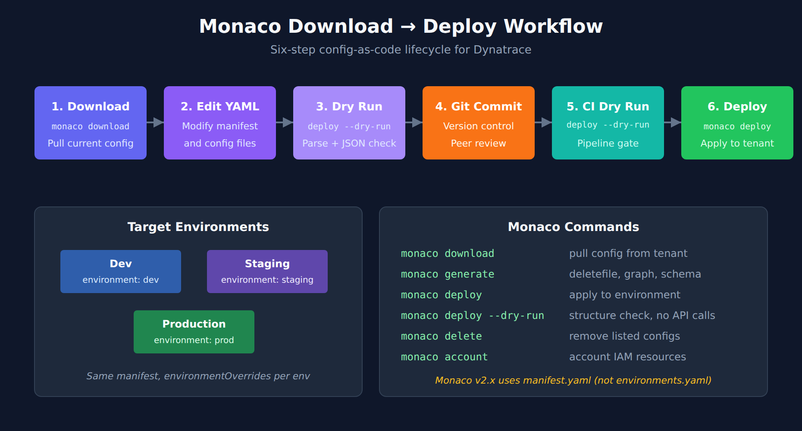

# AUTOM-03: Monaco Configuration-as-Code

> **Series:** AUTOM — Dynatrace Automation | **Notebook:** 3 of 9 | **Created:** January 2026 | **Last Updated:** 10/02/2026

Monaco (Monitoring as Code) is Dynatrace's official CLI tool for configuration management. It uses YAML files to define configurations and supports version control, CI/CD integration, and multi-environment deployments.

---

## Table of Contents

1. [Introduction](#introduction)
2. [Getting Started](#getting-started)
3. [Project Structure](#project-structure)
4. [Configuration Files](#configuration-files)
5. [Common Operations](#common-operations)
6. [Advanced Features](#advanced-features)
7. [Next Steps](#next-steps)

---

## Prerequisites

Before starting this notebook, ensure you have:

| Requirement | Description |
|-------------|-------------|
| Monaco CLI | Installed from the GitHub releases binary (Dynatrace publishes no Homebrew formula) |
| Platform token or OAuth client | For platform configuration — SLOs (`slo:slos:read` / `slo:slos:write`), workflows, documents, segments, buckets |
| API Token | Token with `settings.read`, `settings.write` (Settings 2.0), plus `ReadConfig`, `WriteConfig` only if you still manage classic Configuration API objects |
| Tenant URL | Your Dynatrace SaaS tenant URL |

---

## Learning Objectives

By the end of this notebook, you will:

- Understand Monaco's configuration-as-code model
- Know how to download existing configurations
- Be able to create and deploy configurations via YAML
- Handle multi-environment deployments

---

<a id="introduction"></a>
## 1. Introduction
### Why Monaco?

| Benefit | Description |
|---------|-------------|
| **Version Control** | Track all changes in Git |
| **Repeatability** | Deploy same config to multiple environments |
| **Review Process** | Use pull requests for config changes |
| **Disaster Recovery** | Quickly restore configurations |
| **Documentation** | YAML files serve as living documentation |

### Monaco vs Direct API

| Aspect | Monaco | Settings API |
|--------|--------|---------------|
| Format | YAML files | JSON payloads |
| State management | Implicit (by name) | Manual tracking |
| Multi-tenant | Built-in support | Custom scripting |
| Dry run | Yes (`--dry-run`) | No |
| Delete orphans | Yes (`delete` command) | Manual |

> **Already a Terraform shop?** See **AUTOM-01 §5: When a Terraform Shop Should Add Monaco** for the four patterns where Monaco still earns its place — most commonly bulk download from an existing tenant, multi-tenant identical-config deployment, and app-team self-service without state management.


---

<a id="getting-started"></a>
## 2. Getting Started
### Installation

Monaco ships as a single binary on GitHub releases; there is no Homebrew formula. Pick the asset for your OS and architecture (the install guide also lists `monaco-darwin-amd64`, `monaco-linux-arm64`, `monaco-linux-386` and a SHA-256 file for each):

**macOS (Apple silicon):**
```bash
curl -L https://github.com/Dynatrace/dynatrace-configuration-as-code/releases/latest/download/monaco-darwin-arm64 -o monaco
chmod +x monaco
```

**Linux (x86-64):**
```bash
curl -L https://github.com/Dynatrace/dynatrace-configuration-as-code/releases/latest/download/monaco-linux-amd64 -o monaco
chmod +x monaco
```

**Windows:** download the `.exe` asset from the same releases page.

**Verify installation:**
```bash
monaco version
```

### Environment Setup

Create environment variables for authentication:

```bash
export DT_TENANT_URL="https://{tenant-id}.live.dynatrace.com"
export DT_API_TOKEN="<your-api-token>"
export DT_PLATFORM_TOKEN="<your-platform-token>"   # SLOs, workflows, documents, segments, buckets
```

Monaco never takes a secret on the command line. Both the manifest and the `--token` download flag take the **name** of the environment variable that holds the token (`DT_API_TOKEN`), not its value.

---

### Your First Download

Download all configurations from your tenant:

```bash
monaco download \
  --url "$DT_TENANT_URL" \
  --token DT_API_TOKEN \
  --output-folder ./downloaded-config
```

`--token` names the environment variable (no `$`). An access token covers settings and classic configuration APIs; to also download platform configurations (workflows, documents, buckets, segments), add `--platform-token <VAR_NAME>` or the `--oauth-client-id` / `--oauth-client-secret` pair — access tokens and platform tokens are not interchangeable.

Download only the platform configuration types — SLOs, segments, workflows and documents. The `--only-*` flags can be combined (Monaco 2.23.1+):

```bash
monaco download \
  --url "$DT_TENANT_URL" \
  --token DT_API_TOKEN \
  --platform-token DT_PLATFORM_TOKEN \
  --output-folder ./downloaded-config \
  --only-slo-v2 --only-segments --only-automation --only-documents
```

The full set of `--only-*` flags is `--only-settings`, `--only-apis`, `--only-slo-v2`, `--only-segments`, `--only-automation`, `--only-documents`, `--only-buckets` and `--only-openpipeline` (read from the download command's source, `cmd/monaco/download/download_command.go`, at v2.30.0). `--only-openpipeline` is marked **Deprecated** in the [Monaco command reference (DT docs)](https://docs.dynatrace.com/docs/deliver/configuration-as-code/monaco/reference/commands-saas): OpenPipeline configuration is Settings 2.0 objects, so download it with `--only-settings` or `--settings-schema` with each `builtin:openpipeline.*` schema in use, plus `--admin-access` for pipelines other users own.

**Settings owned by other users (Monaco CLI 2.30.0+).** A download returns the settings objects the credential's user can see. For OpenPipeline, `--admin-access` also returns pipelines other users own — the release note: *"enabling this flag will also download configurations of different owners (other than the user that is assigned to the platform token or OAuth client). Requires `settings:objects:admin`."* The flag applies to owner-based OpenPipeline schemas only (`builtin:openpipeline.*`); on older CLI versions there is no equivalent. See [Using a Download as a Backup](#using-a-download-as-a-backup) for what else a download leaves out.

```bash
monaco download \
  --url "$DT_TENANT_URL" \
  --token DT_API_TOKEN \
  --platform-token DT_PLATFORM_TOKEN \
  --output-folder ./downloaded-config \
  --only-settings --admin-access
```

> <sub>**Sources:** [Monaco v2.30.0 release notes (Dynatrace GitHub)](https://github.com/Dynatrace/dynatrace-configuration-as-code/releases/tag/v2.30.0) — *"If settings-based OpenPipeline configurations (`builtin:openpipeline.*`) are downloaded, enabling this flag will also download configurations of different owners"*; [settings client (Dynatrace GitHub)](https://github.com/Dynatrace/dynatrace-configuration-as-code/blob/v2.30.0/pkg/client/dtclient/settings_client.go) — *"supportsAdminAccess returns true if the schema is an owner-based OpenPipeline schema."*</sub>

**Classic — inventorying what you still have before the upgrade.** Download specific Settings 2.0 schemas with `--settings-schema` (`--api` is for **classic** Configuration APIs only):

```bash
monaco download \
  --url "$DT_TENANT_URL" \
  --token DT_API_TOKEN \
  --output-folder ./downloaded-config \
  --settings-schema builtin:management-zones,builtin:tags.auto-tagging
```

> **Downloading classic schemas is the point here, not an oversight.** Both schemas above are marked **Blocked at upgrade** in AUTOM-02's Settings 2.0 catalog — they work today and stop answering once your tenant moves to the latest Dynatrace. That makes `monaco download` the fastest way to *inventory* what you still have before migrating it: every object, in version control, in one command. Keep the export as your migration worksheet; retarget the deployment. What it should not become is a template for new configuration.

---

<a id="project-structure"></a>
## 3. Project Structure
### Recommended Layout

```
dynatrace-config/
├── manifest.yaml              # Project manifest
├── environments/
│   ├── development.yaml       # Dev environment config
│   ├── staging.yaml           # Staging config
│   └── production.yaml        # Production config
└── projects/
    └── my-project/
        ├── slo-v2/                # service-level objectives (modern SLO app)
        │   └── config.yaml
        ├── segments/
        │   └── config.yaml
        ├── workflows/             # problem routing and other automations
        │   └── config.yaml
        └── anomaly-detectors/     # builtin:davis.anomaly-detectors (Settings 2.0)
            └── config.yaml
```

Classic estates add `management-zones/`, `auto-tagging/` and `alerting-profiles/` here until the upgrade — see the *Classic* blocks in §4.

### Manifest File

The `manifest.yaml` defines your project:

```yaml
manifestVersion: 1.0

projects:
  - name: my-project
    path: projects/my-project

environmentGroups:
  - name: default
    environments:
      - name: development
        url:
          type: environment
          value: DT_DEV_URL
        auth:
          token:
            name: DT_DEV_TOKEN
          platformToken:
            name: DT_DEV_PLATFORM_TOKEN
      - name: production
        url:
          type: environment
          value: DT_PROD_URL
        auth:
          token:
            name: DT_PROD_TOKEN
          platformToken:
            name: DT_PROD_PLATFORM_TOKEN
```

`url` accepts `type: environment` + `value: <VAR_NAME>`, but every `auth` entry takes only `name: <VAR_NAME>` — Monaco always loads secrets from environment variables. `platformToken` (Monaco 2.24.0+) — or an `oAuth` client in its place — is what lets the project manage SLOs, workflows, documents, buckets and segments; drop it only for a project that manages Settings 2.0 and classic configuration alone.

---

<a id="configuration-files"></a>
## 4. Configuration Files

### Basic Configuration Structure

Every config is an `id`, a `config:` block (name, template, parameters) and a `type:`. For a Settings 2.0 object the type names a schema; for a platform object it names the platform type:

```yaml
configs:
  - id: checkout-availability
    config:
      name: Checkout availability
      template: slo.json
    type: slo-v2
```

### SLO Example (`type: slo-v2`)

**slo-v2/config.yaml:**
```yaml
configs:
  - id: checkout-availability
    config:
      name: Checkout availability
      template: checkout-availability.json
    type: slo-v2
```

**slo-v2/checkout-availability.json:**
```json
{
  "name": "{{ .name }}",
  "description": "Request success ratio, rolling 30 days",
  "tags": ["app:checkout", "owner:payments"],
  "criteria": [
    {
      "target": 99.5,
      "warning": 99.9,
      "timeframeFrom": "now-30d",
      "timeframeTo": "now"
    }
  ],
  "customSli": {
    "indicator": "timeseries { total = sum(dt.service.request.count), failures = sum(dt.service.request.failure_count) }\n| fieldsAdd sli = ((total[] - failures[]) / total[]) * 100\n| fieldsRemove total, failures"
  }
}
```

The payload is the SLO Service API's own shape — `criteria` is a **list**, and the SLI is a DQL `indicator` producing a timeseries field named `sli` (SLO-02's availability query, minus `from:` / `interval:`, which the criteria supply). It matches Monaco's own `slo-v2` integration-test template field for field. `type: slo-v2` needs Monaco **v2.22.0+** and platform auth, and despite the name it is the **modern** SLO app — the classic SLO is a different Monaco type, and the Terraform resource `dynatrace_slo_v2` is classic too (SLO-05).

### Other Platform Types

| Type block | Manages | Since |
|---|---|---|
| `type: slo-v2` | SLOs on the modern SLO app | v2.22.0 |
| `type: segment` | Segments (the filtering successor to management zones) | v2.19.0 |
| `type: {automation: {resource: workflow}}` — also `business-calendar`, `scheduling-rule` | Workflows (the routing successor to alerting profiles + problem notifications) | v2.6.0 |
| `type: {document: {kind: dashboard}}` — also `notebook`, `launchpad`; optional `private` | Dashboards, notebooks, launchpads | v2.15.0 (launchpad v2.18.0) |
| `type: bucket` | Grail buckets | v2.9.0 |
| `type: {settings: {schema: builtin:davis.anomaly-detectors, scope: environment}}` | Davis anomaly detectors (the successor to custom metric events) — a Settings 2.0 schema that carries forward | — |

**Download a workflow or segment before you author one.** A workflow template is the full Automation API payload (trigger, tasks, positions) and a segment template is the segment editor's JSON filter tree — neither is sensible to hand-write. Build one in the app, `monaco download --only-automation` / `--only-segments`, and parameterize the result.

> <sub>**Sources:** [Monaco YAML configuration — type fields (DT docs)](https://docs.dynatrace.com/docs/deliver/configuration-as-code/monaco/configuration/yaml-configuration-saas-type-fields) — the type blocks and version gates in the table; [`slo-v2` test template (Dynatrace GitHub)](https://github.com/Dynatrace/dynatrace-configuration-as-code/blob/main/test/commands/testdata/integration-download-configs-platform/project/slo-v2/custom-sli.json) — payload shape, read 09/28/2026; [Monaco v2.22.0 release notes (Dynatrace GitHub)](https://github.com/Dynatrace/dynatrace-configuration-as-code/releases/tag/v2.22.0) — *"Support for service-level objectives leveraging Grail"*.</sub>

### Classic Configuration — existing estates on unupgraded tenants

> **Dynatrace Classic — maintain, don't author.** Management zones, auto-tagging and alerting profiles are the configurations most existing Monaco projects contain, so their shape is kept below. All three are marked **Blocked at upgrade** in AUTOM-02's Settings 2.0 catalog and are on Dynatrace's published [Settings 2.0 schemas that are removed in Latest Dynatrace (DT docs)](https://docs.dynatrace.com/docs/dynatrace-api/environment-api/settings/removed-schemas) — *"None of the schemas on this page are visible in Latest Dynatrace."*
>
> That matters more for Monaco than for the raw API. Monaco resolves a schema before writing objects, so once a schema is removed, `monaco deploy` fails for every config that references it — and it fails at deploy time, in your pipeline, not at edit time. Successors: management zone → `segment` (filtering) + IAM policies (access); alerting profile → `automation` workflow; auto-tagging → primary fields/tags set at ingest (FAQ-02).

#### Management Zone Example (classic)

**config.yaml:**
```yaml
configs:
  - id: production-mz
    config:
      name: Production
      template: production-mz.json
    type:
      settings:
        schema: builtin:management-zones
        scope: environment

  - id: staging-mz
    config:
      name: Staging
      template: staging-mz.json
    type:
      settings:
        schema: builtin:management-zones
        scope: environment
```

**production-mz.json:**
```json
{
  "name": "{{ .name }}",
  "rules": [
    {
      "type": "SERVICE",
      "enabled": true,
      "conditions": [
        {
          "key": {
            "type": "STATIC",
            "attribute": "SERVICE_TAGS"
          },
          "comparisonInfo": {
            "type": "TAG",
            "operator": "EQUALS",
            "value": {
              "context": "CONTEXTLESS",
              "key": "environment",
              "value": "production"
            },
            "negate": false
          }
        }
      ]
    }
  ]
}
```

---

#### Auto-Tagging Example (classic)

**config.yaml:**
```yaml
configs:
  - id: application-tag
    config:
      name: Application
      template: application-tag.json
    type:
      settings:
        schema: builtin:tags.auto-tagging
        scope: environment
```

**application-tag.json:**
```json
{
  "name": "{{ .name }}",
  "rules": [
    {
      "type": "SERVICE",
      "enabled": true,
      "valueFormat": "{Service:DetectedName}",
      "propagationTypes": ["SERVICE_TO_PROCESS_GROUP_LIKE"],
      "conditions": []
    }
  ]
}
```

### Using Variables

Monaco v2 reads environment variables through **`environment` parameters**, declared under `parameters:` with a `name` (the variable) and an optional `default`. The template then refers to the parameter by its key — there is no `{{ .Env.X }}` syntax in v2:

**config.yaml:**
```yaml
configs:
  - id: checkout-availability
    config:
      name: Checkout availability
      template: checkout-availability.json
      parameters:
        owner_team:
          type: environment
          name: OWNER_TEAM
        slo_target:
          type: environment
          name: SLO_TARGET
          default: "99.5"
    type: slo-v2
```

In `checkout-availability.json`, use `"tags": ["owner:{{ .owner_team }}"]` and `"target": {{ .slo_target }}` — unquoted, so the rendered JSON carries a number. Without a `default`, the deployment fails if the variable is unset.

---

<a id="common-operations"></a>
## 5. Common Operations
### Deploy Configurations

Deploy to all environments:
```bash
monaco deploy manifest.yaml
```

Deploy to specific environment:
```bash
monaco deploy manifest.yaml --environment production
```

Dry run (check file structure without applying):
```bash
monaco deploy manifest.yaml --dry-run
```

### Validate Configurations

Monaco does **not** ship a standalone `monaco validate` subcommand. Validation runs as part of `monaco deploy --dry-run`, which loads the manifest, parses every project, checks that templates are valid JSON, and resolves cross-references — **without contacting the tenant**. It cannot validate the JSON payload against the schema, and it does not check reachability or token scopes: a deploy can still fail with HTTP 400 after a clean dry-run.

```bash
monaco deploy manifest.yaml --dry-run
```

### Delete Configurations

Remove configurations not in your project (orphans). The manifest is passed via `--manifest`, not as a positional argument:

```bash
monaco delete --manifest manifest.yaml --file delete.yaml
```

**delete.yaml:**
```yaml
delete:
  - project: my-project
    type: slo-v2
    id: checkout-availability
  # Classic, until the upgrade — a Settings 2.0 entry takes the schema as its type
  - project: my-project
    type: builtin:management-zones
    id: old-management-zone-id
```

Every non-classic entry needs **`project` and `id` together** (the Monaco config coordinate) or an `objectId` on its own; Monaco's delete-file loader rejects an entry with `id` and no `project`. The `type` is the config type (`slo-v2`, `segment`, `workflow`, `document`, `bucket`) or, for Settings 2.0, the schema ID.

---

<a id="using-a-download-as-a-backup"></a>
### Using a Download as a Backup — What It Does Not Capture

`monaco download` is a good **configuration** backup: Settings 2.0 objects, workflows, business calendars and scheduling rules, bucket definitions, dashboards, notebooks, launchpads, segments and `slo-v2` SLOs all land in version control. It is not a **tenant** backup. Some things are filtered out by design, some are invisible to the credential you run it with, and some have no Monaco type at all. Keep the list below next to the export, so that a restore does not discover the gaps for you.

| What is missing | Why | What to do |
|---|---|---|
| **Credentials and secrets** — `aws-credentials`, `azure-credentials`, `kubernetes-credentials`, `credential-vault`, `extension` | Excluded by default: *"Typically, these types contain secrets that must not be exported"* | Inventory every credential; recreate by hand on restore. Turning the filter off does not help — the API does not return the secret |
| **Read-only settings** | *"Read-only configurations are also excluded."* | Usually platform defaults you would not restore. `MONACO_FEAT_DOWNLOAD_FILTER_SETTINGS_UNMODIFIABLE=false` downloads them |
| **Settings Monaco filters by default** — notably `builtin:host.monitoring.mode`, skipped entirely, plus a handful of built-in defaults (the `Default` alerting profile, `default` bucket rules) | The source skips host monitoring mode because it *"is not reliable during download"* | If per-host monitoring modes matter to a restore, run a separate download with `MONACO_FEAT_DOWNLOAD_FILTER_SETTINGS=false`. Dynatrace warns that an unfiltered download needs *"some manual post-processing"* before it deploys |
| **OpenPipeline owned by other users** | Without `--admin-access` (Monaco CLI 2.30.0+), only the credential user's pipelines are returned | Add `--admin-access` with `settings:objects:admin`. Back up OpenPipeline through `settings`: the `openpipeline` type *"is deprecated and has been moved to Settings"* |
| **Other settings owned by other users** | Objects created with `allUsers: none` are visible only to their owner, and `--admin-access` covers OpenPipeline schemas only | In community practice, run the download as a dedicated service identity and have owners share objects with it — then compare object counts per schema against the UI before trusting the export |
| **Documents** | *"Monaco does not download Ready-made documents."* Documents the credential cannot see are not returned, and a public document the Monaco user does not own may fail to redeploy | Ready-made documents ship with the platform. For the rest, transfer ownership of shared documents to the backup identity, or accept that private documents stay with their owners |
| **Account resources** | Users, service users, groups and policies are a separate command; *"existing commands like `monaco deploy` ignore any account configuration"* | Run `monaco account download` alongside the environment download. The current account example shows no boundary type — verify that boundaries come back before relying on them |
| **Things with no Monaco type** | The type-fields page (read 09/29/2026) lists no type for lookup tables, installed Hub or custom apps, access tokens, platform tokens or OAuth clients | Record them in the runbook; reinstall apps and re-mint tokens and clients on restore |
| **Anything that is not configuration** | Grail data (a `bucket` config is the bucket's definition, not its contents), Davis baselines and problem history | Not recoverable from any configuration export — see FAQ-25 on accumulated state |

A backup run that closes the gaps Monaco can close:

```bash
export MONACO_FEAT_DOWNLOAD_FILTER_SETTINGS_UNMODIFIABLE=false   # optional: include read-only settings

monaco download \
  --url "$DT_TENANT_URL" \
  --token DT_API_TOKEN \
  --platform-token DT_PLATFORM_TOKEN \
  --output-folder ./backup/environment \
  --admin-access                          # Monaco CLI 2.30.0+, needs settings:objects:admin

monaco account download \
  --uuid "$DT_ACCOUNT_UUID" \
  --oauth-client-id DT_OAUTH_CLIENT_ID \
  --oauth-client-secret DT_OAUTH_CLIENT_SECRET \
  --output-folder ./backup/account        # account resources need an OAuth client
```

Commit both folders together with the gap list above. Checking the export against the tenant — object counts per config-type folder — is what turns "we ran download" into "we have a backup".

> <sub>**Sources:**</sub>
> - <sub>[Monaco commands — Filtering of downloaded files (DT docs)](https://docs.dynatrace.com/docs/deliver/configuration-as-code/monaco/reference/commands-saas) — *"Typically, these types contain secrets that must not be exported"*; *"Read-only configurations are also excluded."*</sub>
> - <sub>[Monaco YAML configuration — type fields (DT docs)](https://docs.dynatrace.com/docs/deliver/configuration-as-code/monaco/configuration/yaml-configuration-saas-type-fields) — *"Monaco does not download Ready-made documents."*; *"This resource is deprecated and has been moved to Settings."*; *"existing commands like monaco deploy ignore any account configuration"*</sub>
> - <sub>[Default settings download filters (Dynatrace GitHub)](https://github.com/Dynatrace/dynatrace-configuration-as-code/blob/v2.30.0/pkg/resource/settings/filter.go) — *"builtin:host.monitoring.mode is not reliable during download"*</sub>
> - <sub>[Monaco v2.30.0 release notes (Dynatrace GitHub)](https://github.com/Dynatrace/dynatrace-configuration-as-code/releases/tag/v2.30.0) — *"Requires `settings:objects:admin`."*</sub>
> - <sub>**Derived:** the "no Monaco type" row is the absence of those items from the type-fields page's type list, read 09/29/2026.</sub>

---

### Download vs Deploy Workflow

<!-- MARKDOWN_TABLE_ALTERNATIVE
| Step | Command | Purpose |
|------|---------|----------|
| 1 | monaco download | Export current config |
| 2 | Edit YAML files | Make changes |
| 3 | monaco deploy --dry-run | Parse YAML + check template JSON locally (no API calls) |
| 4 | Git commit | Version control |
| 5 | monaco deploy --dry-run (CI) | Pipeline gate before deploy |
| 6 | monaco deploy | Apply changes |
Target environments: dev / staging / prod in one manifest, per-environment values via environmentOverrides.
Commands: download (pull config), generate (deletefile, graph, schema), deploy (apply), deploy --dry-run (structure check, no API calls), delete (remove managed configs), account (account IAM resources).
-->



---

<a id="advanced-features"></a>
## 6. Advanced Features
### Configuration Dependencies

Reference another configuration with a **reference parameter** — `[project, configType, configId, property]`, or the long form with `type: reference`. The `configType` is the config type (`segment`, `slo-v2`, `workflow`, …) or, for Settings 2.0, the schema ID; `property: id` resolves to the referenced object's real Dynatrace ID at deploy time, and Monaco orders the deployment so the referenced object exists first. Here an SLO is scoped by a segment deployed from the same project:

```yaml
configs:
  - id: checkout-availability
    config:
      name: Checkout availability
      template: checkout-availability.json
      parameters:
        checkout_segment_id:
          type: reference
          configType: segment
          configId: checkout-production
          property: id
    type: slo-v2
```

In the template, scope the SLI with `"filterSegments": [{"id": "{{ .checkout_segment_id }}"}]` inside `customSli`. Because the segment ID is resolved per environment, the same config deploys to every tenant without a hard-coded ID — the portability problem S2S-07 spends a section on.

**Classic equivalent:** an alerting profile referencing a management zone — `management_zone_id: ["my-project", "builtin:management-zones", "production-mz", "id"]` on a `builtin:alerting.profile` config, used in the template as `{{ .management_zone_id }}`. Same mechanism, blocked schemas.

### Conditional Configurations

`skip` is a boolean on `config:`. To deploy a config to only some environments, set a default and flip it per environment (or per environment group with `groupOverrides`):

```yaml
configs:
  - id: production-only-config
    config:
      name: Production Detector
      template: detector.json
      skip: true
    type:
      settings:
        schema: builtin:davis.anomaly-detectors
        scope: environment
    environmentOverrides:
      - environment: production
        override:
          skip: false
```

### Environment-Specific Overrides

`environmentOverrides` and `groupOverrides` sit at the config level, as siblings of `config:` — not inside it:

```yaml
configs:
  - id: checkout-availability
    config:
      name: Checkout availability
      template: checkout-availability.json
      parameters:
        slo_target: 99.0
    type: slo-v2
    environmentOverrides:
      - environment: production
        override:
          parameters:
            slo_target: 99.5
```

---

### Grouping Configurations

Monaco v2 has no per-config `group:` key. Two different things are grouped, and neither is a config group:

- **Projects** group configurations. Put related configs in one project directory and deploy just that project with `--project`.
- **Environment groups** (`environmentGroups` in the manifest) group *target environments*. `--group` deploys to every environment in the named group; it does not select configs.

```bash
# Deploy only the web-application project, to every environment in the "production" environment group
monaco deploy manifest.yaml --project web-application --group production
```

---

### Best Practices

| Practice | Description |
|----------|-------------|
| **Use meaningful IDs** | IDs should describe the config purpose |
| **Modular structure** | Separate configs by domain (alerting, monitoring, etc.) |
| **Environment variables** | Never hardcode tokens or URLs |
| **Version control** | Commit all changes with meaningful messages |
| **Dry run first** | Run `monaco deploy --dry-run` before applying — it catches YAML/JSON structure errors, not payload errors |
| **Document parameters** | Comment complex configurations |
| **Treat a download as a partial backup** | `monaco download` omits secrets, filtered and read-only settings, other users' objects and everything that is not configuration — keep the gap list from [Using a Download as a Backup](#using-a-download-as-a-backup) beside the export |
| **Check upgrade status before you invest** | Before building a long-lived project around a schema, confirm it is not marked **Blocked at upgrade** in AUTOM-02's catalog — a blocked schema takes the whole Monaco config type with it |

### Common Issues and Solutions

| Issue | Cause | Solution |
|-------|-------|----------|
| "Config already exists" | Duplicate ID | Use unique IDs or download first |
| "Schema not found" | Typo in schema ID — **or** the schema was removed when the tenant upgraded to the latest Dynatrace | Check the exact schema name in the API. If it was correct and worked previously, check the schema's upgrade status in AUTOM-02's catalog before assuming a typo |
| "Template not found" | Wrong path | Use relative path from config.yaml |
| "Validation failed" | Invalid JSON | Check JSON syntax in template |

---

<a id="next-steps"></a>
## 7. Next Steps

### Monaco in a CI/CD Pipeline (the most common next step)

Monaco itself is a CLI — to make it part of a GitOps flow, wire it into your CI/CD platform of choice. **AUTOM-07: CI/CD Integration** has the recipe per platform:

| Platform | AUTOM-07 section |
|---|---|
| GitHub Actions | §3 GitHub Actions |
| GitLab CI/CD | §4 GitLab CI/CD |
| Bitbucket Pipelines | §5.1 Bitbucket Pipelines — Monaco Deploy |
| Atlassian Bamboo | §6 Atlassian Bamboo — adapt the Plan Specs YAML to call `monaco deploy` |
| Azure DevOps | §7 Azure DevOps Pipelines — adapt the Pipeline YAML to call `monaco deploy` |

For the **full sequenced path** from zero to a working pipeline, see **AUTOM-01 §6 First-Time Setup Path — Path B (Monaco target)**.

### When to Consider Adding Terraform

| Scenario | Why Terraform wins |
|----------|--------------------|
| Cross-system orchestration (cloud + Dynatrace + Git in one apply) | Monaco is Dynatrace-only |
| State management + drift detection on critical resources | Monaco has no state file; drift detection happens via plan-reapply rather than state diffing |
| Part of larger IaC stack | Existing Terraform workflows extend naturally to Dynatrace |
| Lifecycle protections (`prevent_destroy`, `ignore_changes`) | Monaco has no per-resource lifecycle policy |

For the framing of when a Terraform shop should *also* adopt Monaco (the reverse direction), see **AUTOM-01 §5: When a Terraform Shop Should Add Monaco**.

### Continue the Series

| Next Notebook | Focus |
|---------------|-------|
| **AUTOM-04: Terraform Provider** | Infrastructure-as-code approach to Dynatrace configuration |
| **AUTOM-07: CI/CD Integration** | GitOps patterns for both Monaco and Terraform |
| **AUTOM-08: Migration Automation** | Tenant-to-tenant migration including `monaco download` |

### Additional Resources

- [Monaco commands reference (DT docs)](https://docs.dynatrace.com/docs/deliver/configuration-as-code/monaco/reference/commands-saas) — *"A dry-run doesn't connect to Dynatrace and can't validate the content of the JSON sent to Dynatrace."*
- [Monaco configuration YAML reference (DT docs)](https://docs.dynatrace.com/docs/deliver/configuration-as-code/monaco/configuration/yaml-configuration-saas) — parameters (`environment`, `reference`), `skip`, `environmentOverrides` / `groupOverrides`
- [Monaco manifest and resources (DT docs)](https://docs.dynatrace.com/docs/deliver/configuration-as-code/monaco/configuration/monaco-manage-resources) — *"the name value is the name of the environment variable that holds the secret, not the secret itself."*
- [Install Monaco (DT docs)](https://docs.dynatrace.com/docs/deliver/configuration-as-code/monaco/installation/download-monaco)
- [Monaco Documentation](https://github.com/dynatrace/dynatrace-configuration-as-code)
- [Monaco Examples](https://github.com/Dynatrace/dynatrace-configuration-as-code)
- [Configuration Schema Reference](https://docs.dynatrace.com/docs/dynatrace-api/environment-api/settings/schemas)

---

## Summary

In this notebook, you learned:

- How to install and configure Monaco
- Project structure and manifest configuration
- Creating and deploying configurations via YAML
- Advanced features: reference parameters, `skip`, environment/group overrides, and project-scoped deploys

> **Key Takeaway:** Monaco is ideal for teams wanting GitOps-style configuration management. It provides the right balance of simplicity and power for most Dynatrace automation needs. For the from-zero-to-pipeline sequence, see **AUTOM-01 §6** Path B.

---

*Continue to **AUTOM-04: Terraform Provider** to learn infrastructure-as-code patterns, or jump to **AUTOM-07: CI/CD Integration** to wire Monaco into a pipeline now.*

## Community Resources & Examples

The following GitHub repositories provide starter templates, real-world examples, and hands-on exercises for Monaco:

### Official Repositories

| Repository | Description |
|------------|-------------|
| [dynatrace-configuration-as-code](https://github.com/Dynatrace/dynatrace-configuration-as-code) | Official Monaco CLI (v2.29.1 at time of writing, 09/2026 — check releases for newer) -- Go binary, Apache-2.0 |
| [dynatrace-configuration-as-code-samples](https://github.com/Dynatrace/dynatrace-configuration-as-code-samples) | Official samples repo with 9 Monaco starter templates in `basic-templates-monaco` |
| [easytrade](https://github.com/Dynatrace/easytrade) | Demo microservices app with a working `monaco/` directory (manifest.yaml, detection rules, workflows) |
| [Dynatrace-Config-Manager](https://github.com/Dynatrace/Dynatrace-Config-Manager) | GUI tool for tenant-to-tenant config migration; complements Monaco for brownfield scenarios |

### Starter Templates (in `dynatrace-configuration-as-code-samples`)

| Template Directory | What It Configures |
|--------------------|--------------------|
| `basic-templates-monaco` | Alerting, app detection, synthetic, maintenance window, management zones, ownership, notifications, SLOs |
| `learn-monaco-auto-tag` | Auto-tagging with Monaco |
| `account-monaco-admin-access` | Admin access setup for Monaco |

### Pipeline Observability Samples

Monaco configurations for ingesting CI/CD pipeline events via OpenPipeline:

| Directory | CI/CD Platform |
|-----------|---------------|
| `github_pipeline_observability` | GitHub Actions |
| `gitlab_pipeline_observability` | GitLab CI |
| `azure_devops_observability` | Azure DevOps |
| `argocd_observability` | ArgoCD |

### Training & Exercises

| Repository | Description |
|------------|-------------|
| [monaco-self-paced-exercises](https://github.com/dynatrace-ace/monaco-self-paced-exercises) | 6 structured exercises: install, auto-tag, download, variables, delete/restore, linking configs |
| [monaco-demo](https://github.com/dt-demos/monaco-demo) | Working GitHub Actions workflow for Monaco deploy with "crawl-walk-run" adoption methodology |

> **Note:** Monaco v1 (`dynatrace-oss/dynatrace-monitoring-as-code`) is no longer supported. Current Monaco releases have no conversion command: *"The last Monaco version to support the convert command is Monaco version 2.19.0."* Either run Monaco 2.19.0's `convert` per the [migrating to v2 guide (DT docs)](https://docs.dynatrace.com/docs/deliver/configuration-as-code/monaco/guides/migrating-to-v2), or re-run `monaco download` against the source tenant.

---

---

<sub>*This notebook was AI-generated from community-submitted and publicly available sources. This notebook series is not officially supported by Dynatrace. Always verify information against official Dynatrace documentation.*</sub>
