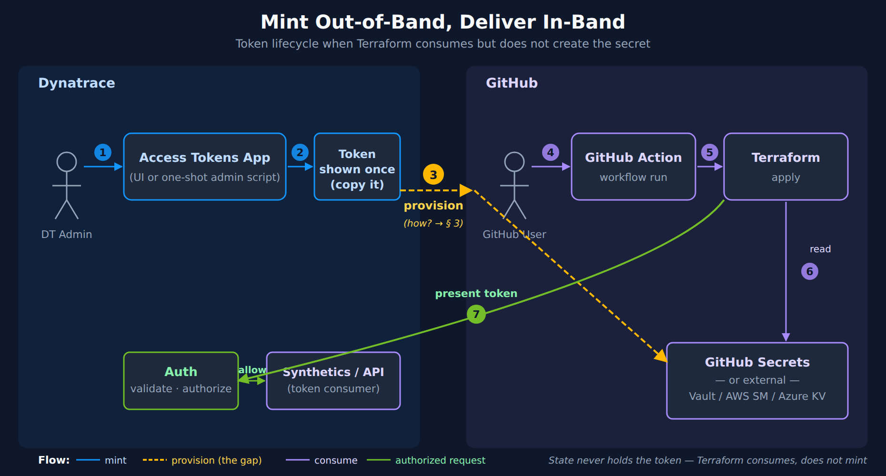
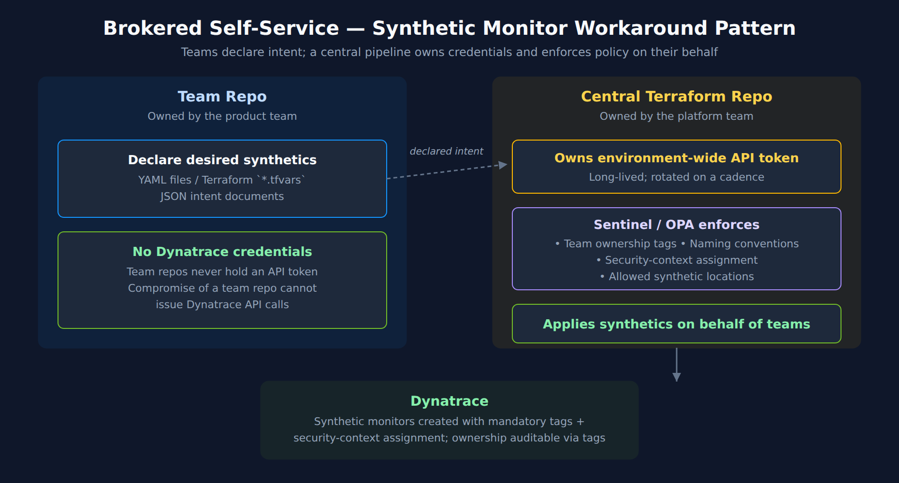

# AUTOM-04: Terraform Provider

> **Series:** AUTOM — Dynatrace Automation | **Notebook:** 4 of 9 | **Created:** January 2026 | **Last Updated:** 10/02/2026

The Dynatrace Terraform provider enables infrastructure-as-code management of Dynatrace configurations. It integrates with Terraform's ecosystem for state management, planning, and CI/CD integration.

---

## Table of Contents

1. [Introduction](#introduction)
2. [Getting Started](#getting-started)
3. [Provider Configuration](#provider-configuration)
4. [Resource Types](#resource-types)
5. [State Management](#state-management)
6. [Advanced Patterns](#advanced-patterns)
7. [Governance Architecture](#governance-architecture)
8. [Next Steps](#next-steps)

---

## Prerequisites

Before starting this notebook, ensure you have:

| Requirement | Description |
|-------------|-------------|
| Terraform CLI | Version 1.0+ installed |
| Authentication | One or more of: **API Token** (classic), **Platform Token**, or **OAuth Client** (see [Provider Configuration](#provider-configuration)) |
| Tenant URL | Your Dynatrace SaaS tenant URL |
| HCL Knowledge | Basic familiarity with Terraform syntax |

### Authentication Methods — Three Token Types

The Dynatrace Terraform provider supports three authentication methods. Each covers a different set of resources:

| Token Type | Format | Covers | Cannot Cover |
|------------|--------|--------|-------------|
| **API Token** (classic) | `dt0c01.xxxx` | Settings 2.0, Synthetics, SLOs | Gen3 Platform (workflows, documents, segments) |
| **Platform Token** | `dt0s16.xxxx` | Settings 2.0 + Gen3 Platform | Synthetics, SLOs (removed in v1.88.0) |
| **OAuth Client** | Client ID + Secret | Gen3 Platform, IAM, Settings 2.0 (`HTTP_OAUTH_PREFERENCE`) | Synthetics (v1.88.0+) |

> **Important (v1.88.0):** As of Dynatrace Terraform provider **v1.88.0**, OAuth-based authentication (including Platform Tokens acting as OAuth) **can no longer manage synthetic monitors or SLO definitions**. These resources require a classic **API Token** with the appropriate scopes. When both tokens are configured, the provider automatically uses the correct one for each resource.

> **Recommended setup:** Use **Platform Token + API Token** together for full resource coverage. The Platform Token handles Settings 2.0 and Gen3 resources; the API Token handles Synthetics and SLOs.

---

**Preference order (current Dynatrace guidance):**

1. **Platform Token** — recommended default for most integrations. Gen3 Platform resources (workflows, documents, segments) use it directly; set `DYNATRACE_HTTP_OAUTH_PREFERENCE=true` when an API token is configured alongside it, so Settings 2.0 resources use the Platform Token too (see §3). Any user can create one (no admin required); long-lived; inherits the creating user's privileges.
2. **Classic API Token** — legacy; being phased out. Use only for surfaces Platform Token does not yet cover (synthetic monitors primarily).
3. **OAuth Client** — specialized. Use for external-system integrations and account-level IAM automation (policies, groups, service users). Requires account admin to create.

## Learning Objectives

By the end of this notebook, you will:

- Understand the Dynatrace Terraform provider
- Know how to configure resources in HCL
- Be able to manage state and handle drift
- Implement multi-environment deployments

---

<a id="introduction"></a>
## 1. Introduction
### Why Terraform?

| Benefit | Description |
|---------|-------------|
| **State Management** | Track what exists vs. what's defined |
| **Drift Detection** | Identify manual changes |
| **Planning** | Preview changes before applying |
| **Ecosystem** | Integrate with other Terraform providers |
| **Modules** | Reusable configuration packages |

### Terraform vs Monaco

| Aspect | Terraform | Monaco |
|--------|-----------|--------|
| State file | Required | None |
| Drift detection | Built-in | Manual |
| Learning curve | Higher | Lower |
| Multi-cloud | Yes | Dynatrace only |
| Dependencies | Explicit | Implicit |

---

<a id="getting-started"></a>
## 2. Getting Started
### Installation

**Install Terraform:**

macOS:
```bash
brew tap hashicorp/tap
brew install hashicorp/tap/terraform
```

Linux:
```bash
wget -O- https://apt.releases.hashicorp.com/gpg | sudo gpg --dearmor -o /usr/share/keyrings/hashicorp-archive-keyring.gpg
echo "deb [signed-by=/usr/share/keyrings/hashicorp-archive-keyring.gpg] https://apt.releases.hashicorp.com $(lsb_release -cs) main" | sudo tee /etc/apt/sources.list.d/hashicorp.list
sudo apt update && sudo apt install terraform
```

**Verify installation:**
```bash
terraform version
```

---

<a id="provider-configuration"></a>
## 3. Provider Configuration

The Dynatrace Terraform provider supports three authentication methods. Which you need depends on the resources you manage.

### Method 1: API Token (Classic)

Use for **Settings 2.0** resources and resources that require classic API token auth (synthetic monitors, SLOs, legacy config APIs).

```hcl
terraform {
  required_providers {
    dynatrace = {
      source  = "dynatrace-oss/dynatrace"
      version = "~> 1.105"       # v1.105.0 at time of writing (released 09/23/2026)
    }
  }
}

provider "dynatrace" {
  dt_env_url   = var.dynatrace_url
  dt_api_token = var.dynatrace_token  # Classic API token (dt0c01.xxxx)
}
```

> **Provider version — v1.105.0, released 09/23/2026 (at time of writing, 09/2026).** Version-specific claims in this notebook were last re-checked against this release on 09/28/2026; earlier sections were written against v1.100.0 and v1.104.1. Breaking changes since v1.100: **v1.101.0** removed `dynatrace_activegate_updates`, `dynatrace_golden_state`, the legacy HTTP client and the `DYNATRACE_HTTP_LEGACY` / `DYNATRACE_HTTP_RESPONSE` environment variables; **v1.102.0** removed `enable_resource_attribute_rules`; **v1.104.0** removed the `DA` / `NONE` consumers from `dynatrace_aws_connection` / `dynatrace_azure_connection`; **v1.105.0** makes `match` required on a `dynatrace_browser_monitor` navigate-event `validate` of type `text_match` or `content_match`. Non-breaking but relevant here: **v1.102.0** added `trigger_on` and `problem_open_duration` to workflow Davis triggers (used in §4 and §6), deprecating `on_problem_close`. Unlike a SaaS sprint, a provider release reaches nobody automatically: the version in play is whatever your `required_providers` block resolves to, and `terraform init` pins it in `.terraform.lock.hcl` until you deliberately run `terraform init -upgrade`. Check your lock file before assuming a resource or attribute described here is available to you, and check the [registry](https://registry.terraform.io/providers/dynatrace-oss/dynatrace/latest) or the [provider releases (Dynatrace GitHub)](https://github.com/dynatrace-oss/terraform-provider-dynatrace/releases) for releases newer than v1.105.0.

> **Important:** Synthetic monitors and SLO definitions require a classic API Token (`dt0c01.*`). OAuth/Platform Token authentication does not support these resource types as of provider v1.88.0.

#### API Token Scopes — Full Access Reference

To manage **all** resources that require API Token authentication, create a token with the following scopes:

| Scope | Purpose |
|-------|---------|
| `settings.read` | Read Settings 2.0 objects |
| `settings.write` | Create/update Settings 2.0 objects |
| `ReadConfig` | Read legacy configuration API |
| `WriteConfig` | Write legacy configuration API |
| `CaptureRequestData` | Request attributes and data privacy |
| `ExternalSyntheticIntegration` | Synthetic monitors (v1 API) |
| `activeGateTokenManagement.create` | Create ActiveGate tokens |
| `activeGateTokenManagement.read` | Read ActiveGate tokens |
| `activeGateTokenManagement.write` | Update/revoke ActiveGate tokens |
| `apiTokens.read` | Read API tokens |
| `apiTokens.write` | Create/update API tokens |
| `attacks.read` | Read Application Security attacks |
| `attacks.write` | Write Application Security attacks |
| `credentialVault.read` | Read credential vault entries |
| `credentialVault.write` | Create/update credential vault entries |
| `entities.read` | Read monitored entities |
| `extensions.write` | Upload Extensions 2.0 |
| `extensionEnvironment.read` | Read extension environment config |
| `extensionEnvironment.write` | Write extension environment config |
| `networkZones.read` | Read network zones |
| `networkZones.write` | Create/update network zones |
| `securityProblems.read` | Read security problems |
| `securityProblems.write` | Update security problems |
| `slo.read` | Read SLO definitions |
| `slo.write` | Create/update SLO definitions |

> **Principle of least privilege:** For production, grant only the scopes your pipeline actually needs. The table above represents the **full-access superset** as documented in the [Terraform Registry](https://registry.terraform.io/providers/dynatrace-oss/dynatrace/latest/docs). A pipeline managing only Settings 2.0 resources needs only `settings.read` + `settings.write`.

### Method 2: Platform Token

**Platform Tokens** (`dt0s16.xxxx`) are a newer token type that bridges Settings 2.0 and Gen3 Platform in a single credential. They work within the assigned user's permissions.

```hcl
provider "dynatrace" {
  # Platform Token handles Settings 2.0 + Gen3 Platform resources
  # Set via DYNATRACE_ENV_URL and DYNATRACE_PLATFORM_TOKEN env vars
}
```

**Key env var:** `DYNATRACE_HTTP_OAUTH_PREFERENCE=true` makes Settings 2.0 resources use the Platform Token or OAuth client instead of the API token when both are configured, which gives the objects an owner (see the owner-empty note below). Workflows, documents, segments and Grail buckets always use the platform credentials and do not need the flag.

> **How `DYNATRACE_HTTP_OAUTH_PREFERENCE` works:** When set to `true` and OAuth/Platform Token credentials are provided, the provider **prefers REST endpoints that support OAuth** over API Token endpoints. When not set (or `false`), the provider defaults to API Token authentication. Not all resources support OAuth — for example, `dynatrace_json_dashboard` can only be configured using API Tokens regardless of this setting. The flag only arbitrates on resources that accept both credential types: in the provider source, the hybrid client falls back to the API token when the flag is off, while the workflow, document, segment and bucket services build a platform client unconditionally ([`hybrid_client.go` (Dynatrace GitHub)](https://raw.githubusercontent.com/dynatrace-oss/terraform-provider-dynatrace/main/dynatrace/rest/hybrid_client.go), read 10/02/2026 at v1.105.0).

> **Owner-empty failure mode (combined auth):** When both API Token and OAuth/Platform Token are configured but `DYNATRACE_HTTP_OAUTH_PREFERENCE=true` is **not** set, the provider routes through API Token endpoints and Dynatrace records the resulting Settings 2.0 objects with an **empty owner field**. The provider docs flag this verbatim across 18+ resource pages ([`generic_setting` (Dynatrace GitHub)](https://github.com/dynatrace-oss/terraform-provider-dynatrace/blob/main/docs/resources/generic_setting.md), [`aws_connection`](https://github.com/dynatrace-oss/terraform-provider-dynatrace/blob/main/docs/resources/aws_connection.md), [`github_connection`](https://github.com/dynatrace-oss/terraform-provider-dynatrace/blob/main/docs/resources/github_connection.md), and others): *"If a resource is created using an API token or without setting `DYNATRACE_HTTP_OAUTH_PREFERENCE=true` (when both are used), the settings object's owner will remain empty."* Owner-empty settings are harder to audit, can't be filtered by owner in IAM policies, and lose creator attribution in the UI. For any combined-auth pipeline, set `DYNATRACE_HTTP_OAUTH_PREFERENCE=true` even if your immediate use case doesn't seem to need it.

> **Settings object ownership:** When a settings object is created using Platform Token or OAuth credentials, the owner is set to the credential owner. By default, the object is **private** — only the owner can read/modify it. Use the `dynatrace_settings_permissions` resource to manage access modifiers.

### Method 3: OAuth Client Credentials

**Required** for Account Management (IAM) resources and `dynatrace_platform_slo`; an alternative to a Platform Token for Automation (Workflows), Document, Segment and Grail-bucket resources (the bucket resource page documents only the OAuth client — see the note in §4). The provider exchanges your client ID and secret for short-lived OAuth access tokens automatically.

> **IAM is OAuth-only in the provider.** Unlike Workflows and Documents (which accept a Platform Token), the provider's IAM resources take only an OAuth client. Its [configuration reference (Dynatrace GitHub)](https://github.com/dynatrace-oss/terraform-provider-dynatrace/blob/main/docs/index.md) states *"Platform tokens can't be used for IAM (Account Management)"*, and the [`dynatrace_iam_group` resource (Dynatrace provider docs)](https://registry.terraform.io/providers/dynatrace-oss/dynatrace/latest/docs/resources/iam_group) explicitly requires *"the environment variables `DT_CLIENT_ID`, `DT_CLIENT_SECRET`, `DT_ACCOUNT_ID` with an OAuth client."* The minimum-viable OAuth client for IAM needs four scopes: `account-idm-read`, `account-idm-write`, `iam-policies-management`, `account-env-read`. For the full IAM lifecycle (groups + policies + boundaries + bindings + bulk export + DSL discovery), see **AUTOM-95 LAB: Terraform IAM Management**.

```hcl
provider "dynatrace" {
  dt_env_url   = var.dynatrace_url
  dt_api_token = var.dynatrace_token  # For settings/classic resources

  # OAuth credentials — required for automation, document, and IAM resources
  client_id     = var.oauth_client_id        # Falls back for both automation + IAM
  client_secret = var.oauth_client_secret
  account_id    = var.account_id             # Required for IAM resources
}
```

> **Tip:** If you only manage automation/document resources, you can omit `dt_api_token` and use OAuth alone.

### Method 4: Combined Auth — Full Coverage (Recommended)

For **full resource coverage**, use **Platform Token + API Token** together. The provider automatically uses the correct token for each resource type:

```hcl
# provider.tf — Combined auth for full coverage
provider "dynatrace" {
  # Auth is read from environment variables automatically.
  # The provider uses the correct token for each resource type.
}
```

```bash
# --- Platform Token (covers Settings 2.0 + Gen3 Platform) ---
export DYNATRACE_ENV_URL="https://abc12345.live.dynatrace.com"
export DYNATRACE_PLATFORM_TOKEN="dt0s16.xxxx.yyyy"
export DYNATRACE_HTTP_OAUTH_PREFERENCE=true

# --- API Token (covers Synthetics — v1.88.0 requirement) ---
export DYNATRACE_API_TOKEN="dt0c01.xxxx.yyyy"
```

| Resource | Token Used |
|----------|------------|
| Settings 2.0 (maintenance windows; classic auto-tags, management zones, alerting profiles) | Platform Token |
| Gen3 Platform (workflows, documents, segments, Davis anomaly detectors) | Platform Token (via OAuth) |
| SLO definitions — Classic (`dynatrace_slo_v2`, `builtin:monitoring.slo`) | **API Token** (`slo.read`/`slo.write` + `settings.read`/`settings.write`, per the provider's [`slo_v2` resource docs (Dynatrace GitHub)](https://github.com/dynatrace-oss/terraform-provider-dynatrace/blob/main/docs/resources/slo_v2.md)) |
| SLO definitions — Latest Dynatrace (`dynatrace_platform_slo`) | **OAuth client** (`slo:slos:read`/`slo:slos:write`, per the [`platform_slo` resource docs (Dynatrace GitHub)](https://github.com/dynatrace-oss/terraform-provider-dynatrace/blob/main/docs/resources/platform_slo.md)) — see SLO-05 |
| Synthetic monitors (`dynatrace_http_monitor`) | **API Token** (v1.88.0) |

### Environment Variables — Complete Reference

| Variable | Purpose |
|----------|---------|
| `DYNATRACE_ENV_URL` / `DT_ENV_URL` / `DT_ENVIRONMENT_URL` | Tenant URL |
| `DYNATRACE_API_TOKEN` / `DT_API_TOKEN` | Classic API token (`dt0c01`) |
| `DYNATRACE_PLATFORM_TOKEN` / `DT_PLATFORM_TOKEN` | Platform token (`dt0s16`) |
| `DYNATRACE_HTTP_OAUTH_PREFERENCE` | Set to `true` so resources that accept either credential (Settings 2.0) use the Platform Token / OAuth client instead of the API token |
| `DT_CLIENT_ID` / `DYNATRACE_CLIENT_ID` | OAuth client ID (for automation/document/IAM resources) |
| `DT_CLIENT_SECRET` / `DYNATRACE_CLIENT_SECRET` | OAuth client secret |
| `DT_ACCOUNT_ID` / `DYNATRACE_ACCOUNT_ID` | Account UUID (required for account-level IAM resources) |

### Which Authentication for Which Resources?

| Resource Category | API Token | Platform Token | OAuth Client |
|-------------------|-----------|----------------|-------------|
| Settings 2.0 (maintenance windows; classic management zones, auto-tags, alerting profiles) | Yes | Yes | Yes (`HTTP_OAUTH_PREFERENCE`) |
| SLO — Latest Dynatrace (`dynatrace_platform_slo`) | No | No | **Yes (required)** |
| Gen3: Davis anomaly detectors (`dynatrace_davis_anomaly_detectors`) | No | Yes | **Yes** |
| SLO — Classic (`dynatrace_slo_v2`) | **Yes (required)** | No | No |
| Synthetic monitors | **Yes (required)** | No (v1.88.0) | No (v1.88.0) |
| Gen3: Workflows, scheduling | No | Yes | **Yes** |
| Gen3: Documents (dashboards, notebooks) | No | Yes | **Yes** |
| Gen3: Segments | No | Yes | **Yes** |
| Grail buckets (`dynatrace_platform_bucket`) | No | Yes (code path — see §4 note) | **Yes** |
| OpenPipeline (`dynatrace_openpipeline_v2_*`) | Yes | Yes | Yes |
| Account Management (IAM, policies, groups) | No | No | **Yes** (`DT_ACCOUNT_ID` also needed) |
| Legacy dashboards (`dynatrace_json_dashboard`) | **Yes (only)** | No | No |

### Creating an OAuth Client

1. Go to **Account Management** > **Identity & Access Management** > **OAuth clients**
2. Create a new client with the required scopes (see table below)
3. Copy the generated **client ID** and **client secret** immediately — the secret is only shown once
4. Store credentials securely (vault, CI/CD secrets, etc.)
5. Ensure the **service user's groups** grant the same scopes as the OAuth client for all target environments

#### OAuth Client Scopes — Full Access Reference

To manage **all** resources that require OAuth authentication, create an OAuth client with the following scopes:

| Scope | Purpose |
|-------|---------|
| **Settings** | |
| `settings:objects:read` | Read settings objects |
| `settings:objects:write` | Create/update settings objects |
| `settings:objects:admin` | Admin — manage all settings objects |
| **Automation** | |
| `automation:workflows:read` | Read workflow definitions |
| `automation:workflows:write` | Create/update workflows |
| `automation:workflows:admin` | Admin — manage all workflows |
| `automation:calendars:read` | Read scheduling calendars |
| `automation:calendars:write` | Create/update scheduling calendars |
| `automation:rules:read` | Read scheduling rules |
| `automation:rules:write` | Create/update scheduling rules |
| **Documents** | |
| `document:documents:read` | Read documents (dashboards, notebooks) |
| `document:documents:write` | Create/update documents |
| `document:documents:delete` | Delete documents |
| `document:trash.documents:delete` | Permanently delete trashed documents |
| `document:direct-shares:read` | Read document shares |
| `document:direct-shares:write` | Create/update document shares |
| `document:direct-shares:delete` | Delete document shares |
| **OpenPipeline** | |
| `settings:objects:read` / `settings:objects:write` | OpenPipeline pipelines, ingest sources and routing (`dynatrace_openpipeline_v2_*`) are Settings 2.0 objects, so the **Settings** scopes above cover them. Routing needs more — see the note below the table. |
| **SLO** | |
| `slo:slos:read` | Read SLO definitions |
| `slo:slos:write` | Create/update SLO definitions |
| `slo:objective-templates:read` | Read SLO objective templates |
| **Storage** | |
| `storage:bizevents:read` | Read business events |
| `storage:bucket-definitions:read` | Read Grail bucket definitions |
| `storage:bucket-definitions:write` | Create/update Grail bucket definitions |
| `storage:bucket-definitions:delete` | Delete Grail bucket definitions (needed to destroy or replace a bucket) |
| `storage:filter-segments:read` | Read segments |
| `storage:filter-segments:write` | Create/update segments |
| `storage:filter-segments:share` | Share segments |
| `storage:filter-segments:delete` | Delete segments |
| `storage:filter-segments:admin` | Admin — manage all segments |
| **Account Management (IAM)** | |
| `account-idm-read` | Read IAM users, groups, service users |
| `account-idm-write` | Create/update IAM users, groups, service users |
| `iam-policies-management` | Create/update/delete IAM policies |
| `account-env-read` | Read account environment metadata |

> **OpenPipeline permissions are Settings 2.0 permissions.** Each `dynatrace_openpipeline_v2_*` resource (for example `dynatrace_openpipeline_v2_logs_pipelines`, `_ingestsources` and `_routing`) states that it requires the API token scopes `settings.read` and `settings.write`, or the OAuth scopes `settings:objects:read` and `settings:objects:write`. **Routing needs more than write:** *"Routing management is restricted to administrators (`settings:objects:admin`). Administrators can grant write access to a configuration scope routing via policies."* The identity behind the credential therefore either holds `settings:objects:admin` or is granted a policy such as `ALLOW settings:objects:write WHERE settings:schemaId = "builtin:openpipeline.logs.routing"`.
>
> **Older guides list `openpipeline:configurations:read` / `openpipeline:configurations:write`.** Those scopes belonged to the OpenPipeline Configurations API (`/platform/openpipeline/v1/configurations`) and the deprecated `dynatrace_openpipeline_<scope>` resources built on it. That API reached end of life on June 29, 2026. Don't request those scopes for `dynatrace_openpipeline_v2_*` resources. The read scope remains valid only for the OpenPipeline Preview, Matcher, Processor and Technology APIs.
>
> <sub>**Sources:** [Migrate OpenPipeline configurations to Settings API (DT docs)](https://docs.dynatrace.com/docs/platform/openpipeline/migration-settings), [OpenPipeline API (DT docs)](https://docs.dynatrace.com/docs/platform/openpipeline/reference/openpipeline-api) — *"The Configurations API is deprecated and reached its end of life on June 29, 2026."*, [`openpipeline_v2_logs_pipelines` (Dynatrace GitHub)](https://github.com/dynatrace-oss/terraform-provider-dynatrace/blob/main/docs/resources/openpipeline_v2_logs_pipelines.md), [`openpipeline_v2_logs_routing` (Dynatrace GitHub)](https://github.com/dynatrace-oss/terraform-provider-dynatrace/blob/main/docs/resources/openpipeline_v2_logs_routing.md).</sub>

> **Principle of least privilege:** The table above is the **full-access superset** from the [Terraform Registry](https://registry.terraform.io/providers/dynatrace-oss/dynatrace/latest/docs). For production, grant only the scopes your pipeline requires. A pipeline managing only workflows needs `automation:workflows:read` + `automation:workflows:write`.

> **Security:** Never commit OAuth client secrets or API tokens to version control. Use environment variables, HashiCorp Vault, AWS Secrets Manager, or your CI/CD platform's secret store.

> **Note on scope formats:** API token scopes use dot notation (`settings.read`, `settings.write`). OAuth scopes and IAM policy actions use colon notation (`settings:objects:read`, `settings:objects:write`). These are different identifiers for the same capability in different auth contexts.

<a id="service-user-credentials"></a>
### Service User Credentials for Terraform — Platform Token vs Classic API Token

A common enterprise pattern: run Terraform as a **Service User** so the automation is not tied to any individual human. Two questions follow:

1. Which token type does the Service User hold — Platform Token, classic API Token, or both?
2. What permissions need to align for it to work?

#### The three-things-align model (Platform Token on a Service User)

When a Platform Token is created **on behalf of** a Service User, three independent things must line up — granting just one is the common mistake:

| # | What | Who grants it | Why it's needed |
|---|------|---------------|-----------------|
| 1 | **Service User's IAM permissions** | Account admin (group/policy) | The bearer can only do what the assigned user is permitted to do. |
| 2 | **Creator's `iam:service-users:use`** (optionally `iam:service-user-email`) | Account admin | The human creating the token must be allowed to mint one *on behalf of* that service user. |
| 3 | **Token scope selection at creation time** | Token creator | Effective permission = token scopes ∩ assigned user's IAM permissions. Missing the right scope at creation produces silent permission denials. |

Verbatim from the [Platform Tokens docs (DT docs)](https://docs.dynatrace.com/docs/manage/identity-access-management/access-tokens-and-oauth-clients/platform-tokens): *"A platform token will only work within the limits of the assigned user's permissions. This means that a selected scope is only granting access if that user has the respective permissions."*

#### No `dynatrace_platform_token` Terraform resource exists

The Dynatrace Terraform provider has **no resource for minting Platform Tokens** (verified against provider source 2026-05-22; **re-verified at v1.100.0 on 2026-07-08** — the `dynatrace/api/iam/` directory contains `bindings`, `boundaries`, `groups`, `permissions`, `policies`, `serviceusers`, `users`, and `v2bindings`, still with no token subdirectory). The provider's v1.88.1 release notes describe Platform Token **consumption** by other resources (`dynatrace_davis_anomaly_detectors`, `dynatrace_generic_setting`, `dynatrace_site_reliability_guardian`, `dynatrace_slack_notification`), not Platform Token creation.

Platform Tokens are minted **out-of-band** via either:

- The DT UI (Account Management → Identity & access management → Service users → *Generate token*), or
- `POST https://api.dynatrace.com/iam/v1/accounts/{accountUuid}/platform-tokens` ([endpoint docs](https://docs.dynatrace.com/docs/dynatrace-api/account-management-api/platform-tokens-api/post-platform-token)), called by an OAuth client whose scope catalog includes Platform Token minting.

The minted token is then delivered to CI/Terraform via a secret manager or env var. The token value never enters Terraform state (in contrast to `dynatrace_api_token`, which by design persists the minted classic API Token as a plain-text attribute in state — see *Operational Safety* subsection below). For the composed *OAuth client → mints ephemeral Platform Token on behalf of a Service User → Terraform applies* CI/CD pattern, see **AUTOM-07 §11**.

By contrast, the `dynatrace_api_token` resource **does** exist and is the provider's resource for minting Access Tokens — see the *Special case* subsection below. (The provider also mints ActiveGate tokens through [`dynatrace_ag_token` (Dynatrace GitHub)](https://github.com/dynatrace-oss/terraform-provider-dynatrace/blob/main/docs/resources/ag_token.md), which carries the same plain-text-in-state warning; no resource mints Platform Tokens.)

> <sub>**Sources:** [`dynatrace_iam_group` (Dynatrace provider docs)](https://registry.terraform.io/providers/dynatrace-oss/dynatrace/latest/docs/resources/iam_group), [`iam_group.md` (Dynatrace GitHub)](https://github.com/dynatrace-oss/terraform-provider-dynatrace/blob/main/docs/resources/iam_group.md), [Provider release notes v1.88.1 (Dynatrace GitHub)](https://github.com/dynatrace-oss/terraform-provider-dynatrace/releases), [POST /iam/v1/accounts/{accountUuid}/platform-tokens (DT docs)](https://docs.dynatrace.com/docs/dynatrace-api/account-management-api/platform-tokens-api/post-platform-token). [`ag_token.md` (Dynatrace GitHub)](https://github.com/dynatrace-oss/terraform-provider-dynatrace/blob/main/docs/resources/ag_token.md). **Observed 09/28/2026:** no `dynatrace_platform_token` resource — the provider's `docs/resources/` and `dynatrace/api/iam/` directories on `main` list none, with v1.105.0 the latest release (first checked 05/22/2026).</sub>

#### Decision: Which token does the Service User need for your Terraform resources?

Map your resource mix to the token type the Service User should hold:

| Resource the Service User manages | Service User token to issue | Why |
|-----------------------------------|------------------------------|-----|
| Settings 2.0 (maintenance windows; OpenPipeline `dynatrace_openpipeline_v2_*`; classic management zones, auto-tags, alerting profiles) | Platform Token (`dt0s16`) | Platform Token service catalog includes `settings`. |
| Gen3 Platform (workflows, documents, segments, Davis anomaly detectors, Grail buckets) | Platform Token (`dt0s16`) | Platform Token service catalog includes `automation`, `document`, `storage`. The bucket resource page documents only an OAuth client — see the §4 note. |
| Synthetic monitors, `dynatrace_slo` / `dynatrace_slo_v2`, legacy config APIs | Classic API Token (`dt0c01`) | Provider v1.88.0 removed OAuth for these resources: *"For these resources, an API token must be provided"*. |
| SLOs on the modern SLO app (`dynatrace_platform_slo`) | OAuth Client (+ `DT_ACCOUNT_ID`) | The resource docs require `DT_CLIENT_ID` / `DT_CLIENT_SECRET`, and `slo` is not among the services the platform-tokens page lists. |
| **Access Tokens (the `dynatrace_api_token` resource itself)** | **Classic API Token (`dt0c01`) — see disclaimer below** | Documented requirement: `apiTokens.read` + `apiTokens.write` scopes, which are classic-API-Token scopes. |
| Account Management / IAM (policies, groups, service users) | OAuth Client + `DT_ACCOUNT_ID` | IAM resources are account-level; Platform Token cannot manage them. |

#### Sprint update (SaaS 1.340–1.342) — classic REST APIs now accept Platform Tokens

The decision table above routes Synthetics / SLO v1 / legacy *Terraform resources* to classic API Tokens because the provider requires them. For **direct REST API calls** (outside Terraform), the classic-token-only constraint has loosened: as of SaaS 1.340 the classic **ActiveGate** REST APIs, and from SaaS 1.342 the classic **OneAgent-management and network-zone** REST APIs, accept Platform Tokens as an authentication option alongside classic API tokens.

| Classic REST API | Before | Since | Accepted |
|------------------|--------|-------|----------|
| Network-zone REST API | Classic API Token only | SaaS 1.342 | Classic API Token **or** Platform Token |
| ActiveGate REST API | Classic API Token only | SaaS 1.340 | Classic API Token **or** Platform Token |
| OneAgent REST API | Classic API Token only | SaaS 1.342 | Classic API Token **or** Platform Token |

This narrows the set of surfaces that *force* a classic token. Two caveats: (1) it applies to **direct REST API consumption**, not the Terraform provider — the provider's resource-level token requirements are unchanged until a provider release says otherwise; (2) the release note adds the capability but does not publish the exact Platform Token **scope** required for each API — verify the scope against the API Explorer / Swagger before relying on it. The auth-scheme rule still holds: a Platform Token uses `Authorization: Bearer`, a classic token uses `Authorization: Api-Token` — sending the wrong scheme returns 401 even when the token is otherwise valid.

> <sub>**Sources:** [Dynatrace SaaS 1.340 release notes (DT docs)](https://docs.dynatrace.com/docs/whats-new/saas/sprint-340) — *"Added support for platform tokens for classic ActiveGate REST APIs."*; [Dynatrace SaaS 1.342 release notes (DT docs)](https://docs.dynatrace.com/docs/whats-new/saas/sprint-342) — *"Platform tokens can now be used to authenticate classic REST APIs for OneAgent management and network zones, in addition to the existing access token support."* (both re-read 10/02/2026). **Softened:** the exact Platform Token scope per classic API is not stated in the release note — verify at the API Explorer before relying on it.</sub>

#### Sprint update (SaaS 1.342–1.343) — platform tokens reach effectively all classic APIs

*(SaaS 1.343 released July 7, 2026 with a staged tenant rollout from mid-July — the 1.343 items below are forthcoming for most tenants; verify availability in your tenant before switching automation. The classic-token guidance in the decision table above remains the working model until then.)*

The 1.340 loosening has since widened substantially:

- **SaaS 1.342** extends platform-token authentication to the classic **OneAgent management and network-zones** REST APIs (GA framing of the 1.340 addition), and the **Latest Dynatrace REST API for ActiveGate tokens** becomes generally available (enabled by default via the platform domain).
- **SaaS 1.343** announces **platform-token support across all classic and ingest endpoints**, plus the **fleet-management APIs** for OneAgent and ActiveGate endpoints, and new **ActiveGate deployment platform APIs with fine-grained OAuth scopes** (the legacy ActiveGate deployment API is deprecated).
- **Breaking (SaaS 1.343):** ActiveGate token management moves to `/platform/fleet-management/v1/activegate/tokens` with platform tokens — migrate automation that manages AG tokens via the classic endpoint.

The practical effect on the decision table above: for **direct REST calls**, the classic-token-only column keeps shrinking — a platform token on the Service User now covers most API surfaces. The two persistent exceptions remain **the Terraform provider's own resource-level token requirements** (unchanged until a provider release says otherwise) and **Access Token minting** (`apiTokens.*` — see the special case below). Per-endpoint platform-token *scopes* are still not enumerated in the release notes — verify at the API Explorer.

> <sub>**Sources:** [SaaS 1.342 release notes (DT docs)](https://docs.dynatrace.com/docs/whats-new/saas/sprint-342), [SaaS 1.343 release notes (DT docs)](https://docs.dynatrace.com/docs/whats-new/saas/sprint-343). **Softened:** "all classic and ingest endpoints" is the release-note phrasing — per-endpoint scope names are not published there; verify at the API Explorer before relying on a specific endpoint.</sub>

#### Special case — Terraform minting Access Tokens (`dynatrace_api_token`)

If your Terraform automation needs to **mint or rotate Access Tokens** (for example, generating per-team OneAgent install tokens or per-pipeline ingest tokens), you are managing the [`dynatrace_api_token` provider resource](https://github.com/dynatrace-oss/terraform-provider-dynatrace/blob/main/docs/resources/api_token.md), which requires the API Token scopes `apiTokens.read` and `apiTokens.write` (also confirmed at the underlying API: [POST /api/v2/apiTokens (DT docs)](https://docs.dynatrace.com/docs/dynatrace-api/environment-api/tokens-v2/api-tokens/post-token) requires `apiTokens.write`).

> **Updated 09/24/2026 — two changes to the picture above.** First, the Access Tokens API page now documents a platform-token path for the **direct REST call**: *"Platform Token / OAuth: Required scope: api-tokens:tokens:write"* ([POST /api/v2/apiTokens (DT docs)](https://docs.dynatrace.com/docs/dynatrace-api/environment-api/tokens-v2/api-tokens/post-token)). The **`dynatrace_api_token` Terraform resource has not followed** — it still documents classic scopes only: *"This resource requires the API token scopes **Read API tokens** (`apiTokens.read`) and **Write API tokens** (`apiTokens.write`)"*. So for Terraform-managed minting the Service User still holds a classic API Token (`dt0c01`) with `apiTokens.read` + `apiTokens.write`; for a one-shot REST mint, a platform token with `api-tokens:tokens:write` is now the documented alternative — verify in your own tenant before relying on it.

> **Deprecation — Dynatrace API 1.348 (pre-release; staged rollout planned from 09/22/2026).** The API 1.348 changelog marks the whole `/apiTokens` family deprecated — *"The following endpoints are deprecated"*: `GET`/`POST /apiTokens`, `POST /apiTokens/lookup`, and `GET`/`PUT`/`DELETE /apiTokens/{id}`. That changelog names no successor. Deprecated endpoints keep working during the deprecation period, so the patterns in this section remain the working path; design new token automation expecting to move off these endpoints, and re-check the changelog when 1.348 reaches GA. Separately, once an environment opts into **Phase 3** of the upgrade to Latest Dynatrace, *"classic API token creation is disabled; all new integrations must use platform tokens"* ([Best practices for upgrading App Observability API endpoints (DT docs)](https://docs.dynatrace.com/docs/platform/upgrade/best-practices/stage-11-api-tokens/upgrade-api-endpoints)) — check your environment's upgrade phase before building classic-token minting into Terraform.

#### What IAM permission the Service User needs (for managing Access Tokens)

On the IAM side, the [IAM policy statements reference (DT docs)](https://docs.dynatrace.com/docs/manage/identity-access-management/permission-management/manage-user-permissions-policies/advanced/iam-policystatements) documents a dedicated `api-tokens` service: `api-tokens:tokens:read` (*"Grants permission to read API tokens"*) and `api-tokens:tokens:write` (*"Grants permission to write API tokens"*). The [POST /api/v2/apiTokens (DT docs)](https://docs.dynatrace.com/docs/dynatrace-api/environment-api/tokens-v2/api-tokens/post-token) page names the same permission for personal access tokens — *"One of the following permissions is required for personal access tokens"*, listing `environment:roles:viewer` and `api-tokens:tokens:write`. Neither page states which IAM permission governs a Service User creating a non-personal Access Token, so validate the policy by attempting a mint in a non-production tenant before relying on it.

> **Corrected 09/28/2026.** Earlier revisions of this section, following community guidance, named `environment:roles:manage-settings` (*Change monitoring settings*) or **Monitoring Admin** group membership as the permission that gates Access Token management. No Dynatrace page states that, and the IAM reference now documents the dedicated `api-tokens` permissions above — do not build a policy on the `manage-settings` assumption.

> <sub>**Sources:**</sub>
> - <sub>[IAM policy statements reference (DT docs)](https://docs.dynatrace.com/docs/manage/identity-access-management/permission-management/manage-user-permissions-policies/advanced/iam-policystatements) — *"Grants permission to write API tokens"* (`api-tokens:tokens:write`), re-read 09/28/2026.</sub>
> - <sub>[POST /api/v2/apiTokens (DT docs)](https://docs.dynatrace.com/docs/dynatrace-api/environment-api/tokens-v2/api-tokens/post-token) — *"Platform Token / OAuth: Required scope: api-tokens:tokens:write"*.</sub>
> - <sub>[dynatrace_api_token resource (Dynatrace GitHub)](https://github.com/dynatrace-oss/terraform-provider-dynatrace/blob/main/docs/resources/api_token.md) — the classic-scope requirement for Terraform-managed minting, quoted above.</sub>
> - <sub>[Platform tokens (DT docs)](https://docs.dynatrace.com/docs/manage/identity-access-management/access-tokens-and-oauth-clients/platform-tokens)</sub>
> - <sub>[Dynatrace API 1.348 changelog (DT docs)](https://docs.dynatrace.com/docs/whats-new/dynatrace-api/sprint-348) — the `/apiTokens` deprecation quoted above.</sub>

<a id="service-user-state-leakage"></a>
### Operational Safety — State File Leakage When Minting Tokens

Even when the IAM and scope plumbing is correct, minting tokens via Terraform introduces a separate problem: the generated token value lands **in plaintext inside the Terraform state file**, regardless of `sensitive = true`.

#### What the provider docs say

Verbatim from the [`dynatrace_api_token` resource docs (Dynatrace GitHub)](https://github.com/dynatrace-oss/terraform-provider-dynatrace/blob/main/docs/resources/api_token.md): *"The usage of `dynatrace_api_token` will introduce sensitive data within your Terraform state. The `token` property is flagged as `sensitive`, but the field will be stored as plain-text."*

HashiCorp's own guidance on [sensitive data in state (Terraform docs)](https://developer.hashicorp.com/terraform/language/manage-sensitive-data) is explicit about why: *"Terraform stores values with the `sensitive` argument in both state and plan files, and anyone who can access those files can access your sensitive values."* The `sensitive` flag redacts values from CLI plan/apply output and from HCP Terraform's UI — it does **not** encrypt them at rest in state.

#### Implications — state security is mandatory, not optional

When a pipeline manages `dynatrace_api_token`, state hygiene becomes part of the token's security perimeter. State exfiltration equals token compromise.

| Practice | Status when minting tokens |
|----------|----------------------------|
| Commit `terraform.tfstate` to source control | **Forbidden** |
| Local state file on a shared workstation | **Forbidden** |
| Remote backend with at-rest encryption (S3+SSE-KMS, GCS+CMEK, Azure SSE, HCP Terraform native) | **Required** |
| IAM-restricted backend access (least-privilege state read/write) | **Required** |
| Audit logging on state access | **Recommended** |
| State backups with the same encryption and access controls | **Required** |

Backend hardening details for each option (S3+DynamoDB IAM scopes, GCS service-account bindings, Azure storage account network rules, HCP Terraform workspace ACLs) are covered in **AUTOM-09 §3 State Backend Setup**. End-to-end secrets handling — including `sensitive = true` semantics, plan-output discipline, and at-rest encryption per backend — is in **AUTOM-09 §8 Secrets Handling End-to-End**.

#### Recommended architectural pattern — mint out-of-band, deliver in-band

Because state security is always a concern when Terraform mints secrets, the recommended pattern is to **not mint the long-lived token from Terraform at all**:

1. **Generate the Access Token out-of-band** — Dynatrace Access Tokens UI, an admin-run one-shot script against `POST /api/v2/apiTokens`, or a Dynatrace-side workflow that mints the token on demand.
2. **Deposit the token into your downstream secret store** via that platform's own API — GitHub Actions repo/org secrets, GitLab CI/CD variables, Bitbucket workspace variables, Bamboo encrypted plan variables, Azure DevOps variable groups (optionally Key Vault-linked), AWS Secrets Manager, HashiCorp Vault, etc.
3. **Terraform consumes the token** via a data source (e.g. `vault_kv_secret_v2`, `aws_secretsmanager_secret_version`) or a pipeline-injected environment variable — Terraform never *creates* the token, so state never contains it.

This pattern decouples three concerns: who *creates* the long-lived secret (an admin, infrequently), where it *lives* (a hardened secret store), and how the pipeline *consumes* it (at apply time, ephemerally). State files contain only references — not values.

#### When you must mint tokens from Terraform

Legitimate use cases for `dynatrace_api_token` exist — for example, per-team or per-application tokens whose lifecycle should track the Terraform-managed resource that owns them, or short-lived tokens rotated on every apply. In those cases:

- Use a remote encrypted backend, not local state — non-negotiable.
- Mark every output that references the token with `sensitive = true` so it doesn't leak into CLI logs (the value is still in state, but at least it isn't in stdout).
- Treat state-backend permissions as token permissions — anyone with `s3:GetObject` on the state bucket effectively has the token.
- Rotate the bootstrap credential (the one Terraform itself uses) on a schedule and on any state-backend permission change.

**Worked example — three-workflow ephemeral mint.** A defensible architecture when minting is unavoidable: a separate `environments/<env>/security/` Terraform stack per environment, calling a reusable `modules/dynatrace_api_token` module with a **short `expiration_date` baked into the resource itself** (e.g. a 1-hour `var.dt_esa_api_token_duration` default applied via `timeadd(timestamp(), var.dt_esa_api_token_duration)`). Three composable reusable CI/CD workflows form the lifecycle: `generate_api_token` (runs `terraform apply` on the security stack and persists the token in state), `extract_api_token` (reusable workflow exposing the token as a job output), and `delete_api_token` (invoked with `if: always()` after the consuming job). The deploy and export workflows compose them via `uses:`. This shrinks the leakage window in three ways: (a) the token only lives in state for the pipeline run, (b) it's revoked even on pipeline failure, (c) the bootstrap credential that mints it (a long-lived classic API Token with `apiTokens.write`) is the *only* standing secret — and is itself rotatable without breaking any consumer pipelines. The pattern doesn't make state-leakage safe; it makes it survivable.

> <sub>**Sources:** [`dynatrace_api_token` resource (Dynatrace GitHub)](https://github.com/dynatrace-oss/terraform-provider-dynatrace/blob/main/docs/resources/api_token.md) — verbatim *plain-text in state* warning, [Sensitive data in state (Terraform docs)](https://developer.hashicorp.com/terraform/language/manage-sensitive-data) — verbatim *anyone who can access those files can access your sensitive values* + the recommendation to exclude state from Git. **Derived:** the *mint-out-of-band, deliver-in-band* pattern and the *three-workflow ephemeral-mint* worked example are syntheses from the two cited warnings — neither source recommends them by name, but both make them the only practices consistent with their stated risks when state hygiene is uncertain.</sub>

<a id="service-user-bridging-trust-boundary"></a>
### Bridging the Trust Boundary — How the Token Actually Crosses

The previous subsection recommended *minting out-of-band, delivering in-band* — generate the Access Token in the Dynatrace UI (or via an admin one-shot script), then deposit it into the pipeline's secret store. This subsection answers the operational question that pattern leaves open: **how does the token get from the Dynatrace side to the GitHub side?**



<!-- MARKDOWN_TABLE_ALTERNATIVE
| Step | Zone | Action |
|------|------|--------|
| 1 | Dynatrace | DT Admin opens the Access Tokens app (or runs an admin one-shot script) |
| 2 | Dynatrace | The token value is shown once — the admin copies it (nothing stores it automatically) |
| 3 | Boundary | **Provision** — the token crosses from DT to GitHub. THIS is the question. |
| 4 | GitHub | GitHub User triggers a workflow |
| 5 | GitHub | GitHub Action invokes Terraform |
| 6 | GitHub | Terraform reads the token (from GitHub Secrets, or an external secret manager at runtime) |
| 7 | Boundary | Terraform presents the token to Dynatrace Auth |
| 8 | Dynatrace | Auth validates and authorizes the request against Synthetics / API |
Step 3 is the gap this subsection bridges.
-->

#### Five mechanisms — choose by trust model and rotation cadence

| Mechanism | Where the token lives at rest | Rotation effort | When to use |
|-----------|-------------------------------|-----------------|-------------|
| **Admin pastes into GitHub Secrets UI** | GitHub Secrets | Manual every rotation | Small team, infrequent rotation, no existing secret manager |
| **`gh secret set` from admin workstation or CI** | GitHub Secrets | Scriptable, still manually triggered | Same as above plus you want repeatable scripting |
| **External secret manager + runtime fetch via GitHub Action** (Vault, AWS Secrets Manager, Azure Key Vault, GCP Secret Manager) | Secret manager only — **GitHub Secrets is bypassed** | Centralized in the secret manager; pipelines auto-pick up rotations | **Recommended default for any team with a secret manager already in place** |
| **OIDC federation → cloud secret manager** | Secret manager only; the GitHub side holds **no** long-lived credential | Centralized + short-lived federated access | Strongest posture; requires cloud-IdP trust setup |
| **Dynatrace-side workflow pushes to GitHub API** | Both GitHub Secrets and DT side (the workflow needs a GitHub PAT) | Triggerable from DT side | Niche — only when DT-side automation owns the rotation event |

Mechanisms 3 and 4 are the strong defaults: they **eliminate the long-lived secret from GitHub Secrets entirely** and concentrate rotation in one system (the secret manager) that's purpose-built for it. The token still crosses the boundary at step 3 of the diagram, but it does so *ephemerally at workflow runtime* — not at rest.

#### Recommended pattern — runtime fetch via Vault with GitHub OIDC

The cleanest version of mechanism 3 uses GitHub Actions' built-in OIDC identity to authenticate to Vault (no static Vault token in GitHub Secrets either), and pulls the Dynatrace token at workflow runtime:

```yaml
# .github/workflows/terraform-apply.yml
name: Terraform Apply

on:
  workflow_dispatch:
  push:
    branches: [main]

permissions:
  contents: read
  id-token: write   # required for GitHub OIDC → Vault JWT auth

jobs:
  apply:
    runs-on: ubuntu-latest
    steps:
      - uses: actions/checkout@v7

      - name: Fetch Dynatrace token from Vault
        id: secrets
        uses: hashicorp/vault-action@v4
        with:
          url: https://vault.example.com:8200
          method: jwt
          role: dynatrace-terraform-apply
          secrets: |
            secret/data/dynatrace/terraform dt_api_token | DT_API_TOKEN
            secret/data/dynatrace/terraform dt_env_url   | DT_ENV_URL

      - uses: hashicorp/setup-terraform@v4
        with:
          terraform_version: latest

      - name: Terraform Apply
        env:
          DYNATRACE_API_TOKEN: ${{ steps.secrets.outputs.DT_API_TOKEN }}
          DYNATRACE_ENV_URL:   ${{ steps.secrets.outputs.DT_ENV_URL }}
        run: |
          terraform init
          terraform apply -auto-approve
```

Key properties of this pattern:

- **The Dynatrace token never appears in GitHub Secrets** — it lives in Vault, and the workflow fetches it at runtime into the runner's process memory only.
- **No static Vault credential in GitHub either** — GitHub's OIDC identity (`id-token: write`) authenticates to Vault via the `jwt` auth method bound to the `dynatrace-terraform-apply` role; Vault returns a short-lived response. Rotating the Dynatrace token = update one secret path in Vault; no GitHub change.
- **Log masking is automatic.** Per the [`hashicorp/vault-action` README (HashiCorp GitHub)](https://github.com/hashicorp/vault-action): *"This action uses GitHub Action's built-in masking, so all variables will automatically be masked (aka hidden) if printed to the console or to logs."*
- **Vault role + policy bind which workflow can read which secret path** — the same Vault-side authorization model that gates every other secret in your org. Audit log is one place.

#### Same shape, other secret managers

The pattern transposes cleanly to other secret managers — pick whichever your org already operates:

| Secret manager | GitHub Action | Auth to secret manager |
|----------------|---------------|------------------------|
| HashiCorp Vault | `hashicorp/vault-action` | JWT via GitHub OIDC (above) |
| AWS Secrets Manager | `aws-actions/aws-secretsmanager-get-secrets` (pair with `aws-actions/configure-aws-credentials` for OIDC) | OIDC → IAM role |
| Azure Key Vault | `azure/login` for OIDC, then `azure/cli` running `az keyvault secret show` (the dedicated `Azure/get-keyvault-secrets` action is deprecated and archived) | OIDC → Azure AD service principal |
| GCP Secret Manager | `google-github-actions/get-secretmanager-secrets` (pair with `google-github-actions/auth` for OIDC) | OIDC → Workload Identity Federation |

All four follow the same shape as the Vault example: federated identity in step 1, fetch secrets in step 2, consume in `env:` in step 3. None of them require a long-lived credential in GitHub Secrets. The Azure path is a hand-written script step rather than a dedicated secrets action, so mask the value yourself (`echo "::add-mask::$VALUE"`) before writing it to `$GITHUB_ENV` or an output — the automatic masking quoted above for `vault-action` does not apply to it.

#### Cross-CI-platform note

The mechanisms table generalizes to other CI/CD platforms — GitLab CI variables, Bitbucket workspace variables, Bamboo encrypted plan variables, and Azure DevOps variable groups (optionally Key Vault‐linked) all play the role of "GitHub Secrets" in this discussion. Platform-specific worked examples for those platforms are in **AUTOM-07** (§3 GitHub Actions, §4 GitLab, §5 Bitbucket Pipelines, §6 Atlassian Bamboo, §7 Azure DevOps). The architectural pattern — mint out-of-band, fetch at runtime from an external secret manager via federated identity, never let the long-lived token sit at rest in the CI platform — applies identically.

> <sub>**Sources:** [`hashicorp/vault-action` (HashiCorp GitHub)](https://github.com/hashicorp/vault-action) — current major version v4 (May 2026), JWT/OIDC method, automatic log masking; [`Azure/get-keyvault-secrets` (Microsoft GitHub)](https://github.com/Azure/get-keyvault-secrets) — *"This Action is deprecated."*, archived (checked 10/02/2026); [Using secrets in GitHub Actions (GitHub docs)](https://docs.github.com/en/actions/how-tos/write-workflows/choose-what-workflows-do/use-secrets) — log redaction behavior, OIDC alternative to long-lived credentials. **Derived:** the five-mechanism comparison table is a synthesis — each row maps to a documented GitHub Actions integration pattern but no primary source ranks them against one another. The recommendation of mechanisms 3 and 4 follows from combining the prior subsection's state-security mandate with each mechanism's at-rest exposure surface.</sub>

### Initialize and Validate

```bash
# Initialize provider
terraform init

# Validate configuration
terraform validate

# Format code
terraform fmt
```

---

<a id="resource-types"></a>
## 4. Resource Types
This section is the repo's consolidated Terraform resource catalog, organized by domain — **platform-native (Gen3) resources first**, then the classic resources you may still be maintaining. Worked examples follow in the same order. Series covering a domain in depth (SLO, S2S, NRLC, SL2DT, MZ2POL, OPIPE, IAM) point back here by name rather than repeating the resource shape.

| Domain | Resource | Auth requirement | Upgrade status | Notes |
|--------|----------|-------------------|----------------|-------|
| Automation / Workflows | `dynatrace_automation_workflow` | Platform Token or OAuth client | Carries forward | Below — the successor to alerting profiles + problem notifications (WFLOW, ALERT-03) |
| Documents (dashboards, notebooks) | `dynatrace_document` | Platform Token or OAuth client | Carries forward | Below — the successor to `dynatrace_json_dashboard` |
| Segments | `dynatrace_segment` | Platform Token or OAuth client | Carries forward | Below — the data-filtering successor to management zones (MZ2POL-05); access moves to IAM policies |
| SLO | `dynatrace_platform_slo` (modern SLO app, provider v1.78.0+) | **OAuth client only** | Carries forward | Below — DQL SLI in `custom_sli.indicator`; full treatment in SLO-05 |
| Anomaly detection | `dynatrace_davis_anomaly_detectors` (Davis Anomaly Detection app) | Platform Token or OAuth client | Carries forward | Below — the successor to `dynatrace_metric_events`; DQL-based (AIOPS-02) |
| Maintenance | `dynatrace_maintenance_windows` (v1.98+) · `dynatrace_maintenance` (provider ≤ v1.97, deprecated) | Classic API token (`settings.read`/`settings.write`) | Carries forward / **Blocked** | Below. The provider-deprecation fix and the upgrade fix are the same move: `dynatrace_maintenance` → `builtin:alerting.maintenance-window` is blocked, `dynatrace_maintenance_windows` → `builtin:maintenance-windows` survives |
| OpenPipeline | `dynatrace_openpipeline_v2_<type>_pipelines` / `_routing` / `_ingestsources` (per-data-type family — e.g. `dynatrace_openpipeline_v2_logs_pipelines`; no single generic `dynatrace_openpipeline` resource exists) | API token (`settings.read`/`settings.write`), Platform Token or OAuth client (`settings:objects:*`; routing needs `settings:objects:admin`) — prefer platform credentials so the object gets an owner | Carries forward | Below — see also SL2DT-03, NRLC-09, OPIPE for the schema family (`builtin:openpipeline.<scope>.*`) |
| Grail buckets | `dynatrace_platform_bucket` | OAuth client (`storage:bucket-definitions:*`) per the resource page; Platform Token per the provider's code path — see the note below | Carries forward | Below — see also ORGNZ for bucket strategy |
| IAM (Gen3) | `dynatrace_iam_group`, `dynatrace_iam_policy`, `dynatrace_iam_policy_bindings_v2`, `dynatrace_iam_service_user` | **OAuth client only** — Platform Token cannot drive IAM resources | Carries forward | Below — full hands-on walkthrough in AUTOM-95 LAB |
| Synthetic | `dynatrace_http_monitor`, `dynatrace_browser_monitor` | Classic API token (`ExternalSyntheticIntegration`) | Carries forward | Below. Third-party synthetic monitors are a separate, blocked surface — see SYNTH |
| *Classic* — config | `dynatrace_management_zone_v2`, `dynatrace_autotag_v2` | Classic API token (`settings.read`/`settings.write`) | **Blocked** | *Classic Resources* below. Successors: `dynatrace_segment` (filtering) + IAM policies (access) — MZ2POL |
| *Classic* — alerting | `dynatrace_alerting` (alerting profile), `dynatrace_metric_events` (custom metric alert, `builtin:anomaly-detection.metric-events`) | Classic API token (`settings.read`/`settings.write`) | **Blocked** | *Classic Resources* below. Successors: `dynatrace_automation_workflow`, `dynatrace_davis_anomaly_detectors` |
| *Classic* — SLO | `dynatrace_slo_v2` (`builtin:monitoring.slo`) | Classic API token (`slo.read`/`slo.write`, `settings.read`/`settings.write`) | **Blocked** | *Classic Resources* below. Successor: `dynatrace_platform_slo` |

> **Reading the Upgrade status column.** `Blocked` means the resource's underlying Settings 2.0 schema stops answering once your tenant upgrades to the latest Dynatrace — the Terraform resource goes with it, because the provider writes through that schema. Statuses are read from the ready-made *Check your upgrade readiness* dashboard, observed **07/31/2026**, cross-checked **09/18/2026** against Dynatrace's published [Settings 2.0 schemas that are removed in Latest Dynatrace (DT docs)](https://docs.dynatrace.com/docs/dynatrace-api/environment-api/settings/removed-schemas), and each resource-to-schema mapping was confirmed against the provider's own resource documentation. The provider registry does not flag these resources, so a resource can read as entirely current there and still be `Blocked` here. See AUTOM-02 for the full schema catalog and the deprecated-versus-blocked distinction.

> **Auth requirement is a strong predictor here, but not a rule.** Every blocked row is a **Classic API token** row, and every Platform-Token-or-OAuth row carries forward — which makes sense, since the Gen3-native resources were built on the surfaces that survive. The exception worth remembering is **Synthetic**: it authenticates with a classic token and still carries forward. Do not infer status from the auth column alone.

> **The OAuth-client-only resources above are a distinct category, not a version nuance.** Unlike most Gen3 resources (which accept either a Platform Token or an OAuth client), IAM objects and `dynatrace_platform_slo` only work with `DT_CLIENT_ID`/`DT_CLIENT_SECRET`/`DT_ACCOUNT_ID` OAuth client credentials. The provider's configuration reference states *"Platform tokens can't be used for IAM (Account Management) or classic resources."*, and `slo` is not among the services the platform-tokens page lists as covered.
>
> **Grail buckets are not in that category.** The `platform_bucket` resource page asks for an OAuth client in the same words the `document` page uses, and the provider builds both on the same platform client — which uses a Platform Token in preference to the OAuth client when one is configured. `storage` is a platform-token service. A Platform Token for buckets is therefore supported by the provider's code path rather than stated on the resource page: confirm it in a non-production tenant before relying on it.
>
> <sub>**Sources:** [Provider configuration reference (Dynatrace GitHub)](https://github.com/dynatrace-oss/terraform-provider-dynatrace/blob/main/docs/index.md) — *"When specified, it is used in preference to `client_id`, `client_secret`"* (the `platform_token` attribute); [Platform tokens (DT docs)](https://docs.dynatrace.com/docs/manage/identity-access-management/access-tokens-and-oauth-clients/platform-tokens) — *"The following services are covered by platform tokens"* (lists `storage`, not `slo`); [`platform_bucket` (Dynatrace GitHub)](https://github.com/dynatrace-oss/terraform-provider-dynatrace/blob/main/docs/resources/platform_bucket.md); [`buckets/service.go` (Dynatrace GitHub)](https://raw.githubusercontent.com/dynatrace-oss/terraform-provider-dynatrace/main/dynatrace/api/platform/buckets/service.go) — `clientSet.PlatformClient()`, read 10/02/2026 at v1.105.0.</sub>

### Gen3 Platform Resources — start here

Most Gen3 resources (Workflow, Document, Segment, Davis anomaly detector, Grail bucket, Maintenance below) accept **either** a Platform Token **or** OAuth Client Credentials. **Two categories below are the exception and require OAuth Client Credentials only:** `dynatrace_platform_slo` (`slo` is not a platform-token service) and the IAM resources (the provider states *"Platform tokens can't be used for IAM (Account Management)"*). Grail buckets sit in between — see the note above the examples.

#### Automation Workflow

```hcl
resource "dynatrace_automation_workflow" "problem_email" {
  title       = "Problem Email Notification"
  description = "Sends an email when a Davis problem opens"
  private     = false

  trigger {
    event {
      active = true
      config {
        davis_problem {
          categories {
            error = true
          }
          entity_tags = {
            Environment = "production"
          }
          entity_tags_match = "all"
          trigger_on        = "open" # provider v1.102.0+; replaces the deprecated on_problem_close
        }
      }
    }
  }

  tasks {
    task {
      name        = "send_email"
      description = "Send email notification"
      action      = "dynatrace.email:send-email"
      active      = true
      input = jsonencode({
        to          = ["team@example.com"]
        cc          = []
        bcc         = []
        subject     = "Dynatrace Problem: {{event()['event.name']}}"
        content     = "Problem detected.\nName: {{event()['event.name']}}\nSeverity: {{event()['event.category']}}"
        taskId      = "{{ task().id }}"
        executionId = "{{ execution().id }}"
      })
      position {
        x = 0
        y = 1
      }
    }
  }
}
```

**The email task's action ID and input keys are not checked by Terraform.** `action` is a free string and `input` is opaque JSON, so a wrong action ID or input key applies cleanly and then fails, or sends nothing, at run time. The email action is `dynatrace.email:send-email`, and the message body goes in `content`; the field set above follows Dynatrace's published [Send Email workflow sample (Dynatrace GitHub)](https://github.com/Dynatrace/Dynatrace-workflow-samples/blob/main/samples/Messaging%20and%20Incident%20Management/wftpl_send_email.yaml). Build the task in the Workflows app and export it when in doubt.

#### Service-Level Objective — OAuth client only

```hcl
resource "dynatrace_platform_slo" "service_availability" {
  name        = "Service Availability - 30d"
  description = "Request success ratio, rolling 30 days"

  criteria {
    criteria_detail {
      target         = 99.5
      warning        = 99.9
      timeframe_from = "now-30d"
      timeframe_to   = "now"
    }
  }

  custom_sli {
    # DQL producing a timeseries field named `sli`; the criteria block supplies the timeframe
    indicator = <<-EOT
      timeseries {
        total    = sum(dt.service.request.count),
        failures = sum(dt.service.request.failure_count)
      }
      | fieldsAdd sli = ((total[] - failures[]) / total[]) * 100
      | fieldsRemove total, failures
    EOT
  }
}
```

The modern SLO app's resource — the replacement for `dynatrace_slo_v2`. **SaaS only; OAuth client only** (`DT_CLIENT_ID` / `DT_CLIENT_SECRET` / `DT_ACCOUNT_ID` with `slo:slos:read` / `slo:slos:write`). The SLI is the DQL query you validated in a notebook, minus `from:` / `interval:` (the SLI above is SLO-02's availability query). It is **excluded from a default export** — name it explicitly: `terraform-provider-dynatrace -export dynatrace_platform_slo`. Scoping (`filter_segments`), `sli_reference` and the classic-to-modern move are in **SLO-05**.

#### Davis Anomaly Detector

```hcl
resource "dynatrace_davis_anomaly_detectors" "disk_usage_high" {
  title       = "Disk usage critical"
  description = "Host disk usage above 90% for 3 of 5 minutes"
  enabled     = true
  source      = "Terraform"

  analyzer {
    name = "dt.statistics.ui.anomaly_detection.StaticThresholdAnomalyDetectionAnalyzer"
    input {
      analyzer_input_field {
        key   = "query"
        value = "timeseries disk_used = avg(dt.host.disk.used.percent), by:{dt.entity.host, dt.entity.disk}"
      }
      analyzer_input_field {
        key   = "threshold"
        value = "90"
      }
      analyzer_input_field {
        key   = "alertCondition"
        value = "ABOVE"
      }
      analyzer_input_field {
        key   = "slidingWindow"
        value = "5"
      }
      analyzer_input_field {
        key   = "violatingSamples"
        value = "3"
      }
      analyzer_input_field {
        key   = "dealertingSamples"
        value = "5"
      }
      analyzer_input_field {
        key   = "alertOnMissingData"
        value = "false"
      }
    }
  }

  event_template {
    properties {
      property {
        key   = "event.type"
        value = "CUSTOM_ALERT"
      }
      property {
        key   = "event.name"
        value = "Disk usage critical"
      }
      property {
        key   = "dt.source_entity"
        value = "{dims:dt.entity.host}"
      }
    }
  }

  # Required — the detector's query runs on behalf of this service user
  execution_settings {
    actor = dynatrace_iam_service_user.detectors.id
  }
}

# IAM resource — needs the OAuth client credentials described under IAM below
resource "dynatrace_iam_service_user" "detectors" {
  name = "davis-anomaly-detectors"
}
```

The Davis Anomaly Detection app's resource — the replacement for `dynatrace_metric_events`. The detection query is **DQL**, not a metric key, so the same resource covers logs, spans and business events as well as metrics. **SaaS only**; Platform Token or OAuth client. `execution_settings` is a required block; its `actor` is the service user the query runs as. Since provider v1.97.2 `actor` may be omitted and defaults to the user behind the provider's credentials — set it explicitly so a detector does not depend on a person's account, and give that service user read access to the data the query touches, or the detector evaluates to nothing. Analyzer input keys follow the provider's [`davis_anomaly_detectors` example (Dynatrace GitHub)](https://github.com/dynatrace-oss/terraform-provider-dynatrace/blob/main/docs/resources/davis_anomaly_detectors.md), read 09/28/2026 (v1.105.0); the query is the disk-usage timeseries AIOPS-06/07 use, one series per host and disk. Build and tune the detector in the app first, then export it (`terraform-provider-dynatrace -export dynatrace_davis_anomaly_detectors`) rather than hand-writing analyzer inputs. See AIOPS-02 for choosing the analyzer (static threshold vs auto-adaptive vs seasonal baseline).

> **Where to build the detector before export (SaaS 1.344).** *"Starting with Dynatrace version 1.344, custom alerts have moved to Settings. Because Anomaly Detection is deprecated, we highly recommend that you use Settings to access your existing configurations and create new ones."* SaaS 1.344 rolls out to tenants in stages — check your tenant's version before following either path. On earlier versions the **Anomaly Detection** app is where custom alerts are created, and "build and tune the detector in the app first" above refers to it.

> <sub>**Sources:** [Anomaly Detection (DT docs)](https://docs.dynatrace.com/docs/dynatrace-intelligence/anomaly-detection/anomaly-detection-app) — *"Starting with Dynatrace version 1.344, custom alerts have moved to Settings."*</sub>

#### Grail Dashboard (Document)

```hcl
resource "dynatrace_document" "team_dashboard" {
  type    = "dashboard"
  name    = "Production Overview"
  private = false
  content = jsonencode({
    version = 13
    variables = []
    tiles = {
      "tile-1" = {
        type  = "data"
        title = "Error Rate"
        # dt.service.request.failure_rate does not exist — derive the rate from the two counts
        query = "timeseries { failures = sum(dt.service.request.failure_count), total = sum(dt.service.request.count) }, by:{dt.entity.service}\n| fieldsAdd failure_rate = 100 * failures[] / total[]\n| fieldsRemove failures, total"
        visualization = "lineChart"
        visualizationSettings = {
          chartSettings = {}
        }
      }
    }
    layouts = {
      "tile-1" = { x = 0, y = 0, w = 12, h = 6 }
    }
  })
}
```

**A data tile needs `visualization` and `visualizationSettings`, not just `query`.** A tile carrying only `type`/`title`/`query` is incomplete — nothing states how the result should be drawn. The full `visualizationSettings` block is large and differs per visualization type, so the reliable way to get its exact shape is to build the tile in the UI and export the document; do not hand-write it from memory. The canonical document shape is in **NRLC-03 §2**.

> **Forthcoming/rolling out (SaaS 1.344) — a dashboard that fails validation will no longer load.** SaaS 1.344 was published 07/27/2026 with a **staged tenant rollout from 07/29/2026**; verify whether it has reached your tenant before relying on the new behavior. Before 1.344, a dashboard whose payload failed validation still loaded and surfaced validation warnings. Once 1.344 reaches your tenant, it does not load at all. Dynatrace names dashboards **created externally via API or by AI tooling** as the most affected population — which is exactly what a `dynatrace_document` dashboard payload is. Treat the warning state as a grace period, not a supported state.
>
> **Gate every payload before you merge it:**
>
> 1. Apply it against a **non-production tenant** and open the dashboard in the Dashboards app.
> 2. Confirm **zero validation warnings** — not "warnings we have decided to live with."
> 3. Prefer **exporting a working UI-authored dashboard** as your template over hand-writing the `tiles` / `layouts` map. The UI only emits shapes it can render.
>
> `terraform plan` and provider-side schema checks validate the *HCL*, not the dashboard document inside `jsonencode(...)` — to Terraform that payload is an opaque string. The export → modify → review → deploy workflow remains the working path; 1.344 raises the cost of skipping its validation step, it does not replace the workflow. Full gate: **DASH-07 §5**.

#### Grail Notebook (Document)

```hcl
resource "dynatrace_document" "runbook" {
  type    = "notebook"
  name    = "Incident Runbook"
  private = false
  content = jsonencode({
    version = "7"
    sections = [
      {
        id       = "section-1"
        type     = "markdown"
        markdown = "## Step 1: Check Error Rate\nRun the query below to identify affected services."
      },
      {
        id    = "section-2"
        type  = "dql"
        title = "Error Rate by Service"
        state = {
          input = {
            value = "timeseries { failures = sum(dt.service.request.failure_count), total = sum(dt.service.request.count) }, by:{dt.entity.service}\n| fieldsAdd failure_rate = 100 * failures[] / total[]\n| fieldsRemove failures, total"
          }
        }
      }
    ]
  })
}
```

**Notebook-document schema — two things are easy to get wrong here.** `version` is the string **`"7"`** for current notebook documents (older documents may still carry `"5"` or `"6"`; migrate on next touch). And **there is no `content` key on a section** — the two section types carry their payload under different keys: a `markdown` section carries **`markdown`**, and a `dql` section carries its query under **`state.input.value`**. A section shaped with `content` does not match the schema, so the resulting document has sections the Notebooks app cannot render.

#### Segment (Gen3 Management Zone Replacement)

A segment filter is **not** a DQL query string. `includes.items.filter` holds the segment editor's JSON filter tree (the shape below follows the provider's [`segment` example (Dynatrace GitHub)](https://github.com/dynatrace-oss/terraform-provider-dynatrace/blob/main/docs/resources/segment.md)), so the reliable workflow is to build the segment in the UI and export it with `terraform-provider-dynatrace -export dynatrace_segment`.

```hcl
resource "dynatrace_segment" "cluster_scope" {
  name        = "Kubernetes cluster"
  description = "All data from one Kubernetes cluster, selected by variable"
  is_public   = true

  includes {
    items {
      data_object = "_all_data_object"
      # Segment filter AST as emitted by the segment editor — k8s.cluster.name = $cluster
      filter = jsonencode({
        "children" : [
          {
            "key" : { "range" : { "from" : 0, "to" : 16 }, "textValue" : "k8s.cluster.name", "type" : "Key", "value" : "k8s.cluster.name" },
            "operator" : { "range" : { "from" : 17, "to" : 18 }, "textValue" : "=", "type" : "ComparisonOperator", "value" : "=" },
            "range" : { "from" : 0, "to" : 27 },
            "type" : "Statement",
            "value" : { "range" : { "from" : 19, "to" : 27 }, "textValue" : "$cluster", "type" : "String", "value" : "$cluster" }
          }
        ],
        "explicit" : false,
        "logicalOperator" : "AND",
        "range" : { "from" : 0, "to" : 27 },
        "type" : "Group"
      })
    }
  }

  variables {
    type  = "query"
    # Smartscape node query (the classic form was `fetch dt.entity.kubernetes_cluster`,
    # deprecated for new content). The node's `name` is the cluster name the
    # k8s.cluster.name filter above matches against.
    value = <<-EOT
      smartscapeNodes "K8S_CLUSTER"
      | fields cluster = name
      | sort cluster
    EOT
  }
}
```

The variable query lists the values the segment's `$cluster` picker offers. It uses the Smartscape shape K8S-04 and K8S-08 validate (`smartscapeNodes "K8S_CLUSTER"` with `name`), not the classic entity table — a segment is a Gen3 object, and its own query should not depend on the classic entity model.

#### Maintenance Window

Use `dynatrace_maintenance_windows` (schema `builtin:maintenance-windows`, carries forward). The older `dynatrace_maintenance` resource writes `builtin:alerting.maintenance-window`, which is on the removed-schemas list.

```hcl
// Which days an instance is created on comes from a Workflows scheduling rule. This is an
// automation resource: its credential needs automation:rules:read / automation:rules:write.
resource "dynatrace_automation_scheduling_rule" "sundays" {
  title = "Every Sunday"
  recurrence {
    datestart = "2026-01-01"
    frequency = "WEEKLY"
    weekdays  = ["SU"]
  }
}

resource "dynatrace_maintenance_windows" "weekly_patch" {
  name        = "Weekly Patch Window"
  description = "Weekly 02:00-04:00 UTC patching"
  enabled     = true
  auto_delete = false
  # Required DQL filter selecting what is under maintenance. Build it in the
  # maintenance-windows UI, then export (see note below) rather than hand-writing it.
  filter = var.maintenance_filter

  schedule {
    duration = 120
    timezone = "UTC"

    trigger {
      type = "time"

      recurring {
        time           = "02:00:00"
        earliest_start = "2026-01-01"
        until          = "2027-12-31"
        # The days an instance is created on come from the scheduling rule above
        rule           = dynatrace_automation_scheduling_rule.sundays.id
      }
    }
  }
}
```

> **Provider version note (v1.98.0, June 2026):** `dynatrace_maintenance` is **deprecated** in provider v1.98+ in favor of **`dynatrace_maintenance_windows`** (example above; shape from the provider's [`maintenance_windows` resource docs (Dynatrace GitHub)](https://github.com/dynatrace-oss/terraform-provider-dynatrace/blob/main/docs/resources/maintenance_windows.md), `terraform validate` clean on v1.105.0, 10/02/2026). `rule` is the *"Reference to rule which specifies on which days instance of this maintenance window should be created"*, so the example sets it; the page does not say which days a recurring window uses without one. If you are pinned below v1.98, `dynatrace_maintenance` is still the working resource there, but it takes `general_properties` and `schedule` blocks rather than top-level `name`/`type`/`suppression` — export an existing window (`terraform-provider-dynatrace -export dynatrace_maintenance`) for the exact shape, and plan the move to `dynatrace_maintenance_windows` before your tenant upgrades.

#### OpenPipeline (per-data-type resource family)

```hcl
resource "dynatrace_openpipeline_v2_logs_pipelines" "custom_logs" {
  # see the provider's openpipeline_v2_logs_pipelines resource docs for the full pipeline/processor schema
  # (structure mirrors the builtin:openpipeline.logs.pipelines Settings 2.0 schema)
}
```

**There is no single `dynatrace_openpipeline` resource.** OpenPipeline is Terraform-managed as a per-data-type family — `dynatrace_openpipeline_v2_logs_pipelines`, `_logs_routing`, `_logs_ingestsources`, and equivalents for `spans`/`metrics`/`events`/`bizevents` — each backed by its own `builtin:openpipeline.<scope>.*` Settings 2.0 schema. This corrected a NRLC-09 and SL2DT-03 error found 07/01/2026 (both had referenced a single generic resource, and SL2DT-03 additionally reflected the now-deprecated OpenPipeline Configurations API JSON shape, EOL June 29, 2026). See OPIPE and OPMIG for the full pipeline-configuration walkthrough.

#### Grail Bucket

```hcl
resource "dynatrace_platform_bucket" "custom_logs" {
  name         = "custom_logs_bucket"
  display_name = "Custom logs bucket"
  retention    = 67
  table        = "logs" # logs | spans | events | bizevents
}
```

**SaaS only.** The resource page documents an OAuth client with `storage:bucket-definitions:read`, `storage:bucket-definitions:write`, and `storage:bucket-definitions:delete` (re-read 10/02/2026). The provider also drives buckets with a Platform Token when one is configured (see the note under the resource table) — verify that in a non-production tenant before relying on it. See ORGNZ for bucket-strategy guidance and `terraform-provider-dynatrace -export dynatrace_platform_bucket` to bootstrap from existing buckets.

#### IAM (group, policy, binding) — OAuth client only

```hcl
resource "dynatrace_iam_group" "platform_engineers" {
  name = "Platform Engineers"
}

resource "dynatrace_iam_policy" "read_only" {
  name            = "Read-Only Access"
  account         = var.account_uuid
  statement_query = "ALLOW environment:roles:viewer;"
}

resource "dynatrace_iam_policy_bindings_v2" "binding" {
  group   = dynatrace_iam_group.platform_engineers.id
  account = var.account_uuid

  policy {
    id = dynatrace_iam_policy.read_only.id
  }
}
```

> **`dynatrace_iam_policy_bindings_v2` re-assigns all policies bound to a group** — every policy that should remain bound must be specified in the configuration; otherwise, it will be unbound (verbatim from the provider docs). This is the single most common Terraform-IAM footgun in this repo's own history.

IAM resources require an OAuth client with `account-idm-read`/`account-idm-write` and `iam-policies-management` scopes — never a Platform Token. Full hands-on walkthrough (DSL discovery, bulk export, import, gotchas table) is in **AUTOM-95 LAB**, not repeated here.

---

### HTTP Monitor (Synthetic)

```hcl
resource "dynatrace_http_monitor" "homepage" {
  name      = "Homepage Check"
  enabled   = true
  frequency = 5

  locations = ["GEOLOCATION-1234567890ABCDEF"]

  anomaly_detection {
    loading_time_thresholds {
      enabled = true
    }
    outage_handling {
      global_outage = true
      local_outage  = false
    }
  }

  script {
    request {
      description = "Homepage"
      method      = "GET"
      url         = "https://example.com"

      validation {
        rule {
          type  = "httpStatusesList"
          value = ">=400"
          pass_if_found = false
        }
      }
    }
  }
}
```

### Browser Monitor (Synthetic)

```hcl
data "dynatrace_synthetic_location" "location" {
  name = "Location"
}

resource "dynatrace_browser_monitor" "homepage_clickpath" {
  name      = "Homepage Clickpath"
  frequency = 15
  locations = [data.dynatrace_synthetic_location.location.id]
  enabled   = true

  anomaly_detection {
    loading_time_thresholds {
      enabled = true
    }
    outage_handling {
      global_outage = true
    }
  }

  key_performance_metrics {
    load_action_kpm = "VISUALLY_COMPLETE"
    xhr_action_kpm  = "VISUALLY_COMPLETE"
  }

  script {
    type = "clickpath"
    events {
      event {
        description = "Load homepage"
        navigate {
          url = "https://example.com"
          wait {
            wait_for = "page_complete"
          }
        }
      }
    }
  }
}
```

Requires the classic API token scope `ExternalSyntheticIntegration` (same as `dynatrace_http_monitor` — verified at the provider registry 07/01/2026). A clickpath script needs `type = "clickpath"`, each event a `description`, and the monitor a `key_performance_metrics` block — the shape above follows the provider's own [`browser_monitor` example (Dynatrace GitHub)](https://github.com/dynatrace-oss/terraform-provider-dynatrace/blob/main/docs/resources/browser_monitor.md) (`terraform validate` clean on v1.104.1, 09/18/2026). NRLC-09 points here for New-Relic-synthetic-check migrations; treat this and `dynatrace_http_monitor` as Config-v1 (classic) objects, not Settings 2.0 — there is no `builtin:synthetic_*` schema.

---

### Classic Resources — existing configuration on unupgraded tenants

> **Dynatrace Classic — maintain, don't author.** Every resource in this subsection writes a Settings 2.0 schema (or classic API) that the readiness scan marks **Blocked** at upgrade (table above). Keep these examples for estates you still have to manage until the upgrade; author new configuration with the Gen3 successor named in each heading. A Conftest ratchet that stops new classic resources entering the repo is in AUTOM-07 §3.

#### Management Zone → successor `dynatrace_segment` + IAM policies

```hcl
resource "dynatrace_management_zone_v2" "production" {
  name = "Production"

  rules {
    rule {
      type    = "ME"
      enabled = true
      attribute_rule {
        entity_type = "SERVICE"
        attribute_conditions {
          condition {
            key      = "SERVICE_TAGS"
            operator = "EQUALS"
            tag      = "environment:production"
          }
        }
      }
    }
  }
}
```

#### Auto-Tagging Rule → successor: primary fields/tags set at ingest (FAQ-02)

```hcl
resource "dynatrace_autotag_v2" "application" {
  name = "Application"

  rules {
    rule {
      type                = "ME"
      enabled             = true
      value_format        = "{Service:DetectedName}"
      value_normalization = "Leave text as-is"
      attribute_rule {
        entity_type = "SERVICE"
        conditions {
          condition {
            key      = "SERVICE_DETECTED_NAME"
            operator = "EXISTS"
          }
        }
      }
    }
  }
}
```

#### Alerting Profile → successor `dynatrace_automation_workflow`

> **Dynatrace Classic.** *"Alerting profiles and problem notifications are Dynatrace Classic."* They keep working on Classic tenants, but `builtin:alerting.profile` (the schema behind `dynatrace_alerting`) is on Dynatrace's list of [Settings 2.0 schemas that are removed in Latest Dynatrace (DT docs)](https://docs.dynatrace.com/docs/dynatrace-api/environment-api/settings/removed-schemas) — *"None of the schemas on this page are visible in Latest Dynatrace."* Delay has no field on the alerting profile's successor schema: per the [alert-notification upgrade guide (DT docs)](https://docs.dynatrace.com/docs/platform/upgrade/keep-problems-and-alerting-working/upgrade-guide-alert-notification), *"The delay, update, and severity capabilities described in this guide exist only on the workflow trigger."* The provider exposes that delay as `problem_open_duration` on the workflow's Davis trigger (v1.102.0+, see §6). The example shows the resource shape for estates you still maintain; build new routing with `dynatrace_automation_workflow` (below, and WFLOW / ALERT-03).

```hcl
resource "dynatrace_alerting" "production_alerts" {
  name            = "Production Alerting"
  management_zone = dynatrace_management_zone_v2.production.id

  rules {
    rule {
      include_mode     = "NONE"
      delay_in_minutes = 0
      severity_level   = "AVAILABILITY"
    }
    rule {
      include_mode     = "NONE"
      delay_in_minutes = 5
      severity_level   = "ERRORS"
    }
    rule {
      include_mode     = "NONE"
      delay_in_minutes = 10
      severity_level   = "PERFORMANCE"
    }
  }
}
```

#### SLO (classic) → successor `dynatrace_platform_slo`

```hcl
resource "dynatrace_slo_v2" "availability" {
  name              = "Production Availability"
  enabled           = true
  evaluation_type   = "AGGREGATE"
  evaluation_window = "-1w"
  target_success    = 99.9
  target_warning    = 99.95
  
  metric_expression = "builtin:synthetic.http.availability.location.total:splitBy()"
  
  filter            = "type(HTTP_CHECK)" # HTTP monitors are HTTP_CHECK entities (SYNTHETIC_TEST is browser monitors)

  # required block (fixed 07/01/2026 — missing this causes terraform apply to fail schema validation;
  # confirmed against the current provider schema, same fix applied to SLO-05 / S2S-07 the same day)
  error_budget_burn_rate {
    burn_rate_visualization_enabled = true
  }
}
```

#### Metric Event (custom metric alert) → successor `dynatrace_davis_anomaly_detectors`

```hcl
resource "dynatrace_metric_events" "disk_usage_high" {
  enabled                    = true
  event_entity_dimension_key = "dt.entity.host"
  summary                    = "Disk usage critical"

  event_template {
    description = "Disk usage exceeded threshold"
    event_type  = "CUSTOM_ALERT"
    title       = "Disk usage critical"
    davis_merge = false
  }

  model_properties {
    type               = "STATIC_THRESHOLD"
    alert_condition    = "ABOVE"
    alert_on_no_data   = false
    samples            = 5
    violating_samples  = 3
    dealerting_samples = 5
    threshold          = 90
  }

  query_definition {
    type        = "METRIC_KEY"
    aggregation = "AVG"
    metric_key  = "builtin:host.disk.usedPct"
  }
}
```

Settings 2.0 schema `builtin:anomaly-detection.metric-events`. Requires classic API token scopes `settings.read`/`settings.write` (verified at the provider registry 07/01/2026). This is the resource NRLC-04/09 point to for New-Relic-alert-condition migrations — do not confuse it with the singular, nonexistent `dynatrace_metric_event`.

---

<a id="state-management"></a>
## 5. State Management
### Understanding Terraform State

Terraform tracks resources in a state file (`terraform.tfstate`):

| Concept | Description |
|---------|-------------|
| **State** | JSON file mapping config to real resources |
| **Plan** | Comparison of state vs. desired config |
| **Apply** | Execute changes to reach desired state |
| **Drift** | Difference between state and actual |

### Remote State Storage

For team collaboration, use remote state:

```hcl
terraform {
  backend "s3" {
    bucket = "my-terraform-state"
    key    = "dynatrace/production/terraform.tfstate"
    region = "us-east-1"
  }
}
```

Or using Terraform Cloud:

```hcl
terraform {
  cloud {
    organization = "my-org"
    workspaces {
      name = "dynatrace-production"
    }
  }
}
```

---

### Common State Commands

```bash
# Preview changes
terraform plan

# Apply changes
terraform apply

# Show current state
terraform show

# List resources in state
terraform state list

# Import existing resource
terraform import dynatrace_segment.cluster_scope "<segment-id>"

# Remove resource from state (without deleting)
terraform state rm dynatrace_segment.cluster_scope
```

### Importing Existing Resources

To manage existing configurations:

1. Write the resource block in HCL
2. Find the object ID in Dynatrace
3. Import into state

```bash
# Gen3 resources import by their platform ID (workflow ID, document ID, segment ID, SLO ID)
terraform import dynatrace_automation_workflow.problem_email "<workflow-id>"
```

For **classic** Settings 2.0 objects you still maintain (a management zone, an alerting profile), the ID is the settings object ID — a long opaque string, not the display name:

```bash
terraform import dynatrace_management_zone_v2.production "vu9U3hXa3q0AAAABABhidWlsdGluOm1hbmFnZW1lbnQtem9uZXMABnRlbmFudAAGdGVuYW50ABp2dTlVM2hYYTNxMERUVF9fUHJvZHVjdGlvbr7vFJ4"
```

For more than a handful of objects, skip hand-written imports and use the export utility (§8) — it writes the HCL and the import together.

---

<a id="advanced-patterns"></a>
## 6. Advanced Patterns
### Modules for Reusability

Create reusable modules:

**modules/team-problem-routing/versions.tf** — every module that uses Dynatrace resources must declare the `dynatrace-oss/dynatrace` source itself. Without it, Terraform looks for an implied `hashicorp/dynatrace` provider, which does not exist, and `terraform init` fails:
```hcl
terraform {
  required_providers {
    dynatrace = {
      source = "dynatrace-oss/dynatrace"
    }
  }
}
```

**modules/team-problem-routing/main.tf** — one problem-notification workflow per owning team, routed on the `owner` tag (FAQ-21):
```hcl
variable "team" {
  type = string
}

variable "recipients" {
  type = list(string)
}

resource "dynatrace_automation_workflow" "problem_route" {
  title       = "Problem routing - ${var.team}"
  description = "Emails ${var.team} when a Davis problem affects an entity they own"
  private     = false

  trigger {
    event {
      active = true
      config {
        davis_problem {
          categories {
            availability = true
            error        = true
            slowdown     = true
          }
          entity_tags = {
            owner = var.team
          }
          entity_tags_match = "all"
          trigger_on        = "open"
        }
      }
    }
  }

  tasks {
    task {
      name   = "notify_team"
      action = "dynatrace.email:send-email"
      active = true
      input = jsonencode({
        to          = var.recipients
        cc          = []
        bcc         = []
        subject     = "[${var.team}] {{event()['event.name']}}"
        content     = "Problem affecting an entity owned by ${var.team}.\nName: {{event()['event.name']}}"
        taskId      = "{{ task().id }}"
        executionId = "{{ execution().id }}"
      })
      position {
        x = 0
        y = 1
      }
    }
  }
}

output "workflow_id" {
  value = dynatrace_automation_workflow.problem_route.id
}
```

**Use the module:**
```hcl
module "payments" {
  source     = "./modules/team-problem-routing"
  team       = "payments"
  recipients = ["payments-oncall@example.com"]
}

module "checkout" {
  source     = "./modules/team-problem-routing"
  team       = "checkout"
  recipients = ["checkout-oncall@example.com"]
}
```

> **Classic equivalent.** Estates built before the upgrade often have the same module shape wrapped around `dynatrace_management_zone_v2` (one zone per environment) plus `dynatrace_alerting` (one profile per zone). That pairing is exactly what this module replaces: ownership tags do the scoping the zone used to do, and the workflow trigger does the filtering the profile used to do. See the *Classic Resources* block in §4 for the resource shapes and MZ2POL-09 for the migration.

---

### Workspaces for Environments

Use workspaces to manage multiple environments:

```bash
# Create workspaces
terraform workspace new development
terraform workspace new staging
terraform workspace new production

# Switch workspace
terraform workspace select production

# List workspaces
terraform workspace list
```

**Use workspace in config** (run in a named workspace — in `default`, the map lookup below fails `terraform validate`):
```hcl
locals {
  environment = terraform.workspace

  config = {
    development = {
      min_problem_minutes = 30
      recipients          = ["dev-team@example.com"]
    }
    staging = {
      min_problem_minutes = 15
      recipients          = ["qa-team@example.com"]
    }
    production = {
      min_problem_minutes = 5
      recipients          = ["oncall@example.com"]
    }
  }
}

resource "dynatrace_automation_workflow" "problem_alerts" {
  title = "${local.environment} problem alerts"

  trigger {
    event {
      active = true
      config {
        davis_problem {
          categories {
            availability = true
            error        = true
            slowdown     = true
          }
          entity_tags = {
            environment = local.environment
          }
          entity_tags_match = "all"
          # Minimum problem duration before the trigger fires (provider v1.102.0+) — the successor
          # to the classic alerting profile's delay_in_minutes. Allowed: 5, 10, 15, 30, 60, 120, 240, 1440, 10080
          problem_open_duration = local.config[local.environment].min_problem_minutes
        }
      }
    }
  }

  tasks {
    task {
      name   = "notify"
      action = "dynatrace.email:send-email"
      active = true
      input = jsonencode({
        to          = local.config[local.environment].recipients
        cc          = []
        bcc         = []
        subject     = "[${local.environment}] {{event()['event.name']}}"
        content     = "{{event()['event.name']}}"
        taskId      = "{{ task().id }}"
        executionId = "{{ execution().id }}"
      })
      position {
        x = 0
        y = 1
      }
    }
  }
}
```

`problem_open_duration` is where the classic alerting profile's `delay_in_minutes` went — the upgrade guide places delay on the workflow trigger, and the provider exposes it there as a minimum problem duration with a fixed set of allowed values — added in **provider v1.102.0** (08/06/2026) together with `trigger_on`, which replaces the now-deprecated `on_problem_close` (per the [`automation_workflow` resource docs (Dynatrace GitHub)](https://github.com/dynatrace-oss/terraform-provider-dynatrace/blob/main/docs/resources/automation_workflow.md), read 09/28/2026).

---

### Modules with Governance Inputs

For multi-team environments, modules can enforce governance through input validation, mandatory tags, and scoping:

```hcl
# modules/team-problem-routing/variables.tf

variable "team_name" {
  type        = string
  description = "Name of the team owning this routing workflow"
  validation {
    condition     = can(regex("^[a-z][a-z0-9-]{2,20}$", var.team_name))
    error_message = "Team name must be lowercase alphanumeric with hyphens, 3-21 characters."
  }
}

variable "owner_tag" {
  type        = string
  description = "Value of the owner tag the workflow trigger routes on (required — an empty value would match every entity)"
  validation {
    condition     = length(var.owner_tag) > 0
    error_message = "owner_tag is required."
  }
}

variable "environment" {
  type        = string
  description = "Target environment"
  validation {
    condition     = contains(["dev", "staging", "prod"], var.environment)
    error_message = "Environment must be one of: dev, staging, prod."
  }
}

variable "min_problem_minutes" {
  type    = number
  default = 5
  validation {
    condition     = contains([5, 10, 15, 30, 60, 120, 240, 1440, 10080], var.min_problem_minutes)
    error_message = "Must be a problem_open_duration value the workflow trigger accepts."
  }
}
```

This pattern ensures teams cannot create unscoped or untagged resources — governance is built into the module itself. The unscoped case is the one to guard hardest: a problem trigger with no `entity_tags` matches **every** entity, so a missing owner tag turns one team's route into an all-hands page. (Classic-era modules validated a required `management_zone_name` for the same reason.)

### IAM Policy Management via Terraform

The Dynatrace Terraform provider can manage IAM policies, groups, and bindings. This enables **schema-level access restrictions** — something API tokens cannot do.

> **Important:** Managing IAM resources requires OAuth client credentials with `DT_ACCOUNT_ID`. API tokens cannot manage IAM.

> **Hands-on lab:** This subsection covers IAM at lecture depth. For a full hands-on walkthrough — OAuth client setup with the four minimal scopes, DSL discovery (no public catalog), the four IAM resource types (groups + policies + boundaries + bindings_v2), the `bindings_v2` re-assigns-all caveat, deprecated arguments to avoid, bulk export of an existing account, and HTTP 400 troubleshooting with `TF_LOG=DEBUG` — see **AUTOM-95 LAB: Terraform IAM Management**. Note the deprecated-arguments section (AUTOM-95 §13): `dynatrace_iam_policy.environment` is deprecated in favor of `account = var.account_uuid`, and the provider itself emits a deprecation warning for environment-level policies — the example below defines and binds the policy at account level.

```hcl
# Create a policy that restricts a team to specific settings schemas
resource "dynatrace_iam_policy" "team_settings" {
  name            = "Payments Team - Settings Access"
  account         = var.account_uuid
  statement_query = <<-EOT
    ALLOW settings:objects:read, settings:objects:write
      WHERE settings:schemaId IN (
        "builtin:davis.anomaly-detectors",
        "builtin:maintenance-windows"
      );
  EOT
}

# Create an IAM group for the team
resource "dynatrace_iam_group" "payments_team" {
  name        = "Payments Team"
  description = "IAM group for the Payments team"
}

# Bind the policy to the group (account level)
resource "dynatrace_iam_policy_bindings_v2" "payments_binding" {
  group   = dynatrace_iam_group.payments_team.id
  account = var.account_uuid

  policy {
    id = dynatrace_iam_policy.team_settings.id
  }
}
```

The schema IDs in a `settings:schemaId` condition must exist: a misspelled ID (for example `builtin:maintenance-window`, which is not a schema) makes the condition silently match nothing. Pick schemas that survive the upgrade — `builtin:alerting.profile` and `builtin:problem.notifications` are on the removed-schemas list.

IAM policy conditions support several operators. For `settings:schemaId` on `settings:objects:write` these are `IN`, `=`, `!=`, `startsWith` and `NOT startsWith` — there is no substring operator, so a policy using `contains` on a schema ID is rejected:

| Operator | Example | Use Case |
|----------|---------|----------|
| `IN` | `settings:schemaId IN ("builtin:davis.anomaly-detectors", ...)` | Explicit list |
| `startsWith` | `settings:schemaId startsWith "builtin:alerting"` | Schema family |
| `NOT startsWith` | `settings:schemaId NOT startsWith "builtin:alerting"` | Exclude a schema family |
| `!=` | `settings:schemaId != "builtin:maintenance-windows"` | Exclude one schema |
| `=` | `storage:bucket-name = "team_logs"` | Data isolation |

> <sub>**Sources:** [IAM policy statements reference (DT docs)](https://docs.dynatrace.com/docs/manage/identity-access-management/permission-management/manage-user-permissions-policies/advanced/iam-policystatements) — operator list for `settings:schemaId`, re-read 10/02/2026.</sub>

> **Key insight:** The API token scope `settings.write` grants access to ALL schemas. IAM policies with `WHERE settings:schemaId` clauses (using the IAM action `settings:objects:write`) are the only way to restrict schema access at the platform level.

---

<a id="governance-architecture"></a>
## 7. Governance Architecture

### Token Scoping & the Synthetic Access Problem

A common enterprise requirement is **scoped API access** — allowing Team A to manage only their Synthetic monitors via Terraform while preventing them from modifying Team B's monitors. **Through the Terraform provider this is still not possible:** the provider manages synthetics only through classic resources (`dynatrace_http_monitor`, `dynatrace_browser_monitor`) that require *"the API token scope **Create and read synthetic monitors, locations, and nodes** (`ExternalSyntheticIntegration`)"*, and classic permissions are tenant-wide.

> **Latest Dynatrace — Synthetic access can be scoped per monitor, outside Terraform.** On Latest Dynatrace, Synthetic monitors carry security contexts, and IAM policies can restrict the Synthetic platform permissions to them: *"A user with this policy has platform API access only to monitors with the team-a or platform-ops security context."* (for `ALLOW synthetic:monitors:read WHERE synthetic:dt.security_context IN ("team-a", "platform-ops");`). Dynatrace *"recommends migrating to the Synthetic platform permissions and the Synthetic Platform API to manage Synthetic in Latest Dynatrace"*, and *"Classic permissions remain functional, but they always apply tenant-wide."* For environments created before January 2026, **SaaS 1.343** (staged tenant rollout — verify it has reached yours) performs a one-time migration of each monitor's management zone to a security context of the same name. For automation that calls the Synthetic Platform API as a service user with a security-context-scoped `synthetic:monitors:write` policy, this replaces the workaround patterns below. For **Terraform-managed** synthetics, which still go through the classic resources, the patterns below remain the working path.
>
> <sub>**Sources:** [Synthetic access control (DT docs)](https://docs.dynatrace.com/docs/observe/digital-experience/synthetic/synthetic-access-control) — updated 08/05/2026, re-read 10/02/2026; [SaaS 1.343 release notes (DT docs)](https://docs.dynatrace.com/docs/whats-new/saas/sprint-343) — *"One-time migration from management zones to security contexts"*; [`http_monitor` (Dynatrace GitHub)](https://github.com/dynatrace-oss/terraform-provider-dynatrace/blob/main/docs/resources/http_monitor.md), [`browser_monitor` (Dynatrace GitHub)](https://github.com/dynatrace-oss/terraform-provider-dynatrace/blob/main/docs/resources/browser_monitor.md) — classic-token scope quoted above.</sub>

Here is why each token approach fails for scoped Synthetic access **through Terraform**:

| Token Approach | Why It Fails for Synthetic Scoping |
|----------------|-----------------------------------|
| **Platform Token** (cluster page) | The Terraform provider requires a classic token for its synthetic resources (v1.88.0+). On classic endpoints (SaaS 1.343+, staged rollout) a platform token gets only classic, tenant-wide synthetic access; per-monitor scoping applies on the Synthetic Platform API, which the provider does not use |
| **OAuth Client** | Provider v1.88.0 removed OAuth for `dynatrace_http_monitor` and `dynatrace_browser_monitor` — they take a classic API token (`dt0c01`) with `ExternalSyntheticIntegration` scope. A security-context-scoped service user works only through the Synthetic Platform API, outside the provider |
| **Personal Access Token** | Still a classic API token — scopes are broad and environment-wide |
| **Environment Token** | Cannot be restricted to specific objects or teams. This is how classic tokens work by design. |

> **Key insight:** There is no way today to say "Team A can manage only their Synthetic monitors" **through the Terraform provider**. On Latest Dynatrace you can say it through the Synthetic Platform API with security-context policies. For Gen3/platform resources (workflows, documents, segments, Settings 2.0), Service User + OAuth provides genuinely scoped access through IAM policies. Terraform-managed synthetics remain the gap.

### Dual-Auth: Bridging Gen3 and v1

When a pipeline manages both Gen3 resources (scoped via OAuth) and v1 resources (synthetics, requiring a classic API token), use **dual authentication**:

```hcl
provider "dynatrace" {
  dt_env_url       = var.dynatrace_env_url

  # Service User + OAuth — for Gen3/platform resources (scoped via IAM)
  client_id     = var.dt_client_id           # Also the fallback for iam_client_id / automation_client_id
  client_secret = var.dt_client_secret
  account_id    = var.dt_account_id

  # Classic API Token — still required for v1 resources (synthetics)
  dt_api_token     = var.dynatrace_api_token
}
```

The service user's group memberships and IAM policies provide **real, scoped access** for Gen3 resources. The classic API token covers synthetics with compensating controls (see workaround patterns below).

> **Migration timeline:** The Synthetic Platform API with security-context scoping already exists on Latest Dynatrace (above). The dual-auth requirement disappears for Terraform once the provider manages synthetics through it — as of v1.105.0 its HTTP and browser monitor resources still require the classic token. Track [provider releases (Dynatrace GitHub)](https://github.com/dynatrace-oss/terraform-provider-dynatrace/releases) and [Dynatrace release notes](https://docs.dynatrace.com/docs/whats-new) for updates.

---

### Synthetic Monitor Workaround Patterns

For **Terraform-managed** synthetics — classic resources, classic token, tenant-wide access — OAuth and Sentinel cannot provide scoped access, so these are the realistic enterprise patterns. (Automation outside Terraform can use the Synthetic Platform API with security-context policies instead — see above.)

#### Pattern 1: Brokered Self-Service (Recommended)

Teams submit **declarative requests** (YAML, Terraform variables, or JSON) describing their desired Synthetic monitors. A **central pipeline** owns the environment-wide API token, validates team intent, and applies synthetics on their behalf.



<!-- MARKDOWN_TABLE_ALTERNATIVE
| Team Repo (product team) | Central Terraform Repo (platform team) |
|---|---|
| Declares desired synthetics (YAML / Terraform vars / JSON intent) | Owns the environment-wide API token (long-lived, rotated) |
| No Dynatrace credentials in the repo | Sentinel/OPA enforces team ownership tags, naming conventions, security-context assignment (management zones on Classic tenants), allowed locations |
| Repo compromise cannot issue Dynatrace API calls | Applies synthetics on behalf of teams |
| | Result: synthetics in Dynatrace with mandatory tags + security-context assignment; ownership auditable via tags |
For environments where SVG doesn't render
-->

> **Key principle:** Teams never get direct API access. They get **intent-based self-service**, not credentials.

#### Pattern 2: Tag and Security-Context Fencing (Soft Isolation)

Every Synthetic monitor must include a mandatory tag (e.g., `team=payments`) and belong to its team's fence: a management zone on Classic tenants, a security context on Latest Dynatrace. Terraform modules hard-code the tag and naming prefix. Sentinel or OPA ensures the team repo can only reference its own fence. *(SaaS 1.343 — staged rollout — migrates each monitor's management zone to a security context of the same name, so an existing MZ fence carries over. Management zones themselves are blocked at upgrade.)*

> **Limitation:** This is **policy enforcement**, not permission enforcement. A compromised pipeline token still has full environment-wide access.

#### Pattern 3: Split Environments (True Isolation)

One Dynatrace environment per business unit, platform, or trust boundary. Synthetic API tokens become effectively scoped by environment since each environment has its own token. This is heavy-handed, but for **Terraform-managed** synthetics it is the only pattern here that isolates the credential itself. (On Latest Dynatrace, automation outside Terraform can get per-monitor isolation from security-context policies instead.) Recommended in regulated or multi-tenant scenarios.

#### Pattern 4: UI Self-Service + API Read-Only

Teams create Synthetic monitors via the Dynatrace UI, where RBAC applies and scoping works. The Terraform pipeline is limited to **reads, drift reporting, and configuration auditing** — not writes. This avoids distributing broad write tokens entirely.

#### What Does Not Work

These approaches **do not** overcome the limitation for Terraform-managed synthetics:

- Per-team OAuth clients for Terraform-managed synthetics (the provider's synthetic resources take only a classic API token)
- Sentinel-only enforcement without pipeline architecture (Sentinel constrains Terraform plans, not API permissions)
- Terraform modules alone without CI governance (modules can be bypassed without pipeline guardrails)
- Expecting a platform token on the *classic* synthetic endpoints to give per-team scoping (from SaaS 1.343 it can reach them, but classic permissions always apply tenant-wide; scoping comes from the Synthetic platform permissions on the Synthetic Platform API)

---

### Best Practices

| Practice | Description |
|----------|-------------|
| **Remote state** | Never use local state for teams |
| **State locking** | Enable to prevent concurrent changes |
| **Modular design** | Use modules for reusable patterns |
| **Version pinning** | Pin provider versions |
| **Plan before apply** | Always review plan output |
| **Meaningful names** | Resource names should be descriptive |
| **Synthetic access** | Use brokered self-service for Terraform-managed synthetics (classic token); on Latest Dynatrace, scope non-Terraform synthetic automation with security-context policies; never distribute environment-wide write tokens to teams |

### Common Issues

| Issue | Cause | Solution |
|-------|-------|----------|
| "Resource already exists" | State out of sync | Import the resource |
| "Provider error" | Invalid token | Check credentials |
| "Drift detected" | Manual changes | Re-apply or update state |
| Slow plan/apply | Many resources | Use targets or modules |

---

<a id="next-steps"></a>
## 8. Next Steps

### Terraform Export Utility — the canonical "bulk-import existing tenant config" path

The provider binary itself can export existing Dynatrace configuration directly to HCL `.tf` files. **This is different from `terraform import`** (the Terraform CLI feature, which is per-resource and requires you to author matching HCL skeleton first). The provider's `-export` produces ready-to-use HCL in one command:

```bash
# Linux
./terraform-provider-dynatrace -export [options] [resourcename[=id]]

# Windows
terraform-provider-dynatrace.exe -export [options] [resourcename[=id]]
```

**Recommended invocation** (canonical Dynatrace-documented form): `./terraform-provider-dynatrace -export -ref -id`. The `-ref` flag emits inter-resource data-source references instead of hardcoded UUIDs (much more maintainable HCL); `-id` adds commented resource IDs above each block for traceability. Skipping `-ref` leaves you with HCL that hard-codes IDs and is painful to maintain. Source: [Terraform CLI commands (DT docs)](https://docs.dynatrace.com/docs/deliver/configuration-as-code/terraform/terraform-cli-commands) — verbatim: *"Export all configurations with data sources/dependencies and include commented IDs: `./terraform-provider-dynatrace -export -ref -id`"*. Supply credentials via env vars per §3 — never via shell args (visible in process listings).

After `terraform init`, the executable is the file `.terraform/providers/registry.terraform.io/dynatrace-oss/dynatrace/<version>/<os_arch>/terraform-provider-dynatrace_v<version>` — for example `…/1.105.0/darwin_arm64/terraform-provider-dynatrace_v1.105.0`. Run it by that name, or copy it to `./terraform-provider-dynatrace` in your working directory so the commands here work as written. (The DT docs page describes a `terraform-provider-dynatrace_x.y.z/` directory; with v1.105.0 it is a single executable file, observed 10/02/2026.)

**Env vars:**

- `DYNATRACE_ENV_URL` (required) — tenant endpoint
- At least one credential (required): `DYNATRACE_API_TOKEN`, `DYNATRACE_PLATFORM_TOKEN`, or an OAuth client (`DT_CLIENT_ID` / `DT_CLIENT_SECRET`). Each resource type needs a credential it supports (§3): classic-only resources such as synthetic monitors need the API token, and platform resources such as workflows and documents need the platform token or OAuth client — supply both kinds to export everything.
- `DYNATRACE_TARGET_FOLDER` (optional) — output directory; defaults to `./configuration`
- **IAM resources** additionally need an OAuth client and `DT_ACCOUNT_ID`.

The provider's export check fails only when none is set — *"No API Token, Platform Token, or OAuth has been specified for export"* ([`provider/config/config.go` (Dynatrace GitHub)](https://raw.githubusercontent.com/dynatrace-oss/terraform-provider-dynatrace/main/provider/config/config.go), read 10/02/2026).

**Output structure:**

- Default: module structure (one directory per resource family)
- `-flat` flag: single-directory HCL
- `.flawed/` — deprecated configs requiring modification
- `.requires_attention/` — items missing essentials (e.g., credential payloads the API can't return); triage before committing. The DT docs page spells it `.required_attention`; the utility writes `.requires_attention` ([`export/environment.go` (Dynatrace GitHub)](https://raw.githubusercontent.com/dynatrace-oss/terraform-provider-dynatrace/main/dynatrace/export/environment.go), read 10/02/2026).

**Caveats:**

- **Dashboards excluded by default** — opt in by naming the resource explicitly, or use `-list-exclusions` to see the full opt-in list
- Sensitive data (e.g., `dynatrace_credentials` confidential strings) lands in `.requires_attention/`

**Flag reference** (verified against [`dynatrace/export/initialize.go`](https://github.com/dynatrace-oss/terraform-provider-dynatrace/blob/main/dynatrace/export/initialize.go)):

| Flag | Effect | When to use |
|------|--------|-------------|
| `-ref` | Emits data-source references and inter-resource dependencies instead of hardcoded IDs. Mutually exclusive with `-migrate`. | **Default** for new Terraform-managed environments — produces idiomatic, maintainable HCL. |
| `-id` | Adds commented resource IDs above each exported HCL block. | **Always** — aids debugging and lineage tracing. |
| `-migrate` | Like `-ref` but output is geared for moving config between tenants. Mutually exclusive with `-ref`. | Tenant-to-tenant migration (Managed → SaaS, or tenant consolidation). |
| `-import-state` | After export, auto-runs `terraform init` and imports the resources into state. | When you want a fully bootstrapped Terraform workspace, not just HCL files. |
| `-flat` | Skip module structure — all resources land in the target folder. | When you don't want per-resource-type submodules. |
| `-exclude <type>` | Exclude specific resource types from export. | Skip resources you don't want under Terraform control. |
| `-list-exclusions` | Print the resource types `-export` excludes by default and exit. | Discover what `-export` skips out-of-the-box (e.g., dashboards). |

See [Terraform CLI commands (DT docs)](https://docs.dynatrace.com/docs/deliver/configuration-as-code/terraform/terraform-cli-commands) for the full reference.

### From Export to GitOps Pipeline — the sequence

Running `-export` is step 3 of the full setup path. The remaining steps:

1. ✅ Install Terraform CLI (this notebook §2)
2. ✅ Configure provider + combined auth (this notebook §3)
3. ✅ Run `terraform-provider-dynatrace -export` (above) → triage `.flawed/` + `.requires_attention/`
4. **Stand up the repo layout** — see **AUTOM-09 §2 Opinionated Repo Layout** (single-repo or two-repo model)
5. **Configure the state backend** — see **AUTOM-09 §3 State Backend Setup** (S3+DynamoDB / GCS / Azure / HCP)
6. **Add lifecycle protections** on critical resources — see **AUTOM-09 §9 Lifecycle Protections**
7. **Wire up CI/CD** — pick your platform from **AUTOM-07**: §3 GitHub Actions · §4 GitLab CI/CD · §5 Bitbucket Pipelines · §6 Atlassian Bamboo · §7 Azure DevOps Pipelines
8. **Onboard app teams** — see **AUTOM-09 §10 Onboarding New App Teams**

For the full sequenced path from "no automation today" to "PR-driven plan-then-apply pipeline," see **AUTOM-01 §6 First-Time Setup Path — Path A (Terraform target)**.

### When Monaco Belongs Alongside Terraform

A Terraform shop doesn't need Monaco for most use cases, but four specific patterns make Monaco worth adding. See **AUTOM-01 §5: When a Terraform Shop Should Add Monaco**.

### Continue the Series

| Next Notebook | Focus |
|---------------|-------|
| **AUTOM-09: Terraform GitOps Setup Recipe** | Repo layout, state backends, modules, multi-env, lifecycle, onboarding, operational realities |
| **AUTOM-07: CI/CD Integration** | GitOps patterns for both Monaco and Terraform across 5 CI/CD platforms |
| **AUTOM-05: Dynatrace Workflows** | Event-driven automation (different concern; complementary, not alternative) |

### Additional Resources

- [Terraform Provider Documentation](https://registry.terraform.io/providers/dynatrace-oss/dynatrace/latest/docs) (v1.105.0 at time of writing, 09/2026)
- [Provider GitHub Repository](https://github.com/dynatrace-oss/terraform-provider-dynatrace)
- [Terraform CLI commands (DT docs)](https://docs.dynatrace.com/docs/deliver/configuration-as-code/terraform/terraform-cli-commands) — `-export` utility reference
- [Terraform Style Guide](https://developer.hashicorp.com/terraform/language/style)
- [Dynatrace OAuth Client Guide](https://docs.dynatrace.com/docs/deliver/configuration-as-code/terraform/terraform-api-support-access-permission-handling)

---

## Summary

In this notebook, you learned:

- How to configure the Dynatrace Terraform provider with three authentication methods
- Creating resources like management zones, auto-tags, SLOs, and Gen3 platform resources
- State management and drift detection
- Advanced patterns with modules, workspaces, and governance inputs
- Why Terraform-managed Synthetic monitors require classic API tokens, the workaround patterns, and where Latest Dynatrace's security-context policies change that
- IAM policy management for schema-level access restrictions
- Brokered self-service as the recommended pattern for governed Synthetic access
- The provider's built-in `-export` utility for bulk-importing an existing tenant's configuration

> **Key Takeaway:** Use Service User + OAuth for Gen3 resources where IAM provides real scoped access. For Terraform-managed Synthetic monitors (classic API token), use brokered self-service with compensating controls — never distribute environment-wide write tokens directly to teams. For first-time setup, see **AUTOM-01 §6 Path A** for the sequenced from-zero-to-pipeline path.

---

*Continue to **AUTOM-09: Terraform GitOps Setup Recipe** for the repo layout + state backend + lifecycle protections + team onboarding, or jump to **AUTOM-07: CI/CD Integration** to wire Terraform into a pipeline.*

## Community Resources & Examples

The following GitHub repositories provide starter templates, reusable modules, and real-world examples for the Dynatrace Terraform provider:

### Official Repositories

| Repository | Description |
|------------|-------------|
| [terraform-provider-dynatrace](https://github.com/dynatrace-oss/terraform-provider-dynatrace) | Official provider (v1.105.0 at time of writing, 09/2026) -- supports hundreds of resource types with export capability |
| [community-examples / configuration-as-code](https://github.com/Dynatrace/community-examples/tree/main/configuration-as-code) | Dynatrace's configuration-as-code samples, including the Terraform directories below. They moved here from the archived `Dynatrace/dynatrace-configuration-as-code-samples` repo |

### Starter Templates & Modules (in `community-examples/configuration-as-code`)

| Template Directory | What It Demonstrates |
|--------------------|----------------------|
| [`basic-templates-terraform`](https://github.com/Dynatrace/community-examples/tree/main/configuration-as-code/basic-templates-terraform) | A single `main.tf` with 10 example resources: management zone, alerting profile, auto-tag, web application + detection rule, ownership, email notification, HTTP monitor, SLO. Several (management zone, alerting profile, auto-tag, email notification, `dynatrace_slo_v2`) are Classic resources blocked at upgrade (§4) — use them as shape references on unupgraded tenants only |
| [`terraform_modules`](https://github.com/Dynatrace/community-examples/tree/main/configuration-as-code/terraform_modules) | Reusable module pattern for synthetic HTTP and NAM monitors |
| [`terraform_dql_example`](https://github.com/Dynatrace/community-examples/tree/main/configuration-as-code/terraform_dql_example) | DQL as a Terraform `data` source -- query entities and create configs dynamically |
| [`terraform_team_onboarding`](https://github.com/Dynatrace/community-examples/tree/main/configuration-as-code/terraform_team_onboarding) | IAM policies, groups, and Azure Entra ID integration for team onboarding |
| [`iam_tf_sample`](https://github.com/Dynatrace/community-examples/tree/main/configuration-as-code/iam_tf_sample) | IAM policies, Grail buckets, OpenPipelines, segments, and team access |

### Pipeline Observability Samples (Terraform Variants)

| Directory | CI/CD Platform |
|-----------|---------------|
| [`github_pipeline_observability_terraform`](https://github.com/Dynatrace/community-examples/tree/main/configuration-as-code/github_pipeline_observability_terraform) | GitHub Actions |
| [`gitlab_pipeline_observability_terraform`](https://github.com/Dynatrace/community-examples/tree/main/configuration-as-code/gitlab_pipeline_observability_terraform) | GitLab CI |
| [`argocd_observability_terraform`](https://github.com/Dynatrace/community-examples/tree/main/configuration-as-code/argocd_observability_terraform) | ArgoCD |

### Provider Export Feature

The provider binary can export existing Dynatrace configuration to `.tf` files:

```bash
# Export all configs from a tenant as HCL (canonical Dynatrace-recommended form)
./terraform-provider-dynatrace -export -ref -id
# Credentials supplied via env vars (DYNATRACE_ENV_URL plus an API token
# and/or a platform token or OAuth client) per §3 and §8 — never via shell
# args, which appear in process listings. See §8 for the full flag table.
```

This is the fastest path from an existing tenant to Terraform-managed configuration.

---

---

<sub>*This notebook was AI-generated from community-submitted and publicly available sources. This notebook series is not officially supported by Dynatrace. Always verify information against official Dynatrace documentation.*</sub>
