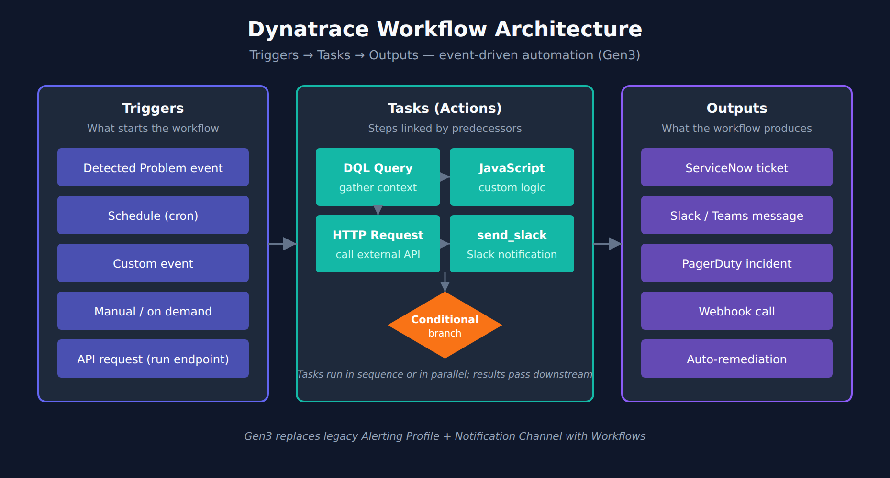

# AUTOM-05: Dynatrace Workflows

> **Series:** AUTOM — Dynatrace Automation | **Notebook:** 5 of 9 | **Created:** January 2026 | **Last Updated:** 10/02/2026

Dynatrace Workflows is a built-in automation engine that enables event-driven actions directly within the platform. Unlike external tools, workflows run inside Dynatrace with full access to observability data.

---

## Table of Contents

1. [Introduction](#introduction)
2. [Workflow Components](#workflow-components)
3. [Creating Workflows](#creating-workflows)
4. [Actions and Integrations](#actions-and-integrations)
5. [Auto-Remediation Patterns](#auto-remediation-patterns)
6. [Best Practices](#best-practices)
7. [Recent Enhancements](#recent-enhancements)
8. [Next Steps](#next-steps)

---

## Prerequisites

Before starting this notebook, ensure you have:

| Requirement | Description |
|-------------|-------------|
| Dynatrace SaaS | Tenant with Workflows enabled |
| Permissions | `automation:workflows:read` to view workflows; `automation:workflows:write`, `automation:workflows:run` and `app-engine:functions:run` to build and run them ([Workflows security (DT docs)](https://docs.dynatrace.com/docs/analyze-explore-automate/workflows/security)) |
| Basic DQL | Understanding of Dynatrace Query Language |

---

## Learning Objectives

By the end of this notebook, you will:

- Understand Dynatrace Workflows architecture
- Know how to create event-driven automations
- Be able to implement auto-remediation patterns
- Connect workflows to external systems

---

<a id="introduction"></a>
## 1. Introduction
### Why Workflows?

| Benefit | Description |
|---------|-------------|
| **Native Integration** | Direct access to all Dynatrace data |
| **No Infrastructure** | No external systems to manage |
| **Event-Driven** | React to problems, alerts, schedules |
| **Context-Aware** | Full Dynatrace Intelligence context available |
| **Secure** | Credentials stored in Dynatrace vault |

### Common Use Cases

| Use Case | Description |
|----------|-------------|
| **Notifications** | Send alerts to Slack, Teams, email |
| **Auto-Remediation** | Restart services, scale resources |
| **Ticketing** | Create ServiceNow, Jira tickets |
| **Enrichment** | Add context to problems |
| **Reporting** | Generate scheduled reports |

---

<a id="workflow-components"></a>
## 2. Workflow Components
### Workflow Architecture

<!-- MARKDOWN_TABLE_ALTERNATIVE
| Component | Purpose |
|-----------|----------|
| Trigger | What starts the workflow: a problem, an event, a schedule, a manual run, or an API request (run endpoint) |
| Tasks | Actions to perform, linked by predecessors; they run in sequence or in parallel |
| Conditions | Logic to control flow |
| Results | A task's output, readable by the tasks downstream of it |
| Outputs | ServiceNow ticket, Slack / Teams message, PagerDuty incident, webhook call, auto-remediation |
-->



### Triggers

*"A trigger can be a schedule, an event, a manual interaction (on demand), or an API request."* There is no inbound-webhook trigger; an external system starts a workflow by calling its run endpoint ([Build workflows (DT docs)](https://docs.dynatrace.com/docs/analyze-explore-automate/workflows/build)).

| Trigger Type | Description | Example |
|--------------|-------------|----------|
| **Problem** | detected problem event | Availability issue detected |
| **Event** | Custom or ingest event | Deployment completed |
| **Schedule** | Time-based (cron) | Daily at 9 AM |
| **Manual** | User-initiated | On-demand execution |
| **API request** | Call to the workflow's run endpoint (API or SDK) | External system trigger |

### Tasks

| Task Type | Description |
|-----------|-------------|
| **HTTP Request** | Call external APIs |
| **Run JavaScript** | Custom logic |
| **DQL Query** | Query Grail data |
| **Send Notification** | Slack, Teams, email |
| **Create Issue** | Jira, ServiceNow |
| **Run Workflow** | Call other workflows |

---

<a id="creating-workflows"></a>
## 3. Creating Workflows
### Access Workflows

Navigate to: **Apps → Workflows**

Or via URL: `https://{tenant}.apps.dynatrace.com/ui/apps/dynatrace.automations/workflows`

### Simple Notification Workflow

The examples in this notebook use the workflow **template** format (`schemaVersion: 3`) that the Workflows app imports and exports, trimmed for reading: the `metadata` block and each task's `position` are left out, and connection fields are empty — select the connection in the editor after import.

> **Action IDs** come from Dynatrace's own workflow samples: `dynatrace.slack:slack-send-message`, `dynatrace.servicenow:snow-create-incident` and `dynatrace.email:send-email`, plus the core `dynatrace.automations:execute-dql-query`, `dynatrace.automations:run-javascript` and `dynatrace.automations:http-function`. Connector actions need the connector installed from Dynatrace Hub. If the editor shows a different ID for an action, use the one it shows. ([Dynatrace-workflow-samples AGENTS.md (Dynatrace GitHub)](https://github.com/Dynatrace/Dynatrace-workflow-samples/blob/main/AGENTS.md))

```yaml
workflow:
  title: Problem Notification
  description: Send a Slack message for availability and error problems
  tasks:
    send_slack:
      name: send_slack
      description: Send Slack alert
      action: dynatrace.slack:slack-send-message
      input:
        connection: ""          # select the Slack connection in the editor
        channel: "<channel-id>" # Slack channel ID
        message: |-
          :warning: *Problem Detected*
          *Problem:* {{ event()["display_id"] }} — {{ event()["event.name"] }}
          *Category:* {{ event()["event.category"] }}
          *Status:* {{ event()["event.status"] }}
      predecessors: []
  trigger:
    eventTrigger:
      isActive: true
      triggerConfiguration:
        type: davis-problem
        value:
          categories:
            availability: true
            error: true
  schemaVersion: 3
```

Slack calls leave the platform, so allow `slack.com` under **Settings → General → External requests** before the first run.

Problem-trigger event fields are the Grail problem-record field names (`event.name`, `event.category`, `event.status`, `display_id`, `root_cause_entity_id`, `affected_entity_ids`) — the same fields `fetch dt.davis.problems` returns — not the Classic problem-API names (`title`, `severity`, `impactLevel`, `rootCauseEntity`).

### Problem Trigger Configuration

| Option | Description |
|--------|-------------|
| Problem state | Active (default), active or closed, or closed only |
| Event category | Availability, Error, Slowdown, Resource, Custom, Info, Monitoring unavailable (`resource` matches `event.category == "RESOURCE_CONTENTION"`) |
| Severity | The level at or above which problems start the workflow |
| Affected entities | Filter by entity tags — all defined tags, or any of them |
| Minimum duration | Postpone the trigger until the problem has been open 5 minutes to one week |
| Wait for root cause analysis | Start only after root-cause analysis has finished |
| Additional custom filter query | A DQL matcher, for example `startsWith(root_cause_entity_id, "HOST-")` |

There is no management-zone or entity-type option: scope with entity tags, or with a custom filter on fields such as `root_cause_entity_id`. ([Event triggers (DT docs)](https://docs.dynatrace.com/docs/analyze-explore-automate/workflows/build/trigger/event-trigger), [dynatrace_automation_workflow resource (Dynatrace GitHub)](https://github.com/dynatrace-oss/terraform-provider-dynatrace/blob/main/docs/resources/automation_workflow.md), [ServiceNow incident sample (Dynatrace GitHub)](https://github.com/Dynatrace/Dynatrace-workflow-samples/blob/main/samples/Messaging%20and%20Incident%20Management/wftpl_sample_servicenow_incident_man.yaml))

---

### Using JavaScript Tasks

Custom logic with JavaScript:

```javascript
// Task: Enrich problem data
import { execution } from '@dynatrace-sdk/automation-utils';

export default async function () {
  // The triggering event is on the execution, not a global
  const ex = await execution();
  const problem = ex.event() ?? {};

  // Build enrichment data
  return {
    problemId: problem['display_id'],
    name: problem['event.name'],
    affectedEntities: (problem['affected_entity_ids'] ?? []).length,
    rootCauseEntity: problem['root_cause_entity_name'] || 'Unknown',
    timestamp: new Date().toISOString()
  };
}
```

A predecessor task's output is `await ex.result('task_name')` (or the standalone `result('task_name')` export) — see the [automation-utils SDK reference (Dynatrace Developer)](https://developer.dynatrace.com/develop/sdks/automation-utils/). List that task under `predecessors`: *"A task can reference only the outputs of its direct predecessors in the workflow graph. If the producing task is not a direct predecessor, the expression resolves to Undefined variables at runtime."* A task with no predecessors starts as soon as the workflow does. ([Run JavaScript action (DT docs)](https://docs.dynatrace.com/docs/analyze-explore-automate/workflows/default-workflow-actions/run-javascript-workflow-action))

### Using DQL Tasks

Query data within workflows:

```yaml
tasks:
  get_metrics:
    name: Get CPU Metrics
    action: dynatrace.automations:execute-dql-query
    input:
      query: |
        timeseries avg(dt.host.cpu.usage), by:{dt.entity.host}, from:-30m
        | filter dt.entity.host == "{{ event()['root_cause_entity_id'] }}"
        | limit 10
```

---

<a id="actions-and-integrations"></a>
## 4. Actions and Integrations
### Built-in Connectors

| Connector | Actions |
|-----------|----------|
| **Slack** | Send message, post to channel |
| **Microsoft Teams** | Send adaptive card |
| **Jira** | Create/update issue |
| **ServiceNow** | Create, search and comment on incidents; import ServiceNow groups as Ownership teams |
| **PagerDuty** | Create incident |
| **Jenkins** | Trigger builds and query build status |
| **Email** | Send email notification |

Connectors other than Email are installed from Dynatrace Hub. ([Workflow actions (DT docs)](https://docs.dynatrace.com/docs/analyze-explore-automate/workflows/default-workflow-actions/actions), [ServiceNow Connector (DT docs)](https://docs.dynatrace.com/docs/analyze-explore-automate/workflows/default-workflow-actions/actions/service-now))

### HTTP Request Task

Call any REST API:

```yaml
tasks:
  call_api:
    name: Call External API
    action: dynatrace.automations:http-function
    input:
      url: "https://api.example.com/incidents"
      method: POST
      headers:
        Content-Type: application/json
        # No Authorization header: select a Credential Vault token in the
        # action's Authentication input instead (see Credential Management below)
      payload: |
        {
          "title": "{{ event()['event.name'] }}",
          "category": "{{ event()['event.category'] }}",
          "source": "dynatrace"
        }
```

The request body goes in `payload` (*"The payload of the HTTP request. Set an appropriate content-type header."*); `body` is a field of the action's *result*, not an input. Add the target domain under **Settings → General → External requests** first: *"All HTTP calls are validated against the global allowlist."* ([HTTP Request action (DT docs)](https://docs.dynatrace.com/docs/analyze-explore-automate/workflows/default-workflow-actions/http-request-workflow-action))

### Credential Management

Store credentials securely:

1. Go to **Settings → Credential Vault**
2. Create a new credential (Token or Basic)
3. In an HTTP Request task, select it in the **Authentication** input: *"The HTTP Request action supports using credentials from the credential vault for Basic and Token authentication."* In a Run JavaScript task, read it with `credentialVaultClient`.

The workflow expression language has no `env` or `credential` object, so `{{ env.API_TOKEN }}` and `{{ credential.MY_API_KEY }}` are not valid references. Do not fall back to a literal header either — header values show in the workflow monitor, and Dynatrace advises: *"We strongly advise you not to expose any secret, but instead to use the authentication configuration via Credential Vault."* ([HTTP Request action (DT docs)](https://docs.dynatrace.com/docs/analyze-explore-automate/workflows/default-workflow-actions/http-request-workflow-action), [Jinja expressions for Workflows (DT docs)](https://docs.dynatrace.com/docs/analyze-explore-automate/workflows/reference), [Run JavaScript action (DT docs)](https://docs.dynatrace.com/docs/analyze-explore-automate/workflows/default-workflow-actions/run-javascript-workflow-action))

---

<a id="auto-remediation-patterns"></a>
## 5. Auto-Remediation Patterns
### Pattern: Restart Service

```yaml
workflow:
  title: Auto-Restart on Crash
  tasks:
    check_entity:
      name: check_entity
      description: Validate the root-cause entity type
      action: dynatrace.automations:run-javascript
      input:
        script: |-
          import { execution } from '@dynatrace-sdk/automation-utils';
          export default async function () {
            const ex = await execution();
            const entityId = (ex.event() ?? {})['root_cause_entity_id'] ?? '';
            if (!entityId.startsWith('PROCESS_GROUP_INSTANCE-')) {
              return { skip: true };
            }
            return { entityId, skip: false };
          }
      predecessors: []
    restart_service:
      name: restart_service
      description: Call the restart runbook
      action: dynatrace.automations:http-function
      input:
        url: "https://runbook.example.com/restart"
        method: POST
        headers:
          Content-Type: application/json
        payload: |-
          { "entityId": "{{ result('check_entity').entityId }}" }
      predecessors:
        - check_entity
      conditions:
        states:
          check_entity: OK
        custom: "{{ result('check_entity').skip == false }}"
        else: SKIP
  trigger:
    eventTrigger:
      isActive: true
      triggerConfiguration:
        type: davis-problem
        value:
          categories:
            availability: true
  schemaVersion: 3
```

### Pattern: Scale on High CPU

```yaml
workflow:
  title: Auto-Scale on Resource Pressure
  tasks:
    check_cpu:
      name: check_cpu
      description: Query current CPU of the root-cause host
      action: dynatrace.automations:execute-dql-query
      input:
        query: |-
          timeseries cpu = avg(dt.host.cpu.usage), from:-30m, filter: {dt.entity.host == "{{ event()['root_cause_entity_id'] }}"}
          | fieldsAdd avg_cpu = arrayAvg(cpu)
      predecessors: []
    scale_up:
      name: scale_up
      description: Trigger scale event
      action: dynatrace.automations:http-function
      input:
        url: "https://api.cloud.example.com/scale"
        method: POST
      predecessors:
        - check_cpu
      conditions:
        states:
          check_cpu: OK
        custom: "{{ result('check_cpu').records | length > 0 and result('check_cpu').records[0].avg_cpu > 90 }}"
        else: SKIP
  trigger:
    eventTrigger:
      isActive: true
      triggerConfiguration:
        type: davis-problem
        value:
          categories:
            resource: true
          customFilter: startsWith(root_cause_entity_id, "HOST-")
  schemaVersion: 3
```

This pattern only fits problems whose root cause is a host. On a validation tenant over seven days (10/02/2026), 16 resource-contention problems had a host as root cause, 45 a process group, and 1,477 no root-cause entity at all; for anything but a host the query returns no records, and `records[0].avg_cpu` would be undefined. The trigger's custom filter keeps the workflow to host-rooted problems, and the `length > 0` guard skips the scale call when the query comes back empty.

> A bare `timeseries avg(dt.host.cpu.usage) | filter dt.entity.host == …` fails with `FIELD_DOES_NOT_EXIST`: without `by:{dt.entity.host}` the series carries no host dimension to filter on. Filter inside `timeseries` (as above) or add the `by:` clause.

---

### Pattern: Create Incident Ticket

```yaml
workflow:
  title: ServiceNow Incident Creation
  tasks:
    create_incident:
      name: create_incident
      description: Create a ServiceNow incident
      action: dynatrace.servicenow:snow-create-incident
      input:
        connectionId: ""        # select the ServiceNow connection in the editor
        shortDescription: "Dynatrace: {{ event()['event.name'] }}"
        description: |-
          Problem detected by Dynatrace Intelligence

          Problem: {{ event()['display_id'] }}
          Name: {{ event()['event.name'] }}
          Category: {{ event()['event.category'] }}
          Root Cause: {{ event()['root_cause_entity_name'] }}
        urgency: "2"
        impact: "2"
        correlationId: DT_{{ event()['event.id'] }}
      predecessors: []
    record_ticket:
      name: record_ticket
      description: Keep the incident reference for later tasks
      action: dynatrace.automations:run-javascript
      input:
        script: |-
          import { result } from '@dynatrace-sdk/automation-utils';
          export default async function () {
            const incident = await result('create_incident');
            return { incidentUrl: incident?.url, status: 'created' };
          }
      predecessors:
        - create_incident
      conditions:
        states:
          create_incident: OK
  trigger:
    eventTrigger:
      isActive: true
      triggerConfiguration:
        type: davis-problem
        value:
          categories:
            availability: true
            error: true
  schemaVersion: 3
```

Input names follow Dynatrace's ServiceNow sample, which also searches for an existing incident by `correlationId` (`snow-search-incidents`) before creating one, so a re-triggered problem does not open a second ticket. ([ServiceNow incident sample (Dynatrace GitHub)](https://github.com/Dynatrace/Dynatrace-workflow-samples/blob/main/samples/Messaging%20and%20Incident%20Management/wftpl_sample_servicenow_incident_man.yaml))

---

<a id="best-practices"></a>
## 6. Best Practices
### Workflow Design

| Practice | Description |
|----------|-------------|
| **Single responsibility** | One workflow, one purpose |
| **Idempotency** | Safe to run multiple times |
| **Error handling** | Handle failures gracefully |
| **Logging** | Add descriptive task names |
| **Testing** | Use manual triggers for testing |

### Trigger Configuration

| Practice | Description |
|----------|-------------|
| **Scope narrowly** | Use the trigger's entity-tag filter and a custom filter query |
| **Avoid duplicates** | Check if action already taken |
| **Debounce** | Use the trigger's **Minimum duration** option (5 minutes to one week) for flapping problems |

### Security

| Practice | Description |
|----------|-------------|
| **Credential vault** | Never hardcode secrets |
| **Least privilege** | Minimal API permissions |
| **Audit trail** | Log all remediation actions |

### Error Handling

Workflows have no `on_error` or `error()` construct. Retries are a task property (`count` 1–99, `delay` in **seconds** 1–3600), and error routing is a downstream task whose **condition** is the upstream task's state (`SUCCESS`, `ERROR`, `ANY`, `OK`, `NOK`):

```yaml
tasks:
  api_call:
    name: Call API
    action: dynatrace.automations:http-function
    retry:
      count: 3
      delay: 30          # seconds

  error_handler:
    name: error_handler
    action: dynatrace.slack:slack-send-message
    predecessors:
      - api_call
    conditions:
      states:
        api_call: ERROR
    input:
      connection: ""          # select the Slack connection in the editor
      channel: "<channel-id>"
      message: "Task api_call failed after 3 retries"
```

The same fields in Terraform form are documented on the [dynatrace_automation_workflow resource (Dynatrace GitHub)](https://github.com/dynatrace-oss/terraform-provider-dynatrace/blob/main/docs/resources/automation_workflow.md) — `retry { count, delay, failed_loop_iterations_only }` and `conditions { states = { … } }`.

---

<a id="recent-enhancements"></a>
## 7. Recent Enhancements

### New Workflow Features (2025-2026)

Dynatrace has added several capabilities to the Workflows engine:

| Feature | Description |
|---------|-------------|
| **Sub-workflows** | Call reusable workflows from within other workflows for modular automation |
| **Approval Requests** | Built-in human approval gates for governed automation |
| **Workflow Drafts** | Save work-in-progress workflows without deploying them |
| **Simple Workflows** | Quickly automate single-step tasks (e.g., send a Slack notification) at no additional cost |
| **Persistent Execution Data** | Retain execution history for analysis and refinement |
| **Real-time Notifications** | Get notified when workflows complete or fail |
| **ServiceNow Connector** | Create, search and comment on incidents; import ServiceNow groups as Ownership teams |

### Agentic Workflows

An agentic workflow is a workflow with at least one agentic action — a task that reasons over live environment data instead of producing a fixed output:

| Capability | Description |
|------------|-------------|
| **Prompt generative AI** | Agentic action for generative tasks, such as a summary |
| **Prompt agentic AI** | Agentic action that calls tools to query and act on your environment |
| **Request Approval** | A task that pauses for a human decision before a consequential step |

Dynatrace's guidance: *"When an agentic workflow drives consequential actions, consider adding a Request Approval task to keep a human in the loop."* Agentic actions are tasks like any other, so the trigger, predecessor and condition patterns above apply unchanged. ([Workflows concepts (DT docs)](https://docs.dynatrace.com/docs/analyze-explore-automate/workflows/concepts))

---

<a id="next-steps"></a>
## 8. Next Steps

### Workflows vs External Automation

| Scenario | Tool Choice |
|----------|-------------|
| Event-driven from Dynatrace | Workflows |
| Config deployment | Monaco/Terraform |
| Complex orchestration | External (Ansible, etc.) |
| Cross-platform actions | Workflows with HTTP tasks |

### Continue the Series

| Next Notebook | Focus |
|---------------|-------|
| **AUTOM-06: Dynatrace SDKs** | Programmatic access with TypeScript/Python |

### Additional Resources

- [Workflows Documentation](https://docs.dynatrace.com/docs/analyze-explore-automate/workflows)
- [Workflow Actions Reference](https://docs.dynatrace.com/docs/analyze-explore-automate/workflows/default-workflow-actions/actions)

---

## Summary

In this notebook, you learned:

- Dynatrace Workflows architecture and components
- Creating event-driven automations with triggers and tasks
- Implementing auto-remediation patterns
- Best practices for workflow design and security

> **Key Takeaway:** Workflows provide native automation inside Dynatrace. Use them for event-driven actions like notifications, ticketing, and auto-remediation. For configuration management, continue using Monaco or Terraform.

---

*Continue to **AUTOM-06: Dynatrace SDKs** to learn programmatic access patterns.*

---

<sub>*This notebook was AI-generated from community-submitted and publicly available sources. This notebook series is not officially supported by Dynatrace. Always verify information against official Dynatrace documentation.*</sub>
