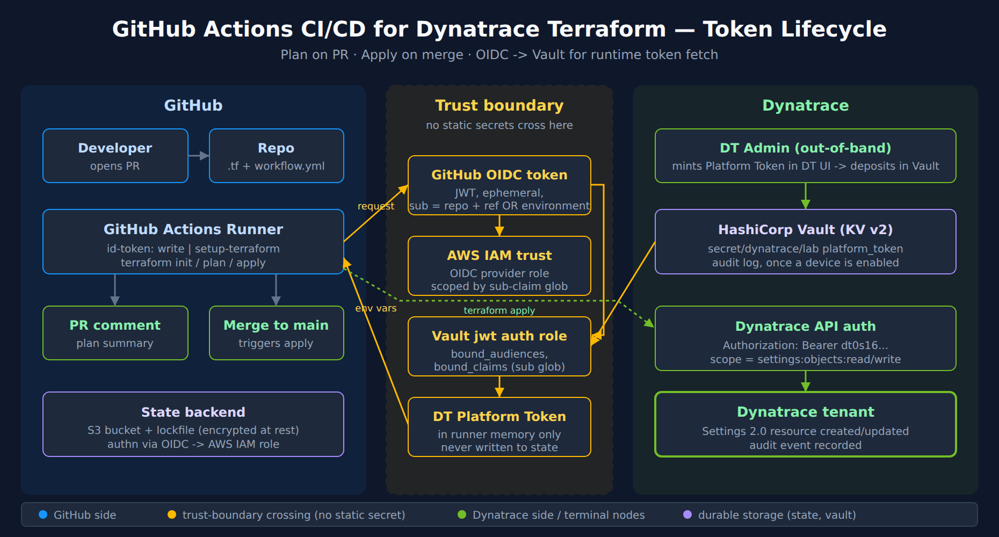

# AUTOM-96 LAB: GitHub Actions CI/CD for Dynatrace Terraform

> **Series:** AUTOM — Dynatrace Automation | **Reference:** 96 — GitHub Actions CI/CD LAB | **Created:** May 2026 | **Last Updated:** 10/02/2026

## Overview

Hands-on lab that takes the GitHub Actions material from **AUTOM-07: CI/CD Integration** §3 and the credential-handling pattern from **AUTOM-04: Terraform Provider** §3 and walks through them end-to-end. By the end of this lab you have a working pipeline that:

- Runs `terraform fmt -check`, `terraform validate`, and `terraform plan` on every pull request, posting the plan summary back as a PR comment.
- Runs `terraform apply` on merge to `main`, gated by a GitHub Environment with required reviewers (on a private repo that gate needs GitHub Enterprise — see Prerequisites).
- Uses one GitHub OIDC token for **two parallel trusts**: an **AWS IAM role** for the S3 state backend, and a **HashiCorp Vault `jwt` role** for the runtime fetch of a Dynatrace Platform Token. **No static Dynatrace token lives in GitHub Secrets.**
- Stores Terraform state in S3 with native S3 lockfile locking, encrypted at rest.
- Manages a single Settings 2.0 resource (an ownership team, `builtin:ownership.teams`) end-to-end so the credential plumbing is the focus, not the resource model.

This LAB is the hands-on companion to AUTOM-07 §3 (which describes the patterns) and AUTOM-04 §3 (which describes the token model). It does **not** repeat material from those notebooks — it walks through the steps.

**Out of scope for this LAB** (cross-references provided):

| Topic | See |
|-------|-----|
| Other CI platforms (GitLab, Bitbucket, Bamboo, Azure DevOps) | AUTOM-07 §4–§7 |
| State backend hardening (KMS, IAM scopes, multi-account) | AUTOM-09 §3 |
| Multi-environment promotion patterns | AUTOM-09 §6 |
| Lifecycle protections (`prevent_destroy`, `replace_triggered_by`) | AUTOM-09 §9 |
| Token-model deep dive (Platform vs classic API) | AUTOM-04 §3 |
| `dynatrace_api_token` / state-leakage concerns | AUTOM-04 §3 |

---

## Table of Contents

1. [Prerequisites](#prerequisites)
2. [Architecture](#architecture)
3. [Step 1 — Bootstrap the Terraform repo layout](#step-1-bootstrap-repo)
4. [Step 2 — Mint the Platform Token (out-of-band)](#step-2-mint-token)
5. [Step 3 — Wire OIDC trust](#step-3-oidc-trust)
6. [Step 4 — Author the workflow file](#step-4-workflow)
7. [Step 5 — Run a plan-only test on a PR](#step-5-pr-plan)
8. [Step 6 — Promote to apply on merge](#step-6-merge-apply)
9. [Step 7 — Validate](#step-7-validate)
10. [Common Pitfalls](#common-pitfalls)
11. [Where to go next](#where-to-go-next)
12. [Summary Checklist](#summary-checklist)
13. [Sources and References](#sources-and-references)

---

<a id="prerequisites"></a>
## 1. Prerequisites

| Requirement | Details |
|-------------|---------|
| **Completed** | AUTOM-04 (Terraform Provider) and AUTOM-07 (CI/CD Integration) §3 read at least once |
| **Dynatrace Environment** | Gen3 SaaS tenant; account-admin access to mint a Platform Token on a service user |
| **GitHub Account** | Repository with admin access (to add Environments, configure OIDC permissions, set repo secrets) |
| **GitHub plan** | The apply gate uses an environment with **required reviewers**. On GitHub Free, Pro and Team those are available **only for public repositories** — use a public repo for this LAB (nothing secret lives in it) or GitHub Enterprise. See Step 4. |
| **AWS Account** | Account where you can create an IAM OIDC identity provider, an IAM role, an S3 bucket, and (optionally) a KMS key. A Free Tier account works. |
| **HashiCorp Vault** | An instance reachable from GitHub Actions, with a KV v2 engine at `secret/`: a self-hosted Vault behind a public endpoint or a runner-reachable VPN endpoint, or **HCP Vault Dedicated** (check its current tiers and trial). On HCP Vault Dedicated the top-level namespace is `admin`, which the commands below must target — see Step 3. |
| **Local tools** | `terraform >= 1.11` (S3 native locking is GA from 1.11), `aws` CLI, `vault` CLI, `gh` CLI (GitHub CLI), `git` |
| **Time budget** | Roughly 1.5–2 hours end-to-end, the first time you run it. |

> **Tenant URL placeholder.** Throughout this LAB, replace `https://<your-tenant>.apps.dynatrace.com` (UI host) and `https://<your-tenant>.live.dynatrace.com` (API host) with your actual tenant identifier.

---

<a id="architecture"></a>
## 2. Architecture

The pipeline has three zones: **GitHub** (source + runner + state), a **trust boundary** crossed by short-lived federated identity (no static secrets), and **Dynatrace** (the Platform Token mint side and the eventual API target).



<!-- MARKDOWN_TABLE_ALTERNATIVE
| Zone | Component | Role |
|------|-----------|------|
| GitHub | Developer / Repo / Actions Runner / PR comment / Merge | The source-of-truth + execution surface |
| GitHub | S3 state backend | Durable Terraform state; itself authn'd via OIDC |
| Trust boundary | GitHub OIDC token | JWT issued per workflow run; sub claim carries the repo plus either the ref or the environment |
| Trust boundary | AWS IAM trust + Vault jwt auth | Two parallel federated trusts (GitHub -> AWS for state, GitHub -> Vault for the token), scoped by a sub-claim glob — no static credential |
| Trust boundary | DT Platform Token | Lives in Vault at secret/dynatrace/lab; scopes settings:objects:read/write; only ephemerally in runner memory; never in GitHub Secrets, never in Terraform state |
| Dynatrace | DT Admin (out-of-band) | Mints the Platform Token in DT UI, deposits it in Vault |
| Dynatrace | API auth + tenant | Validates the bearer token; applies the Settings 2.0 change |
For environments where SVG doesn't render
-->

### Why this shape

- **Mint out-of-band, deliver in-band** (the pattern from AUTOM-04 §3): the long-lived Dynatrace credential is generated once by an admin, deposited in Vault, and never touched by Terraform or by GitHub Secrets.
- **OIDC federation** removes the chicken-and-egg of "what authenticates the credential fetch?" — GitHub's OIDC identity authenticates to AWS IAM and to Vault directly, so there is no static AWS access key or static Vault token in GitHub Secrets either.
- **Single `id-token: write`** permission on the workflow is the only GitHub-side configuration that matters; the rest is set up once on the AWS and Vault sides.

---

<a id="step-1-bootstrap-repo"></a>
## 3. Step 1 — Bootstrap the Terraform repo layout

The LAB uses the simplest layout that exercises the credential plumbing — one directory, three `.tf` files, one Settings 2.0 resource. For multi-environment / module-based layouts see **AUTOM-09 §2**.

### Create the directory and files

```bash
mkdir -p dynatrace-terraform/.github/workflows
cd dynatrace-terraform
git init
touch versions.tf main.tf backend.tf .gitignore
```

### `.gitignore` (mandatory before first commit)

```gitignore
# Terraform
.terraform/
*.tfstate
*.tfstate.*
*.tfplan
crash.log

# Local credentials
*.tfvars
!example.tfvars
.env
```

> **Why this matters.** State files and `.tfvars` files routinely contain sensitive values — even with `sensitive = true` they are still plain-text on disk (see AUTOM-04 §3 *Operational Safety*). Committing them to Git is the most common credential-leak path in real Terraform shops.

> **Do commit `.terraform.lock.hcl`.** It records the exact provider build `terraform init` selected, so the PR plan and the merge apply run the same provider. HashiCorp: *"You should include this file in your version control repository"* ([Dependency lock file (Terraform docs)](https://developer.hashicorp.com/terraform/language/files/dependency-lock)). Run `terraform init` once locally and commit the file it creates.

### `versions.tf` — pin everything

```hcl
terraform {
  required_version = ">= 1.11.0" # use_lockfile (backend.tf) is GA from 1.11

  required_providers {
    dynatrace = {
      source  = "dynatrace-oss/dynatrace"
      version = "~> 1.93"
    }
  }
}
```

### `backend.tf` — S3 state, native S3 lockfile

```hcl
terraform {
  backend "s3" {
    bucket = "my-org-terraform-state"
    key    = "dynatrace/lab/terraform.tfstate"
    region = "us-east-1"

    # Native S3 lockfile — added in Terraform 1.10, GA in 1.11; replaces the
    # DynamoDB lock table, which HashiCorp has deprecated.
    # See https://developer.hashicorp.com/terraform/language/backend/s3 for the
    # current locking model.
    use_lockfile = true

    encrypt = true
  }
}
```

> **Bucket setup is out of scope for this LAB.** Create the bucket once via console / CloudFormation / a separate Terraform configuration; enable bucket versioning; consider an SSE-KMS key. See **AUTOM-09 §3** for the hardening checklist.

### `main.tf` — one Settings 2.0 resource

We pick an **ownership team** (`builtin:ownership.teams`) because it (a) is a Settings 2.0 schema, so it works with a Platform Token alone, (b) is a **multi-object** schema (up to 1,000 teams), so creating one never overwrites an existing object, (c) is not deprecated and is not on Dynatrace's removed-schemas list, and (d) is harmless to create and delete in a non-prod tenant.

```hcl
provider "dynatrace" {
  # Picked up from environment variables at apply time:
  #   DYNATRACE_ENV_URL
  #   DYNATRACE_PLATFORM_TOKEN
}

resource "dynatrace_generic_setting" "lab_team" {
  schema = "builtin:ownership.teams"
  scope  = "environment"

  value = jsonencode({
    name        = "LAB Team"
    identifier  = "lab-team"
    description = "Created by the AUTOM CI/CD LAB - safe to delete"
    responsibilities = {
      development    = false
      infrastructure = false
      lineOfBusiness = false
      operations     = true
      security       = false
    }
    supplementaryIdentifiers = []
    contactDetails           = []
    links                    = []
    additionalInformation    = []
  })
}
```

> **`schema`, not `schema_id`.** `dynatrace_generic_setting` takes `schema`, `scope` and a JSON `value`; `schema_id` fails `terraform validate`. The value above passes the Settings API's own validation for `builtin:ownership.teams` (checked with a validate-only request, 09/18/2026). Earlier versions of this LAB used `builtin:kubernetes.generic.metadata.enrichment`, which is a deprecated **singleton** (`maxObjects: 1`) — creating it would have overwritten a tenant's existing object — and whose rule fields were misnamed.

> **No `dt_platform_token` argument in the provider block.** The Dynatrace provider reads `DYNATRACE_ENV_URL` and `DYNATRACE_PLATFORM_TOKEN` from the environment when the corresponding HCL arguments are absent. This is what lets the OIDC -> Vault -> env-vars chain work without HCL-level coupling.

<a id="step-2-mint-token"></a>
## 4. Step 2 — Mint the Platform Token (out-of-band)

This step happens **once**, in the Dynatrace UI, by a human admin. It is deliberately not part of the pipeline. The full rationale (mint-out-of-band-vs-in-pipeline trade-offs) is in **AUTOM-04 §3 *Operational Safety — State File Leakage*** — read that subsection if you have not already.

### UI steps

1. Sign in to `https://<your-tenant>.apps.dynatrace.com` as an account administrator.
2. Open the **Account Management** console (the user-icon menu in the top right) -> **Identity & access management** -> **Service users**.
3. Create or select the service user that will own this token (e.g. `svc-terraform-lab`).
4. Confirm the service user is in a group with the IAM permissions needed for Settings 2.0 management — at minimum the equivalent of **"Change monitoring settings"** (`environment:roles:manage-settings`) on the tenant.
5. Switch to **Platform tokens** (myaccount.dynatrace.com -> Platform tokens) and click **Generate new token**.
6. **On behalf of:** select the `svc-terraform-lab` service user.
7. **Scopes:** select `settings:objects:read` and `settings:objects:write`. (Add `settings:schemas:read` if your tenant requires it for schema discovery.)
8. Set an **expiration** appropriate to your rotation policy (the LAB recommendation is 90 days — short enough to force you through the rotation flow at least once during the LAB lifetime).
9. Copy the token value (`dt0s16....`). It is shown **once**.

### Deposit the token into Vault

```bash
# Authenticate to Vault as a human admin (any auth method that works for you)
vault login -method=oidc

# On HCP Vault Dedicated: export VAULT_NAMESPACE=admin   (see Step 3)
# If no KV v2 engine is mounted at secret/ yet:
#   vault secrets enable -path=secret kv-v2

# Write the token to the path the workflow will read from
vault kv put secret/dynatrace/lab \
  platform_token="dt0s16.XXXX..." \
  env_url="https://<your-tenant>.live.dynatrace.com"
```

> **Three things must align** for the Platform Token to actually work — service user IAM permissions, the creator's `iam:service-users:use` permission, and the scopes selected at token creation. AUTOM-04 §3 *Service User Credentials for Terraform* covers the model in full. If `terraform apply` later fails with a 403, this is the first place to look.

---

<a id="step-3-oidc-trust"></a>
## 5. Step 3 — Wire OIDC trust

Two trust relationships need to exist before the workflow can run. Both rest on the same GitHub OIDC token, and they are **independent** of each other:

1. **GitHub -> AWS** — the workflow assumes an AWS IAM role to reach S3 (state) without a static AWS access key. AWS is used for nothing else.
2. **GitHub -> Vault** — Vault's `jwt` auth method trusts GitHub's OIDC issuer directly, so the workflow pulls the Dynatrace Platform Token without a static Vault token. No AWS credential is involved.

The [GitHub OIDC docs (GitHub docs)](https://docs.github.com/en/actions/concepts/security/openid-connect) name both kinds of target: *"access a cloud provider (such as AWS, Azure, GCP, HashiCorp Vault, and others)"*.

### The `sub` claim — check its format first

Both trusts match on the token's `sub` claim, and its format depends on the repository and the job:

| Case | `sub` looks like |
|------|------------------|
| Repo created on GitHub.com **after July 15, 2026** (or opted in) — includes any repo you create for this LAB | `repo:<org>@<org-id>/<repo>@<repo-id>:ref:refs/heads/main` |
| Older repo | `repo:<org>/<repo>:ref:refs/heads/main` |
| A job that references an environment (the `apply` job uses `production`) | `…:environment:production` — the ref is **not** included |

Get the two IDs with `gh api repos/<your-org>/<your-repo> --jq '.owner.id, .id'`. If in doubt, run [`github/actions-oidc-debugger` (GitHub)](https://github.com/github/actions-oidc-debugger) once and copy the `sub` it prints.

> <sub>**Sources:** [OIDC reference (GitHub docs)](https://docs.github.com/en/actions/reference/security/oidc) — *"repositories created after July 15, 2026 now use an immutable default subject format that includes both the owner ID and repository ID"*; *"The subject claim includes the branch name of the workflow, but only if the job doesn't reference an environment"*.</sub>

> **Preview — skipping the stored Dynatrace token entirely.** Dynatrace now documents [Workload identity federation (DT docs)](https://docs.dynatrace.com/docs/manage/identity-access-management/access-tokens-and-oauth-clients/workload-identity-federation) as a **Preview** feature: *"Workload identity federation (WIF) lets an external workload call the Dynatrace API with a token issued by its own identity provider."* The page names a GitHub Actions job as a fitting workload, so the GitHub OIDC token could authenticate to Dynatrace directly, mapped to a service user — no Platform Token in Vault at all. Verify that WIF is available in your account before relying on it; until then, the Vault-held Platform Token in this LAB remains the working path.

### 5.1 — Create the GitHub OIDC identity provider in AWS

This is a one-time, account-wide setup. If your AWS account already has the GitHub provider registered, skip this.

```bash
# Use the AWS account where the S3 state bucket lives
aws iam create-open-id-connect-provider \
  --url https://token.actions.githubusercontent.com \
  --client-id-list sts.amazonaws.com
```

> **No thumbprint needed.** `--thumbprint-list` is optional: *"If it is not included, IAM will retrieve and use the top intermediate certificate authority (CA) thumbprint of the OpenID Connect identity provider server certificate."* ([CreateOpenIDConnectProvider (AWS docs)](https://docs.aws.amazon.com/IAM/latest/APIReference/API_CreateOpenIDConnectProvider.html))

### 5.2 — Create the AWS IAM role the workflow assumes

Create `trust-policy.json`:

```json
{
  "Version": "2012-10-17",
  "Statement": [
    {
      "Effect": "Allow",
      "Principal": {
        "Federated": "arn:aws:iam::<your-aws-account-id>:oidc-provider/token.actions.githubusercontent.com"
      },
      "Action": "sts:AssumeRoleWithWebIdentity",
      "Condition": {
        "StringEquals": {
          "token.actions.githubusercontent.com:aud": "sts.amazonaws.com"
        },
        "StringLike": {
          "token.actions.githubusercontent.com:sub": "repo:<your-org>@<org-id>/<your-repo>@<repo-id>:*"
        }
      }
    }
  ]
}
```

> **The `sub` claim is the load-bearing scoping mechanism.** The policy uses the immutable format of a repo created after July 15, 2026 (see the table above); for an older repo use `repo:<your-org>/<your-repo>:*`. The `:*` suffix admits any branch, pull request and environment in the repo — right for a shared plan/apply role like this LAB's. To tighten a separate **apply** role, match the environment, not the branch: `repo:<your-org>@<org-id>/<your-repo>@<repo-id>:environment:production`. A `:ref:refs/heads/main` condition never matches the apply job, because a job that references an environment presents `:environment:…` instead of the ref. A mismatched `sub` is a frequent cause of a failed role assumption — see Common Pitfalls.

Create the role and attach a least-privilege policy that allows S3 state access only:

```bash
aws iam create-role \
  --role-name github-actions-dynatrace-terraform \
  --assume-role-policy-document file://trust-policy.json

aws iam put-role-policy \
  --role-name github-actions-dynatrace-terraform \
  --policy-name terraform-state-access \
  --policy-document '{
    "Version": "2012-10-17",
    "Statement": [
      {
        "Effect": "Allow",
        "Action": ["s3:GetObject","s3:PutObject","s3:DeleteObject"],
        "Resource": "arn:aws:s3:::my-org-terraform-state/dynatrace/lab/*"
      },
      {
        "Effect": "Allow",
        "Action": ["s3:ListBucket"],
        "Resource": "arn:aws:s3:::my-org-terraform-state"
      }
    ]
  }'
```

### 5.3 — Configure Vault to trust GitHub OIDC

Vault accepts the GitHub OIDC JWT directly through its `jwt` auth method — AWS plays no part in this trust. You only need this once per Vault instance.

> **On HCP Vault Dedicated**, the top-level namespace is `admin`, not root. Run `export VAULT_NAMESPACE=admin` before these commands (and before the `vault kv put` in Step 2), and uncomment `namespace: admin` on both `vault-action` steps in Step 4. Without it, the commands and the workflow reach the wrong namespace. ([What is HCP Vault Dedicated (HashiCorp)](https://developer.hashicorp.com/vault/cloud), [Vault CLI `VAULT_NAMESPACE` (Vault docs)](https://developer.hashicorp.com/vault/docs/commands))


```bash
# Enable the jwt auth method (idempotent; skip if already enabled)
vault auth enable jwt

# Configure it to trust GitHub's OIDC issuer
vault write auth/jwt/config \
  oidc_discovery_url="https://token.actions.githubusercontent.com" \
  bound_issuer="https://token.actions.githubusercontent.com"

# Create a policy that grants read on the secret we wrote in Step 2
vault policy write dynatrace-lab-read - <<'EOF'
path "secret/data/dynatrace/lab" {
  capabilities = ["read"]
}
EOF

# Create a role that is assumable by the workflow
vault write auth/jwt/role/dynatrace-terraform-lab \
  role_type="jwt" \
  user_claim="actor" \
  bound_audiences="https://github.com/<your-org>" \
  bound_claims_type="glob" \
  bound_claims='{"sub":"repo:<your-org>@<org-id>/<your-repo>@<repo-id>:*"}' \
  policies="dynatrace-lab-read" \
  ttl="15m"
```

> **`bound_claims` uses the same `sub` format as the AWS trust policy** — for a repo created before July 15, 2026, use `repo:<your-org>/<your-repo>:*`.
>
> **`bound_audiences` must match the audience the workflow requests.** If `jwtGithubAudience` is omitted, the token carries GitHub's default audience — *"the URL of the repository owner"*, i.e. `https://github.com/<your-org>` ([OIDC reference (GitHub docs)](https://docs.github.com/en/actions/reference/security/oidc)). The workflow below sets it explicitly so the value visibly matches `bound_audiences`.

See the [Vault JWT auth method (Vault docs)](https://developer.hashicorp.com/vault/docs/auth/jwt) for the full claim-binding reference.

---

<a id="step-4-workflow"></a>
## 6. Step 4 — Author the workflow file

Two jobs in one file: `plan` runs on every pull request; `apply` runs only on push to `main` and is gated by a GitHub Environment. Both jobs share a composite step that performs the OIDC -> Vault -> Dynatrace-token fetch, so the credential plumbing exists once.

Create `.github/workflows/terraform.yml`:

```yaml
name: Terraform — Dynatrace Lab

on:
  pull_request:
    branches: [main]
    paths:
      - "**/*.tf"
      - ".github/workflows/terraform.yml"
  push:
    branches: [main]
    paths:
      - "**/*.tf"
      - ".github/workflows/terraform.yml"

# Required for OIDC. Without id-token:write the workflow has no OIDC token to present.
permissions:
  contents: read
  id-token: write
  pull-requests: write

env:
  AWS_REGION: us-east-1
  TF_IN_AUTOMATION: "true"
  TF_INPUT: "false"

# Action majors checked 10/2026 — all run on Node 24 (GitHub removed Node 20 from the
# runners on 09/23/2026). Terraform pinned to an exact release.
jobs:
  plan:
    name: terraform plan
    runs-on: ubuntu-latest
    steps:
      - uses: actions/checkout@v7

      - name: Setup Terraform
        uses: hashicorp/setup-terraform@v4
        with:
          terraform_version: "1.16.5"

      - name: Configure AWS credentials via OIDC
        uses: aws-actions/configure-aws-credentials@v6
        with:
          role-to-assume: arn:aws:iam::<your-aws-account-id>:role/github-actions-dynatrace-terraform
          aws-region: ${{ env.AWS_REGION }}

      - name: Fetch Dynatrace Platform Token from Vault
        id: vault
        uses: hashicorp/vault-action@v4
        with:
          url: https://vault.example.com:8200
          # namespace: admin   # HCP Vault Dedicated only
          method: jwt
          jwtGithubAudience: https://github.com/<your-org>
          role: dynatrace-terraform-lab
          secrets: |
            secret/data/dynatrace/lab platform_token | DYNATRACE_PLATFORM_TOKEN ;
            secret/data/dynatrace/lab env_url        | DYNATRACE_ENV_URL

      - name: terraform fmt -check
        run: terraform fmt -check -recursive

      - name: terraform init
        run: terraform init -input=false

      - name: terraform validate
        run: terraform validate -no-color

      - name: terraform plan
        id: plan
        run: |
          terraform plan -no-color -out=tfplan
          terraform show -no-color tfplan > plan.txt
        env:
          DYNATRACE_PLATFORM_TOKEN: ${{ env.DYNATRACE_PLATFORM_TOKEN }}
          DYNATRACE_ENV_URL: ${{ env.DYNATRACE_ENV_URL }}

      - name: Post plan to PR
        if: github.event_name == 'pull_request'
        uses: actions/github-script@v9
        with:
          script: |
            const fs = require('fs');
            const plan = fs.readFileSync('plan.txt', 'utf8').slice(0, 60000);
            const body = [
              '### Terraform Plan',
              '',
              '<details><summary>Click to expand</summary>',
              '',
              '```hcl',
              plan,
              '```',
              '',
              '</details>',
            ].join('\n');
            await github.rest.issues.createComment({
              owner: context.repo.owner,
              repo: context.repo.repo,
              issue_number: context.issue.number,
              body,
            });

  apply:
    name: terraform apply
    needs: plan
    if: github.ref == 'refs/heads/main' && github.event_name == 'push'
    runs-on: ubuntu-latest
    environment: production    # gated by GitHub Environment Protection Rules
    steps:
      - uses: actions/checkout@v7

      - name: Setup Terraform
        uses: hashicorp/setup-terraform@v4
        with:
          terraform_version: "1.16.5"

      - name: Configure AWS credentials via OIDC
        uses: aws-actions/configure-aws-credentials@v6
        with:
          role-to-assume: arn:aws:iam::<your-aws-account-id>:role/github-actions-dynatrace-terraform
          aws-region: ${{ env.AWS_REGION }}

      - name: Fetch Dynatrace Platform Token from Vault
        uses: hashicorp/vault-action@v4
        with:
          url: https://vault.example.com:8200
          # namespace: admin   # HCP Vault Dedicated only
          method: jwt
          jwtGithubAudience: https://github.com/<your-org>
          role: dynatrace-terraform-lab
          secrets: |
            secret/data/dynatrace/lab platform_token | DYNATRACE_PLATFORM_TOKEN ;
            secret/data/dynatrace/lab env_url        | DYNATRACE_ENV_URL

      - name: terraform init
        run: terraform init -input=false

      - name: terraform apply
        run: terraform apply -auto-approve -input=false
```

### What the workflow does, in order

1. **Checkout the repo** — standard.
2. **Setup Terraform** — `hashicorp/setup-terraform@v4` pins to a known version. Pin a real version, not `latest`, so plan output is reproducible across reruns.
3. **AWS credentials via OIDC** — the workflow's OIDC token is exchanged for short-lived AWS credentials by assuming the IAM role created in Step 3.2. **No static AWS access key in GitHub Secrets.**
4. **Vault token fetch** — the same OIDC token (re-issued for the Vault audience) is exchanged for a short-lived Vault token bound to `dynatrace-terraform-lab` role. **No static Vault token in GitHub Secrets.** `vault-action` automatically masks the secrets in subsequent log lines.
5. **`terraform fmt -check`** — fail fast on style.
6. **`terraform init`** — downloads the Dynatrace provider; AWS credentials from step 3 authorize state read/write.
7. **`terraform validate`** — schema/HCL validation.
8. **`terraform plan`** — generates the plan; environment variables for the Dynatrace provider come from the Vault step.
9. **PR-comment step** — only runs on `pull_request` events; posts the plan back as a comment using `actions/github-script`.
10. **Apply job** — only runs on push-to-main, only after `plan` succeeds, and only after the GitHub Environment's required reviewers approve — if your plan supports required reviewers on this repo (below).

> **`workflow_dispatch` is intentionally omitted.** Adding manual-trigger support is a one-line addition (`on.workflow_dispatch:` block) but it widens the surface — anyone with workflow-write permission can apply on demand. Add it explicitly if your team needs it; defaulting it off is safer.

### Configure the GitHub Environment

In the GitHub UI: **Settings -> Environments -> New environment -> `production`**. Then:

- **Required reviewers:** add at least one team member who is not the author. This is the apply gate.

> **Check your GitHub plan before relying on the gate.** *"If you are on a GitHub Free, GitHub Pro, or GitHub Team plan, other deployment protection rules, such as a wait timer or required reviewers, are only available for public repositories."* On GitHub Free, a private repository gets no environments at all. Without the gate, every merge to `main` runs `terraform apply -auto-approve` with no approval and no warning. Use a public repository for this LAB (the token lives in Vault, not the repo) or GitHub Enterprise. ([Managing environments (GitHub docs)](https://docs.github.com/en/actions/how-tos/deploy/configure-and-manage-deployments/manage-environments))

- **Wait timer:** optional 5–15 minute delay before the gate can be approved (useful for last-call review).
- **Deployment branches:** restrict to `main` only.
- **Environment secrets:** none needed for this LAB — secrets come from Vault at runtime.

---

<a id="step-5-pr-plan"></a>
## 7. Step 5 — Run a plan-only test on a PR

```bash
# From your local clone of the repo
git checkout -b lab-add-ownership-team
git add .
git commit -m "feat: add Settings 2.0 ownership team"
git push -u origin lab-add-ownership-team

# Open the PR
gh pr create --base main --title "LAB: add ownership team" --body "Lab change."
```

### What you should see, in order

1. The `plan` job starts immediately on PR open. Expect ~60–90 seconds total wall-clock.
2. The first run downloads the Dynatrace provider — adds about 20 seconds you won't pay on subsequent runs.
3. The Vault step prints `Reading secret from secret/data/dynatrace/lab` and the masked secret values are not echoed. If you see the actual token value in the log, **stop**: the masking is broken or you typed it into the workflow YAML by mistake.
4. The `terraform plan` step prints something like:

   ```
   Plan: 1 to add, 0 to change, 0 to destroy.
   ```

5. Within 5–10 seconds of the run completing, a new comment appears on the PR titled **Terraform Plan**, containing the collapsed plan output.

### What you should NOT see

- A comment with raw token values. If the plan or apply ever leaks a token into logs, treat it as a credential incident: rotate the Platform Token in DT, rotate any downstream tokens, audit recent activity.
- A failed apply on a PR. Apply should be skipped entirely on PRs (the `if:` condition gates it). If apply runs on a PR, the `if:` is wrong.

---

<a id="step-6-merge-apply"></a>
## 8. Step 6 — Promote to apply on merge

```bash
# After PR review and approval
gh pr merge --squash --delete-branch
```

### What you should see, in order

1. A new workflow run starts on `main`, triggered by the merge commit.
2. The `plan` job runs again (and should produce the same plan as the PR-time run — see Common Pitfalls if it doesn't).
3. The `apply` job appears as **Waiting** with a *Review deployments* button — this is the GitHub Environment gate.
4. An approver clicks *Review deployments*, optionally adds a comment, and approves.
5. The `apply` job runs through the same checkout / Terraform / OIDC / Vault steps, then runs `terraform apply -auto-approve`. Output ends with:

   ```
   Apply complete! Resources: 1 added, 0 changed, 0 destroyed.
   ```

### Manual approval is the load-bearing safety net

Because `apply` is `-auto-approve`, the GitHub Environment gate is the **only** human checkpoint — and it exists only where your plan provides required reviewers for this repository (Step 4). Without it, a merge applies unattended. Treat the required-reviewers list with the same care as production deploy access for any other system. Two-person rule (author cannot self-approve) is the standard configuration in **Settings -> Environments -> production -> *Prevent self-review***.

---

<a id="step-7-validate"></a>
## 9. Step 7 — Validate

Three places to check, in order:

### 9.1 — Dynatrace tenant

1. Sign in to `https://<your-tenant>.apps.dynatrace.com`.
2. Open the Settings app and search for **Teams** (schema `builtin:ownership.teams`) — or list the objects with `GET /api/v2/settings/objects?schemaIds=builtin:ownership.teams`.
3. Confirm a team exists with name `LAB Team` and identifier `lab-team`.
4. Check the object's modification info — it should show the service user (e.g. `svc-terraform-lab`), not a human.

### 9.2 — GitHub

1. **Actions** tab -> the merge-commit run -> confirm both jobs are green.
2. **Settings -> Environments -> production -> Deployment history** — confirm one deployment, with the approver's name.
3. The closed PR shows the *Terraform Plan* comment from the plan run.

### 9.3 — Vault audit log

Vault starts with auditing **disabled**, and `vault audit list` only lists the audit devices that are enabled — it shows no requests. To check the reads, enable a file audit device **before** the merge run (on a Vault where you can manage audit devices), then search the log on the Vault server:

```bash
# Before the run
vault audit enable file file_path=/var/log/vault_audit.log

# After the run, on the Vault server
grep 'secret/data/dynatrace/lab' /var/log/vault_audit.log
# Expect two reads from the merge run (plan + apply), each authenticated
# via auth/jwt with role dynatrace-terraform-lab.
```

> <sub>**Sources:** [Audit logging (Vault docs)](https://developer.hashicorp.com/vault/docs/audit) — *"When you initialize a new Vault cluster, auditing is disabled."*; [audit list (Vault docs)](https://developer.hashicorp.com/vault/docs/commands/audit/list) — *"List information about active audit devices."*</sub>

If all three places show what you expect, the pipeline is wired correctly end-to-end.

---

<a id="common-pitfalls"></a>
## 10. Common Pitfalls

| # | Symptom | Cause | Fix |
|---|---------|-------|-----|
| 1 | `Error: Could not satisfy plugin requirements` on `terraform init` after a state-backend change | Stale `.terraform/` cache | `rm -rf .terraform && terraform init` |
| 2 | `Error: state lock could not be acquired` | A previous run died holding the lock; with `use_lockfile = true` the lock object is `key.tflock` in the same prefix | Verify no run is actually in progress, then `terraform force-unlock <LOCK_ID>` (the ID is in the error message) |
| 3 | `Not authorized to perform sts:AssumeRoleWithWebIdentity` at the *Configure AWS credentials* step (`terraform init` never runs) | The trust policy's `sub` (or `aud`) condition does not match the token — commonly the old `repo:<org>/<repo>:*` form on a repo that issues the immutable `repo:<org>@<id>/<repo>@<id>:…` format, or a `:ref:refs/heads/main` condition on the apply job, which presents `:environment:production` | Print the token's claims once with `github/actions-oidc-debugger` and match the condition to the `sub` it shows (Step 3 table) |
| 4 | `permission denied: cannot retrieve credential from Vault` | Workflow lacks `id-token: write` permission, the Vault role's `bound_audiences` does not match `jwtGithubAudience`, or its `bound_claims` `sub` glob uses the wrong `sub` format (Step 3 table) | Add `id-token: write` to the workflow's `permissions:` block; align the audience strings exactly — Vault is whitespace and case sensitive on this field |
| 5 | Plan posts the Dynatrace token in cleartext into the PR comment | `terraform plan` rendered an attribute that contains the token (e.g. an output, or a debug `local`) | Mark any `output` referencing the token as `sensitive = true` and, more importantly, **never echo `TF_VAR_*` or `DYNATRACE_PLATFORM_TOKEN` from a `run:` step** — `vault-action`'s masking only catches values it injected, not values you re-stringify |
| 6 | `Error: 403 Forbidden` from the Dynatrace API on apply | Three-things-align failure: service user IAM permissions, creator's `iam:service-users:use` at mint time, or scope selection | Re-read AUTOM-04 §3 *Service User Credentials*; the most common variant is the service user lacking the **Change monitoring settings** permission |
| 7 | Plan on PR succeeds; same plan on merge-to-main fails | Drift between PR-time and merge-time tenant state, or the apply role can read state but the plan role cannot (or vice versa) | If you split the IAM roles per environment, both must permit S3 state access on the same prefix; for this LAB they share a role, so look for tenant drift first |
| 8 | `AccessDenied` on `s3:GetObject` / `s3:PutObject` during `terraform init` | The role was assumed, but its **permission** policy does not cover the bucket, the `dynatrace/lab/` prefix or the `.tflock` lock object | Fix the resource ARNs in the role's `terraform-state-access` policy (Step 3.2) |

---

<a id="where-to-go-next"></a>
## 11. Where to go next

| Topic | Notebook |
|-------|----------|
| Other CI platforms (GitLab, Bitbucket, Bamboo, Azure DevOps) following the same OIDC + Vault shape | **AUTOM-07** §4–§7 |
| State backend hardening — KMS keys, IAM scopes per environment, multi-account state, audit logging | **AUTOM-09** §3 |
| Multi-environment promotion — `envs/dev/`, `envs/staging/`, `envs/prod/` directories vs Terraform workspaces | **AUTOM-09** §6 |
| Lifecycle protections — `prevent_destroy`, `ignore_changes`, `replace_triggered_by` for critical resources | **AUTOM-09** §9 |
| Token-model deep dive — Platform Token vs classic API Token vs OAuth Client; when each applies | **AUTOM-04** §3 |
| `dynatrace_api_token` / state-leakage operational safety | **AUTOM-04** §3 *Operational Safety* |
| Drift detection (scheduled `terraform plan -detailed-exitcode` workflow) | **AUTOM-07** §3 *Drift Detection* |
| Reusable workflows for multi-team / multi-tenant orgs | **AUTOM-07** §3 *Reusable Workflows* |
| Policy-as-code gates (OPA/Conftest, Sentinel) | **AUTOM-07** §3 *Policy-as-Code Gates* |

---

<a id="summary-checklist"></a>
## 12. Summary Checklist

Tick off each item to confirm a working LAB:

- [ ] Repo created with `versions.tf`, `main.tf`, `backend.tf`, `.gitignore`; `.terraform.lock.hcl` committed
- [ ] S3 state bucket created, versioning enabled, encryption enabled
- [ ] Platform Token minted in DT UI on a service user; deposited in Vault at `secret/dynatrace/lab`
- [ ] AWS OIDC identity provider for `token.actions.githubusercontent.com` exists
- [ ] AWS IAM role `github-actions-dynatrace-terraform` with trust policy scoped to your repo, in the `sub` format your repo issues
- [ ] Vault `jwt` auth method enabled and bound to GitHub's OIDC issuer
- [ ] Vault role `dynatrace-terraform-lab` with policy granting read on `secret/data/dynatrace/lab`
- [ ] `.github/workflows/terraform.yml` committed; permissions block contains `id-token: write`
- [ ] PR run shows green `plan` job; PR comment with plan summary posted
- [ ] No raw token values appear in any log line
- [ ] `production` GitHub Environment created; required reviewers configured (public repo or GitHub Enterprise); deployment branches restricted to `main`
- [ ] Merge-to-main run shows `apply` job waiting on approval; approval triggers apply
- [ ] Validation: DT tenant shows the new ownership team; modified-by = service user
- [ ] Validation: GitHub Environments page shows the deployment with approver's name
- [ ] Validation: Vault audit log (device enabled before the run) shows two reads from the workflow's OIDC identity

---

<a id="sources-and-references"></a>
## 13. Sources and References

### Dynatrace

- [Platform Tokens (DT docs)](https://docs.dynatrace.com/docs/manage/identity-access-management/access-tokens-and-oauth-clients/platform-tokens)
- [Terraform for Dynatrace (DT docs)](https://docs.dynatrace.com/docs/deliver/configuration-as-code/terraform)
- [Dynatrace Terraform Provider (Terraform Registry)](https://registry.terraform.io/providers/dynatrace-oss/dynatrace/latest/docs)
- [Dynatrace Terraform Provider (Dynatrace GitHub)](https://github.com/dynatrace-oss/terraform-provider-dynatrace)

### GitHub Actions

- [About security hardening with OpenID Connect (GitHub docs)](https://docs.github.com/en/actions/concepts/security/openid-connect)
- [OpenID Connect reference — subject claims and immutable format (GitHub docs)](https://docs.github.com/en/actions/reference/security/oidc)
- [Deprecation of Node 20 on GitHub Actions runners (GitHub changelog)](https://github.blog/changelog/2025-09-19-deprecation-of-node-20-on-github-actions-runners/) — *"remove Node20 on September 23rd, 2026"*
- [Configuring OpenID Connect in Amazon Web Services (GitHub docs)](https://docs.github.com/en/actions/how-tos/secure-your-work/security-harden-deployments/oidc-in-aws)
- [Using secrets in GitHub Actions (GitHub docs)](https://docs.github.com/en/actions/how-tos/write-workflows/choose-what-workflows-do/use-secrets)
- [Using environments for deployment (GitHub docs)](https://docs.github.com/en/actions/how-tos/deploy/configure-and-manage-deployments/manage-environments)

### Actions used in the workflow

- [hashicorp/setup-terraform (HashiCorp GitHub)](https://github.com/hashicorp/setup-terraform)
- [hashicorp/vault-action (HashiCorp GitHub)](https://github.com/hashicorp/vault-action)
- [aws-actions/configure-aws-credentials (AWS GitHub)](https://github.com/aws-actions/configure-aws-credentials)
- [actions/github-script (GitHub)](https://github.com/actions/github-script)
- [github/actions-oidc-debugger (GitHub)](https://github.com/github/actions-oidc-debugger)

### Terraform / Vault

- [S3 backend (Terraform docs)](https://developer.hashicorp.com/terraform/language/backend/s3) — current S3-lockfile locking model
- [Sensitive data in state (Terraform docs)](https://developer.hashicorp.com/terraform/language/manage-sensitive-data)
- [JWT auth method (Vault docs)](https://developer.hashicorp.com/vault/docs/auth/jwt)
- [Dependency lock file (Terraform docs)](https://developer.hashicorp.com/terraform/language/files/dependency-lock)
- [Terraform v1.11.0 release notes (HashiCorp GitHub)](https://github.com/hashicorp/terraform/releases/tag/v1.11.0) — *"S3 native state locking is now generally available."*
- [What is HCP Vault Dedicated (HashiCorp)](https://developer.hashicorp.com/vault/cloud)
- [Audit logging (Vault docs)](https://developer.hashicorp.com/vault/docs/audit)

### AWS

- [CreateOpenIDConnectProvider (AWS docs)](https://docs.aws.amazon.com/IAM/latest/APIReference/API_CreateOpenIDConnectProvider.html)

---

---

<sub>*This notebook was AI-generated from community-submitted and publicly available sources. This notebook series is not officially supported by Dynatrace. Always verify information against official Dynatrace documentation.*</sub>
