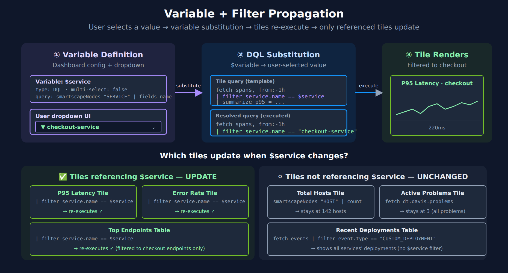

# DASH-06: Variables and Filters

> **Series:** DASH — Dashboard Design & Building | **Notebook:** 6 of 7 | **Created:** March 2026 | **Last Updated:** 10/01/2026

## Overview

Variables transform a static dashboard into a dynamic, reusable tool. Instead of building separate dashboards for each service, environment, or team, a single template dashboard with variables can serve everyone. This notebook covers variable types in Dynatrace dashboards, filter propagation across tiles, variable-driven DQL queries, DQL-populated dropdowns for services and hosts, and strategies for building template dashboards that work across environments.

---

## Table of Contents

1. [Variable Types](#variable-types)
2. [Service and Host Variables (DQL Type)](#entity-selector-variables)
3. [List and Free-Text Variables](#string-variables)
4. [Variable-Driven DQL Queries](#variable-driven-queries)
5. [Filter Propagation](#filter-propagation)
6. [Template Dashboard Patterns](#template-patterns)
7. [Building Deep Links from Variables](#deep-links)
8. [Summary and Next Steps](#summary-and-next-steps)

---

## Prerequisites

| Requirement | Details |
|-------------|----------|
| **Dynatrace Environment** | Dynatrace SaaS with Grail — the Dashboards app and DQL are not available on Dynatrace Managed, which keeps classic dashboards |
| **Permissions** | `storage:logs:read`, `storage:metrics:read`, `storage:spans:read`, `storage:entities:read` |
| **Dashboard Access** | `document:documents:write` for creating dashboards with variables |
| **Prior Reading** | DASH-01 through DASH-05 |

<a id="variable-types"></a>

## 1. Variable Types

> **Variables gain a separate display name and key (SaaS 1.346 — staged rollout from 08/25/2026).** A variable now carries two fields: a **Name**, the human-readable label shown in the UI with no symbol restrictions, and a **Key**, the code identifier used in DQL. Keys are auto-generated from names, and **existing variables migrate automatically — no manual action**. The rule that matters for everything below: **DQL references the key, not the name.** So `$myVar` in a query continues to resolve against the key, and renaming a variable for readability no longer breaks the queries that use it — which is precisely the coupling that made variable names awkward before. Until 1.346 reaches your tenant, name and identifier remain the same single field.

The Dashboards app has four variable types:

| Variable Type | Values come from | Typical use |
|--------------|------------------|-------------|
| **DQL** | A DQL query that runs when you define the variable | Service, host and namespace lists — this is how you build the entity dropdowns that classic dashboards called entity selectors (§2) |
| **List** | A comma-separated list of values you type | Fixed sets: environments, log levels |
| **Free text** | Whatever the viewer types, with an optional default | Search strings, IDs |
| **Code** | A JavaScript function you enter | Values from an API, or computed lists |

There is no entity-selector type and no time-range variable: the timeframe is the dashboard's own selector, not a variable.

### Variable Naming Conventions

| Convention | Example | Notes |
|-----------|---------|-------|
| Descriptive name | `$service`, `$environment` | Immediately clear what it filters |
| Prefix by source | `$dql_services`, `$list_env` | Useful in complex dashboards |
| Lowercase with underscores | `$k8s_namespace` | Consistent, readable in queries |

> **Important:** DQL references the variable's **key**, not its display name. Dynatrace derives the key from the name by replacing every character that is not a letter or a number with `_`. Use the same key in every tile that should respond to the variable.

> <sub>**Sources:** [Dashboard variables (DT docs)](https://docs.dynatrace.com/docs/analyze-explore-automate/dashboards-and-notebooks/dashboards-new/components/dashboard-component-variable) — DQL: *"the value is returned from a query you enter when you define the variable"*; List: *"a comma-separated values (CSV) list of values"*; key: *"Dynatrace derives a key from the name by replacing any character that isn't a letter or a number with `_`."*</sub>

> **Update (April 2026): Variables can drive dynamic coloring.** Dashboard variables now feed into tile coloring and threshold conditions, not just query filters. A single template can apply different color thresholds per selected environment or team — for example, a stricter "red above 2%" error threshold in prod versus a looser one in dev — by referencing the variable in the tile's color rules. This keeps visual rules in sync with the variable selection instead of hard-coding one threshold for all contexts.

<a id="entity-selector-variables"></a>

## 2. Service and Host Variables (DQL Type)

A dropdown of services or hosts is the most common variable. In the Dashboards app it is a **DQL variable** whose query returns the entities — over `smartscapeNodes` or `dt.entity.*` — as the two queries below do.

### Common Service and Host Variables

| Variable | Query over | Dashboard Use |
|----------|------------|---------------|
| `$host` | `dt.entity.host` | Filter infrastructure metrics to a specific host |
| `$service` | `dt.entity.service` | Filter spans and service metrics |
| `$process_group` | `dt.entity.process_group` | Filter process-level metrics |
| `$k8s_cluster` | `dt.entity.kubernetes_cluster` | Filter K8s workloads |

### Querying Available Entities for Variable Population

```dql
// List all services — useful for populating a service variable
fetch dt.entity.service
| fieldsKeep id, entity.name
| sort entity.name asc

// Smartscape equivalent (dt.entity.* is deprecated but still functional):
//   smartscapeNodes "SERVICE"
//   | fieldsKeep id, name
//   | sort name asc
// Caveat: Smartscape reflects CURRENT live topology and can report fewer entities than
// the classic entity store; for a pre-migration inventory keep the classic query above.
```

### Querying Hosts for Variable Population

```dql
// List all hosts — useful for populating a host variable
fetch dt.entity.host
| fieldsKeep id, entity.name
| sort entity.name asc

// Smartscape equivalent (dt.entity.* is deprecated but still functional):
//   smartscapeNodes "HOST"
//   | fieldsKeep id, name
//   | sort name asc
// Caveat: Smartscape reflects CURRENT live topology and can report fewer entities than
// the classic entity store; for a pre-migration inventory keep the classic query above.
```

<a id="string-variables"></a>

## 3. List and Free-Text Variables

A **List** variable offers a fixed set of values you type as a comma-separated list; a **Free text** variable takes whatever the viewer types. Both suit attributes like environment, namespace, or log level. When the set changes often, make it a DQL variable instead, using a discovery query like the ones below.

### Discovering Available Values

Before creating a List variable, query the data to discover what values exist.

```dql
// Discover Kubernetes namespaces for variable options
fetch logs, from:-1h
| filter isNotNull(k8s.namespace.name)
| summarize log_count = count(), by:{k8s.namespace.name}
| sort log_count desc
```

```dql
// Discover log levels for variable options
fetch logs, from:-1h
| summarize log_count = count(), by:{loglevel}
| sort log_count desc
```

### Discovering Available Database Systems

```dql
// Discover database systems for variable options
fetch spans, from:-1h
| filter span.kind == "client" and isNotNull(db.system)
| summarize query_count = count(), by:{db.system}
| sort query_count desc
```

<a id="variable-driven-queries"></a>

## 4. Variable-Driven DQL Queries

Once variables are defined on a dashboard, reference them in tile DQL queries using the `$key` syntax.

> **Do not put quotes around the variable.** By default the value is substituted already wrapped in double quotes — *"the variable value is wrapped in doublequote"* characters — so `== $service` is right and `== "$service"` produces `""checkout-service""`, which matches nothing. The variables page documents other substitution strategies for when you need the raw value.
>
> <sub>**Sources:** [Dashboard variables (DT docs)](https://docs.dynatrace.com/docs/analyze-explore-automate/dashboards-and-notebooks/dashboards-new/components/dashboard-component-variable)</sub>

### Patterns for Using Variables in DQL

| Pattern | DQL Example | Notes |
|---------|-------------|-------|
| Entity filter | `filter dt.entity.host == $host` | DQL variable returning host IDs |
| String filter | `filter k8s.namespace.name == $namespace` | List or Free-text variable |
| Pattern match | `filter k8s.namespace.name ~ $namespace_pattern` | Wildcard string variable |
| Multi-select | `filter in(loglevel, array($log_levels))` | Multi-select variable — the documented form wraps it in `array()` |

### Example: Service Latency Filtered by Variable

In a dashboard tile, this query would use the `$service` variable. In a notebook, we use a concrete value to demonstrate the pattern.

```dql
// Service latency filtered by entity — dashboard would use $service variable
//
// Corrected 08/12/2026: `makeTimeseries` takes a BARE aggregation — dividing inside it
// (`percentile(duration, 50) / 1ms`) fails with "the parameter has to be an expression-based
// timeseries aggregation". Aggregate first, convert afterwards in `fieldsAdd`. Note the unit
// conversion also changes: makeTimeseries yields a numeric array in NANOSECONDS, not a duration,
// so `/ 1ms` silently yields null on the array — divide by 1000000.0 instead.
// In a dashboard tile the filter becomes: filter dt.entity.service == $service
fetch spans, from:-1h
| filter span.kind == "server"
| filter isNotNull(dt.entity.service)
| makeTimeseries p50 = percentile(duration, 50), p95 = percentile(duration, 95), interval:5m, by:{dt.entity.service}
| fieldsAdd p50_ms = p50[] / 1000000.0, p95_ms = p95[] / 1000000.0
| fieldsRemove p50, p95
```

### Example: Log Analysis with Namespace and Level Variables

```dql
// Log analysis — dashboard would use $namespace and $loglevel variables
// In a dashboard tile: filter k8s.namespace.name == $namespace and loglevel == $loglevel
fetch logs, from:-1h
| filter isNotNull(k8s.namespace.name)
| filterOut loglevel == "NONE"
| makeTimeseries log_count = count(), interval:5m, by:{k8s.namespace.name, loglevel}
```

### Example: Metrics with Host Variable

```dql
// CPU and memory for selected host — dashboard would use $host variable
// In a dashboard tile: filter:dt.entity.host == $host
timeseries avg_cpu = avg(dt.host.cpu.usage), from:-2h, by:{dt.entity.host}
| fieldsAdd avg_cpu_val = arrayAvg(avg_cpu)
| sort avg_cpu_val desc
| limit 5
```

<a id="filter-propagation"></a>

## 5. Filter Propagation


<!-- MARKDOWN_TABLE_ALTERNATIVE
| Step | What happens |
|------|--------------|
| 1. Variable definition | Dashboard config defines $service with a query-based dropdown |
| 2. User selects value | "checkout-service" picked from dropdown |
| 3. DQL substitution | `| filter service.name == $service` becomes `| filter service.name == "checkout-service"` in tile queries (the substitution adds the quotes) |
| 4. Tiles re-execute | Tiles referencing $service re-run; tiles not referencing it stay unchanged |
Tiles that reference $service: P95 Latency, Error Rate, Top Endpoints (all update). Tiles that don't: Total Hosts, Active Problems, Recent Deployments (unchanged).
For environments where SVG doesn't render
-->

Filter propagation ensures that when a user selects a variable value, all relevant tiles update simultaneously.

### How Filter Propagation Works

1. User selects a value from the variable dropdown (e.g., selects a specific service)
2. All tiles that reference `$service` in their query re-execute with the new filter
3. Tiles that do not reference the variable remain unchanged

### Best Practices for Filter Propagation

| Practice | Description |
|----------|-------------|
| **Use the same variable name in all related tiles** | Ensures consistent filtering across the dashboard |
| **Document which tiles respond to which variables** | Add a markdown tile listing variable-tile mappings |
| **Provide an "All" option** | Let users remove the filter to see aggregate data |
| **Test with extreme values** | Select the busiest and quietest entities to verify layout holds |
| **Chain variables** | Use one variable's value to filter another variable's options |

### Variable Chaining Pattern

For hierarchical filtering (e.g., select a cluster, then see only namespaces in that cluster), use DQL variables where the second variable's query references the first.

```dql
// Namespaces filtered by cluster — would be a DQL variable
// In variable config: references $cluster variable
fetch logs, from:-1h
| filter isNotNull(k8s.namespace.name) and isNotNull(k8s.cluster.name)
| summarize log_count = count(), by:{k8s.cluster.name, k8s.namespace.name}
| sort k8s.cluster.name asc, log_count desc
```

<a id="template-patterns"></a>

## 6. Template Dashboard Patterns

Template dashboards use variables so aggressively that a single dashboard serves multiple teams or environments.

### Pattern 1: Multi-Environment Dashboard

A single dashboard with an `$environment` variable (prod, staging, dev) that filters all tiles.

| Variable | Values | Applied To |
|----------|--------|------------|
| `$environment` | prod, staging, dev | Namespace filter, host group filter |
| `$service` | (DQL variable) | Service-specific tiles |

Leave the time window to the dashboard's own timeframe selector — it is not a variable.

### Pattern 2: Team-Owned Service Dashboard

Each team uses the same template but selects their services.

| Variable | Source | Notes |
|----------|--------|-------|
| `$team_services` | DQL: services tagged with team name | Multi-select DQL variable |
| `$severity` | List: ERROR, WARN, INFO | Log level filter |

### Discovering Tags for Team-Based Variables

```dql
// Discover service tags — useful for building team-based variables
fetch dt.entity.service
| expand tags
| summarize service_count = count(), by:{tags}
| sort service_count desc
| limit 20

// Smartscape note (dt.entity.* is deprecated but still functional): this query analyzes entity
// tags, which are not a flat "tags" field on Smartscape nodes (resolve via getNodeField). Keep
// the classic query above for tag analysis.
```

### Pattern 3: Golden Signals Template

A template dashboard that displays the four golden signals (latency, traffic, errors, saturation) for any selected service.

| Section | Query Pattern | Chart Type |
|---------|--------------|------------|
| **Latency** | `percentile(duration, 95)` filtered by `$service` | Line chart |
| **Traffic** | `count()` of server spans filtered by `$service` | Line chart |
| **Errors** | `countIf(span.status_code == "error")` filtered by `$service` | Line chart |
| **Saturation** | CPU/memory metrics for the service's host | Line chart |

This pattern is especially powerful because it works for every service in the environment — engineers just change the variable.

<a id="deep-links"></a>

## 7. Building Deep Links from Variables

Variable chaining (§5) exists to parameterize something. The most useful thing to parameterize is often not another query — it is a **URL**. A dashboard that already knows which release the reader selected can hand them a one-click jump to the issue tracker view for exactly that release, with no connector, no stored credential, and no Dynatrace-side state.

This is a **dashboard recipe, not an integration**. Every mechanic below is a dashboard mechanic: a DQL variable query, a `smartscapeNodes` base query, `concat()` to assemble a string, and one column setting to make it clickable. Nothing authenticates to the target tool, and nothing is written anywhere.

### Prerequisite: release-identifying process tags

The recipe needs three process tags carrying the release identity:

| Tag | Holds | Example |
|-----|-------|---------|
| `DT_RELEASE_PRODUCT` | The product / component name | `easytrade` |
| `DT_RELEASE_VERSION` | The release version | `1.5.2` |
| `DT_RELEASE_STAGE` | The deployment stage | `production` |

**Values must be slug-safe** — the whole point is that they end up inside a URL. Spaces, quotes, `#`, `&`, and `?` all break the link or silently truncate it. Constrain the values at the source (lowercase, hyphens, dots only) rather than repairing them in DQL.

Setting these tags is process-metadata tagging, not a dashboard concern — see **FAQ-02** for the tagging mechanics and the sources Dynatrace reads them from. Without them, this section has nothing to parameterize and you should stop here.

### Step 1: Populate the release variable

The variable dropdown should list each release **once**. A `smartscapeNodes "PROCESS"` query returns one row per process, so ten processes running `easytrade 1.5.2` would produce ten identical dropdown entries — deduplicate by product × version:

```dql
// Release variable source — one entry per product x version, deduplicated
smartscapeNodes "PROCESS"
| fieldsAdd product = tags[DT_RELEASE_PRODUCT], version = tags[DT_RELEASE_VERSION]
| filter isNotNull(product) and isNotNull(version)
| dedup {product, version}
| fieldsAdd release = concat(product, " ", version)
| fields release
| sort release asc

```

Note the tag-access syntax: on a `smartscapeNodes` result, `tags` is a map, and map keys are read with **unquoted** bracket identifiers — `tags[DT_RELEASE_PRODUCT]`, not `tags["DT_RELEASE_PRODUCT"]`. The quoted form is a parse error.

### Step 2: Assemble the URL with `concat()`

`concat()` builds the target URL from the selected variable values. Two rules make it survive contact with real data:

- **Wrap any component that came from a tag in `encodeUrl()`.** Even with slug-safe tag values, a query string separator (`=`, `&`, a space in a JQL clause) has to be percent-encoded or the target tool receives a truncated parameter.
- **Build the query expression first, then encode it as a unit.** Below, the JQL is assembled in one `fieldsAdd` and encoded in the next. Encoding piecemeal double-encodes the separators.

### Step 3: Make it clickable with the Markdown column type

`concat()` produces a *string*. A table tile renders a string as text — the reader sees the URL but cannot click it. Set the column's type to **Markdown** in the tile's column settings, and emit markdown link syntax (`[label](url)`) from the query. The tile then renders a live anchor.

This is the mechanic that makes the whole recipe work, and it is reusable well beyond issue tracking — any query that can compute a URL can present it as a link:

```dql
// Per-release deep link into the issue tracker — Markdown column type on `issues`
smartscapeNodes "PROCESS"
| fieldsAdd stage = tags[DT_RELEASE_STAGE],
            product = tags[DT_RELEASE_PRODUCT],
            version = tags[DT_RELEASE_VERSION]
| filter isNotNull(product) and isNotNull(version)
| summarize processes = count(), by:{stage, product, version}
| fieldsAdd jql = concat("project = ", upper(product), " AND fixVersion = ", version)
| fieldsAdd issues = concat("[Open issues in Jira](https://your-org.atlassian.net/issues/?jql=", encodeUrl(jql), ")")
| fields stage, product, version, processes, issues
| sort product asc, version desc

```

Swap the URL pattern for the tool you run — the DQL shape does not change:

| Tool | URL pattern |
|------|-------------|
| Jira Cloud / on-premises | `https://<host>/issues/?jql=<encoded JQL>` |
| GitHub | `https://github.com/<org>/<repo>/releases/tag/v<version>` |
| GitLab | `https://gitlab.com/<group>/<project>/-/releases/v<version>` |
| ServiceNow | `https://<instance>.service-now.com/change_request_list.do?sysparm_query=<encoded query>` |

### Why a Deep Link Beats a Credentialed Integration Here

For a read-only jump *out of* Dynatrace, a deep link is the better engineering choice, not merely the easier one:

| | Deep link | Credentialed connector |
|---|---|---|
| Credentials stored in Dynatrace | None | Token or OAuth app, with rotation |
| Works against on-premises targets | Yes — it is just a URL | Often requires network egress or an EdgeConnect path |
| Per-tool setup cost | One URL pattern | Connector config, auth, field mapping |
| Breaks when the target's API version changes | No | Possibly |
| Authorization model | The reader's own SSO session in the target tool | A service identity shared by all readers |

That last row is the substantive one: a deep link inherits the reader's own permissions in the target tool. A user with no Jira access lands on Jira's login or permission page rather than seeing data a shared service account could read.

**Reach for a real connector when you need to *write*** — open a ticket, transition an issue, post a comment — **or to read data *into* Dynatrace** so it can be queried, alerted on, or joined. Both are jobs a URL cannot do. Anything that ends with "…and then the human looks at it in the other tool" is a deep link.

### Guardrails

| Guardrail | Why |
|-----------|-----|
| **Constrain tag values to slug-safe characters** | Spaces, quotes, and `& ? #` break URLs. Fix at the tagging source; `encodeUrl()` is the second line of defence, not the first. |
| **Deduplicate the base query** | One row per process means one dropdown entry per process. Dedup by product × version so each release appears once. |
| **Handle the missing-tag case explicitly** | `filter isNotNull(...)` keeps untagged processes out. Without it, rows render links with `null` spliced into the URL. |
| **Author in the UI, then validate before committing** | See below — this is the one that bites. |

**On that last guardrail.** Build and test this tile in the UI, clicking the link to confirm it lands where you expect. The moment you round-trip the dashboard through `dynatrace_document` or Monaco, it *becomes* an API-authored dashboard and falls under the validation gate in **DASH-07 §5** — and the `concat()` URL patterns are the most edit-prone part of the payload, because they are long single-line strings that reviewers skim. Since SaaS 1.344 — with stricter rules again in SaaS 1.346 — a dashboard that fails validation does not load at all (confirm which version your tenant runs), so a payload edited by hand and merged unvalidated takes the whole dashboard down, not just the link column.

A tag prerequisite that is only half-populated is the other common failure: the tile renders, the dropdown looks right, and links exist for the two products someone remembered to tag. Audit tag coverage across the estate before treating the dropdown as a complete release list.

<a id="summary-and-next-steps"></a>

## 8. Summary and Next Steps

In this notebook you learned:

- The four variable types available in Dynatrace dashboards
- How to build DQL, List and Free-text variables — including service and host dropdowns
- DQL patterns for referencing variables in tile queries
- Filter propagation mechanics and best practices
- Template dashboard patterns: multi-environment, team-owned, and golden signals
- How to turn variable values into clickable deep links with `concat()` and the Markdown column type

**Next:** In **DASH-07: Sharing and Reporting**, we cover dashboard permissions, sharing with teams, scheduled reports via Workflows, dashboard-as-code, and version control patterns.

---

<sub>*This notebook was AI-generated from community-submitted and publicly available sources. This notebook series is not officially supported by Dynatrace. Always verify information against official Dynatrace documentation.*</sub>
