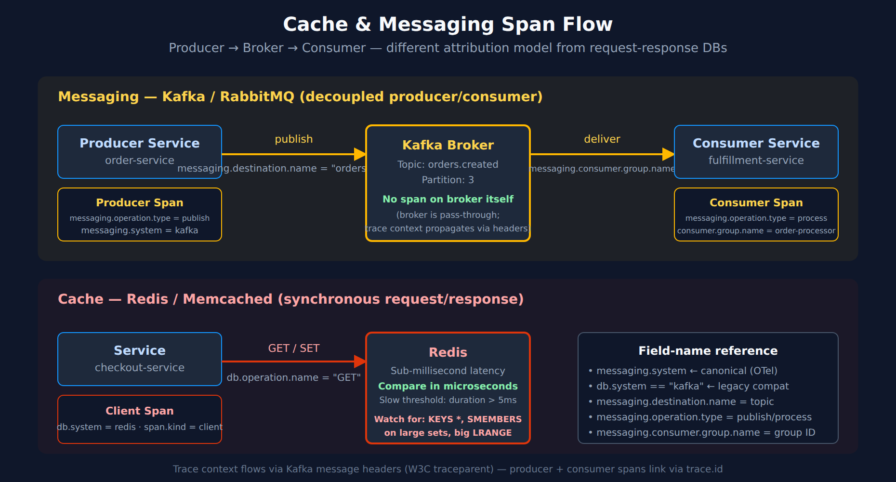

# DBMON-04: Cache and Messaging Monitoring

> **Series:** DBMON — Database Monitoring | **Notebook:** 4 of 7 | **Created:** March 2026 | **Last Updated:** 08/12/2026

## Overview

This notebook covers monitoring caches and message brokers with Dynatrace. Caches (Redis, Memcached) and message brokers (Kafka, RabbitMQ) are critical infrastructure components that behave differently from traditional databases. You will learn how to analyze Redis operation performance, Kafka consumer throughput, message broker queue health, and Elasticsearch query patterns using span data.

---

## Table of Contents

1. [Cache and Messaging Overview](#cache-messaging-overview)
2. [Redis Performance Analysis](#redis-analysis)
3. [Kafka Consumer and Producer Monitoring](#kafka-monitoring)
4. [RabbitMQ Queue Monitoring](#rabbitmq-monitoring)
5. [Elasticsearch Query Performance](#elasticsearch-monitoring)
6. [Cross-System Performance Dashboard](#cross-system-dashboard)
7. [Summary and Next Steps](#summary)

---

## Prerequisites

| Requirement | Details |
|-------------|---------|
| **Dynatrace Environment** | SaaS or Managed with Grail enabled |
| **OneAgent** | Deployed on application hosts using Redis, Kafka, RabbitMQ, or Elasticsearch |
| **Permissions** | `storage:spans:read`, `storage:metrics:read` |
| **Data** | Application traffic generating cache/messaging calls |
| **Prior Reading** | DBMON-01: Database Monitoring Fundamentals |

<a id="cache-messaging-overview"></a>

## 1. Cache and Messaging Overview

Caches and message brokers serve fundamentally different purposes from databases, but Dynatrace monitors them through the same span instrumentation framework.

| System | Category | `db.system` | Typical Latency | Key Concern |
|--------|----------|-------------|-----------------|-------------|
| Redis | In-Memory Cache/Store | `redis` | <1ms | Memory pressure, eviction rate |
| Memcached | In-Memory Cache | `memcached` | <1ms | Hit ratio, eviction |
| Kafka | Distributed Streaming | `kafka` | 1-50ms | Consumer lag, partition balance |
| RabbitMQ | Message Broker | `rabbitmq` | 1-10ms | Queue depth, consumer throughput |
| Elasticsearch | Search Engine | `elasticsearch` | 5-500ms | Query latency, indexing throughput |

> **Note:** Cache and messaging systems often have sub-millisecond latency. Even small increases in response time can indicate significant issues (memory pressure, network problems, or hot keys).


<!-- MARKDOWN_TABLE_ALTERNATIVE
| Layer | Producer span | Broker | Consumer span |
|-------|---------------|--------|---------------|
| Messaging (Kafka/RabbitMQ) | messaging.operation = publish | No span on broker; trace context flows via headers | messaging.operation = process; consumer.group |
| Cache (Redis/Memcached) | db.system = redis; span.kind = client; db.operation = GET/SET | Sub-millisecond responses; compare in microseconds; slow > 5ms | (request-response, no separate consumer) |
Note: messaging.system is canonical OTel; db.system == "kafka" is legacy compat
For environments where SVG doesn't render
-->

```dql
// Discover active cache and messaging systems
fetch spans, from:-1h
| filter in(db.system, {"redis", "memcached", "kafka", "rabbitmq", "elasticsearch", "opensearch"})
| summarize {
    call_count = count(),
    avg_us = avg(duration) / 1000.0,
    p95_us = percentile(duration, 95) / 1000.0
}, by:{db.system, server.address}
| sort call_count desc
```

<a id="redis-analysis"></a>

## 2. Redis Performance Analysis

Redis is the most commonly used in-memory data store. Monitoring Redis involves tracking operation types (GET, SET, DEL, HGET, etc.), latency distribution, and error rates. Since Redis operations should complete in microseconds, even small latency increases warrant investigation.

```dql
// Field names corrected 08/12/2026 — pre-1.0 OpenTelemetry database semconv names had been
// used throughout, and every one of them is null on Grail spans. They fail SILENTLY: a filter on a
// non-existent field matches nothing and a summarize groups everything under null, so these cells
// returned empty or single-null-group results without ever erroring.
//   db.operation         -> db.operation.name    (stable; set on 50,379 of 57,295 db spans)
//   db.statement         -> db.query.text        (stable; 33,463)
//   db.mongodb.collection-> db.collection.name   (stable; 6,912)
//   db.name              -> db.namespace         (stable; 57,281)
// Confirm the catalog for your tenant with:
//   fetch dt.semantic_dictionary.fields | filter startsWith(name, "db.") | fields name, stability
// Redis operation breakdown — which commands are most used?
fetch spans, from:-1h
| filter db.system == "redis"
| filter isNotNull(db.operation.name)
| summarize {
    call_count = count(),
    avg_us = avg(duration) / 1000.0,
    p95_us = percentile(duration, 95) / 1000.0,
    max_us = max(duration) / 1000.0
}, by:{db.operation.name}
| sort call_count desc
```

```dql
// Redis GET vs SET ratio — understand cache read/write balance
fetch spans, from:-1h
| filter db.system == "redis"
| filter isNotNull(db.operation.name)
| fieldsAdd op_type = if(
    in(db.operation.name, {"GET", "MGET", "HGET", "HGETALL", "LRANGE", "SMEMBERS", "ZRANGE"}),
    then:"READ",
    else:if(
      in(db.operation.name, {"SET", "MSET", "HSET", "LPUSH", "RPUSH", "SADD", "ZADD", "DEL"}),
      then:"WRITE",
      else:"OTHER"))
| summarize op_count = count(), by:{op_type}
| sort op_count desc
```

```dql
// Redis latency over time — detect performance degradation
fetch spans, from:-6h
| filter db.system == "redis"
| makeTimeseries avg_us = avg(duration / 1us),
                 p95_us = percentile(duration / 1us, 95),
                 call_count = count(),
                 interval:5m
```

```dql
// Redis slow commands — operations exceeding 5ms (abnormal for Redis)
fetch spans, from:-1h
| filter db.system == "redis"
| filter duration > 5ms
| fields timestamp, db.operation.name, db.query.text, server.address,
        duration_ms = duration / 1ms, dt.entity.service
| sort duration_ms desc
| limit 20
```

> **Tip:** Redis commands like `KEYS *`, `SMEMBERS` on large sets, or `LRANGE` with large ranges are known to cause latency spikes. If you see slow operations, check if the command is operating on a large data structure.

<a id="kafka-monitoring"></a>

## 3. Kafka Consumer and Producer Monitoring

Apache Kafka monitoring through spans captures both producer (publish) and consumer (process) operations. Dynatrace instruments Kafka client libraries to provide visibility into message throughput, processing latency, and consumer group health.

### Kafka Span Attributes

Per the OTel semantic conventions, **`messaging.system`** is the canonical field for Kafka and other message brokers — not `db.system`. Older OneAgent/legacy instrumentation may set `db.system == "kafka"` for backward compatibility; queries below filter both for hybrid-tenant compatibility, but new instrumentation should rely on `messaging.system` only.

| Attribute | Description | Example |
|-----------|-------------|---------|
| `messaging.system` | Always `kafka` (canonical OTel field) | `kafka` |
| `messaging.operation` | `publish` or `process` | `process` |
| `messaging.destination.name` | Topic name | `orders.created` |
| `messaging.kafka.consumer.group` | Consumer group ID | `order-processor-group` |
| `messaging.kafka.destination.partition` | Partition number | `3` |

```dql
// Kafka message throughput by topic — producer and consumer activity
fetch spans, from:-1h
| filter db.system == "kafka" or messaging.system == "kafka"
| filter isNotNull(messaging.destination.name)
| summarize {
    msg_count = count(),
    avg_ms = avg(duration) / 1ms
}, by:{messaging.destination.name, messaging.operation}
| sort msg_count desc
```

```dql
// Kafka consumer processing time over time by topic
fetch spans, from:-6h
| filter messaging.system == "kafka" and messaging.operation == "process"
| filter isNotNull(messaging.destination.name)
| makeTimeseries msg_count = count(),
                 avg_process_ms = avg(duration / 1ms),
                 by:{messaging.destination.name},
                 interval:5m
```

```dql
// Kafka consumer group analysis — processing latency by consumer group
fetch spans, from:-1h
| filter messaging.system == "kafka" and messaging.operation == "process"
| filter isNotNull(messaging.kafka.consumer.group)
| summarize {
    msg_count = count(),
    avg_ms = avg(duration) / 1ms,
    p95_ms = percentile(duration, 95) / 1ms,
    errors = countIf(span.status_code == "error")
}, by:{messaging.kafka.consumer.group, messaging.destination.name}
| sort msg_count desc
```

<a id="rabbitmq-monitoring"></a>

## 4. RabbitMQ Queue Monitoring

RabbitMQ monitoring focuses on message publish/consume rates, queue depth, and consumer processing latency. High queue depth with low consumer throughput indicates backpressure.

```dql
// RabbitMQ message flow by queue
fetch spans, from:-1h
| filter db.system == "rabbitmq" or messaging.system == "rabbitmq"
| filter isNotNull(messaging.destination.name)
| summarize {
    msg_count = count(),
    avg_ms = avg(duration) / 1ms,
    errors = countIf(span.status_code == "error")
}, by:{messaging.destination.name, messaging.operation}
| sort msg_count desc
```

```dql
// RabbitMQ message throughput trend
fetch spans, from:-6h
| filter messaging.system == "rabbitmq"
| filter isNotNull(messaging.destination.name)
| makeTimeseries msg_count = count(), by:{messaging.operation}, interval:5m
```

<a id="elasticsearch-monitoring"></a>

## 5. Elasticsearch Query Performance

Elasticsearch is used for full-text search, log aggregation, and analytics. Monitoring focuses on query latency, indexing throughput, and identifying expensive search operations.

```dql
// Elasticsearch operation breakdown
fetch spans, from:-1h
| filter in(db.system, {"elasticsearch", "opensearch"})
| filter isNotNull(db.operation.name)
| summarize {
    call_count = count(),
    avg_ms = avg(duration) / 1ms,
    p95_ms = percentile(duration, 95) / 1ms
}, by:{db.system, db.operation.name}
| sort call_count desc
```

```dql
// Elasticsearch slow queries — search operations exceeding 200ms
fetch spans, from:-1h
| filter in(db.system, {"elasticsearch", "opensearch"})
| filter duration > 200ms
| fields timestamp, db.operation.name, db.query.text, server.address,
        duration_ms = duration / 1ms
| sort duration_ms desc
| limit 15
```

<a id="cross-system-dashboard"></a>

## 6. Cross-System Performance Dashboard

Combining all cache and messaging systems into a single view provides a quick health check across your data infrastructure.

```dql
// Unified performance summary — all cache and messaging systems
fetch spans, from:-1h
| filter in(db.system, {"redis", "memcached", "kafka", "rabbitmq", "elasticsearch", "opensearch"})
        or in(messaging.system, {"kafka", "rabbitmq"})
| fieldsAdd system = coalesce(db.system, messaging.system)
| summarize {
    total_ops = count(),
    avg_ms = avg(duration) / 1ms,
    p95_ms = percentile(duration, 95) / 1ms,
    error_count = countIf(span.status_code == "error")
}, by:{system}
| fieldsAdd error_rate_pct = round((toDouble(error_count) / toDouble(total_ops)) * 100, decimals:2)
| sort total_ops desc
```

<a id="summary"></a>

## 7. Summary and Next Steps

In this notebook you learned:

- Redis operation analysis: command breakdown, read/write ratios, and slow command detection
- Kafka monitoring: producer/consumer throughput, consumer group latency, and topic-level analysis (with canonical `messaging.system` and backward-compat `db.system == "kafka"`)
- RabbitMQ queue monitoring: publish/consume rates and message flow
- Elasticsearch query performance: operation breakdown and slow query detection
- Cross-system performance comparison for cache and messaging infrastructure

### Next Steps

- **DBMON-05: Query Analysis** — Deep query analysis including N+1 detection and optimization patterns
- **DBMON-06: Dashboards and Alerting** — Building database monitoring dashboards and alerting rules

### Where to Go Deeper

- **OTEL series** (9 notebooks) — OTel-instrumented Kafka/RabbitMQ producers and consumers, semantic-convention reference
- **OPIPE series** (7 notebooks) — OpenPipeline-derived metrics from messaging spans (e.g., per-topic throughput as a metric)
- **OPLOGS series** — When Elasticsearch is used as a log destination upstream of Dynatrace
- **AIOPS series** — Davis anomaly detection on consumer-lag and broker-health metrics

---

<sub>*This notebook was AI-generated from community-submitted and publicly available sources. This notebook series is not officially supported by Dynatrace. Always verify information against official Dynatrace documentation.*</sub>
