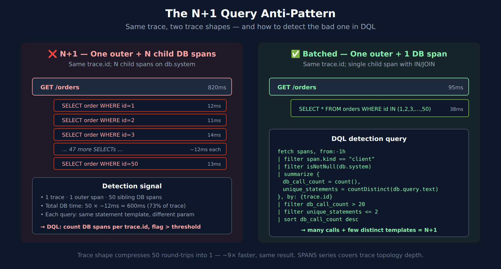

# DBMON-05: Query Analysis

> **Series:** DBMON — Database Monitoring | **Notebook:** 5 of 7 | **Created:** March 2026 | **Last Updated:** 08/27/2026

## Overview

This notebook provides deep query analysis techniques for identifying database performance problems. You will learn how to detect N+1 query anti-patterns, analyze query frequency and duration distributions, identify queries that may lack proper indexes, detect connection pool exhaustion, and use query normalization for effective grouping. These techniques apply across all database technologies.

---

## Table of Contents

1. [N+1 Query Detection](#n-plus-one-detection)
2. [Query Frequency Analysis](#query-frequency-analysis)
3. [Duration Distribution Analysis](#duration-distribution)
4. [Missing Index Detection](#missing-index-detection)
5. [Connection Pool Analysis](#connection-pool-analysis)
6. [Query Normalization and Grouping](#query-normalization)
7. [Optimization Prioritization](#optimization-prioritization)
8. [Summary and Next Steps](#summary)

---

## Prerequisites

| Requirement | Details |
|-------------|---------|
| **Dynatrace Environment** | SaaS or Managed with Grail enabled |
| **OneAgent** | Deployed on application hosts with database clients |
| **Permissions** | `storage:spans:read` |
| **Data** | Significant application traffic with diverse database query patterns |
| **Prior Reading** | DBMON-01 through DBMON-03 for database monitoring context |

<a id="n-plus-one-detection"></a>

## 1. N+1 Query Detection

The N+1 query problem occurs when an application executes one query to fetch a list of items, then executes N additional queries to fetch related data for each item. This is the most common database anti-pattern and can cause severe performance degradation.

### Detection Strategy

N+1 patterns have these characteristics:
- A single normalized query pattern is executed many times within a short window
- The queries share the same parent span (same HTTP request or transaction)
- Individual query execution times are fast, but total time is high due to volume

We detect this by looking for query patterns with unusually high call counts per trace.


<!-- MARKDOWN_TABLE_ALTERNATIVE
| Pattern | Trace shape | Total time | DQL detection |
|---------|-------------|------------|---------------|
| ❌ N+1 (bad) | 1 outer span + N child DB spans (same statement template, different param) | 50 × ~12ms ≈ 600ms (73% of trace) | high db_call_count + low countDistinct(db.statement) per trace.id |
| ✅ Batched (good) | 1 outer span + 1 batched DB span (SELECT ... WHERE id IN (...)) | ~38ms | single span per trace |
For environments where SVG doesn't render
-->

*In community practice the thresholds in this notebook are the values teams converge on as starting points — Dynatrace publishes none of them. Treat each as a first guess to tune against your own baseline, not a recommended setting.*

```dql
// Field names corrected 08/12/2026 — pre-1.0 OpenTelemetry database semconv names had been
// used throughout, and every one of them is null on Grail spans. They fail SILENTLY: a filter on a
// non-existent field matches nothing and a summarize groups everything under null, so these cells
// returned empty or single-null-group results without ever erroring.
//   db.operation         -> db.operation.name    (stable; set on 50,379 of 57,295 db spans)
//   db.statement         -> db.query.text        (stable; 33,463)
//   db.mongodb.collection-> db.collection.name   (stable; 6,912)
//   db.name              -> db.namespace         (stable; 57,281)
// Confirm the catalog for your tenant with:
//   fetch dt.semantic_dictionary.fields | filter startsWith(name, "db.") | fields name, stability
// Detect N+1 patterns — query patterns with high repetition per trace
fetch spans, from:-1h
| filter isNotNull(db.system) and isNotNull(db.query.text)
| summarize {
    calls_per_trace = count(),
    total_ms = sum(duration) / 1ms,
    avg_ms = avg(duration) / 1ms
}, by:{trace.id, db.query.text, db.system}
| filter calls_per_trace >= 10
| sort calls_per_trace desc
| limit 25
```

The query above shows query patterns that are repeated 10 or more times within a single trace. A high `calls_per_trace` value (especially 50+) strongly suggests an N+1 pattern.

> **Tip:** Focus on patterns where `avg_ms` is low but `total_ms` is high. This indicates many fast individual queries that accumulate to a significant total. The fix is typically to replace N individual queries with a single batch query using `IN` clauses or joins.

```dql
// Aggregate N+1 candidates — which query patterns are most frequently repeated?
fetch spans, from:-1h
| filter isNotNull(db.system) and isNotNull(db.query.text)
| summarize calls_per_trace = count(), by:{trace.id, db.query.text, db.system}
| filter calls_per_trace >= 10
| summarize {
    affected_traces = count(),
    avg_calls_per_trace = avg(calls_per_trace),
    max_calls_per_trace = max(calls_per_trace)
}, by:{db.query.text, db.system}
| sort affected_traces desc
| limit 15
```

<a id="query-frequency-analysis"></a>

## 2. Query Frequency Analysis

Understanding which queries run most often helps prioritize optimization. A query that runs millions of times per hour has far more impact than a slow query that runs once a day.

```dql
// Top 20 most frequent queries — highest call volume
fetch spans, from:-1h
| filter isNotNull(db.system) and isNotNull(db.query.text)
| summarize {
    call_count = count(),
    total_time_ms = sum(duration) / 1ms,
    avg_ms = avg(duration) / 1ms,
    p95_ms = percentile(duration, 95) / 1ms
}, by:{db.query.text, db.system}
| sort call_count desc
| limit 20
```

```dql
// Query frequency trend — detect changing patterns over 6 hours
fetch spans, from:-6h
| filter isNotNull(db.system)
| makeTimeseries total_queries = count(),
                 unique_patterns = countDistinct(db.query.text),
                 interval:15m
```

```dql
// Queries called by the most services — shared queries are high-impact optimization targets
fetch spans, from:-1h
| filter isNotNull(db.system) and isNotNull(db.query.text)
| summarize {
    call_count = count(),
    calling_services = countDistinct(dt.entity.service),
    avg_ms = avg(duration) / 1ms
}, by:{db.query.text, db.system}
| filter calling_services >= 2
| sort calling_services desc
| limit 15
```

<a id="duration-distribution"></a>

## 3. Duration Distribution Analysis

Analyzing how query durations are distributed reveals bimodal patterns (e.g., cached vs uncached responses), tail latency problems, and outlier behavior.

```dql
// Duration percentile breakdown by database system
fetch spans, from:-1h
| filter isNotNull(db.system)
| summarize {
    p50_ms = percentile(duration, 50) / 1ms,
    p90_ms = percentile(duration, 90) / 1ms,
    p95_ms = percentile(duration, 95) / 1ms,
    p99_ms = percentile(duration, 99) / 1ms,
    max_ms = max(duration) / 1ms,
    total = count()
}, by:{db.system}
| fieldsAdd tail_ratio = round(p99_ms / p50_ms, decimals:1)
| sort total desc
```

The `tail_ratio` column shows how much worse the 99th percentile is compared to the median. A ratio above 10 suggests significant tail latency — a small percentage of queries take disproportionately long.

```dql
// Latency bucket distribution — visualize where queries cluster
fetch spans, from:-1h
| filter isNotNull(db.system)
| fieldsAdd duration_ms = duration / 1ms
| fieldsAdd bucket = if(duration_ms < 0.1, then:"<0.1ms",
    else:if(duration_ms < 1, then:"0.1-1ms",
    else:if(duration_ms < 10, then:"1-10ms",
    else:if(duration_ms < 100, then:"10-100ms",
    else:if(duration_ms < 1000, then:"100ms-1s",
    else:">1s")))))
| summarize query_count = count(), by:{db.system, bucket}
| sort db.system asc, bucket asc
```

<a id="missing-index-detection"></a>

## 4. Missing Index Detection

Queries that consistently have high latency and high call count may indicate missing database indexes. While Dynatrace cannot directly inspect index usage, we can identify candidates by correlating query patterns with performance characteristics.

### Heuristics for Missing Indexes

| Signal | What It Suggests |
|--------|------------------|
| SELECT with high avg latency and high volume | Table scan on frequently-read table |
| P95 >> P50 for the same query pattern | Some executions hit different data sizes |
| Query latency increasing over time | Table growing without proper indexing |
| High variance in execution time | Inconsistent query plans |

```dql
// Index candidate detection — high-volume queries with high latency and variance
fetch spans, from:-1h
| filter isNotNull(db.system) and isNotNull(db.query.text)
| filter isNotNull(db.operation.name) and db.operation.name == "SELECT"
| summarize {
    call_count = count(),
    avg_ms = avg(duration) / 1ms,
    p50_ms = percentile(duration, 50) / 1ms,
    p95_ms = percentile(duration, 95) / 1ms,
    stddev_ms = stddev(duration / 1ms)
}, by:{db.query.text, db.system}
| filter call_count >= 50 and avg_ms > 10
| fieldsAdd variance_ratio = round(stddev_ms / avg_ms, decimals:2)
| sort avg_ms desc
| limit 15
```

```dql
// Detect queries getting slower over time — potential index degradation
fetch spans, from:-24h
| filter isNotNull(db.system) and isNotNull(db.query.text)
| filter isNotNull(db.operation.name) and db.operation.name == "SELECT"
| makeTimeseries avg_ms = avg(duration / 1ms),
                 call_count = count(),
                 by:{db.system},
                 interval:1h
```

<a id="connection-pool-analysis"></a>

## 5. Connection Pool Analysis

Connection pool exhaustion causes application threads to wait for available connections, leading to increased response times and timeouts. We detect connection pressure through concurrency analysis and error pattern monitoring.

```dql
// Concurrent database calls per service — identify connection pressure
fetch spans, from:-1h
| filter isNotNull(db.system)
| summarize {
    concurrent_calls = count(),
    unique_db_targets = countDistinct(server.address),
    avg_ms = avg(duration) / 1ms
}, by:{dt.entity.service, db.system}
| fieldsAdd service_name = entityName(dt.entity.service, type:"dt.entity.service")
| sort concurrent_calls desc
| limit 20
```

```dql
// Database connection errors — timeout and connection refused patterns
fetch spans, from:-6h
| filter isNotNull(db.system) and span.status_code == "error"
| summarize error_count = count(),
           by:{db.system, server.address, span.status_message}
| sort error_count desc
| limit 20
```

```dql
// Database error rate trend — detect connection pool exhaustion episodes
fetch spans, from:-6h
| filter isNotNull(db.system)
| makeTimeseries total = count(),
                 errors = countIf(span.status_code == "error", default:0),
                 interval:5m
```

<a id="query-normalization"></a>

## 6. Query Normalization and Grouping

Dynatrace automatically normalizes SQL queries by replacing literal values with `?` placeholders. This allows grouping identical query patterns regardless of parameter values. Understanding normalization helps you interpret `db.statement` values correctly.

### Normalization Examples

| Original Query | Normalized (`db.statement`) |
|---------------|----------------------------|
| `SELECT * FROM users WHERE id = 42` | `SELECT * FROM users WHERE id = ?` |
| `INSERT INTO orders (id, amount) VALUES (1, 99.50)` | `INSERT INTO orders (id, amount) VALUES (?, ?)` |
| `UPDATE products SET stock = 5 WHERE sku = 'ABC123'` | `UPDATE products SET stock = ? WHERE sku = ?` |

```dql
// Query pattern diversity — how many unique normalized patterns per database?
fetch spans, from:-1h
| filter isNotNull(db.system) and isNotNull(db.query.text)
| summarize {
    unique_patterns = countDistinct(db.query.text),
    total_calls = count()
}, by:{db.system, db.namespace}
| fieldsAdd avg_calls_per_pattern = round(toDouble(total_calls) / toDouble(unique_patterns), decimals:1)
| sort total_calls desc
```

```dql
// Identify one-off queries — patterns called only once (may indicate dynamic SQL)
fetch spans, from:-1h
| filter isNotNull(db.system) and isNotNull(db.query.text)
| summarize call_count = count(), by:{db.query.text, db.system}
| filter call_count == 1
| summarize one_off_count = count(), by:{db.system}
| sort one_off_count desc
```

> **Warning:** A high number of one-off query patterns suggests dynamic SQL generation or poor query parameterization. This prevents the database from caching execution plans and can degrade performance significantly.

<a id="optimization-prioritization"></a>

## 7. Optimization Prioritization

Not all slow queries are worth optimizing. Use the **impact score** to prioritize: combine call frequency, average duration, and error rate into a single ranking.

```dql
// Query optimization priority — ranked by total time impact
fetch spans, from:-1h
| filter isNotNull(db.system) and isNotNull(db.query.text)
| summarize {
    call_count = count(),
    total_time_ms = sum(duration) / 1ms,
    avg_ms = avg(duration) / 1ms,
    p95_ms = percentile(duration, 95) / 1ms,
    error_count = countIf(span.status_code == "error")
}, by:{db.query.text, db.system}
| fieldsAdd error_rate_pct = round((toDouble(error_count) / toDouble(call_count)) * 100, decimals:2)
| sort total_time_ms desc
| limit 20
```

The `total_time_ms` column represents the cumulative time spent on each query pattern. Optimizing the top entries yields the greatest overall performance improvement.

| Priority | Criteria | Action |
|----------|----------|--------|
| **Critical** | High total time + high error rate | Fix errors first, then optimize |
| **High** | High total time + high call count + low avg | Likely N+1 — batch the queries |
| **Medium** | High total time + low call count + high avg | Likely missing index — add index |
| **Low** | Low total time regardless of avg | Minimal impact — defer optimization |

<a id="summary"></a>

## 8. Summary and Next Steps

In this notebook you learned:

- How to detect N+1 query anti-patterns using per-trace call count analysis
- Query frequency analysis to identify the most common database operations
- Duration distribution analysis to reveal tail latency and bimodal patterns
- Heuristic-based missing index detection using latency and variance metrics
- Connection pool pressure analysis through concurrency and error monitoring
- Query normalization concepts and one-off query detection
- Impact-based optimization prioritization

### Next Steps

- **DBMON-06: Dashboards and Alerting** — Build database monitoring dashboards and configure alerting rules

### Where to Go Deeper

- **SPANS series** (9 notebooks) — Span fundamentals, trace topology, parent/child span relationships (foundational for N+1 detection)
- **AIOPS series** (8 notebooks) — Davis anomaly detection on connection-pool exhaustion, slow-query rate, query-pattern shifts
- **WFLOW series** (10 notebooks) — Workflow-driven alert routing for DB-engineering teams
- **DASH series** (8 notebooks) — Impact-ranking dashboard tiles (rank queries by total impact, not average)

---

<sub>*This notebook was AI-generated from community-submitted and publicly available sources. This notebook series is not officially supported by Dynatrace. Always verify information against official Dynatrace documentation.*</sub>
