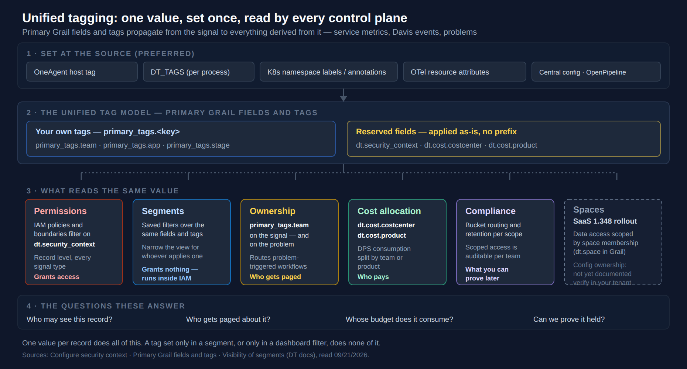

# FAQ-02: Tagging — Sources, Standards, and Strategy

> **Series:** FAQ — Frequently Asked Questions | **Reference:** 02 — Tagging Sources, Standards, and Strategy | **Created:** May 2026 | **Last Updated:** 10/02/2026

## Overview

Tagging is one of the most consequential decisions in a Dynatrace tenant — it drives ownership, alerting, IAM scope, automation targeting, cost attribution, and dashboard filtering. It is also one of the most commonly under-designed: teams accumulate tags from multiple sources without a coherent strategy, end up with inconsistent values across clouds, and discover the gaps only when an audit, a cost-allocation report, or an incident-routing rule fails.

This FAQ entry consolidates the four tag sources that flow into Dynatrace (OneAgent, Kubernetes, cloud providers, and legacy auto-tagging rules), the difference between **primary tags / primary fields** and ordinary tags, the standards that make a tagging strategy work across an estate, and the strategy themes that turn tag sprawl into a managed asset.

If you read only one section, read **§5 (Standards)** and **§6 (Strategy)** — together they answer most "how should we tag?" questions.

---

## Table of Contents

1. [What "Tags" Mean in Dynatrace](#what-tags-mean)
2. [Primary Tags vs Primary Fields vs Custom Tags vs Auto-Tags](#primary-vs-others)
3. [The Four-Source Hierarchy](#four-sources)
    - [Release-identity environment variables (`DT_RELEASE_*`)](#four-sources)
    - [Changing tags without touching hosts — Ingest enrichment configuration](#ingest-enrichment-howto)
4. [AWS / Azure / GCP — Per-Cloud Specifics](#cloud-specifics)
5. [Tagging Standards — Taxonomy and Naming](#standards)
6. [Strategy Themes](#strategy)
7. [Anti-Patterns](#anti-patterns)
8. [Final Recommendation](#final-recommendation)
9. [Related Resources](#related-resources)

---

## Prerequisites

| Requirement | Details |
|-------------|---------|
| **Audience** | Platform team, SRE leads, FinOps stakeholders, security architects, anyone deciding how to model ownership/attribution in Dynatrace |
| **Format** | Decision-support document — presents sources, standards, and strategy; no hands-on lab |
| **Related topic series** | OPIPE (primary fields at source, OpenPipeline enrichment), CLOUD (per-provider field mappings), IAM (`dt.security_context` as boundary), AUTOM (config-as-code for any remaining tag rules), K8S (Kubernetes label propagation), ORGNZ (segments and bucket strategy that consume tags) |

<a id="what-tags-mean"></a>
## 1. What "Tags" Mean in Dynatrace

"Tags" is an overloaded word. In a Dynatrace tenant, four distinct things commonly get called "tags":

| Concept | Where it lives | When it shows up in Dynatrace |
|---------|---------------|-------------------------------|
| **Cloud-provider tags** | AWS / Azure / GCP resources | Via the Clouds app or legacy CloudWatch / Azure Monitor / GCP integrations. On the Smartscape cloud node they sit in the node's `tags` record (`tags[CostCenter]`); they reach signals only when an Ingest enrichment rule promotes them, as `aws.tags.<key>`, `azure.tags.<key>`, `gcp.labels.<key>` or `gcp.tags.<key>`. Provider attributes are primary Grail fields (`aws.account.id`, `aws.region`, `azure.subscription`, `azure.resource.group`, `azure.location`, `gcp.project.id`) |
| **Kubernetes labels and annotations** | K8s manifests / Helm / GitOps | On the Smartscape Kubernetes nodes; they reach signals only when promoted — by a `metadata.dynatrace.com/primary_tags.<key>` annotation or an Ingest enrichment rule, which writes for example `k8s.namespace.label.<key>` or `k8s.pod.label.<key>` |
| **OneAgent host tags / primary tags** | Set on the host at install or via `oneagentctl --set-host-tag=` | Ride on every signal at source — metrics, spans, logs, business events, Smartscape entities — including the primary fields (`dt.security_context`, `dt.cost.costcenter`, `dt.cost.product`); requires OneAgent 1.333+ |
| **Auto-tagging rules** *(Dynatrace Classic)* | Settings 2.0 (or legacy Configuration API) — rules that apply a tag to classic entities from conditions on entity properties | On classic entities only; no effect on Smartscape on Grail or any Latest Dynatrace app |

These are not interchangeable. They differ in **where** they're set, **when** they're computed, **what** they propagate to, and **how** they're consumed downstream:

- **Where set:** changes to OneAgent host tags happen at the host's edge; cloud tags happen in the provider console; K8s labels happen in your manifests; auto-tagging rules happen in the Dynatrace Settings surface.
- **When applied:** OneAgent primary fields/tags are on the record at ingest; cloud tags and K8s labels are attached to Smartscape nodes and reach signals only when promoted; auto-tagging rules are evaluated against classic entity properties.
- **What they propagate to:** primary fields/tags reach *every* signal type; ordinary cloud tags and K8s labels stay on their Smartscape node unless promoted; auto-tags stay on classic entities and are ignored by Latest Dynatrace.
- **How consumed:** Smartscape, dashboards, alerts/thresholds, IAM policies, OpenPipeline routing, segments — different consumers require different sources to be the source of truth.

The implication: **picking the right source for each dimension you tag on is more important than picking the right tag value**. A consistent value carried in the wrong source is harder to fix than a typo.

> <sub>**Sources:**</sub>
> - <sub>[Tagging strategy (DT docs)](https://docs.dynatrace.com/docs/manage/tags/tags-strategy) — *"Your existing cloud tags, Kubernetes labels, and tags applied to Smartscape nodes are a natural starting point, but they're only available on Smartscape nodes. They don't follow data into the telemetry pipeline, so you can't use them to route data, assign Grail buckets, allocate cost, or enforce access control on logs, metrics, spans, or events."*</sub>
> - <sub>[Classic auto-tagging vs primary Grail tags (DT docs)](https://docs.dynatrace.com/docs/platform/upgrade/foundations/tags-difference-classic) — *"Auto-tagging rules in Dynatrace Classic applied key-value tags to entities based on conditions evaluated against entity properties."* and *"Auto-tagging rules have no effect on Smartscape on Grail and are not used in any Latest Dynatrace app. They remain available only on classic pages for backward compatibility."*</sub>
> - <sub>[Central enrichment rules (DT docs)](https://docs.dynatrace.com/docs/manage/tags/tags-central-enrichment) — the `aws.tags.<key>`, `azure.tags.<key>`, `gcp.labels.<key>`, `gcp.tags.<key>` and `k8s.*.label.<key>` attributes written by enrichment rules</sub>
> - <sub>[OneAgent tag setup (DT docs)](https://docs.dynatrace.com/docs/manage/tags/primary-tags/tags-domain-oneagent) — *"Primary Grail field and tag enrichment requires OneAgent version 1.333+"*</sub>
> - <sub>**Dictionary:** `aws.account.id`, `aws.region`, `azure.subscription`, `azure.resource.group`, `azure.location`, `gcp.project.id` (all `stable`, `primary-field`); `aws.tags.__tag_key__`, `azure.tags.__tag_key__`, `gcp.labels.__label__`, `gcp.tags.__tag__` (`experimental`); no row for `aws.tag.*`, `azure.tag.*`, `gcp.label.*`, `azure.resource_group`, `azure.subscription_id`, `gcp.project_id`, read 10/02/2026. Live check the same day: `smartscapeNodes "AWS_EC2_VOLUME"` returns the resource tags in the `tags` record.</sub>

<a id="primary-vs-others"></a>
## 2. Primary Tags vs Primary Fields vs Custom Tags vs Auto-Tags



<!-- MARKDOWN_TABLE_ALTERNATIVE
| Layer | What it holds |
|---|---|
| 1 - Set at the source (preferred) | OneAgent host tag, DT_TAGS (per process), K8s namespace labels/annotations, OTel resource attributes, central config / OpenPipeline |
| 2 - The unified tag model | Your own tags: primary_tags.<key> (team, app, stage). Reserved fields applied as-is: dt.security_context, dt.cost.costcenter, dt.cost.product |
| 3 - What reads the same value | Permissions (IAM filters on dt.security_context - grants access); Segments (saved filters - grant nothing, run inside IAM); Ownership (primary_tags.team - routes problem-triggered workflows); Cost allocation (dt.cost.* - who pays); Compliance (bucket routing, retention, auditability); Spaces (dt.space - Grail data access scoped by space membership; SaaS 1.348, rolling out; ownership of configuration objects not yet documented) |
| 4 - The questions these answer | Who may see this record? Who gets paged about it? Whose budget does it consume? Can we prove it held? |
For environments where SVG doesn't render
-->

The layering is why tagging is worth doing carefully. A value set at the source is on the record before routing, and from there the same value is what access, alert routing, chargeback and compliance evidence all read: *"Dynatrace enriches all derived signals (service metrics, Davis events, and problems) with the same tags."* It is also why ownership belongs in a tag rather than a dashboard filter — Dynatrace names the use case directly: *"Route alert notifications to the right recipients based on the ownership metadata on every Davis event."*

> **Spaces — rolling out with SaaS 1.348 (pre-release; staged tenant rollout planned from 09/22/2026).** The release notes introduce *"Space-based access control with `dt.space`"*: *"The dt.space attribute is now a primary, permission-relevant field in Grail. Data access can be scoped by space membership, enabling fine-grained governance and consistent data separation across your Grail datasets."* That is a **data-access** control: it sits beside `dt.security_context` in deciding which *records* a team may read.
>
> The gap this column was first drawn for is still open in what Dynatrace documents. Nothing yet delegates which *configuration objects* a team may own — changing an alert, an SLO or a maintenance window still goes through whoever holds the settings permissions, which is how a central team becomes a queue. Whether spaces will also delegate ownership of configuration objects is **not documented yet**: as of 09/28/2026 there is no docs page for spaces. `dt.space` is listed in the published semantic dictionary as an `experimental` permission field (*"The space associated with the record. Spaces enable granular scoping and delegation of monitoring responsibilities."*), but it was not yet in this validation tenant's `dt.semantic_dictionary.fields` on 09/28/2026 — check yours. That field description's "delegation of monitoring responsibilities" is not a documented mechanism for owning configuration objects. Verify that 1.348 has reached your tenant before relying on `dt.space`; until then — and for configuration ownership in any case — design against what the other columns give you today.
>
> <sub>**Sources:** [What's new in Dynatrace SaaS 1.348 (DT docs)](https://docs.dynatrace.com/docs/whats-new/saas/sprint-348) — the `dt.space` release note quoted above (pre-release, read 09/24/2026). [Permission fields — semantic dictionary (DT docs)](https://docs.dynatrace.com/docs/semantic-dictionary/tags/permission) — *"The space associated with the record. Spaces enable granular scoping and delegation of monitoring responsibilities."* (listed `experimental`). **Dictionary:** no row for `dt.space` in the validation tenant under `filter contains(name, "space")`, read 09/28/2026 (control: the same filter returned 21 other fields).</sub>

Inside the OneAgent surface, several distinct concepts share "tag"-adjacent vocabulary. Disambiguating them is essential:

| Concept | Field shape | Example | Set how | Notes |
|---------|------------|---------|---------|-------|
| **Primary fields** *(OneAgent 1.333+)* | Reserved Dynatrace key (`dt.*`) | `dt.security_context`, `dt.cost.costcenter`, `dt.cost.product` | OneAgent install / `oneagentctl --set-host-tag="dt.security_context=<value>"` (the form both the tags hub and the oneagentctl reference document); or via OpenPipeline enrichment for non-OneAgent sources | Top-level attributes on every signal at ingest *(reserved keys — must be set explicitly; not auto-populated)*. The Latest Dynatrace surface for security context, cost and ownership. Ride into Smartscape, IAM, and OpenPipeline routing without parse processors. |
| **Primary tags** *(OneAgent 1.333+)* | Customer-defined namespace (`primary_tags.<key>`) | `primary_tags.team`, `primary_tags.environment`, `primary_tags.app` | OneAgent install / `oneagentctl --set-host-tag="primary_tags.<key>=<value>"` — the `primary_tags.` prefix must be written explicitly (it is never added automatically); per-process via the `DT_TAGS` environment variable | Top-level on every signal. As of June 2026 the namespace is first-class: a dedicated primary-tags docs hub documents `primary_tags.<key>` end to end, including the limit of up to **20 primary tags per host or process — excess tags are silently dropped without a warning**. Use for dimensions that don't fit a reserved `dt.*` key. |
| **Custom host tags** *(legacy at-source tag)* | Plain key/value on the host | `Environment:prod`, `Owner:platform-team` | OneAgent install / `oneagentctl --set-host-tag=<value>` (no namespace prefix) | Plain host tags predate primary tags. Still works but lacks the primary-fields propagation; for new work prefer primary fields/tags. |
| **Auto-tagging rules** *(Dynatrace Classic)* | Tag conditions on entities (`Settings → Tags → Automatically applied tags`) | Rule: "if `host.name` matches `^prod-` then tag `Environment=prod`" | Settings 2.0 schema or legacy Configuration API | Evaluated against classic entity properties and attached to classic entities only; no effect on Smartscape on Grail or any Latest Dynatrace app. **Avoid for new work** — see §7 for why. |

> **`oneagentctl` syntax — primary fields vs tags:** The [OneAgent tag setup (DT docs)](https://docs.dynatrace.com/docs/manage/tags/primary-tags/tags-domain-oneagent) page documents a **single form for both**: `--set-host-tag` carries reserved primary fields and customer primary tags alike — e.g., `oneagentctl --set-host-tag="dt.security_context=confidential"` and `oneagentctl --set-host-tag="primary_tags.environment=production"`; per-process values use `DT_TAGS="primary_tags.team=bravo"`. The [oneagentctl reference](https://docs.dynatrace.com/docs/shortlink/oneagentctl) now uses the same form: *"To set a security context for your host, use the following command:"* `./oneagentctl --set-host-tag=dt.security_context=easytrade_sec`. Use `--set-host-tag` for every primary field and tag — OneAgent 1.345 stops promoting primary tags from host properties (see § 3).

### Why primary fields/tags are the recommended Gen3-first default

From OneAgent 1.333, `dt.security_context` and customer-defined `primary_tags.*` are first-class top-level attributes on **every** signal — metrics, spans, logs, business events, Smartscape entities — when set on the OneAgent. Serverless workloads use `DT_TAGS` instead: *"On serverless platforms, OneAgent can't auto-detect certain primary fields. Provide them via DT_TAGS at deploy time"* — `aws.account.id` and `aws.region` on AWS; `azure.subscription`, `azure.resource.group` and `azure.location` on Azure. The `dt.cost.costcenter` and `dt.cost.product` keys are documented as reserved primary Grail fields alongside `dt.security_context` — **reserved keys that require explicit configuration** (`oneagentctl --set-host-tag` or an OpenPipeline enrichment rule); they are not auto-populated. Once set, they are enriched onto every signal at ingest with no further per-signal configuration. `dt.host_group.id` is the exception — it genuinely is auto-enriched from the host-group assignment with no configuration at all.

Three reasons primary fields/tags are the correct default for new work:

1. **They flow without enrichment.** The value lands as a top-level field at ingest. No OpenPipeline parse processor and no auto-tagging rule needed. DQL filters work directly: `filter dt.security_context == "team-a"`.
2. **They feed all downstream surfaces uniformly.** IAM `MATCH(dt.security_context)` boundary clauses, OpenPipeline `route` rules, Smartscape Ownership, and dashboard filters all see the same value.
3. **They are stable through time.** Set once at OneAgent install, the value rides through every host restart, every process restart, and every signal — no drift between dashboards and alerts.

### Why auto-tagging rules are *not* the default

Auto-tagging rules apply tags to classic entities from conditions over entity properties (host name, process name, etc.). On Latest Dynatrace they are a dead end:

- **Ignored by Latest Dynatrace** — *"Auto-tagging rules have no effect on Smartscape on Grail and are not used in any Latest Dynatrace app. They remain available only on classic pages for backward compatibility."*
- **Never on the record** — the tag is attached to the classic entity, not written to logs, spans, metrics or business events, so DQL on `fetch logs` never sees it.
- **Couple a tag's value to a regex over a property that may change** — e.g., a rule that derives `Environment` from a host-name prefix locks the team into never renaming hosts.

Tag at source via primary fields/tags, not with Classic auto-tagging rules. The migration path from a legacy tenant with auto-tagging rules in place is covered in §6 and §7.

> <sub>**Sources:** [Primary Grail fields and tags (DT docs)](https://docs.dynatrace.com/docs/manage/tags/primary-tags) — the propagation and notification-routing statements quoted above; [Configure security context (DT docs)](https://docs.dynatrace.com/docs/manage/tags/tags-security-context) — *"At-source enrichment is always preferred over OpenPipeline-based enrichment for the security context."*, the diagram's layer order; [Primary tags (DT docs)](https://docs.dynatrace.com/docs/manage/tags/primary-tags) — `primary_tags.*` naming convention; primary Grail fields — `dt.host_group.id` (auto-enriched) plus the reserved, explicitly-configured `dt.security_context`, `dt.cost.costcenter`, `dt.cost.product`; [OneAgent tag setup (DT docs)](https://docs.dynatrace.com/docs/manage/tags/primary-tags/tags-domain-oneagent) — `--set-host-tag` for both primary fields and tags; *"Primary Grail field and tag enrichment requires OneAgent version 1.333+"*; the serverless `DT_TAGS` sentence quoted above; "up to 20 primary tags per host or process; excess tags are silently dropped without a warning"; [oneagentctl (DT docs)](https://docs.dynatrace.com/docs/shortlink/oneagentctl) — *"To set a security context for your host, use the following command:"* (`--set-host-tag=dt.security_context=easytrade_sec`); [Classic auto-tagging vs primary Grail tags (DT docs)](https://docs.dynatrace.com/docs/platform/upgrade/foundations/tags-difference-classic) — the auto-tagging sentence quoted above.</sub>

<a id="four-sources"></a>
## 3. The Four-Source Hierarchy

> **Breaking (OneAgent 1.345): host `primary_tags` are promoted only from host tags.** Verbatim: *"Starting with OneAgent version 1.345, the OS Agent derives `primary_tags` from host tags (`hostautotag.conf`) rather than from host properties (`hostcustomproperties.conf`) at the host level."* (Re-read 09/02/2026: the release note now reads *derives … rather than*, where earlier revisions of this entry quoted *promotes … and no longer from*. The behaviour is unchanged — only Dynatrace's wording moved.) This is a silent failure mode, which is what makes it worth auditing rather than noting: a host that reaches 1.345 simply stops promoting any `primary_tags.*` configured through the properties file, and nothing errors — the dimension just disappears from that host's signals, and every segment, bucket rule, and dashboard keyed on it quietly loses those records. Audit `hostcustomproperties.conf` across the fleet **before** it upgrades and migrate those entries to `hostautotag.conf` (or `oneagentctl --set-host-tag=`). The release note's action item covers both input paths: *"Verify whether primary_tags are defined via custom metadata or hostcustomproperties.conf at the host level, since these will no longer be honored after the upgrade."* It names `primary_tags` only and says nothing about `dt.*` keys set as host properties; set those with `--set-host-tag` too, which is the form the `oneagentctl` reference now documents. OneAgent 1.345 released 08/12/2026 with a **staged rollout from 08/25/2026** — tenant version is not agent version, so check the fleet, not the tenant.
>
> <sub>Source: [What's new in OneAgent 1.345 (DT docs)](https://docs.dynatrace.com/docs/whats-new/oneagent/sprint-345) — the two sentences quoted above</sub>

Dynatrace's primary-tags documentation lists six sources that can set primary tags: OneAgent, Kubernetes, AWS / Azure / Google Cloud, OpenTelemetry, host or process metadata, and OpenPipeline. For practical strategy, this FAQ groups tag sources into **four operational source buckets** that map cleanly onto where the tag is *set* and how it *propagates* — each bucket appropriate for some dimensions and inappropriate for others.

| Source | Where set | Field surface in DQL | Best for |
|--------|-----------|---------------------|----------|
| **OneAgent — primary fields/tags** | Host install / `oneagentctl --set-host-tag=` for both `dt.*` reserved keys and explicit `primary_tags.<key>` values; `DT_TAGS` per process | `dt.security_context`, `dt.cost.costcenter`, `dt.cost.product`, `primary_tags.<key>` | Stable, host-level dimensions: security boundary, cost center, environment, team, app — anything that should ride on every signal at source |
| **Kubernetes labels and annotations** | K8s manifests / Helm / GitOps | On the Smartscape Kubernetes node; on signals only when promoted — `primary_tags.<key>` from a `metadata.dynatrace.com/primary_tags.<key>` annotation, or `k8s.namespace.label.<key>` / `k8s.pod.label.<key>` from an Ingest enrichment rule | Dimensions that vary at the pod / workload / namespace level (more granular than the host) — application name, version, environment within a shared cluster |
| **Cloud-provider tags** | AWS / Azure / GCP console / IaC tooling | `tags[<Key>]` on the Smartscape cloud node; `aws.tags.<key>`, `azure.tags.<key>`, `gcp.labels.<key>` on signals only when an Ingest enrichment rule promotes them; provider primary fields (`aws.account.id`, `azure.subscription`, `gcp.project.id`) | The **source of record** for cost-allocation and compliance data when the cloud provider is the canonical owner of that information; useful as input to OpenPipeline enrichment that normalizes them into `dt.*` primary fields |
| **Auto-tagging rules** *(Dynatrace Classic)* | Settings 2.0 schema | Tags on classic entities only; not visible to Latest Dynatrace | Avoid for new work; acceptable only as a stop-gap on classic pages pending migration to primary fields |

> **The tags hub formalizes which sources can emit primary tags directly.** The [Primary Grail tags (DT docs)](https://docs.dynatrace.com/docs/manage/tags/primary-tags) page documents primary Grail tags as settable from **six sources**: OneAgent (host tags / `DT_TAGS`), Kubernetes (`metadata.dynatrace.com/primary_tags.<key>` annotations on namespaces and pods, plus cluster-scoped DynaKube resource attributes from Operator 1.10.0), cloud-provider tags (AWS / Azure / GCP), OpenTelemetry resource attributes (`OTEL_RESOURCE_ATTRIBUTES`), host or process metadata, and OpenPipeline (derived from any incoming field at ingest). For annotations, pod-level values win over namespace-level ones today; the Kubernetes tag-setup page adds a **workload level** between them for **Dynatrace Operator 1.11.0+ with ActiveGate 1.349+** — *"the pod-level value wins over the workload-level value, and the workload-level value wins over the namespace-level value."* Treat the workload level as a staged rollout until both components have reached your cluster; until then the namespace and pod annotations remain the working path.
>
> Central rules that promote existing Kubernetes labels, cloud tags and host or process properties to primary tags (**up to 50 rules per scope**) arrived with **SaaS 1.343 / OneAgent 1.343** as *Ingest enrichment configuration* — the release note reads *"OneAgent now enriches telemetry data at the source based on a central enrichment configuration defined in the platform."* Not every rule type is live everywhere yet: *"Kubernetes workload and pod rule types are rolling out"* and *"Cloud rule types (AWS, Azure, GCP) are rolling out and may not yet be visible in your environment."* Verify the rule type you need has reached your tenant before relying on it; until it arrives, the at-source mechanisms described here remain the working path. The four-bucket model above still holds — what changes is that each bucket increasingly emits `primary_tags.*` natively instead of relying on enrichment workarounds.

> **July 2026 — the version floors differ by capability, and your fleet is a separate question again.** This entry previously quoted the Kubernetes tag-setup page as requiring *"OneAgent version 1.343+, ActiveGate version 1.341+, Dynatrace Operator version 1.10+"* for both the at-source and central options. **Corrected 07/31/2026:** that no longer matches the source, and it bundled two capabilities that have different floors.

> | Capability | Minimum version | Source |
> |---|---|---|
> | At-source / static tag enrichment (host tags, `DT_TAGS`) | **OneAgent 1.333+** | [OneAgent tag setup (DT docs)](https://docs.dynatrace.com/docs/manage/tags/primary-tags/tags-domain-oneagent), [OneAgent attribute enrichment (DT docs)](https://docs.dynatrace.com/docs/ingest-from/dynatrace-oneagent/oneagent-attribute-enrichment) |
> | **Central** enrichment configuration | **OneAgent 1.343** | [What's new in OneAgent 1.343 (DT docs)](https://docs.dynatrace.com/docs/whats-new/oneagent/sprint-343) |
> | Kubernetes telemetry enrichment | **Operator 1.10+, OneAgent 1.333+, ActiveGate 1.343+** | [Kubernetes tag setup (DT docs)](https://docs.dynatrace.com/docs/manage/tags/primary-tags/tags-domain-k8s) |
>
> The practical difference is large: **at-source tagging is available from 1.333, not 1.343**, so a fleet in the 1.333–1.342 band can already emit primary tags at source and is only missing the *central configuration* surface. The ActiveGate figure was also **1.343+**, not 1.341+. Operator 1.10.0 and **OneAgent 1.343 (released 07/28/2026)** have both shipped. What that does *not* mean is that the requirement is satisfied in your environment. **Tenant version is not agent version**, and OneAgent fleets upgrade on their own schedule (auto-update rings, maintenance windows, or manual rollouts), so **verify the installed OneAgent version on the hosts concerned** rather than inferring it from the tenant. Treat any host on **1.342 or earlier as still on the prior mechanisms**, and expect a mixed fleet for weeks — a cluster where some nodes satisfy the requirement and others do not will produce partial primary-tag coverage that looks like a configuration error rather than a version skew.
>
> OneAgent 1.343 is also where the **host/process metadata source** starts to arrive, rather than a single switch flipping. Two 1.343 changes carry it: **Smartscape identifiers are now included in process metadata files**, and OneAgent **can ingest enrichment configuration containing conditional rules expressed as DQL matchers** — which is what lets a rule decide at source whether a given process should carry a value. Verify the agent version per host before designing around either.
>
> **Until fleets reach 1.343, the working mechanisms are unchanged:** Kubernetes `metadata.dynatrace.com/primary_tags.<key>` annotations for pod- and namespace-scoped dimensions, and `DT_TAGS` / `oneagentctl --set-host-tag` for host- and process-level dimensions. Neither is superseded by 1.343 — both remain the documented at-source path and continue to work afterwards.

### Propagation Depth — Why the Source Matters

Not all sources propagate to all signal types. This table is the load-bearing reason to choose source carefully:

| Source | Metrics | Spans | Logs | Business Events | Smartscape nodes |
|--------|---------|-------|------|-----------------|---------------------|
| Primary fields/tags — OneAgent *(1.333+)*, K8s annotations, Ingest enrichment rules, OpenPipeline | ✓ at ingest | ✓ at ingest | ✓ at ingest | ✓ at ingest | ✓ as primary attribute |
| Cloud tags / K8s labels, **not** promoted | — | — | — | — | ✓ on the cloud or K8s node only |
| Classic auto-tagging rules | — | — | — | — | — (classic entities only; no effect on Smartscape on Grail) |

Coverage of primary fields and tags is still growing by signal type and source — the primary-tags page says Dynatrace *"is progressively expanding coverage across signal types and data sources"* — so confirm a field is on the signal you plan to filter before you build on it.

If you tag at the OneAgent layer with primary fields, the value is on every signal type at ingest — DQL filters on `dt.security_context` work uniformly across `fetch logs`, `fetch spans`, `fetch bizevents`, `timeseries` queries, and Smartscape queries. If you tag only via cloud-provider tags and never promote them, logs, spans and metrics do not carry the tag at all: the tag is on the cloud node and nowhere else.

### Propagation rule of thumb

> **For dimensions that need to filter / scope / route across signal types, tag at the OneAgent layer with primary fields/tags. For dimensions that are inherently scoped to a layer (K8s pod, AWS Lambda function), tag at that layer and rely on enrichment to surface them where needed.**

> <sub>**Sources:**</sub>
> - <sub>[Tagging strategy (DT docs)](https://docs.dynatrace.com/docs/manage/tags/tags-strategy) — *"Your existing cloud tags, Kubernetes labels, and tags applied to Smartscape nodes are a natural starting point, but they're only available on Smartscape nodes."*</sub>
> - <sub>[Classic auto-tagging vs primary Grail tags (DT docs)](https://docs.dynatrace.com/docs/platform/upgrade/foundations/tags-difference-classic) — *"Auto-tagging rules have no effect on Smartscape on Grail and are not used in any Latest Dynatrace app."*</sub>
> - <sub>[Tags documentation hub (DT docs)](https://docs.dynatrace.com/docs/manage/tags)</sub>
> - <sub>[Primary tags (DT docs)](https://docs.dynatrace.com/docs/manage/tags/primary-tags) — the six documented primary-tag sources, ending *"Host or process metadata: Properties of hosts and processes"* and OpenPipeline; *"Dynatrace is progressively expanding coverage across signal types and data sources."*</sub>
> - <sub>[Kubernetes tag setup (DT docs)](https://docs.dynatrace.com/docs/manage/tags/primary-tags/tags-domain-k8s) — `metadata.dynatrace.com/primary_tags.<key>` annotations, the workload-level precedence quoted above (*"Workload-level: Dynatrace Operator version 1.11.0+ ActiveGate version 1.349+"*, page updated 09/30/2026), and the minimum component versions, re-read at source 08/24/2026 as **Dynatrace Operator 1.10+, OneAgent 1.333+, ActiveGate 1.343+** (the *"OneAgent 1.343+ / ActiveGate 1.341+"* pairing quoted in earlier revisions of this entry is superseded — see the corrected floors above)</sub>
> - <sub>[OneAgent 1.343 release notes (DT docs)](https://docs.dynatrace.com/docs/whats-new/oneagent/sprint-343) — released 07/28/2026; Smartscape identifiers in process metadata files, and enrichment configuration with conditional rules expressed as DQL matchers</sub>
> - <sub>[oneagentctl (DT docs)](https://docs.dynatrace.com/docs/shortlink/oneagentctl) — *"To set a security context for your host, use the following command:"* `--set-host-tag=dt.security_context=easytrade_sec` (page updated 08/20/2026)</sub>
> - <sub>[Central enrichment rules (DT docs)](https://docs.dynatrace.com/docs/manage/tags/tags-central-enrichment) — *"Rules per scope 50"*, and the two rolling-out sentences quoted above</sub>
> - <sub>[What's new in Dynatrace SaaS 1.343 (DT docs)](https://docs.dynatrace.com/docs/whats-new/saas/sprint-343) — *"Ingest enrichment configuration support from OneAgent"*</sub>
> - <sub>[OpenPipeline (DT docs)](https://docs.dynatrace.com/docs/shortlink/openpipeline) — enrichment processors that surface K8s and cloud tags as `dt.*` primary fields</sub>
> - <sub>**Derived:** the "verify the agent version per host, treat ≤1.342 as prior-mechanism, expect a mixed fleet" guidance combines the documented version minimums with the fact that agent fleets upgrade independently of tenant version</sub>

### 3.1 Release-identity environment variables (`DT_RELEASE_*`)

One environment-variable family deserves calling out separately, because it is set like a tag, surfaces like a
tag, and yet is easy to look for in the wrong place. Release identity is declared on the process via:

| Variable | Holds | Example |
|---|---|---|
| `DT_RELEASE_PRODUCT` | Product / component name | `easytrade` |
| `DT_RELEASE_VERSION` | Release version | `1.5.2` |
| `DT_RELEASE_STAGE` | Deployment stage | `production` |
| `DT_RELEASE_BUILD_VERSION` | Build identifier, when distinct from the version | `4471` |

**Read them from the `tags` map on a Smartscape process node, with *unquoted* bracket keys:**

```dql
smartscapeNodes "PROCESS"
| fieldsAdd product = tags[DT_RELEASE_PRODUCT], version = tags[DT_RELEASE_VERSION]
| filter isNotNull(product) and isNotNull(version)
| dedup {product, version}
```

`tags["DT_RELEASE_PRODUCT"]` — the quoted form — is a **parse error**, not an empty result.

Three traps, all confirmed against a live tenant on 07/30/2026:

- **Do not expect a `deployment.release_*` field on the process node.** The semantic dictionary does define
  `deployment.release_product`, `deployment.release_version`, `deployment.release_stage`,
  `deployment.release_build_version`, and `cicd.deployment.release_stage` — but `dt.smartscape.process`
  declares 30 fields and **none of them is release-related**; the values arrive inside `tags`. Filtering a
  process node on `deployment.release_version` matches nothing and returns **zero rows rather than an error**,
  which reads as "no releases tagged" when it actually means "wrong access path."
- **`DT_RELEASE_STAGE` is frequently unset even where product and version are.** On the validation tenant, 16
  processes carried `easytrade` / `1.5.2` with `stage` null throughout. Treat stage as optional: filter on
  product and version, and let stage be a display column rather than a required grouping key.
- **Keep the values slug-safe** — lowercase, hyphenated, no spaces, quotes, `#`, or `&`. This is not
  cosmetic: these values get concatenated into URLs for deep links into issue trackers, where an unescaped
  separator silently truncates the target parameter. See **DASH-06 § 7** for that recipe.

### 3.2 Two tagging domains — and which one wins when both set the same key

The documentation now splits the tagging surface into two named domains, each with its own page. The split
matters operationally, because it is the difference between a change you can make in the UI and a change that
touches every host.

| | **Central enrichment** | **OneAgent domain** |
|---|---|---|
| Where configured | Rules in Dynatrace | On the host / in the process |
| Mechanisms | Kubernetes metadata (namespace / workload / pod labels and annotations); cloud-provider tags (AWS, Google Cloud, Azure); host and process properties from OneAgent-monitored infrastructure; **custom literal values** applied conditionally. The Kubernetes workload/pod and cloud rule types are still rolling out | Installer flag `--set-host-tag`; `oneagentctl` post-install; `DT_TAGS` per process |
| Deployment cost | OneAgent host/process and custom rules: *"No changes on the hosts are required. No agent restart is needed."* Kubernetes rules: *"Changes to rules that apply to Kubernetes workloads may take up to 15 minutes to propagate, and affected pods may need to restart."* | Host access, and a restart for the installer path |
| Writes to | `dt.cost.product`, `dt.security_context`, `dt.cost.costcenter`, custom `primary_tags.*` | The same fields |

**Custom literal values are the one to notice** — a fixed value applied conditionally, centrally, with no
host involvement. That covers the common case (stamp `dt.cost.costcenter` on everything matching a
condition) without the fleet work the OneAgent domain implies.

**Timing.** Central rules are not post-processing: *"Enrichment rules run before data enters the processing
pipeline, so the same fields are available for pipeline routing, bucket assignment, access control, and cost
allocation without any post-processing steps."* That is what makes them interchangeable with at-source tags
for OpenPipeline routing and bucket assignment.

**Precedence, in two layers.** Within central enrichment: *"When rules at multiple scopes target the same
dimension for the same signal, the narrower-scope rule takes precedence"*, and *"Rules are evaluated in
priority order. When two rules target the same dimension for the same signal, the higher-priority rule
wins."*

Across the two domains — the answer to *"I set it in both places, which one lands?"*:

> *"When the same key is set at multiple scopes, the more specific definition wins:"*
> 1. **Process** — `DT_TAGS`
> 2. **Host** — installer or `oneagentctl`
> 3. **Ingest enrichment configuration rule**

Read that ordering before debugging a value that "won't change": a central rule cannot override a host tag
carrying the same key, so a stale `oneagentctl` value on one host will quietly beat a correct central rule,
on that host only. That is a partial-coverage symptom that looks like a broken rule.

**Storage shape.** *"Enrichment keys are stored under `primary_tags.<key>`, except for `dt.cost.costcenter`,
`dt.cost.product`, and `dt.security_context`, which are applied as-is."* So a central rule writing `team`
produces `primary_tags.team`, and the three reserved cost/security keys stay top-level — the same shape § 2
describes for the at-source path.

> **New (SaaS 1.346 — staged rollout from 08/25/2026): classic configuration surfaces can now match on trace-based `primary_tags`.** Verbatim: *"Request Naming, Service Detection Rules, Failure Detection and Request Attributes now support trace-based `primary_tags.*` values in the **Process group tag** condition field."*
>
> This narrows a long-standing split. The `primary_tags.*` values described above could be queried in DQL but could not be used as a condition in those four classic configuration surfaces, which forced a parallel set of process-group tags maintained purely to drive rules. From 1.346 the same enrichment keys can do both jobs — so a `primary_tags.team` established once via the precedence chain above can drive service detection and request naming directly, rather than being mirrored into a second tagging scheme. Worth knowing before you build that mirror; if you already have one, this is the change that lets you retire it.

> <sub>**Sources:** [Central enrichment rules (DT docs)](https://docs.dynatrace.com/docs/manage/tags/tags-central-enrichment) — the four rule types, the target fields, the before-the-pipeline timing, both precedence rules, and the Kubernetes propagation sentence, all quoted above, [OneAgent tag setup (DT docs)](https://docs.dynatrace.com/docs/manage/tags/primary-tags/tags-domain-oneagent) — `--set-host-tag` / `oneagentctl` / `DT_TAGS`, the cross-domain precedence order, the `primary_tags.<key>` storage rule, and the host/process no-restart quote. Read at source 08/27/2026; [What's new in Dynatrace SaaS 1.346 (DT docs)](https://docs.dynatrace.com/docs/whats-new/saas/sprint-346) — trace-based `primary_tags.*` in the Process group tag condition field, quoted above.</sub>

<a id="ingest-enrichment-howto"></a>
### 3.3 Changing tags without touching hosts — Ingest enrichment configuration

§ 3.2 says central rules exist and where they sit in precedence. This section is the procedure: how to add, change and remove a primary tag or primary field across a fleet **from Dynatrace**, with no host access and no agent restart. It is the Latest Dynatrace answer to "how do I adjust tags remotely?" — and it replaces a per-host remote-configuration job wherever the value can be derived from context the host already reports.

**What you get, verbatim from the OneAgent tag-setup page:** *"No changes on the hosts are required."* *"No agent restart is needed."* *"Rules take effect on the next agent enrichment refresh cycle."* The floor is *"OneAgent version 1.343+"* — check it per host, not per tenant (see the version table in § 3).

#### Create a rule

1. Go to **Settings > Collect and capture > Ingest enrichment configuration** and select **New rule**. Choose the scope first: **environment** for the broad default, **host group** to override it for part of the fleet.
2. **Condition** — select the hosts and processes the rule applies to. It is a DQL matcher over fields OneAgent provides, for example `dt.host_group.id`, `host.name`, `host.tags.<key>`, `k8s.cluster.name`, `k8s.namespace.name`, `aws.account.id`, `dt.process_group.detected_name`.
3. **Enrichment** — either a **static value** or a **DPL transformation** on an input field. For **Security context**, **Cost center** or **Cost product**, select that field; for a primary tag, enter the tag key.
4. Review the **Resulting mapping** preview, then select **Create**.

The condition language is deliberately small:

| Supported | Not supported |
|---|---|
| `matchesValue` (equals), `matchesPhrase` (contains, begins/ends with), `isNull`, `isNotNull` | Regex |
| `AND`, `OR`, `NOT` | Nested condition functions, e.g. `isNull(isNotNull(x))` |

Two condition examples from the documentation: `matchesValue(dt.process_group.detected_name, "example-process-name")` and `matchesPhrase(host.name, "prod-host-")`.

**Where values land.** You enter the bare key; Dynatrace stores it as `primary_tags.<key>`. The three reserved fields — `dt.security_context`, `dt.cost.costcenter`, `dt.cost.product` — are applied as-is. Enrichments set on a host are inherited by its processes, containers, disks and network interfaces.

#### Three rule shapes that cover most fleets

| You have | Rule shape | Example |
|---|---|---|
| A fixed value for a known group of hosts | **Static value** (a *Custom rule*) with a condition | Condition `matchesValue(dt.host_group.id, "payments-prod")` → Cost center `payments` |
| Context already on the host as a host tag | Promote it: static or transform on `host.tags.<key>` | An existing `owner` host tag → primary tag `team` |
| Meaning encoded in the host name | **DPL transformation** on `host.name` — one rule per extracted tag | See below |

The documentation's host-name example: for `<env>-<team>-<region>-<role>-<index>` (e.g. `prod-payments-eu-web-01`), create five rules sharing the condition `matchesPhrase(host.name, "*-*-*-*-*")`, each moving the `:value` export to a different segment:

| Rule | Primary tag key | Value extraction |
|---|---|---|
| 1 | `environment` | `LD:value'-'LD'-'LD'-'LD'-'LD` |
| 2 | `team` | `LD'-'LD:value'-'LD'-'LD'-'LD` |
| 3 | `region` | `LD'-'LD'-'LD:value'-'LD'-'LD` |
| 4 | `role` | `LD'-'LD'-'LD'-'LD:value'-'LD` |
| 5 | `index` | `LD'-'LD'-'LD'-'LD'-'LD:value` |

*"If the pattern doesn't match, no tag is applied. There is no partial output."* A host outside the naming convention gets no tag from these rules rather than a wrong one — so audit coverage (below) rather than assuming it. OneAgent supports only the core of DPL here (`LD`, anchors, literals, character groups, grouping, quantifiers, `:value` exports); for the full language see **FAQ-15**.

#### Changing and removing a tag

**To change a value, edit the rule. To remove a tag, delete or narrow the rule.** Nothing is sent to a host, so there is no per-host job to track and no restart to schedule. Two ordering rules decide which rule lands when several could:

- **Across scopes**, host group beats environment: *"When the same key is set at multiple scopes, the more specific definition wins."*
- **Within one scope**, order matters — drag rules to reorder them, and *"When the same key is defined multiple times within a single source, the first matching rule wins."*

Contrast the classic path. The OneAgent remote configuration API writes host tags onto each agent, and its reference states that *"By default OneAgents will be restarted when network zone, host group, host tags or host properties are reconfigured - the restart is required to apply the changes."* The remote-configuration page adds that *"Removing host properties and tags may require up to seven hours to take effect."* That path is still correct where it fits — see *When the classic path is still right* below — but it is not the default for a value Dynatrace can already see.

#### The migration trap: host tags outrank rules

A rule sits at the **bottom** of the precedence chain in § 3.2 — process (`DT_TAGS`) beats host (installer / `oneagentctl`) beats rule. So moving a key from `oneagentctl` to a rule is a **two-step** change:

1. Create the rule and confirm it produces the value you expect on hosts that do not carry the key.
2. Remove the old host-level tag for that key — with `oneagentctl`, the installer configuration, or the remote configuration API.

Skip step 2 and every host that still carries the old host tag keeps the old value, on that host only, with nothing reporting a conflict. It looks like a rule that works on some hosts and not others.

#### Automating it

Rules are Settings objects with schema **`builtin:ingest.enrichment.config`**, so they can be managed like any other setting (Settings API, Monaco, Terraform, `dtctl`). Each object carries:

| Property | Required | Meaning |
|---|---|---|
| `type` | Yes | Enrichment type — `CUSTOM`, `HOST_PROCESS_PROPERTY`, the `K8S_*` label/annotation types, `AWS_TAG`, `AZURE_TAG`, `GCP_LABEL`, `GCP_TAG` |
| `valueSource` | Yes | A key to read from, or — for `CUSTOM` — the literal value itself |
| `valueExtraction` | No | A DPL expression; allowed only with the host/process property type |
| `target` | Yes | The field or tag to populate |
| `condition` | No | DQL condition that filters signals |

The exact strings `target` expects for a primary tag versus a reserved field are not spelled out on the schema page. The reliable way to template rules as code is to create one in the UI and export it — `dtctl get settings --schema builtin:ingest.enrichment.config -o yaml` — then copy that shape.

> **Scopes differ by rule type.** The OneAgent how-to page says host/process rules are *"supported at the environment scope and host group scope."* The central-enrichment page adds **Kubernetes cluster** and **cloud account** scopes for Kubernetes and cloud rules (*"Rules per scope 50 Applies independently at each scope (environment, cluster, host group, cloud account)."*). The schema page lists `HOST`, `KUBERNETES_CLUSTER`, `HOST_GROUP`, `AWS_ACCOUNT`, `AZURE_MICROSOFT_RESOURCES_SUBSCRIPTIONS`, `GCP_PROJECT` and `environment`; `HOST` appears only there. For OneAgent host tagging, design around environment and host group; treat a host-scoped rule as untested until you have tried it in your tenant.

#### Limits worth knowing before you design around it

- **Refresh delay:** *"typically one refresh cycle, around five minutes"* before agents pick up a change.
- **UI lag, not data lag:** a new key *"can take up to 24 hours to appear in the filter dropdowns of Dynatrace apps"*; the data is enriched and filterable in DQL straight away. Verify on data ingested *after* the change — earlier records keep the value they were ingested with.
- **Tag budget:** *"Up to 20 primary tags per host or process; excess tags are silently dropped without a warning."*
- **Inputs:** *"Cloud tags are not yet available as input fields for OneAgent"*, and *"Enriching all data from a host based on a process or service property is not supported."*
- **Where it does not apply:** serverless code modules (AWS Lambda, Azure Functions) and mainframe — the documentation routes both to process-level enrichment instead (`DT_TAGS`; on mainframe, `zremoteagentuserconfig.conf`).
- **Kubernetes via ActiveGate:** rules with conditions are ignored on that path — see **K8S-10**.

#### When the classic path is still right

| Situation | Use |
|---|---|
| The value is derivable from host group, host name, host tags, K8s or cloud-account context | **Ingest enrichment configuration** (this section) |
| The value exists only in an external system, one value per host (e.g. a CMDB) | Remote configuration API from a workflow — **WFLOW-95 LAB** |
| Hosts still below OneAgent 1.343 | `oneagentctl` / installer, or the remote configuration API, until the fleet upgrades |
| Removing a stale host-level tag that is overriding a rule | `oneagentctl` or the remote configuration API (see the migration trap above) |

> <sub>**Sources:**</sub>
> - <sub>[OneAgent tag setup — Ingest enrichment configuration (DT docs)](https://docs.dynatrace.com/docs/manage/tags/primary-tags/tags-domain-oneagent#ingest-enrichment-configuration) — *"No changes on the hosts are required."*; UI path, condition fields and operators, DPL support, the five-rule host-name example, scopes, rule ordering and the limits quoted above. Read at source 09/28/2026 (page updated 09/14/2026).</sub>
> - <sub>[Central enrichment rules (DT docs)](https://docs.dynatrace.com/docs/manage/tags/tags-central-enrichment) — the scope list and the 50-rules-per-scope limit quoted above.</sub>
> - <sub>[Ingest Enrichment Configuration schema (DT docs)](https://docs.dynatrace.com/docs/dynatrace-api/environment-api/settings/schemas/builtin-ingest-enrichment-config) — `builtin:ingest.enrichment.config` properties and its seven listed scopes. Read 09/28/2026.</sub>
> - <sub>[OneAgent remote configuration API — POST a configuration job (DT docs)](https://docs.dynatrace.com/docs/dynatrace-api/environment-api/remote-configuration/oneagent/post-config-job) — *"By default OneAgents will be restarted when network zone, host group, host tags or host properties are reconfigured - the restart is required to apply the changes."*</sub>
> - <sub>[Remote configuration management of OneAgents and ActiveGates (DT docs)](https://docs.dynatrace.com/docs/ingest-from/bulk-configuration) — *"Removing host properties and tags may require up to seven hours to take effect."*</sub>
> - <sub>**Derived:** the two-step migration and the "when the classic path is still right" table combine the precedence order with the limits above.</sub>

<a id="cloud-specifics"></a>
## 4. AWS / Azure / GCP — Per-Cloud Specifics

Cloud-provider tags are the source of record for cost-allocation, compliance, and ownership data when the cloud provider owns the resource lifecycle. They land in Dynatrace via the **Clouds app** — whose new cloud connections cover AWS and Azure, with *"Support for GCP will follow soon"* — or via the classic integrations (CloudWatch monitor for AWS, Azure Monitor for Azure, GCP integration for GCP). Once there, the raw tags sit in the `tags` record of the Smartscape cloud node (`tags[CostCenter]`); they reach logs, metrics and spans only when an Ingest enrichment rule (`AWS_TAG`, `AZURE_TAG`, `GCP_LABEL`, `GCP_TAG`) promotes them, which writes the `aws.tags.*` / `azure.tags.*` / `gcp.labels.*` / `gcp.tags.*` attributes below or a primary field you choose. Those cloud rule types are still rolling out (§ 3).

### AWS

| AWS surface | Field in Dynatrace | Notes |
|-------------|--------------------|-------|
| EC2 / RDS / Lambda / ECS / EKS resource tags | `tags[<TagKey>]` on the Smartscape node; `aws.tags.<TagKey>` on signals when promoted | AWS tag keys are case-sensitive, so `CostCenter` and `costcenter` are different keys |
| Account ID | `aws.account.id` | Primary Grail field and permission field |
| Region | `aws.region` | Primary Grail field; programmatic region code (e.g., `us-east-1`) |
| Resource ARN | `aws.arn` | Available on resources with discoverable ARNs |

**AWS Lambda and other serverless code modules:** OneAgent cannot read the account or region there, so you pass them in. The OneAgent tag-setup page: *"On serverless platforms, OneAgent can't auto-detect certain primary fields. Provide them via DT_TAGS at deploy time"* — `aws.account.id` and `aws.region` on AWS. Customer primary tags go in the same `DT_TAGS` variable.

**AWS integration path:** prefer the **Clouds app** new connection for new tenants — a direct cloud connection without ActiveGate. The legacy CloudWatch monitor remains supported but does not benefit from continued enhancement.

### Azure

| Azure surface | Field in Dynatrace | Notes |
|---------------|--------------------|-------|
| Resource tags (VMs, App Services, AKS, etc.) | `tags[<TagKey>]` on the Smartscape node; `azure.tags.<TagKey>` on signals when promoted | Azure tag names are case-insensitive for operations; values are case-sensitive |
| Resource group | `azure.resource.group` | Primary Grail field and permission field — usable as a coarse boundary |
| Subscription | `azure.subscription` | Primary Grail field and permission field |
| Region | `azure.location` | Primary Grail field |

**Azure integration path:** the Clouds app's new connection covers Azure; the classic Azure Monitor integration via ActiveGate is the other path.

### GCP

| GCP surface | Field in Dynatrace | Notes |
|-------------|--------------------|-------|
| Resource labels (Compute Engine, GKE, Cloud Run) | `gcp.labels.<label_key>` on signals when promoted (GCP resource tags: `gcp.tags.<key>`); the Smartscape-node shape was not checked — the validation tenant has no GCP resources | GCP restricts both keys and values to lowercase letters, digits, underscores and dashes |
| Project | `gcp.project.id` | Primary Grail field and permission field |
| Region / zone | `gcp.region`, `gcp.zone` | Programmatic codes |

**GCP integration path:** the classic GCP integration for now — the Clouds app's new connection for GCP *"will follow soon"*.

### Cross-Cloud Tag Naming Drift — A Concrete Problem

The same conceptual dimension lands with different keys across providers:

| Concept | AWS | Azure | GCP |
|---------|-----|-------|-----|
| Cost center | `aws.tags.CostCenter` | `azure.tags.costCenter` | `gcp.labels.cost_center` |
| Environment | `aws.tags.Environment` | `azure.tags.environment` | `gcp.labels.environment` |
| Team / owner | `aws.tags.Owner` | `azure.tags.owner` | `gcp.labels.team` |
| Application | `aws.tags.Application` | `azure.tags.app` | `gcp.labels.application` |

The casing alone (`CostCenter` vs `costCenter` vs `cost_center`) means a naive query has to enumerate every variant. Most teams discover this when they try to build a single "cost by team" dashboard that has to span clouds — and the dashboard is full of `coalesce(...)` that papers over the inconsistency.

**The recommended fix is to normalize at ingest, not at query time.** An Ingest enrichment rule per provider (`AWS_TAG` / `AZURE_TAG` / `GCP_LABEL` → Cost center) or an OpenPipeline enrichment processor can map the AWS `CostCenter`, Azure `costCenter` and GCP `cost_center` tags into a single canonical `dt.cost.costcenter` field, so DQL queries and IAM policies see one consistent surface regardless of cloud provenance. See OPIPE topic series for the worked enrichment-processor examples.

> <sub>**Sources:**</sub>
> - <sub>[Clouds app (DT docs)](https://docs.dynatrace.com/docs/shortlink/clouds-app) — *"New cloud connections (AWS/Azure)"*; *"Support for GCP will follow soon."*</sub>
> - <sub>[Central enrichment rules (DT docs)](https://docs.dynatrace.com/docs/manage/tags/tags-central-enrichment) — the `AWS tag` / `GCP label` / `GCP tag` / `Azure tag` rule types and the `aws.tags.<key>`, `gcp.labels.<key>`, `gcp.tags.<key>`, `azure.tags.<key>` attributes they write</sub>
> - <sub>[OneAgent tag setup (DT docs)](https://docs.dynatrace.com/docs/manage/tags/primary-tags/tags-domain-oneagent) — the serverless `DT_TAGS` sentence quoted above</sub>
> - <sub>**Dictionary:** `aws.account.id`, `azure.resource.group`, `azure.subscription`, `gcp.project.id` (`stable`, `permission`, `primary-field`); `aws.region`, `azure.location`, `gcp.region` (`stable`, `primary-field`); `aws.arn`, `gcp.zone` (`stable`); `aws.tags.__tag_key__`, `azure.tags.__tag_key__`, `gcp.labels.__label__`, `gcp.tags.__tag__` (`experimental`); no row for `aws.account.alias`, `azure.subscription_name`, `azure.region`, `gcp.project_id`, read 10/02/2026. Live check the same day: AWS and Azure Smartscape nodes carry their resource tags in the `tags` record.</sub>
> - <sub>[OpenPipeline (DT docs)](https://docs.dynatrace.com/docs/shortlink/openpipeline)</sub>
> - <sub>[Tagging AWS resources (AWS general reference)](https://docs.aws.amazon.com/tag-editor/latest/userguide/tagging.html) — *"Tag values are case sensitive"* and *"tag keys are case sensitive"*; basis for the cross-cloud casing-drift problem</sub>
> - <sub>[Tag resources (Azure docs)](https://learn.microsoft.com/en-us/azure/azure-resource-manager/management/tag-resources) — *"Tag names are case-insensitive for operations."*, while *"Tag values are case-sensitive."*; 50-tag limit</sub>
> - <sub>[Best practices for resource labels (Google Cloud docs)](https://docs.cloud.google.com/resource-manager/docs/labels-overview) — *"Keys and values can contain only lowercase letters, numeric characters, underscores, and dashes."*</sub>

<a id="standards"></a>
## 5. Tagging Standards — Taxonomy and Naming

A tag *strategy* is the source-of-truth and propagation decisions in §6. A tag *standard* is the taxonomy and naming convention that makes the strategy executable. Standards before tools — pick the dimensions and the names before configuring anything.

### Recommended Dimensions to Tag

Most tenants benefit from tagging on these seven dimensions, which extend the commonly used tags on Dynatrace's tagging-strategy page. Not every dimension needs to be a primary field; some can stay as ordinary tags or labels. The point is to decide *which* dimensions matter and to name them consistently.

| Dimension | Purpose | Recommended source | Recommended key |
|-----------|---------|---------------------|------------------|
| **Environment** | Separate prod / nonprod / dev for thresholds, alerts, IAM scope | OneAgent primary tag at install | `primary_tags.environment` (values: `prod`, `nonprod`, `dev`) |
| **Application / service** | Identify which app a host or pod serves | OneAgent primary tag (host-level) or K8s label (pod-level) | `primary_tags.app` (host) or `k8s.pod.label.app` (pod) |
| **Team / owner** | Who owns this; drives notification routing | OneAgent primary tag at install | `primary_tags.team` |
| **Cost center** | FinOps attribution; cost-allocation reports | OneAgent primary field (preferred) or normalized from cloud tag via OpenPipeline | `dt.cost.costcenter` |
| **Product / business line** | Higher-level grouping above cost center | OneAgent primary field | `dt.cost.product` |
| **Security context** | Record-level IAM boundary when deployment-scope fields (`dt.host_group.id`, `k8s.namespace.name`, `k8s.cluster.name`) are not fine-grained enough | OneAgent primary field at install | `dt.security_context` |
| **Compliance / criticality** | Regulatory or business-criticality scoping | OneAgent primary tag | `primary_tags.compliance` (values: `pci`, `pii`, `sox`, `none`) or `primary_tags.criticality` (`tier1`, `tier2`, `tier3`) |

Optional further dimensions: deployment region, data residency, lifecycle phase. Add them only when there is a concrete consumer (a dashboard, an alert routing rule, an IAM policy) that would use them.

### Reserved Dynatrace Keys

Some keys are reserved by Dynatrace. Don't redefine these — use them as-is, or use a different key:

| Reserved namespace | Owned by | Don't use for |
|--------------------|----------|---------------|
| `dt.*` | Dynatrace platform (e.g., `dt.security_context`, `dt.cost.costcenter`, `dt.cost.product`, `dt.host.*`, `dt.smartscape.*`) | Custom dimensions — use `primary_tags.<key>` instead |
| `aws.*`, `azure.*`, `gcp.*` | Cloud-provider integrations | Custom dimensions; these are populated by the integration |
| `k8s.*` | Kubernetes integration | Custom dimensions; these are populated by DynaKube |
| `host.*`, `process.*`, `service.*` | OneAgent semantic dictionary | Custom dimensions |

### Naming Conventions

| Element | Convention | Example | Anti-example |
|---------|-----------|---------|--------------|
| Key casing | lowercase, snake_case if multi-word | `primary_tags.business_unit` (or use `dt.cost.costcenter` for cost centre) | `primary_tags.BusinessUnit`; `primary_tags.business-unit` — a hyphen in a field name parses as subtraction, so every DQL query would have to back-tick it |
| Value casing | lowercase, kebab-case (values only — keys use snake_case) | `prod`, `nonprod`, `team-payments` | `Prod`, `NonProd`, `Team-Payments` |
| Value stability | use values that don't change frequently | `team-payments`, `app-checkout` | `release-2026-q2`, `incident-12345` *(metadata of the day)* |
| Spaces | never | `team-payments` | `team payments` |

Why underscores in keys: `filter primary_tags.cost-center == "cc-1"` is valid DQL that Grail reads as `primary_tags.cost - center == "cc-1"` — it returns nothing, and the only signal is a notification that the filter is always empty (checked on a live tenant 10/02/2026). Dynatrace's own multi-word example key is `primary_tags.business_unit`.
| Reserved values | avoid `null`, `none`, `default`, empty string | `none-set` if you must | `null`, `""` |
| Cross-cloud normalization | one canonical key per dimension, regardless of provider | All cost-center tags resolve to `dt.cost.costcenter` | `aws.tags.CostCenter` and `azure.tags.costCenter` both queried separately forever |

### Industry Frameworks Worth Reading

If your organization doesn't have a tagging standard, these are reasonable starting points to adapt:

- **AWS Well-Architected — Tagging Best Practices** ([docs](https://docs.aws.amazon.com/whitepapers/latest/tagging-best-practices/tagging-best-practices.html)) — practical taxonomy guidance
- **Azure — Develop your naming and tagging strategy** ([docs](https://learn.microsoft.com/en-us/azure/cloud-adoption-framework/ready/azure-best-practices/resource-naming))
- **GCP — Best practices for resource labels** ([docs](https://docs.cloud.google.com/resource-manager/docs/labels-overview))
- **FinOps Foundation — Tagging best practices** — for the cost-attribution dimensions specifically

In community practice, these frameworks converge on a similar set of dimensions to the table above. Use them as the starting point and adapt names to your organization's existing conventions where they exist.

> <sub>**Sources:**</sub>
> - <sub>[Tagging strategy (DT docs)](https://docs.dynatrace.com/docs/manage/tags/tags-strategy) — *"The following table lists the most commonly used tags."* (ownership, application, environment, business unit, geography, cost allocation), with the example `business_unit=ecommerce`</sub>
> - <sub>[OneAgent tag setup (DT docs)](https://docs.dynatrace.com/docs/manage/tags/primary-tags/tags-domain-oneagent) — the multi-word example key `primary_tags.business_unit=ecommerce`</sub>
> - <sub>[AWS Well-Architected — Tagging Best Practices (AWS docs)](https://docs.aws.amazon.com/whitepapers/latest/tagging-best-practices/tagging-best-practices.html)</sub>
> - <sub>[Advanced permission setup (DT docs)](https://docs.dynatrace.com/docs/platform/grail/organize-data/advanced-permission-setup) — *"We recommend setting up permissions along organizational lines and deployment scopes. Suitable concepts include host groups, Kubernetes clusters, and Kubernetes namespaces."*</sub>
> - <sub>[Configure security context (DT docs)](https://docs.dynatrace.com/docs/manage/tags/tags-security-context) — *"If your organization can rely on deployment-level primary Grail fields such as k8s.namespace.name or dt.host_group.id for access control, you may not need dt.security_context at all."*</sub>
> - <sub>[Azure cloud-adoption-framework — naming and tagging](https://learn.microsoft.com/en-us/azure/cloud-adoption-framework/ready/azure-best-practices/resource-naming)</sub>
> - <sub>[GCP — Best practices for resource labels](https://docs.cloud.google.com/resource-manager/docs/labels-overview)</sub>
> - <sub>[Kubernetes — Labels and Selectors](https://kubernetes.io/docs/concepts/overview/working-with-objects/labels/) — K8s label key constraints (DNS subdomain, optional prefix, length)</sub>
> - <sub>[FinOps Foundation](https://www.finops.org/)</sub>

<a id="strategy"></a>
## 6. Strategy Themes

Standards say *what* to call things. Strategy says *who owns the value*, *what wins when sources conflict*, and *what to do when a source is missing*. Five themes:

### 6.1 One Source of Truth Per Dimension

In community practice, the most workable arrangement is to designate exactly one authoritative source per dimension.

| Dimension | Authoritative source | Why |
|-----------|---------------------|-----|
| Cost center | OneAgent primary field (or AWS Tag Editor for cloud-only resources, normalized via OpenPipeline) | One person's spreadsheet, not three |
| Environment | OneAgent primary tag at install | Stable per host, must be on every signal type |
| Team / owner | OneAgent primary tag at install | Tied to host placement, not pod scheduling |
| App name | OneAgent primary tag (host-level) **or** K8s label (pod-level) — pick one based on your topology | Mixing the two creates ambiguous joins |
| Security context | OneAgent primary field at install | Must be tamper-resistant; can't depend on a Classic auto-tag |

**Mixing sources for the same dimension is the most common cause of tagging drift.** If `team` is sometimes on the host and sometimes on the K8s pod label, every dashboard has to decide which to trust per-row.

### 6.2 Precedence and Conflict Resolution

The platform already resolves conflicts, by **specificity**, and you cannot override that order with a policy. On OneAgent: *"When the same key is set at multiple scopes, the more specific definition wins:"* process (`DT_TAGS`), then host (installer or `oneagentctl`), then an Ingest enrichment configuration rule. On Kubernetes: *"Across sources, the priority from highest to lowest is:"* `metadata.dynatrace.com/<key>` annotations, then DynaKube resource attributes, then central enrichment rules. How a host-level tag and a pod annotation for the same key interact is not documented.

So the strategy is not to rank sources but to **pick one authoritative source per key and set the key in only one place** (§ 6.1). A key set in two places resolves by the platform's order, not yours — and the loser is silently overwritten on some records only.

Document the source per key in your runbook. The runbook is consulted when an auditor asks "why does this report show team-A but the IAM policy targets team-B?"

### 6.3 Cardinality Control

Not every cloud tag should become a Dynatrace primary tag. Cloud accounts often accumulate dozens of tags per resource — automation tags, cost-allocation tags, compliance tags, deployment-pipeline tags. Surfacing them all into Dynatrace creates Smartscape clutter, dashboard-filter sprawl, and IAM-policy churn.

**Curate which dimensions propagate as primary.** A reasonable default: only the seven dimensions in §5 land as primary fields/tags. Other cloud tags stay on the Smartscape cloud node's `tags` record for the ad-hoc queries that need them, without elevating them to first-class status.

### 6.4 Bare-Metal and On-Prem Fallback

Cloud tags don't exist on bare-metal hosts, on-prem VMs, or air-gapped infrastructure. **OneAgent host tags / primary tags are the universal floor** — they work the same way on every host regardless of provider.

Strategy implication: if your tenant spans cloud + on-prem, the *primary* tagging surface must be the OneAgent layer. Cloud-provider tags become a *secondary* enrichment for cloud-resident workloads. The opposite arrangement (cloud-tags-as-primary) leaves on-prem hosts with no consistent tag value.

### 6.5 Source-Side Enrichment Over View-Time Rules

When a dimension's authoritative source isn't already a Dynatrace-shaped key (e.g., an AWS `CostCenter` tag rather than `dt.cost.costcenter`), do the normalization **at ingest** — an Ingest enrichment rule or an OpenPipeline enrichment processor — not with Classic auto-tagging rules, which Latest Dynatrace ignores.

Reasons:

- The normalized value lands on every signal at ingest (an auto-tag never reaches the signal at all)
- The OpenPipeline rule lives in source-controlled config (Terraform / Monaco / GitOps)
- A change to the rule is point-in-time; historical signals carry the value that was correct at the time they were ingested
- IAM policies and Smartscape see the normalized value uniformly

See OPIPE topic series for the worked enrichment patterns. The migration path from a legacy tenant: identify the auto-tagging rules that compute primary-dimension values, replace them with OpenPipeline enrichment, then deprecate the auto-tagging rules.

**When the value is already implied by host context** — host group, host name, an existing host tag — use **Ingest enrichment configuration** (§ 3.3) before reaching for anything that writes to hosts. It is a central rule: no host access, no agent restart, and changing the tag later means editing the rule.

**When the source of truth is an external CMDB** (rather than a field already on the incoming signal or the host), neither OpenPipeline-at-ingest nor a context-derived rule applies — the CMDB values aren't on the data. The fit there is a scheduled workflow that reconciles the CMDB onto host tags at source: **WFLOW-08 §11 (CMDB-Driven Host Tag Enrichment)** provides an import-ready template that reads CMDB lookup tables and sets `dt.security_context` / `dt.cost.costcenter` / `primary_tags.*` via the OneAgent Remote Configuration Management API, with dry-run guardrails. Tags written that way are host-level, so they outrank any central rule for the same key (§ 3.2) — pick one mechanism per key.

> <sub>**Sources:** [OneAgent tag setup (DT docs)](https://docs.dynatrace.com/docs/manage/tags/primary-tags/tags-domain-oneagent) — the OneAgent precedence sentence quoted in § 6.2; [Kubernetes tag setup (DT docs)](https://docs.dynatrace.com/docs/manage/tags/primary-tags/tags-domain-k8s) — the Kubernetes precedence sentence quoted in § 6.2; [Classic auto-tagging vs primary Grail tags (DT docs)](https://docs.dynatrace.com/docs/platform/upgrade/foundations/tags-difference-classic) — *"Auto-tagging rules have no effect on Smartscape on Grail and are not used in any Latest Dynatrace app."*; [OpenPipeline (DT docs)](https://docs.dynatrace.com/docs/shortlink/openpipeline).</sub>

<a id="anti-patterns"></a>
## 7. Anti-Patterns

Patterns that work in the short term and create rework in the long term. Each is followed by the recommended alternative.

### 7.1 Auto-Tagging Rule Sprawl

**Symptom:** the Settings → Tags → Automatically applied tags page has dozens of rules, often with overlapping conditions, that compute primary dimensions (environment, team, cost center) from regex over `host.name` or `process.name`.

**Why it's a problem:** the tags attach to classic entities only and *"have no effect on Smartscape on Grail and are not used in any Latest Dynatrace app"*; they never reach logs, business events or spans; rules couple a tag's value to a property (host name) that may need to change for unrelated reasons.

**Alternative:** tag at source via OneAgent primary fields/tags. For cloud workloads, normalize cloud-provider tags via OpenPipeline enrichment. Migrate auto-tagging rules incrementally — replace one rule at a time, verify the at-source value matches the computed value, then disable the rule.

### 7.2 Treating Every Cloud Tag as Primary

**Symptom:** enrichment rules promote every AWS, Azure and GCP tag onto signals as `aws.tags.*` / `azure.tags.*` / `gcp.labels.*` or as primary tags. Smartscape is cluttered. Dashboard filter dropdowns show 80+ tag keys.

**Why it's a problem:** cloud accounts accumulate operational tags (deployment pipelines, automation jobs, ticket numbers) that aren't observability-meaningful. Surfacing them all elevates noise to first-class status.

**Alternative:** curate the dimensions that propagate as primary (the seven in §5). Other cloud tags stay on the Smartscape cloud node's `tags` record without first-class status.

### 7.3 Inconsistent Casing Across Clouds Without Normalization

**Symptom:** dashboards and DQL queries paper over `aws.tags.CostCenter` vs `azure.tags.costCenter` vs `gcp.labels.cost_center` with `coalesce(...)`. The same dimension is queried differently in every report.

**Why it's a problem:** every new dashboard re-derives the normalization logic. Inconsistencies multiply. New team members don't know which key to query.

**Alternative:** normalize at ingest with Ingest enrichment rules or OpenPipeline enrichment processors. One canonical `dt.cost.costcenter` field, regardless of cloud provenance.

### 7.4 Cost Center via Host-Name Regex

**Symptom:** an auto-tagging rule derives `CostCenter` from a host-name pattern like `^(?<cc>[a-z]{4})-prod-`.

**Why it's a problem:** hosts get renamed. Naming conventions evolve. The rule breaks silently. Worse — if the rule is wrong, the wrong cost center gets reported, often for months before someone notices the column doesn't sum to the total cloud bill.

**Alternative:** set `dt.cost.costcenter` explicitly at OneAgent install, sourced from the same authoritative system (CMDB, FinOps spreadsheet, AWS Tag Editor) as the cost-allocation report.

### 7.5 Expecting a Cloud Tag to Act as an IAM Boundary

**Symptom:** the design calls for record-level access on an AWS `SecurityContext` tag, assuming the tag can be used in a Grail permission condition.

**Why it's a problem:** Grail record-level conditions accept only the fields marked `permission` in the semantic dictionary — *"The following fields can be used in IAM policies that control read permissions of data stored in Grail"* — and cloud tag fields are not on that list. The policy cannot be written as intended.

**Alternative:** promote the tag to `dt.security_context` with an Ingest enrichment rule (`AWS_TAG` → Security context) or OpenPipeline, or scope on a provider field that **is** a permission field — `aws.account.id`, `azure.subscription`, `azure.resource.group`, `gcp.project.id`. See IAM topic series for the policy patterns.

### 7.6 Tagging Metadata of the Day Into Long-Lived Primary Fields

**Symptom:** primary fields carry values like `release-2026-q2`, `incident-12345`, `feature-flag-payment-v2`. New values get added every sprint.

**Why it's a problem:** primary fields are designed for stable values that ride on every signal forever. Short-lived values churn the value-set, break dashboard filter dropdowns, and pollute IAM policy match conditions.

**Alternative:** primary fields/tags carry stable dimensions only (env, team, app, cost center, security context). Release identity belongs in the `DT_RELEASE_*` variables (§ 3.1), read from the process node's `tags`. Incident IDs and feature flags belong on the events and spans they describe, not in primary tags.

> <sub>**Sources:** [Classic auto-tagging vs primary Grail tags (DT docs)](https://docs.dynatrace.com/docs/platform/upgrade/foundations/tags-difference-classic) — the auto-tagging sentence quoted in § 7.1, [Permission fields — semantic dictionary (DT docs)](https://docs.dynatrace.com/docs/semantic-dictionary/tags/permission) — the permission-field sentence quoted in § 7.5, [Advanced permission setup (DT docs)](https://docs.dynatrace.com/docs/platform/grail/organize-data/advanced-permission-setup), [Host groups (DT docs)](https://docs.dynatrace.com/docs/shortlink/host-groups) — naming-constraint anti-patterns (cannot start with `dt.`, 100-character maximum). **Dictionary:** `aws.account.id`, `azure.subscription`, `azure.resource.group`, `gcp.project.id` tagged `permission`; `aws.tags.__tag_key__` has no `permission` tag, read 10/02/2026.</sub>

<a id="final-recommendation"></a>
## 8. Final Recommendation

Tagging is foundational, not cosmetic. A coherent strategy pays back across every Dynatrace surface — Smartscape, dashboards, alerts, IAM, OpenPipeline, automation, cost attribution.

Four principles, in order of priority:

1. **Tag at source.** OneAgent primary fields/tags at install time are the universal floor. Cloud-provider tags supplement; auto-tagging rules retire.
2. **Use Dynatrace primary fields/tags as the canonical surface.** `dt.security_context`, `dt.cost.costcenter`, `dt.cost.product`, `primary_tags.<key>` — these are what dashboards, IAM, and routing should query against.
3. **Normalize cloud-provider tags via OpenPipeline enrichment.** Cross-cloud dimensions (cost center, environment, team) land in canonical `dt.*` fields at ingest, not at query time.
4. **Standards before tools.** Decide the seven dimensions, the naming convention, and the source-of-truth per dimension *before* configuring OneAgent installers, OpenPipeline processors, or IAM policies.

**The cost of a bad tagging strategy is paid at every dashboard, every audit, every incident, every cost-allocation report — for as long as the tenant exists. The cost of a good one is paid once, up front.**

## Summary

Tagging in Dynatrace draws from four sources (OneAgent, Kubernetes, cloud-provider integrations, and legacy auto-tagging rules) that propagate differently and serve different purposes. Primary fields and primary tags (OneAgent 1.333+) are the recommended Gen3-first surface for stable dimensions because they ride on every signal at ingest. Standards (taxonomy + naming) come before strategy (source-of-truth + precedence + cardinality + fallback + source-side enrichment). The canonical pattern: tag at source via OneAgent, normalize cloud tags via OpenPipeline enrichment, and use `dt.*` primary fields as the surface every consumer queries.

## Next Steps

- Inventory the dimensions your tenant currently tags on (across all four sources)
- Identify mismatches: dimensions tagged in multiple sources, dimensions tagged inconsistently across clouds, primary dimensions computed via auto-tagging rules
- Define the seven-dimension standard (or your organization's adapted version) before the next host onboarding wave
- Plan the OpenPipeline enrichment processors that normalize cross-cloud tags into `dt.*` canonical fields
- Cross-reference with FAQ-01 (host group naming strategy) and the IAM / ORGNZ / OPIPE topic series for the consuming patterns

> <sub>**Sources:** the §8 Final Recommendation is a **Derived** synthesis from §1–§7 — no single source endorses the combined "primary fields/tags first, K8s/cloud tags as enrichment, OpenPipeline normalization at ingest, auto-tagging only as legacy stop-gap" recommendation as a single statement. The Sources blocks on §1–§7 list the inputs the synthesis rests on.</sub>

<a id="related-resources"></a>
## Related Resources

This FAQ does not stand alone — tagging strategy is decided alongside host-group naming, IAM boundary design, OpenPipeline routing, and per-cloud integration mechanics. Per-section citations live in the `> <sub>**Sources:**</sub>` blocks above; this section points at the wider reading list.

**Companion FAQ entries:**

- **FAQ-01: Why you need a good Host Group naming strategy** — host-group boundaries; tagging-source-of-truth and host-group naming are decided together
- **FAQ-03: OneAgent vs OpenTelemetry — A Decision Framework** — primary-field tagging assumes OneAgent presence; FAQ-03 covers when OneAgent is and is not the right tool

**Topic series in this collection (the consuming patterns):**

- **OPIPE series** — OpenPipeline enrichment processors for cross-cloud tag normalization and primary-field assignment at ingest
- **CLOUD series** — per-provider integration deep dives (AWS, Azure, GCP) and field mapping reference
- **IAM series** — record-level access policies on the deployment-scope permission fields (`dt.host_group.id`, `k8s.namespace.name`) and on `dt.security_context` where those are not fine-grained enough
- **AUTOM series** — config-as-code for any remaining tag rules (Terraform / Monaco / GitOps)
- **K8S series** — Kubernetes label propagation through DynaKube and OneAgent metadata enrichment
- **ORGNZ series** — segments and bucket strategy that consume tags as scoping inputs

---

<sub>*This notebook was AI-generated from community-submitted and publicly available sources. This notebook series is not officially supported by Dynatrace. Always verify information against official [Dynatrace documentation](https://docs.dynatrace.com/docs).*</sub>
