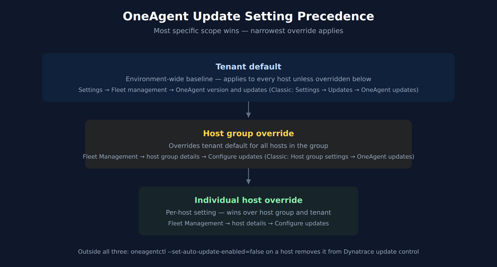
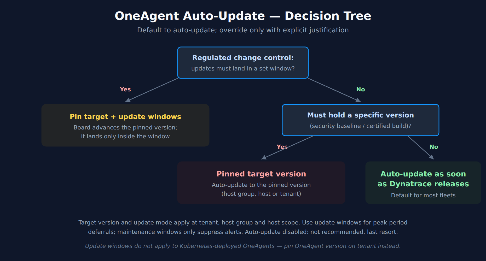

# FAQ-04: How to manage OneAgent updates on Dynatrace SaaS

> **Series:** FAQ — Frequently Asked Questions | **Reference:** 04 — Managing OneAgent Updates (SaaS) | **Created:** May 2026 | **Last Updated:** 10/02/2026

## Overview

OneAgent updates are one of the few estate-wide changes Dynatrace performs continuously — most tenants run them silently, on a default that was set at standup and rarely revisited. That default works for the majority of fleets. It does not work for every fleet.

This FAQ is a decision-support entry for the question: *"How should our organization manage OneAgent updates on SaaS?"* It covers the update mechanism, the three available modes, where settings live (tenant / host group / per host), how update windows and maintenance windows interact, the special case for Kubernetes-deployed OneAgents (where DynaKube's `autoUpdate` field is now deprecated in favor of pinning the OneAgent version on the tenant), validation, rollback, and the most common pitfalls.

The intent is not to talk anyone out of auto-update. For most fleets, **automatic at earliest convenience** remains the right answer. The intent is to make the decision deliberate — and to surface the few cases where a different mode is correct.

> **Scope:** SaaS-only. If you run Dynatrace Managed, the Cluster ActiveGate has its own update path and the OneAgent update model is similar but version-pinned at the cluster level; consult Managed-specific docs.

---

## Table of Contents

1. [Why OneAgent Update Cadence Matters](#cadence)
2. [How OneAgent Updates Work on SaaS](#mechanism)
3. [Update Setting Precedence — Tenant → Host Group → Host](#precedence)
4. [The Three Update Modes — Decision Framework](#modes)
5. [Update Windows vs Maintenance Windows](#windows)
6. [Containerized OneAgent — The DynaKube Special Case](#k8s)
7. [Sequencing Relative to ActiveGate](#sequencing)
8. [Validation After Update](#validation)
9. [Rollback Considerations](#rollback)
10. [Common Pitfalls](#pitfalls)
11. [Recommended Approach](#recommendation)

---

## Prerequisites

| Requirement | Details |
|-------------|---------|
| **Audience** | Platform team, SRE leads, change-management owners, security stakeholders |
| **Format** | Decision-support document — presents trade-offs and recommendations, no hands-on lab |
| **Deployment** | Dynatrace SaaS (Managed is briefly noted; not the focus) |
| **Related topic series** | ONBRD (Dynatrace Onboarding), K8S (Kubernetes Monitoring), AUTOM (Configuration Automation) |
| **Related FAQ** | **FAQ-05: How to manage ActiveGate updates on Dynatrace SaaS** — sequencing depends on AG version |

<a id="cadence"></a>
## 1. Why OneAgent Update Cadence Matters

> **Breaking (SaaS 1.347 — pre-release notes, rollout planned from 09/08/2026): very old agents are disconnected, not merely unsupported.** Verbatim: *"Starting with this release, Dynatrace rejects connections from OneAgent versions 1.241 and earlier."*
>
> This is a different kind of floor from the support window. Dynatrace supports a OneAgent version for 9 months after rollout under Standard Support and 12 months under Enterprise Success and Support; as of OneAgent 1.347 the oldest supported versions are 1.329 and 1.323 respectively. **Falling outside that support window means you stop receiving fixes; being at or below 1.241 means the host stops reporting.** A fleet on "Auto-update disabled" (§4) is the population this reaches first, because it is the one that can sit still for years — and the symptom is a monitoring gap, not an error a reader would attribute to a version policy.
>
> **Inventory before the rollout reaches you**, not after. Give the query an explicit window longer than any host's expected downtime — `fetch dt.entity.host` without `from:` sees only the default two hours, so a host that is offline, or has already been rejected and gone silent, is not returned at all and the check reads clean. Compare the minor version as a number, because `installerVersion` is a string and sorts lexically:
>
> ```dql
> fetch dt.entity.host, from:-30d
> | fieldsAdd minor = toLong(splitString(installerVersion, ".")[1])
> | filter minor <= 241
> | fields entity.name, installerVersion, minor
> ```
>
> On Smartscape, the `ONEAGENT` node carries the version: `smartscapeNodes "ONEAGENT", from:-30d | fields name, dt.agent.module.version`. Do not use `smartscapeNodes "HOST"` for this: HOST nodes carry no OneAgent version, so a `oneagent.version` column comes back empty and the check finds nothing. The Deployment Status screen shows the same thing interactively. There is no grace path once the rejection lands — the fix is an upgrade.

> **Breaking (OneAgent 1.347 — published 10/01/2026, staged rollout from 09/30/2026): updating ends monitoring of Java 23.** Verbatim: *"Starting from OneAgent version 1.347, Java 23 is no longer monitored."* Support now covers *"LTS versions plus the last four Java versions (24, 25, 26 and 27)."*
>
> This is the reverse of the floor above: here it is the **update** that drops coverage. On a fleet with auto-update on, Java 23 processes stop being monitored the day a host takes 1.347, with no error to explain the gap. The documented choices: *"If you are running Java 23, you can either update to Java 24+ and monitor your processes with OneAgent version 1.347, or you can keep using Java 23 with OneAgent version 1.345 and earlier."* The staged rollout reaches tenants and hosts over several weeks, so check which version your hosts are on. Find your Java 23 processes before 1.347 reaches them, and if you must hold them, pin those hosts' target version (§4) rather than disabling updates fleet-wide. The same release also stops monitoring the `composefs` filesystem, which always reported 100% usage.

OneAgent is the data-collection layer of the platform. Update cadence directly affects:

- **Coverage parity with newly-supported technologies.** New runtime versions, frameworks, and infrastructure types arrive in OneAgent releases. A fleet running an older OneAgent loses coverage on whatever was added since.
- **Bug and CVE remediation.** Fixes for parsing, instrumentation, and security issues ship through normal OneAgent releases. Deferring updates indefinitely defers those fixes.
- **Telemetry feature parity.** New span attributes, K8s metadata, log enrichment fields, and Davis inputs depend on the OneAgent producing them. A lagging fleet produces a thinner data stream.
- **Operator workload.** Every manual coordination cycle — pick a version, schedule a window, validate, repeat — consumes engineering time that auto-update absorbs.

| Without active management | With active management | Impact |
|---|---|---|
| Fleet drifts across versions silently | Version distribution stays bounded | Coverage and telemetry stay consistent across hosts |
| New tech support arrives months late | Coverage matches what teams actually run | No "we don't see service X yet" surprises |
| CVEs sit unpatched on host agents | Fixes propagate with the next release wave | Reduces vulnerability window |
| Change-management view of "what's deployed" is unclear | Update mode is an intentional, auditable choice | Aligns Dynatrace with the rest of your change governance |

In community practice, the most consistent benefit teams report from leaving auto-update on is "we stopped having a OneAgent-version inventory problem." Verify against your own change-control framework.

> <sub>**Sources:** [What's new in Dynatrace SaaS 1.347 (DT docs)](https://docs.dynatrace.com/docs/whats-new/saas/sprint-347) — the OneAgent 1.241 connection-rejection quoted above, [What's new in Dynatrace OneAgent 1.347 (DT docs)](https://docs.dynatrace.com/docs/whats-new/oneagent/sprint-347) — *"Published Oct 01, 2026 Rollout start on Sep 30, 2026"*; oldest supported versions *"Standard Support 1.329 Enterprise Success and Support 1.323"*; the Java 23 and `composefs` changes quoted above, [What's new hub (DT docs)](https://docs.dynatrace.com/docs/whats-new) — the 9-month / 12-month OneAgent support windows (*"How long are versions supported following rollout?"*), [OneAgent update (DT docs)](https://docs.dynatrace.com/docs/shortlink/oneagent-update) — *"With auto-update enabled, you don't have to worry about manually updating the OneAgents running in your environment."* Both inventory queries executed against a live tenant 10/02/2026 (the 30-day window returned 126 hosts where the default window returned 15).</sub>

<a id="mechanism"></a>
## 2. How OneAgent Updates Work on SaaS

On SaaS, the update flow is straightforward:

1. A new OneAgent version is published to the Dynatrace download infrastructure.
2. Each OneAgent periodically checks whether it should update, based on the effective setting at its scope (per-host → host-group → tenant default).
3. If the effective setting permits, the OneAgent downloads the new installer in the background.
4. On the next eligible moment (immediately, or within the next update window), the OneAgent restarts on the new version.
5. Processes that OneAgent monitors keep running the previous version's in-process components until they restart.

A few mechanics that surprise teams new to the platform:

- **The OneAgent service updates without restarting your applications — but the monitored processes stay on the old version until they do.** The docs are explicit: *"Following OneAgent automatic updates, you do need to restart all server processes. This is because some components of OneAgent keep running in processes that are monitored by Dynatrace (for example, Java, .NET, Apache, and IIS). Before restart, these processes will continue to be monitored with the previous version of OneAgent."* Plan process restarts into your normal deployment cadence rather than treating them as optional.
- **A brand-new host does not update straight away.** *"OneAgent won't automatically be updated when first installed. By default, Dynatrace waits 45 minutes before updating hosts."*
- **Installers are verified before they run.** *"If the verification fails, the auto-update attempt is aborted."*
- In community practice, an offline or network-isolated host catches up when it can reach Dynatrace again, and a host whose update does not complete keeps reporting on its previous version — verify both on your own fleet; the update page does not describe them.
- **Update Now buttons exist at multiple levels.** Individual host and environment-wide "Update now to target version" controls are available in addition to the auto-update flow.

> <sub>**Sources:** [OneAgent update (DT docs)](https://docs.dynatrace.com/docs/shortlink/oneagent-update) — the process-restart, 45-minute and installer-verification quotes above (re-read 10/02/2026), plus the update strategies, the per-scope precedence and the "Update now" controls.</sub>

<a id="precedence"></a>
## 3. Update Setting Precedence — Tenant → Host Group → Host

Three scopes, in increasing specificity:



<!-- MARKDOWN_TABLE_ALTERNATIVE
| Scope | Where set | Wins over |
|-------|-----------|-----------|
| Tenant default | Latest Dynatrace: Settings → Fleet management → OneAgent version and updates. Classic: Settings → Updates → OneAgent updates | (baseline) |
| Host group override | Latest Dynatrace: Fleet Management → host group details → Configure updates. Classic: Host group settings page → OneAgent updates | Tenant default |
| Per-host override | Latest Dynatrace: Fleet Management → host details → Configure updates. Classic: host settings page → OneAgent updates | Host group + tenant default |
| Host-local switch | `oneagentctl --set-auto-update-enabled=false` on the host | All three scopes — Dynatrace settings no longer control that host |
For environments where SVG doesn't render
-->

| Scope | When to use |
|-------|-------------|
| **Tenant default** | The fleet-wide policy. For most tenants this is auto-update as soon as Dynatrace releases or auto-update during update windows (mode names in §4), depending on change-control culture. |
| **Host group override** | Different cadences for different host groups — e.g., `production` updates during a Saturday window, `nonprod` updates as soon as Dynatrace releases, `pci-prod` holds a pinned target version that the change board advances. This is the most common reason to deviate from the tenant default. |
| **Per-host override** | Exceptional cases — a specific host running a workload with strict version-pinning needs, or a host on extended quarantine after an incident. Per-host overrides are powerful but invisible at the fleet-management level; document them. |

**A fourth, host-local switch sits outside all three.** `oneagentctl --set-auto-update-enabled=false` turns auto-update off on that host, and *"After you use this command to disable auto-updates, you won't be able to control any OneAgent updates using Dynatrace at Settings > Updates > OneAgent updates."* The docs offer it for *"very strict software rollout rules"*, and it is invisible in the settings above. When a host ignores the policy you set, check it there first: `oneagentctl --get-auto-update-enabled`.

**Where this lives operationally:** the host-group setting is the right granularity for almost every real-world policy. Per-host overrides are escape hatches. If you find yourself setting per-host overrides repeatedly across the same group of hosts, that group is telling you it wants to be its own host group.

> <sub>**Sources:** [OneAgent update (DT docs)](https://docs.dynatrace.com/docs/shortlink/oneagent-update) — three-level precedence: environment / host group / individual host; Latest Dynatrace: *"go to Settings > Fleet management > OneAgent version and updates"* and *"For host-group- or host-level overrides, open Configure updates from the entity's details in Fleet Management"*; Classic: *"go to Settings > Updates > OneAgent updates"*., [Host groups (DT docs)](https://docs.dynatrace.com/docs/shortlink/host-groups) — host-group as the canonical scoping boundary for update settings, alerting overrides, and thresholds., [oneagentctl (DT docs)](https://docs.dynatrace.com/docs/shortlink/oneagentctl) — *"After you use this command to disable auto-updates, you won't be able to control any OneAgent updates using Dynatrace at Settings > Updates > OneAgent updates."*; the update page: *"If you have very strict software rollout rules, however, you can disable auto-updates permanently with the OneAgent command-line interface."*</sub>

<a id="modes"></a>
## 4. The Three Update Modes — Decision Framework

Two settings work together at every scope. The **target version** decides *which* version OneAgents move to — a rolling policy (*Latest*, *Previous* or *Older* version) or a pinned version. The **update mode** decides *when*. The mode names differ between the two UIs:

| Mode (Latest Dynatrace / Classic) | What it does | When to pick it |
|------|--------------|-----------------|
| **Auto-update as soon as Dynatrace releases** / *Automatic updates at earliest convenience* | OneAgent updates to the target version as soon as it is available. | Default for nonprod, dev, lab fleets; default for most production fleets without explicit change-control requirements. |
| **Auto-update during update windows** / *Automatic updates during update windows* | OneAgent updates only within a configured update window (one-time, daily, weekly, or monthly recurrence). | Fleets with peak-period sensitivity (retail freeze, end-of-month batch jobs) where the update mechanic is fine but the *timing* needs to be predictable. Combined with a **pinned target version**, it is also the fit for strict change control (PCI, regulated industries): Fleet Management describes target versions and update windows as the way to *"keep your components on a controlled version while still benefiting from automatic updates"* — the change board advances the pinned version, and the window controls when it lands. |
| **Auto-update disabled** / *No automatic updates* | OneAgent never auto-updates; manual "Update now" flows only. The docs mark it *"not recommended, as it may put your OneAgents at risk of falling out of the supported version range"*, and with it *"we don't notify you when instances of OneAgent are outdated."* | Last resort — hosts where change control cannot accept even a pinned, windowed update. Give it a named owner and a review cadence. |



<!-- MARKDOWN_TABLE_ALTERNATIVE
| Question | Yes → | No → |
|----------|------|------|
| Regulated change control: updates must land in a scheduled window? | Pin target version + Auto-update during update windows | (continue) |
| Must hold a specific version (security baseline / certified build)? | Pinned target version (auto-update to the pinned version) | Auto-update as soon as Dynatrace releases |
| Footer | Update windows handle peak-period deferrals — maintenance windows only suppress alerts. Auto-update disabled is not recommended (last resort). | |
For environments where SVG doesn't render
-->

### Trade-offs

| Mode | Operator cost | Lag from latest | Notes |
|------|--------------|-----------------|-------|
| Auto-update as soon as Dynatrace releases | Lowest | Hours-to-days | Background — most fleets pick this and never revisit |
| Auto-update during update windows | Low | Days-to-weeks (window-dependent) | Predictable; aligns with established maintenance cadences |
| Auto-update disabled | Highest | Until manually applied — potentially long | Every transition is a ticket; no outdated-version notification, so the fleet can drift silently |

In community practice, the "Auto-update disabled" mode is often picked defensively at tenant standup ("we'll turn it on later") and then forgotten. If you adopt this mode, pair it with a recurring calendar reminder to evaluate available versions, or you will discover that the fleet is six months behind a year later.

> **Breaking (OneAgent 1.345): on hosts where auto-update *and* process auto-injection are both disabled, versioned directories are no longer cleaned up.** Verbatim: *"Due to security concerns, versioned directories will no longer be removed automatically on hosts where auto-updates and process auto-injection are disabled."* This lands directly on the mode above. Previously, a host on **Auto-update disabled** still had old versioned directories reclaimed by a legacy migration mechanism; from 1.345 that mechanism is gone, so on hosts where auto-update **and** process auto-injection are both disabled, each retained version's directory persists until someone removes it. The cost is disk, and it accrues quietly on exactly the fleet this mode creates — long-lived hosts that update rarely and are rarely looked at. **If you run "Auto-update disabled" at any scale, add OneAgent installation-directory growth to what you monitor, and give the cleanup an owner.** OneAgent 1.345 began its **staged rollout on 08/25/2026**, and OneAgent fleets lag tenant version — check the version your hosts are actually on before assuming either behavior. The mode itself is unchanged and remains a legitimate choice; only its housekeeping side effect changed.

> <sub>**Sources:** [OneAgent update (DT docs)](https://docs.dynatrace.com/docs/shortlink/oneagent-update) — Latest Dynatrace modes *"Auto-update as soon as Dynatrace releases"*, *"Auto-update during update windows"*, *"Auto-update disabled —not recommended, as it may put your OneAgents at risk of falling out of the supported version range."*; *"Choose a rolling version policy ( Latest version , Previous version , or Older version ) or pin a specific version."*; Classic: *"Do not automatically update. With this option, we don't notify you when instances of OneAgent are outdated."*, [Fleet Management (DT docs)](https://docs.dynatrace.com/docs/ingest-from/fleet-management) — *"Target versions and update windows let you keep your components on a controlled version while still benefiting from automatic updates."*, [OneAgent 1.345 release notes (DT docs)](https://docs.dynatrace.com/docs/whats-new/oneagent/sprint-345) — *"Removed legacy migration mechanism of versioned directories"*, quoted above. **Derived:** the disk-growth consequence for long-lived manually-updated hosts follows from the removal applying precisely to hosts with auto-update disabled.</sub>

<a id="windows"></a>
## 5. Update Windows vs Maintenance Windows

Two related-but-distinct mechanisms are easy to confuse:

| Concept | What it does | Where to set |
|---------|--------------|--------------|
| **Update window** | Defines *when* automatic OneAgent updates may execute. Only applies when the update mode is *Auto-update during update windows*. | Latest Dynatrace: Settings → Fleet management → OneAgent version and updates → *Manage update windows* tab |
| **Maintenance window** | Suppresses *alerting* on monitored entities during the window. Does **not** govern OneAgent updates. | Settings → Maintenance windows |

In community practice, the confusion goes both directions: teams set a Maintenance Window expecting it to delay OneAgent updates (it does not), or they set an Update Window expecting alerts to be suppressed during it (they are not). Maintenance windows govern alerting; update windows govern the update mechanic itself. They are independent tools and often used together.

A useful pairing: schedule update windows during your normal maintenance cadence, *and* create a maintenance window over the same period — so OneAgent updates happen quietly without generating "OneAgent restart detected" event noise downstream.

**Recurrence patterns** for update windows: one-time, daily (every N days), weekly (specific weekdays), monthly (specific day-of-month). Pick the pattern that matches your existing change calendar — there is no built-in advantage to weekly over monthly, just operational fit.

> <sub>**Sources:** [OneAgent update (DT docs)](https://docs.dynatrace.com/docs/shortlink/oneagent-update) — *"OneAgent update windows are used to schedule automatic OneAgent updates when the Automatic updates during update windows option is selected."*, *"Update windows are used to schedule automatic OneAgent updates when the Update mode is set to Auto-update during update windows"*, [Maintenance windows (DT docs)](https://docs.dynatrace.com/docs/analyze-explore-automate/notifications-and-alerting/maintenance-windows) — *"Defining maintenance windows during times of abnormal operation helps you reduce alert spam and keep your baselines clean for accurate monitoring and alerting."* **Derived:** maintenance windows do not govern updates — the update page ties update timing to update windows only, and the maintenance-window page covers alerting and baselines only.</sub>

<a id="k8s"></a>
## 6. Containerized OneAgent — The DynaKube Special Case

OneAgent in Kubernetes is managed by the Dynatrace Operator through a DynaKube custom resource. The update model here differs from host-based OneAgent in important ways:

- **Update windows do not apply to Kubernetes-deployed OneAgents.** The OneAgent update windows mechanic is host-based.
- **The DynaKube `autoUpdate` parameter is deprecated.** The DynaKube parameters reference now documents `autoUpdate` as *"Deprecated field to be removed in a future release. Pin the OneAgent version on your tenant to configure auto-update. Auto-update is disabled when the `version` or `image` fields are set."*
- **`version` on the DynaKube is deprecated too.** In the current DynaKube API (`v1beta6`, Operator 1.8.0+), the reference marks it deprecated in all four OneAgent modes, for example *"( deprecated ) Deprecated field to be removed in a future release. Pin the OneAgent version on your tenant to configure auto-update."* `image` is not marked deprecated.
- **The documented pattern is to pin the OneAgent version on the tenant.** Setting `version` or `image` on the DynaKube CR opts that workload out of auto-update (*"Auto-update is disabled when the version or image fields are set."*).

In practice this means: for Kubernetes workloads, the policy choice is not "auto-update yes/no" at the DynaKube level — it is "pin a specific OneAgent version on the tenant, or leave it floating" Pinning the version on the tenant gives you a single, auditable artifact for what is deployed across all clusters using that DynaKube.

| Decision | Mechanism on K8s |
|----------|------------------|
| Auto-update OneAgent in cluster | Leave version / image unset on DynaKube; let the tenant default flow |
| Pin a specific OneAgent version | Pin on the tenant (the documented path) |
| Different version per cluster | A digest-pinned `image` on that cluster's DynaKube — not the deprecated `version` field. Whether a host-group target version can do this instead is not documented; verify on one cluster |

For deeper coverage of DynaKube modes (`classicFullStack`, `cloudNativeFullStack`, `applicationMonitoring`, `hostMonitoring`), see the **K8S** topic series. This FAQ stays at the update-policy level.

> <sub>**Sources:** [DynaKube parameters for Dynatrace Operator (DT docs)](https://docs.dynatrace.com/docs/ingest-from/setup-on-k8s/reference/dynakube-parameters) — *"Deprecated field to be removed in a future release. Pin the OneAgent version on your tenant to configure auto-update."* (the text on both `autoUpdate` and `version`, re-read 10/02/2026), [OneAgent update (DT docs)](https://docs.dynatrace.com/docs/shortlink/oneagent-update) — *"Update windows currently do not apply in Kubernetes environments."*.</sub>

<a id="sequencing"></a>
## 7. Sequencing Relative to ActiveGate

When ActiveGates sit in the OneAgent → Dynatrace path (private ActiveGates for routing, or AGs in network-restricted environments):

> **Leave automatic updates on for both OneAgents and ActiveGates.** Both are on by default, and with both left on there is no update order for you to manage.

If either tier is off automatic updates — disabled, pinned, or confined to update windows — then **update ActiveGates first, then OneAgents.** Dynatrace publishes no general version-compatibility rule between the two, but it has enforced this dependency once: ahead of OneAgent's move to 64-bit host IDs, *"all ActiveGates earlier than version 1.154 must be upgraded to newer releases in order to properly support OneAgent 64-bit IDs."* In community practice that case is generalised into a standing order. The combination to avoid is OneAgents on auto-update in front of ActiveGates that are not — and note that ActiveGate auto-update is the default only for new environments, so an older tenant may be in that state without anyone having chosen it.

If your tenant uses no private ActiveGates (OneAgents connect directly to Dynatrace SaaS), this sequencing concern doesn't apply — but most enterprise deployments include at least one AG tier for network reasons, so the rule effectively applies.

**Updating OneAgents manually** (after the ActiveGates are done):

- **One host.** Go to **Settings > Monitoring > Monitoring overview**, select the **Hosts** tab, select **Update** next to the host, then **Update now**. The button appears only for an outdated **full-stack** OneAgent — not for PaaS or standalone OneAgents — and a disabled **Update now** means you lack permission to download the installer.
- **A host group, or the whole environment.** On the host-group or environment **OneAgent updates** settings, **Update now to target version** updates every host of the selected OS and architecture, whatever its auto-update setting. Set the **Target version** first — it is also the version manual updates install.
- **Without the UI.** Download the installer, copy it to the host, and install there.
- **Then restart monitored processes.** Components of OneAgent run inside monitored processes (Java, .NET, Apache, IIS); those processes keep reporting on the old version until they restart.
- **Kubernetes** is different: update windows do not apply there, and OneAgent versions are driven through the Dynatrace Operator (§6).

**See FAQ-05 §4 for the ActiveGate update steps, and FAQ-05: How to manage ActiveGate updates on Dynatrace SaaS for the full AG-side discussion, including HA pair rolling updates, role-specific considerations (synthetic, EF 2.0, cloud monitoring), and validation steps.**

In community practice, mixed-version environments (AGs lagging behind OneAgents) tend to surface first as *"some hosts intermittently aren't reporting"* or *"this new feature didn't light up on these hosts"* — by then the diagnostic path is long. Keeping AGs on auto-update, or updating them first where they are manual, avoids the failure mode.

> <sub>**Sources:** [OneAgent update (DT docs)](https://docs.dynatrace.com/docs/shortlink/oneagent-update) — *"The Update button appears only if the installed version of OneAgent on a specific host is outdated and if it is a full-stack OneAgent."*; *"Manually triggering Update now to target version will update all hosts running the selected OS and architecture combination, regardless of their automatic update status."*, [Update ActiveGate (DT docs)](https://docs.dynatrace.com/docs/shortlink/update-activegate) — *"When a new version is available, the installation package is downloaded and installed automatically. This is the default setting for new environments; existing environments retain their current setting."*, [End-of-support announcements (DT docs)](https://docs.dynatrace.com/docs/whats-new/technology/end-of-support-news) — *"all ActiveGates earlier than version 1.154 must be upgraded to newer releases in order to properly support OneAgent 64-bit IDs."* Neither update page states an ActiveGate-before-OneAgent order; the standing rule is community practice generalised from the 1.154 case.</sub>

<a id="validation"></a>
## 8. Validation After Update

For most fleets on `Automatic updates at earliest convenience`, post-update validation is implicit — the platform itself reports OneAgent health, version, and process injection status. The check usually doesn't need a separate workflow.

For change-controlled fleets, in community practice the validation set looks like the list below — no Dynatrace page enumerates it, so adapt it to your own change process:

1. **Version reported.** Confirm the OneAgent is reporting the target version (Deployment status page; or DQL: `fetch dt.entity.host | fields entity.name, osVersion, installerVersion`).
2. **Deep monitoring re-injected.** Process Groups and PGIs for the host show the new agent version. New process starts after the update inherit the new agent.
3. **Smartscape topology intact.** No unexpected gaps — services, processes, and hosts still link as before.
4. **No new ingestion errors.** Spans, logs, and metrics from the host continue to land; no spike in dropped events.
5. **Application functioning normally.** If a deep-injection-relevant change shipped (Java agent library swap, .NET profiler change), validate the apps themselves restart cleanly.

For fleets running `Automatic updates during update windows`, build this checklist into the post-window review so any anomalies get caught before the next window's batch.

> <sub>**Sources:** [OneAgent update (DT docs)](https://docs.dynatrace.com/docs/shortlink/oneagent-update).</sub>

<a id="rollback"></a>
## 9. Rollback Considerations

Rollback of a OneAgent version is uncommon on SaaS, but it does happen — most often when a new version introduces an unexpected interaction with a specific runtime or framework on a specific host.

The operating reality:

- **Rollback = install older version.** There is no in-place downgrade — selecting an older target version does not downgrade an installed OneAgent. The flow is `Uninstall current OneAgent → install older installer → confirm host re-registers on the older version`. In community practice the reinstalled host re-registers under its existing host entity — verify this on one host before relying on entity continuity.
- **Pin the rolled-back host's target version (or its host group's) so auto-update does not undo the rollback.** Without a pin, the host will auto-update back to current on its next cycle. A host-level target version *"Overrides host group and environment-level configuration"*; pinning the environment instead would also change the version every new host installs.
- **For Kubernetes**, pin the OneAgent version on the tenant, or set a digest-pinned `image` on the DynaKube CR (`version` is deprecated, §6). Whether the Operator moves already-running OneAgent pods back to an older pinned version is not documented — verify on one cluster before relying on it.
- **Capture configuration before rollback.** Host group assignment, host tags, host properties — `oneagentctl --get-host-group`, `oneagentctl --get-host-tags`, etc. — survive reinstall if you reapply on the new install. Document them first.

The playbook above is community practice built on the documented uninstall/reinstall mechanic, not a single documented procedure. In community practice, the right time to plan rollback is *before* enabling a broad rollout — pick a canary host group, validate there, then expand. Rollback as a routine response to a fleet-wide issue is expensive and rarely the best answer; rollback as a contained response within a canary is cheap.

> <sub>**Sources:** [OneAgent update (DT docs)](https://docs.dynatrace.com/docs/shortlink/oneagent-update) — *"If you select an older version than a currently deployed version, you won't be able to downgrade OneAgent."*; *"Host Affects OneAgent on this host. Overrides host group and environment-level configuration."*, [oneagentctl (DT docs)](https://docs.dynatrace.com/docs/shortlink/oneagentctl) — *"./oneagentctl --get-host-tags"*.</sub>

<a id="pitfalls"></a>
## 10. Common Pitfalls

*These pitfalls are community practice, observed often enough across fleets to be worth flagging; Dynatrace does not document them as anti-patterns, so weigh them against your own fleet.*

| Pitfall | Why it happens | What to do instead |
|---------|----------------|--------------------|
| **"We'll disable auto-update for safety, then forget about it."** | *Auto-update disabled* is set at standup as a precaution and never revisited — and Dynatrace does not notify you that agents are outdated. Fleet drifts months behind. | Pin a target version and use *Auto-update during update windows* instead; if updates must stay disabled, pair it with a named owner and a recurring version review. |
| **Maintenance window expected to delay an update.** | Maintenance windows suppress *alerts*, not updates. Setting a maintenance window and expecting OneAgent to wait is a common confusion. | Use **update windows** for update timing; use maintenance windows for alert suppression. The two are independent. |
| **Per-host overrides accumulating invisibly.** | One-off per-host changes pile up; the host-group setting is no longer the effective policy across the group. | If multiple hosts in a group need different behavior, that's a signal the group should be split — not a signal to multiply per-host overrides. |
| **DynaKube `autoUpdate: false` as the K8s pinning mechanism.** | The DynaKube field is deprecated; many older blog posts still recommend it. | Pin the OneAgent version on the tenant instead. `version` on the DynaKube is deprecated too; use a digest-pinned `image` only where a per-cluster override is unavoidable. |
| **OneAgents on auto-update in front of ActiveGates on manual updates.** | AG restarts feel riskier, so the AG tier gets frozen first — or an older tenant never had AG auto-update on. | Put the AGs on auto-update; where they must stay manual, update them before the OneAgents — see FAQ-05 §4. |
| **No post-update validation discipline.** | "It auto-updated, so it must be fine." | Spot-check version, deep monitoring re-injection, and topology integrity after any non-routine update. Most fleets need this only for major versions. |
| **A host that ignores every update setting.** | `oneagentctl --set-auto-update-enabled=false` was run on it, which takes it out of Dynatrace control entirely. | Check `oneagentctl --get-auto-update-enabled` on the host (§3). |
| **Treating OneAgent update like an OS patch.** | OS patch programs assume "all hosts patched on Tuesday." OneAgent updates run on Dynatrace's release cadence, not your OS calendar. | Decouple OneAgent update policy from OS patch policy. Update windows can align the two if needed, but they are not the same process. |


> <sub>**Sources:** [OneAgent update (DT docs)](https://docs.dynatrace.com/docs/shortlink/oneagent-update) — mechanics of the three update modes and the "Update now" controls., [DynaKube parameters (DT docs)](https://docs.dynatrace.com/docs/ingest-from/setup-on-k8s/reference/dynakube-parameters) — the parameter table marks it *"(deprecated)"* — *"Deprecated field to be removed in a future release. Pin the OneAgent version on your tenant to configure auto-update."* (on both `autoUpdate` and `version`), [oneagentctl (DT docs)](https://docs.dynatrace.com/docs/shortlink/oneagentctl) — *"After you use this command to disable auto-updates, you won't be able to control any OneAgent updates using Dynatrace at Settings > Updates > OneAgent updates."*</sub>

<a id="recommendation"></a>
## 11. Recommended Approach

For most SaaS tenants, the right configuration is:

1. **Tenant default: *Auto-update as soon as Dynatrace releases* (Classic: *Automatic updates at earliest convenience*).** Lowest operator cost; fleet stays current automatically.
2. **Host-group overrides for production: *Auto-update during update windows*** if your change-control culture wants predictable timing. Pair with a recurring update window (e.g., Sunday 02:00–04:00 local).
3. **Host-group override for regulated tiers (PCI, FedRAMP equivalent, etc.): a pinned target version (or a rolling *Previous version* policy) with *Auto-update during update windows*,** advanced by the change board on a documented cadence. Reserve *Auto-update disabled* — which the docs mark not recommended — for hosts where change control cannot accept even a pinned, windowed update. For K8s workloads, pin the version on the tenant.
4. **Per-host overrides only in exceptional cases** — and only when you've documented why elsewhere (DECISIONS.md, change ticket, host-group naming convention).
5. **Keep ActiveGates on automatic updates too; where they are manual, update them before OneAgents.** See FAQ-05.
6. **Validate version, deep injection, and topology after major-version updates.** Routine minor updates rarely need this.
7. **Plan rollback within canary scope, not fleet-wide.** Pick a canary host group, validate, expand.

For Kubernetes-only tenants, the recommended pattern is:

1. **Leave DynaKube `version`/`image` unset** unless you have a reason to pin.
2. **Pin OneAgent version on the tenant** when you need a controlled rollout cadence.
3. **Treat `autoUpdate` and `version` on DynaKube as deprecated** — don't author new DynaKube CRs that rely on them.

## Summary

OneAgent update management on SaaS is a four-axis decision: mode (auto / windowed / off), scope (tenant / host group / host), Kubernetes special case (version pin on tenant), and sequencing (a non-issue with both tiers on auto-update; after ActiveGates where either is manual). The default — auto-update as soon as Dynatrace releases — is the right answer for most fleets; the few cases where it isn't are change-controlled production, regulated tiers, and explicit canary patterns, and those are served by a pinned target version plus update windows. The most common failure is disabling auto-update defensively at standup and letting the fleet drift — pin and window instead, or give the disabled hosts an owner and a review cadence.

## Next Steps

- Review your current tenant-level OneAgent update setting and confirm it is intentional (not a leftover from standup).
- Audit per-host-group overrides; collapse any that have drifted into "per-host overrides everywhere" patterns.
- For Kubernetes workloads, migrate away from DynaKube `autoUpdate` and `version` toward tenant-level version pinning.
- Run the 30-day ≤ 1.241 inventory in §1, and check `oneagentctl --get-auto-update-enabled` on any host that ignores its update setting.
- Read **FAQ-05** for the ActiveGate side of the same problem, and check that your ActiveGates are on auto-update too.
- Document your update policy alongside your host-group naming convention (see **FAQ-01**) and tagging strategy (see **FAQ-02**).

---

<sub>*This notebook was AI-generated from community-submitted and publicly available sources. This notebook series is not officially supported by Dynatrace. Always verify information against official [Dynatrace documentation](https://docs.dynatrace.com/docs).*</sub>
