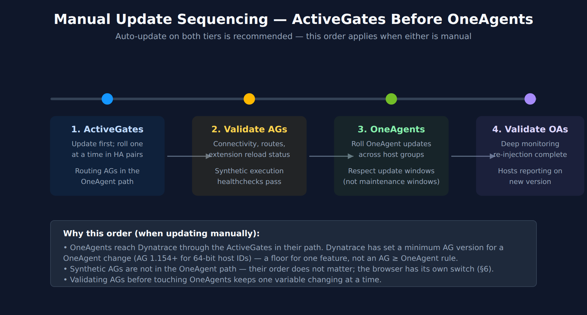

# FAQ-05: How to manage ActiveGate updates on Dynatrace SaaS

> **Series:** FAQ — Frequently Asked Questions | **Reference:** 05 — Managing ActiveGate Updates (SaaS) | **Created:** May 2026 | **Last Updated:** 10/02/2026

## Overview

ActiveGate updates differ from OneAgent updates in a way that matters operationally: ActiveGates are infrastructure, not endpoints. A single ActiveGate sits in the path of many OneAgents, hosts a set of extensions, and may run a synthetic browser engine. When an ActiveGate updates, the impact is concentrated — not distributed across thousands of hosts the way a OneAgent restart is.

That concentration is the reason ActiveGate update management deserves a separate decision than OneAgent update management. The mechanics look similar (auto-update toggle, version checking, install and reconnect), but the operating practices around sequencing, HA pairs, role-specific validation, and rollback are distinct. It is also why the decision is not purely operational: an ActiveGate is in-path infrastructure with a broad network footprint, and AG security fixes ship inside ordinary version updates — so update policy is a security-posture decision as much as a change-management one (§3).

This FAQ covers: the update mechanism, the auto-update vs manual decision, sequencing (let auto-update handle it; ActiveGates before OneAgents when you update manually), HA-pair rolling updates, role-specific considerations (routing, synthetic, Extension Framework 2.0, cloud monitoring), validation, rollback, and the most common pitfalls.

> **Scope:** SaaS only. Managed Cluster ActiveGates and the Cluster ActiveGate update model are out of scope here — with one exception: §2 covers the ActiveGate `autoUpdate` API change, because the same two properties were added to both the SaaS Environment API v2 and the Managed Cluster API v2 and then removed again from six Cluster API endpoints — but not from the SaaS API.

---

## Table of Contents

1. [Why ActiveGate Updates Need Attention](#why)
2. [How ActiveGate Updates Work on SaaS](#mechanism)
3. [The Auto-Update vs Manual Decision](#modes)
4. [Sequencing — ActiveGates Before OneAgents](#sequencing)
5. [HA Pairs and Rolling Updates](#ha)
6. [Roles and Update Implications](#roles)
7. [Validation After Update](#validation)
8. [Rollback Considerations](#rollback)
9. [Common Pitfalls](#pitfalls)
10. [Recommended Approach](#recommendation)

---

## Prerequisites

| Requirement | Details |
|-------------|---------|
| **Audience** | Platform team, SRE leads, network/proxy owners, change-management stakeholders |
| **Format** | Decision-support document — presents trade-offs and recommendations, no hands-on lab |
| **Deployment** | Dynatrace SaaS Environment ActiveGates. Managed Cluster ActiveGate is out of scope. |
| **Related topic series** | ONBRD (Dynatrace Onboarding), SYNTH (Synthetic Monitoring), CLOUD (Cloud Provider Integrations) |
| **Related FAQ** | **FAQ-04: How to manage OneAgent updates on Dynatrace SaaS** — sequencing depends on AG version |

<a id="why"></a>
## 1. Why ActiveGate Updates Need Attention

OneAgent updates are distributed — thousands of hosts, each with its own restart, no single one affecting much. ActiveGate updates are concentrated — one component in the path of many flows, and the update gap touches every flow it serves.

The practical consequences:

- **Connectivity gap during the update.** OneAgents and other clients route through the ActiveGate, and an updating ActiveGate installs the new version and then re-connects to the server. In community practice that gap is short, but a single AG cannot hide it; HA pairs absorb it.
- **Components that move with the AG.** The Extension Execution Controller that runs EF 2.0 extensions is installed and managed with the ActiveGate, and the cloud-monitoring modules (AWS, Azure) run inside it. The extensions themselves are versioned separately. On a synthetic AG the Synthetic engine and browser move too — on Windows the browser always updates with the engine; on Linux a per-location switch decides (§6).
- **Version compatibility downstream.** A OneAgent can only report through the ActiveGate in front of it. Dynatrace publishes no general version-compatibility matrix between the two, but it has set a minimum ActiveGate version for a OneAgent change before (§4) — which is why an AG left behind is the component to worry about.
- **What the update touches depends on the role.** The components above come back on the new version, so the checks after an update depend on what the AG is configured to do (§6, §7).

| Without active management | With active management | Impact |
|---|---|---|
| AGs on manual updates drift behind auto-updating OneAgents | Auto-update on both tiers, or AGs updated first where manual | No OneAgent arrives at a version its AG has not seen |
| Synthetic monitors fail unexpectedly after a browser change | Browser version held with the location switch, or validated post-update | Monitor false-failures are caught quickly |
| An extension stops ingesting after an update and nobody notices | Extension status and ingest are part of post-update validation | Silent ingest gaps are caught quickly |
| Single-AG architectures take observability gaps during every update | HA pair, rolled one at a time | No observability gap during update |

In community practice, the most visible benefit of disciplined AG update management is fewer unexplained synthetic monitor failures after updates — the symptom of a browser change nobody tracked. Verify against your own monitor history.

> <sub>**Sources:** [Update ActiveGate (DT docs)](https://docs.dynatrace.com/docs/shortlink/update-activegate) — *"The ActiveGate has requested and downloaded the new installation package from the server, and is currently in the process of installing it or re-connecting to the server."*, [About Extensions (DT docs)](https://docs.dynatrace.com/docs/ingest-from/extensions/concepts) — *"EEC is automatically installed and managed with each OneAgent and ActiveGate configuration."*, [Private Synthetic locations (DT docs)](https://docs.dynatrace.com/docs/observe/digital-experience/synthetic/synthetic-app/private-locations) — *"on Windows-based ActiveGates, Chromium is always updated during Synthetic engine updates."* (all re-read 09/28/2026)</sub>

<a id="mechanism"></a>
## 2. How ActiveGate Updates Work on SaaS

ActiveGate update flow on SaaS:

1. A new version becomes available — to a Classic-path ActiveGate through an availability check that runs every 30 minutes.
2. If the AG's update mode allows it now (auto-update, or an open update window), the installation package is downloaded.
3. The AG installs the new version and re-connects to the server.
4. The AG resumes serving traffic; whatever it hosts (extensions, synthetic engine, cloud-monitoring modules) comes back on the new version.

A few mechanics worth knowing:

- **Where you control updates depends on the platform surface.** On **Latest Dynatrace**, update control is set centrally: **Settings > Fleet management > ActiveGate version and updates** holds a **target version** (pinned, or a rolling policy such as N-1) and an **update mode** — auto-update as soon as Dynatrace releases, auto-update only during update windows you define, or auto-update disabled. On **Dynatrace Classic**, the older path remains: **Settings > Updates > ActiveGate updates**, a per-ActiveGate *Automatic updates at earliest convenience* toggle. The Update ActiveGate page documents only that toggle for Classic, but the SaaS 1.343 notes describe ActiveGate update modes by their Classic names — including *Automatic during update window* — and say ActiveGates *"share the same update windows you already use for OneAgent"*. Check your Classic settings before assuming windows are unavailable there. Since **SaaS 1.343** (rollout from 07/14/2026), per-ActiveGate settings can override the environment defaults, so a role-specific schedule is expressed by giving those AGs their own update mode or window.
- **Auto-update can be disabled.** On the Classic path, a one-click **Update** control appears in the AG's settings when a new version is available and the toggle is off; on Latest Dynatrace, manually managed ActiveGates get an **Update now to target version** button (steps in §4). *Auto-update disabled* is an update mode the docs mark as not recommended.
- **Containerized ActiveGates are outside all of this.** Auto-update and one-click update apply only to installer-based ActiveGates; containerized ones are updated with your container tooling (on Kubernetes, the Dynatrace Operator).
- **The check interval.** The docs give 30 minutes for the Classic path and document no setting to change it.
- **The update gap is short.** In community practice, tens of seconds while the AG installs and re-connects. HA pair architectures absorb this; single-AG architectures briefly drop traffic.

> <sub>**Sources:**</sub>
> - <sub>[Update ActiveGate (DT docs)](https://docs.dynatrace.com/docs/shortlink/update-activegate) — Latest Dynatrace: *"Go to Settings > Fleet management > ActiveGate version and updates"*; *"Use the Target version dropdown to set the version that serves as the default for new deployments and as the update target for existing ActiveGates."*; *"Auto-update during an update window —ActiveGates update automatically, but only during the update windows you configure on the Manage update windows tab."*; *"Auto-update disabled —not recommended as it may put your ActiveGates at risk of falling out of the supported version range."* (re-read 09/28/2026)</sub>
> - <sub>[Update ActiveGate (DT docs)](https://docs.dynatrace.com/docs/shortlink/update-activegate) — Dynatrace Classic: *"Go to Settings > Updates > ActiveGate updates"*; *"The availability check runs at 30-minute intervals."*; *"This option is available only when the Automatic updates at earliest convenience toggle is turned off."*</sub>
> - <sub>[Fleet Management (DT docs)](https://docs.dynatrace.com/docs/ingest-from/fleet-management) — *"Plan and control updates with target versions and update windows."*</sub>
> - <sub>[SaaS 1.343 release notes (DT docs)](https://docs.dynatrace.com/docs/whats-new/saas/sprint-343) — *"Per-ActiveGate settings can override environment defaults, and manually managed ActiveGates expose an Update now to target version button."* (re-read 09/28/2026)</sub>
> - <sub>[Update ActiveGate (DT docs)](https://docs.dynatrace.com/docs/shortlink/update-activegate) — *"Auto-update and One-click update functionalities are limited to host-based—using installer—deployment only."*</sub>

### A cautionary note on `targetVersion` and `updateWindows`

**API 1.342** added `targetVersion` (the version AGs update to) and `updateWindows` (when updates may run) to the ActiveGate auto-update endpoints of **both** API families — the SaaS **Environment API v2** and the Managed **Cluster API v2**.

**API 1.344** (published 07/15/2026, rollout from 07/29/2026) then **removed both properties from six Cluster API v2 endpoints** — the global and per-AG `/activeGates/autoUpdate` endpoints and their validators — marking four of them *"Broken compatibility"*, and changed the read-only status of properties on the per-AG endpoints. The changelog lists **no** removal for the per-environment `/activeGates/autoUpdate/{envId}` endpoints that 1.342 also extended; check your cluster's API reference for those. If you automate **Dynatrace Managed** ActiveGate updates, drop both properties from the affected request bodies once your cluster is on 1.344 or later — go by your own cluster's API version, not the rollout date.

On **SaaS**, nothing was removed: the Environment API v2 reference for `PUT /api/v2/activeGates/autoUpdate` still documents `targetVersion` and `updateWindows` (read 09/28/2026), alongside the Fleet management settings page. An earlier revision of this document said the properties were never part of the SaaS API; that was wrong.

Separately, **ActiveGate 1.343** deprecated the SaaS ActiveGate *listing* endpoints — `GET /api/v2/activeGates`, `GET /api/v2/activeGates/{agId}` and `GET /api/v2/activeGates/groups` — in favor of the `ACTIVEGATE` Smartscape node (§7). The auto-update endpoints are not on that list.

The general lesson: a capability announced in one sprint can be withdrawn in the next, and a change to one API family says nothing about the other. That is why this series names the version on every release-tied claim and keeps the pre-version guidance in place.

> **Fleet Management.** The Fleet Management app is the central place for OneAgent and ActiveGate inventory, health, and update planning — available since **SaaS 1.343** (*"Fleet Management is now available."*). It documents inventory of all OneAgents and ActiveGates, health issues with recommendations, and planning updates with **target versions** (a rolling version policy such as N-1, or a pinned version) and **update windows**. Fleets beyond a handful of AGs should plan updates from Fleet management settings rather than per-AG settings pages. If your tenant still shows only the Classic per-ActiveGate toggle, that path remains valid — use it until the Fleet management settings appear.

> <sub>**Sources:**</sub>
> - <sub>[API changelog 1.342 (DT docs)](https://docs.dynatrace.com/docs/whats-new/dynatrace-api/sprint-342) — under both *Environment API v2* and *Cluster API v2*: *"Added properties: targetVersion, updateWindows"*</sub>
> - <sub>[ActiveGate auto-update configuration API — PUT global (DT docs)](https://docs.dynatrace.com/docs/dynatrace-api/environment-api/activegates/auto-update-config/put-global) — SaaS `PUT /api/v2/activeGates/autoUpdate` request body lists `targetVersion` and `updateWindows` (read 09/28/2026)</sub>
> - <sub>[ActiveGate 1.343 release notes (DT docs)](https://docs.dynatrace.com/docs/whats-new/activegate/sprint-343) — *"These are replaced by the ACTIVEGATE Smartscape node."*</sub>
> - <sub>[API changelog 1.344 (DT docs)](https://docs.dynatrace.com/docs/whats-new/dynatrace-api/sprint-344) — lists *"Removed properties: targetVersion , updateWindows"* on six Cluster API v2 `/activeGates/autoUpdate` endpoints, four marked *"Broken compatibility"*; no removal is listed for `/activeGates/autoUpdate/{envId}`, which 1.342 also extended (both changelogs re-read 09/28/2026)</sub>
> - <sub>[SaaS 1.343 release notes (DT docs)](https://docs.dynatrace.com/docs/whats-new/saas/sprint-343) — *"Fleet Management is now available."*</sub>
> - <sub>[Fleet Management (DT docs)](https://docs.dynatrace.com/docs/ingest-from/fleet-management) — *"Plan and control updates with target versions and update windows."*; *"Define an update window to control when updates are applied."*</sub>
> - <sub>**Derived:** the "drop both properties once the cluster is on 1.344" instruction follows from the 1.344 Cluster API schema removal plus the staged-rollout model</sub>

<a id="modes"></a>
## 3. The Auto-Update vs Manual Decision

Two effective modes per ActiveGate as the Classic Update ActiveGate page documents them (the SaaS 1.343 notes also describe a windowed mode — §2). On Latest Dynatrace the same decision is the **update mode** in Fleet management settings (§2), with a third option — *auto-update during an update window* — that gives the "deliberately scheduled" behavior below without leaving updates to a manual reminder:

| Mode | What it does | When to pick it |
|------|--------------|-----------------|
| **Auto-update enabled** (default for new environments; existing environments keep their earlier setting) | AG downloads and installs new versions as they become available. | **The recommended mode for every ActiveGate.** HA pairs absorb the update gap; update windows (Latest Dynatrace) control *when* without switching updates off. |
| **Auto-update disabled** | AG does not install new versions on its own. A one-click **Update** (Classic) or **Update now to target version** (Latest Dynatrace) control appears when a new version is available (steps in §4). | Only where change control forbids unscheduled restarts **and** an update window cannot satisfy it — and then with a named owner (see the security factor below). The docs mark this mode *"not recommended"*. |

### Decision factors

- **HA pair vs single AG.** HA pairs make auto-update low-risk: roll one at a time, the partner absorbs the load. Single AGs cause a connectivity gap during the update — an update window lets you schedule that gap without disabling updates. In community practice, single-AG architectures are usually a temporary state on the path to HA — the right long-term answer is *deploy a second AG*, not *disable auto-update*.
- **Security releases and your vulnerability-remediation SLA.** This is the factor most often missing from the conversation, because the rest of the decision reads as purely operational. An ActiveGate is **in-path infrastructure with a broad network footprint** — it terminates OneAgent connections, holds credentials for cloud connectors and extensions, reaches into monitored networks, and often sits in a DMZ or a routable segment by design. That footprint is why an AG security fix is not the same class of change as a feature update. And AG security fixes do ship inside ordinary version updates rather than on a separate channel: **ActiveGate 1.343 backported a fix for CVE-2026-40984 and CVE-2026-40983 in the ActiveGate for Kubernetes image**, so a containerized AG stays exposed to those CVEs until it takes an image that carries the fix (the notes do not name the affected image range). (The same release added a vSphere certificate-validation fix, but that one is **opt-in**: the new `vsphere.strict.tls.validation` property defaults to `false`, so taking the update alone changes nothing — you have to turn it on.)

  The test to apply: **every AG on manual updates needs a demonstrable path to apply a security release inside your organization's vulnerability-remediation SLA.** Not a hope that someone notices — a named owner, a trigger, and a window that fits inside the SLA clock. If the manual process cannot meet that SLA — and for a single AG whose restart requires a change ticket, it usually cannot — **the answer is HA plus auto-update, not manual updates.** HA is what removes the update-gap objection that motivated manual mode in the first place, which makes it the fix for both problems at once. Manual mode is defensible for a scheduled feature update; it is much harder to defend for a security release.
- **Synthetic load — use the browser switch, not the AG switch.** The browser on a synthetic AG is updated *during* ActiveGate and Synthetic engine updates. On Linux, whether that happens is a **per-private-location** switch, *Enable Chrome(-ium) auto-update*, on by default; to hold a specific browser version, turn it off **before** the ActiveGate update and update the browser by hand on each AG in the location. On Windows the browser always updates with the engine. Either way, Dynatrace supports browser versions no more than two behind the latest supported one for the ActiveGate release. Disabling ActiveGate auto-update to freeze the browser also freezes the AG's security fixes, which is the worse trade.
- **EF 2.0 extension load.** The Extension Execution Controller that runs extensions is installed and managed with the AG, so extensions come back up on the new version after an update. If you have many or complex extensions, an update window gives the update a known time.
- **Cloud monitoring.** AGs running the AWS or Azure monitoring modules are, in community practice, uneventful to auto-update; a connector-heavy AG still benefits from a known update time for the same reason.
- **Network change-control.** Some networks treat any in-path infrastructure restart as a change requiring a ticket. An update window is usually the way to satisfy that model while keeping updates automatic; pick manual only if it cannot — but read the security factor above before settling there, because change-control and a remediation SLA usually come from the same governance function and are supposed to be reconciled rather than traded off.

### The other clock: operating-system support end dates

Auto-update keeps an ActiveGate current on *Dynatrace* versions. It does nothing about the **host OS falling out of support** — a date Dynatrace sets, after which the ActiveGate is running on an unsupported platform. The ActiveGate 1.347 notes (published 10/01/2026) publish the current runway:

| ActiveGate support ends | Operating systems |
|---|---|
| **November 1, 2026** | RHEL 9.4, Ubuntu 16.04 |
| **December 1, 2026** | RHEL 9.7 / 10.1, Oracle Linux 9.7 / 10.1, Rocky Linux 9.7 / 10.1 |
| **January 1, 2027** | Amazon Linux 2 |
| **June 1, 2027** | Oracle Linux 9.8 / 10.2, Rocky Linux 9.8 / 10.2 |

Already unsupported, per the same notes: Windows 10 (since May 1, 2026), Oracle Linux and Rocky Linux 9.6 / 10.0 (since June 1, 2026), and SUSE Enterprise Linux 15.6 (since July 1, 2026).

Read the December row carefully — it retires **9.7 and 10.1 point releases across three distributions at once**, which is the row most likely to catch a fleet that standardized on a single minor version. Inventory the OS behind each ActiveGate against these dates now. Most rows are **minor** releases (RHEL / Oracle Linux / Rocky Linux 9.4, 9.7, 10.1), where the fix is normally an OS minor update on the same host — ActiveGate 1.343 added support for Oracle Linux and Rocky Linux 9.8 and 10.2. Note the June 2027 row: those 9.8 / 10.2 targets buy time only until then, so plan the next minor update as part of the same move. **Ubuntu 16.04 and Amazon Linux 2** are different: they need a new OS major version, which in community practice usually means a rebuilt host and a fresh ActiveGate install, so they need the most lead time. That is where HA pairs (§5) pay off — a partner carries traffic while one host is rebuilt.

> **Also in ActiveGate 1.345 — a transport change under the hood.** Verbatim: *"ActiveGate watchdog communication switches from TCP sockets to named pipes, aligning with OneAgent."* The notes require no action; if you had your own monitoring on the watchdog's local TCP socket, expect it to stop matching on ActiveGates that have taken 1.345. The same release moves the containerized base image from **Red Hat UBI 9 Micro to UBI 10 Micro** — a change worth flagging to whoever scans your container images, since the scan baseline shifts with it.

> <sub>**Sources:** [Update ActiveGate (DT docs)](https://docs.dynatrace.com/docs/shortlink/update-activegate) — Classic: one-click update *"is available only when the Automatic updates at earliest convenience toggle is turned off"*; Latest Dynatrace: *"Auto-update during an update window —ActiveGates update automatically, but only during the update windows you configure on the Manage update windows tab."*, [ActiveGate 1.343 release notes (DT docs)](https://docs.dynatrace.com/docs/whats-new/activegate/sprint-343) — *"Backported a security fix that addresses CVE-2026-40984 and CVE-2026-40983 in the ActiveGate for Kubernetes image"*; *"When set to false, which is the default, it accepts any certificate and skips hostname verification"*; *"Added support for Oracle Linux 9.8"*, [Private Synthetic locations (DT docs)](https://docs.dynatrace.com/docs/observe/digital-experience/synthetic/synthetic-app/private-locations) — *"If you don't want Chromium to be updated automatically, for example, to use a specific version of Chromium, or if you have offline environments, turn off the switch before triggering an ActiveGate update."*; *"Dynatrace supports Chromium versions that are no more than two versions behind the the latest Dynatrace-supported version for a specific ActiveGate release."*, [ActiveGate 1.345 release notes (DT docs)](https://docs.dynatrace.com/docs/whats-new/activegate/sprint-345) — the watchdog named-pipes switch and the UBI 9 → UBI 10 Micro base-image change, [ActiveGate 1.347 release notes (DT docs)](https://docs.dynatrace.com/docs/whats-new/activegate/sprint-347) — the OS support end dates tabulated above, including *"The following operating systems will no longer be supported starting 01 June 2027 Linux: Oracle Linux 9.8, 10.2 x86-64"*, and the past-support list (re-read 10/02/2026). **Derived:** the "if the manual process cannot meet the SLA, the answer is HA plus auto-update" conclusion combines the security-fix delivery model with the per-AG restart behavior that HA absorbs.</sub>

<a id="sequencing"></a>
## 4. Sequencing — ActiveGates Before OneAgents

> **Leave automatic updates on for both ActiveGates and OneAgents, and let Dynatrace keep them current.** That is the recommended configuration, and with it in place there is no update order for you to manage.

Both tiers auto-update by default on SaaS. ActiveGate: *"When a new version is available, the installation package is downloaded and installed automatically. This is the default setting for new environments; existing environments retain their current setting."* OneAgent: *"By default, global automatic OneAgent updates are turned on, but this is configurable at the global, host group, and host level."*

Note the ActiveGate caveat in that quote: the default applies to **new** environments. An older tenant may still have ActiveGates on manual updates from an earlier decision — check before assuming the default is in force.

### If either tier is not on automatic updates

Once you disable auto-update, pin a target version, or confine updates to windows on either side, the ordering becomes your job. Then:

> **Update ActiveGates first. Then update OneAgents.**

#### How to run a manual update, in order

**1. ActiveGates — one at a time where they run in HA pairs (§5).**

- **Latest Dynatrace.** Go to **Settings > Fleet management > ActiveGate version and updates**. Rather than *Auto-update disabled*, prefer **Auto-update during an update window**: set the **Target version**, then create the window on the **Manage update windows** tab (name, recurrence, start time, timezone, duration). You keep control of *when*, and Dynatrace still does the installing. For an AG you manage manually, use its **Update now to target version** button (SaaS 1.343+); per-AG settings override the environment default.
- **Dynatrace Classic.** Go to **Settings > Updates > ActiveGate updates**, expand the ActiveGate, and select **Update**. The button is there only while that ActiveGate's *Automatic updates at earliest convenience* toggle is off. Status moves through *Update pending* and *Update in progress* to *Up to date*; *Update problem* means the old version is still running — check the auto-updater and installer logs.
- **Without the UI.** Run the new ActiveGate installer over the existing install; no uninstall is needed and the configuration is migrated. Back up `custom.properties` and `launcheruserconfig.conf` first — they are not overwritten, but Dynatrace recommends the backup.
- **Containerized ActiveGates** are outside all of the above: auto-update and one-click update apply only to installer-based ActiveGates. Update container images through your own tooling (on Kubernetes, the Dynatrace Operator — see the K8S series).

**2. Validate the ActiveGates** (§7) before moving on. The ActiveGate list flags any ActiveGate more than five versions behind with a yellow warning icon.

**3. OneAgents.**

- **One host.** Go to **Settings > Monitoring > Monitoring overview**, select the **Hosts** tab, select **Update** next to the host, then **Update now**. The button appears only for an outdated **full-stack** OneAgent — not for PaaS or standalone OneAgents — and a disabled **Update now** means you lack permission to download the installer.
- **A host group, or the whole environment.** On the host-group or environment **OneAgent updates** settings, **Update now to target version** updates every host of the selected OS and architecture, whatever its auto-update setting. Set the **Target version** first — it is also the version manual updates install.
- **Without the UI.** Download the installer, copy it to the host, and install there.
- **Then restart monitored processes.** Components of OneAgent run inside monitored processes (Java, .NET, Apache, IIS); those processes keep reporting on the old version until they restart.
- **Kubernetes** is different: update windows do not apply there, and OneAgent versions are driven through the Dynatrace Operator (see FAQ-04).

**4. Validate the OneAgents** — hosts reporting on the new version, and deep-monitored processes restarted.

**Why this order.** Dynatrace does not publish a general rule that an ActiveGate must be at or above the version of the OneAgents behind it. What it has done is set a minimum ActiveGate version for a OneAgent change: ahead of OneAgent's move to 64-bit host IDs, *"all ActiveGates earlier than version 1.154 must be upgraded to newer releases in order to properly support OneAgent 64-bit IDs. Failure to do this will result in OneAgent being unable to communicate with the Dynatrace Cluster via these earlier versions of ActiveGate."* That is a floor tied to one feature, not a rule that the ActiveGate must match or lead the OneAgent version — the notice asks for ActiveGate 1.154 or later ahead of OneAgent 1.179, not for matching versions. In community practice teams generalise such cases into a standing order — update the ActiveGate tier first so no OneAgent arrives at a change the ActiveGate in front of it is not ready for. The documented failure in that case ran in that direction: OneAgents in front of ActiveGates that had not been upgraded.



<!-- MARKDOWN_TABLE_ALTERNATIVE
| Stage | Action |
|-------|--------|
| 1 | (Manual updates only — with auto-update on both tiers there is no order to manage) Update ActiveGates first; roll one at a time in HA pairs |
| 2 | Validate AGs: connectivity, routes, extension reload, synthetic engine healthchecks |
| 3 | Update OneAgents across host groups; respect update windows |
| Note | Dynatrace has required a minimum AG version for a OneAgent change (AG 1.154+ for 64-bit host IDs) — a floor tied to one feature, not an AG ≥ OneAgent rule |
| 4 | Validate OneAgents: deep monitoring re-injection, hosts reporting on new version |
For environments where SVG doesn't render
-->

### What "first" means in practice

- **Both tiers on auto-update:** nothing to do — this is the configuration to aim for.
- **OneAgents automatic, ActiveGates manual:** the riskiest combination. Every OneAgent update can land in front of an AG that has not moved. Put the AGs back on auto-update, or on an update window that runs *before* the OneAgent window.
- **Releases that change both tiers:** when a release note ties a OneAgent capability to an ActiveGate version, the order is explicit: schedule the AG update window first, complete it, validate, then schedule the OneAgent window.
- **Mixed environments:** If you have both auto-updating and manually-updated AGs, the manual ones are the constraint — they bound how fast the AG tier as a whole advances.

If your tenant uses no private ActiveGates (OneAgents connect directly to Dynatrace SaaS), this sequencing concern doesn't apply. The ordering question is about the OneAgent path only; for AGs that don't route OneAgent traffic — a synthetic AG, which cannot (§6), or a dedicated extension or cloud-monitoring AG — use the role guidance in §6 instead.

**Cross-reference: FAQ-04: How to manage OneAgent updates on Dynatrace SaaS** for the OneAgent-side of the same problem.

> <sub>**Sources:**</sub>
> - <sub>[Update ActiveGate (DT docs)](https://docs.dynatrace.com/docs/shortlink/update-activegate) — *"When a new version is available, the installation package is downloaded and installed automatically. This is the default setting for new environments; existing environments retain their current setting."* (re-read 09/28/2026)</sub>
> - <sub>[OneAgent update (DT docs)](https://docs.dynatrace.com/docs/shortlink/oneagent-update) — *"By default, global automatic OneAgent updates are turned on, but this is configurable at the global, host group, and host level."* (re-read 09/28/2026)</sub>
> - <sub>[End-of-support announcements (DT docs)](https://docs.dynatrace.com/docs/whats-new/technology/end-of-support-news) — *"all ActiveGates earlier than version 1.154 must be upgraded to newer releases in order to properly support OneAgent 64-bit IDs. Failure to do this will result in OneAgent being unable to communicate with the Dynatrace Cluster via these earlier versions of ActiveGate."* (re-read 09/28/2026)</sub>
> - <sub>[Update ActiveGate (DT docs)](https://docs.dynatrace.com/docs/shortlink/update-activegate) — *"Auto-update and One-click update functionalities are limited to host-based—using installer—deployment only."*; *"One-click update—to update immediately, select Update. This option is available only when the Automatic updates at earliest convenience toggle is turned off."*; *"You don't need to uninstall your current version of ActiveGate. Just install the new version over the old one, and the ActiveGate configuration will be migrated."*; *"The yellow warning icon indicates that your ActiveGate is behind by more than five versions."* (re-read 09/28/2026)</sub>
> - <sub>[OneAgent update (DT docs)](https://docs.dynatrace.com/docs/shortlink/oneagent-update) — *"The Update button appears only if the installed version of OneAgent on a specific host is outdated and if it is a full-stack OneAgent."*; *"Manually triggering Update now to target version will update all hosts running the selected OS and architecture combination, regardless of their automatic update status."*; *"Update windows currently do not apply in Kubernetes environments."* (re-read 09/28/2026)</sub>
> - <sub>Neither update page states an ActiveGate-before-OneAgent order, and no general ActiveGate/OneAgent compatibility rule is documented — the What's new hub gives only support windows (*"OneAgent 9 months 12 months ActiveGate 9 months 12 months"*, [What's new (DT docs)](https://docs.dynatrace.com/docs/whats-new), re-read 10/02/2026). The standing rule is community practice generalised from the 1.154 case, and is marked as such in the body.</sub>

<a id="ha"></a>
## 5. HA Pairs and Rolling Updates

In community practice, HA pairs are the norm for any ActiveGate role serving OneAgent traffic, synthetic, or cloud monitoring in production. The update pattern is:

1. **Roll one AG at a time.** Update the first AG; wait for it to re-connect and resume serving traffic.
2. **Validate** before touching the second AG. Routes registered, extensions reloaded, no error spikes on the AG itself or on dependents.
3. **Update the second AG.**

With auto-update on, each AG updates on its own schedule (on the Classic path, an availability check every 30 minutes), so in community practice the two restarts usually land at different times. Usually is not always: nothing in the documented mechanism staggers them, so if a simultaneous update is unacceptable, put the pair members in different update windows (§2). The pattern needs to be deliberate when:

- You've disabled auto-update on both AGs and are running manual updates → roll them yourself, one at a time.
- You use update windows → give the two pair members different windows (per-AG settings override the environment default since SaaS 1.343).
- You're rolling out a known-risky update (one whose release notes flag a breaking change) → validate the first AG fully before the second.

**Why not both at once:** while an AG installs and re-connects, it isn't serving traffic. If both update simultaneously, you have a connectivity gap. HA pairs only deliver no-gap operation when at least one of them is up.

> <sub>**Sources:** [Update ActiveGate (DT docs)](https://docs.dynatrace.com/docs/shortlink/update-activegate) — *"The availability check runs at 30-minute intervals."* *"…currently in the process of installing it or re-connecting to the server."* **Derived:** staggering an HA pair follows from each AG going through that install-and-reconnect step plus the reason for running a pair; the docs describe per-AG updates, not the staggering.</sub>

<a id="roles"></a>
## 6. Roles and Update Implications

ActiveGate roles bundle different components — and the update affects each role's components differently.


<!-- MARKDOWN_TABLE_ALTERNATIVE
| Role | Update impact |
|------|---------------|
| Routing / OA traffic | Brief gap while the AG installs and re-connects; roll HA pair one at a time |
| Synthetic (private) | Synthetic engine and browser update too (Linux: per-location browser switch; Windows: always) — validate monitors post-update |
| Extension Framework 2.0 | Extension Execution Controller updates with the AG — verify all extensions resume ingest |
| Cloud monitoring | AWS/Azure monitoring modules run in the AG — check connector status after update |
For environments where SVG doesn't render
-->

### Routing / OneAgent traffic

The "default" role. The update causes a brief gap while the AG installs and re-connects. In an HA pair the partner absorbs the traffic. For single AGs, this is the role most affected by the update gap.

### Synthetic (private locations)

Private synthetic locations are hosted by Synthetic-enabled ActiveGates. That is a dedicated purpose: *"A clean ActiveGate installation for the purpose of synthetic monitoring disables all other ActiveGate features, including communication with OneAgents"* — so a synthetic AG is **not in the OneAgent path**, and the ActiveGates-before-OneAgents order in §4 does not apply to it.

What differs is what updates alongside it:

- **The Synthetic engine and the browser** (Chromium on RHEL and Rocky Linux; Chrome for Testing on Ubuntu, Amazon Linux 2023 and Oracle Linux, and bundled with the Windows installer). The browser is updated during ActiveGate and Synthetic engine updates. On **Windows** it always is. On **Linux** it depends on the private location's *Enable Chrome(-ium) auto-update* switch — on by default, set **per location**, not per AG. To hold a browser version, turn that switch off *before* triggering the AG update, then update the browser by hand on every AG in the location.
- **A browser support window.** Dynatrace supports browser versions no more than two behind the latest supported one for the ActiveGate release.
- **Extra network paths.** Browser updates need `synthetic-packages.s3.amazonaws.com` plus the OS package repositories; offline sites update the browser manually, and a custom repository works only with the auto-update switch on.
- **One version per location.** *"We strongly recommend updating all ActiveGates per location to the same version."* Roll them one at a time, but do not leave a location on mixed versions.
- **An OS ceiling.** Dynatrace announced plans, from version 1.326, to stop Synthetic-enabled AGs on Red Hat / Oracle Linux / Rocky Linux 8 from updating beyond 1.325 — plan the OS move for any synthetic AG still on a version-8 OS rather than relying on updates.
- **A lagging status.** Deployment Status refreshes browser versions hourly, so the displayed version can trail the real one by up to an hour.

Post-update validation: re-run a representative sample of browser monitors before the next scheduled execution, and check that HTTP monitors continue to pass. In community practice, synthetic flake immediately after an AG update is more often a browser change than a problem with the monitored site — check that first.

> <sub>**Sources:**</sub>
> - <sub>[Private Synthetic locations (DT docs)](https://docs.dynatrace.com/docs/observe/digital-experience/synthetic/synthetic-app/private-locations) — *"A clean ActiveGate installation for the purpose of synthetic monitoring disables all other ActiveGate features, including communication with OneAgents."*; *"Chromium autoupdate takes place during manual as well as automatic ActiveGate and Synthetic engine updates."*; *"on Windows-based ActiveGates, Chromium is always updated during Synthetic engine updates."*; *"we plan to introduce mechanisms preventing Synthetic-enabled ActiveGates on Red Hat/Oracle Linux/Rocky Linux 8 from being updated beyond version 1.325."* (re-read 09/28/2026)</sub>
> - <sub>[ActiveGate 1.345 release notes (DT docs)](https://docs.dynatrace.com/docs/whats-new/activegate/sprint-345) — *"Chrome for Testing 151 is bundled with the Windows ActiveGate installer."*</sub>
> - <sub>[Manage private Synthetic locations in Classic (DT docs)](https://docs.dynatrace.com/docs/observe/digital-experience/synthetic-monitoring/private-synthetic-locations/manage-private-synthetic-locations) — *"We strongly recommend updating all ActiveGates per location to the same version."*; *"the status is updated once every hour, so it may take up to an hour to refresh the browser version displayed for your ActiveGate in Deployment Status."*</sub>

### Extension Framework 2.0

Remote EF 2.0 extensions run in the ActiveGate's Extension Execution Controller (EEC), which is *"automatically installed and managed with each OneAgent and ActiveGate configuration"* — so it moves with the AG version, while the extensions themselves keep their own versions. In community practice the extensions come back cleanly after an update; when one does not, it is usually a configuration problem that the reload surfaced rather than the new version.

Post-update validation: check that every expected extension reports a healthy status after the update and that their ingest streams (custom metrics, logs, events) resume within the expected interval.

### Cloud monitoring

The AWS and Azure monitoring capabilities run as ActiveGate modules (they appear as `AWS_MONITORING` / `AZURE_MONITORING` in the node's `modules` list — §7). Whether you need one at all depends on the cloud: for AWS, *"to monitor more than 2,000 AWS resources, you must install an ActiveGate"*; for Azure, *"a dedicated ActiveGate is required to poll metadata and metrics from Azure APIs"*. In community practice their behavior is stable across versions. Post-update validation: the cloud integration's status page shows healthy connections, and the data lag for cloud-imported metrics matches the pre-update baseline.

### Common across all roles

- On Latest Dynatrace, target version and update mode are set in Fleet management settings, and per-AG settings override them (SaaS 1.343+) — that is how a role-specific schedule is expressed. On Dynatrace Classic, the toggle is per-AG.
- The Classic-path availability check runs every 30 minutes.
- Containerized AGs (any role) are updated through your container tooling, not these settings.

*In community practice the per-role validation in §7 is the checklist teams converge on; Dynatrace documents each role's setup but publishes no post-update validation list, so treat it as a starting point.*

> <sub>**Sources:** [Update ActiveGate (DT docs)](https://docs.dynatrace.com/docs/shortlink/update-activegate) — *"The availability check runs at 30-minute intervals."* (Classic path), [SaaS 1.343 release notes (DT docs)](https://docs.dynatrace.com/docs/whats-new/saas/sprint-343) — *"Per-ActiveGate settings can override environment defaults"*, [About Extensions (DT docs)](https://docs.dynatrace.com/docs/ingest-from/extensions/concepts) — *"EEC is automatically installed and managed with each OneAgent and ActiveGate configuration."*, [ActiveGate purposes (DT docs)](https://docs.dynatrace.com/docs/ingest-from/dynatrace-activegate/capabilities/routing-monitoring-purpose) — AWS and Azure monitoring requirements quoted above (read 09/28/2026). The `modules` values were read from a live `ACTIVEGATE` node, 09/28/2026.</sub>

<a id="validation"></a>
## 7. Validation After Update

Post-update validation for ActiveGates is more concentrated than for OneAgents — fewer entities, but more roles bundled into each.

### Core validation set

1. **AG version reported.** The AG status page reflects the new version. To check the whole fleet at once in DQL, query the Smartscape node — this is the only working DQL path, because **there is no classic ActiveGate entity type**: `dt.entity.active_gate`, `dt.entity.environment_active_gate`, and `dt.entity.environment_activegate` do not error — they return zero rows with only a WARNING notification (`ENTITY_DATA_OBJECT_UNDEFINED`: `The entity type dt.entity.active_gate wasn't found.`), which is what makes them dangerous. Use the Smartscape node, with an explicit window:

   ```dql
   smartscapeNodes "ACTIVEGATE", from:-7d
   | fieldsAdd stale = lifetime[end] < now() - 30m
   | fields name, dt.active_gate.version, is_containerized, stale, lifetime
   ```

   The `from:` matters. The update page names a failure where an ActiveGate *"downloaded the new installer but then failed to re-connect to the server (was lost)"*. A lost AG stops refreshing its node, and without `from:` the query sees only the default two-hour window — so the lost AG drops out of the result and the inventory looks clean exactly when one is missing. Nodes not seen inside the timeframe are not returned at all. A `stale` row is an AG that stopped reporting; for a containerized AG it may simply be a pod that was replaced, so check the name for a fresh twin.

   The node also carries `dt.active_gate.group.name`, `dt.network_zone.id`, `is_containerized`, `is_fips`, `modules[]`, and `os.type` — enough to segment the fleet by role and topology in the same query. The SaaS ActiveGate listing endpoints (`GET /api/v2/activeGates` and friends) were deprecated in ActiveGate 1.343 in favor of this node, so automation that inventories AGs should move here too. See FAQ-16 §2 for the full classic-to-Smartscape mapping and why ActiveGate is the odd row in it.
2. **Routes registered.** Traffic resumes flowing through the AG, and the hosts routed through it keep reporting.
3. **Extensions reloaded.** Every expected EF 2.0 extension reports a healthy status. Ingest streams from each extension resume within their expected interval.
4. **Synthetic monitors functioning.** If the AG hosts a private synthetic location, run a representative monitor manually and confirm pass. Watch the next scheduled execution.
5. **Cloud connectors connected.** If the AG runs cloud monitoring, the connector status pages show healthy and the data lag for cloud metrics has returned to baseline.
6. **Synthetic browser version.** On a synthetic AG, the browser version matches what you expect for the location — allowing for the hourly status refresh (§6).

### Validation timing

*In community practice — Dynatrace publishes no post-update timing guidance:*

- **Routing-only AGs:** validation can be near-instant — traffic either flows or it doesn't.
- **Synthetic AGs:** allow at least one full monitor execution cycle before declaring success. Some browser regressions only appear under load.
- **EF 2.0 AGs:** allow at least one full extension scrape cycle (typically 1 minute for fast extensions, 5–15 minutes for slow ones) before declaring success.
- **Cloud monitoring AGs:** allow at least one cloud-API poll cycle (typically 1–5 minutes) plus normal ingestion lag.

For change-controlled environments, document the validation set and timing as part of the change ticket so the post-update verification is auditable.

**A note on what the version query will show you.** Running the query above across a fleet is the fastest way to see version skew and deployment mix. On the validation tenant on 10/02/2026 the default two-hour window returned 5 ActiveGates, while `from:-7d` returned 15 nodes — 10 of them stale, mixing `1.345.56` and `1.347.34`, and all but one containerized (`is_containerized == true`), i.e. updated through the Dynatrace Operator rather than any setting in this FAQ. Read the result as a fleet inventory, not a pass/fail check.

> <sub>**Sources:** [Update ActiveGate (DT docs)](https://docs.dynatrace.com/docs/shortlink/update-activegate) — *"ActiveGate downloaded the new installer but then failed to re-connect to the server (was lost)."*, [ActiveGate 1.343 release notes (DT docs)](https://docs.dynatrace.com/docs/whats-new/activegate/sprint-343) — *"These are replaced by the ACTIVEGATE Smartscape node."* The `smartscapeNodes "ACTIVEGATE"` query, the listed node fields, and the three `dt.entity.*active_gate*` spellings (each returns an `ENTITY_DATA_OBJECT_UNDEFINED` warning from `dtctl verify query`) were re-run against a live Dynatrace tenant 09/28/2026; the windowed query above was executed 10/02/2026 (15 nodes, no notifications), and `fetch dt.entity.active_gate` re-checked the same day — `records: []` with an `ENTITY_DATA_OBJECT_UNDEFINED` WARNING. **Derived:** the validation checklist combines the documented update mechanic with role-specific operating practice; it is not a single documented checklist.</sub>

<a id="rollback"></a>
## 8. Rollback Considerations

ActiveGate rollback is less common than OneAgent rollback (fewer AGs, more deliberate updates), but the mechanic is similar:

- **The docs describe going forward, not back.** The update page documents installing a new version over the old one; it does not describe a downgrade. Plan a rollback as uninstall plus a clean install of the older version, and confirm the path with Dynatrace support first.
- **Capture configuration first.** The update page names `custom.properties` and `launcheruserconfig.conf` as where the configuration lives; back them up, along with any custom certificates, before uninstalling.
- **Auto-update will undo your rollback.** An older AG with auto-update on will move forward again. On Latest Dynatrace, pin that AG's **target version**; on Classic, turn its toggle off — and put it back as soon as the issue is resolved.
- **HA partner consideration.** If you're rolling back one AG in an HA pair because of a version-specific issue, the partner is still on the new version. In community practice a mixed-version pair is a short-lived state, not a long-term one; for synthetic locations Dynatrace recommends one version per location (§6).
- **Extensions and synthetic monitors may need re-validation.** Rolling back the AG version rolls back the Extension Execution Controller and the Synthetic engine — same considerations as forward updates apply in reverse.

In community practice, rollback is usually a containment move while the underlying issue is investigated. The expected resolution path is *fix forward* — patch from Dynatrace, configuration adjustment, or extension fix — rather than long-term rollback. Plan rollback as a short-lived state, not a steady state.

> <sub>**Sources:** [Update ActiveGate (DT docs)](https://docs.dynatrace.com/docs/shortlink/update-activegate) — *"These two files will not be overwritten during an update, but it's good practice to back them up before updating the ActiveGate."*, [Uninstall ActiveGate (DT docs)](https://docs.dynatrace.com/docs/ingest-from/dynatrace-activegate/operation/uninstall-activegate). The rollback sequence itself is community practice, marked as such in the body.</sub>

<a id="pitfalls"></a>
## 9. Common Pitfalls

| Pitfall | Why it happens | What to do instead |
|---------|----------------|--------------------|
| **Taking ActiveGates off auto-update while OneAgents stay on it.** | AG restarts feel riskier than agent restarts, so the AG tier gets frozen first. | Put the AGs back on auto-update, or on an update window that runs before the OneAgent window. Where both are manual, AGs first, OneAgents second (§4). |
| **Updating both AGs in an HA pair simultaneously.** | Auto-update on both, no staggering enforced; or one update window applied to both. | Give the pair members different update windows, or roll manual updates one at a time. Validate before touching the second. |
| **Treating a synthetic failure right after an update as a site outage.** | A monitor that relied on specific browser behavior fails after the browser version changes. | Check the browser version first (§6) before declaring an outage; in community practice it is the usual cause of failures immediately after an update. |
| **Not checking extensions after an AG update.** | The Extension Execution Controller moves with the AG, so every extension on it comes back on the new version; a problem shows up as missing data, not an error. | Treat extension status and ingest as part of the AG-update change window (§7). |
| **Disabling auto-update on a single AG and forgetting — leaving a known vulnerability unpatched on in-path infrastructure.** | "We'll update manually." Nobody does. The cost is usually described as version drift, which understates it: AG security fixes ship *inside* ordinary version updates (ActiveGate 1.343 backported the fix for CVE-2026-40984 and CVE-2026-40983 into the ActiveGate for Kubernetes image), so a forgotten AG is not merely behind on features — it holds an open vulnerability window on a component that terminates agent connections and holds connector credentials, for as long as nobody notices. | Either run HA so you can leave auto-update on — the recommended answer — or pair manual mode with a named owner, a calendar mechanism, **and** a check that the manual path fits inside your vulnerability-remediation SLA (§3). If it does not fit, that is the signal to deploy the second AG rather than to tighten the reminder. |
| **Disabling ActiveGate auto-update to freeze the synthetic browser.** | The browser changes during AG updates, so the AG switch looks like the control. | Use the private location's *Enable Chrome(-ium) auto-update* switch (Linux) instead, and keep the AG itself updating (§6). |
| **Not validating cloud connectors after an update.** | Connector behavior is usually stable; teams skip the check. | Glance at connector status pages and ingest-lag for cloud metrics post-update — a quick check that catches the rare regression. |
| **Automating Managed AG auto-update against `targetVersion` / `updateWindows`.** | Both properties were added to the Cluster API v2 `autoUpdate` endpoints in 1.342 and read as a stable capability. | API 1.344 removes both from six Cluster API endpoints (§2). Strip them from those Managed request bodies once your cluster is on 1.344. On SaaS the Environment API v2 still documents both (§2). |

*These pitfalls are community practice, observed across fleets often enough to flag; Dynatrace does not document them as anti-patterns.*

> <sub>**Sources:** [Update ActiveGate (DT docs)](https://docs.dynatrace.com/docs/shortlink/update-activegate) — update mechanic and check interval, [ActiveGate 1.343 release notes (DT docs)](https://docs.dynatrace.com/docs/whats-new/activegate/sprint-343) — *"Backported a security fix that addresses CVE-2026-40984 and CVE-2026-40983 in the ActiveGate for Kubernetes image"*, [API changelog 1.344 (DT docs)](https://docs.dynatrace.com/docs/whats-new/dynatrace-api/sprint-344) — Cluster API v2 `/activeGates/autoUpdate`: *"Removed properties: targetVersion , updateWindows"*, flagged *"Broken compatibility"*.</sub>

<a id="recommendation"></a>
## 10. Recommended Approach

For most SaaS tenants with private ActiveGates, the right configuration is:

1. **Deploy ActiveGates in HA pairs** for any role that is in the path of OneAgent traffic, synthetic monitors, or cloud monitoring. Single-AG architectures are a transitional state, not a target — and HA is what makes leaving auto-update on defensible, which is why it is item 1 rather than a nice-to-have.
2. **Leave auto-update enabled on every ActiveGate.** Where a role needs a known update time (synthetic, EF 2.0-heavy, change-controlled), give those AGs an **update window** rather than switching updates off — per-AG settings override the environment default.
3. **On synthetic AGs, control the browser separately.** If a browser version must be held, turn off the private location's browser auto-update switch (Linux) and keep within the two-version support window; do not freeze the AG to freeze the browser.
4. **Update containerized AGs through the Dynatrace Operator**, on the same cadence — none of the settings above reach them.
5. **For any AG you do set to manual, name an owner and confirm the manual path fits inside your vulnerability-remediation SLA** — security fixes arrive inside ordinary AG version updates, so a manual AG with no owner is an open vulnerability window, not just a stale version (§3, §9). Where the SLA cannot be met, the answer is HA plus auto-update, not a tighter reminder.
6. **Keep both tiers on automatic updates wherever you can; where either is manual, update ActiveGates before OneAgents** (§4). See FAQ-04 for the OneAgent-side discussion.
7. **Roll HA pairs one at a time.** Validate the first AG before touching the second.
8. **Validate per-role after every update** — routes, extensions, synthetic monitors, cloud connectors — at the right cadence for each role. `smartscapeNodes "ACTIVEGATE", from:-7d` gives you the fleet-wide version inventory in one query (§7) — keep the `from:`, or a lost AG drops out of it.
9. **Plan rollback as a short containment**, not a steady state. Pin the target version (or turn off the toggle) on a rolled-back AG to prevent it moving forward — and put the rollback on the same SLA clock as item 5, since a rolled-back AG is by definition on an older version.

**On Latest Dynatrace**, item 2 is the update mode in Fleet management settings: *auto-update during an update window* gives a known update time without leaving updates to a manual reminder, which answers most of the item 5 concern. On Dynatrace Classic, the Update ActiveGate page documents only the per-AG toggle and the one-click **Update** — so there, leaving the toggle on is the automatic path; check whether your Classic settings also offer the windowed mode described in the SaaS 1.343 notes (§2).

For tenants where OneAgents connect directly to Dynatrace SaaS (no routing ActiveGates):

- The sequencing concern doesn't apply for routing.
- The role-specific concerns still apply for any specialized AGs (synthetic, EF 2.0, cloud monitoring) you do run.
- The HA-pair pattern still applies to specialized AGs in the same way.

## Summary

ActiveGate update management is operationally distinct from OneAgent update management — fewer AGs, more roles bundled into each, more concentrated update impact. The right default is the same for every role — auto-update, with update windows where a role needs a known time and the private-location browser switch where a synthetic browser version must be held; automatic updates on both tiers remove the sequencing question, and where either tier is manual, ActiveGates go first. The most common failure modes are simultaneous updates of HA pair members, OneAgents auto-updating ahead of manually-updated AGs, and disabled auto-update without a calendar mechanism — the last of which is a security exposure, not merely version drift, because AG security fixes ship inside ordinary version updates.

## Next Steps

- Inventory your ActiveGates by role, HA topology, and current version — `smartscapeNodes "ACTIVEGATE", from:-7d | fields name, dt.active_gate.version, lifetime` (§7).
- Convert any single-AG architectures serving production roles to HA pairs.
- Leave auto-update on for every AG; use update windows (not "off") where a role needs a known time, and record an owner for any AG left on manual.
- Check the manual-mode AGs against your vulnerability-remediation SLA; where the SLA cannot be met, plan the second AG.
- If you automate Dynatrace Managed AG auto-update, check your request bodies against the API 1.344 change — `targetVersion` and `updateWindows` are gone from six Cluster API endpoints (§2).
- Confirm auto-update is actually on for your ActiveGates — existing environments keep their earlier setting. Where it is off, confirm AG versions are at or ahead of the OneAgents behind them.
- Read **FAQ-04** for the OneAgent-side of the same problem, and **FAQ-16 §2** for why ActiveGate is the odd row in the classic-to-Smartscape mapping.
- Document AG roles, HA topology, and update policy alongside your host-group naming (see **FAQ-01**) and tagging strategy (see **FAQ-02**).

---

<sub>*This notebook was AI-generated from community-submitted and publicly available sources. This notebook series is not officially supported by Dynatrace. Always verify information against official [Dynatrace documentation](https://docs.dynatrace.com/docs).*</sub>
