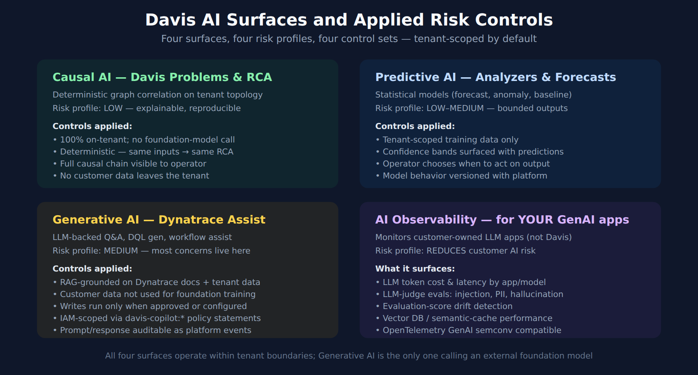

# FAQ-06: Can We Trust Davis AI? A Risk and Controls Walkthrough

> **Series:** FAQ — Frequently Asked Questions | **Reference:** 06 — Can We Trust Davis AI? A Risk and Controls Walkthrough | **Created:** May 2026 | **Last Updated:** 10/02/2026

## Overview

"Can we trust the AI?" is the most common question that surfaces when a customer evaluates Dynatrace Intelligence. The question is doing a lot of work in a small sentence — under it sit four very different surfaces (Causal AI, Predictive AI, Generative AI / Dynatrace Assist, and AI Observability for the customer's own GenAI apps), three different audiences (security/compliance, platform/SRE, executive), and a spectrum of risk concerns ranging from "where does my data go" to "can the model make a destructive change without me."

This FAQ unpacks the question. For each Davis AI surface, it states what the surface does, what data crosses what boundary, what risk profile applies, and what controls Dynatrace already has in place to address that risk. It also flags the parts that are still evolving — because pretending there are no gaps is a worse posture than naming them.

The goal is to give a platform team, a security review, or an executive briefing one document they can read and come out the other side with the same mental model.

> **Scope:** Dynatrace SaaS. *Dynatrace Assist* is the generative and agentic AI assistant; earlier releases called it Davis CoPilot, and its IAM service is still named `davis-copilot`. Its capabilities and IAM specifics evolve sprint-to-sprint — treat version-specific claims as approximate and verify against current docs before a security review.

---

## Table of Contents

1. [Short Answer](#short-answer)
2. [The Four Davis AI Surfaces](#surface-map)
3. [Data Residency and Tenant Isolation](#residency)
4. [Model Training Boundary](#training-boundary)
5. [Hallucination and Accuracy Controls](#hallucination)
6. [Autonomy Boundaries — Human-in-the-Loop](#autonomy)
7. [Audit Trail and Explainability](#audit)
8. [Access Control](#access-control)
9. [Compliance Posture](#compliance)
10. [AI Observability for Customer GenAI Apps](#ai-observability)
11. [Decision Framework — When to Lean In vs Hold Back](#decision-framework)
12. [Common Objections and Responses](#objections)
13. [What's Still Evolving](#evolving)
14. [Recommended Approach](#recommendation)

---

## Prerequisites

| Requirement | Details |
|-------------|---------|
| **Audience** | Security/compliance reviewers, platform/SRE leaders, executive decision-makers |
| **Format** | Decision-support document — presents Dynatrace's posture and controls, no hands-on lab |
| **Deployment** | Dynatrace SaaS (Gen3 / Platform). Generative and agentic AI is available on SaaS environments on the latest Dynatrace (AWS and Azure), not on Managed; the region decides where prompts are processed (§3). |
| **Related topic series** | AIOPS (Dynatrace Intelligence), IAM (IAM Administration), WFLOW (Workflows and Alert Notifications) |
| **Related FAQ** | FAQ-03 OneAgent vs OTel (for AI Observability context on the instrumentation side) |

<a id="short-answer"></a>
## 1. Short Answer

Dynatrace Intelligence is **not one AI** — for a risk review, it is best read as four distinct surfaces with very different risk profiles. The four-surface split and the risk ratings below are community practice for structuring that review, not a Dynatrace-published risk classification:

| Surface | What it is | Risk profile | One-line posture |
|---------|------------|--------------|------------------|
| **Causal AI** | Deterministic problem detection and RCA over tenant topology | LOW | No foundation model involved; fully on-tenant; explainable by construction. |
| **Predictive AI** | Statistical analyzers — forecasts, anomaly detection, baselines | LOW–MEDIUM | Tenant-scoped models; outputs are bounded numerics with confidence; operator decides what to act on. |
| **Generative AI (Dynatrace Assist)** | LLM-backed Q&A, DQL generation, workflow assistance | MEDIUM | RAG-grounded; customer data not used to train foundation models; write actions run only when approved or customer-configured; IAM-scoped; auditable. |
| **AI Observability** | Monitoring of the *customer's own* LLM/GenAI applications | REDUCES customer AI risk | This is a *risk-mitigation tool* for the customer's GenAI stack — it surfaces cost, latency, and errors, and — with LLM-as-a-judge evaluations — hallucination, prompt-injection, and quality-drift scores for your own AI apps. |

**The headline:** the surfaces customers worry about most (data residency, model training, hallucination, runaway autonomy) all map primarily to the Generative AI surface — and that is also the surface where Dynatrace has applied the most explicit controls. The other three surfaces inherit the general platform posture (tenant isolation, IAM, audit) and add little incremental AI-specific risk.

> <sub>**Sources:** [Dynatrace Intelligence (DT docs)](https://docs.dynatrace.com/docs/dynatrace-intelligence) — *"Dynatrace Intelligence can propose and run approved actions through agentic workflows and built-in agents operating under policy guardrails"* (Preview), [Agentic and generative AI (DT docs)](https://docs.dynatrace.com/docs/dynatrace-intelligence/agentic-and-generative-ai), [Dynatrace AI Observability (DT docs)](https://docs.dynatrace.com/docs/observe/dynatrace-for-ai-observability).</sub>

<a id="surface-map"></a>
## 2. The Four Davis AI Surfaces



<!-- MARKDOWN_TABLE_ALTERNATIVE
| Surface | Data path | Foundation model? | Primary controls |
|---------|-----------|-------------------|------------------|
| Causal AI | Tenant topology → on-tenant graph correlation → problem card | No | Determinism, explainability, no external call |
| Predictive AI | Tenant metrics → on-tenant statistical model → forecast/anomaly | No | Confidence bands, operator decides |
| Generative AI (Dynatrace Assist) | User prompt + tenant context (+ agentic tool-call results) → foundation model (hosted by an enterprise vendor — e.g. Microsoft Azure AI, AWS Bedrock) → grounded response | Yes (vendor-hosted, reached through Dynatrace) | RAG, no-training boundary, HITL, IAM, audit |
| AI Observability | Customer's LLM app telemetry → Dynatrace ingest | (monitors customer's models; optional LLM-as-a-judge evaluations) | Standard ingest controls; OpenTelemetry GenAI semconv |
For environments where SVG doesn't render
-->

### Why this split matters for risk review

In community practice, a blanket "we use AI" statement collapses very different risk profiles into one scary phrase. A precise statement does the opposite:

- **Causal AI** has the lowest incremental risk of anything Dynatrace ships — it is deterministic graph analysis over data that's already in the tenant, with no foundation-model call and no external data flow. The "AI" label is technically correct but historically loaded.
- **Predictive AI** runs statistical models (forecasting, anomaly detection, baselining) on tenant data. The outputs are bounded numeric predictions with confidence intervals. The risk is *acting on a forecast* — which is an operator decision, not the model's.
- **Generative AI** is the surface that triggers most concerns: a foundation model is involved, the model is large, its outputs are unbounded text, and intuitively it "could say anything." This is where the controls below apply most heavily.
- **AI Observability** is on the other side of the table entirely — it is Dynatrace observing the customer's GenAI apps, not Dynatrace using AI. For a customer running their own LLM applications, this surface *reduces* their AI risk by giving them visibility into hallucinations, prompt injection, cost, and drift.

In community practice, the most productive framing in a security review is to walk the four surfaces explicitly and let the reviewer apply different scrutiny to each. Treating "Davis AI" as one thing usually leads to over-broad concerns about the low-risk surfaces and under-precise questions about the high-risk one.

> <sub>**Sources:** [Dynatrace Intelligence (DT docs)](https://docs.dynatrace.com/docs/dynatrace-intelligence), [Agentic and generative AI (DT docs)](https://docs.dynatrace.com/docs/dynatrace-intelligence/agentic-and-generative-ai), [Dynatrace AI Observability (DT docs)](https://docs.dynatrace.com/docs/observe/dynatrace-for-ai-observability).</sub>

<a id="residency"></a>
## 3. Data Residency and Tenant Isolation

The first question in most security reviews: *where does our data go?*

### Causal AI and Predictive AI

Both run entirely within the tenant boundary. The data they operate on (spans, logs, metrics, events, topology) is already in the tenant; the models that process it are part of the Dynatrace platform serving that tenant; the outputs (problems, forecasts, anomalies) land back in the tenant. **No data leaves the tenant boundary as part of these features.**

### Generative AI (Dynatrace Assist)

Assist is the surface where the data path is more nuanced. A prompt from a user typically combines:

1. The user's literal question.
2. Context that Dynatrace assembles to ground the answer — relevant tenant data (entities, recent problems, schemas), Dynatrace documentation, DQL grammar references.
3. The conversation history.

This composite prompt is sent to a foundation model that an enterprise vendor hosts, not Dynatrace: *"Your prompts are sent to LLMs hosted by enterprise vendors such as Microsoft Azure AI and AWS Bedrock, which power Dynatrace Intelligence agentic and generative AI."* Each request travels *"over an SSL-encrypted service, processed by respective enterprise vendors, and sent back to Dynatrace."* The vendors *"don't store the data you submit or the responses you receive"* — but Dynatrace itself *"may store the prompts submitted to Dynatrace Intelligence agentic and generative AI and the responses provided by the LLMs"*, and for Agentic Dynatrace Assist the results of intermediate tool calls too. A security review should treat the vendor as a sub-processor on the prompt path.

**What does cross a boundary**: prompt content goes to the vendor-hosted foundation model and back — and in agentic mode, more than the prompt: *"Agentic Dynatrace Assist shares some additional information, such as tool call results, with enterprise vendors hosting the LLMs that Dynatrace agentic and generative AI are based on."* Agentic Assist's tools include *"generating and executing DQL queries"*, so the rows such a query returns — within the asking user's permissions (§8) — can reach the vendor. Agentic mode is not an edge case: once its prerequisites are met, Assist and the embedded conversation starters run in agentic mode by default. PII masking applies to standard generative AI (1.305+); for agentic AI, PII *blocking* is the control, and *"Starting with Dynatrace version 1.345+, PII blocking is disabled by default for new environments and environments where Agentic AI was not already enabled."* If prompts may carry PII, turn it on under **Settings > Dynatrace Intelligence > Generative and agentic AI**. **What does not cross a boundary**: the tenant's data as a corpus. What is sent is the prompt, its grounding context, and what the tools return for that question — not your raw logs/spans/metrics in bulk.

### Tenant region

Assist inference is region-bound at **continental** granularity, not at your tenant's region: *"If your environment is located in EMEA, your prompts are processed in an EU region. If your environment is located in NORAM, LATAM, or APAC, your prompts are processed in a US region."* For EMEA tenants that keeps prompts in the EU. For **APAC and LATAM tenants it means prompts are processed in the US** — check that against your data-residency requirement before enabling generative or agentic AI. The page does not address FedRAMP. Availability itself is not regional: *"Dynatrace Intelligence agentic and generative AI will be available for all Dynatrace SaaS customers using the latest Dynatrace. Both AWS and Azure accounts are supported."* It *"is not available for Dynatrace Managed customers."*

> <sub>**Sources:**</sub>
> - <sub>[Agentic and generative AI data privacy (DT docs)](https://docs.dynatrace.com/docs/dynatrace-intelligence/agentic-and-generative-ai/agentic-and-generative-ai-data-privacy) — the vendor-hosting, storage, region and PII-blocking statements above, all quoted verbatim (page updated 09/11/2026, read 09/24/2026). Also:</sub>
> - <sub>[Agentic and generative AI FAQ (DT docs)](https://docs.dynatrace.com/docs/dynatrace-intelligence/agentic-and-generative-ai/agentic-and-generative-ai-faq) — the tool-call-results and availability statements, quoted verbatim (read 10/02/2026)</sub>
> - <sub>[Get started with agentic and generative AI (DT docs)](https://docs.dynatrace.com/docs/dynatrace-intelligence/agentic-and-generative-ai/agentic-and-generative-ai-getting-started) — *"generating and executing DQL queries"*; agentic mode is the default once prerequisites are met (read 10/02/2026)</sub>
> - <sub>**Derived:** that tool-call results can include DQL result rows combines the two statements above.</sub>
> - <sub>[Trusted AI — Dynatrace Trust Center](https://www.dynatrace.com/company/trust-center/trusted-ai/)</sub>
> - <sub>[Data security controls (DT docs)](https://docs.dynatrace.com/docs/manage/data-privacy-and-security/data-security/data-security-controls)</sub>

<a id="training-boundary"></a>
## 4. Model Training Boundary

The second question in most security reviews: *is our data used to train your AI models?*

### Foundation models

The Dynatrace posture is that customer tenant data is **not used to train the foundation models** that back Dynatrace Assist. The foundation models are hosted by enterprise vendors (§3), and neither those vendors nor Dynatrace feed customer prompts back into them. The one model Dynatrace fine-tunes itself — the custom DQL generation model — is tuned on internal data: *"For the custom DQL generation model, we use internally generated data that's sourced from the DQL queries executed by Dynatrace employees."* and *"We don't use customer data at any stage of the fine-tuning process."*

This is the no-training boundary. It is the load-bearing commitment for most enterprise procurement reviews. Verify it against the current Trust Center language and your contract — both because phrasing tightens over time and because it is the kind of commitment that benefits from being in the agreement, not just in marketing copy.

### Tenant-scoped models (Predictive AI)

The statistical models that drive Predictive AI (forecasting, anomaly baselines) *are* trained on tenant data — but the training is **tenant-scoped**. Your baselines come from your data; another tenant's baselines come from theirs. There is no cross-tenant model. This is different from foundation-model training and is generally what customers want.

### Causal AI

Causal AI does not train. It is a deterministic graph algorithm — same inputs always produce the same RCA. There is no model to update with experience; the "learning" is the topology itself, which is observed, not trained.

### RAG-grounding vs training

A common confusion: "if Assist uses our tenant data to answer questions, isn't that training?" No. **Grounding (RAG) is reading; training is rewriting weights.** When Assist answers a question about your tenant, it retrieves relevant tenant context and includes it in the prompt for one specific answer — your data does not change the underlying model. The next user (in any tenant) does not get a model that has been altered by your data.

> <sub>**Sources:** [Agentic and generative AI data privacy (DT docs)](https://docs.dynatrace.com/docs/dynatrace-intelligence/agentic-and-generative-ai/agentic-and-generative-ai-data-privacy) — verbatim: *"Enterprise vendors don't use the prompts to fine-tune or improve any models or services, or to train models across customers or environments."* (plus the custom DQL model quotes above). [Trusted AI — Dynatrace Trust Center](https://www.dynatrace.com/company/trust-center/trusted-ai/) — verbatim: *"Causal AI and Predictive AI are trained only on the data of the specific customer using Dynatrace Intelligence"* and *"Humans control each phase of the Dynatrace Intelligence lifecycle."* [Agentic and generative AI FAQ (DT docs)](https://docs.dynatrace.com/docs/dynatrace-intelligence/agentic-and-generative-ai/agentic-and-generative-ai-faq) — the RAG-vs-training distinction, verbatim: *"Dynatrace Intelligence generative AI is based on a retrieval augmented generation (RAG) approach, which means that data and additional context is used only to enrich prompts. The underlying foundation model doesn't learn from this."*</sub>

<a id="hallucination"></a>
## 5. Hallucination and Accuracy Controls

The third concern in most security reviews: *what if the AI is wrong?*

### Causal AI

Not subject to hallucination. The outputs are deterministic causal chains over real topology. If the RCA is wrong, the cause is a topology gap (the dependency the algorithm doesn't know about), not invention.

### Predictive AI

Subject to forecast error, not hallucination. Forecasts come with confidence bands; anomalies come with statistical scores. The mitigation is reading the confidence — a 95% confidence interval that spans an order of magnitude is the model telling you "I'm not sure," which is a different posture than confidently fabricating.

### Generative AI (Dynatrace Assist)

This is the surface where hallucination is a real concern. The table groups the controls that apply — the grouping is community practice for a review conversation; Dynatrace documents each control on its own:

| Control | What it does |
|---------|--------------|
| **RAG grounding on Dynatrace docs** | When Assist answers a "how does X work" question, it retrieves the relevant Dynatrace docs and grounds the answer there — reducing invention of feature behavior. |
| **RAG grounding on tenant data** | When Assist answers a "what is happening in my tenant" question, it retrieves real entities/problems/metrics rather than inventing them. |
| **DQL generation is verifiable** | The output is a DQL query the user can read, edit, and *execute* — the round-trip (`explain in natural language` → DQL → `execute` → results) gives the user a verification path that doesn't exist for prose answers. |
| **Bounded action surface** | What Assist runs on its own is read-only — it can auto-execute the DQL it generates. Changes go through approved or customer-configured workflows (§6). |
| **Citation in answers** | Where applicable, Assist surfaces the doc reference or entity it grounded on — letting the user verify the source. |

### Operator-side mitigation

The most reliable hallucination control is the *operator habit* of treating generative answers as drafts. In community practice, the teams that get the most value out of Assist use it for "first draft of a DQL query," "first pass at interpreting a problem," "first explanation of an unfamiliar feature" — and then verify. This is the same posture that applies to GenAI in software development generally and is not Dynatrace-specific.

> <sub>**Sources:** [Agentic and generative AI (DT docs)](https://docs.dynatrace.com/docs/dynatrace-intelligence/agentic-and-generative-ai), [Dynatrace Query Language (DT docs)](https://docs.dynatrace.com/docs/platform/grail/dynatrace-query-language).</sub>

<a id="autonomy"></a>
## 6. Autonomy Boundaries — Human-in-the-Loop

The fourth concern in most security reviews: *can the AI take destructive action on its own?*

### What Davis can do unattended

| Surface | Unattended action |
|---------|-------------------|
| Causal AI | Detect a problem, open a problem card, attribute root cause within tenant topology |
| Predictive AI | Emit a forecast, raise an anomaly event, populate a baseline |
| Generative AI (Dynatrace Assist) | Answer a question; generate a DQL query — and run it: the documentation says Assist *is capable of auto-executing generated DQL queries*. DQL reads data; it runs with the asking user's permissions. Those queries are billed — *"subject to licensing consumption according to your existing licensing agreement"* — and *"you can choose to generate DQL only, without executing it."* |
| Agentic root cause analysis (SaaS 1.348 — pre-release, staged tenant rollout planned from 09/22/2026) | When a problem is detected, investigate contributing factors across metrics, logs, and traces and surface findings on the problem. Verify it has reached your tenant; until then, Causal AI's root-cause attribution above is the unattended surface |
| Agentic workflows and built-in agents (Preview) | Propose actions and run them once *approved*, under policy guardrails. Preview — verify availability on your tenant before relying on it |

None of the generally available surfaces above write to your infrastructure or change tenant configuration; the Preview agentic-workflow row runs only approved actions. They read data and produce findings and suggestions inside the Dynatrace tenant — so the review question for Generative AI is *what data can the asking user read*, not *whether a human clicks Run*.

### What requires human-in-the-loop

| Action | Why it requires HITL |
|--------|----------------------|
| Acting on a Workflow remediation action | Workflows are configured deliberately; the AI may *suggest* a workflow, but execution is governed by the workflow's own access scoping and trigger rules. |
| Modifying tenant configuration (settings, IAM policies, alerting rules) | These are explicit operator actions through configured pathways. Assist may help author the change; the change is applied through the same audit and IAM path as any other config change. |
| Triggering external systems (ticketing, paging, ChatOps) | Handled by Workflows with their own credentials, scopes, and policies. |

### The principle

In community practice, the platform's autonomy posture is summarized as: **AI surfaces produce findings and suggestions; humans (or explicitly configured, scoped automation) apply changes.** The summary is this entry's reading of the documented mechanics above, not a Dynatrace policy statement — and it is the choice that most enterprise risk reviewers want to hear, because the alternative ("the AI made the change unattended") is the one that triggers regulatory and operational concerns.

In community practice, the agentic-workflow conversation often comes up here: *can Davis act autonomously through Workflows?* The honest answer is *yes, if the customer configures it that way, and within the scopes the customer grants*. Dynatrace Assist suggesting a workflow that, when executed, takes an automatic remediation is the same as any other workflow in the platform — governed by the workflow's own credentials, IAM scope, and configured triggers. The autonomy lives in the *customer's workflow configuration*, not in the AI.

> <sub>**Sources:** [Agentic and generative AI (DT docs)](https://docs.dynatrace.com/docs/dynatrace-intelligence/agentic-and-generative-ai) — *"is capable of auto-executing generated DQL queries."*, [Agentic and generative AI FAQ (DT docs)](https://docs.dynatrace.com/docs/dynatrace-intelligence/agentic-and-generative-ai/agentic-and-generative-ai-faq) — the licensing and generate-only quotes, [Dynatrace Intelligence (DT docs)](https://docs.dynatrace.com/docs/dynatrace-intelligence) — *"Dynatrace Intelligence can propose and run approved actions through agentic workflows and built-in agents operating under policy guardrails"* (Preview), [SaaS 1.348 release notes (DT docs)](https://docs.dynatrace.com/docs/whats-new/saas/sprint-348) — *"Dynatrace Intelligence can now run agentic workflows for problem root cause analysis."* (pre-release, read 09/28/2026), [Workflows (DT docs)](https://docs.dynatrace.com/docs/analyze-explore-automate/workflows).</sub>

<a id="audit"></a>
## 7. Audit Trail and Explainability

The fifth concern in most security reviews: *can we see what the AI did, after the fact?*

### Causal AI — explainable by construction

A Davis problem card surfaces the causal chain: the events, the entities, the dependencies, the timeline. Click through and you see the graph the algorithm followed. There is no "the model decided" black-box step — the causal chain is the explanation.

### Predictive AI — analyzers are inspectable

Forecasts and anomaly detections come with their confidence ranges and the data window they were computed on. The model behavior (which algorithm, which parameters) is part of the platform version — Dynatrace versions Predictive analyzer behavior with platform release notes.

### Generative AI — auditable as platform events

Assist interactions are auditable in two complementary ways:

1. **Queryable GenAI events.** Generative AI interactions are recorded in `dt.system.events` as `GENAI_EVENT` records — skill invocations from Dynatrace Assist, and tool invocations through the Dynatrace MCP gateway — each carrying the user who made it. Reading them needs the `storage:system:read` permission:

   ```dql
   fetch dt.system.events, from:-30d
   | filter event.kind == "GENAI_EVENT"
   | summarize {events = count(), users = countDistinct(user.id), with_prompt = countIf(isNotNull(user_input)), with_response = countIf(isNotNull(response))}, by:{event.provider, event.type}
   | sort events desc
   ```

   On the validation tenant (10/02/2026, 30 days) this returned 269 `GenAI Skill Invocation` events from `DAVIS_COPILOT` — 267 carrying the prompt text verbatim in `user_input`, 261 carrying the answer in `response`, and all 269 carrying `user.email` — plus 2,352 `MCP Tool Invocation` and 270 `MCP Init` events from `MCP_GATEWAY`, which carry no prompt or answer. **Prompts and answers are stored as typed and as returned**, so anything a user pastes into a prompt, and anything Assist answers, is retained in these events: treat read access to them as access to potentially sensitive data (§3).
2. **Operator-visible context.** The grounding (which docs, which tenant entities) and the generated output are visible to the user who asked. There is no hidden "private" answer that differs from what was shown.

For procurement reviews that ask "can we audit who asked Dynatrace Assist what?" — the query above answers who asked, what they asked, and what Assist answered. Dynatrace documents the logging — *"All interactions with Dynatrace Intelligence generative AI are logged in Grail as dt.system.events"* — and ships a ready-made dashboard, **Dynatrace Intelligence Feature Adoption**, for reviewing prompts and responses. How long these events are kept is a `dt.system.events` retention question; verify it for your environment at review time.

### What you can do with the audit trail

- Reconstruct what Assist was asked about an incident during post-incident review.
- Detect over-use of Assist for sensitive prompts (data egress monitoring on the prompt side).
- Demonstrate to a regulator that AI-assisted actions trace back to human operators who reviewed them.

> <sub>**Sources:** [Agentic and generative AI FAQ (DT docs)](https://docs.dynatrace.com/docs/dynatrace-intelligence/agentic-and-generative-ai/agentic-and-generative-ai-faq) — the logging quote above, [Agentic and generative AI (DT docs)](https://docs.dynatrace.com/docs/dynatrace-intelligence/agentic-and-generative-ai), [Dynatrace audit log (DT docs)](https://docs.dynatrace.com/docs/manage/account-management/audit-logs). **Dictionary:** `event.kind` (`stable`), `user.id` (`stable`), `user.email` (`stable`); no row for `user_input` or `response` under `filter in(name, {…})`, read 10/02/2026 (control: the same filter returned the three `stable` rows) — `user_input` and `response` were read from the event records themselves. The `GENAI_EVENT` query executed against a live tenant 10/02/2026 with no notifications.</sub>

<a id="access-control"></a>
## 8. Access Control

The sixth concern in most security reviews: *who can use the AI, and what can they ask it about?*

### IAM-scoped Assist access

Dynatrace Assist is governed by the same IAM that governs everything else in the platform. Specifically:

- **A user must have Assist permission** to interact with it at all (granted via IAM policy statements on the `davis-copilot:*` service — conversational chat, NL→DQL, DQL→NL, document search).
- **Assist inherits the user's data scope.** *"All agentic Dynatrace Assist calls are done within the scope of your user permissions and the results won't include anything outside of it."* When Assist grounds an answer on tenant data, it grounds on the data the *asking user* can see — not the data the platform as a whole has. A user with management-zone-scoped access gets Assist answers grounded only on their permitted data.
- **Assist does not bypass IAM to read your data.** This is the load-bearing claim. The model does not run as a privileged identity that sees everything; it runs as the user.

### Policy examples (verified against current IAM policy reference)

```
ALLOW davis-copilot:conversations:execute;   // Assist chat interface
ALLOW davis-copilot:nl2dql:execute;          // Natural-language → DQL
ALLOW davis-copilot:dql2nl:execute;          // DQL → natural-language summary
ALLOW davis-copilot:document-search:execute; // Doc search skill
// Davis analyzers (Predictive AI) are governed separately:
ALLOW davis:analyzers:read;
ALLOW davis:analyzers:execute;
// Agentic Assist — its tools and stored conversations additionally need:
ALLOW document:documents:read;
ALLOW document:documents:write;
ALLOW document:documents:delete;
ALLOW hub:catalog:read;
ALLOW mcp-gateway:servers:invoke;
ALLOW mcp-gateway:servers:read;
```

Combined with the user's existing data-access scopes (storage, settings, entities), this composes into the user's effective Assist capability. The IAM model is the same as any other Dynatrace service. Without the agentic block, a user gets an Assist that cannot call its tools. The statement names above were re-read against the IAM policy reference and the agentic getting-started page on 10/02/2026 — re-verify when authoring policies, since new Assist skills and tools add new statements over time.

### Practical implication

A security reviewer asking "can a junior engineer use Assist to ask about sensitive production data?" gets a precise answer: *only if that junior engineer can already see sensitive production data through normal IAM*. Assist is not a side channel.

> <sub>**Sources:** [IAM policy reference (DT docs)](https://docs.dynatrace.com/docs/manage/identity-access-management/permission-management/manage-user-permissions-policies/advanced/iam-policystatements) — re-read 10/02/2026, enumerates `davis-copilot:conversations:execute`, `davis-copilot:nl2dql:execute`, `davis-copilot:dql2nl:execute`, `davis-copilot:document-search:execute`, `davis:analyzers:read`, `davis:analyzers:execute`, `mcp-gateway:servers:invoke` and `mcp-gateway:servers:read`. Also: [Agentic and generative AI (DT docs)](https://docs.dynatrace.com/docs/dynatrace-intelligence/agentic-and-generative-ai). [Get started with agentic and generative AI (DT docs)](https://docs.dynatrace.com/docs/dynatrace-intelligence/agentic-and-generative-ai/agentic-and-generative-ai-getting-started) — the agentic permission list (*"To get access to the full functionality of Dynatrace Intelligence agentic AI, including the tools, you'll need the following permissions"*) and the user-scope quote above.</sub>

<a id="compliance"></a>
## 9. Compliance Posture

The seventh concern in most security reviews: *which frameworks does this satisfy?*

### Inherited platform compliance

Davis AI surfaces inherit the Dynatrace platform's security program. The Trust Center's Trusted-AI page names the audits behind it: *"our regular independent security audits (FedRAMP, ISO 27001, SOC 2)"*. Any other framework your review needs (GDPR, HIPAA, a regional scheme) is not listed on that page — treat each one, and the listed ones too, as "verify in writing for your tenant region" rather than assumed.

### EU AI Act considerations (Derived)

The EU AI Act tiers AI systems by risk level. Mapping Dynatrace's Davis surfaces onto the tiers (community-level synthesis, not Dynatrace guidance):

| Davis surface | Likely EU AI Act tier | Reasoning |
|---------------|----------------------|-----------|
| Causal AI | **Minimal risk** | Deterministic correlation; not a "system that uses ML to make decisions affecting people." |
| Predictive AI | **Minimal–Limited risk** | Statistical forecasting on infrastructure metrics; not an automated-decision system for individuals. |
| Generative AI (Assist) | **Limited risk** | A general-purpose AI assistant; transparency requirements apply (user knows they are interacting with AI), which Dynatrace surfaces explicitly. |
| AI Observability | **N/A** | Dynatrace is not the AI provider here; the customer's GenAI app is the regulated system, and this feature *supports* the customer's compliance. |

This mapping is community-level guidance for orientation. Authoritative EU AI Act applicability requires legal review of your specific use case.

### NIST AI Risk Management Framework

In community practice, the NIST AI RMF's four functions (Govern, Map, Measure, Manage) are mapped onto the Davis AI controls described in §§3–8: tenant-scoping addresses Govern/Map; confidence bands and audit trails address Measure; HITL and IAM address Manage. That mapping is an orientation, not an assessment — a review that scores against the RMF still has to check each function against your own configuration (IAM grants, PII blocking, agentic mode).

> <sub>**Sources:** [Trusted AI — Dynatrace Trust Center](https://www.dynatrace.com/company/trust-center/trusted-ai/) — the audit list quoted above, [GDPR compliance (DT docs)](https://docs.dynatrace.com/docs/manage/data-privacy-and-security/data-privacy/sensitive-data-center). **Derived:** the EU AI Act and NIST AI RMF mappings are orientations for a compliance conversation, not Dynatrace's legal positions</sub>

<a id="ai-observability"></a>
## 10. AI Observability for Customer GenAI Apps

This surface is on the *other side of the question*. It is not Dynatrace using AI on your data; it is Dynatrace giving you visibility into *your own* GenAI applications. For customers building LLM-backed apps (chatbots, agents, copilots, RAG pipelines), this is a risk-reduction tool, not a risk source.

### What it surfaces

| Signal | Why it matters |
|--------|----------------|
| **Token cost per app/model/user** | LLM spend can explode silently; this is the single most-cited operational pain in production GenAI. |
| **End-to-end latency** | LLM-call latency dominates user-perceived latency in most GenAI apps. Trace-level visibility into the model call vs the retrieval vs the embedding step is load-bearing for SLO. |
| **Response-quality evaluations** | Online LLM-as-a-judge evaluations, run with the open-source `dt-evals` CLI, score production traces for hallucinations, faithfulness to retrieved context, PII leakage, prompt injection, and harmful bias. Each score is written back as a business event linked to its trace. |
| **Quality drift** | `dt-evals` compares recent evaluation scores against a rolling baseline of earlier results to surface regressions. |
| **Vector DB and semantic-cache performance** | Vector databases and semantic caches (for example Milvus, Weaviate, Qdrant) are monitored to identify performance bottlenecks and usage anomalies in the retrieval step. |

### OpenTelemetry GenAI semantic conventions

Dynatrace's AI Observability is compatible with the OpenTelemetry GenAI semantic conventions — meaning if you instrument with OpenTelemetry (Python, JS, etc.), the spans your app emits surface natively. This matters for the "open source instrumentation, vendor analysis" posture many platform teams prefer for AI workloads.

### Why this is a risk *reducer*

In community practice, the framing that lands is AI Observability as a risk *reducer*. A common board-level concern: *we're shipping a customer-facing LLM app — what could go wrong?* The honest answer is: cost, latency, hallucination, prompt injection, drift. AI Observability turns each of those from an unknown into a metric you can SLO against. For a security review that asks "are you taking AI risk in production?", the response is *yes, and here is the instrumentation that gives us the same posture for the AI workload that we have for the rest of the stack.*

> <sub>**Sources:** [Dynatrace AI Observability (DT docs)](https://docs.dynatrace.com/docs/observe/dynatrace-for-ai-observability) — *"Run online, LLM-as-a-judge evaluations against production AI and agent traces and prompts already available in Dynatrace"*; *"dt-evals includes more than 10 built-in LLM judge evaluators"*; vector DBs and semantic caches monitored *"to help identify performance bottlenecks and usage anomalies"* (read 10/02/2026), [OpenTelemetry GenAI semantic conventions](https://opentelemetry.io/docs/specs/semconv/gen-ai/).</sub>

<a id="decision-framework"></a>
## 11. Decision Framework — When to Lean In vs Hold Back

Not every team should adopt every surface on day one. The maturity curve below is community practice, not Dynatrace's own recommendation:

| Davis surface | Adopt immediately | Adopt after pilot | Hold pending governance |
|---------------|------------------|-------------------|------------------------|
| **Causal AI** | Yes — comes with the platform, low-risk, immediate value | — | — |
| **Predictive AI — forecasts/anomalies for visibility** | Yes — read-only, informs operators | — | — |
| **Predictive AI — auto-triggering Workflows on anomalies** | — | Yes, after a few cycles of confidence calibration | — |
| **Generative AI — read-only Q&A and DQL generation** | Yes — high productivity, low risk when used as draft-then-verify | — | — |
| **Generative AI — broadly deployed across the team** | — | Yes, after an IAM scoping and audit-log review | — |
| **Generative AI — connected to write-action Workflows** | — | — | Yes — explicit governance: which workflows, which scopes, what audit |
| **AI Observability — instrument GenAI apps you operate** | Yes if you operate any GenAI app — this is risk-reduction | — | — |

### Heuristics for lean-in

- The surface's outputs are reviewed by humans before they cause action.
- The IAM model gives you confidence about who can use the surface and on what data.
- The audit trail satisfies your compliance team's after-the-fact reconstruction needs.

### Heuristics for hold

- The surface's outputs can trigger autonomous writes (workflows, ticketing, paging) without your explicit scoping.
- The audit/observability of the surface itself is unclear to your team.
- Your compliance framework (FedRAMP, regulated industry) has unresolved guidance on the surface.

In community practice, the pattern that produces the best outcomes is: **Causal AI + Predictive AI + read-only Assist adopted immediately; Assist-driven write actions through Workflows treated as an explicit governance decision per workflow.** This separates the value (which is mostly in the read surfaces) from the risk (which is mostly in autonomous writes) and lets each be evaluated on its own terms.

> <sub>**Sources:** [Dynatrace Intelligence (DT docs)](https://docs.dynatrace.com/docs/dynatrace-intelligence), [Workflows (DT docs)](https://docs.dynatrace.com/docs/analyze-explore-automate/workflows).</sub>

<a id="objections"></a>
## 12. Common Objections and Responses

The actual "settle concerns" part. Short objection → short response. Where the response depends on customer-specific verification, that is flagged.

**"Our data will be used to train someone else's model."**
No. Customer tenant data is not used to train the foundation models that back Dynatrace Assist. Predictive AI models are tenant-scoped (your data trains your baselines, not anyone else's). Causal AI doesn't train. Verify the exact wording in the current Trust Center and your master agreement.

**"The AI can hallucinate, so we can't trust it for production."**
Hallucination applies to the Generative AI surface, not to Causal or Predictive AI. The mitigation is the same pattern that applies to any GenAI tool: read the output, verify, use as draft. The most-used outputs (DQL queries) are *verifiable by execution* — a feature most LLM products don't offer.

**"The AI could take destructive action without us knowing."**
Davis AI does not write to your infrastructure or configuration outside Workflows that the customer configures and scopes with the customer's own credentials. It does act unattended on the *read* side — Assist can run the DQL it generates, and agentic root cause analysis (SaaS 1.348, staged rollout) investigates problems on its own — always within the permissions of the user or the platform (§6). Agentic workflows and built-in agents (Preview) run actions only once approved. The write autonomy is configured or approved, not implicit.

**"We can't audit what the AI did."**
Causal AI is explainable by construction (the causal chain is the explanation). Predictive AI is versioned with the platform and surfaces confidence. Assist interactions are auditable as platform events. The exact audit retention and schema should be verified against current docs.

**"Our compliance framework hasn't approved AI features yet."**
Then the right move is to adopt the non-Generative surfaces (Causal, Predictive) — which are AI-labeled but don't carry the foundation-model risk profile — and put Assist through your compliance process. The four-surface taxonomy in §2 is the framing that lets compliance treat each surface differently.

**"We're worried about EU AI Act / FedRAMP / SOC 2."**
EU AI Act applicability for the Generative surface is *Limited Risk* in the community-level read — verify with your legal team. FedRAMP, ISO 27001 and SOC 2 are the independent audits the Trust Center names for the platform (§9) — confirm scope for your tenant region in writing.

**"We don't want AI features on, period."**
The Causal AI and Predictive AI surfaces are core platform features and broadly always-on. The Generative AI surface (Assist) has an explicit environment switch — **Settings → Dynatrace Intelligence → Generative and agentic AI → Enable generative AI** — which is on by default for tenants created from Dynatrace 1.335 onwards. Turn it off to opt out for the whole environment; independently, you can choose not to grant the `davis-copilot:*` capability to any user.

**"AI Observability — does that mean Dynatrace AI is looking at our AI apps?"**
No. AI Observability is *your team* observing *your own* GenAI apps using Dynatrace as the observability platform — same as you would use Dynatrace to observe any other application stack. By default no Dynatrace AI operates on your app's outputs; it's standard OpenTelemetry-based instrumentation surfaced in Dynatrace. The exception is one you choose to run: LLM-as-a-judge evaluations (`dt-evals`), where an LLM judge scores production traces and writes the scores back to Dynatrace (§10).

> <sub>**Sources:** [Get started with agentic and generative AI (DT docs)](https://docs.dynatrace.com/docs/dynatrace-intelligence/agentic-and-generative-ai/agentic-and-generative-ai-getting-started) — *"You can see and change the setting in Settings > Dynatrace Intelligence > Generative and agentic AI > Enable generative AI if you'd like to opt out."* The other claims map back to the Sources blocks in §§3–10 above. **Softened** throughout — these are summary responses; the load-bearing verifications happen in the cited sections.</sub>

<a id="evolving"></a>
## 13. What's Still Evolving

A risk-posture document is more credible when it names its gaps. Areas where the controls are still maturing or where Dynatrace's guidance is moving sprint-to-sprint:

- **Agentic workflows.** Agentic workflows and built-in agents that run approved actions are in Preview (§6). The combination of Assist suggesting actions + Workflows executing actions + Workflows orchestrating multi-step plans is moving toward more agentic behavior. The governance model — which scopes, which approvals, which audit — is evolving with the capability.
- **Model versioning transparency.** The Dynatrace Assist data-privacy page names the enterprise vendors hosting the foundation models (Microsoft Azure AI and AWS Bedrock) but does not pin a specific model version per customer-facing release. For customers with strict change-control on AI models, the version-pinning granularity is a real gap.
- **Prompt and response retention.** Prompts and answers are kept in `dt.system.events` (§7), and Dynatrace *may store* them; the pages cited here do not publish a retention window for either. Verify against current Trust Center / data-residency language for any compliance review.
- **Region of processing, not availability.** Generative and agentic AI is available on every SaaS environment on the latest Dynatrace (AWS and Azure) and not on Managed (§3); what the region decides is where prompts are processed. FedRAMP is not addressed on the data-privacy page — verify.
- **Cross-tenant features.** Most Davis AI is strictly tenant-scoped today. Any future cross-tenant feature (e.g., "benchmark your performance against other tenants in your industry") would re-open the data-residency conversation — but does not exist today.
- **Customer-supplied LLM integration.** Some customers want to point Assist at their own foundation model (bring-your-own-LLM). This is a roadmap conversation, not a current capability — and would change the data-path posture if it lands.

Naming these explicitly is the right posture for a risk review. They are not red flags; they are *moving parts*. The right answer to each is "verify at the time of your review against current docs and your contract."

> <sub>**Sources:** [Agentic and generative AI FAQ (DT docs)](https://docs.dynatrace.com/docs/dynatrace-intelligence/agentic-and-generative-ai/agentic-and-generative-ai-faq) — availability (quoted in §3). The other items are community-derived observations; no single Dynatrace doc enumerates these gaps. **Softened** throughout.</sub>

<a id="recommendation"></a>
## 14. Recommended Approach

For a customer evaluating Davis AI risk posture, a workable plan:

1. **Walk the four surfaces explicitly.** Causal, Predictive, Generative, AI Observability — don't let "AI" collapse into one decision. The risk profiles differ; the controls differ; the adoption decisions differ.
2. **Adopt Causal AI and Predictive AI immediately.** They come with the platform, carry low incremental risk, and provide most of the platform's AI value.
3. **Pilot Assist on read-only use first.** Q&A, DQL generation and execution — the surfaces where the value is high and the risk is "wrong answer, or a query that reads what the user was already allowed to read," not "destructive action."
4. **Govern write-action workflows explicitly.** Where Assist suggests workflows that execute changes, treat each workflow as an explicit governance decision: which scopes, which approvals, which audit.
5. **Adopt AI Observability for your own GenAI apps.** If your team is shipping LLM-backed applications, this surface *reduces* your AI risk by giving you cost/latency/quality/security visibility.
6. **Verify version-specific claims at review time.** Trust Center language, IAM policy statement names, audit event schemas, EU AI Act applicability — all evolve sprint-to-sprint. Treat this FAQ as the orientation; verify the load-bearing claims against current docs and your contract before signing off.
7. **Document your stance per surface.** A short internal policy that says "Causal/Predictive: enabled platform-wide; Assist: enabled for engineering, audit logged; Assist-driven workflows: per-workflow governance" gives your team a stable position to refer to.

## Summary

Davis AI is four surfaces, not one — and most of the risk concerns customers raise map specifically to the Generative AI surface (Dynatrace Assist), where Dynatrace has applied the most explicit controls: IAM-scoped data path (the prompt and, in agentic mode, tool-call results reach the vendor-hosted model — the corpus does not), no foundation-model training on customer data, RAG grounding for accuracy, human-in-the-loop for destructive actions, IAM-scoped access, auditable interactions. The other three surfaces (Causal, Predictive, AI Observability) inherit the platform's general security posture and add little incremental AI-specific risk. The right posture in a security review is to walk the four surfaces explicitly, treat each on its own terms, and verify version-specific claims against the current Trust Center and product docs at review time.

## Next Steps

- Read **AIOPS** topic series for a deeper walkthrough of each Davis AI surface and its operational use.
- Read **IAM** topic series for the policy-statement and scope mechanics that govern Assist access.
- Read **WFLOW** topic series for the workflow-side of Assist-suggested actions and how to scope them.
- Read **FAQ-03** for the AI Observability instrumentation side (OneAgent vs OpenTelemetry for GenAI apps).
- Verify current Trust Center language and IAM policy reference against the load-bearing claims in this FAQ before any procurement or compliance review.

---

<sub>*This notebook was AI-generated from community-submitted and publicly available sources. This notebook series is not officially supported by Dynatrace. Always verify information against official [Dynatrace documentation](https://docs.dynatrace.com/docs).*</sub>
