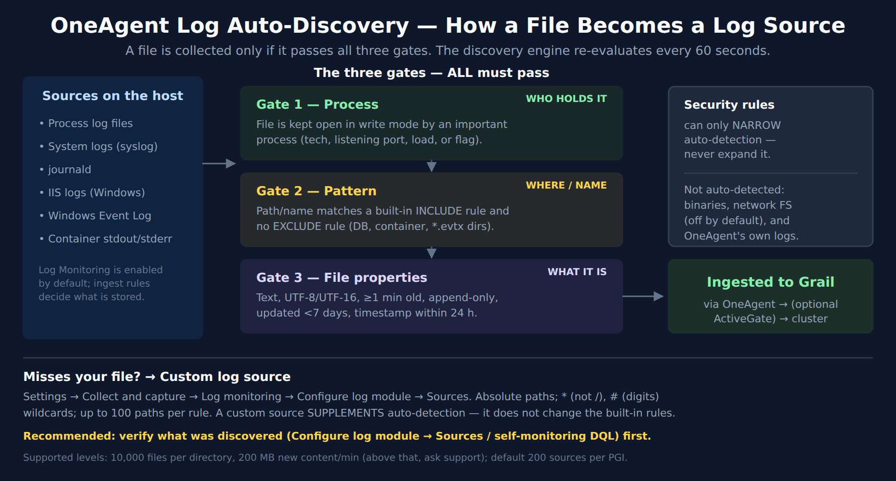

# FAQ-08: How Does OneAgent Decide Which Logs to Collect?

> **Series:** FAQ — Frequently Asked Questions | **Reference:** 08 — How OneAgent Decides Which Logs to Collect | **Created:** June 2026 | **Last Updated:** 10/02/2026

## Overview

A common surprise after deploying OneAgent is that *some* log files show up in Dynatrace automatically and others don't — with no obvious pattern from the outside. The application log under `/opt/app/logs/` appears within a minute; the one your batch job writes to `/data/exports/run.out` never does. Neither was configured by hand, so why the difference?

The answer is **log auto-discovery** — a mechanism inside OneAgent that continuously scans the host, decides which files are logs worth collecting, and starts ingesting them. It is not magic and it is not arbitrary: it applies an explicit, documented set of rules. Understanding those rules turns "why isn't my log here?" from a guessing game into a three-question checklist, and tells you exactly when to reach for a **custom log source** instead.

This entry explains how the decision is made, what gets picked up automatically versus what needs a nudge, and how to verify what was actually discovered in your environment.

---

## Table of Contents

1. [Short Answer](#short-answer)
2. [The Mental Model — Three Gates](#three-gates)
3. [The Auto-Discovery Requirements](#requirements)
4. [The Built-in Include / Exclude Rules](#builtin-rules)
5. [What's Auto-Detected vs. What Needs Help](#auto-vs-help)
6. [When Auto-Discovery Misses Your Log — Custom Log Sources](#custom-sources)
7. [Scale and Limits](#scale-limits)
8. [Recommended Approach](#recommended-approach)
9. [Common Gotchas](#gotchas)

---

## Prerequisites

| Requirement | Details |
|-------------|---------|
| **Audience** | Platform/infra engineers, SREs, and onboarding leads deciding what log coverage to expect from OneAgent and where manual configuration is needed |
| **Format** | Decision-support document — explains the discovery mechanism and the auto-vs-custom decision; no hands-on lab |
| **Deployment** | Dynatrace SaaS with Grail; Log Monitoring powered by the OneAgent log module (enabled by default). Applies to host OneAgent on Linux and Windows |
| **Related topic series** | OPLOGS (OpenPipeline log processing), OPMIG (Classic Log Monitoring → OpenPipeline), ONBRD-07 (validating discovered data), K8S (container/Kubernetes log collection), S2D (locating logs during migration) |
| **Related FAQ** | FAQ-03 (OneAgent vs OpenTelemetry — includes Windows Event Log and IIS handling) |

<a id="short-answer"></a>
## 1. Short Answer

OneAgent runs a **log auto-discovery engine** that re-evaluates the host roughly **every 60 seconds**. A file is collected automatically only when it passes **three independent gates**:

| Gate | The question it answers | Pass condition |
|------|-------------------------|----------------|
| **Process** | *Who is holding this file?* | The file is kept open, in write mode, by an **important** process — a supported technology, an open TCP listening port, sustained CPU/memory/network use, or one flagged as important |
| **Pattern** | *Where is it and what is it named?* | Its path/name matches a built-in **include** rule and no **exclude** rule |
| **File properties** | *What kind of file is it?* | Text content, supported encoding, recent activity, append-only |

If a file fails any gate, auto-discovery skips it — and the fix is almost always a **custom log source** (§6), not a tweak to the built-in rules (which you cannot expand, only narrow).

By default OneAgent auto-discovers logs from a wide range of technologies: **process log files, system logs (syslog), journald, IIS logs, Windows Event Log channels, and container `stdout`/`stderr`**. Log Monitoring is on by default; your **log ingest rules** then decide which of the discovered records are actually stored in Grail.

> <sub>**Sources:** [Log autodiscovery (DT docs)](https://docs.dynatrace.com/docs/analyze-explore-automate/logs/lma-log-ingestion/lma-log-ingestion-via-oa/lma-autodiscovery) — discovery runs "every 60 seconds"; [Log ingestion via OneAgent (DT docs)](https://docs.dynatrace.com/docs/analyze-explore-automate/logs/lma-log-ingestion/lma-log-ingestion-via-oa) — default-detected source list and ingest-rule gating; [Which are the most important processes? (DT docs)](https://docs.dynatrace.com/docs/observe/infrastructure-observability/process-groups/basic-concepts/which-are-the-most-important-processes) — the "important" criteria. **Derived:** the "three gates" framing is a synthesis of the requirements, built-in rules, and file constraints documented separately on the autodiscovery page — Dynatrace documents the conditions but does not group them this way.</sub>

<a id="three-gates"></a>
## 2. The Mental Model — Three Gates



<!-- MARKDOWN_TABLE_ALTERNATIVE
| Stage | What happens |
|-------|--------------|
| Sources on the host | Process logs, system logs, journald, IIS, Windows Event Log, container stdout/stderr |
| Gate 1 — Process | File kept open in write mode by an important process (supported technology, open TCP listening port, sustained CPU/memory/network use, or flagged important) |
| Gate 2 — Pattern | Path/name matches a built-in INCLUDE rule and no EXCLUDE rule |
| Gate 3 — File properties | Text, UTF-8/UTF-16, >=1 min old, append-only, updated <7 days, timestamp within 24h |
| Outcome | Ingested to Grail via OneAgent (optional ActiveGate) -> cluster |
| Fallback | Misses your file? Add a custom log source (supplements, never expands auto-detection) |
-->

Reading the gates in order is the fastest way to diagnose a missing log.

**Gate 1 — Process.** Auto-discovery is process-anchored, not filesystem-anchored. OneAgent finds candidate files by looking at what **important processes** have open, not by walking the whole disk. The docs put it plainly: *"The log file must be kept open by an important process."* "Important" has a documented definition, and it is not the same as deep (code-module) monitoring. A process qualifies if it is a supported application, has an open TCP listening port, exceeds 5% CPU, memory or network traffic in at least 3 of the last 5 one-minute intervals, or has been flagged by a user — *"Processes that have been defined by a user as important, for example, by enabling Log Monitoring for a process."* None of those criteria requires code-module injection. This single fact explains most surprises: a log written by a short-lived cron job, or a file no long-lived important process holds open, will not be discovered, no matter where it lives.

**Gate 2 — Pattern.** Among the files that survive Gate 1, OneAgent applies a fixed set of **built-in include/exclude rules** (§4) against the path and filename. Files in a `log`/`logs` directory, or whose names carry a `log` token, are included; database transaction logs, container runtime directories, and Windows event-trace files are explicitly excluded.

**Gate 3 — File properties.** Finally, the file itself must look like an active text log: supported encoding, recently written, above a minimum size, appended-to rather than rewritten. The full list is in §3.

A file is collected only when it clears **all three**. The gates are independent — passing two of three is not enough.

> <sub>**Sources:** [Log autodiscovery (DT docs)](https://docs.dynatrace.com/docs/analyze-explore-automate/logs/lma-log-ingestion/lma-log-ingestion-via-oa/lma-autodiscovery) — "The log file must be kept open by an important process"; [Which are the most important processes? (DT docs)](https://docs.dynatrace.com/docs/observe/infrastructure-observability/process-groups/basic-concepts/which-are-the-most-important-processes) — *"Processes with an open TCP listening port"*, the CPU/memory/network thresholds, and the user-defined criterion quoted above. **Derived:** "none requires code-module injection" reads the criteria list, which does not mention deep monitoring. **Derived:** the ordering of the three gates as a diagnostic sequence is an authoring synthesis, not a documented procedure.</sub>

<a id="requirements"></a>
## 3. The Auto-Discovery Requirements

For a file to be auto-discovered, **all** of the following must hold. These are the literal conditions from the autodiscovery reference:

| # | Requirement | Detail |
|---|-------------|--------|
| 1 | **Held open by an important process** | The file must be kept open by an *important* process (§2, Gate 1) |
| 2 | **Minimum age** | The file must have existed for at least **one minute** |
| 3 | **Supported encoding** | UTF-8 by default; also UTF-8 BOM and, if the byte-order mark is present, UTF-16LE and UTF-16BE |
| 4 | **Recent activity** | The file must have been **written to within the last 7 days** |
| 5 | **Path or name match** | The file must be in a `log` / `logs` folder (or directly one subfolder below it — `c:\log\NewFolder\NewFolder\log_file.txt` is the documented invalid example), **or** its filename must contain a `log` string preceded or followed by a period (`.`) or underscore (`_`) |
| 6 | **Recent timestamps** | Records are ingested only if their timestamp is within the **last 24 hours**; entries timestamped more than 10 minutes **ahead** of the current time are overridden |
| 7 | **Security rules** | The file path must satisfy OneAgent's security rules |

And the file must behave like a live, append-only text log:

- It **cannot be deleted earlier than a minute** after creation.
- It must be **appended** to (old content is not rewritten).
- It must have **text content** (binaries are not auto-detected — see §5).
- It must be **opened constantly**, not just briefly while a line is written.
- It must be **opened in write mode**.
- It is **checked for binary content** once it reaches the configured size threshold (default **500 bytes**; the setting is *Minimal log file size to perform binary detection*). The page names this threshold for binary detection and states no separate minimum size for discovery.

> **OneAgent 1.343 — immediate compress-or-delete rotation, Linux local drives only.** OneAgent 1.343 (released 07/28/2026) *"supports the rotation patterns in which the files are compressed or removed immediately after the rotation"* — the case the "cannot be deleted earlier than a minute after creation" bullet excludes. It lets OneAgent keep following the live file under that rotation scheme; it does **not** make compressed archives (`.gz`) collectable. Three limits on that relief matter more than the headline:
>
> - **It is Linux-only.** On Windows the constraint above is unchanged, and a rapidly rotated file there still needs a custom log source (§6).
> - **It is local drives only.** *"The supported scope is limited to Linux and only log files that are located on local drives."* Logs on NFS or other remote drives are not covered.
> - **It depends on the agent version, not the tenant version.** Fleets upgrade on their own schedule, so **verify the OneAgent version on the hosts concerned**; anything on 1.342 or earlier behaves exactly as the table describes. Expect a mixed fleet for weeks.
>
> Until the hosts you care about are on 1.343, treat the one-minute-deletion bullet as fully in force — it remains the working model.

Two of these trip people up most often. The **7-day activity window** (#4) and the **24-hour timestamp rule** (#6) are *different* checks: #4 is about when the file was last *written*, #6 is about the *timestamps inside the records*. A file actively written today but full of records dated last week will be discovered yet have its old records dropped by the timestamp rule. And the **path/name rule** (#5) is why `/data/exports/run.out` from the Overview is invisible — it is neither under a `log`/`logs` path nor does its name carry a `log` token.

> <sub>**Sources:** [Log autodiscovery (DT docs)](https://docs.dynatrace.com/docs/analyze-explore-automate/logs/lma-log-ingestion/lma-log-ingestion-via-oa/lma-autodiscovery) — requirements list, encodings, 7-day activity window, 24-hour timestamp rule, 10-minute future-timestamp override, append-only constraints, the one-subfolder path rule, and the 500-byte binary-detection threshold (*"must not be smaller than the configured size threshold (default: 500 bytes) to be checked for binary content"*), [OneAgent 1.343 release notes (DT docs)](https://docs.dynatrace.com/docs/whats-new/oneagent/sprint-343) — released 07/28/2026; *"OneAgent now supports the rotation patterns in which the files are compressed or removed immediately after the rotation."* **Derived:** the "verify the agent version per host, expect a mixed fleet" qualifier follows from agent fleets upgrading independently of tenant version.</sub>

<a id="builtin-rules"></a>
## 4. The Built-in Include / Exclude Rules

Gate 2 is driven by a fixed set of **built-in autodetector rules**. Each rule matches an operating system, a directory pattern, and a file pattern, and either **includes** or **excludes** the match. Exclude rules win where they overlap with include rules — which is how database and container-runtime paths stay out even though they may sit near `log` directories.

| OS | Directory pattern | File pattern | Action |
|----|-------------------|--------------|--------|
| All | `/Log/` | `*.xel` | Exclude |
| All | `/commitlog/` | `*.log` | Exclude |
| Windows | `/CCM/Logs/` | `*` | Exclude |
| Windows | `/MSSQL/Log/` | `*.trc` | Exclude |
| Windows | `/*MSSQL*/OLAP/Log/` | `*.trc` | Exclude |
| Windows | `MSSQL/DATA/` | `*.ldf` | Exclude |
| Windows | — | `*.evtx` | Exclude |
| Linux | `/var/log/pods/` | `*` | Exclude |
| Linux | `/var/lib/docker/containers/` | `*` | Exclude |
| All | `/` | `*[-._]log` | Include |
| All | `/` | `catalina.out*` | Include |
| All | `/log/` | `*` | Include |
| All | `/log/*/` | `*` | Include |
| All | `/logs/` | `*` | Include |
| All | `/logs/*/` | `*` | Include |
| Linux | `^/var/log/**/` | `*` | Include |

What this tells you:

- **`*[-._]log` is the filename escape hatch.** A file does not have to live under a `log`/`logs` directory — `payments-2026.log`, `audit_log`, or `app.log` anywhere on disk matches the include rule by name. (`catalina.out*` is a special-cased Tomcat include.)
- **Database transaction logs are deliberately excluded** (`*.xel`, `/commitlog/`, `*.trc`, `*.ldf`). These are not application logs and would be noise; that exclusion is by design, not a gap.
- **`*.evtx` is excluded as a file** because Windows Event Log is collected through the Event Log API, not by reading the `.evtx` files (see §5).
- **`/var/log/pods/` and `/var/lib/docker/containers/` are excluded** because Kubernetes and Docker container logs are collected via the dedicated container-log path, not as host files — excluding them here prevents double-collection.

Crucially, the security rules can only **narrow** this set — *"the custom security rules can only narrow auto-detection but not expand it."* There is no setting that adds new include rules. To collect a file the built-in rules don't match, you use a custom log source (§6).

> <sub>**Sources:** [Log autodiscovery (DT docs)](https://docs.dynatrace.com/docs/analyze-explore-automate/logs/lma-log-ingestion/lma-log-ingestion-via-oa/lma-autodiscovery) — built-in autodetector rules table and the "security rules can only narrow auto-detection but not expand it" constraint (both quoted from the page). **Derived:** the "why each exclusion exists" annotations combine the rule table with the container-collection and Windows-Event-Log handling documented elsewhere on the page.</sub>

<a id="auto-vs-help"></a>
## 5. What's Auto-Detected vs. What Needs Help

"Which logs" is broader than just files held open by a process. By default OneAgent auto-collects several distinct source types:

| Source | Auto-detected? | Notes |
|--------|----------------|-------|
| **Process / application log files** | Yes | The core file-discovery path described in §2–§4 |
| **System logs (syslog)** | Yes | Enabled by default |
| **journald** | Yes | systemd journal on Linux |
| **IIS logs** | Yes (Windows) | On by default; can be turned **off** in advanced OneAgent log settings if not needed |
| **Windows Event Log** | Yes (Windows) | System / Application / Security channels via the Event Log API — *not* by reading `.evtx` files (which the rules exclude) |
| **Container `stdout`/`stderr`** | Yes (Linux) | In Kubernetes, OpenShift, and non-instrumented Docker, via the container-log path — not the host file rules |

And several things are deliberately **not** auto-collected, each with a specific reason:

- **Binary log files** — *"Binary log files are not detected automatically."* You must add a custom log source with the binary-format option enabled.
- **Logs on network filesystems (Linux)** — detection of NFS-mounted logs is **disabled by default** and must be explicitly enabled.
- **OneAgent's own logs** — collected only if you enable *"Allow OneAgent to monitor Dynatrace logs."*
- **Files that fail any gate in §3** — wrong path/name, no important process holding it, stale, non-text, or rewritten-in-place rather than appended.

The log-module configuration lives under **Settings → Collect and capture → Log monitoring → Configure log module**; the network-filesystem option and *Allow OneAgent to monitor Dynatrace logs* are on its **Advanced settings** page. Container and Kubernetes specifics (the container-log path, namespace scoping, masking) are covered in depth in the K8S series rather than here.

> <sub>**Sources:**</sub>
> - <sub>[Log ingestion via OneAgent (DT docs)](https://docs.dynatrace.com/docs/analyze-explore-automate/logs/lma-log-ingestion/lma-log-ingestion-via-oa) — default-detected sources (system logs, IIS, Windows Event Log, containers)</sub>
> - <sub>[Log autodiscovery (DT docs)](https://docs.dynatrace.com/docs/analyze-explore-automate/logs/lma-log-ingestion/lma-log-ingestion-via-oa/lma-autodiscovery) — binaries not auto-detected, network-filesystem default-off, "Allow OneAgent to monitor Dynatrace logs"; *"Settings > Collect and capture > Log monitoring > Configure log module > Advanced settings"*</sub>
> - <sub>[Advanced log settings (DT docs)](https://docs.dynatrace.com/docs/analyze-explore-automate/logs/lma-log-ingestion/advanced-log-settings) — per-technology toggles (e.g., turning off IIS log detection)</sub>
> - <sub>[Windows event logs (DT docs)](https://docs.dynatrace.com/docs/analyze-explore-automate/logs/lma-log-ingestion/lma-log-ingestion-via-oa/lma-windows-event-logs)</sub> — System / Application / Security channel collection</sub>

<a id="custom-sources"></a>
## 6. When Auto-Discovery Misses Your Log — Custom Log Sources

When a file fails a gate, the fix is a **custom log source** — an explicit path you tell OneAgent to monitor. A custom log source **supplements** auto-detection for a specific path; it does **not** change the built-in rules or expand what auto-discovery finds elsewhere.

**Where to configure** (narrower scope wins) — the page is the same at every scope; for host and host group, first use **Go to scope** in the upper-left corner of Settings to select the host or host group:

| Scope | Path |
|-------|------|
| Environment | Settings → Collect and capture → Log monitoring → Configure log module → Sources |
| Host group | Settings → *Go to scope* (host group) → Collect and capture → Log monitoring → Configure log module → Sources |
| Host | Settings → *Go to scope* (host) → Collect and capture → Log monitoring → Configure log module → Sources |

In each case, select **New log source rule** in the *Add missing log sources* section.

**Path rules:**

- Paths must be **absolute** — Windows `letter:\...`, Linux `/...`, NFS `//hostname/...`. Relative paths are rejected.
- Up to **100 paths per rule**, and up to **1000 rules per scope**.
- Wildcards: **`*`** substitutes any string of characters *except* `/` or `\` (valid in both directories and filenames); **`#`** substitutes a string of digits (valid in **filenames only**). Example: `/var/log/app/access_#.log` or `/opt/*/out/*.log`.
- **Permissions.** Linux, local drives: nothing to do — OneAgent has the capabilities it needs. Linux, remote drives: the OneAgent account (**`dtuser`** by default) needs **read** on the file and **read+execute** on each directory in the path. Windows: OneAgent runs as **LocalSystem**; permissions are usually granted automatically on local drives, so check them on remote drives. AIX: no action needed.
- Each custom path must still satisfy OneAgent's **security rules**.

**When you specifically need a custom source:**

- The file lives outside a `log`/`logs` path and its name has no `log` token (the Overview's `/data/exports/run.out`).
- Nothing long-lived keeps the file open, or the writing process isn't an *important* process (§2).
- The file is **binary** (enable the binary-format option).
- The file uses an unusual **rotation pattern** the detector doesn't follow cleanly — **narrowed on Linux from OneAgent 1.343** (released 07/28/2026), which supports rotation schemes that compress or remove the rotated file immediately — **local drives only**. On **Windows**, for logs on **remote/NFS drives**, or on any host still running **1.342 or earlier**, this remains a live cause and the custom-source fix still applies. Check the agent version on the host before concluding the rotation pattern is the problem: tenant version is not agent version.
- The file is **compressed** (`.gz` and similar). Compressed archives are not part of the auto-discovery text-file model, and OneAgent 1.343 does not change that: its rotation support keeps following the live file when the *rotated* copy is compressed, it does not ingest the archive. Change the writer so an uncompressed live file exists to tail.

Because custom sources don't expand the rules, the durable fix for "we have a whole class of logs in a non-standard location" is sometimes simpler: write those logs to a `log`/`logs` directory, or give them a `*.log` name, so the built-in include rules catch them without per-host configuration.

> <sub>**Sources:** [Custom log source (DT docs)](https://docs.dynatrace.com/docs/analyze-explore-automate/logs/lma-log-ingestion/lma-log-ingestion-via-oa/lma-custom-log-source) — config scopes and precedence (*"Go to Settings > Collect and capture > Log monitoring > Configure log module > Sources"*), absolute-path requirement, `*`/`#` wildcard semantics, 100 paths/rule and 1000 rules/scope, per-OS permission requirements (Linux: *"Log files on local drives: no action needed."*; Windows: *"OneAgent operates on the LocalSystem account."*), "custom log sources do not expand auto-detection", [Log autodiscovery (DT docs)](https://docs.dynatrace.com/docs/analyze-explore-automate/logs/lma-log-ingestion/lma-log-ingestion-via-oa/lma-autodiscovery) — binary-format option for binary files; rotation-pattern handling, [OneAgent 1.343 release notes (DT docs)](https://docs.dynatrace.com/docs/whats-new/oneagent/sprint-343) — released 07/28/2026; *"The supported scope is limited to Linux and only log files that are located on local drives."* **Derived:** the "write to a log/ directory or use a .log name" recommendation combines the §4 include rules with the custom-source-doesn't-expand constraint — neither source states it as advice.</sub>

<a id="scale-limits"></a>
## 7. Scale and Limits

The documented figures are a mix of supported levels and configurable defaults:

| Limit | Value |
|-------|-------|
| Files per directory — supported level in standard environments | **10,000** |
| New log content per minute — supported level in standard environments | **200 MB** |
| Default maximum log sources per process-group instance (configurable) | **200** |
| Size from which a file is checked for binary content | **500 bytes** (default; not a discovery minimum) |
| Paths per custom log source rule | **100** |
| Custom log source rules per scope | **1,000** |

These matter at design time. A directory with tens of thousands of rotated files, or a process group that legitimately emits more than 200 distinct log sources, goes beyond those figures — and the symptom (some files silently not collected) looks identical to a discovery rule miss. The 10,000-file and 200 MB/min figures are not hard ceilings: *"If you have more data, especially a higher level of magnitude, there's a high chance that the OneAgent log module supports it. Contact the Dynatrace support team to review your setup beforehand."* If you operate at that scale, have support review the setup, split logs across directories, raise the 200-sources default (*Maximum number of log sources per process group instance*), and verify coverage explicitly (§8) rather than assuming everything is captured.

> <sub>**Sources:** [Log autodiscovery (DT docs)](https://docs.dynatrace.com/docs/analyze-explore-automate/logs/lma-log-ingestion/lma-log-ingestion-via-oa/lma-autodiscovery) — *"In standard environments, OneAgent log module supports up to 10,000 files in one directory with logs and 200 MB of new log content per minute."*, the support-review quote above, the configurable default of 200 log sources per process-group instance, and the 500-byte binary-detection threshold; [Custom log source (DT docs)](https://docs.dynatrace.com/docs/analyze-explore-automate/logs/lma-log-ingestion/lma-log-ingestion-via-oa/lma-custom-log-source) — 100 paths/rule and 1,000 rules/scope.</sub>

<a id="recommended-approach"></a>
## 8. Recommended Approach

Don't assume coverage — confirm it, then patch the gaps deliberately.

1. **Verify what was actually discovered before adding anything — from the log-module self-monitoring events.** The OneAgent log module emits a self-monitoring event per discovered source into `dt.system.events` under the `Log Module` provider. Each `log_source.status` event carries the source's current file status and ingest status, so one events query gives you the whole coverage picture — including sources that were **detected but are not being ingested**, which a `fetch logs` query cannot show (no stored records means nothing to count):

```dql
fetch dt.system.events, from:-24h
| filter event.provider == "Log Module" and event.type == "log_source.status"
| dedup event.id, sort:{ timestamp desc }
| filter event.status == "Active"
| fieldsAdd coverage =
    if(log.source.file_status == "FILE_STATUS_OK" and log.source.ingest_status == "Ingested", "Available | Ingesting", else:
    if(log.source.file_status == "FILE_STATUS_OK" and log.source.ingest_status == "Not ingested", "Available | NOT ingesting", else:
    if(log.source.ingest_status == "Partially ingested", "Partial ingestion",
    else: "Unsupported or issue")))
| summarize source_instances = count(), by:{coverage}
| sort source_instances desc
```

   `log.source.file_status` reflects the source's current state (`FILE_STATUS_OK`, `FILE_STATUS_IS_BINARY`, `FILE_STATUS_NOT_EXIST`, …) and `log.source.ingest_status` is one of `Ingested` / `Not ingested` / `Partially ingested`. One row is one source **instance** — a source on a given host, process, or container — so one path is counted once per host (or container) that holds it, not once overall (310 instances over 24 h on the validation tenant, 10/02/2026). Crossing the two gives a coverage matrix — the cell that matters most is **available but not ingesting**: a source OneAgent can read but no ingest rule keeps.

   | | Ingesting | NOT ingesting |
   |---|-----------|---------------|
   | **Available** (`FILE_STATUS_OK`) | ✅ working as intended | ⚠️ detected, silently uncollected — the gap to investigate |
   | **Unsupported / issue** | ingesting despite a file issue | ❌ dead — neither cleanly readable nor collected |

   To list the sources behind the ⚠️ cell, swap the `summarize` for a filter and `fields` — keep the host in the output, because the same path can be ingested on one host and not on another:

```dql
fetch dt.system.events, from:-24h
| filter event.provider == "Log Module" and event.type == "log_source.status"
| dedup event.id, sort:{ timestamp desc }
| filter event.status == "Active"
| filter log.source.file_status == "FILE_STATUS_OK" and log.source.ingest_status == "Not ingested"
| fields log.source, dt.entity.host, host.name, log.source.file_status, log.source.ingest_status, log.source.origin
| limit 50
```

   This surface is billing-cheap — it scans events, not raw log records (0 bytes billed in testing) — and needs only event-read permission rather than logs-table read. Log-module self-monitoring is **on by default for Grail environments since SaaS 1.340** and opt-in for Log Monitoring Classic; the ready-made **Log ingest overview** dashboard visualizes it (upgraded in SaaS 1.343). Verify the events are flowing in your environment before relying on them; where they are not, the Grail log-records query below is the working path.

   **Fallback (Log Monitoring Classic, or events not flowing).** Query the stored log records directly. This shows only sources that produced records, so it cannot separate "detected but not ingested" from "never detected" — but it does not depend on the self-monitoring events. It is also the expensive query in this entry: it scans every stored log record in the window, so narrow `from:` or filter on `dt.entity.host` first on a busy environment. Group by `log.source` alone: `log.source.file_status` and `log.source.ingest_status` are fields of the `log_source.status` self-monitoring events above, not of log records, and are empty on every log record (0 of 20,006,675 records over 24 h on the validation tenant, 09/28/2026):

```dql
fetch logs, from:-24h
| summarize records = count(), by:{log.source}
| sort records desc
| limit 20
```

   The same picture is available interactively at **Settings → Collect and capture → Log monitoring → Configure log module → Sources**: its *Summary of entities with logs* section *"shows totals and ingestion coverage"* for host groups, hosts and log sources.

2. **For a missing log, walk the three gates in order (§2).** Is an *important* process holding it open? Does its path/name match an include rule and dodge the exclude rules? Does the file itself meet the §3 properties? The first failing gate is your answer.

3. **Prefer making the file discoverable over per-host config.** If you control the application, writing to a `log`/`logs` directory or using a `*.log` name lets the built-in rules collect it everywhere with zero configuration — more durable than a custom source maintained per host.

4. **Use custom log sources for what genuinely can't be moved** — binaries, fixed non-standard paths, files no monitored process holds open. Set them at the broadest scope that's correct (environment > host group > host) to minimize drift.

5. **Don't try to "open up" auto-discovery.** Security rules only narrow it; there is no expand knob. Custom sources are the supported way to add coverage.

6. **Mind the storage step.** Discovery is not ingestion. Log Monitoring is on by default, but your **log ingest rules** decide what's stored in Grail and what's dropped — a source can be discovered and still produce no stored records because a rule excludes it.

> <sub>**Sources:** [Log autodiscovery (DT docs)](https://docs.dynatrace.com/docs/analyze-explore-automate/logs/lma-log-ingestion/lma-log-ingestion-via-oa/lma-autodiscovery) — narrow-only security rules and the *Sources* coverage view; [Log ingestion via OneAgent (DT docs)](https://docs.dynatrace.com/docs/analyze-explore-automate/logs/lma-log-ingestion/lma-log-ingestion-via-oa) — ingest rules gate storage. The `dt.system.events` / `Log Module` / `log_source.status` coverage queries and the `log.source.file_status` (`FILE_STATUS_OK` / `FILE_STATUS_IS_BINARY` / `FILE_STATUS_NOT_EXIST`) and `log.source.ingest_status` (`Ingested` / `Not ingested` / `Partially ingested`) values re-executed against a live tenant on 10/02/2026 with no notifications (272 / 19 / 19 source instances) — the "available but not ingesting" cell returned real sources (OneAgent's own logs, `/var/log/syslog`). [SaaS 1.340 release notes (DT docs)](https://docs.dynatrace.com/docs/whats-new/saas/sprint-340) — *"Enabled by default for Grail; available as opt-in for Log Monitoring Classic (LMv2)."* [SaaS 1.343 release notes (DT docs)](https://docs.dynatrace.com/docs/whats-new/saas/sprint-343) — *"Upgraded ready-made Log ingest overview dashboard for OneAgent log modules and Environment ActiveGate health."* **Derived:** the file-status × ingest-status coverage matrix and the verify-first / make-discoverable-before-custom ordering are authoring recommendations, not a documented procedure.</sub>

<a id="gotchas"></a>
## 9. Common Gotchas

| Symptom | Likely cause | Where |
|---------|--------------|-------|
| Log file exists but never appears | Path isn't under `log`/`logs` and name has no `log` token | §3 #5, §4 |
| File appears but old lines are missing | Records' timestamps are outside the 24-hour window | §3 #6 |
| Nothing from a short-lived job's log | No long-lived *important* process keeps the file open | §2 Gate 1 |
| Database `.trc` / `.ldf` / commitlog not collected | Excluded by built-in rules by design | §4 |
| `.evtx` files "ignored" on Windows | Event Log is read via the API, not the files | §5 |
| Container logs missing under `/var/log/pods` | Collected via the container path, not host file rules | §4, §5 |
| A binary log is invisible | Binaries aren't auto-detected | §5, §6 |
| Logs on an NFS mount not collected (Linux) | Network-filesystem detection is off by default | §5 |
| Source shows as discovered but no records in Grail | A log **ingest rule** is dropping it (discovery ≠ storage) | §8 |
| Some files in a huge directory collected, others not | Beyond the documented 10,000-files / 200 MB-per-minute supported levels, or the configurable 200-sources default | §7 |

> <sub>**Sources:** [Log autodiscovery (DT docs)](https://docs.dynatrace.com/docs/analyze-explore-automate/logs/lma-log-ingestion/lma-log-ingestion-via-oa/lma-autodiscovery), [Log ingestion via OneAgent (DT docs)](https://docs.dynatrace.com/docs/analyze-explore-automate/logs/lma-log-ingestion/lma-log-ingestion-via-oa), [Custom log source (DT docs)](https://docs.dynatrace.com/docs/analyze-explore-automate/logs/lma-log-ingestion/lma-log-ingestion-via-oa/lma-custom-log-source) — each row maps to the requirement, rule, source-type, or limit cited in the referenced section.</sub>

---

> <sub>**⚠️ Disclaimer:** This content is AI-generated, community-driven, and **not supported by Dynatrace**. Log auto-discovery behavior, built-in rules, and limits evolve across OneAgent versions — always verify against the current [Dynatrace documentation](https://docs.dynatrace.com/docs) for your environment before relying on a specific rule or threshold.</sub>
