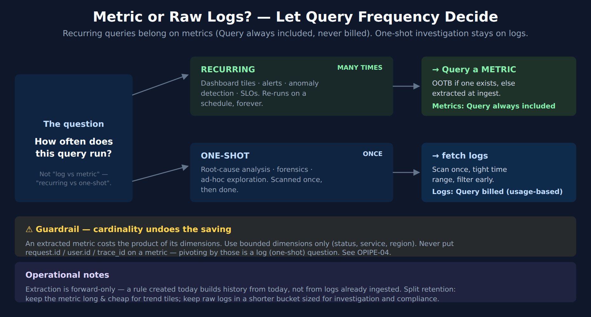

# FAQ-09: When Should I Query a Metric Instead of Raw Logs?

> **Series:** FAQ — Frequently Asked Questions | **Reference:** 09 — When to Query a Metric Instead of Raw Logs | **Created:** June 2026 | **Last Updated:** 10/02/2026

## Overview

Logs are where the detail lives — the exact line, the stack trace, the request that failed. But most of what teams build *on top of* logs isn't detail; it's a number over time: *how many errors per minute, what's the p95 of this endpoint, is the 5xx rate climbing.* Those questions get answered by running a `fetch logs` aggregation, and when that aggregation sits behind a dashboard tile or an alert, it runs again and again — every refresh, every evaluation interval, forever.

That is the optimization opportunity. In Dynatrace on Grail, **scanning logs is a billed activity** on usage-based log buckets, and **querying a metric with `timeseries` is not**. The same "errors per minute" answer costs real money when it re-scans logs on every dashboard refresh, and nothing at query time when it reads a pre-aggregated metric. (A log bucket on *Retain with Included Queries* changes the log side of that trade for recent data — §2 covers when.) Out-of-the-box (OOTB) metrics already answer many of these questions; for the rest, you can extract a metric from the log stream once, at ingest, and point every recurring query at it instead.

This entry explains the economics behind that trade, gives you a one-question rule for deciding which to use, shows what's already available OOTB before you extract anything, and covers the two things that quietly undo the savings — cardinality and the fact that extraction doesn't backfill.

---

## Table of Contents

1. [Short Answer](#short-answer)
2. [Why This Matters — The DPS Query Economics](#economics)
3. [The Decision — Recurring vs. One-Shot](#decision)
4. [Use OOTB Metrics Before You Extract Anything](#ootb-first)
5. [Extracting a Metric From Logs](#extraction)
6. [Cardinality — The One Thing That Undoes the Savings](#cardinality)
7. [Extraction Is Forward-Only — and the Retention Split](#forward-only)
8. [Recommended Approach](#recommended-approach)
9. [Common Gotchas](#gotchas)

---

## Prerequisites

| Requirement | Details |
|-------------|---------|
| **Audience** | Platform engineers, SREs, and observability owners building dashboards, alerts, and SLOs on log data — and anyone watching DPS query consumption climb |
| **Format** | Decision-support document — explains the metric-vs-log-query trade and how to act on it; not a hands-on lab |
| **Deployment** | Dynatrace SaaS with Grail; Log Monitoring via OneAgent or OpenPipeline; DPS (Dynatrace Platform Subscription) licensing |
| **Related topic series** | OPLOGS-03 (OpenPipeline metric extraction from logs), OPLOGS-07 (analytics & dashboard queries), OPMIG-07 (metric & event extraction), OPIPE-03 (sampling-aware metrics from spans), OPIPE-04 (cardinality management), FINOPS-01 (querying DPS consumption), FINOPS-03 (Cut/Tune/Filter optimization), ORGNZ (bucket & retention strategy) |
| **Related FAQ** | FAQ-08 (how OneAgent decides which logs to collect — what's in the stream in the first place) |

<a id="short-answer"></a>
## 1. Short Answer

Ask one question of every log-based query: **how often does it run?**

| If the query runs… | Use | Because |
|--------------------|-----|---------|
| **Repeatedly** — dashboard tiles, alerts, anomaly detection, SLOs | A **metric** (OOTB if one exists, otherwise extracted from the log at ingest) | The aggregate is computed once at ingest and read cheaply thereafter |
| **Once** — root-cause analysis, forensic lookup, ad-hoc exploration | **Raw logs** (`fetch logs` with a tight time range and early filters) | You need the actual lines, and you only pay for the single scan |

The cost half of this rule assumes usage-based log Query billing. On a log bucket set to **Retain with Included Queries**, recurring queries that stay inside its Included Queries period are not charged, and the case for a metric rests on the queries that reach further back, on long-window trends, and on removing the repeated scan (§2).

The decision is *not* "logs are bad, metrics are good." Logs carry the detail you cannot get any other way. The decision is about **where a query lives**: a `fetch logs` aggregation behind a dashboard re-scans the same data on every render, while a metric behind that same tile reads a tiny pre-aggregated series. Move the *recurring aggregate* to a metric; keep the *raw stream* for investigation.

Two moves implement this:

1. **Reach for an OOTB metric first** (§4) — Dynatrace already produces service, host, process, and consumption metrics that teams frequently re-derive from logs by hand.
2. **Extract a metric from the log at ingest** (§5) — when no OOTB metric fits, an OpenPipeline metric-extraction rule turns "count of matching log records, by a few dimensions" into a first-class metric, computed once as the data arrives.

> <sub>**Sources:** [Parse log lines and extract a metric (DT docs)](https://docs.dynatrace.com/docs/platform/openpipeline/use-cases/tutorial-log-processing-pipeline), [DPS Log Management & Analytics (DT docs)](https://docs.dynatrace.com/docs/shortlink/dps-log-management). **Derived:** the "how often does it run" rule is an authoring synthesis of the DPS billing model (§2) — the docs describe the capabilities billed, not this decision heuristic.</sub>

<a id="economics"></a>
## 2. Why This Matters — The DPS Query Economics

Under DPS, each Grail data type is billed across distinct **capabilities**. The asymmetry that drives this whole entry is in the last column:

| Signal (powered by Grail) | Ingest & Process | Retain | **Query** |
|---|:---:|:---:|:---:|
| **Logs** | billed (bytes) | billed (bytes) | **billed (bytes scanned)** on usage-based buckets; not charged within the Included Queries period of a *Retain with Included Queries* bucket |
| **Events** | billed | billed | **billed** |
| **Traces** | billed | billed | **billed** |
| **Metrics** | billed (data points, net of included Custom Metric data points; a histogram measurement counts as 10) | included for 15 months (462 days); billed only beyond that | **Included (no marginal charge)** |

Logs, events, and traces each carry a **Query** capability: when you scan them with DQL, you consume billable bytes. Logs have one exception that matters here. A log bucket on **Retain with Included Queries** (Dynatrace 1.316+) splits its retention in two: an Included Queries period of 10–35 days, inside which queries are not charged, and the remainder of its retention, which follows the usage-based Retain and Query model. The included volume is an allowance of 15× the GiB retained in the Included Queries period per day — exceed it and Dynatrace contacts you to optimize; it is not a block of query volume used up before billing starts.

The Metrics **Query** capability exists in the DPS billing model but is **always included at no additional charge** — querying metrics via `timeseries` never appears as a line item on your bill. Metrics bill on ingest (data points, after any included Custom Metric data points), and on retention only if you keep them beyond the included 15 months.

Now put that against how dashboards and alerts behave. A dashboard tile re-runs its query on refresh. An alert or anomaly detector re-evaluates on a fixed interval, continuously, for as long as it exists. On a usage-based log bucket, a `fetch logs` aggregation in either of those places pays the log **Query** cost every time it runs; the identical answer sourced from a metric pays it *never*.

On a *Retain with Included Queries* bucket, a short-window tile or alert inside the Included Queries period is already free at query time. There the cost argument applies only to queries that reach past that period — and to events and traces — while the other reasons to move a recurring aggregate still hold: trend windows of up to 15 months at no Retain cost, no repeated scan counting against the included allowance, and, in community practice, faster tiles.

This is why the move is close to pure upside for recurring workloads: you are not losing the log data (it still flows, still retained per your bucket policy) — you are removing the repeated scan. In the FINOPS-03 **Cut / Tune / Filter** framework this is a *Tune* lever: you keep the signal and change only the surface you query against.

The flip side keeps you honest: for a **one-shot investigation**, a single `fetch logs` scan is cheap and a metric can't show you the offending line. Don't pre-build metrics for questions you ask once.

> <sub>**Sources:**</sub>
> - <sub>[DPS Log Management & Analytics (DT docs)](https://docs.dynatrace.com/docs/shortlink/dps-log-management) — *"In the Retain with Included Queries model, retained log data within a configured time period can be queried free of charge, as often as you want."*; *"Included query usage per day = (GiB of logs within the defined Included Queries retention period) × 15"*; *"In case you exceed the included query volume, the Dynatrace team will reach out and help you to evaluate and optimize query consumption."*</sub>
> - <sub>[DPS Metrics (DT docs)](https://docs.dynatrace.com/docs/shortlink/dps-metrics) — *"Querying metrics using the timeseries command is always included."*; *"Dashboard tiles that are based on metrics trigger the execution of DQL queries on refresh."*</sub>
> - <sub>[Metrics powered by Grail - Retain (DT docs)](https://docs.dynatrace.com/docs/license/capabilities/metrics/dps-metrics-retain) — *"15 months (462 days) of 1-minute granularity is included with Metrics powered by Grail. Metrics that you choose to retain beyond that period are charged."*</sub>
> - <sub>[Metrics powered by Grail - Ingest & Process (DT docs)](https://docs.dynatrace.com/docs/license/capabilities/metrics/dps-metrics-ingest) — *"Histogram measurement: 10 data points"* (`dt.service.*` keys count as one); *"The number of included Custom Metric data points is dependent on the total monitored GiB-hours of your deployment"*</sub>
> - <sub>[DPS Traces (DT docs)](https://docs.dynatrace.com/docs/shortlink/dps-traces)</sub>
> - <sub>**Corrected (07/08/2026):** an earlier revision framed this as metrics lacking a Query capability entirely — in fact the DPS Metrics page documents a Query dimension that is *"always included"* (no marginal charge), so the capability exists but never bills; FAQ-11 §9 documents the same finding. FINOPS-01 documents the billed-capability split from a live tenant. The "faster tiles" point is community practice, not a documented guarantee.</sub>

<a id="decision"></a>
## 3. The Decision — Recurring vs. One-Shot



<!-- MARKDOWN_TABLE_ALTERNATIVE
| Question | Branch | Use | Cost behavior |
|----------|--------|-----|---------------|
| How often does this query run? | Recurring — dashboards / alerts / SLOs | Query a METRIC (OOTB or extracted) | Metrics: Query always included (no marginal charge) |
| How often does this query run? | One-shot — RCA / forensics / ad-hoc | fetch logs (scan once, tight time range) | Logs: Query billed per bytes scanned on usage-based buckets (Retain with Included Queries: not charged within the Included Queries period) |
| Guardrail | Extract at ingest via OpenPipeline | Bounded dimensions only | Cardinality = product of dimensions; never request/user/trace IDs |
| Note | Extraction is forward-only | Split retention | Metrics long & cheap; raw logs short |
-->

The same answer takes two very different cost paths depending on where the query lives:

```dql
// RECURRING — dashboard tile or alert. Reads a pre-aggregated metric.
// No log Query capability consumed.
// Illustrative — log.request.count is the counter metric extracted in §5;
// substitute your own key.
timeseries sum(log.request.count), from:-24h, by:{status}
```

```dql
// ONE-SHOT — root-cause investigation. Scans the raw log stream once.
// Billed on bytes scanned, so keep the window tight and filter early.
// Replace "prod" with your namespace.
fetch logs, from:-1h
| filter k8s.namespace.name == "prod" and loglevel == "ERROR"
| summarize errors = count(), by:{dt.entity.host}
```

The first query is what belongs behind a tile that thousands of people load and a detector that fires every minute. The second is what you run when something broke and you need to see it. Both are correct — for their job. The anti-pattern is putting the *second* shape behind a dashboard, where it quietly re-scans logs forever.

A quick test for any existing tile or alert: **if its query has a `fetch logs … | summarize` shape and it lives somewhere that re-runs on a schedule, it's a candidate to move to a metric.**

> <sub>**Sources:** [makeTimeseries (DT docs)](https://docs.dynatrace.com/docs/platform/grail/dynatrace-query-language/commands/aggregation-commands), [Aggregation functions (DT docs)](https://docs.dynatrace.com/docs/platform/grail/dynatrace-query-language/functions/aggregation-functions), [Parse log lines and extract a metric (DT docs)](https://docs.dynatrace.com/docs/platform/openpipeline/use-cases/tutorial-log-processing-pipeline). OPLOGS-07 covers the dashboard-query patterns in depth.</sub>

<a id="ootb-first"></a>
## 4. Use OOTB Metrics Before You Extract Anything

Before building an extraction rule, check whether Dynatrace already produces the metric. In community practice, teams routinely re-derive from logs numbers the platform emits for free — the middle column below is that common practice, not something the docs list:

| You want… | Often re-derived from logs as… | OOTB metric already exists |
|-----------|-------------------------------|----------------------------|
| Request throughput / error rate / latency | Counting request/error log lines | **Service RED metrics** — the `dt.service.request.*` family (`count`, `failure_count`, `response_time`), the Grail twins of the classic `builtin:service.*` keys (FAQ-11 §3) — DQL reads the `dt.*` form, not `builtin:` |
| Host CPU / memory / disk | Parsing agent or OS logs | `dt.host.cpu.usage`, `dt.host.memory.usage`, and the `dt.host.*` family |
| Process resource use | Parsing process logs | The `dt.process.*` family |
| Log volume / ingest cost | `fetch logs \| summarize count()` over a long window | DPS consumption metrics (the `dt.billing.*` / `dt.system.events` surfaces — see FINOPS-01) |
| Did this log source stop sending? | Counting recent records | **No OOTB metric.** `log.source.ingest_status` on `dt.system.events` (`LOG_SOURCE_STATUS` events — see FAQ-08) shows whether a source is *set to be ingested* (`Ingested` / `Not ingested`), not whether lines are still arriving. For "stopped sending", extract a counter (§5) and alert when it falls to zero |

**How to check:** search the entity or domain in a **notebook** (the metric picker, or `metrics | filter contains(metric.key, "…")`) before writing a pipeline rule. Data Explorer does the same job on classic tenants; Dynatrace's classic-to-latest capability map lists Notebooks as its replacement, so prefer the notebook route if you have it. If an OOTB metric answers the question, you're done — zero extraction config, zero added cardinality, and it already has historical depth.

Exact metric keys vary by Dynatrace version and by what's deployed in your tenant — confirm the key in your own metric browser rather than assuming it. The point stands regardless of the precise key: **the cheapest extraction is the one you don't have to do because the metric already exists.**

> <sub>**Sources:** [Built-in metrics / metric browser (DT docs)](https://docs.dynatrace.com/docs/analyze-explore-automate/metrics), [DPS Metrics (DT docs)](https://docs.dynatrace.com/docs/shortlink/dps-metrics). [Classic capabilities and where to find them in Latest Dynatrace (DT docs)](https://docs.dynatrace.com/docs/platform/upgrade/foundations/capability-mapping-classic-to-latest) — Data Explorer → Notebooks: *"Point-and-click exploration replaced by DQL-based notebook analysis"*. FINOPS-01 documents the DPS consumption metric surfaces; FAQ-08 documents the `log.source.*` fields. Verified on a live tenant 10/02/2026: `log.source.ingest_status` occurs only on `LOG_SOURCE_STATUS` events in `dt.system.events` (values `Ingested` / `Not ingested`), and `metrics | filter startsWith(metric.key, "log.source")` returns no status metric.</sub>

<a id="extraction"></a>
## 5. Extracting a Metric From Logs

When no OOTB metric fits — a business count, an application-specific status, a value embedded in a log line — extract one at ingest with an **OpenPipeline metric-extraction processor**. The aggregate is computed once, as records arrive, and stored as a metric you then query cheaply forever.

```yaml
# Illustrative field layout — in OpenPipeline these are separate
# Counter / Value / Histogram metric processors configured in the UI or
# settings API, not this literal YAML.
- name: extract-request-metric
  type: metric
  enabled: true
  condition: contains(content, "duration=")
  metricKey: log.request.duration      # becomes a first-class metric
  dimensions:
    - service: k8s.namespace.name      # bounded, low-cardinality
    - method: extracted_method
    - status: extracted_status
  value: extracted_duration_ms         # omit to count matching records
```

Common shapes:

| Question | Metric | Dimensions |
|----------|--------|------------|
| How many requests, by outcome? | `log.request.count` (count of matches) | service, method, status |
| What's the latency distribution? | `log.request.duration` — a **Histogram metric** (SaaS 1.343+; each measurement billed as 10 data points) for percentiles; a value metric for min/max/avg | service, endpoint — keep minimal on a histogram |
| How many of business event X? | `log.business.<event>.count` | a few business dimensions |

A few framing points:

- **OpenPipeline is the modern path.** Classic Log Monitoring also supports log-metric definitions; new work should use OpenPipeline metric extraction. See **OPLOGS-03 §3** for the full processor walkthrough and **OPMIG-07** for the metric-&-event-extraction deep dive.
- **Log-derived metrics are not subject to trace sampling.** Span-derived metrics must be made *sampling-aware* because only a fraction of spans are kept (**OPIPE-03**). In community practice, a count extracted from logs is treated as reflecting every matching record that reaches the pipeline — confirm it against a raw-log count over the same window during cutover.
- **Counter vs. value vs. histogram.** A Counter metric counts matching records; a Value metric tracks a parsed numeric field (min/max/avg); a Histogram metric captures the distribution of that field so `timeseries` can compute percentiles — the one to use for latency. Histogram extraction arrived with SaaS 1.343 (rollout from 07/14/2026). Each histogram measurement is billed as 10 data points, so use one only where you actually need percentiles, keep its dimensions minimal, and use a value metric for min/max/avg. Parse the field first (DPL) so the value and dimensions exist on the record when the metric processor runs.

> <sub>**Sources:** [Parse log lines and extract a metric (DT docs)](https://docs.dynatrace.com/docs/platform/openpipeline/use-cases/tutorial-log-processing-pipeline), [Processing in OpenPipeline (DT docs)](https://docs.dynatrace.com/docs/platform/openpipeline/concepts/processing) — metric extraction lists Counter, Histogram and Value metric processors; *"Histogram metrics can be used to calculate percentiles using the timeseries percentile aggregation"*, [SaaS 1.343 release notes (DT docs)](https://docs.dynatrace.com/docs/whats-new/saas/sprint-343) — *"You can now extract histogram metrics from logs or spans using OpenPipeline."*, *"Histograms are billed with 10 metric data points."*, [Metrics powered by Grail - Ingest & Process (DT docs)](https://docs.dynatrace.com/docs/license/capabilities/metrics/dps-metrics-ingest) — *"Histogram measurement: 10 data points"*, [Dynatrace Pattern Language (DT docs)](https://docs.dynatrace.com/docs/platform/grail/dynatrace-pattern-language). OPLOGS-03, OPMIG-07, and OPIPE-03 carry the implementation depth.</sub>

<a id="cardinality"></a>
## 6. Cardinality — The One Thing That Undoes the Savings

A metric's cost scales with its **cardinality**: the number of unique dimension-value combinations it produces. Cardinality is the **product** of its dimensions' distinct values:

```
data points ≈ (distinct services) × (distinct methods) × (distinct statuses) × …
```

Three bounded dimensions (say 40 services × 5 methods × 6 statuses = 1,200 series) is cheap and useful. Add one **unbounded** dimension — `request.id`, `user.id`, `trace_id`, a raw URL with query strings — and the product explodes into the millions. At that point you've traded an expensive log query for an expensive metric, which is worse: you pay continuously and the metric is unusable.

Guardrails:

- **Only bounded dimensions on extracted metrics:** status code, service, method, region, environment, log level. These have a small, stable set of values.
- **Never** put per-request or per-user identifiers on a metric. If you need to pivot by them, that's a *log* question (one-shot, §3) — or a trace.
- **Histograms multiply the count.** Each histogram measurement is billed as 10 data points (`dt.service.*` keys excepted), so a histogram on the same dimensions costs about as much as ten value metrics. Reserve histograms for the latency questions that need percentiles.
- **Reduce before you extract:** normalize URLs to route templates, bucket numeric values, drop the noisy dimension at the parse step so it never reaches the metric processor.

This is the single most common way a log-to-metric optimization backfires, and it has the same root cause every time: a high-cardinality label that someone added "just in case." **OPIPE-04 (Cardinality Management)** covers the controls in depth; **FINOPS-03 §9** walks a worked high-cardinality-metric remediation.

> <sub>**Sources:** [DPS Metrics (DT docs)](https://docs.dynatrace.com/docs/shortlink/dps-metrics), [Metrics powered by Grail - Ingest & Process (DT docs)](https://docs.dynatrace.com/docs/license/capabilities/metrics/dps-metrics-ingest) — *"Histogram measurement: 10 data points"* (`dt.service.*` keys count as one), [Parse log lines and extract a metric (DT docs)](https://docs.dynatrace.com/docs/platform/openpipeline/use-cases/tutorial-log-processing-pipeline). OPIPE-04 and FINOPS-03 carry the cardinality-control patterns. **Derived:** the cross-product cost model is standard dimensional-metric behavior applied to log-extracted metrics.</sub>

<a id="forward-only"></a>
## 7. Extraction Is Forward-Only — and the Retention Split

Two operational facts shape how you roll this out.

**Extraction is forward-only.** An OpenPipeline metric-extraction rule acts on records *as they arrive*. A rule you create today begins producing its metric from today — it does **not** retroactively manufacture metric history from logs already ingested. Practical consequences:

- Stand up the extraction rule **before** you need the trend, not the day you build the dashboard.
- For the gap, query the raw logs directly (a one-shot scan over the historical window) until the metric accumulates enough depth.
- When migrating an existing dashboard from logs to a metric, run both in parallel for a bit and cut over once the metric's history covers your default dashboard window.

**Split the retention.** Once the recurring questions are answered by a metric, the raw logs no longer need to live long *for those questions*:

- Keep the **metric** retained long — 15 months is included, and only retention beyond that is billed, so multi-month trend tiles stay inexpensive.
- Keep the **raw logs** in a shorter-retention bucket sized for investigation and compliance, not for powering dashboards.
- If that raw-log bucket uses **Retain with Included Queries**, its daily included-query allowance is 15× the GiB retained inside the Included Queries period — shortening that period shrinks the allowance. Size it for the queries that still run on raw logs.

On usage-based buckets, that split is where the saving compounds: long-horizon dashboards read the cheap long-lived metric, while the expensive raw logs age out on a short clock. Bucket and retention design lives in the **ORGNZ** series; retention as a cost lever is **FINOPS-03 §4 (Tune)**.

> <sub>**Sources:** [Parse log lines and extract a metric (DT docs)](https://docs.dynatrace.com/docs/platform/openpipeline/use-cases/tutorial-log-processing-pipeline), [DPS Log Management & Analytics (DT docs)](https://docs.dynatrace.com/docs/shortlink/dps-log-management) — *"An Included Queries retention period (10–35 days of data retention)."*, [Metrics powered by Grail - Retain (DT docs)](https://docs.dynatrace.com/docs/license/capabilities/metrics/dps-metrics-retain) — *"Assuming you don't change the default retention period, metric data will be retained for 15 months (462 days) and there will be no billable Retain usage."* ORGNZ covers bucket/retention design; FINOPS-03 covers retention tuning. **Derived:** the "forward-only" property follows from OpenPipeline processing at ingest time; the retention-split recommendation combines the bucket model with the per-capability billing and the Included Queries allowance formula in §2.</sub>

<a id="recommended-approach"></a>
## 8. Recommended Approach

1. **Inventory the recurring log queries.** List the dashboard tiles, alerts, anomaly detectors, and SLOs whose queries have a `fetch logs … | summarize` shape. These are your candidates — on usage-based log buckets they pay the log Query cost on every run.
2. **Check for an OOTB metric first (§4).** Search the metric browser for the service, host, process, or consumption metric that already answers the question. If it exists, repoint the tile/alert and you're done.
3. **Extract a metric for the rest (§5).** Build an OpenPipeline metric-extraction rule with a clear `metricKey` and a small set of **bounded** dimensions. Parse any needed value/dimension fields earlier in the pipeline.
4. **Hold the line on cardinality (§6).** No per-request, per-user, or per-trace dimensions. Sanity-check the dimension cross-product before enabling.
5. **Cut over forward, not backward (§7).** Enable the rule, let the metric accumulate, then migrate the tile/alert. Keep raw-log access for the historical gap and for investigation.
6. **Split retention (§7).** Retain the metric long; shorten the raw-log bucket to what investigation and compliance actually need — and on a Retain with Included Queries bucket, keep the Included Queries period long enough for the queries that remain on raw logs.
7. **Keep raw logs for what they're for.** Root-cause analysis, forensics, and ad-hoc exploration stay on `fetch logs` with tight time ranges and early filters — that's the one-shot path, and it's cheap.
8. **Measure the result.** Use FINOPS-01's query-side consumption queries to confirm log Query consumption dropped after the cutover.

<a id="gotchas"></a>
## 9. Common Gotchas

| Symptom | Likely cause | Where |
|---------|--------------|-------|
| Log Query consumption keeps climbing | A dashboard/alert still runs `fetch logs \| summarize` on a schedule | §2, §3 |
| New extracted metric has no history | Extraction is forward-only — it doesn't backfill old logs | §7 |
| Extracted metric is expensive / unusable | An unbounded dimension (request/user/trace ID) blew up cardinality | §6 |
| "I lost the detail when I switched to a metric" | Metrics answer *how many/how fast*, not *which line* — keep raw logs for the detail | §1, §3 |
| Built a metric that already existed OOTB | Skipped the metric-browser check before extracting | §4 |
| Span-extracted metric undercounts vs. logs | Spans are sampled; make span metrics sampling-aware (log metrics aren't sampled) | §5, OPIPE-03 |
| Trend tile still slow/costly over long windows | Raw logs retained long for dashboards instead of the cheap metric | §7 |
| Dashboard cutover broke during the gap | Migrated before the metric had enough history | §7 |

> <sub>**Sources:** [Parse log lines and extract a metric (DT docs)](https://docs.dynatrace.com/docs/platform/openpipeline/use-cases/tutorial-log-processing-pipeline), [DPS Log Management & Analytics (DT docs)](https://docs.dynatrace.com/docs/shortlink/dps-log-management), [DPS Metrics (DT docs)](https://docs.dynatrace.com/docs/shortlink/dps-metrics) — each row maps to the capability, rule, or constraint cited in the referenced section.</sub>

---

> <sub>**⚠️ Disclaimer:** This content is AI-generated, community-driven, and **not supported by Dynatrace**. DPS capabilities, billed units, and OpenPipeline behavior evolve across releases — always verify the current billing model and metric-extraction mechanics against the [Dynatrace documentation](https://docs.dynatrace.com/docs) and your own tenant before relying on a specific cost claim.</sub>
