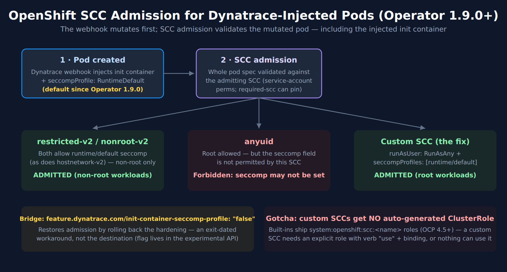

# FAQ-13: How Do Dynatrace Injection and OpenShift SCCs Interact? (seccomp, anyuid, and the Operator 1.9.0 Change)

> **Series:** FAQ — Frequently Asked Questions | **Reference:** 13 — Dynatrace Injection and OpenShift SCCs: seccomp, anyuid, and the Operator 1.9.0 Change | **Created:** July 2026 | **Last Updated:** 10/02/2026

## Overview

A recurring incident pattern on OpenShift: after upgrading Dynatrace Operator to **v1.9.0+**, pods that previously ran fine under the **`anyuid`** SCC are rejected at admission with `Forbidden: seccomp may not be set` — before they are even scheduled. Nothing crashed and no Dynatrace component errored; the pods simply stopped being admitted, which is why the break often surfaces first in production restarts.

The [seccomp profiles page (DT docs)](https://docs.dynatrace.com/docs/ingest-from/setup-on-k8s/guides/networking-security-compliance/security-configurations/seccomp) documents that Operator 1.9.0 changed the `feature.dynatrace.com/init-container-seccomp-profile` default, and now carries a **Using seccomp on OpenShift** section that names the SCC conflict; the [DynaKube feature-flags reference (DT docs)](https://docs.dynatrace.com/docs/ingest-from/setup-on-k8s/reference/dynakube-feature-flags) lists the flag's default as `"true"`. The [Additional OpenShift configurations page (DT docs)](https://docs.dynatrace.com/docs/ingest-from/setup-on-k8s/guides/networking-security-compliance/security-configurations/openshift-configuration), which documents which SCCs Dynatrace components use, still says nothing about seccomp. This entry covers the intersection in depth: why the combination fails, a compatibility matrix, the recommended long-term fix (a custom SCC), how to find affected workloads **before** upgrading, and the operator change-management practices that keep the next default-flip from being a surprise.

**Updated 08/28/2026 — Dynatrace now documents the interaction.** The [Operator 1.10.2 release notes (DT docs)](https://docs.dynatrace.com/docs/whats-new/dynatrace-operator/dto-fix-1-10-2) (published 07/30/2026) carry it as a **Known Issue**, and the seccomp page now documents it too (read 09/28/2026) — only the OpenShift configuration page is still silent. The official text also describes a **second failure mode** this entry originally did not: not only admission rejection, but *fallback to a different SCC*. See §3.

> **Scope:** Dynatrace Operator ≥1.9.0 on OpenShift 4.11+ (incl. ARO/ROSA) with `applicationMonitoring` or `cloudNativeFullStack` injection. Claims about OpenShift built-in SCC behavior are cited to Red Hat documentation and knowledge base — verify against your exact OCP version, since SCC semantics have changed across 4.x.

---

## Table of Contents

1. [Short Answer](#short-answer)
2. [What Changed in Operator 1.9.0](#what-changed)
3. [Why anyuid + RuntimeDefault Fails at Admission](#why-it-fails)
4. [SCC Compatibility Matrix for Injected Workloads](#scc-matrix)
5. [The Long-Term Fix — a Custom SCC](#custom-scc)
6. [Assessing Impact Before You Upgrade](#pre-upgrade)
7. [Operator Change Management: Scope, Uninstall Residue, and Failure Isolation](#change-management)
8. [Recommended Approach](#recommendation)
9. [Common Gotchas](#gotchas)

---

## Prerequisites

| Requirement | Details |
|-------------|---------|
| **Platform** | OpenShift 4.11+ (SCC v2 family present); Dynatrace Operator with `applicationMonitoring` or `cloudNativeFullStack` |
| **Permissions** | Cluster-admin (or SCC-management rights) to inspect/create SCCs; ability to edit DynaKube resources |
| **Audience** | OpenShift platform/SRE teams; Dynatrace platform owners; account teams preparing an operator upgrade |
| **Related series** | K8S (DynaKube deployment modes, troubleshooting), ONBRD (deployment), FAQ-04/05 (update change-management on the agent side) |

<a id="short-answer"></a>
## 1. Short Answer

Since Operator **1.9.0**, the injected Dynatrace init container carries `seccompProfile: RuntimeDefault` **by default** (the `feature.dynatrace.com/init-container-seccomp-profile` flag flipped from `false` to `true`). OpenShift validates every pod's security context against the SCC that admits it, and the built-in SCCs differ on whether the `seccompProfile` field is permitted at all. Read from the shipped SCC manifests (re-verified 10/02/2026): **`restricted-v2` declares `seccompProfiles: [runtime/default]`** — its own `description` field states it *"will also default the seccomp profile to runtime/default if unset, otherwise this seccomp profile is required"* — check it in your cluster with `oc get scc restricted-v2 -o jsonpath='{.metadata.annotations.kubernetes\.io/description}'`. Red Hat's SCC documentation states the same for `restricted-v2`, `nonroot-v2` and `hostnetwork-v2`: *"`seccompProfile` is set to `runtime/default` by default"* — while **`anyuid` declares no `seccompProfiles` key at all**, so the field is not allowed under it. A pod admitted under **`anyuid`** therefore fails SCC validation the moment the webhook adds the seccomp profile: `Forbidden: seccomp may not be set` — a documented Red Hat failure mode, not a Dynatrace bug or an OpenShift bug. The interaction itself is documented on the Dynatrace seccomp page and in the Operator Known Issues; only the Dynatrace OpenShift configuration page is silent on seccomp.

| Your situation | Your path |
|----------------|-----------|
| Injected workloads run under `restricted-v2` or `nonroot-v2` | No action — seccomp is allowed there; this is the happy path |
| Injected workloads need root (`anyuid` today) | **Long-term:** custom SCC allowing both `RunAsAny` and `runtime/default` seccomp (§5). **Immediate:** set the flag to `false` on the DynaKube (§2) — a rollback of the security improvement, not a destination |
| Not yet on 1.9.0 | Run the §6 assessment first; upgrade with the affected-workload list in hand |

> <sub>**Sources:** [Seccomp profiles (DT docs)](https://docs.dynatrace.com/docs/ingest-from/setup-on-k8s/guides/networking-security-compliance/security-configurations/seccomp) — the 1.9.0 default change; [Additional OpenShift configurations (DT docs)](https://docs.dynatrace.com/docs/ingest-from/setup-on-k8s/guides/networking-security-compliance/security-configurations/openshift-configuration) — the restricted-v2 / SCC-per-component table (the quoted SCC description is read from the cluster, not this page); [Using seccomp on OpenShift (DT docs)](https://docs.dynatrace.com/docs/ingest-from/setup-on-k8s/guides/networking-security-compliance/security-configurations/seccomp) — *"On OpenShift, this can interfere with SecurityContextConstraints (SCCs)"*; [Pod not admitted due to seccomp with anyuid SCC (Red Hat KB, solution 7064000)](https://access.redhat.com/solutions/7064000) — the exact `Forbidden: seccomp may not be set` failure mode; [SCC reference, OCP 4.18 source (openshift-docs GitHub)](https://raw.githubusercontent.com/openshift/openshift-docs/enterprise-4.18/modules/security-context-constraints-about.adoc) — *"`seccompProfile` is set to `runtime/default` by default"* for `restricted-v2`, `nonroot-v2` and `hostnetwork-v2`.</sub>

<a id="what-changed"></a>
## 2. What Changed in Operator 1.9.0

The [Operator 1.9.0 release notes (DT docs)](https://docs.dynatrace.com/docs/whats-new/dynatrace-operator/dto-fix-1-9-0) state the change in one line: the `feature.dynatrace.com/init-container-seccomp-profile` feature flag is now **enabled by default**, with the remediation *"If you relied on the unspecified seccomp profile on injected init containers, set the flag to `false`."* The 1.9.0 notes originally carried no OpenShift implications; the page now lists the SCC interaction under **Known issues** (page updated 09/08/2026).

**The intended benefit** (from the seccomp page): with the flag on, the init container gets the `RuntimeDefault` seccomp profile, which restricts the system calls it can make and helps *"meet the requirements of the **restricted** Pod Security Standard"* — a genuine hardening improvement, and on vanilla Kubernetes (Pod Security admission) it is a pure win. The breakage is OpenShift-specific, because OpenShift layers **SCC validation** on top (§3).

**The immediate workaround** — on the DynaKube:

```yaml
apiVersion: dynatrace.com/v1beta6
kind: DynaKube
metadata:
  name: dynakube
  annotations:
    feature.dynatrace.com/init-container-seccomp-profile: "false"
```

**Is the flag a long-term answer?** No — and this is now a documented fact rather than an inference. In the operator source the flag carries an explicit removal notice:

```go
// pkg/api/exp/injection.go — identical at v1.9.0, v1.10.0, v1.10.1, v1.10.2 and v1.11.0
// Deprecated: This field will be removed in a future release.
InjectionSeccompKey = FFPrefix + "init-container-seccomp-profile"

func (ff *FeatureFlags) HasInitSeccomp() bool {
	return ff.getBoolWithDefault(InjectionSeccompKey, true)   // default: true
}
```

So the escape hatch is on a removal path: (1) it rolls back a security improvement rather than solving the SCC conflict; (2) it is **marked deprecated for removal in the source**, in the operator's experimental API package (`pkg/api/exp/`), so an estate that sets it to `"false"` permanently is scheduled to break when the flag goes; (3) the custom-SCC fix (§5) solves the actual conflict, keeps the hardening, and survives the flag's removal. Use the flag to buy time for §5, not instead of it.

> **Still current at Operator 1.11.0.** The latest Operator release is **1.11.0 (10/01/2026)**. The seccomp default has been `true` continuously since 1.9.0, and the 1.11.0 release notes still list the OpenShift interaction under **Known issues** rather than reversing it, so everything in this entry applies unchanged on the current version. Verified against the operator source at each tag through v1.10.2 on 08/27/2026, and at v1.11.0 on 10/02/2026.

**Also in 1.9.0** — relevant to any upgrade assessment (§6): the DynaKube **`v1beta3` API version is removed from the CRD** (*"Applying DynaKube resources using this version will fail"* — migrate to `v1beta6` first), `v1beta4` is deprecated (it stopped being served in 1.10.0 and was removed from the CRD in 1.11.0), pods injected via `applicationMonitoring`/`cloudNativeFullStack` now receive **automatic metadata enrichment**, legacy `dt.kubernetes.*` attributes are deprecated for `k8s.*`, and the `dynatrace/helm-charts` repository is *"archived and no longer receives updates"* — install from the OCI registry instead.

> **Now a documented Known Issue (Operator 1.10.2, published 07/30/2026; still listed in 1.11.0).** Verbatim: *"Since Dynatrace Operator 1.9.0, a `RuntimeDefault` seccomp profile is applied to the Dynatrace init container by default. On OpenShift, this can interfere with SecurityContextConstraints (SCCs) — such as `anyuid`, `restricted`, or `nonroot` — that prevent seccomp profile usage, causing the system to fall back to a different SCC (for example `restricted-v2`). This may render application pods unschedulable or cause workload degradation."* Dynatrace's own remediation is to disable the seccomp profile for Dynatrace init containers — the same workaround given above. Three things this confirms and one it adds:
>
> - **The default is still `true` through 1.11.0.** The Known Issue documents the behavior rather than reverting it, which is consistent with the source read at each tag. Nothing here is fixed by upgrading.
> - **The blast radius is wider than `anyuid`.** Dynatrace names `restricted` and `nonroot` alongside it. The matrix in §4 remains the per-SCC authority, and the in-cluster `oc` check there is still how you settle your own cluster.
> - **Dynatrace endorses the flag as the remediation** — but the flag is marked for removal (below), so it is still a bridge with an exit date, not a destination. The custom SCC in §5 remains the durable fix.
> - **New: a second failure mode.** *Fallback* to a different SCC, ending in unschedulable pods or degraded workloads — not the clean `Forbidden: seccomp may not be set` rejection. See §3.

> <sub>**Sources:** [Operator 1.9.0 release notes (DT docs)](https://docs.dynatrace.com/docs/whats-new/dynatrace-operator/dto-fix-1-9-0) — quoted remediation + breaking changes, the Known issues entry, and *"The Helm repository located in dynatrace/helm-charts is archived and no longer receives updates."* (read 10/02/2026); [Seccomp profiles (DT docs)](https://docs.dynatrace.com/docs/ingest-from/setup-on-k8s/guides/networking-security-compliance/security-configurations/seccomp) — quoted PSS rationale; [DynaKube feature flags (DT docs)](https://docs.dynatrace.com/docs/ingest-from/setup-on-k8s/reference/dynakube-feature-flags) — lists the default as *"true"* (read 09/28/2026; it showed `"false"` in July 2026); flag location verified in the operator source 07/08/2026. [operator source `pkg/api/exp/injection.go` (Dynatrace GitHub)](https://github.com/Dynatrace/dynatrace-operator/blob/v1.10.2/pkg/api/exp/injection.go) — *"Deprecated: This field will be removed in a future release"* on `InjectionSeccompKey`, and `getBoolWithDefault(…, true)`; read at tags v1.9.0/v1.10.0/v1.10.1/v1.10.2 on 08/27/2026 and v1.11.0 on 10/02/2026; [Operator 1.10.2 release notes (DT docs)](https://docs.dynatrace.com/docs/whats-new/dynatrace-operator/dto-fix-1-10-2) — the Known Issue quoted above, read 08/28/2026; [Operator 1.11.0 release notes (DT docs)](https://docs.dynatrace.com/docs/whats-new/dynatrace-operator/dto-fix-1-11-0) — the same Known Issue, still listed, read 10/02/2026.

> <sub>**Corrected 08/27/2026.** This section previously read *"no deprecation is published for this flag today"* and softened the bridge-not-destination advice to a **Derived** inference from the flag's package location. The source has carried an explicit removal notice since 1.9.0 — the original check confirmed where the flag lives without reading the two lines above it. The advice was right; its basis is now a citation rather than a pattern argument.</sub>

<a id="why-it-fails"></a>
## 3. Why anyuid + RuntimeDefault Fails at Admission



<!-- MARKDOWN_TABLE_ALTERNATIVE
| Step | What happens |
|------|--------------|
| 1 | Workload pod is created; Dynatrace webhook injects the init container (with seccompProfile RuntimeDefault since 1.9.0) |
| 2 | OpenShift SCC admission matches the pod to an SCC (service-account permissions decide; required-scc annotation can pin) |
| 3a | restricted-v2 / nonroot-v2 (and hostnetwork-v2) admit: seccomp runtime/default allowed -> pod runs (if workload is non-root) |
| 3b | anyuid admits root workload BUT does not allow the seccomp field -> Forbidden: seccomp may not be set |
| 3c | custom SCC (RunAsAny + runtime/default) -> root workload AND seccomp both allowed -> pod runs |
For environments where SVG doesn't render
-->

Three facts collide:

1. **The webhook mutates every injected pod.** Since 1.9.0 the injected init container carries `seccompProfile: RuntimeDefault` — the workload team changed nothing; the pod spec changed anyway.
2. **SCC admission validates the whole pod** — init containers included — against the SCC the pod is admitted under. A field the SCC doesn't allow means rejection at admission, before scheduling: the *"Forbidden: seccomp may not be set"* error documented in [Red Hat KB solution 7064000](https://access.redhat.com/solutions/7064000) for exactly the anyuid case.
3. **No non-privileged built-in SCC satisfies both needs.** Workloads that must run as root sit on `anyuid` — which does not allow the seccomp field. Seccomp is allowed on `restricted-v2`, `nonroot-v2` and `hostnetwork-v2` — none of which admits UID 0 (`nonroot-v2` does cover a fixed non-root UID). The SCC manifests themselves agree with Red Hat's documentation: those three carry `seccompProfiles: [runtime/default]`, `anyuid` carries no `seccompProfiles` key. Dynatrace's [Operator security page (DT docs)](https://docs.dynatrace.com/docs/ingest-from/setup-on-k8s/reference/security) makes a related but **different** statement — *"This SCC is the only built-in OpenShift SCC that allows usage of seccomp, which our components have set by default, and also the usage of CSI volumes"* — where *"This SCC"* refers to **`privileged`**, not `restricted-v2`, and the point being made is about the CSI driver and OneAgent. Do not read that sentence as a claim about `restricted-v2`; earlier revisions of this entry did, and it is corrected here (08/24/2026). **The intersection your root workload needs — `RunAsAny` UID + `runtime/default` seccomp — exists in no built-in SCC**, which is why the durable answer is a custom one (§5).

### Two failure modes, not one

The rejection above is the *loud* outcome. Dynatrace's own Known Issue (Operator 1.10.2, §2) describes a **quieter** one: an SCC that forbids the seccomp field may simply stop matching, *"causing the system to fall back to a different SCC (for example `restricted-v2`). This may render application pods unschedulable or cause workload degradation."*

| | Loud mode | Quiet mode |
|---|---|---|
| **What happens** | Pod fails SCC validation outright | Pod is admitted under a *different*, more restrictive SCC |
| **What you see** | `Forbidden: seccomp may not be set` at admission | Pods unschedulable, or running degraded — no seccomp error anywhere |
| **How it's found** | Admission events; the workload obviously stops | The `openshift.io/scc` annotation is not the SCC you expected |
| **Why it misleads** | It doesn't — the message names the cause | A root workload silently loses the UID latitude `anyuid` gave it, and fails for reasons that look unrelated |

The quiet mode matters more for diagnosis, because nothing in the symptom points at seccomp or at Dynatrace. **When investigating a post-upgrade OpenShift problem, compare the `openshift.io/scc` annotation on a failing pod against the SCC you expect** — the §6 query prints exactly that. A changed SCC is the tell; the error message will not be.

Why it was *silent*, in community experience: the failure fires only when a pod is (re)created — steady-state pods keep running after the operator upgrade, and the rejections begin with the next rollout, node drain, or crash-restart. That gap between upgrade and symptom is what makes pre-upgrade assessment (§6) the load-bearing practice.

> <sub>**Sources:** [Red Hat KB solution 7064000](https://access.redhat.com/solutions/7064000) — the anyuid + seccomp admission failure; [Additional OpenShift configurations (DT docs)](https://docs.dynatrace.com/docs/ingest-from/setup-on-k8s/guides/networking-security-compliance/security-configurations/openshift-configuration) — the SCC-per-component table (*"Operator nonroot-v2 Webhook nonroot-v2"*); [SCC reference, OCP 4.18 source (openshift-docs GitHub)](https://raw.githubusercontent.com/openshift/openshift-docs/enterprise-4.18/modules/security-context-constraints-about.adoc) — *"`seccompProfile` is set to `runtime/default` by default"* for the three v2 SCCs; [Seccomp profiles (DT docs)](https://docs.dynatrace.com/docs/ingest-from/setup-on-k8s/guides/networking-security-compliance/security-configurations/seccomp); [Operator 1.10.2 release notes (DT docs)](https://docs.dynatrace.com/docs/whats-new/dynatrace-operator/dto-fix-1-10-2) — the SCC-fallback failure mode quoted in the two-modes table. **Derived:** the loud/quiet contrast pairs the Red Hat admission failure with the Operator 1.10.2 fallback description.</sub>

<a id="scc-matrix"></a>
## 4. SCC Compatibility Matrix for Injected Workloads

For workloads receiving Dynatrace injection on Operator ≥1.9.0 (flag at its default `true`):

| SCC | UID policy | Allows `runtime/default` seccomp? | Injected pod outcome |
|-----|-----------|-----------------------------------|----------------------|
| `restricted-v2` | `MustRunAsRange` (non-root) | **Yes** — `seccompProfiles: [runtime/default]` in the shipped manifest (verify in-cluster) | ✅ Admitted — the designed happy path for non-root workloads |
| `restricted` (v1) | `MustRunAsRange` (non-root) | The Operator Known Issue lists it among SCCs that prevent seccomp — verify: `oc get scc restricted -o jsonpath='{.seccompProfiles}'` | ⚠️ Rejected, or falls back to another SCC (§3) |
| `nonroot` (v1) | `MustRunAsNonRoot` | The Operator Known Issue lists it among SCCs that prevent seccomp — verify: `oc get scc nonroot -o jsonpath='{.seccompProfiles}'` | ⚠️ Rejected, or falls back to another SCC (§3) |
| `anyuid` | `RunAsAny` (root allowed) | **No** | ❌ `Forbidden: seccomp may not be set` at admission ([RH KB 7064000](https://access.redhat.com/solutions/7064000)) |
| `nonroot-v2` | `MustRunAsNonRoot` | **Yes** — Red Hat: *"`seccompProfile` is set to `runtime/default` by default"* | ✅ Admitted — the happy path for fixed-UID non-root workloads. Dynatrace runs its own operator, webhook and ActiveGate under it |
| `hostnetwork-v2` | `MustRunAsRange` (non-root) | **Yes** — same Red Hat wording | ✅ Admitted — but grants host networking; only for workloads that already need it |
| `privileged` | `RunAsAny` | Yes (allows everything) | ✅ Admitted — but grossly over-grants; not a remediation, a liability |
| **Custom SCC (§5)** | `RunAsAny` | **Yes** (explicitly listed) | ✅ Admitted — the recommended long-term path for root workloads |

**How the SCC is chosen — and how `openshift.io/required-scc` interacts with injection.** Among the SCCs the pod's creator/service account has `use` permission for, OpenShift orders candidates by **priority first**, then most-restrictive first (`anyuid` ships with priority 10, which is why it wins wherever it is granted); the webhook's mutation happens *before* SCC admission, so the injected fields participate in that selection/validation. To remove ambiguity you can pin the SCC: per the [Red Hat 4.18 SCC documentation](https://docs.redhat.com/en/documentation/openshift_container_platform/4.18/html/authentication_and_authorization/managing-pod-security-policies), set the `openshift.io/required-scc` annotation on the workload's **pod template** — the SCC *"must exist in the cluster and must be applicable to the workload, otherwise pod admission fails,"* and *"do not change the `openshift.io/required-scc` annotation in the live pod's manifest"* (update the template so pods are re-created). Pinning is double-edged with injection: it makes admission deterministic, and it also means a pinned-to-`anyuid` workload fails hard the moment the webhook adds seccomp — which is arguably better than failing unpredictably.

*The built-in SCC field values have shifted across OpenShift 4.x releases, so confirm any row on your own cluster with `oc get scc <name> -o jsonpath='{.seccompProfiles}'`.*

> <sub>**Sources:** [Additional OpenShift configurations (DT docs)](https://docs.dynatrace.com/docs/ingest-from/setup-on-k8s/guides/networking-security-compliance/security-configurations/openshift-configuration), [Red Hat KB 7064000](https://access.redhat.com/solutions/7064000), [Managing security context constraints, OCP 4.18 (Red Hat docs)](https://docs.redhat.com/en/documentation/openshift_container_platform/4.18/html/authentication_and_authorization/managing-pod-security-policies) — required-scc rules quoted; [SCC reference, OCP 4.18 source (openshift-docs GitHub)](https://raw.githubusercontent.com/openshift/openshift-docs/enterprise-4.18/modules/security-context-constraints-about.adoc) — the v2 seccomp defaults, *"The highest priority SCCs are ordered first."* and *"If the priorities are equal, the SCCs are sorted from most restrictive to least restrictive."*; [anyuid SCC manifest (OpenShift GitHub)](https://raw.githubusercontent.com/openshift/cluster-kube-apiserver-operator/master/bindata/bootkube/scc-manifests/0000_20_kube-apiserver-operator_00_scc-anyuid.yaml) — `priority: 10`.</sub>

<a id="custom-scc"></a>
## 5. The Long-Term Fix — a Custom SCC

For root-requiring workloads with Dynatrace injection, create a custom SCC that allows exactly the missing intersection — arbitrary UID **plus** `runtime/default` seccomp. Start from `anyuid`'s posture and add the seccomp allowance. The surest way is to copy your cluster's own definition — `oc get scc anyuid -o yaml`, rename it, strip the cluster-generated `metadata` fields (`uid`, `resourceVersion`, `creationTimestamp`, annotations), drop `priority` and the `groups` / `users` grants, and add `seccompProfiles: [runtime/default]` (never modify the built-in SCCs themselves — Red Hat's guidance is that default SCCs should not be edited, both for supportability and upgrade safety). The example below mirrors the shipped `anyuid` manifest at the time of writing, minus the newer `image` volume type (next paragraph):

```yaml
apiVersion: security.openshift.io/v1
kind: SecurityContextConstraints
metadata:
  name: anyuid-seccomp
allowHostDirVolumePlugin: false
allowHostIPC: false
allowHostNetwork: false
allowHostPID: false
allowHostPorts: false
allowPrivilegedContainer: false
allowPrivilegeEscalation: true
requiredDropCapabilities:
  - MKNOD                    # as anyuid
runAsUser:
  type: RunAsAny            # the anyuid property your root workloads need
seLinuxContext:
  type: MustRunAs
seccompProfiles:
  - runtime/default          # the allowance anyuid lacks
fsGroup:
  type: RunAsAny
supplementalGroups:
  type: RunAsAny
volumes:
  - configMap
  - csi                      # required when the Dynatrace CSI driver provides the agent binaries
  - downwardAPI
  - emptyDir
  - ephemeral                # generic ephemeral volumes, as anyuid
  - persistentVolumeClaim
  - projected
  - secret
# no priority: leave it unset and pin with openshift.io/required-scc (§4).
# anyuid ships with priority 10, and higher priority sorts first, so a custom SCC
# only outranks anyuid with priority > 10 — Red Hat warns against raising priority
# on the default SCCs.
```

**If you move to image volumes (Operator 1.11.0+).** Image-volume injection mounts the code modules as a volume of type `Image`, not `csi` — the Dynatrace verification step looks for exactly that in `kubectl describe pod`. Before switching workloads that run under a custom SCC, check in-cluster whether the SCC's `volumes` list admits it (`oc get scc anyuid-seccomp -o jsonpath='{.volumes}'`) and re-create one canary pod (§6). The upstream built-in SCC manifests gained an `image` volume type in November 2025 — which OpenShift release ships it is version-dependent — so a copy of your cluster's `anyuid` may already carry it; the example above does not. Image volumes also need Kubernetes 1.35+, so whether this applies yet depends on your OpenShift release. Until then the CSI driver, and the `csi` entry above, remain the working path.

**The RBAC step everyone misses:** since OpenShift 4.5, the *built-in* SCCs ship with auto-generated `system:openshift:scc:<name>` ClusterRoles — **a custom SCC gets no such role automatically**. Grant access explicitly, either per-namespace:

```bash
oc create role use-anyuid-seccomp --verb=use \
  --resource=securitycontextconstraints --resource-name=anyuid-seccomp -n <namespace>
oc create rolebinding use-anyuid-seccomp --role=use-anyuid-seccomp \
  --serviceaccount=<namespace>:<serviceaccount> -n <namespace>
```

or with `oc adm policy add-scc-to-user anyuid-seccomp -z <serviceaccount> -n <namespace>` (which, since 4.5, manages this via role bindings rather than editing the SCC's user list). Then either remove the workload's `anyuid` grant (so the custom SCC is selected — while `anyuid` is granted, its priority 10 puts it ahead of an unprioritized custom SCC) or pin it with `openshift.io/required-scc: anyuid-seccomp` on the pod template (§4).

**Verify before rollout:** re-create one affected pod and confirm its admitting SCC with `oc get pod <pod> -o jsonpath='{.metadata.annotations.openshift\.io/scc}'` — the pod-level `openshift.io/scc` annotation records what actually admitted it. Once workloads run under the custom SCC, set the DynaKube flag back to its secure default (remove the `"false"` override).

> <sub>**Sources:** [Managing security context constraints, OCP 4.18 (Red Hat docs)](https://docs.redhat.com/en/documentation/openshift_container_platform/4.18/html/authentication_and_authorization/managing-pod-security-policies) — custom-SCC + RBAC `use`-verb model, don't-modify-defaults guidance; [`oc adm policy add-scc-to-user` behavior change in 4.x (Red Hat KB, solution 5529581)](https://access.redhat.com/solutions/5529581) — role-binding-based since 4.5; [Additional OpenShift configurations (DT docs)](https://docs.dynatrace.com/docs/ingest-from/setup-on-k8s/guides/networking-security-compliance/security-configurations/openshift-configuration) — CSI volume requirement for CSI-driver deployments; [Use image volumes for code modules injection (DT docs)](https://docs.dynatrace.com/docs/ingest-from/setup-on-k8s/guides/deployment-and-configuration/use-image-volumes) — the `Image` volume type in its verification step, and the Kubernetes 1.35+ requirement. [anyuid SCC manifest (OpenShift GitHub)](https://raw.githubusercontent.com/openshift/cluster-kube-apiserver-operator/master/bindata/bootkube/scc-manifests/0000_20_kube-apiserver-operator_00_scc-anyuid.yaml) — `priority: 10`, `requiredDropCapabilities: [MKNOD]`, and the volume list incl. `ephemeral` and `image`; [SCC reference, OCP 4.18 source (openshift-docs GitHub)](https://raw.githubusercontent.com/openshift/openshift-docs/enterprise-4.18/modules/security-context-constraints-about.adoc) — *"Higher priority SCCs are moved to the front of the set when sorting."* **Derived:** the `anyuid-seccomp` YAML is a worked synthesis of the anyuid posture plus the seccomp allowance — review every field against your security baseline before applying</sub>

<a id="pre-upgrade"></a>
## 6. Assessing Impact Before You Upgrade

The 1.9.0 incident pattern generalizes: **operator upgrades change injected pod specs, and injected pod specs are validated by platform admission** — so the pre-upgrade question is *"which of my injected workloads are admitted under an SCC that won't accept the new spec?"* For the seccomp change specifically:

```bash
# 1a. How many running pods each SCC admits (the openshift.io/scc annotation records it)
oc get pods -A -o jsonpath='{range .items[*]}{.metadata.annotations.openshift\.io/scc}{"\n"}{end}' | sort | uniq -c | sort -rn

# 1b. Which SCC admits each pod, grouped by SCC
oc get pods -A -o jsonpath='{range .items[*]}{.metadata.namespace}{"\t"}{.metadata.name}{"\t"}{.metadata.annotations.openshift\.io/scc}{"\n"}{end}' | sort -t $'\t' -k3,3

# 2. Narrow to Dynatrace-injected pods (init container name) admitted under anyuid
oc get pods -A -o json | jq -r '.items[]
  | select(.metadata.annotations."openshift.io/scc" == "anyuid")
  # init-container name per operator source InstallContainerName, v1.9.0–v1.11.0
  | select([.spec.initContainers[]?.name] | index("dynatrace-operator"))
  | "\(.metadata.namespace)\t\(.metadata.name)"'
```

Every hit on query 2 is a pod that will be rejected on its next re-creation after the upgrade (unless the flag is `false` or a custom SCC lands first). Run the same *annotation-vs-new-spec* thinking against each release's notes: the general checklist —

1. **Read the release notes for the versions you're crossing** — Dynatrace publishes per-version operator notes; 1.9.0 alone carried the seccomp default, a CRD API-version **removal** (`v1beta3`), and behavioral changes (automatic metadata enrichment); 1.11.0 removed another (`v1beta4`). Multi-version jumps compound.
2. **Diff the rendered manifests** — `helm template` old vs. new (or `oc diff`) shows exactly what the upgrade changes cluster-side before anything applies.
3. **Canary one non-production DynaKube first** and re-create (not just observe) injected pods there — admission failures only fire on creation (§3).
4. **Check API-version currency** — `oc get dynakube -o jsonpath='{.items[*].apiVersion}'` before any upgrade that removes CRD versions.
5. **Watch the injection webhook's events after upgrade** — `oc get events -A --field-selector reason=FailedCreate` catches admission rejections centrally (they surface on the ReplicaSet, not the pod).

> <sub>**Sources:** the pod-level `openshift.io/scc` annotation and admission behavior per [Red Hat SCC documentation](https://docs.redhat.com/en/documentation/openshift_container_platform/4.18/html/authentication_and_authorization/managing-pod-security-policies); [Operator 1.9.0 release notes (DT docs)](https://docs.dynatrace.com/docs/whats-new/dynatrace-operator/dto-fix-1-9-0). [operator source `pkg/webhook/mutation/pod/mutator/config.go` (Dynatrace GitHub)](https://github.com/Dynatrace/dynatrace-operator/blob/v1.10.2/pkg/webhook/mutation/pod/mutator/config.go) — `InstallContainerName = "dynatrace-operator"` at v1.9.0 and v1.10.2, read 09/28/2026, and at v1.11.0, read 10/02/2026. **Derived:** the assessment commands and five-step checklist are worked examples — verify the injected init-container name against your operator version first</sub>

<a id="change-management"></a>
## 7. Operator Change Management: Scope, Uninstall Residue, and Failure Isolation

**What is cluster-scoped vs. namespace-scoped.** Cluster-scoped: the DynaKube **CRD** (and its stored API versions), the mutating/validating **webhook configurations**, the **CSI driver** (DaemonSet machinery + node-local state), and SCCs/RBAC. Namespace-scoped: the operator deployment and DynaKube resources (in the Dynatrace namespace) and the **injection secrets the operator places into each monitored application namespace**. The practical consequence: a "small" operator change can have cluster-wide blast radius via the webhook and CRD — which is exactly how a default-flip reaches every injected namespace at once.

**What persists after uninstall.** Per the [update/uninstall documentation (DT docs)](https://docs.dynatrace.com/docs/ingest-from/setup-on-k8s/guides/deployment-and-configuration/updates-and-maintenance/update-uninstall-operator): delete DynaKubes first and wait for cleanup, because **Kubernetes OwnerReferences don't cross namespaces** — the operator must delete the secrets it created in application namespaces itself; applications using the **CSI driver must be shut down/restarted** before the driver is removed; and **node-level data can remain** depending on monitoring mode — Dynatrace ships a **cleanup DaemonSet script** to purge OneAgent/CSI residue from Linux nodes (run only after all DynaKubes are gone and monitored pods restarted).

**Isolating Dynatrace vs. platform when injection fails.** In community practice, the error's *location* tells you the layer — the table is a troubleshooting heuristic, not a documented procedure:

| Symptom | Layer | First check |
|---------|-------|-------------|
| Pod never created; `Forbidden` in ReplicaSet events | **Platform admission (SCC/PSS)** — the pod spec (post-mutation) violates the admitting SCC | `oc get events` on the ReplicaSet; the pod's would-be SCC vs. its spec (§4/§6) |
| Pod created; Dynatrace init container fails/CrashLoops | **Injection layer** | Init container logs; CSI driver pod logs on that node |
| Pod runs; no Dynatrace data | **Agent/connectivity layer** | OneAgent pod logs, DynaKube status, network egress |
| Only *new* pods affected after a change | **Webhook/config layer** | What changed in the DynaKube/operator; existing pods carry the old spec |
| Operator pod itself stuck `Init:0/1`; webhook `0/1` waiting for its cert secret (fresh install, or upgrade where the operator was deleted first) | **Operator bootstrap — not injection** — the 1.10.1 OpenShift manifest omitted the webhook cert-generator | Re-download the corrected v1.10.1 OpenShift manifests; see K8S-09 → *Known Issues by Operator Version* |

The first row is the 1.9.0 case — no Dynatrace log anywhere shows an error, because Dynatrace never got to run; the evidence lives in OpenShift admission events. That asymmetry is worth internalizing: **webhook-injected fields fail as platform errors, not vendor errors.**

> <sub>**Sources:** [Update or uninstall Dynatrace Operator (DT docs)](https://docs.dynatrace.com/docs/ingest-from/setup-on-k8s/guides/deployment-and-configuration/updates-and-maintenance/update-uninstall-operator) — cross-namespace secrets, CSI shutdown ordering, node cleanup DaemonSet; [Dynatrace Operator components (DT docs)](https://docs.dynatrace.com/docs/ingest-from/setup-on-k8s/how-it-works/components/dynatrace-operator) — *"Dynatrace Operator reconciles its own custom resources only within its deployment namespace."* **Derived:** the cluster-scoped half of the scope split applies standard Kubernetes resource scoping (CRDs and webhook configurations are cluster-scoped objects) to the components that page lists.</sub>

<a id="recommendation"></a>
## 8. Recommended Approach

1. **If you're mid-incident:** set `feature.dynatrace.com/init-container-seccomp-profile: "false"` on the DynaKube to restore admission for anyuid workloads — then treat it as a bridge with an exit date, not a fix.
2. **Build the custom SCC** (§5) for root-requiring injected workloads: `RunAsAny` + `runtime/default` seccomp + the CSI volume, granted via an explicit `use` role (custom SCCs get no auto-generated ClusterRole), pinned with `openshift.io/required-scc` where determinism matters.
3. **Restore the secure default** once workloads admit under the custom SCC — the seccomp profile is a real hardening gain; the goal is keeping it *and* admission.
4. **Institutionalize the pre-upgrade assessment** (§6): release notes for every version crossed, manifest diff, canary DynaKube with pod re-creation, API-version check, admission-event watch. The seccomp flip won't be the last injected-spec change.
5. **For non-root workloads**, move them to `restricted-v2` (or `nonroot-v2` where the image needs a fixed non-root UID) rather than widening anything — both are designed non-root paths where the seccomp default is admitted.
6. **For the customer conversation:** acknowledge that the documentation caught up late — the seccomp page's OpenShift section and the Operator Known Issue came after the 1.9.0 change shipped — walk this entry's §3 mechanics live with their platform team, and leave the §6 checklist as the artifact that prevents recurrence. Trust rebuilds on the demonstrated ability to predict the next break, not on relitigating the last one.

<a id="gotchas"></a>
## 9. Common Gotchas

| # | Gotcha | Consequence | Fix |
|---|--------|-------------|-----|
| 1 | Expecting the break at upgrade time | Rejections start at the next pod re-creation, days later | Canary with forced pod re-creation (§6) |
| 2 | Looking for the error in Dynatrace logs | Admission failures never reach any Dynatrace component | ReplicaSet events (`FailedCreate`) hold the evidence (§7) |
| 3 | Fixing it with the `privileged` SCC | Admission works; security posture collapses | Custom SCC with exactly the two needed allowances (§5) |
| 4 | Editing `anyuid` to allow seccomp | Modifying default SCCs is unsupported practice and upgrade-fragile | Custom SCC; never edit built-ins (§5) |
| 5 | Custom SCC created, pods still rejected | No auto-generated ClusterRole for custom SCCs — nothing may `use` it | Explicit `use`-verb role + binding (§5) |
| 6 | Changing `required-scc` on live pods | Admission fails — the annotation is validated against the live manifest | Change it on the pod template; pods re-create (§4) |
| 7 | Leaving the flag at `"false"` permanently | Hardening rolled back estate-wide for one workload class's problem — and the flag is **marked deprecated for removal** in the operator source, so this breaks by itself eventually (§2) | Scope the fix to the workloads (custom SCC), restore the default (§8) |
| 8 | Skipping DynaKube API-version checks on upgrade | 1.9.0 removed `v1beta3` and 1.11.0 removed `v1beta4` — applies fail outright | `oc get dynakube -o jsonpath='{.items[*].apiVersion}'` first (§6) |

## Summary

Operator 1.9.0's seccomp default is a sound hardening change that collides with OpenShift's SCC model for workloads admitted under `anyuid` and the other SCCs the Known Issue names (`restricted`, `nonroot`). The collision is documented on both the Red Hat and the Dynatrace side, and silent until pods re-create. The durable fix is a custom SCC granting the intersection no built-in provides (`RunAsAny` + `runtime/default` seccomp) with its easily-missed RBAC step; the flag is the bridge. The generalizable lesson is operational: webhook-injected fields fail as *platform* errors, so operator change management on OpenShift means reading release notes as admission-impact questions and canarying with pod re-creation — §6 is the checklist to leave with the platform team.

## Next Steps

- **K8S series** — DynaKube deployment modes, CSI driver architecture, and troubleshooting foundations this entry builds on.
- **[Kubernetes/OpenShift troubleshooting map (Dynatrace community)](https://community.dynatrace.com/t5/Troubleshooting/Kubernetes-Openshift-troubleshooting-map/ta-p/264113)** — the maintained symptom-to-article index for injection and deployment failures beyond the SCC collision covered here (image pulls, tokens, TLS, Istio/Calico, CSI driver, Prometheus scraping), including a known-issues-by-Operator-version table.
- **FAQ-04 / FAQ-05** — the same staged, assessed change-management discipline applied to OneAgent and ActiveGate updates.
- **ONBRD-05 / K8S-02** — OneAgent and DynaKube deployment planning, where the SCC strategy should be decided, not discovered.

---

<sub>*This notebook was AI-generated from community-submitted and publicly available sources. This notebook series is not officially supported by Dynatrace. Always verify information against official [Dynatrace documentation](https://docs.dynatrace.com/docs).*</sub>
