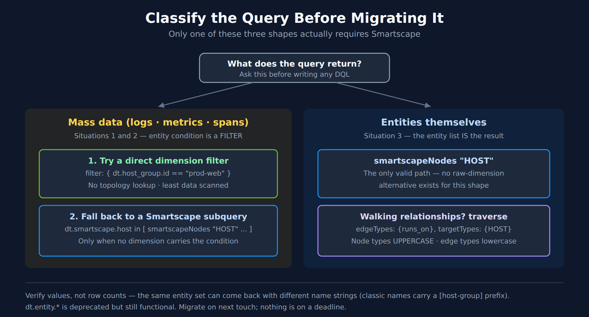

# FAQ-16: How Do I Migrate Classic Entity Selectors to Smartscape?

> **Series:** FAQ — Frequently Asked Questions | **Reference:** 16 — Migrating Classic Entity Selectors to Smartscape | **Created:** July 2026 | **Last Updated:** 08/27/2026

## Overview

`dt.entity.*`, `classicEntitySelector()`, `entityName()`, and `entityAttr()` are deprecated in favour of Smartscape — `smartscapeNodes`, `smartscapeEdges`, and `traverse`. The legacy forms still run, so nothing breaks on a schedule, and migration happens on your terms.

**The most common mistake is not a syntax error.** It is reaching for Smartscape when the query never needed an entity lookup in the first place. A metrics or logs query filtered by an entity condition can usually resolve that condition to a raw dimension on the data itself — no topology lookup, no subquery, less scanned data. Smartscape is the fallback for that shape, not the default.

So the first step is not translation. It is working out which of three things your query is doing.

### Short answer

| Your query | Migrate to |
|---|---|
| Lists entities (`fetch dt.entity.*` as the result) | `smartscapeNodes` — the only valid path |
| Filters mass data (logs, metrics, spans) by an entity condition | A **direct dimension filter** where possible; a Smartscape subquery only if no dimension carries the condition |
| Walks relationships between entities | `traverse` |

---

## Table of Contents

1. [Start by Classifying the Query](#start-by-classifying-the-query)
2. [Entity Type Mapping](#entity-type-mapping)
3. [Migrating the Constructs](#migrating-the-constructs)
4. [A Verified Before-and-After](#a-verified-before-and-after)
5. [Topology Navigation](#topology-navigation)
6. [Things That Are Fields, Not Entities](#things-that-are-fields-not-entities)
7. [Gotchas Worth Knowing First](#gotchas-worth-knowing-first)
8. [Summary and Next Steps](#summary-and-next-steps)

---

<a id="prerequisites"></a>
## Prerequisites

| Requirement | Details |
|-------------|---------|
| **Dynatrace Environment** | SaaS with Grail and Smartscape |
| **Permissions** | `storage:smartscape:read`; plus read on whatever table the mass-data examples target |
| **Prior reading** | Basic DQL familiarity — see ORGNZ-99 for the DQL reference |

> **Validation status.** Every entity and topology query in this document was **executed against a live Dynatrace tenant on 07/23/2026** and returned the results described — including the equivalence check in [section 4](#a-verified-before-and-after) and the edge inventory in [section 5](#topology-navigation). The mass-data examples in [section 1](#start-by-classifying-the-query) that read `logs` or `metrics` were **not** executed; the validation identity lacked `storage:logs:read` and `storage:metrics:read`. They follow the same verified patterns but confirm them against your own data before relying on them.

<a id="start-by-classifying-the-query"></a>
## 1. Start by Classifying the Query



<!-- MARKDOWN_TABLE_ALTERNATIVE
| Situation | What the query does | Migration strategy |
|-----------|--------------------|--------------------|
| 1 | Mass data filtered by an inline entity selector | Resolve the condition to a raw dimension; Smartscape subquery only as fallback |
| 2 | Mass data filtered by an entity subquery | Same — dimension first |
| 3 | Entity list as the result itself | smartscapeNodes; no alternative exists |
For environments where SVG doesn't render
-->

| # | Situation | Classic shape | Strategy |
|---|---|---|---|
| **1** | Mass data filtered by entity conditions | `classicEntitySelector(...)` inline in a `filter:` on a timeseries or logs query | Resolve the conditions to raw data dimensions first |
| **2** | Mass data filtered by an entity subquery | `fetch dt.entity.*` inside `in [...]`, `lookup [...]`, or `join [...]` | Same — dimension first, Smartscape subquery as fallback |
| **3** | Pure entity list | `fetch dt.entity.*` as the primary result | `smartscapeNodes` — no raw-dimension alternative exists |

### Why dimension-first matters for situations 1 and 2

An entity subquery makes the engine resolve a topology lookup before it can filter the data. When the mass data already carries a dimension expressing the same condition, filtering on it directly skips that work entirely.

```
// Situation 1 — classic: entity selector inline in the filter
timeseries avg(dt.host.cpu.usage), from:-1h,
  filter: { in(dt.entity.host, classicEntitySelector("type(HOST),hostGroupName(prod-web)")) }

// Preferred — if a dimension carries the condition, filter on it directly
timeseries avg(dt.host.cpu.usage), from:-1h, by:{dt.smartscape.host},
  filter: { dt.host_group.id == "prod-web" }

// Fallback — only when no dimension expresses the condition
timeseries avg(dt.host.cpu.usage), from:-1h, by:{dt.smartscape.host},
  filter: { dt.smartscape.host in [ smartscapeNodes "HOST"
                                    | filter dt.host_group.id == "prod-web"
                                    | fields id ] }
```

To find out which dimensions your data actually carries, run `fieldsSummary` or `fieldsSnapshot` against the table before choosing. Do not assume a dimension exists — and do not assume it does not.

> **Note the operator.** The fallback uses the `in` **operator** with a bracketed subquery (`field in [ ... ]`), not the `in()` **function**. `in()` takes a static value set — `in(field, {"a", "b"})` — and does not accept an execution block.

> <sub>**Sources:** [Smartscape topology navigation (Dynatrace GitHub — dt-dql-essentials)](https://github.com/dynatrace/dynatrace-for-ai), [Dynatrace Query Language reference (DT docs)](https://docs.dynatrace.com/docs/platform/grail/dynatrace-query-language). **Derived:** the dimension-first ordering combines the deprecation guidance with the observation that a subquery forces a topology resolution the raw dimension avoids.</sub>

<a id="entity-type-mapping"></a>
## 2. Entity Type Mapping

Two vocabularies, and they differ in case. **Field names are lowercase dotted; node type strings are UPPERCASE.**

| Classic field | Smartscape field | `smartscapeNodes` type |
|---|---|---|
| `dt.entity.host` | `dt.smartscape.host` | `"HOST"` |
| `dt.entity.service` | `dt.smartscape.service` | `"SERVICE"` |
| `dt.entity.process_group_instance` | `dt.smartscape.process` | `"PROCESS"` |
| `dt.entity.container_group_instance` | `dt.smartscape.container` | `"CONTAINER"` |
| `dt.entity.kubernetes_cluster` | `dt.smartscape.k8s_cluster` | `"K8S_CLUSTER"` |
| `dt.entity.kubernetes_node` | `dt.smartscape.k8s_node` | `"K8S_NODE"` |
| `dt.entity.kubernetes_service` | `dt.smartscape.k8s_service` | `"K8S_SERVICE"` |
| `dt.entity.cloud_application_instance` | `dt.smartscape.k8s_pod` | `"K8S_POD"` |
| `dt.entity.cloud_application_namespace` | `dt.smartscape.k8s_namespace` | `"K8S_NAMESPACE"` |
| `dt.entity.application` | `dt.smartscape.frontend` | `"FRONTEND"` — with `frontend.type == "web"` |
| `dt.entity.mobile_application` | `dt.smartscape.frontend` | `"FRONTEND"` — with `frontend.type == "mobile"` |
| `dt.entity.custom_application` | *no mapping* | *none — see below* |
| `dt.entity.synthetic_test` | `dt.smartscape.browser_monitor` | `"BROWSER_MONITOR"` |
| `dt.entity.http_check` | `dt.smartscape.http_monitor` | `"HTTP_MONITOR"` |
| `dt.entity.multiprotocol_monitor` | `dt.smartscape.network_availability_monitor` | `"NETWORK_AVAILABILITY_MONITOR"` |
| `dt.entity.synthetic_location` | `dt.smartscape.synthetic_location` | `"SYNTHETIC_LOCATION"` |
| `dt.entity.aws_lambda_function` | `dt.smartscape.aws.lambda_function` | `"AWS_LAMBDA_FUNCTION"` |
| `dt.entity.cloud_application` | several workload fields | several K8s workload types |
| *no classic entity type* | *no model* | `"ACTIVEGATE"` — see below |

`dt.entity.cloud_application` is the awkward one — it fans out to multiple Kubernetes workload types rather than mapping to one. Check the target type before translating it.

`dt.entity.custom_application` has **no** Smartscape mapping at all. Do not invent one — a `"CUSTOM_APPLICATION"` node type does not exist, and querying it returns nothing rather than an error (see [section 7](#gotchas-worth-knowing-first) on ambiguous zero-row results).

### Three rows that do not behave like the rest

**ActiveGate is a different shape from every other row in the table.** There is no classic entity type to migrate *from* — `dt.entity.active_gate`, `dt.entity.environment_active_gate`, and `dt.entity.environment_activegate` all fail with `The entity type ... wasn't found`, so `fetch dt.entity.*_active_gate` was never a working query and is not a fallback. `smartscapeNodes "ACTIVEGATE"` is the only DQL path, and there is no `dt.smartscape.activegate` semantic-dictionary model either — refer to the node by its type string and do not invent a model name. The node exposes `dt.active_gate.id` (hex, the same form as the classic `agId`), `dt.active_gate.version`, `dt.active_gate.group.name`, `dt.network_zone.id`, `is_containerized`, `is_fips`, `modules[]`, `os.type`, and `addresses[]`.

The practical consequence: **migrating ActiveGate work may mean replacing a REST call, not a DQL selector.** ActiveGate 1.343 (published 07/15/2026, rollout from 07/28/2026) deprecates `GET /api/v2/activeGates`, `/api/v2/activeGates/{agId}`, and `/api/v2/activeGates/groups`, so automation that enumerated ActiveGates over the API is the code that needs a new home — and `smartscapeNodes "ACTIVEGATE"` is where it lands. Note that the classic **Entities API v2** selector (`GET /api/v2/entities?entitySelector=type("ENVIRONMENT_ACTIVE_GATE")`) is a *different surface* from DQL and may still respond during the deprecation period; that it works says nothing about whether the DQL entity type exists, because it never did.

**Digital Experience types collapse rather than map one-to-one.** Web and mobile applications both become `FRONTEND` nodes, distinguished by `frontend.type` (`web` / `mobile`). A translation that assumes one classic type per node type will over-count — a query migrated from `dt.entity.application` without a `frontend.type == "web"` filter silently picks up the mobile apps too. `FRONTEND` nodes carry `id_classic` holding the original `APPLICATION-*` / `MOBILE_APPLICATION-*` id, which is the reliable way to reconcile a migrated result against the classic one. One wrinkle worth knowing: `frontend.type` is **absent from the model's own `fields` array** in the semantic dictionary yet queries and filters correctly — so absence from the field list is not proof a field does not exist.

**`synthetic_test` splits, and `multiprotocol_monitor` is renamed.** Monitor and step are **separate node types** — `BROWSER_MONITOR_STEP` and `HTTP_MONITOR_STEP` exist alongside their parents. A classic query that read steps as attributes of the test needs a `traverse` to the step nodes ([section 5](#topology-navigation)), not a field read. And `dt.entity.multiprotocol_monitor` becomes `NETWORK_AVAILABILITY_MONITOR` — a genuine rename, not a transliteration, so pattern-matching the classic name to derive the node type produces a type that does not exist.

> <sub>**Sources:** [Dynatrace Query Language reference (DT docs)](https://docs.dynatrace.com/docs/platform/grail/dynatrace-query-language), [ActiveGate 1.343 release notes (DT docs)](https://docs.dynatrace.com/docs/whats-new/activegate/sprint-343), [Entities API v2 — GET entities (DT docs)](https://docs.dynatrace.com/docs/dynatrace-api/environment-api/entity-v2/get-entities-list). Mappings read from `fetch dt.semantic_dictionary.models` and confirmed against a live tenant, 07/30/2026 — including the three failing `dt.entity.*active_gate*` spellings, `smartscapeNodes "ACTIVEGATE"` returning 4 nodes, and `frontend.type` returning `web` (25) and `mobile` (6) despite its absence from the model's `fields` array.</sub>

<a id="migrating-the-constructs"></a>
## 3. Migrating the Constructs

| Classic | Smartscape | Note |
|---|---|---|
| `entityName(x)` | `name` | Nodes expose `name` directly; `getNodeName(x)` is for resolving an id held in mass data |
| `entityAttr(x, "attr")` | the field itself | Nodes expose their attributes as fields; `getNodeField(x, "attr")` is for mass data |
| `classicEntitySelector("...")` | `filter` on node fields | Translate each predicate to a field comparison |
| `belongs_to[...]`, `runs[...]`, `instance_of[...]` | `traverse` | Or `references[...]` for static edges only |
| classic entity id | `id`, with `id_classic` as the bridge | See [gotchas](#gotchas-worth-knowing-first) |
| `affected_entity_ids` | `smartscape.affected_entity.ids` | Also `.types` for the type list |

The `entityName`/`getNodeName` and `entityAttr`/`getNodeField` pairs are the ones people get wrong, because the `getNode*` functions look like the natural replacements and are not. See [section 7](#gotchas-worth-knowing-first).

> <sub>**Dictionary:** `dt.smartscape.host` publishes `id`, `id_classic`, `name` and `type` as node fields — the basis for the `entityName` → `name` and *classic id → `id`, with `id_classic` as the bridge* rows; read from `dt.semantic_dictionary.models` 08/27/2026. **Derived:** the construct-by-construct mapping is this entry's translation table; no single page presents the classic and Smartscape surfaces side by side.</sub>

<a id="a-verified-before-and-after"></a>
## 4. A Verified Before-and-After

Situation 3 — list the hosts in a host group. Both queries below were executed against the same tenant and returned **the same four host IDs**.

First the classic form:

```dql
// CLASSIC — deprecated, still functional.
// classicEntitySelector() carries the predicate; hostGroupName is a classic attribute.
fetch dt.entity.host
| filter in(id, classicEntitySelector("type(HOST),hostGroupName(esa-k8s-playground)"))
| fields id, entity.name, hostGroupName
| sort entity.name asc
```

Then the Smartscape form. The selector predicate becomes an ordinary field comparison — there is no selector-string equivalent, and that is the point.

```dql
// SMARTSCAPE — the migration target.
// The selector predicate becomes a plain filter on a node field.
smartscapeNodes "HOST"
| filter dt.host_group.id == "esa-k8s-playground"
| fields id, name, dt.host_group.id
| sort name asc
```

**Same four IDs — but not the same output.** The `name` values differ:

| Query | `name` value |
|---|---|
| Classic `entity.name` | `[esa-k8s-playground] - ip-192-168-8-164.ec2.internal` |
| Smartscape `name` | `ip-192-168-8-164.ec2.internal` |

Classic host names are **prefixed with the host group in square brackets**; Smartscape names are not. Anything downstream that matches on the name string — a dashboard filter, a regex, a `contains()`, a report join — will silently stop matching after migration even though the entity set is identical.

**Check the values, not just the row count.** A migration that returns the right number of rows can still return different strings in them.

> <sub>**Sources:** both queries executed against a Dynatrace tenant, 07/23/2026 — 4 records each, identical `id` sets, differing `name` values as shown.</sub>

<a id="topology-navigation"></a>
## 5. Topology Navigation

Classic relationship fields (`belongs_to[...]`, `runs[...]`) become `traverse`. Before traversing, find out which edges exist — the edge inventory is tenant-specific.

```dql
// Which relationship types exist in this tenant, and how common are they?
// smartscapeEdges REQUIRES a type argument — "*" matches all.
smartscapeEdges "*"
| summarize edge_count = count(), by:{type}
| sort edge_count desc
```

On the validation tenant this returned 12 edge types, led by `belongs_to` (4,075), `runs_on` (2,237), `is_part_of` (1,875), `contains` (1,411), and `uses` (896), with `calls`, `routes_to`, `balances`, `is_attached_to`, `monitors`, `balanced_by`, and `is_assigned_to` behind them.

**Edge types are lowercase.** Node types are uppercase (`"HOST"`), edge types are lowercase (`runs_on`). Passing `"RUNS_ON"` returns zero rows rather than an error — it parses, matches nothing, and looks exactly like a tenant with no such relationship.

Now the traversal itself:

```dql
// Walk from a process to the host it runs on.
// traverse takes NAMED parameters — edgeTypes:, targetTypes:, direction:
// Edge types unquoted and lowercase; target types unquoted and uppercase.
smartscapeNodes "PROCESS"
| limit 1
| traverse edgeTypes: {runs_on}, targetTypes: {HOST}, direction: forward
| fields id, name, type
```

Chain `traverse` commands for multi-hop walks. `direction:` accepts `forward` or `backward` — an edge that returns nothing in one direction may well return results in the other, so check both before concluding the relationship is absent.

> <sub>**Sources:** both queries executed against a Dynatrace tenant, 07/23/2026 — the edge inventory returned the 12 types and counts quoted; the traversal returned the expected HOST node. The named-parameter form is required: a `traverse runs_on { PROCESS }` block form fails with `PARSE_ERROR`.</sub>

<a id="things-that-are-fields-not-entities"></a>
## 6. Things That Are Fields, Not Entities

Some classic entity types have **no standalone Smartscape node**. They became attributes of the entity they described. Translating them literally produces a query for a node type that does not exist.

| Classic entity | Smartscape reality |
|---|---|
| Host group | `dt.host_group.id` — a field on `HOST` |
| Process group | fields on `PROCESS` |
| Container group | fields on `CONTAINER`; preserve output shape with placeholders if a consumer expects the old columns |

Section 4 is exactly this case: the classic query treated the host group as a selector predicate against a host-group concept, and the Smartscape query filters a field on the host itself.

A `HOST` node carries substantially more than the classic entity did — on the validation tenant, roughly 35 fields including `dt.host_group.id`, `dt.security_context`, `cloud.provider`, `aws.arn`, `aws.availability_zone`, `os.type`, `os.version`, `cores`, `host.software_technologies`, and `host.custom.metadata`. Inspect a single node before assuming an attribute needs a lookup:

> <sub>**Dictionary:** `dt.host_group.id` is a field on `dt.smartscape.host`, not a node type — and there is **no** Smartscape node model for a Dynatrace host group, process group or container group: of the **2,144** `smartscape.nodes` models, every `*GROUP*` node type is a cloud-provider or database resource (`AWS_EKS_NODEGROUP`, `AZURE_…_CONTAINERGROUPS`, `DB_AVAILABILITY_GROUP_MSSQL`, …). Read from `dt.semantic_dictionary.models` 08/27/2026; the 2,144-model count is the control that makes the absence meaningful rather than an empty result.</sub>

```dql
// What does one node actually expose? Run this before building any migration.
// Cheaper and more reliable than guessing at field names.
smartscapeNodes "HOST"
| limit 1
```

<a id="gotchas-worth-knowing-first"></a>
## 7. Gotchas Worth Knowing First

Each of these was hit while validating this document.

**`getNodeField()` returns null inside `smartscapeNodes`.** It resolves a node id held in *mass data* — it is not for the node you are already iterating. Inside `smartscapeNodes`, read the field directly.

```
// Wrong — returns null, no error
smartscapeNodes "HOST" | fieldsAdd tags = getNodeField(dt.smartscape.host, "tags")

// Right — the node exposes its fields directly
smartscapeNodes "HOST" | fields id, name, dt.host_group.id
```

The same applies to `getNodeName()` versus `name`. Both `getNode*` functions belong on the mass-data side of a query, where you hold an id and need the topology to resolve it.

**Case is not cosmetic.** Node types uppercase (`"HOST"`), edge types lowercase (`runs_on`). The wrong case on an edge type returns zero rows silently.

**`smartscapeEdges` requires a type argument.** Bare `smartscapeEdges` fails with `NO_PARAMETERS_FOR_COMMAND`. Use `"*"` for all types.

**`traverse` uses named parameters.** `edgeTypes:`, `targetTypes:`, `direction:` — not a `{ }` block after the edge name, which fails to parse.

**`id_classic` is the bridge between the two id spaces.** Every Smartscape node carries it. On the validation tenant `id` and `id_classic` were identical for `HOST` and `SERVICE`, which makes joining migrated and unmigrated queries straightforward — but do not generalize that to every node type. Check `id_classic` explicitly rather than assuming the ids match:

```
smartscapeNodes "SERVICE" | fields id, id_classic, name
```

**A zero-row result is ambiguous.** A wrong edge-type case, a genuinely absent relationship, a wrong traversal direction, and a missing read scope all return nothing. Work down that list before assuming the query is wrong.

> <sub>**Sources:** all five behaviours reproduced against a Dynatrace tenant, 07/23/2026 — `getNodeField` null result, `"RUNS_ON"` zero-row return, `NO_PARAMETERS_FOR_COMMAND` on bare `smartscapeEdges`, `PARSE_ERROR` on the `traverse` block form, and identical `id`/`id_classic` on HOST and SERVICE nodes.</sub>

<a id="summary-and-next-steps"></a>
## 8. Summary and Next Steps

**The four things to carry away:**

1. **Classify before translating.** Only a pure entity-list query has to become `smartscapeNodes`. Mass-data queries should try a direct dimension filter first.
2. **Predicates become filters.** `classicEntitySelector("...")` has no Smartscape counterpart by design — each predicate becomes an ordinary field comparison.
3. **Verify values, not row counts.** The host-group example returns the same four entities under both forms with *different* `name` strings. Downstream string matching breaks silently.
4. **Inspect a node before writing the migration.** `smartscapeNodes "<TYPE>" | limit 1` answers most field questions faster than any mapping table.

**Nothing is on a deadline.** `dt.entity.*` still works. Migrate on next touch rather than sweeping, and verify each query's output against the classic form as you go.

| If you need… | Read |
|---|---|
| Host group naming and strategy | FAQ-01 (host group naming strategy) |
| Tagging as a filter dimension | FAQ-02 (tagging sources, standards, strategy) |
| Metric mechanics and selector conversion | FAQ-11 (how metrics work) |
| Segments as the modern filtering construct | ORGNZ-08 (Grail segments), ORGNZ-10 (advanced segment definitions) |
| DQL syntax generally | ORGNZ-99 (best practice summary and DQL reference) |
| The wider classic-to-Gen3 migration this sits inside | The -START-HERE- playbook, Doorway 4 |

---

<sub>*This notebook was AI-generated from community-submitted and publicly available sources. This notebook series is not officially supported by Dynatrace. Always verify information against official Dynatrace documentation.*</sub>
