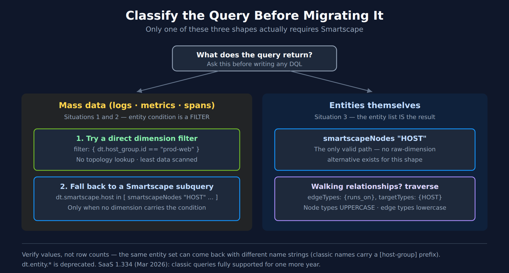

# FAQ-16: How Do I Migrate Classic Entity Selectors to Smartscape?

> **Series:** FAQ — Frequently Asked Questions | **Reference:** 16 — Migrating Classic Entity Selectors to Smartscape | **Created:** July 2026 | **Last Updated:** 10/02/2026

## Overview

`dt.entity.*`, `classicEntitySelector()`, `entityName()`, and `entityAttr()` are deprecated in favour of Smartscape — `smartscapeNodes`, `smartscapeEdges`, and `traverse`. The legacy forms still run, but they are on a support window rather than open-ended: SaaS 1.334 (rollout from 03/10/2026) states that classic queries *"remain fully supported for the next year"*. There is no published removal date yet, so plan the migration inside that window rather than waiting for something to break.

**The most common mistake is not a syntax error.** It is reaching for Smartscape when the query never needed an entity lookup in the first place. A metrics or logs query filtered by an entity condition can usually resolve that condition to a raw dimension on the data itself — no topology lookup, no subquery, less scanned data. Smartscape is the fallback for that shape, not the default.

So the first step is not translation. It is working out which of three things your query is doing.

### Short answer

| Your query | Migrate to |
|---|---|
| Lists entities (`fetch dt.entity.*` as the result) | `smartscapeNodes` — the only valid path |
| Filters mass data (logs, metrics, spans) by an entity condition | A **direct dimension filter** where possible; a Smartscape subquery only if no dimension carries the condition |
| Walks relationships between entities | `traverse` |

> <sub>**Sources:** [What's new in Dynatrace SaaS 1.334 (DT docs)](https://docs.dynatrace.com/docs/whats-new/saas/sprint-334) — *"Classic queries remain fully supported for the next year. Your existing DQL queries using the classic entity model continue to work."*, [Fields referencing classic entities (DT docs)](https://docs.dynatrace.com/docs/semantic-dictionary/tags/entity-id) — *"These fields are deprecated and will be removed in the future; use fields referencing Smartscape nodes instead."*</sub>

---

## Table of Contents

1. [Start by Classifying the Query](#start-by-classifying-the-query)
2. [Entity Type Mapping](#entity-type-mapping)
3. [Migrating the Constructs](#migrating-the-constructs)
4. [A Verified Before-and-After](#a-verified-before-and-after)
5. [Topology Navigation](#topology-navigation)
6. [Things That Are Fields, Not Entities](#things-that-are-fields-not-entities)
7. [Gotchas Worth Knowing First](#gotchas-worth-knowing-first)
8. [Finding the Queries to Migrate](#finding-the-queries-to-migrate)
9. [Summary and Next Steps](#summary-and-next-steps)

---

<a id="prerequisites"></a>
## Prerequisites

| Requirement | Details |
|-------------|---------|
| **Dynatrace Environment** | SaaS with Grail and Smartscape |
| **Permissions** | `storage:smartscape:read` for `smartscapeNodes`, `smartscapeEdges` and `traverse`; `storage:entities:read` for the classic forms (`fetch dt.entity.*`, `classicEntitySelector`); `storage:metrics:read` for the § 1 `timeseries` examples; and `storage:buckets:read` alongside each table permission |
| **Prior reading** | Basic DQL familiarity — see ORGNZ-99 for the DQL reference |

> **Validation status.** Every entity and topology query in this document was **executed against a live Dynatrace tenant on 07/23/2026** and returned the results described — including the equivalence check in [section 4](#a-verified-before-and-after) and the edge inventory in [section 5](#topology-navigation). The three `timeseries` forms in [section 1](#start-by-classifying-the-query) were executed on 10/02/2026 against a real host group: grouped by host, the classic `classicEntitySelector` filter, the direct `dt.host_group.id` filter and the Smartscape-subquery fallback each returned the same four hosts, with no notifications.

> <sub>**Sources:** [Assign permissions in Grail (DT docs)](https://docs.dynatrace.com/docs/platform/grail/organize-data/assign-permissions-in-grail) — the table-permission list maps `storage:entities:read` to `fetch`, `classicEntitySelector`, `entityAttr` and `entityName`, `storage:metrics:read` to `timeseries`, and `storage:smartscape:read` to `smartscapeNodes`, `smartscapeEdges`, `getNodeName()` and `getNodeField()`; it also notes that *"granting access to buckets, you also need to configure table permissions"*.</sub>

<a id="start-by-classifying-the-query"></a>
## 1. Start by Classifying the Query



<!-- MARKDOWN_TABLE_ALTERNATIVE
| Situation | What the query does | Migration strategy |
|-----------|--------------------|--------------------|
| 1 | Mass data filtered by an inline entity selector | Resolve the condition to a raw dimension; Smartscape subquery only as fallback |
| 2 | Mass data filtered by an entity subquery | Same — dimension first |
| 3 | Entity list as the result itself | smartscapeNodes; no alternative exists |
For environments where SVG doesn't render
-->

| # | Situation | Classic shape | Strategy |
|---|---|---|---|
| **1** | Mass data filtered by entity conditions | `classicEntitySelector(...)` inline in a `filter:` on a timeseries or logs query | Resolve the conditions to raw data dimensions first |
| **2** | Mass data filtered by an entity subquery | `fetch dt.entity.*` inside `in [...]`, `lookup [...]`, or `join [...]` | Same — dimension first, Smartscape subquery as fallback |
| **3** | Pure entity list | `fetch dt.entity.*` as the primary result | `smartscapeNodes` — no raw-dimension alternative exists |

### Why dimension-first matters for situations 1 and 2

An entity subquery makes the engine resolve a topology lookup before it can filter the data. When the mass data already carries a dimension expressing the same condition, filtering on it directly skips that work entirely.

```dql
// Situation 1 — classic: entity selector inline in the filter
timeseries avg(dt.host.cpu.usage), from:-1h,
  filter: { in(dt.entity.host, classicEntitySelector("type(HOST),hostGroupName(prod-web)")) }

// Preferred — if a dimension carries the condition, filter on it directly
timeseries avg(dt.host.cpu.usage), from:-1h, by:{dt.smartscape.host},
  filter: { dt.host_group.id == "prod-web" }

// Fallback — only when no dimension expresses the condition
timeseries avg(dt.host.cpu.usage), from:-1h, by:{dt.smartscape.host},
  filter: { dt.smartscape.host in [ smartscapeNodes "HOST"
                                    | filter dt.host_group.id == "prod-web"
                                    | fields id ] }
```

To find out which dimensions your data actually carries, run `fieldsSummary` or `fieldsSnapshot` against the table before choosing. Do not assume a dimension exists — and do not assume it does not.

> **Note the operator.** The fallback uses the `in` **operator** with a bracketed subquery (`field in [ ... ]`), not the `in()` **function**. `in()` takes a static value set — `in(field, {"a", "b"})` — and does not accept an execution block.

> <sub>**Sources:** [Smartscape topology navigation (Dynatrace GitHub — dt-dql-essentials)](https://github.com/dynatrace/dynatrace-for-ai), [Dynatrace Query Language reference (DT docs)](https://docs.dynatrace.com/docs/platform/grail/dynatrace-query-language). **Derived:** the dimension-first ordering combines the deprecation guidance with the observation that a subquery forces a topology resolution the raw dimension avoids.</sub>

<a id="entity-type-mapping"></a>
## 2. Entity Type Mapping

Two vocabularies, and they differ in case. **Field names are lowercase dotted; node type strings are UPPERCASE.**

| Classic field | Smartscape field | `smartscapeNodes` type |
|---|---|---|
| `dt.entity.host` | `dt.smartscape.host` | `"HOST"` |
| `dt.entity.service` | `dt.smartscape.service` | `"SERVICE"` |
| `dt.entity.process_group_instance` | `dt.smartscape.process` | `"PROCESS"` |
| `dt.entity.container_group_instance` | `dt.smartscape.container` | `"CONTAINER"` |
| `dt.entity.kubernetes_cluster` | `dt.smartscape.k8s_cluster` | `"K8S_CLUSTER"` |
| `dt.entity.kubernetes_node` | `dt.smartscape.k8s_node` | `"K8S_NODE"` |
| `dt.entity.kubernetes_service` | `dt.smartscape.k8s_service` | `"K8S_SERVICE"` |
| `dt.entity.cloud_application_instance` | `dt.smartscape.k8s_pod` | `"K8S_POD"` |
| `dt.entity.cloud_application_namespace` | `dt.smartscape.k8s_namespace` | `"K8S_NAMESPACE"` |
| `dt.entity.application` | `dt.smartscape.frontend` | `"FRONTEND"` — with `frontend.type == "web"` |
| `dt.entity.mobile_application` | `dt.smartscape.frontend` | `"FRONTEND"` — with `frontend.type == "mobile"` |
| `dt.entity.custom_application` | `dt.smartscape.frontend` per the docs field reference — **not** in the dictionary's `classic_models` | `"FRONTEND"` — verify on your tenant; see below |
| `dt.entity.synthetic_test` | `dt.smartscape.browser_monitor` | `"BROWSER_MONITOR"` |
| `dt.entity.http_check` | `dt.smartscape.http_monitor` | `"HTTP_MONITOR"` |
| `dt.entity.multiprotocol_monitor` | `dt.smartscape.network_availability_monitor` | `"NETWORK_AVAILABILITY_MONITOR"` |
| `dt.entity.synthetic_location` | `dt.smartscape.synthetic_location` | `"SYNTHETIC_LOCATION"` |
| `dt.entity.aws_lambda_function` | `dt.smartscape.aws_lambda_function` — matched by name; not in the dictionary's `classic_models` | `"AWS_LAMBDA_FUNCTION"` — no `id_classic`; reconcile on `aws.arn` |
| `dt.entity.cloud_application` | several workload fields | several K8s workload types |
| *no classic entity type* | `dt.smartscape.activegate` — no `classic_models` | `"ACTIVEGATE"` — see below |

> **The transition is now underway in-product, starting with Cost Intelligence (SaaS 1.347 — the release notes are still marked pre-release, with a planned rollout from 09/08/2026; verify the change has reached your tenant).** Verbatim: *"Dynatrace is transitioning entity ID attributes in billing usage events from the Classic Monitored Entity (ME) model to Smartscape-based IDs."* The release note names the same three mappings this table already carries — `dt.entity.host` → `dt.smartscape.host`, `dt.entity.kubernetes_cluster` → `dt.smartscape.k8s_cluster`, `dt.entity.cloud_application_namespace` → `dt.smartscape.k8s_namespace`.
>
> Two things this does and does not mean. It **does** confirm the direction of travel this entry describes, and it makes the migration concrete in one surface first — so a Cost Intelligence query written against classic IDs is the one to re-check now. It **does not** retire classic entity IDs corpus-wide: the rest of the platform still accepts them, and the dimension-first strategy in §1 remains the right default for mass-data queries. Migrate where the product has moved, not everywhere at once.

`dt.entity.cloud_application` is the awkward one — it fans out to multiple Kubernetes workload types rather than mapping to one. Check the target type before translating it.

`dt.entity.custom_application` is the row where the two sources disagree. The docs field reference points it at `dt.smartscape.frontend`, but the tenant dictionary lists only `dt.entity.application` and `dt.entity.mobile_application` as classic counterparts of the `FRONTEND` model, and no custom-application `FRONTEND` nodes were observed on the validation tenant (which has no custom applications). Before migrating, check whether your custom applications surface as `FRONTEND` nodes — `smartscapeNodes "FRONTEND", from:-7d | filter startsWith(id_classic, "CUSTOM_APPLICATION")`. What does not exist is a `"CUSTOM_APPLICATION"` node type: querying it returns nothing rather than an error (see [section 7](#gotchas-worth-knowing-first) on ambiguous zero-row results).

### Three rows that do not behave like the rest

**ActiveGate is a different shape from every other row in the table.** There is no classic entity type to migrate *from* — `dt.entity.active_gate`, `dt.entity.environment_active_gate`, and `dt.entity.environment_activegate` all return **zero rows** with only a WARNING notification (`The entity type … wasn't found`) — no error — so `fetch dt.entity.*_active_gate` was never a working query and is not a fallback, and a reader who only looks at the rows sees an empty environment. `smartscapeNodes "ACTIVEGATE"` is the only DQL path. The semantic dictionary now carries a `dt.smartscape.activegate` model for it (node type `ACTIVEGATE`, no classic counterpart listed, read 10/02/2026). The node exposes `dt.active_gate.id` (hex, the same form as the classic `agId`), `dt.active_gate.version`, `dt.active_gate.group.name`, `dt.network_zone.id`, `is_containerized`, `is_fips`, `modules[]`, `os.type`, `addresses[]`, `load_balancer_addresses` and `dt.remote_extensions.version`.

The practical consequence: **migrating ActiveGate work may mean replacing a REST call, not a DQL selector.** ActiveGate 1.343 (published 07/15/2026, rollout from 07/28/2026) deprecates `GET /api/v2/activeGates`, `/api/v2/activeGates/{agId}`, and `/api/v2/activeGates/groups`, so automation that enumerated ActiveGates over the API is the code that needs a new home — and `smartscapeNodes "ACTIVEGATE"` is where it lands. Note that the classic **Entities API v2** selector (`GET /api/v2/entities?entitySelector=type("ENVIRONMENT_ACTIVE_GATE")`) is a *different surface* from DQL and may still respond during the deprecation period; that it works says nothing about whether the DQL entity type exists, because it never did.

**Digital Experience types collapse rather than map one-to-one.** Web and mobile applications both become `FRONTEND` nodes, distinguished by `frontend.type` (`web` / `mobile`). A translation that assumes one classic type per node type will over-count — a query migrated from `dt.entity.application` without a `frontend.type == "web"` filter silently picks up the mobile apps too. `FRONTEND` nodes carry `id_classic` holding the original `APPLICATION-*` / `MOBILE_APPLICATION-*` id, which is the reliable way to reconcile a migrated result against the classic one. One wrinkle worth knowing: `frontend.type` is **absent from the model's own `fields` array** in the semantic dictionary yet queries and filters correctly — so absence from the field list is not proof a field does not exist.

**`synthetic_test` splits, and `multiprotocol_monitor` is renamed.** Monitor and step are **separate node types** — `BROWSER_MONITOR_STEP` and `HTTP_MONITOR_STEP` exist alongside their parents. A classic query that read steps as attributes of the test needs a `traverse` to the step nodes ([section 5](#topology-navigation)), not a field read. And `dt.entity.multiprotocol_monitor` becomes `NETWORK_AVAILABILITY_MONITOR` — a genuine rename, not a transliteration, so pattern-matching the classic name to derive the node type produces a type that does not exist.

> <sub>**Sources:**</sub>
> - <sub>[What's new in Dynatrace SaaS 1.347 (DT docs)](https://docs.dynatrace.com/docs/whats-new/saas/sprint-347) — the Cost Intelligence classic-ME to Smartscape transition quoted above; the page is headed *"Pre-release information"* with *"Rollout start on Sep 08, 2026 (planned)"*</sub>
> - <sub>[Fields referencing classic entities (DT docs)](https://docs.dynatrace.com/docs/semantic-dictionary/tags/entity-id) — for `dt.entity.custom_application`: *"This field is deprecated and will be removed in the future. Use dt.smartscape.frontend instead."* The page has no `dt.entity.aws_lambda_function` row</sub>
> - <sub>[Dynatrace Query Language reference (DT docs)](https://docs.dynatrace.com/docs/platform/grail/dynatrace-query-language), [ActiveGate 1.343 release notes (DT docs)](https://docs.dynatrace.com/docs/whats-new/activegate/sprint-343), [Entities API v2 — GET entities (DT docs)](https://docs.dynatrace.com/docs/dynatrace-api/environment-api/entity-v2/get-entities-list)</sub>
> - <sub>**Dictionary:** mappings read from `fetch dt.semantic_dictionary.models` 07/30/2026 and re-read 10/02/2026, except the `custom_application` row (docs field reference) and the Lambda row (matched by name). `dt.smartscape.frontend` `classic_models`: `dt.entity.application`, `dt.entity.mobile_application`; `dt.smartscape.aws_lambda_function` and `dt.smartscape.activegate` `classic_models`: empty; `frontend.type` absent from the `FRONTEND` model's `fields` array, read 10/02/2026</sub>
> - <sub>Live tenant, 07/30/2026 and 10/02/2026: the three `dt.entity.*active_gate*` spellings return `records: []` with an `ENTITY_DATA_OBJECT_UNDEFINED` WARNING; `smartscapeNodes "ACTIVEGATE"` returned 4 nodes; `frontend.type` returned `web` (27) and `mobile` (7) over 7 days, every `id_classic` prefixed `APPLICATION-` or `MOBILE_APPLICATION-`; 34 `AWS_LAMBDA_FUNCTION` nodes, none with `id_classic`, all with `aws.arn`</sub>

<a id="migrating-the-constructs"></a>
## 3. Migrating the Constructs

| Classic | Smartscape | Note |
|---|---|---|
| `entityName(x)` | `name` | Nodes expose `name` directly; `getNodeName(x)` is for resolving an id held in mass data |
| `entityAttr(x, "attr")` | the field itself | Nodes expose their attributes as fields; `getNodeField(x, "attr")` is for mass data |
| `classicEntitySelector("...")` | `filter` on node fields | Translate each predicate to a field comparison |
| `belongs_to[...]`, `runs[...]`, `instance_of[...]` | `traverse` | Or `references[...]` for static edges only |
| classic entity id | `id`, with `id_classic` as the bridge | See [gotchas](#gotchas-worth-knowing-first) |
| `affected_entity_ids` | `smartscape.affected_entities` | An array of `{id, type, name}` records — `smartscape.affected_entities[][id]` gives the id list. `smartscape.affected_entity.ids` / `.types` are **also deprecated**; do not migrate to them |

The `entityName`/`getNodeName` and `entityAttr`/`getNodeField` pairs are the ones people get wrong, because the `getNode*` functions look like the natural replacements and are not. See [section 7](#gotchas-worth-knowing-first).

> <sub>**Sources:** [Davis AI (DT docs — semantic dictionary)](https://docs.dynatrace.com/docs/semantic-dictionary/model/davis) — `affected_entity_ids`: *"This field is deprecated and will be removed in the future. Use smartscape.affected_entities instead."*; `smartscape.affected_entity.ids`: *"This field is deprecated and will be removed in the future. Use 'smartscape.affected_entities' instead."*, [What's new in Dynatrace SaaS 1.347 (DT docs)](https://docs.dynatrace.com/docs/whats-new/saas/sprint-347) — pre-release notes that refer to *"tenants where the deprecated fields are no longer written"*. `smartscape.affected_entities[][id]` executed against `dt.davis.problems` 10/02/2026 and returned the same ids as `smartscape.affected_entity.ids`.</sub>

> <sub>**Dictionary:** `dt.smartscape.host` publishes `id`, `id_classic`, `name` and `type` as node fields — the basis for the `entityName` → `name` and *classic id → `id`, with `id_classic` as the bridge* rows; read from `dt.semantic_dictionary.models` 08/27/2026. **Derived:** the construct-by-construct mapping is this entry's translation table; no single page presents the classic and Smartscape surfaces side by side.</sub>

<a id="a-verified-before-and-after"></a>
## 4. A Verified Before-and-After

Situation 3 — list the hosts in a host group. Both queries below were executed against the same tenant and returned **the same four host IDs**.

First the classic form:

```dql
// CLASSIC — deprecated, still functional.
// classicEntitySelector() carries the predicate; hostGroupName is a classic attribute.
fetch dt.entity.host
| filter in(id, classicEntitySelector("type(HOST),hostGroupName(esa-k8s-playground)"))
| fields id, entity.name, hostGroupName
| sort entity.name asc
```

Then the Smartscape form. The selector predicate becomes an ordinary field comparison — there is no selector-string equivalent, and that is the point.

```dql
// SMARTSCAPE — the migration target.
// The selector predicate becomes a plain filter on a node field.
smartscapeNodes "HOST"
| filter dt.host_group.id == "esa-k8s-playground"
| fields id, name, dt.host_group.id
| sort name asc
```

**Same four IDs — but not the same output.** The `name` values differ:

| Query | `name` value |
|---|---|
| Classic `entity.name` | `[esa-k8s-playground] - ip-192-168-8-164.ec2.internal` |
| Smartscape `name` | `ip-192-168-8-164.ec2.internal` |

Classic host names are **prefixed with the host group in square brackets**; Smartscape names are not. Anything downstream that matches on the name string — a dashboard filter, a regex, a `contains()`, a report join — will silently stop matching after migration even though the entity set is identical.

**Check the values, not just the row count.** A migration that returns the right number of rows can still return different strings in them.

> <sub>**Sources:** both queries executed against a Dynatrace tenant, 07/23/2026 — 4 records each, identical `id` sets, differing `name` values as shown.</sub>

<a id="topology-navigation"></a>
## 5. Topology Navigation

Classic relationship fields (`belongs_to[...]`, `runs[...]`) become `traverse`. Before traversing, find out which edges exist — the edge inventory is tenant-specific.

```dql
// Which relationship types exist in this tenant, and how common are they?
// smartscapeEdges REQUIRES a type argument — "*" matches all.
smartscapeEdges "*"
| summarize edge_count = count(), by:{type}
| sort edge_count desc
```

On the validation tenant this returned 12 edge types, led by `belongs_to` (4,075), `runs_on` (2,237), `is_part_of` (1,875), `contains` (1,411), and `uses` (896), with `calls`, `routes_to`, `balances`, `is_attached_to`, `monitors`, `balanced_by`, and `is_assigned_to` behind them.

**Edge types are lowercase.** Node types are uppercase (`"HOST"`), edge types are lowercase (`runs_on`). Passing `"RUNS_ON"` returns zero rows rather than an error — it parses, matches nothing, and looks exactly like a tenant with no such relationship.

Now the traversal itself:

```dql
// Walk from a process to the host it runs on.
// traverse takes NAMED parameters — edgeTypes:, targetTypes:, direction:
// Edge types unquoted and lowercase; target types unquoted and uppercase.
smartscapeNodes "PROCESS"
| limit 1
| traverse edgeTypes: {runs_on}, targetTypes: {HOST}, direction: forward
| fields id, name, type
```

Chain `traverse` commands for multi-hop walks. `direction:` accepts `forward` or `backward` — an edge that returns nothing in one direction may well return results in the other, so check both before concluding the relationship is absent.

> <sub>**Sources:** both queries executed against a Dynatrace tenant, 07/23/2026 — the edge inventory returned the 12 types and counts quoted; the traversal returned the expected HOST node. The named-parameter form is required: a `traverse runs_on { PROCESS }` block form fails with `PARSE_ERROR`.</sub>

<a id="things-that-are-fields-not-entities"></a>
## 6. Things That Are Fields, Not Entities

Some classic entity types have **no standalone Smartscape node**. They became attributes of the entity they described. Translating them literally produces a query for a node type that does not exist.

| Classic entity | Smartscape reality |
|---|---|
| Host group | `dt.host_group.id` — a field on `HOST` |
| Process group | fields on `PROCESS` |
| Container group | fields on `CONTAINER`; preserve output shape with placeholders if a consumer expects the old columns |

Section 4 is exactly this case: the classic query treated the host group as a selector predicate against a host-group concept, and the Smartscape query filters a field on the host itself.

A `HOST` node carries substantially more than the classic entity did — on the validation tenant, roughly 35 fields including `dt.host_group.id`, `dt.security_context`, `cloud.provider`, `aws.arn`, `aws.availability_zone`, `os.type`, `os.version`, `cores`, `host.software_technologies`, and `host.custom.metadata`. Inspect a single node before assuming an attribute needs a lookup:

> <sub>**Dictionary:** `dt.host_group.id` is a field on `dt.smartscape.host`, not a node type — and there is **no** Smartscape node model for a Dynatrace host group, process group or container group: of the **2,144** `smartscape.nodes` models, every `*GROUP*` node type is a cloud-provider or database resource (`AWS_EKS_NODEGROUP`, `AZURE_…_CONTAINERGROUPS`, `DB_AVAILABILITY_GROUP_MSSQL`, …). Read from `dt.semantic_dictionary.models` 08/27/2026; the 2,144-model count is the control that makes the absence meaningful rather than an empty result.</sub>

```dql
// What does one node actually expose? Run this before building any migration.
// Cheaper and more reliable than guessing at field names.
smartscapeNodes "HOST"
| limit 1
```

<a id="gotchas-worth-knowing-first"></a>
## 7. Gotchas Worth Knowing First

Each of these was hit while validating this document.

**`getNodeField()` returns null inside `smartscapeNodes`.** It resolves a node id held in *mass data* — it is not for the node you are already iterating. Inside `smartscapeNodes`, read the field directly.

```dql
// Wrong — returns null, no error
smartscapeNodes "HOST" | fieldsAdd tags = getNodeField(dt.smartscape.host, "tags")

// Right — the node exposes its fields directly
smartscapeNodes "HOST" | fields id, name, dt.host_group.id
```

The same applies to `getNodeName()` versus `name`. Both `getNode*` functions belong on the mass-data side of a query, where you hold an id and need the topology to resolve it.

**Case is not cosmetic.** Node types uppercase (`"HOST"`), edge types lowercase (`runs_on`). The wrong case on an edge type returns zero rows silently.

**`smartscapeEdges` requires a type argument.** Bare `smartscapeEdges` fails with `NO_PARAMETERS_FOR_COMMAND`. Use `"*"` for all types.

**`traverse` uses named parameters.** `edgeTypes:`, `targetTypes:`, `direction:` — not a `{ }` block after the edge name, which fails to parse.

**`id_classic` is the bridge between the two id spaces — and you cannot compare it with `==`.** Every Smartscape node that has a classic counterpart carries it, holding the classic `HOST-…` / `SERVICE-…` identifier, which makes it the obvious key for joining migrated and unmigrated queries. The obvious way to use it does not work. (Smartscape-native types such as `ACTIVEGATE`, `ONEAGENT` and cloud resources like `AWS_EC2_INSTANCE` carry no `id_classic` at all, and `PROCESS` carried it on 210 of 215 nodes on the validation tenant, 09/28/2026 — so filter reconciliation queries with `isNotNull(id_classic)` before counting unmatched nodes.)

`id` and `id_classic` are **different types**: `id` is a `smartscape_id`, `id_classic` is a `string`. Comparing them directly is **always false**, even when the two values print identically side by side. Grail never raises an error — on 09/21/2026 it attached an **INFO-severity notification** to the otherwise-successful result, and on 09/24/2026 not even that — so the query runs, returns a full set of rows, and answers the opposite of the question:

```dql
// Wrong — "no" on every row, and no error. Both columns print the SAME value.
smartscapeNodes "SERVICE"
| fieldsAdd same = if(id == id_classic, then: "yes", else: "no")

// Right — compare like with like
smartscapeNodes "SERVICE"
| fieldsAdd same = if(toString(id) == id_classic, then: "yes", else: "no")
```

On the validation tenant (09/21/2026) `toString(id) == id_classic` matched **23 of 23** services and **7 of 7** hosts; the bare `==` matched **0** of each, with Grail attaching this notification text (tenant response, 09/21/2026): The `==` operation will always return `false` as `id` is a smartscape id, while `id_classic` is a string.

**Why this one bites hardest during a migration.** Reconciling `id_classic` against the source tenant's ids is how you prove the target tenant found everything — so a reconciliation query built on the bare `==` reports that *nothing* matched, which is indistinguishable from a failed migration and sends you hunting a problem that does not exist. Used as a `filter` instead, it returns zero rows, which reads as "nothing to fix." Both directions are silent. **FAQ-25 § 4** covers the migration case.

The values being identical on `HOST` and `SERVICE` is also not something to generalize to every node type. Inspect before you rely on it:

```dql
smartscapeNodes "SERVICE" | fields id, id_classic, name
```

**A zero-row result is ambiguous.** A wrong edge-type case, a genuinely absent relationship, a wrong traversal direction, and a missing read scope all return nothing. Work down that list before assuming the query is wrong.

> <sub>**Sources:** all five behaviours reproduced against a Dynatrace tenant, 07/23/2026 — `getNodeField` null result, `"RUNS_ON"` zero-row return, `NO_PARAMETERS_FOR_COMMAND` on bare `smartscapeEdges`, `PARSE_ERROR` on the `traverse` block form, and identical `id`/`id_classic` values on HOST and SERVICE nodes. The `==` type-mismatch behaviour was reproduced separately on 09/21/2026 — SERVICE 23 of 23 and HOST 7 of 7 matched with `toString(id)`, 0 of each without, with the `EQUALITY_COMPARISON_OF_INCOMPATIBLE_TYPES` notification quoted verbatim from the query response. Re-run 09/24/2026: same result, with an empty `notifications` array. `id_classic` population by node type executed 09/28/2026.</sub>

<a id="finding-the-queries-to-migrate"></a>
## 8. Finding the Queries to Migrate

Everything above assumes you already know which queries to migrate. In practice that is the hard part: classic-entity DQL is spread across dashboard tiles, notebook sections, workflow tasks and segment variables that nobody has opened in months.

Grail records every query it runs in `dt.system.query_executions`, including the query text and the app that sent it, so you can get the list from execution history instead of opening every document. The query engine also sets a flag, `CLASSIC_ENTITY_MIGRATION_ADVISED`, on executions it recognizes as classic-entity DQL. That value comes from the tenant, not from a docs page. Dynatrace's own **Check your upgrade readiness** dashboard filters on it, and on the validation tenant it was set on about 365,000 of 2.4 million successful executions over 30 days (09/29/2026).

Do not rely on the flag alone. The query below also matches the classic constructs in the query text, which catches executions the flag misses. On the same tenant, text matching found about 408,000 executions against 365,000 flagged.

```dql
// Which dashboards, notebooks and workflows still run classic-entity DQL?
// Ranked by executions: the top rows are the documents people actually use.
fetch dt.system.query_executions, from:-30d
| filter status == "SUCCEEDED"
| filter in(client.application_context, {"dynatrace.dashboards", "dynatrace.notebooks", "dynatrace.automations"})
| filter in("CLASSIC_ENTITY_MIGRATION_ADVISED", flags)
    or contains(query_string, "classicEntitySelector")
    or contains(query_string, "entityName(")
    or contains(query_string, "entityAttr(")
    or contains(query_string, "dt.entity.")
// Dashboards and notebooks carry their document id in the client URL; workflows carry it in their own field.
| parse client.source, "LD '/ui/dashboard/' [a-zA-Z0-9._-]+:dashboard_id"
| parse client.source, "LD '/ui/notebook/' [a-zA-Z0-9._-]+:notebook_id"
| fieldsAdd document_id = coalesce(dashboard_id, notebook_id, client.workflow_context)
| summarize {executions = count(), users = countDistinct(user.email)}, by:{client.application_context, document_id}
| sort executions desc
| limit 50
```

On the validation tenant this returned 17 documents (10/02/2026): two workflows at the top (2,160 and 200 executions), then a notebook and a run of dashboards, nearly all with a single user. One workflow on a schedule can run more classic-entity DQL than all your dashboards together, so the ranking tends to put scheduled automation first. That is also the right order to fix things in.

**Reading the result.**

- `document_id` is the id that appears in the document's own URL (`…/ui/dashboard/<id>`, `…/ui/notebook/<id>`) or, for a workflow, its workflow id. Ids that read as names rather than UUIDs, such as `com-dynatrace-extension-postgres-overview` or `dynatrace.upgrade.readiness.migration-status`, belong to ready-made or extension content. The second one is the readiness dashboard itself. It runs `fetch dt.entity.*` queries of its own, so its own checks will list it. Find out who owns a document before you plan to edit it.
- `users` separates a document one person runs from one a team depends on. A document with one user and a handful of executions is a candidate to retire rather than migrate.
- **A document missing from the list has not run in the window, which is different from being clean.** A dashboard nobody opened in 30 days has no executions to find. Widen `from:` before you conclude the migration is done.
- `contains(query_string, "dt.entity.")` also matches `dt.entity.*` *dimensions* in a `by:` or `filter:`. That is intended, since those are situation 1 and 2 queries from [section 1](#start-by-classifying-the-query). It also means the text match never proves a query is a pure entity list.

Segment variables and Site Reliability Guardian objectives run classic-entity DQL too. The readiness dashboard finds them through `client.client_context` and the `dynatrace.site.reliability.guardian` application context. Add those to the `in(client.application_context, …)` list if your tenant uses them.

> <sub>**Sources:** query executed against a Dynatrace tenant 09/29/2026 (14 documents) and re-executed 10/02/2026 (17 documents, no notifications); 364,711 flagged and 407,789 text-matched out of 2,360,811 successful executions in 30 days. **Dictionary:** the `query_execution_event` model lists `query_string`, `client.application_context`, `client.source`, `status` and `flags`, read 09/29/2026. The `CLASSIC_ENTITY_MIGRATION_ADVISED` value appears in no public documentation page found on 09/29/2026; it is observed tenant behaviour and is also the filter the ready-made *Check your upgrade readiness* dashboard uses. `client.workflow_context` is not in that model's field list but was populated on every workflow row returned.</sub>

<a id="summary-and-next-steps"></a>
## 9. Summary and Next Steps

**The four things to carry away:**

1. **Classify before translating.** Only a pure entity-list query has to become `smartscapeNodes`. Mass-data queries should try a direct dimension filter first.
2. **Predicates become filters.** `classicEntitySelector("...")` has no Smartscape counterpart by design — each predicate becomes an ordinary field comparison.
3. **Verify values, not row counts.** The host-group example returns the same four entities under both forms with *different* `name` strings. Downstream string matching breaks silently.
4. **Inspect a node before writing the migration.** `smartscapeNodes "<TYPE>" | limit 1` answers most field questions faster than any mapping table.

**There is no removal date yet, but there is a support window.** SaaS 1.334 (rollout from 03/10/2026) states that classic queries *"remain fully supported for the next year"*. Plan the migration inside that window rather than sweeping everything at once: start from the ranked list in [section 8](#finding-the-queries-to-migrate), take first the surfaces the product is moving (Cost Intelligence, SaaS 1.347 — release notes still pre-release), and verify each query's output against the classic form as you go.

> <sub>**Sources:** [What's new in Dynatrace SaaS 1.334 (DT docs)](https://docs.dynatrace.com/docs/whats-new/saas/sprint-334) — *"Classic queries remain fully supported for the next year."*</sub>

| If you need… | Read |
|---|---|
| Host group naming and strategy | FAQ-01 (host group naming strategy) |
| Tagging as a filter dimension | FAQ-02 (tagging sources, standards, strategy) |
| Metric mechanics and selector conversion | FAQ-11 (how metrics work) |
| Segments as the modern filtering construct | ORGNZ-08 (Grail segments), ORGNZ-10 (advanced segment definitions) |
| DQL syntax generally | ORGNZ-99 (best practice summary and DQL reference) |
| The wider classic-to-Gen3 migration this sits inside | The -START-HERE- playbook, Doorway 4 |

---

<sub>*This notebook was AI-generated from community-submitted and publicly available sources. This notebook series is not officially supported by Dynatrace. Always verify information against official Dynatrace documentation.*</sub>
