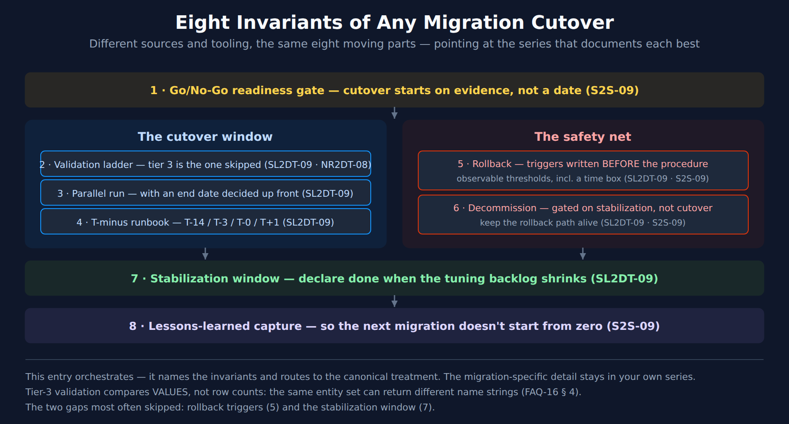

# FAQ-17: How Do I Plan a Migration Cutover?

> **Series:** FAQ — Frequently Asked Questions | **Reference:** 17 — Planning a Migration Cutover | **Created:** July 2026 | **Last Updated:** 07/23/2026

## Overview

Every migration in this corpus — Managed → SaaS, SaaS → SaaS, Splunk, New Relic, Sumo Logic, Classic Logs → OpenPipeline, management zones → policies — ends in the same shape. Different sources, different tooling, the same eight moving parts.

This entry names those parts and points at the series that documents each one best. **It restates none of them.** If you are running one of those migrations, your series already has the detail; use this to check you have not skipped an element. If you are writing a new migration runbook, use it as the outline so you do not re-derive the structure from scratch.

### The eight invariants

| # | Element | Skipping it means |
|---|---|---|
| 1 | **Go/No-Go readiness gate** | Cutover starts on a date rather than on evidence |
| 2 | **Validation ladder** | "It parses" gets mistaken for "it is correct" |
| 3 | **Parallel-run window with an end date** | The window never closes and both systems are maintained forever |
| 4 | **T-minus runbook** | Sequencing decisions get made on cutover day |
| 5 | **Rollback triggers, defined before the procedure** | The abort decision gets made under pressure by whoever is most tired |
| 6 | **Decommission sequence** | The old system lingers, still costing money and still authoritative to someone |
| 7 | **Stabilization window** | Cutover is declared done while the tuning backlog is still growing |
| 8 | **Lessons-learned capture** | The next migration in your estate starts from zero |

---

## Table of Contents

1. [Where Each Element Is Documented](#where-each-element-is-documented)
2. [The Validation Ladder](#the-validation-ladder)
3. [The Parallel-Run Window](#the-parallel-run-window)
4. [The T-Minus Skeleton](#the-t-minus-skeleton)
5. [Rollback: Triggers Before Procedures](#rollback-triggers-before-procedures)
6. [Entity-Level Parity Checks](#entity-level-parity-checks)
7. [Decommission and the Stabilization Window](#decommission-and-the-stabilization-window)
8. [If You Are Writing a New Migration Series](#if-you-are-writing-a-new-migration-series)
9. [Summary and Next Steps](#summary-and-next-steps)

---

<a id="prerequisites"></a>
## Prerequisites

| Requirement | Details |
|-------------|---------|
| **Applies to** | Any migration that ends in a cutover — tool replacement, deployment change, or in-place surface migration |
| **Prior reading** | The procedural series for your specific migration — this entry assumes it, it does not replace it |
| **Permissions** | Read on the tables you intend to validate; `storage:smartscape:read` for the entity-parity queries in section 6 |

> **Validation status.** The entity-parity queries in [section 6](#entity-level-parity-checks) were executed against a live Dynatrace tenant on 07/23/2026. The rest of this entry is structural guidance and cross-references rather than DQL.

<a id="where-each-element-is-documented"></a>
## 1. Where Each Element Is Documented



<!-- MARKDOWN_TABLE_ALTERNATIVE
| Element | Canonical treatment |
|---------|--------------------|
| Go/No-Go gate | S2S-09 |
| Validation ladder | SL2DT-09 and NR2DT-08 |
| Parallel-run discipline | SL2DT-09 |
| T-minus runbook | SL2DT-09 |
| Rollback | SL2DT-09 and S2S-09 |
| Decommission | SL2DT-09 and S2S-09 |
| Stabilization window | SL2DT-09 |
| Lessons learned | S2S-09 |
For environments where SVG doesn't render
-->

Two notebooks carry most of the weight. **SL2DT-09** is the most complete cutover runbook in the corpus; **S2S-09** has the strongest readiness gate and lessons-learned framework. Neither is Sumo- or tenant-specific in its structure, so both are worth reading whichever migration you are running.

| Element | Read this first | Also see |
|---|---|---|
| Go/No-Go readiness gate | S2S-09 — Infrastructure / Configuration / Security / Data readiness | MZ2POL-06 (per-phase checklists) |
| Validation ladder | SL2DT-09 (three tiers); NR2DT-08 (syntax → tenant → output parity) | OPMIG-09 (per-concern validation checklist) |
| Parallel-run window | SL2DT-09 — setup, dual-ingest patterns, discipline rules, daily checklist | S2D and NRLC for tool-specific dual-run notes |
| T-minus runbook | SL2DT-09 — T-14 / T-3 / T-0 / T+1 with escalation criteria | S2S-09 (cutover timing recommendations) |
| Rollback | SL2DT-09 (triggers, runbook, post-rollback, anti-patterns) | S2S-09 (rollback by component) |
| Decommission | SL2DT-09 (pre-checks, sequence, data archival) | S2S-09 (decommission timeline) |
| Stabilization window | SL2DT-09 — first 30 days, week by week | ADOPT-05 (optimization roadmap) |
| Lessons learned | S2S-09 — capture template and common lessons | M2S-99 (framework synthesis) |

For the migration-specific detail — what to inventory, what translates, what does not — go to your own series: M2S, S2S, NR2DT/NRLC, S2D, SL2DT, OPMIG, or MZ2POL.

<a id="the-validation-ladder"></a>
## 2. The Validation Ladder

Two series document a three-tier validation model under different names. They are the same ladder, and the naming difference is worth collapsing because the tiers are what matter:

| Tier | SL2DT-09 calls it | NR2DT-08 calls it | The question it answers |
|---|---|---|---|
| 1 | Technical parity (automated) | Syntax | Does it parse and run? |
| 2 | Functional equivalence (semi-automated) | Tenant | Does it run *here*, against real data, without erroring? |
| 3 | Business signoff (human) | Output parity (behavioral) | Does it produce the **same answer** as the thing it replaces? |

**Tier 3 is the one that gets skipped**, because tiers 1 and 2 are automatable and tier 3 usually is not. It is also the only tier that catches the failure mode that matters: a query that runs perfectly and returns different numbers.

A worked example of exactly that lives in FAQ-16 § 4 — a classic and a Smartscape query return **the same four entities** with **different `name` strings**, because classic host names carry a `[host-group] - ` prefix that Smartscape names do not. Row counts match; every downstream string match breaks. Tier 1 and tier 2 both pass.

**Compare values, not row counts.** A count-only parity check is a tier-1 check wearing a tier-3 costume.

> <sub>**Sources:** SL2DT-09 (three-tier validation model), NR2DT-08 (three-tier validation pass), FAQ-16 § 4 (the name-prefix divergence, verified against a live tenant 07/23/2026).</sub>

<a id="the-parallel-run-window"></a>
## 3. The Parallel-Run Window

Running old and new side by side is the validation mechanism, not a hedge. It is also the single most common place a migration stalls permanently.

**Set the end date when you open the window, not when you feel ready to close it.** A parallel run with no committed end date reliably becomes the steady state: both systems maintained, both partially trusted, every incident starting with an argument about which one is right. That costs more than either end state.

Three rules that travel across every migration type:

| Rule | Why |
|---|---|
| One system is authoritative at a time, and everyone knows which | Two authorities means no authority during an incident |
| The window closes on evidence, not on elapsed time | "Four weeks" is a budget, not a criterion |
| Divergences are logged and triaged, not explained away | An unexplained divergence is an unvalidated migration |

SL2DT-09 has the operational detail — dual-ingest patterns, discipline rules, and a daily validation checklist for the window. The same doctrine appears from the other direction in the -START-HERE- playbook's Doorway 4, where a surface migration with no cutover date is the defining risk.

<a id="the-t-minus-skeleton"></a>
## 4. The T-Minus Skeleton

The generic shape, drawn from SL2DT-09. Adjust the intervals; keep the ordering.

| Phase | What happens | What must be true to proceed |
|---|---|---|
| **T-14** | Pre-cutover prep; freeze scope; confirm rollback path is tested, not just written | Rollback has been *exercised* at least once |
| **T-3** | Final validation pass; Go/No-Go gate; stakeholder confirmation | All tier-3 checks pass or are explicitly waived, in writing |
| **T-0** | Cutover; alerting silence window; escalation criteria live | Named owner present with authority to call rollback |
| **T+1** | Post-cutover validation; first-day parity checks | Same checks as T-3, re-run against the new authority |
| **T+30** | Stabilization complete; decommission proceeds | Tuning backlog is shrinking, not growing |

**The alerting silence window is worth naming explicitly.** Cutover generates exactly the signal pattern that alerting exists to catch — entities disappearing, ingest volumes shifting, error rates moving. Silencing without a scheduled un-silence is how a migration ends with alerting quietly off in production.

<a id="rollback-triggers-before-procedures"></a>
## 5. Rollback: Triggers Before Procedures

Most rollback plans document the *procedure* and leave the *decision* implicit. That inverts the difficulty. The procedure is mechanical and can be written calmly in advance; the decision is a judgement call made at 02:00 by whoever is most invested in not rolling back.

**Write the triggers first, and make them observable.** A trigger is not "if things look bad." It is a threshold someone can check without debate:

| Trigger shape | Example |
|---|---|
| Data loss exceeding a stated bound | Ingest volume on a migrated source below X% of baseline for Y minutes |
| Coverage regression | Entity count for a type below the pre-cutover figure by more than N |
| Detection regression | A previously-firing detection silent through a window where it should have fired |
| Time-box breach | Cutover not complete by T+H — roll back regardless of apparent progress |

The last one is the one people leave out and need most. Without a time box, a partially-complete cutover extends indefinitely because each next step always looks like the shorter path.

SL2DT-09 documents triggers, runbook, post-rollback steps, and anti-patterns; S2S-09 covers rollback broken out by component.

<a id="entity-level-parity-checks"></a>
## 6. Entity-Level Parity Checks

Data-level parity is migration-specific — your series has the queries. Entity-level parity is not: any migration that moves or re-instruments monitored things can be checked the same way.

Take this inventory before cutover and again after. A type whose count drops is a coverage regression, whatever the migration was:

```dql
// Entity inventory by type — run before cutover, save it, run again after.
// A type that drops is a coverage regression regardless of migration type.
smartscapeNodes "*"
| summarize entity_count = count(), by:{type}
| sort entity_count desc
```

Then check for entities that have stopped reporting. `lifetime[end]` is the last time Smartscape saw the node, so anything stale relative to now is a candidate for something that did not survive the move:

```dql
// Hosts that stopped reporting — the post-cutover check that catches
// agents which were moved but never came back.
smartscapeNodes "HOST"
| fieldsAdd last_seen = lifetime[end]
| fieldsAdd stale = last_seen < now() - 1h
| summarize hosts = count(), by:{stale}
| sort stale asc
```

Widen it to name the specific stragglers once the count tells you there are some:

```dql
// Name the stragglers so they can be chased individually.
smartscapeNodes "HOST"
| fieldsAdd last_seen = lifetime[end]
| filter last_seen < now() - 1h
| fields id, name, last_seen, dt.host_group.id
| sort last_seen asc
```

> **On thresholds.** `now() - 1h` is a starting point, not a recommendation. Set it from your own reporting interval and the length of your cutover window — too tight and normal restarts look like losses, too loose and you finish cutover before the check can tell you anything.

> <sub>**Sources:** all three queries executed against a Dynatrace tenant, 07/23/2026 — the inventory returned 15+ node types led by BROWSER_MONITOR_STEP (1,342), CONTAINER (437), PROCESS (353); the staleness check returned 11 hosts, none stale.</sub>

<a id="decommission-and-the-stabilization-window"></a>
## 7. Decommission and the Stabilization Window

**Decommission is gated on the stabilization window, not on cutover.** The old system stays available — not authoritative, but available — until the new one has been steady for a defined period. Retiring it at T-0 removes the rollback path exactly when it is most likely to be needed.

Three things to settle before the old system goes away:

| Question | Why it bites later |
|---|---|
| What historical data must be retained, and where? | Retention obligations rarely migrate with the tooling; SL2DT-09 covers data archival |
| Who else consumes the old system's output? | Reports, exports, and integrations outlive the team that built them |
| What is still licensed? | Cost savings are the business case, and they do not land until decommission does |

SL2DT-09 breaks the stabilization window into weeks — stabilize, tune, hand off, retro — with metrics to track through it. That structure generalizes; the metrics will not.

<a id="if-you-are-writing-a-new-migration-series"></a>
## 8. If You Are Writing a New Migration Series

Use the eight invariants as the outline for the final step, and cite this entry plus the canonical treatments rather than restating them. Three things are worth getting right:

1. **Name the tier-3 check explicitly.** Every series documents tiers 1 and 2 well because they are mechanical. Say what output parity means for *your* migration, and what evidence closes it.
2. **State the parallel-run end condition, not just its length.** "Two weeks" is a budget. "Zero unexplained divergences across three consecutive daily checks" is a criterion.
3. **Put rollback triggers before the rollback runbook,** in that order on the page. The ordering signals which one gets read under pressure.

What belongs in your series rather than here: the inventory, what translates cleanly, what needs redesign, the tool-specific validation queries, and the source-system decommission mechanics.

<a id="summary-and-next-steps"></a>
## 9. Summary and Next Steps

**Four things to carry away:**

1. **Eight invariants, every migration.** Check yours against the list; the gaps are usually 5 (rollback triggers) and 7 (stabilization).
2. **Tier 3 is the tier that matters** — and comparing row counts is not tier 3.
3. **The parallel-run window needs an end date decided at the start.** Otherwise it becomes the architecture.
4. **Decommission gates on stabilization, not cutover.** Keep the rollback path alive through the window.

| If you need… | Read |
|---|---|
| The most complete cutover runbook in the corpus | SL2DT-09 (cutover, validation, decommission) |
| The strongest readiness gate and lessons-learned template | S2S-09 (optimize) |
| Validation tiers for a translation-heavy migration | NR2DT-08 (validate) |
| Per-concern validation for a pipeline migration | OPMIG-09 (troubleshooting and validation) |
| Phase-gated execution for an access-model migration | MZ2POL-06 (migration execution) |
| Why output parity beats row-count parity | FAQ-16 § 4 |
| Which doorway your migration sits in | The -START-HERE- playbook |

---

<sub>*This notebook was AI-generated from community-submitted and publicly available sources. This notebook series is not officially supported by Dynatrace. Always verify information against official Dynatrace documentation.*</sub>
