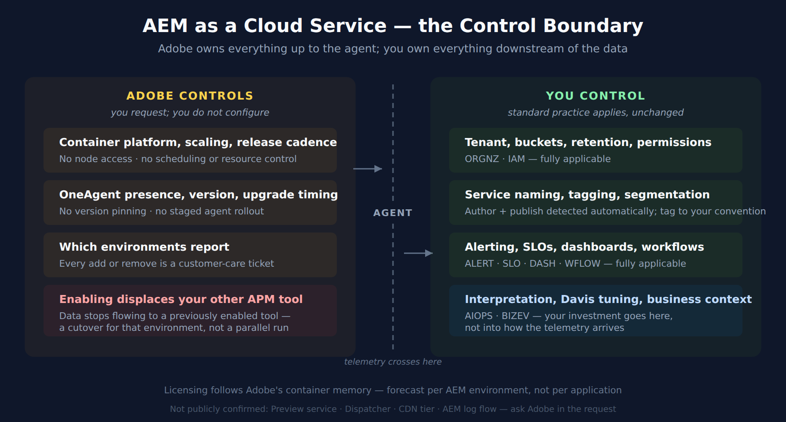

# FAQ-18: How Do I Monitor Adobe Experience Manager as a Cloud Service?

> **Series:** FAQ — Frequently Asked Questions | **Reference:** 18 — Monitoring AEM as a Cloud Service | **Created:** July 2026 | **Last Updated:** 08/25/2026

## Overview

Adobe Experience Manager as a Cloud Service (AEMaaCS) is a managed platform: Adobe runs the Kubernetes containers, controls the release cadence, and holds the keys to the runtime. That single fact is what makes monitoring it different from every other OneAgent deployment described in this corpus — and it is the part most teams discover only after their first support ticket.

There *is* a first-class integration. It is published and supported by **Dynatrace**, it is genuine **OneAgent full-stack monitoring** on the containers running your author and publish services, and it produces the topology, service detection, and Davis analysis you would expect. What it does not give you is the deployment control you are used to. You do not install the agent. You cannot pin its version. There is no host to configure and no `oneagentctl` to run.

This entry covers **what the integration is, how to get it turned on, exactly what you hand to Adobe, where the control boundary sits, how it is licensed, and the one behavior that will surprise a team mid-migration** — that enabling Dynatrace stops data flowing to any other APM tool already connected to the same environments.

**A note on sourcing.** The enablement procedure is documented by **Adobe**, not Dynatrace, because Adobe owns the action. The commercial and capability framing is documented by Dynatrace. Where a claim rests on only one of the two, it is cited to that source. Several questions readers reasonably ask — whether the Preview service is included, whether Dispatcher and CDN tiers are covered, whether AEM logs flow into Grail — are **not** settled by either vendor's public documentation, and this entry says so rather than guessing. Those are marked as open questions to confirm with Adobe in your own request.

---

## Table of Contents

1. [Short Answer](#short-answer)
2. [What the Integration Actually Is](#what-the-integration-is)
3. [Turning It On — The Adobe Request Path](#the-adobe-request-path)
4. [What You Hand Over](#what-you-hand-over)
5. [The Control Boundary](#the-control-boundary)
6. [What You Get — Topology and Services](#topology-and-services)
7. [Licensing and Capacity Forecasting](#licensing)
8. [It Displaces Your Other APM Tool](#apm-exclusivity)
9. [What This Changes About Standard Practice](#changes-to-standard-practice)
10. [Scope Boundaries and Open Questions](#scope-boundaries)
11. [Recommended Approach](#recommended-approach)
12. [Common Gotchas](#common-gotchas)
13. [References](#references)

---

## Prerequisites

| Requirement | Details |
|-------------|---------|
| **AEM deployment model** | **AEM as a Cloud Service.** This entry does not cover AEM Managed Services or on-premises AEM, where you control the hosts and standard OneAgent deployment applies |
| **Adobe relationship** | The ability to raise a customer-care ticket with Adobe — enablement is an Adobe-side action, not a Dynatrace-side one |
| **Dynatrace environment** | SaaS or Managed. Managed additionally requires a reachable ActiveGate and its port |
| **Permissions** | Enough access in Dynatrace to mint an API token with the **PaaS integration - Installer download** scope |
| **Licensing headroom** | Full-stack capacity for the containers Adobe runs — see § 7 before you request enablement, not after |
| **Related series** | **ONBRD** (tenant and access design), **K8S** (the container model underneath), **FAQ-03** (OneAgent vs OpenTelemetry), **FAQ-04** (OneAgent update management — mostly *not* applicable here, see § 9), **NR2DT** / **NRLC** (if you are migrating off New Relic — read § 8 first) |

---

<a id="short-answer"></a>
## 1. Short Answer

**Raise a customer-care ticket with Adobe requesting the Dynatrace integration for the AEM environments you want monitored, and supply your Dynatrace environment URL plus a `PaaS integration - Installer download` token.** Adobe deploys OneAgent into the containers running your author and publish services; the services, their endpoints, and their container memory are detected automatically.

Three things to internalise before you start:

| | |
|---|---|
| **You cannot self-serve** | There is no toggle in Cloud Manager and no action available from the Dynatrace side. Every enablement, and every subsequent environment you add, is an Adobe ticket |
| **It replaces your other APM** | Adobe states that once Dynatrace is integrated, data stops flowing to other APM tools on those environments. This is a cutover, not a parallel run — see § 8 |
| **Adobe owns the agent** | Version, upgrade timing, injection, and host-level configuration are Adobe's. Plan around that rather than against it — see § 5 |

> <sub>**Sources:** [Adobe Experience Manager Cloud Service monitoring (Dynatrace Hub)](https://www.dynatrace.com/hub/detail/adobe-experience-manager-1/), [Dynatrace OneAgent for AEM as a Cloud Service (Adobe Experience League)](https://experienceleague.adobe.com/en/docs/experience-manager-cloud-service/content/implementing/using-cloud-manager/dynatrace).</sub>

---

<a id="what-the-integration-is"></a>
## 2. What the Integration Actually Is

It is worth being precise, because "plug-in" undersells it and invites the wrong mental model. This is not a community extension, not a log-shipping recipe, and not an OpenTelemetry exporter.

| Attribute | Value |
|---|---|
| **Listing name** | Adobe Experience Manager Cloud Service monitoring |
| **Published by** | **Dynatrace** |
| **Support route** | Dynatrace support — the [Dynatrace support center](https://support.dynatrace.com/) |
| **Technology** | **OneAgent, full-stack**, on the Kubernetes containers Adobe operates |
| **Enablement owner** | **Adobe** (customer-care ticket) |
| **Detected automatically** | AEM applications and their dependencies, from the website through the container to the cloud service, plus the container **memory sizes** of the **author** and **publish** services |

Because it is real full-stack OneAgent monitoring rather than an API-polling integration, you get the things that follow from having an agent in the process: automatic service detection, distributed tracing through the AEM tiers, code-level visibility, dependency topology, and Davis root-cause analysis — the same machinery documented throughout the rest of this corpus, on infrastructure you do not own.

The unusual part is purely operational: **the deployment step belongs to someone else.** Everything downstream of "the agent is running" behaves normally.

> <sub>**Sources:** [Adobe Experience Manager Cloud Service monitoring (Dynatrace Hub)](https://www.dynatrace.com/hub/detail/adobe-experience-manager-1/), [Dynatrace OneAgent for AEM as a Cloud Service (Adobe Experience League)](https://experienceleague.adobe.com/en/docs/experience-manager-cloud-service/content/implementing/using-cloud-manager/dynatrace). **Derived:** the "behaves normally downstream" conclusion — and the service and endpoint detection that follows from it, which neither vendor states for this integration — combines the Hub's full-stack OneAgent statement with standard OneAgent behavior documented elsewhere in this corpus.</sub>

---

<a id="the-adobe-request-path"></a>
## 3. Turning It On — The Adobe Request Path

Adobe's documented path is a support request, not a self-service configuration:

1. **Raise a service request** with Adobe customer care.
2. **Name the AEM environments** you want monitored — enablement is per environment, so list every one you intend to cover.
3. **Supply your Dynatrace environment details** (§ 4) so Adobe can configure the agent to report into your tenant.

Two planning consequences follow, and both are easy to miss:

- **Lead time is Adobe's, not yours.** Enablement moves at support-ticket pace. If monitoring coverage is a gate in a migration or go-live plan, the request belongs early in the schedule, with a named owner — not in the cutover week.
- **Adding environments later is another ticket.** If you enable production first and add staging afterwards, that is a second request. Where practical, list every environment in the initial request rather than discovering the per-environment cost later.

> <sub>**Sources:** [Dynatrace OneAgent for AEM as a Cloud Service (Adobe Experience League)](https://experienceleague.adobe.com/en/docs/experience-manager-cloud-service/content/implementing/using-cloud-manager/dynatrace), [Adobe Experience Manager Cloud Service monitoring (Dynatrace Hub)](https://www.dynatrace.com/hub/detail/adobe-experience-manager-1/). **Derived:** the two planning consequences follow from the per-environment, ticket-based enablement both sources describe.</sub>

---

<a id="what-you-hand-over"></a>
## 4. What You Hand Over

Adobe's documentation enumerates what the ticket must contain. Assemble it before opening the request — an incomplete ticket costs another support round-trip.

| Item | Detail | Required |
|---|---|---|
| **Dynatrace environment URL** | SaaS: `https://<your-environment-id>.live.dynatrace.com` · Managed: `https://<your-managed-url>/e/<environmentId>` | Always |
| **Environment ID and token** | `tenantUUID` and `tenantToken` from the connection-info API (command below) | Always |
| **API access token** | Scope: **`PaaS integration - Installer download`** | Always |
| **ActiveGate port** | The port your ActiveGate listens on | **Managed only** |
| **ActiveGate network zone** | Routes monitoring data across regions | Optional |
| **AEM environment IDs** | Which environment(s) to monitor | Always |

### Getting the environment ID and token

Both values come from one call against your own environment — Adobe does not retrieve them for you:

```bash
curl -X GET "<environmentUrl>/api/v1/deployment/installer/agent/connectioninfo" \
  -H "accept: application/json" \
  -H "Authorization: Api-Token <accessToken>"
```

Take **`tenantUUID`** (the environment ID) and **`tenantToken`** from the response. Note that the
`<accessToken>` used here is the same `PaaS integration - Installer download` token you will send on:
mint it first (**Access tokens → Generate new token →** scope `PaaS integration - Installer download`),
then use it to obtain the two values.

Adobe classifies **both the environment token and the API access token** as secrets.

### Handling the token

The token is a credential that permits downloading the OneAgent installer for your tenant, and it is being transmitted through a support ticket. Adobe's own guidance is to **password-protect it on a secure paste service and share the password separately from the ticket** — treat that as the floor, not a suggestion.

Two practices worth adding on your side:

- **Mint a token dedicated to this integration**, rather than reusing an existing PaaS token, so it can be revoked without collateral damage.
- **Grant only the `PaaS integration - Installer download` scope.** It is the documented requirement, and a broader token in a support-ticket attachment is a materially worse exposure.

> <sub>**Sources:** [Dynatrace OneAgent for AEM as a Cloud Service (Adobe Experience League)](https://experienceleague.adobe.com/en/docs/experience-manager-cloud-service/content/implementing/using-cloud-manager/dynatrace), [Access tokens (DT docs)](https://docs.dynatrace.com/docs/manage/identity-access-management/access-tokens-and-oauth-clients/access-tokens). **Derived:** the dedicated-token and least-scope practices apply standard Dynatrace token hygiene to Adobe's stated transmission method; neither vendor states them for this integration specifically.</sub>

---

<a id="the-control-boundary"></a>
## 5. The Control Boundary

This is the section to read if you read only one. Most Dynatrace guidance — in this corpus and in the product documentation — assumes you control the host and the agent. On AEMaaCS you control neither, and knowing where the line falls prevents a lot of wasted effort.



<!-- MARKDOWN_TABLE_ALTERNATIVE
| Layer | Owner | Practical consequence |
|---|---|---|
| Container platform, scaling, release cadence | Adobe | No node access, no scheduling control |
| OneAgent presence, version, upgrade timing | Adobe | Version pinning and staged agent rollout are unavailable |
| Which environments report | Adobe (on your request) | Every change is a ticket |
| Tenant, buckets, retention, access control | You | Standard ORGNZ and IAM practice applies unchanged |
| Alerting, SLOs, dashboards, workflows | You | Standard ALERT, SLO, DASH, WFLOW practice applies unchanged |
| Data interpretation and Davis tuning | You | Standard AIOPS practice applies unchanged |
For environments where SVG doesn't render
-->

| Layer | Who controls it | What that means for you |
|---|---|---|
| Container platform, scaling, release cadence | **Adobe** | No node access; no scheduling or resource control |
| OneAgent presence, version, upgrade timing | **Adobe** | You cannot pin a version or stage an agent rollout |
| Which environments report | **Adobe**, on your request | Adding or removing coverage is a support ticket |
| Your Dynatrace tenant, buckets, retention, permissions | **You** | Unchanged — normal **ORGNZ** and **IAM** practice |
| Alerting, SLOs, dashboards, workflows | **You** | Unchanged — normal **ALERT**, **SLO**, **DASH**, **WFLOW** practice |
| Interpretation, Davis tuning, business context | **You** | Unchanged — normal **AIOPS** and **BIZEV** practice |

The useful reframing: **everything to the left of the agent is Adobe's, everything to the right of the data is yours.** Your investment goes into what you do with the telemetry, not into how it gets there.

> <sub>**Derived:** the boundary table combines Adobe's documented ownership of enablement and the container platform with the Dynatrace-side capabilities that remain wholly tenant-side. Neither vendor publishes this split as a single statement; it is inferred and should be confirmed against your own contract.</sub>

---

<a id="topology-and-services"></a>
## 6. What You Get — Topology and Services

Once the agent is reporting, detection is automatic:

- **AEM applications and their dependencies detected automatically**, from the website through the container to the cloud service.
- **Container memory sizes of the author and publish services detected automatically** — which is also the basis of licensing (§ 7).
- **Standard full-stack telemetry** on those containers: traces, service metrics, process and container resource data, and the dependency topology that follows from them.

Because this is full-stack OneAgent rather than an API integration, ordinary service and endpoint detection follows — neither vendor documents that step for AEM specifically, so treat it as the expected behavior to verify rather than a published guarantee. Practically, an AEM estate appears in Smartscape as ordinary services with ordinary relationships, and every downstream Dynatrace capability treats them as such. There is no AEM-specific query surface to learn: the services behave like any other in `fetch spans`, `timeseries`, and Davis problem analysis.

In community practice, the first thing worth doing after enablement is confirming that the author and publish services appear as **separate** services with sensible names, and tagging them to your own convention while the estate is small — service-level tagging is tenant-side and fully yours, so this is one of the few places where the usual **ORGNZ** guidance applies without modification.

> <sub>**Sources:** [Adobe Experience Manager Cloud Service monitoring (Dynatrace Hub)](https://www.dynatrace.com/hub/detail/adobe-experience-manager-1/), [Dynatrace OneAgent for AEM as a Cloud Service (Adobe Experience League)](https://experienceleague.adobe.com/en/docs/experience-manager-cloud-service/content/implementing/using-cloud-manager/dynatrace) — both state that container memory sizes are automatically detected for the author and publish services. **Derived:** service-level and endpoint detection follows from full-stack OneAgent behavior, not from either vendor's AEM material.</sub>

---

<a id="licensing"></a>
## 7. Licensing and Capacity Forecasting

Licensing follows **full-stack monitoring of the containers**, so it scales with the memory Adobe allocates rather than with anything you configure. Both vendors publish figures, which makes this forecastable before you raise the ticket.

### Adobe's typical deployment specification, per AEM environment

| Environment | Containers (average) | Memory each |
|---|---|---|
| **Production** | 4 | 16 GB |
| **Non-production** | 4 | 8 GB |

### Published licensing figures, per AEM environment

| Model | Production | Non-production |
|---|---|---|
| **Dynatrace Platform Subscription** | max **64 GiB-hours** | max **32 GiB-hours** |
| **Classic licensing** | **4 host units**, or 96 host-unit-hours/day | **2 host units**, or 48 host-unit-hours/day |

Two forecasting notes:

- **Multiply by environments, not by applications.** The figures above are *per AEM environment*. A team running production, stage, and a development environment is forecasting three of these, and the non-production ones are not free.
- **The numbers are Adobe's stated averages, not a contractual cap.** They are the right basis for a first estimate and the wrong basis for a commitment — confirm actual allocation for your environments before finalising licensing.

> <sub>**Sources:** [Adobe Experience Manager Cloud Service monitoring (Dynatrace Hub)](https://www.dynatrace.com/hub/detail/adobe-experience-manager-1/), [Dynatrace OneAgent for AEM as a Cloud Service (Adobe Experience League)](https://experienceleague.adobe.com/en/docs/experience-manager-cloud-service/content/implementing/using-cloud-manager/dynatrace) — both publish the deployment specification and the licensing figures. **Derived:** the per-environment multiplication note follows from those figures being stated per environment.</sub>

---

<a id="apm-exclusivity"></a>
## 8. It Displaces Your Other APM Tool

This is the single behavior most likely to disrupt a plan, and it is easy to miss because it appears as one line in Adobe's documentation:

> Once Dynatrace integrates, "data no longer flows to other APM tools such as New Relic, if it was previously enabled."

**Enabling Dynatrace on an AEM environment is a cutover for that environment, not a parallel run.**

Almost every migration playbook in this corpus — **NR2DT**, **NRLC**, **S2D**, **SL2DT** — is built on a parallel-run period during which both tools observe the same traffic and you compare output before committing. On AEMaaCS environments, that period is not available in the usual form. The comparison has to be restructured:

| Instead of | Do this |
|---|---|
| Running both tools on the same environment and comparing | Cut a **non-production** environment first and validate there against known behavior |
| Comparing dashboards side by side during the window | Capture the **outgoing** tool's baselines *before* the switch — you cannot re-derive them afterwards |
| Rolling back by disabling the new tool | Treat rollback as **another Adobe ticket** with its own lead time, and decide the trigger in advance |

**FAQ-17** (*Planning a Migration Cutover*) covers the general invariants; this is the case where its "parallel-run window with an end date" invariant has to be replaced rather than merely shortened, because the platform does not permit the overlap.

> <sub>**Sources:** [Dynatrace OneAgent for AEM as a Cloud Service (Adobe Experience League)](https://experienceleague.adobe.com/en/docs/experience-manager-cloud-service/content/implementing/using-cloud-manager/dynatrace) — the quoted displacement statement. **Derived:** the restructured comparison table applies FAQ-17's cutover invariants to a platform where parallel running is unavailable.</sub>

---

<a id="changes-to-standard-practice"></a>
## 9. What This Changes About Standard Practice

Several pieces of guidance elsewhere in this corpus assume host and agent control. On AEMaaCS they need adjusting — not discarding, but knowing which half still applies.

| Guidance | Status on AEMaaCS |
|---|---|
| **FAQ-04** — managing OneAgent updates | **Mostly not applicable.** Update rings, version pinning, and staged agent rollout are Adobe's. The reasoning about *why* agent version matters still helps you ask Adobe the right question |
| **FAQ-01** — host group naming | **Not applicable as written.** There is no host you name. Organise at the service and tag layer instead |
| **FAQ-03** — OneAgent vs OpenTelemetry | **Decided for you** on these containers: it is OneAgent. Still relevant for anything you build *around* AEM |
| **ORGNZ** — buckets, segments, security | **Fully applies.** All tenant-side |
| **IAM** — access model | **Fully applies.** All tenant-side |
| **ALERT / SLO / DASH / WFLOW / AIOPS** | **Fully applies.** These consume the data; they do not care how the agent arrived |
| **K8S** series | **Background reading, not a runbook.** It explains the container model underneath, but you have no cluster access and cannot apply its operator or DynaKube guidance |

The pattern is consistent: **anything about getting the agent in place is Adobe's; anything about what you do with the resulting data is yours and unchanged.**

> <sub>**Derived:** this table maps the documented Adobe/customer control split onto the guidance in the referenced series. It is an editorial mapping, not a vendor statement.</sub>

---

<a id="scope-boundaries"></a>
## 10. Scope Boundaries and Open Questions

What is confirmed: **author and publish services** are detected and monitored.

Beyond that, several reasonable questions are **not settled by either vendor's public documentation** as of 07/27/2026. They are listed here as questions to put in your Adobe request rather than assumptions to build a plan on:

| Question | Status |
|---|---|
| Is the **Preview** service monitored alongside author and publish? | Not stated publicly — confirm with Adobe |
| Are **Dispatcher** and the **CDN tier** in scope? | Not stated publicly. Both vendors' AEM material describes end-to-end coverage without naming these tiers |
| Do **AEM logs** flow into Grail through this integration? | Not stated publicly. Adobe provides its own log-access mechanisms; whether they connect here is unconfirmed |
| Is **RUM** included, or configured separately? | Dynatrace describes RUM, Session Replay, and synthetic monitoring as part of the broader AEM story, but these are tenant-side capabilities you configure — treat them as **separate from** the container agent enablement |
| Can you influence **OneAgent version**? | Not stated publicly; § 5 assumes not |

Being explicit about this beats a confident guess: an AEM estate has real tiers in front of the author and publish services, and a monitoring plan that silently assumes they are covered will have a gap exactly where customer-facing latency lives.

> <sub>**Sources:** [Dynatrace and Adobe Experience Manager (Dynatrace blog)](https://www.dynatrace.com/news/blog/dynatrace-and-adobe-experience-manager-seamless-end-to-end-observability/) — the RUM / Session Replay / synthetic framing, [Dynatrace OneAgent for AEM as a Cloud Service (Adobe Experience League)](https://experienceleague.adobe.com/en/docs/experience-manager-cloud-service/content/implementing/using-cloud-manager/dynatrace) — whose introduction promises "end-to-end tracing across every tier and Real User Monitoring" without naming a tier. The remaining rows record the *absence* of a public statement and are therefore uncited by construction.</sub>

---

<a id="recommended-approach"></a>
## 11. Recommended Approach

1. **Forecast licensing first.** Use § 7 against your actual environment count. Do this before the ticket, not after enablement surprises the bill.
2. **Decide the environment order.** Non-production first, always — it is the only safe place to learn what the integration does and does not cover, given that § 8 removes the parallel run.
3. **If another APM tool is live, capture its baselines now.** Response-time distributions, error rates, throughput. Post-cutover you cannot go back for them.
4. **Assemble the full ticket payload** (§ 4) before opening the request, and mint a **dedicated, minimally-scoped token**.
5. **List every environment you intend to monitor** in the first request.
6. **Ask the § 10 open questions explicitly** in the ticket — Preview, Dispatcher, CDN, logs. Get the answer in writing for your own architecture record.
7. **After enablement, verify detection**: author and publish appear as separate services with sensible names and endpoints.
8. **Tag to your convention immediately**, while the estate is small. This is tenant-side and fully yours.
9. **Build alerting and SLOs normally.** From here the standard **ALERT**, **SLO**, and **WFLOW** guidance applies without modification.

---

<a id="common-gotchas"></a>
## 12. Common Gotchas

| Gotcha | Why it bites |
|---|---|
| **Treating enablement as a self-service task** | There is no toggle anywhere. Plans that schedule "enable monitoring" as an afternoon's work miss the support-ticket lead time entirely |
| **Assuming a parallel run with the outgoing APM tool** | Adobe states the integration displaces other APM tools on those environments. Discovering this at cutover means losing comparison baselines you can no longer recreate |
| **Forecasting licensing per application instead of per environment** | The published figures are per AEM environment; three environments is three times the forecast, and non-production is not free |
| **Reusing a broad existing token** | The documented requirement is a single narrow scope, and the token travels through a support ticket. A broad token there is a materially worse exposure |
| **Enabling production first** | Removes the safe place to learn what is and is not covered, on the environment where being wrong costs the most |
| **Assuming Dispatcher and CDN are covered** | Neither vendor states it publicly (§ 10). A plan that assumes it has a gap precisely at the customer-facing edge |
| **Applying FAQ-04 update-management guidance** | Agent version and upgrade timing are Adobe's. The effort belongs in asking Adobe, not in building a rollout ring you cannot control |
| **Requesting one environment at a time** | Each addition is a separate ticket with its own lead time |

---

<a id="references"></a>
## 13. References

- [Adobe Experience Manager Cloud Service monitoring (Dynatrace Hub)](https://www.dynatrace.com/hub/detail/adobe-experience-manager-1/) — the listing: publisher, support route, technology, and the licensing figures in § 7
- [Dynatrace OneAgent for AEM as a Cloud Service (Adobe Experience League)](https://experienceleague.adobe.com/en/docs/experience-manager-cloud-service/content/implementing/using-cloud-manager/dynatrace) — Adobe's enablement procedure, the required ticket payload, token handling, and the APM-displacement statement quoted in § 8
- [Dynatrace and Adobe Experience Manager: seamless end-to-end observability (Dynatrace blog)](https://www.dynatrace.com/news/blog/dynatrace-and-adobe-experience-manager-seamless-end-to-end-observability/) — capability framing including RUM, Session Replay, and synthetic monitoring
- [Access tokens (DT docs)](https://docs.dynatrace.com/docs/manage/identity-access-management/access-tokens-and-oauth-clients/access-tokens) — token scopes and lifecycle, for the `PaaS integration - Installer download` scope in § 4

---

<sub>*This notebook was AI-generated from community-submitted and publicly available sources. This notebook series is not officially supported by Dynatrace. Always verify information against official [Dynatrace documentation](https://docs.dynatrace.com/docs).*</sub>
