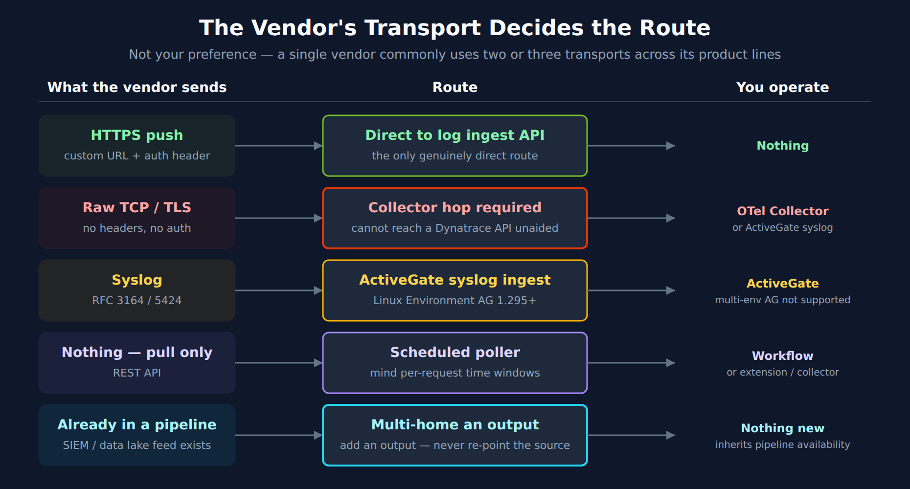
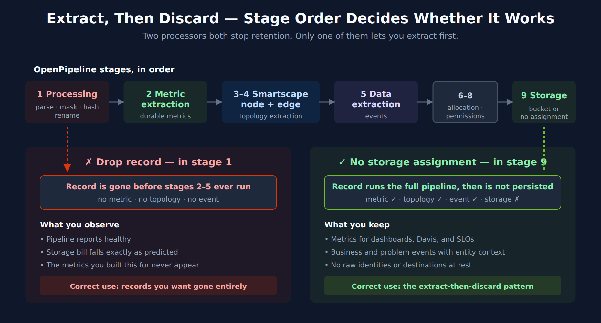

# FAQ-19: How Do I Bring a Third-Party SaaS Platform's Telemetry Into Dynatrace?

> **Series:** FAQ — Frequently Asked Questions | **Reference:** 19 — Integrating Third-Party SaaS Telemetry | **Created:** July 2026 | **Last Updated:** 08/31/2026

## Overview

Sooner or later a platform you do not run becomes something you have to answer for. A secure-access service sits between every user and every application. A CDN fronts your customer traffic. An identity provider gates every login. A payment gateway carries revenue. None of them will ever host a OneAgent, and none of them will appear in Smartscape on their own — yet when they degrade, the tickets land on your team.

These platforms all present the same shape of problem, and it is not the shape most integration guides assume. The vendor does not publish one feed; it publishes **several, in different formats, over different transports, with different retention implications** — and the most operationally valuable signal is usually the one that is not a log at all. The temptation is to point all of it at Grail and sort it out later. That is the expensive answer, and it is expensive in two directions at once: storage cost for records nobody queries, and a compliance surface for user identities and destinations you did not intend to retain.

This entry covers **the reusable pattern**: how to choose an ingestion route from the vendor's transport rather than your preference, how to run signal-first so raw records are processed and then discarded, how to model the vendor's objects as real Smartscape topology, and how to isolate what you do keep. It is deliberately vendor-neutral — **FAQ-20** applies every section of it to Zscaler as a worked example.

**A note on scope.** This is an ingestion-and-modeling entry. Once the data is in Grail with topology attached, the downstream work is ordinary and already documented elsewhere in this corpus — § 8 routes you there rather than restating it.

---

## Table of Contents

1. [Short Answer](#short-answer)
2. [Three Signal Classes, Three Different Answers](#signal-classes)
3. [Choosing the Ingestion Route](#ingestion-routes)
4. [Signal-First Ingestion — Extract, Then Discard](#extract-then-drop)
5. [Modeling the Vendor's Objects as Topology](#topology)
6. [Isolating What You Do Retain](#retention)
7. [Normalizing Dimensions Across Feeds](#normalizing)
8. [Where This Plugs Into the Rest of the Corpus](#downstream)
9. [Recommended Approach](#recommended-approach)
10. [Common Gotchas](#gotchas)

---

## Prerequisites

| Requirement | Details |
|-------------|---------|
| **Dynatrace environment** | SaaS with **Grail** and **OpenPipeline**. The topology work in § 5 depends on Smartscape on Grail; the extract-then-discard pattern in § 4 depends on OpenPipeline stages |
| **Vendor-side access** | Admin rights on the source platform to configure log streaming and to mint API credentials. In most organizations this is a different team — budget for the hand-off |
| **Permissions** | Enough access to create OpenPipeline pipelines and routes, create Grail buckets, and assign bucket permissions |
| **A security decision-maker** | § 4 and § 6 are retention and exposure decisions, not engineering ones. Identify who signs off before you build the pipeline, not after |
| **Related series** | **OPIPE** and **OPLOGS** (OpenPipeline depth), **ORGNZ** (buckets, segments, retention), **FAQ-09** (metric-vs-log query economics), **FAQ-15** (DPL, for parsing non-JSON feeds), **FAQ-16** (Smartscape query patterns), **DASH** / **ALERT** / **SLO** (downstream consumption) |

---

<a id="short-answer"></a>
## 1. Short Answer

**Let the vendor's transport pick your ingestion route, extract the signal at ingest and discard the raw record by default, and model the vendor's operational objects as `CUSTOM_*` Smartscape nodes so everything downstream inherits topology.**

Four decisions carry almost all the weight, and they are best made in this order:

| Decision | The rule |
|---|---|
| **1. Route** | Determined by what the vendor can *send*, not by what you would prefer to receive. An HTTPS-push feed can reach Dynatrace directly; a raw-TCP or syslog feed cannot, and needs a collector hop. See § 3 |
| **2. Retention** | Default to *discard*. Extract the metric, event, or alert you actually query, then drop the record. Keep raw only where security or compliance explicitly asks for it. See § 4 |
| **3. Topology** | Model the vendor's objects — the applications, the connectors, the edges, the regions — as `CUSTOM_*` Smartscape nodes. This is the decision that makes every later dashboard and alert better. See § 5 |
| **4. Isolation** | Whatever you do retain goes in a **dedicated bucket** with its own permissions, not in `default_logs`. See § 6 |

> <sub>**Sources:** [Processing in OpenPipeline (DT docs)](https://docs.dynatrace.com/docs/platform/openpipeline/concepts/processing), [Smartscape node and edge extraction in OpenPipeline (DT docs)](https://docs.dynatrace.com/docs/platform/openpipeline/concepts/extraction/smartscape-extraction). **Derived:** the four-decision ordering is this entry's framing — the platform imposes no order, but route constrains retention options and topology depends on fields that survive processing.</sub>

---

<a id="signal-classes"></a>
## 2. Three Signal Classes, Three Different Answers

The single most common mistake is treating a vendor integration as a *log* integration. In community practice, most SaaS platforms of this kind emit three distinct classes of signal, and they answer genuinely different questions — the split below is a framing for deciding what to ingest, not a vendor-defined taxonomy, so check it against your own platform's catalogue. Deciding which questions you need answered — before you configure anything — is what keeps the project from becoming a log-volume problem.

| Signal class | What it is | What it answers well | What it cannot answer |
|---|---|---|---|
| **Transaction / access logs** | Per-request or per-session records the platform writes as it handles traffic | Who did what, when, to which destination, with what outcome, how many bytes, allowed or denied | How it *felt* to the user. These are the platform's own view, recorded at its own vantage point |
| **Infrastructure / component metrics** | Health and capacity of the vendor's own components — gateways, connectors, collectors | Is the vendor-side infrastructure saturated, disconnected, or unbalanced | Anything about a specific user's session |
| **Experience / probe telemetry** | Active measurement from the endpoint or from a probe — device health, path quality, synthetic fetches | Was it slow, where in the path, and was the endpoint itself the problem | Full transaction detail; probes sample, they do not record everything |

**The practical consequence.** Access logs are usually the largest, cheapest-to-obtain, and *least* directly useful for experience questions. Experience telemetry is usually the smallest, hardest to obtain (it is often a separate SKU and a separate API), and the one that actually answers "why is the user complaining." If your integration ships only the logs because the logs were the easy feed, you will have spent the storage budget on the signal class that answers the fewest of your questions.

**Ask the question first.** Write down the five questions the integration must answer, map each to a signal class using the table above, and configure only the feeds those classes require. Feeds are easy to add later; retention decisions made by accident are hard to unwind.

---

<a id="ingestion-routes"></a>
## 3. Choosing the Ingestion Route

This is where most integration plans go wrong, and the failure is nearly always the same one: assuming every feed from a vendor can be pointed at the Dynatrace log ingest endpoint. **It is the vendor's transport that decides the route, and a single vendor commonly uses two or three different transports across its own product lines.**



<!-- MARKDOWN_TABLE_ALTERNATIVE
| What the vendor sends | Route | You operate |
|---|---|---|
| HTTPS push (custom URL + auth header) | Direct to log ingest API | Nothing |
| Raw TCP / TLS (no headers, no auth) | Collector hop required | OTel Collector or ActiveGate syslog |
| Syslog (RFC 3164 / 5424) | ActiveGate syslog ingest | ActiveGate (multi-env not supported) |
| Nothing — pull only (REST API) | Scheduled poller | Workflow, extension, or collector |
| Already in a pipeline (SIEM feed exists) | Multi-home an output | Nothing new; inherits pipeline availability |
For environments where SVG doesn't render
-->

| What the vendor can send | Route into Dynatrace | Notes |
|---|---|---|
| **HTTPS POST** to an arbitrary URL with custom headers | **Direct** to the Dynatrace log ingest API | The only genuinely direct route. Requires the vendor to support a custom endpoint *and* a custom `Authorization` header |
| **Raw TCP / TLS** to a host and port | **Collector hop required** — an OpenTelemetry Collector, an ActiveGate syslog receiver, or an existing pipeline product | The vendor cannot authenticate to a Dynatrace API over raw TCP. Something must terminate the stream and forward it |
| **Syslog** (RFC 3164 / 5424) | **ActiveGate syslog ingestion** or an OTel Collector `syslog` receiver | Environment ActiveGate on Linux, 1.295+, using its embedded OTel Collector. Multi-environment ActiveGates do not support syslog ingestion |
| **Nothing — pull only (REST API)** | **Scheduled poller** — a Dynatrace workflow, an extension, or a collector | Common for experience/score APIs. Watch for per-request time-window limits, which set your minimum poll frequency |
| **Already flowing to a pipeline product** you run | **Multi-home** an additional output to Dynatrace | Usually the cleanest enterprise answer — see below |

> <sub>**Sources:**</sub>
> - <sub>[Syslog ingestion with ActiveGate (DT docs)](https://docs.dynatrace.com/docs/analyze-explore-automate/logs/lma-log-ingestion/lma-log-ingestion-syslog) — *"Environment ActiveGate version 1.295+ on Linux installed to monitor remote technologies"*, which *"uses an embedded Dynatrace OpenTelemetry Collector instance"*; note also *"Multi-environment ActiveGates do not support syslog ingestion."*</sub>
> - <sub>[Ingest syslog data with the OTel Collector (DT docs)](https://docs.dynatrace.com/docs/ingest-from/opentelemetry/collector/use-cases/syslog)</sub>
> - <sub>[Cribl via HTTP (Dynatrace Hub)](https://www.dynatrace.com/hub/detail/cribl-via-http/)</sub>
> - <sub>[Cribl via OpenTelemetry (Dynatrace Hub)](https://www.dynatrace.com/hub/detail/cribl-via-opentelemetry/)</sub>
> - <sub>[Syslog via OpenTelemetry Collector (Dynatrace Hub)](https://www.dynatrace.com/hub/detail/syslog-via-opentelemetry-collector/) — the listed collector-hop routes for feeds that cannot post directly</sub>

### 3.1 The multi-home pattern — usually the right enterprise answer

If the vendor's logs already flow somewhere — a SIEM, a security data lake, an observability pipeline — you are rarely the first consumer, and you should not try to become the only one. Adding a **second output** from the existing pipeline is almost always better than re-pointing the source:

- **It does not disturb the security pipeline.** Re-pointing a source feed that a SOC depends on is a change with a blast radius well outside observability. Adding an output is not.
- **It gives you a transformation point you control.** Masking, field reduction, and sampling can be applied to the observability copy without touching the security copy, which usually must stay complete.
- **It solves the transport problem for free.** The pipeline product already terminates whatever exotic transport the vendor uses; its outputs are ordinary HTTP.

Dynatrace lists first-party destinations for this on the Hub for at least one common pipeline product, over both HTTP and OpenTelemetry.

**The trade-off to state plainly:** you have added a dependency. The observability feed now inherits the pipeline's availability, its release cadence, and its owning team's change process. Where the pipeline is already business-critical this costs nothing; where it was a best-effort side system, direct ingestion may be the more honest choice.

> <sub>**Sources:** [Cribl via HTTP (Dynatrace Hub)](https://www.dynatrace.com/hub/detail/cribl-via-http/), [Cribl via OpenTelemetry (Dynatrace Hub)](https://www.dynatrace.com/hub/detail/cribl-via-opentelemetry/), [Syslog via OpenTelemetry Collector (Dynatrace Hub)](https://www.dynatrace.com/hub/detail/syslog-via-opentelemetry-collector/).</sub>

### 3.2 Check the Hub before you build anything

Before designing a custom route, check whether the vendor already has a Dynatrace Hub listing. The answer materially changes the project:

- **A listing exists** — you inherit a supported, documented path. Take it.
- **No listing exists** — you are building and owning the integration yourself. That is a legitimate and common position, but it should be a *decision*, not a discovery made in week three. It means you own the parsing, the field mapping, the failure modes, and the upgrade path when the vendor changes its schema.

In community practice, the second case is more common than teams expect for security and networking platforms specifically — verify for your own vendor rather than assuming either way.

---

<a id="extract-then-drop"></a>
## 4. Signal-First Ingestion — Extract, Then Discard

The default posture for a high-volume third-party feed should be: **process the record for its value, then throw the record away.** You keep the metric, the event, and the alert. You do not keep several hundred gigabytes of transaction records containing user identities and destinations that nobody will query and everybody will have to account for at audit time.

OpenPipeline supports this directly — but **the processor you choose, and the stage it sits in, decide whether it works or silently defeats itself.**

### 4.1 The stage order, and the trap inside it

Log records traverse OpenPipeline stages in a fixed order:

| # | Stage | What you would use it for here |
|---|---|---|
| 1 | **Processing** | Parse, mask, hash, rename fields — and, if you choose, **Drop record** |
| 2 | **Metric extraction** | Turn the record into a durable metric |
| 3 | **Smartscape node extraction** | Calculate a Smartscape ID; optionally create/update the node (§ 5) |
| 4 | **Smartscape edge extraction** | Record dynamic edges between nodes (§ 5) |
| 5 | **Data extraction** | Emit business events or Davis events |
| 6 | **Cost allocation** | Attribute consumption |
| 7 | **Product allocation** | Attribute to a product |
| 8 | **Permissions** | Set record-level permissions |
| 9 | **Storage** | Assign a bucket — or **No storage assignment** |

Two processors both stop a record being retained, and they are **not** interchangeable:

| Processor | Stage | Effect |
|---|---|---|
| **Drop record** | Processing (1) | "Drops a record. The record is not retained." |
| **No storage assignment** | Storage (9) | "Skips storage assignment. The record is not retained." |

**The trap:** *Drop record* sits in stage 1 — **before** metric extraction, Smartscape extraction, and data extraction. Use it for "extract then drop" and you drop the record before anything has been extracted from it. The pipeline reports healthy, the storage bill falls exactly as predicted, and the metrics you built the integration for never appear.



<!-- MARKDOWN_TABLE_ALTERNATIVE
| Processor | Stage | Effect | Correct use |
|---|---|---|---|
| Drop record | 1 — Processing | Record is gone before stages 2–5 run: no metric, no topology, no event. Pipeline still reports healthy and the storage bill falls as predicted | Records you want gone entirely |
| No storage assignment | 9 — Storage | Record runs the full pipeline then is not persisted: metric yes, topology yes, event yes, storage no | The extract-then-discard pattern |
Stage order: 1 Processing, 2 Metric extraction, 3-4 Smartscape node + edge, 5 Data extraction, 6-8 allocation and permissions, 9 Storage.
For environments where SVG doesn't render
-->

**Use `No storage assignment` in the Storage stage** for the extract-then-discard pattern. The record runs the full gauntlet — parsed, metricized, topology-tagged, event-emitting — and is then simply not persisted. Reserve `Drop record` for records you want *gone*: health-check noise, a chatty debug category, a feed you enabled by mistake.

> <sub>**Sources:**</sub>
> - <sub>[Processing in OpenPipeline (DT docs)](https://docs.dynatrace.com/docs/platform/openpipeline/concepts/processing) — stage order and both processor definitions quoted above</sub>
> - <sub>[Configure data storage and retention for logs (DT docs)](https://docs.dynatrace.com/docs/analyze-explore-automate/logs/lma-bucket-assignment) — "skip the storage of logs that match the route and pipeline conditions"; useful "when you parse log lines and extract metrics, and access to original records is not needed"</sub>
> - <sub>[Extraction stages in OpenPipeline (DT docs)](https://docs.dynatrace.com/docs/platform/openpipeline/concepts/extraction)</sub>
> - <sub>[Parse log lines and extract a metric (DT docs)](https://docs.dynatrace.com/docs/platform/openpipeline/use-cases/tutorial-log-processing-pipeline) — worked extract-then-discard example</sub>
> - <sub>**Derived:** the failure mode itself — that `Drop record` in stage 1 pre-empts the stage 2–5 extractors — follows from the documented stage order rather than from an explicit warning in the docs; validate on a narrow route before applying it broadly</sub>

### 4.2 Decide what is worth keeping, by class

| What you extract | Why it survives | Retention posture |
|---|---|---|
| **Metric** — a rate, a latency percentile, a saturation gauge, a count by dimension | It is what dashboards, anomaly detection, and SLOs actually read. Cheap to store, cheap to query | **Keep.** Metric reads are not billed as a query capability the way log scans are — see FAQ-09 |
| **Business event** — a meaningful state change worth analyzing individually | Carries a handful of fields, not a full payload. Queryable, workflow-triggerable | **Keep**, with minimal fields — resist copying the whole record onto the event |
| **Davis / problem event** — a condition someone must act on | It is the thing that pages a human and reaches your incident tooling | **Keep** with entity context attached (§ 5) |
| **Raw record** | Forensics, incident reconstruction, compliance obligation | **Discard by default.** Retain only where security or compliance explicitly asks — and then in an isolated bucket (§ 6) |

The economic argument is in **FAQ-09**: a metric you query on a dashboard every five minutes, forever, costs a fraction of the equivalent recurring log scan. A third-party feed that drives recurring dashboards and alerts is precisely the recurring-query case that rule exists for.

**One caveat to state honestly.** Extraction is **forward-only**. A metric starts existing the moment you configure it — it does not backfill from records already ingested, and it certainly does not backfill from records you dropped. If there is any chance you will want a dimension later, extract it from the start; adding it in month four gives you a metric with no history at the exact moment you need the comparison.

---

<a id="topology"></a>
## 5. Modeling the Vendor's Objects as Topology

This is the section that separates an integration that ages well from one that becomes a pile of dashboards nobody trusts.

The vendor's world contains operationally meaningful objects: applications, connectors, gateways, regions, tenants, collectors. If those exist in Dynatrace only as *string fields on log records*, then every dashboard filter is a string match, every alert payload is a bag of text, and nothing you build participates in Smartscape. If they exist as **entities**, they get identity, lifetime, tags, relationships, and — crucially — they show up in alert context automatically.

**The good news, and it is more recent than most teams realize:** you no longer need the legacy custom-device API for this. OpenPipeline can extract Smartscape nodes and edges directly from ingested signals, including entirely custom entity types.

### 5.1 How it works

A **Smartscape ID** is "a unique identifier calculated from a node type and one or more ordered ID components" — you nominate the node type and which record fields form the identity, and the platform computes a stable ID (for example `CUSTOM_TRUCK-0123456789ABCDEF`, landing in a field like `dt.smartscape.custom_truck`).

Two behaviors sit behind one processor, and the difference matters:

- **ID enrichment only** — the processor calculates the ID and stamps it on the record. The record is now *associated with that entity in queries*, but no node is created. Use this on high-volume signals that reference an entity defined elsewhere.
- **Extract node enabled** — the processor additionally "creates or updates the node in Smartscape storage," including its configured fields and static edges. Use this on the signal that legitimately defines the object.

**Naming is constrained:** a custom node type "must begin with `CUSTOM_` or `EXT_`" and "must be unique in your environment." Pick the prefix scheme once, up front — renaming a node type later orphans every node already extracted under the old name.

**Edges come in two kinds:**

| Edge kind | Behavior | Use for |
|---|---|---|
| **Static** | Stored on the node, inherits its lifetime, and overrides others of the same type when re-extracted | Structural facts: a connector *belongs to* a connector group; an application *is served by* a gateway |
| **Dynamic** | Recorded at a point in time; requires **both** source and target Smartscape IDs already present on the record | Observed, time-varying relationships: this gateway *served* this application during this window |

The dynamic-edge prerequisite is the one that bites. Both IDs must already be on the record when the edge processor runs — which means you calculate them earlier, with node processors in the node stage, even where you do not want those processors to create nodes.

> <sub>**Sources:** [Smartscape node and edge extraction in OpenPipeline (DT docs)](https://docs.dynatrace.com/docs/platform/openpipeline/concepts/extraction/smartscape-extraction) — all quoted definitions, the `CUSTOM_`/`EXT_` naming constraint, and the static-vs-dynamic edge distinction, [Define custom topology via OpenPipeline (DT docs)](https://docs.dynatrace.com/docs/platform/openpipeline/use-cases/tutorial-extract-topology) — the worked node/edge processor configuration this section generalizes, [Smartscape on Grail (DT docs)](https://docs.dynatrace.com/docs/platform/grail/smartscape-on-grail).</sub>

### 5.2 A modeling checklist

Before configuring processors, answer these five questions for each candidate object:

1. **Is it operationally meaningful?** Would somebody be paged about it, own it, or filter a dashboard by it? If not, it is a dimension, not an entity. Over-modeling is a real cost — every node type is a thing to maintain.
2. **What is its stable identity?** The ID components must be present on every record that references the object, and must not change when the object is renamed or moved. A hostname is often a poor choice; a vendor-assigned ID is usually a good one.
3. **Which feed defines it, and which merely mentions it?** Exactly one feed should extract the node. Everything else enriches with the ID only.
4. **What does it connect to?** Structural relationships are static edges; observed ones are dynamic.
5. **What is its lifetime?** Nodes that stop being extracted go stale rather than vanishing — worth knowing before you alert on their absence.

### 5.3 Verifying the model

Once extraction is running, confirm the topology exists before building anything on it. Note that `smartscapeNodes` returns **zero rows rather than an error** for a node type that does not exist — a clean empty result is not proof your configuration is right, only that it is syntactically valid.

Discover which custom types actually landed:

```dql
// Which CUSTOM_* node types exist in this environment?
// Returns zero rows if extraction has not produced any node yet — that is
// the expected result before the pipeline runs, not an error. Confirm it is
// really that, though: a zero here is also what a wrong node type looks like.
smartscapeNodes "CUSTOM_*"
| dedup type
| fields type
```

Then inspect one type, and check for nodes that have stopped being refreshed:

```dql
// Inspect extracted nodes of one custom type, and keep only the live ones.
//
// lifetime[end] is a rolling "observed until" timestamp — it is ALWAYS populated,
// even on a stale node, so it is not a tombstone. Verified 08/27/2026: of 12 HOST
// nodes, isNull(lifetime[end]) matched 0 and isNotNull matched all 12. Null-testing
// it selects nothing, always; the inverse selects everything. Compare against now().
smartscapeNodes CUSTOM_APP_CONNECTOR
| fieldsAdd last_seen = lifetime[end]
| filter last_seen > now() - 10m
| fields id, name, last_seen
```

Finally, confirm the relationships resolve. Prefer the full `traverse` syntax with named parameters — the short positional form is accepted but far less readable, and a wrong edge type returns empty rather than erroring:

```dql
// Walk a custom relationship. Edge types are lowercase; node types are uppercase.
//
// traverse REPLACES the record with the target node's own fields — id, name, type.
// There is no sourceName or targetName: DQL resolves unknown identifiers to null
// WITHOUT raising FIELD_DOES_NOT_EXIST, so selecting them returns the right number
// of rows with every value empty and no error to tell you (verified 08/27/2026).
// A wrong edge type likewise returns zero rows with no error — check smartscapeEdges
// if this comes back empty.
smartscapeNodes CUSTOM_SECURE_ACCESS_APP
| traverse edgeTypes: {served_by}, targetTypes: {CUSTOM_APP_CONNECTOR}, direction: forward
| fields id, name, type
```

---

<a id="retention"></a>
## 6. Isolating What You Do Retain

Where § 4 concluded "retain this raw," the record needs somewhere to go that is not the default bucket.

**Create a dedicated bucket** for the vendor's retained records and assign permissions to it explicitly. Two independent reasons, and either alone justifies it:

- **Exposure.** These feeds carry user identities, destinations, device context, and policy outcomes. In the default bucket they are readable by everyone with general log-read access — which is usually a far wider group than the one entitled to see who visited what.
- **Retention economics.** A bucket carries its own retention period. Third-party transaction records typically want a *shorter* retention than application logs; without a dedicated bucket they inherit whatever the default is, indefinitely, at volume.

Bucket permissions are assigned per bucket through Account Management rather than through general environment roles — which is precisely the property that makes the isolation meaningful.

Once the bucket exists, confirm records are landing where you intended, and keep an eye on the volume you have committed to:

> <sub>**Sources:** [Configure data storage and retention for logs (DT docs)](https://docs.dynatrace.com/docs/analyze-explore-automate/logs/lma-bucket-assignment) — per-bucket retention and route-based storage assignment, [Assign permissions in Grail (DT docs)](https://docs.dynatrace.com/docs/platform/grail/organize-data/assign-permissions-in-grail) — *"Permissions can be assigned at the bucket, table, record, and field level"*, which is what makes a dedicated bucket a real isolation boundary. **Derived:** the exposure argument for a dedicated bucket combines per-bucket permissioning with the identity content of these feeds; no page frames it as a vendor-feed rule.</sub>

```dql
// Confirm retained records are landing in the dedicated bucket, not the default.
// Substitute your bucket name. Run over a short window first — this is a
// full log scan and is billed accordingly (see FAQ-09).
fetch logs, from:-24h
| filter dt.system.bucket == "default_logs"
| summarize records = count()
```

Complementary controls worth applying in the Processing stage, before storage:

| Control | When to use it |
|---|---|
| **Mask** | The field's *shape* matters for debugging but its value does not |
| **Hash** | You need to correlate on a value across records without being able to read it — the usual answer for user identifiers |
| **Field removal** | The field has no analytical use at all. Cheapest control; use it first |

Hashing deserves a caveat: it preserves correlation, which is the point, but a hash of a low-cardinality value is reversible by anyone who can enumerate the input space. Usernames drawn from a known directory are a good example. Hashing is a control against casual exposure, not against a determined analyst.

> <sub>**Sources:** [Configure data storage and retention for logs (DT docs)](https://docs.dynatrace.com/docs/analyze-explore-automate/logs/lma-bucket-assignment) — bucket assignment processor and per-bucket permission assignment via Account Management, [Processing in OpenPipeline (DT docs)](https://docs.dynatrace.com/docs/platform/openpipeline/concepts/processing). **Derived:** the hash-reversibility caveat is a general property of hashing low-cardinality inputs, not a Dynatrace-specific behavior.</sub>

---

<a id="normalizing"></a>
## 7. Normalizing Dimensions Across Feeds

A vendor's feeds will disagree with each other about field names. The same application will be `appname` in one feed, `Application` in another, and `app_name` in the API response. If you carry those differences through to Grail, every cross-feed question becomes a join problem, and the correlation the integration exists to provide never materializes.

**Normalize at ingest, in the Processing stage, once.** Pick your target dimension names and rename into them for every feed. The set that matters is small:

| Canonical dimension | Why it is load-bearing |
|---|---|
| `app` | The join key between every feed. Get this one right or nothing correlates |
| `user` (hashed, per § 6) | Ties experience to access to transaction |
| `location` / `region` | The most common triage axis, and the one executives ask about first |
| `department` / `business_unit` | Turns a technical dashboard into one a business owner will read |
| The vendor's own component identifiers | Feed the Smartscape ID components in § 5 |

Two rules make this durable:

- **Normalize to your names, not the vendor's.** Vendor field names change between product versions; your canonical names should not. The rename mapping is the thing that absorbs vendor churn.
- **Normalize before extraction, not after.** Metric dimensions and Smartscape ID components are computed from fields as they exist at that stage. Renaming afterwards leaves you with metrics dimensioned on the old names and no way to retrofit them.

For feeds that are not JSON, parsing happens here too — see **FAQ-15** for DPL, and note especially that DPL does not backtrack, which trips up patterns ported from regex.

---

> <sub>**Sources:** [Processing in OpenPipeline (DT docs)](https://docs.dynatrace.com/docs/platform/openpipeline/concepts/processing) — the Processing stage is where field renames happen, and it runs before the extraction stages, [Extraction stages in OpenPipeline (DT docs)](https://docs.dynatrace.com/docs/platform/openpipeline/concepts/extraction), [Smartscape node and edge extraction in OpenPipeline (DT docs)](https://docs.dynatrace.com/docs/platform/openpipeline/concepts/extraction/smartscape-extraction) — ID components are read at extraction time, which is what makes normalize-before-extract load-bearing. **Derived:** the canonical-dimension list is this entry's recommendation, not a documented set.</sub>

<a id="downstream"></a>
## 8. Where This Plugs Into the Rest of the Corpus

Once the data is in Grail, normalized, and carrying topology, **nothing downstream is special.** That is the point of the pattern, and it is why this entry stops here rather than continuing into dashboards. Consume it the way you consume everything else:

| What you want to build | Where it is documented | What the work in this entry buys you |
|---|---|---|
| **Dashboards** | `DASH` series | Entities from § 5 become filter dimensions and drill-down targets rather than string matches |
| **Alerting and routing** | `ALERT` series — ALERT-01 architecture, ALERT-02 choosing detection, ALERT-03 routing and cost, ALERT-04 ServiceNow | Alerts raised against entities carry topology into the payload automatically, which is what makes downstream correlation and routing work |
| **SLOs and error budgets** | `SLO` series — SLO-02 for SLI definition, SLO-04 for burn-rate alerting | Extracted metrics (§ 4) are exactly the shape an SLI wants |
| **Anomaly detection** | `AIOPS` series | Davis works on the extracted metrics; it cannot work on records you dropped, which is another argument for extracting generously in § 4 |
| **Synthetic validation** | `SYNTH` series | Useful for testing a path the vendor's own telemetry cannot see — but check § 2 first; the vendor's experience feed often already answers the question |
| **Bucket and retention design** | `ORGNZ` series — ORGNZ-02 for buckets | § 6 is the summary; ORGNZ is the depth |
| **Consumption and cost** | `FINOPS` series | Third-party feeds are a common source of unplanned ingest growth — FINOPS-02 for forecasting, FINOPS-03 for the Cut/Tune/Filter framework |
| **Query economics** | `FAQ-09` | The metric-versus-log-scan reasoning behind § 4 |

**On external consumers.** Where an external tool — an event-correlation platform, an ITSM system, an SLO product — is the destination for this data, the work in § 5 is what makes that integration good rather than noisy: a payload carrying an entity, its relationships, and its business context beats a payload carrying a log line. Dynatrace-native equivalents exist for each (Workflows and problem notifications for routing, the SLO app for objectives), and it is worth knowing which you are choosing and why. ALERT-03 covers the routing-and-cost trade-off directly.

---

<a id="recommended-approach"></a>
## 9. Recommended Approach

A defensible sequence. The ordering is deliberate — each step's output is the next step's input, and steps 1 and 2 are the ones teams skip and later regret.

| # | Step | Output |
|---|---|---|
| 1 | **Write down the questions.** Five operational questions the integration must answer, each mapped to a signal class (§ 2) | A scope you can defend when someone asks for "all the logs" |
| 2 | **Inventory the feeds and their transports.** For each: format, transport, volume estimate, sensitivity, and whether it already flows somewhere (§ 3) | A route decision per feed, not one blanket route |
| 3 | **Check the Hub.** Determine whether you are adopting a supported path or owning a custom one (§ 3.2) | An explicit, early decision about who owns the integration |
| 4 | **Get the retention decision signed off.** Which feeds may be retained raw, for how long, with which fields masked or hashed (§ 4, § 6) | Security approval *before* the pipeline exists |
| 5 | **Design the topology model.** Objects, ID components, edges — on paper, using the § 5.2 checklist | A node/edge design you can review before it is expensive to change |
| 6 | **Build one feed end to end.** Route → normalize → extract → topology → discard. One feed, fully finished | A working reference implementation, and a realistic estimate for the rest |
| 7 | **Verify.** Confirm nodes and edges exist (§ 5.3), metrics are populating, and records are landing in the intended bucket (§ 6) | Evidence, not assumption |
| 8 | **Then scale out**, and only then build dashboards, alerts, and SLOs on top (§ 8) | Downstream work that inherits topology from day one |

**The single highest-value decision** is step 5. Extraction and routing can be reworked cheaply. A topology model that nobody designed — where the vendor's objects live on as string fields — is what leaves you, two quarters later, with dashboards that filter on text and alerts that carry no context.

---

<a id="gotchas"></a>
## 10. Common Gotchas

| # | Gotcha | What to do |
|---|---|---|
| 1 | **`Drop record` used for extract-then-discard.** It sits in the Processing stage, ahead of every extractor — the record is gone before a metric is made from it | Use **No storage assignment** in the Storage stage. `Drop record` is for records you want gone entirely (§ 4.1) |
| 2 | **Assuming every feed can go direct.** A vendor commonly uses HTTPS for one product line and raw TCP for another; only the first can reach the ingest API unaided | Route per feed, from the transport (§ 3) |
| 3 | **Extraction is forward-only.** A metric added in month four has no history in months one through three | Extract the dimensions you might want from the start (§ 4.2) |
| 4 | **Dynamic edges silently produce nothing** when both Smartscape IDs are not already on the record | Calculate both IDs with node processors in the node stage first, even where you do not want them to create nodes (§ 5.1) |
| 5 | **A wrong node or edge type returns zero rows, not an error.** Empty results look identical to "not configured yet" | Verify with `smartscapeNodes "CUSTOM_*"` and `smartscapeEdges` before concluding the pipeline is broken (§ 5.3) |
| 6 | **Renaming a custom node type orphans existing nodes.** The type is part of the ID | Settle the `CUSTOM_` / `EXT_` naming scheme before the first extraction (§ 5.1) |
| 7 | **Normalizing after extraction.** Metric dimensions and ID components are computed from fields as they stand at that stage | Rename in the Processing stage, ahead of everything (§ 7) |
| 8 | **Retaining raw into the default bucket** because retention was never explicitly decided | Dedicated bucket with its own permissions and retention, or discard (§ 6) |
| 9 | **Hashing a low-cardinality identifier and calling it anonymized.** A hashed username from a known directory is enumerable | Hash for correlation, not as a privacy guarantee; remove the field where you do not need to correlate on it (§ 6) |
| 10 | **Shipping only the access logs** because they were the easy feed, then discovering they cannot answer experience questions | Map questions to signal classes first (§ 2) |

---

---

<sub>*This notebook was AI-generated from community-submitted and publicly available sources. This notebook series is not officially supported by Dynatrace. Always verify information against official Dynatrace documentation.*</sub>
