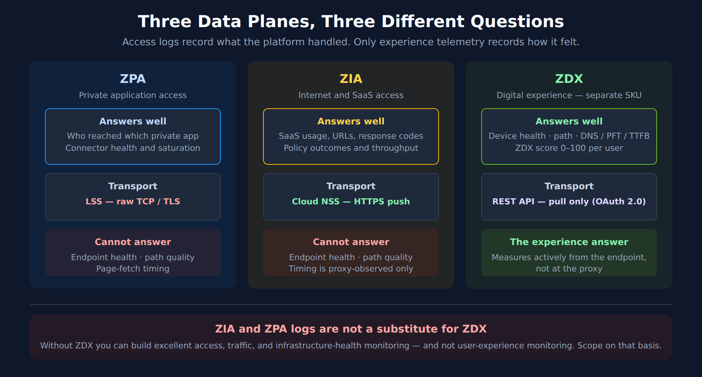
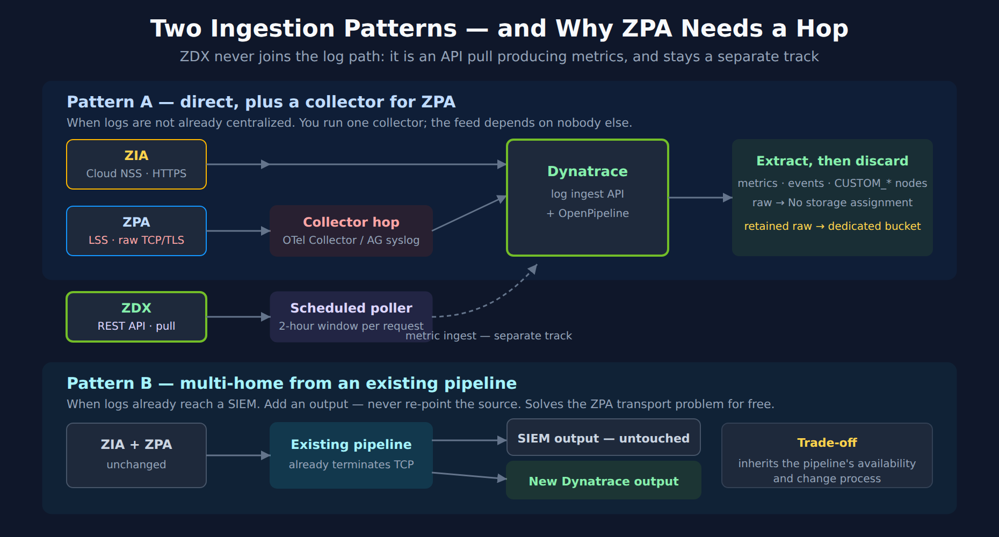

# FAQ-20: How Do I Monitor Zscaler With Dynatrace?

> **Series:** FAQ — Frequently Asked Questions | **Reference:** 20 — Monitoring Zscaler With Dynatrace | **Created:** July 2026 | **Last Updated:** 07/31/2026

## Overview

Zscaler sits in the path of everything. Every user reaching a SaaS application, every user reaching a private application, and — where ZDX is licensed — the experience of those users on their own devices. When it degrades, the symptom presents as "the application is slow," and the application team gets the ticket. That mismatch between where the problem is and where the ticket lands is the reason this integration keeps coming up.

The starting position in most organizations is worse than it needs to be. The three product lines write to three separate data planes with no shared view, and the practical consequence is a troubleshooting workflow built on exporting logs from the admin console and pivoting them in a spreadsheet. That workflow does not scale, does not correlate, and cannot answer the question anyone actually asked, which is whether the user's experience was bad and why.

Two things about this integration are worth knowing before you plan it, because both are commonly assumed the other way:

- **There is no turnkey Dynatrace integration for Zscaler.** No Hub listing, no extension to activate. You are building and owning this — a normal position, but one to decide deliberately rather than discover in week three.
- **The three product lines do not share a transport.** ZIA can push over HTTPS; ZPA cannot; ZDX is pull-only. A single ingestion design will not serve all three.

This entry is the **worked example of FAQ-19**. Every structural decision — route, retention, topology, isolation — is made there generically; here they are made concretely for Zscaler. Read FAQ-19 first if you want the reasoning; read this if you want the answers.

---

## Table of Contents

1. [Short Answer](#short-answer)
2. [No Turnkey Integration — What That Actually Means](#no-turnkey)
3. [The Three Data Planes and What Each Answers](#data-planes)
4. [Transport Reality — Why One Route Will Not Work](#transports)
5. [Recommended Ingestion Architecture](#architecture)
6. [What to Extract, What to Discard](#extract)
7. [Suggested Topology Model](#topology)
8. [Field Mapping Starting Point](#field-mapping)
9. [Dashboards, Alerting, and SLOs](#downstream)
10. [Synthetic Monitoring — When It Adds Anything](#synthetics)
11. [Implementation Sequence](#implementation)
12. [Administrator Checklist](#checklist)
13. [Recommended Approach](#recommended-approach)
14. [Common Gotchas](#gotchas)
15. [References](#references)

---

## Prerequisites

| Requirement | Details |
|-------------|---------|
| **Zscaler licensing** | ZIA and/or ZPA for the log feeds. **ZDX is a separate SKU** — § 3 explains why its absence changes what the integration can deliver, and it is worth confirming before scoping |
| **Zscaler admin access** | Rights to configure NSS / Cloud NSS feeds (ZIA), LSS receivers (ZPA), and to mint ZDX API credentials. Usually a network or security team, not the observability team |
| **Dynatrace environment** | SaaS with **Grail** and **OpenPipeline** |
| **Network path** | For ZPA LSS, a reachable TCP listener that App Connectors can egress to (§ 4) |
| **Security sign-off** | These feeds carry user identity, destination, device, and policy context. Decide retention before building — see FAQ-19 § 4 and § 6 |
| **Related reading** | **FAQ-19** (the generic pattern this entry instantiates), **OPIPE** / **OPLOGS** (OpenPipeline depth), **ORGNZ** (buckets), **FAQ-15** (DPL, for parsing CSV/TSV feeds), **ALERT** / **SLO** / **DASH** (downstream) |

---

<a id="short-answer"></a>
## 1. Short Answer

**Route each product line by its own transport, pull ZDX through its API if you have it, extract metrics and events at ingest, discard the raw records by default, and model applications, connectors, and service edges as `CUSTOM_*` Smartscape nodes.**

| Product line | Transport it offers | Route into Dynatrace |
|---|---|---|
| **ZIA** (internet / SaaS) | Cloud NSS — HTTPS feed to an API-based collector | **Direct** to the log ingest API, or via your existing pipeline |
| **ZPA** (private access) | LSS — **raw TCP, optionally TLS** | **Collector hop required.** Cannot reach a Dynatrace API unaided |
| **ZDX** (digital experience) | **REST API, pull only** (OAuth 2.0) | **Scheduled poller** — workflow, extension, or collector |

And the single most important scoping point, stated plainly:

> **ZIA and ZPA logs are not a substitute for ZDX.** They are the platform's own record of transactions it handled — excellent for access, policy, throughput, and connection outcomes. They do not contain device health, network-path quality, or page-fetch timing, because Zscaler does not observe those from the proxy. If the question is "why was it slow for this user," logs alone will not answer it, and no amount of ingestion engineering changes that.

> <sub>**Sources:** [Integrating Cloud NSS with Cloud-Based SIEMs (Zscaler)](https://help.zscaler.com/zia/integrating-cloud-nss-cloud-based-siems), [Log Streaming Service (LSS) (Zscaler)](https://help.zscaler.com/zpa/about-log-streaming), [Understanding the ZDX API (Zscaler)](https://help.zscaler.com/zdx/understanding-zdx-api).</sub>

---

<a id="no-turnkey"></a>
## 2. No Turnkey Integration — What That Actually Means

At the time of writing there is **no Zscaler listing in the Dynatrace Hub** — no app, no extension, no supported one-click path. This was verified directly against the Hub catalog rather than inferred from a search: adjacent vendors including Cribl and Splunk are present, Zscaler is not.

This is not a blocker, and the ingestion primitives you need all exist. But it changes the shape of the project, and it is better acknowledged at planning time:

| What "no listing" means | Consequence |
|---|---|
| **You own the parsing** | Field extraction is yours to write and maintain. There is no vendor-maintained mapping that updates itself |
| **You own the schema drift** | When Zscaler adds or renames a log field, nothing warns you. Your pipeline quietly produces nulls |
| **You own the failure modes** | A stalled LSS receiver or an expired ZDX credential surfaces as missing data, not as an alert — unless you build that alert |
| **Support boundaries are yours to navigate** | Dynatrace supports its ingest APIs and OpenPipeline; Zscaler supports its feeds. The integration between them is yours |
| **Effort is front-loaded but bounded** | Once field mapping and topology are settled, the pipeline is stable. The cost is a project, not a permanent tax |

**The one thing worth doing before you start:** re-check the Hub. Vendor integrations appear over time, and adopting a supported path is strictly better than maintaining a custom one.

> <sub>**Sources:** [Dynatrace Hub (Dynatrace)](https://www.dynatrace.com/hub/) — catalog inspected 07/31/2026; no Zscaler listing present, while Cribl and Splunk listings are. **Derived:** the ownership consequences follow from the absence of a vendor-maintained listing, not from a Dynatrace statement about Zscaler specifically.</sub>

---

<a id="data-planes"></a>
## 3. The Three Data Planes and What Each Answers

Map your questions to data planes before configuring a single feed. This is FAQ-19 § 2 applied to Zscaler, and it is the step that prevents an expensive log-volume project that answers the wrong questions.



<!-- MARKDOWN_TABLE_ALTERNATIVE
| Plane | Answers well | Transport | Cannot answer |
|---|---|---|---|
| ZPA — private application access | Who reached which private app; connector health and saturation | LSS — raw TCP/TLS | Endpoint health, path quality, page-fetch timing |
| ZIA — internet and SaaS access | SaaS usage, URLs, response codes, policy outcomes, throughput | Cloud NSS — HTTPS push | Endpoint health, path quality; timing is proxy-observed only |
| ZDX — digital experience (separate SKU) | Device health, network path, DNS/PFT/TTFB, ZDX score 0-100 per user | REST API — pull only (OAuth 2.0) | — measures actively from the endpoint, not at the proxy |
ZIA and ZPA logs are not a substitute for ZDX. Without ZDX you can build excellent access, traffic, and infrastructure-health monitoring, and not user-experience monitoring.
For environments where SVG doesn't render
-->

### 3.1 ZPA — private application access

Treat ZPA logs as a **session and access-path dataset**, not as generic log noise. They describe how users reach private applications through the ZPA fabric: identity, application, application group, service edge, App Connector, connection status, byte counts, and timing fields where present.

- **User Activity** (`zpn_trans_log`) — who reached which private application, from where, and whether the session succeeded.
- **App Connector Status and Metrics** (`zpn_ast_auth_log`, `zpn_ast_comprehensive_stats`) — whether connector infrastructure is healthy, saturated, disconnected, or unbalanced. This is the highest-value ZPA feed for infrastructure alerting and the one most often overlooked.
- **Timing fields** are **Zscaler-observed latency indicators**, not endpoint experience. Connection-setup time is a real, useful signal about the access path; it is not page-load time and should never be presented as such.

### 3.2 ZIA — internet and SaaS access

ZIA provides web, DNS, firewall, tunnel, DLP, and SaaS traffic metadata — proxy-observed visibility into usage, destinations, ports, categories, policy outcomes, errors, and throughput.

- **Web logs** — SaaS application access, URLs, response codes, application names and categories, request and response sizes.
- **DNS and firewall logs** — destination resolution, ports, protocols, allow/deny behavior, traffic patterns.
- **Proxy-level performance indicators** can be derived, but they are measured at the proxy. Present them as such.

### 3.3 ZDX — digital experience

ZDX is the only one of the three that closes the experience gap, because it measures actively from the endpoint rather than recording transactions at the proxy. It produces a **ZDX Score per user from 0–100**, aggregated over user, application, location, department, and organization, plus:

- **Device layer** — CPU, memory, Wi-Fi quality, device health, endpoint events.
- **Network layer** — latency, packet loss, hop and path visibility, ISP and last-mile indicators, cloud-path probe output.
- **Application layer** — DNS time, page-fetch time, server response / TTFB, availability.

ZDX covers customer-defined applications alongside predefined ones such as Microsoft 365, Salesforce, ServiceNow, Zoom, and Box.

### 3.4 Which plane answers which question

| Question | ZPA logs | ZIA logs | ZDX | How to combine them |
|---|---|---|---|---|
| **Who accessed what?** | Strong — private apps | Strong — SaaS and web | User and app context | Normalize `user` / `app` into shared dimensions; hash `user` (§ 6) |
| **Was it slow?** | Connection-setup timing proxies | Proxy-level transaction timing | **Best source** | Use logs to localize, ZDX to characterize experience |
| **Is the endpoint unhealthy?** | No | Limited / indirect | **Yes** | ZDX device metrics only |
| **Is an ISP or network path degraded?** | Limited | Limited | **Yes** | ZDX cloud-path metrics only |
| **Is connector infrastructure saturated?** | **Yes** — connector metrics and status | No | Indirect, via app experience | Model connectors as entities (§ 7); alert on saturation and disconnects |
| **Can raw records be minimized?** | Yes | Yes | Pull is already aggregated | Extract metric / event / alert, then discard (§ 6) |

**The honest conclusion.** Without ZDX, you can build a genuinely good access, traffic, and infrastructure-health integration — and you cannot build user-experience monitoring. Scope the project on that basis rather than discovering it at the demo.

> <sub>**Sources:** [Understanding User Activity Log Fields (Zscaler)](https://help.zscaler.com/zpa/understanding-user-activity-log-fields), [Log Streaming Service (LSS) (Zscaler)](https://help.zscaler.com/zpa/about-log-streaming) — the log-type codes cited in § 3.1, [Understanding the ZDX API (Zscaler)](https://help.zscaler.com/zdx/understanding-zdx-api) — ZDX Score 0–100 aggregated by user, application, location, and department, [Zscaler Digital Experience reference architecture (Zscaler)](https://help.zscaler.com/downloads/zdx/reference-architecture/zscaler-digital-experience-zdx/zscaler-digital-experience-zdx-reference-architecture.pdf).</sub>

---

<a id="transports"></a>
## 4. Transport Reality — Why One Route Will Not Work

This is the section that most often invalidates a diagram drawn before the transports were checked. A typical first architecture shows "Zscaler → Dynatrace ingest" as a single arrow covering both ZIA and ZPA. **That arrow is correct for ZIA and wrong for ZPA**, and the difference is not a configuration detail — it decides whether you need to run infrastructure.

| | **ZIA — Cloud NSS** | **ZPA — LSS** | **ZDX — API** |
|---|---|---|---|
| **Direction** | Push | Push | **Pull** |
| **Transport** | **HTTPS** to an API-based collector | **Raw TCP**, optional TLS | HTTPS REST |
| **Auth** | Custom headers on the feed | None at transport level — network reachability is the control | **OAuth 2.0 client credentials** |
| **Formats** | JSON / custom templated | **CSV** (default), JSON, TSV | JSON |
| **Reaches Dynatrace unaided?** | **Yes** | **No — collector hop required** | No — needs a scheduled caller |

### 4.1 ZPA LSS — the constraint to design around

LSS is configured as a **log receiver** defined by a host, a port, and an optional TLS flag; App Connectors open a TCP connection to it and stream. There is no HTTPS output and no custom-header support, which means **LSS cannot authenticate to the Dynatrace log ingest API**. Something must terminate the TCP stream and forward it. Your options:

| Terminator | When it fits |
|---|---|
| **OpenTelemetry Collector** | The general answer. Run it near the connectors, use a TCP or syslog receiver, forward to Dynatrace |
| **ActiveGate syslog ingestion** | If you template LSS output to syslog format. Environment ActiveGate on Linux, 1.295+; multi-environment ActiveGates are not supported |
| **An existing pipeline product** | If Zscaler logs already flow to a SIEM through one, multi-home an output (§ 5.2) — usually the least new infrastructure |

Two further LSS properties shape the build, and both cost you receivers:

- **One log type per receiver.** User Activity, App Connector Metrics, and App Connector Status are three separate LSS configurations streaming to three destinations. Plan the receiver count up front.
- **CSV is the default format.** Choose **JSON** unless you have a reason not to — CSV means positional DPL parsing that breaks silently when Zscaler adds a column, whereas JSON tolerates schema growth.

### 4.2 ZDX — pull, with a rate-shaped ceiling

The ZDX API uses **OAuth 2.0 client credentials**, with credentials minted under *Administration → API Management* in the ZDX admin portal. The property that shapes your poller: most report endpoints serve a **two-hour window per request**, so longer ranges require multiple calls.

Practical consequences:

- **Poll on a schedule near the window**, not aggressively. A poller asking for two hours every two hours is the natural cadence; asking every minute mostly re-fetches.
- **Backfill is a loop, not a parameter.** Seeding history means iterating windows — build that in rather than bolting it on.
- **Credential expiry is a silent failure.** Nothing in Dynatrace knows the ZDX poller stopped. Alert on the *absence* of the ZDX metrics you extract, not just on their values.

> <sub>**Sources:** [Log Streaming Service (LSS) (Zscaler)](https://help.zscaler.com/zpa/about-log-streaming), [Understanding the ZDX API (Zscaler)](https://help.zscaler.com/zdx/understanding-zdx-api) — OAuth 2.0 client credentials, credentials under Administration → API Management, and the two-hour report window, [Integrating Cloud NSS with Cloud-Based SIEMs (Zscaler)](https://help.zscaler.com/zia/integrating-cloud-nss-cloud-based-siems), [Syslog ingestion with ActiveGate (DT docs)](https://docs.dynatrace.com/docs/analyze-explore-automate/logs/lma-log-ingestion/lma-log-ingestion-syslog). **Derived:** the "collector hop required" conclusion for ZPA follows from LSS offering only raw TCP/TLS against a Dynatrace ingest API that requires HTTPS with an authorization header — neither vendor states the combination.</sub>

---

<a id="architecture"></a>
## 5. Recommended Ingestion Architecture

Two patterns, chosen by whether Zscaler logs already flow through a pipeline product you operate.



<!-- MARKDOWN_TABLE_ALTERNATIVE
| Pattern | ZIA | ZPA | ZDX |
|---|---|---|---|
| A — direct plus a collector | Cloud NSS HTTPS direct to the log ingest API | LSS raw TCP/TLS into an OTel Collector or ActiveGate syslog, then Dynatrace | Scheduled poller into metric ingest — separate track |
| B — multi-home from an existing pipeline | Existing pipeline gains a new Dynatrace output; the SIEM output is untouched | Same; the pipeline already terminates TCP, so no new collector | Unchanged — ZDX is pull, so the pipeline is not in this path |
In both patterns OpenPipeline extracts metrics, events, and CUSTOM_* nodes, then discards raw via No storage assignment; retained raw goes to a dedicated bucket. Pattern B's trade-off is that the feed inherits the pipeline's availability and change process.
For environments where SVG doesn't render
-->

### 5.1 Pattern A — direct, plus a collector for ZPA

Appropriate when Zscaler logs are not already centralized, or when the existing pipeline is not something you want to depend on.

| Feed | Path |
|---|---|
| **ZIA** | Cloud NSS → **Dynatrace log ingest API** → OpenPipeline |
| **ZPA** | LSS → **OTel Collector / ActiveGate syslog** → Dynatrace → OpenPipeline |
| **ZDX** | Scheduled poller → Dynatrace metric ingest → OpenPipeline |

You run and monitor one collector. In exchange, the observability feed has no dependency on another team's platform.

### 5.2 Pattern B — multi-home from an existing pipeline

Appropriate — and usually preferable — when Zscaler logs already reach a SIEM or security data lake through a pipeline product. **Add an output; do not re-point the source.**

| Feed | Path |
|---|---|
| **ZIA + ZPA** | Zscaler → existing pipeline → *(existing SIEM output, untouched)* + **new Dynatrace output** |
| **ZDX** | Scheduled poller → Dynatrace (unchanged — ZDX is pull, so the pipeline is not in this path) |

Why this is usually the right enterprise answer:

- **The security pipeline is undisturbed.** Re-pointing a feed a SOC depends on is a change with a blast radius outside observability. Adding an output is not.
- **You get a transformation point you control.** Mask, hash, and reduce fields on the observability copy while the security copy stays complete.
- **The ZPA transport problem is already solved.** The pipeline terminates TCP already; its outputs are ordinary HTTP. No new collector.

Dynatrace publishes Hub destinations for at least one common pipeline product over both HTTP and OpenTelemetry, so this is a supported path rather than an improvisation.

**The trade-off, stated plainly:** the observability feed inherits the pipeline's availability, release cadence, and change process. Where that pipeline is already business-critical, this costs nothing. Where it is a best-effort side system, Pattern A is more honest.

**Note that ZDX does not participate in either pattern's log path.** It is an API pull producing metrics, and it stays a separate track. Teams routinely under-scope it because the architecture diagram shows one Zscaler box.

> <sub>**Sources:** [Cribl via HTTP (Dynatrace Hub)](https://www.dynatrace.com/hub/detail/cribl-via-http/), [Cribl via OpenTelemetry (Dynatrace Hub)](https://www.dynatrace.com/hub/detail/cribl-via-opentelemetry/), [Syslog via OpenTelemetry Collector (Dynatrace Hub)](https://www.dynatrace.com/hub/detail/syslog-via-opentelemetry-collector/).</sub>

---

<a id="extract"></a>
## 6. What to Extract, What to Discard

Zscaler logs carry user identity, destination, device, policy, and application context. Raw retention should be a decision someone signs, not a default someone inherits. The mechanics — and the `Drop record` versus `No storage assignment` trap that silently defeats this pattern — are in **FAQ-19 § 4**; do not configure this without reading it.

| Extract | Example | Retention posture |
|---|---|---|
| **Metric** | Average ZPA connection-setup time by application; ZIA request and error counts by application; connector CPU / memory / active connections; ZDX score by application and location | **Keep the metric.** Discard the source record unless separately justified |
| **Business event** | A user reached a critical private application from an unusual region | **Keep**, with minimal fields |
| **Alert / problem** | Connector disconnected; SaaS error rate spike; ZDX score degradation | **Keep** with entity context attached (§ 7) |
| **Raw record** | Full ZIA or ZPA transaction payload | **Discard by default.** Retain only where security or compliance asks — then in a dedicated bucket with its own permissions |

**Field-level controls in the Processing stage, before storage:**

| Field class | Control |
|---|---|
| `Username` and user identifiers | **Hash** — preserves correlation across ZIA / ZPA / ZDX without exposing identity. Note that a hash of a username drawn from a known directory is enumerable; this is a control against casual exposure, not a privacy guarantee |
| Full URLs with query strings | **Mask** or truncate to host and path — query strings routinely carry tokens and identifiers |
| Fields with no analytical use | **Remove.** Cheapest control; apply first |

**Normalize before you extract.** Zscaler's feeds disagree with each other about field names — `appname` in ZIA web logs, `Application` in ZPA User Activity, an application field again in the ZDX API response. Rename all three into a single canonical `app` dimension in the Processing stage. Metric dimensions and Smartscape ID components are computed from fields as they stand at their stage, so renaming afterwards leaves metrics dimensioned on the old names with no way to retrofit them.

Because ZIA web logs are frequently templated rather than JSON, a parsing example is worth having in hand. This runs as-is and scans nothing:

```dql
// DPL parse of a templated ZIA-style web log line.
// Runs standalone against a synthetic record — zero bytes scanned.
// Adapt the matchers to your own NSS feed template.
// The leading LD skips the timestamp: in OpenPipeline the event timestamp is
// mapped by its own processor rather than parsed out of the message body.
data record(content = "2026-07-31T10:15:02Z user=jdoe@example.com app=Salesforce url=https://example.my.salesforce.com/services/data respcode=200 reqsize=812 respsize=44311 location=US-East")
| parse content, "LD 'user=' STRING:user ' app=' LD:app ' url=' LD:url ' respcode=' INT:respcode ' reqsize=' INT:reqsize ' respsize=' INT:respsize ' location=' LD:location"
| fields user, app, respcode, reqsize, respsize, location
```

If you selected JSON output on the LSS receiver — recommended in § 4.1 — ZPA parsing is simpler and survives Zscaler adding fields:

```dql
// JSON-format ZPA User Activity record. Also runs standalone at zero scan.
// Prefer this over CSV: adding a field upstream does not break the parse.
data record(content = "{\"LogTimestamp\":\"2026-07-31T10:15:02Z\",\"Username\":\"jdoe@example.com\",\"Application\":\"payroll-app\",\"ConnectorName\":\"dc1-connector-01\",\"ClientZEN\":\"iad3-zpa-edge\",\"ConnectionStatus\":\"active\",\"ConnectionSetupTime\":42}")
| parse content, "JSON:j"
| fieldsAdd user = j[Username], app = j[Application], connector = j[ConnectorName], edge = j[ClientZEN], setup_ms = j[ConnectionSetupTime]
| fields user, app, connector, edge, setup_ms
```

While raw records are still being retained — during build-out, or where compliance requires it — confirm they land in the dedicated bucket rather than the default:

```dql
// Confirm retained Zscaler records are in their own bucket, not the default.
// Substitute your bucket name. Keep the window short — this is a full log
// scan and is billed as one (see FAQ-09).
fetch logs, from:-24h
| filter dt.system.bucket == "default_logs"
| summarize records = count()
```

Once metric extraction is live, confirm the metrics exist before building dashboards on them. This costs nothing to run:

```dql
// Which Zscaler metrics has extraction actually produced?
// Adjust the prefix to whatever naming scheme you settled on.
// Zero rows means extraction is not producing — check the pipeline before
// assuming a dashboard problem.
metrics
| filter startsWith(metric.key, "zscaler.")
| fields metric.key
```

And a representative consumption query over an extracted metric:

```dql
// Top SaaS applications by request volume, from the extracted metric
// rather than from a recurring log scan.
timeseries requests = sum(zscaler.zia.request.count), from:-24h, by:{app, location}
| fieldsAdd total = arraySum(requests)
| sort total desc
| limit 10
```

---

<a id="topology"></a>
## 7. Suggested Topology Model

The highest-leverage design decision in this integration, and the one that pays off in every dashboard and alert afterwards. The mechanics — Smartscape ID components, `CUSTOM_` / `EXT_` naming, static versus dynamic edges, and the prerequisite that both IDs exist on the record before an edge processor runs — are in **FAQ-19 § 5**. What follows is the Zscaler-specific model.

| Node type | Examples | Defined by | Why it earns entity status |
|---|---|---|---|
| `CUSTOM_SECURE_ACCESS_APP` | Salesforce, ServiceNow, Microsoft 365, `payroll-app` | ZIA web logs / ZPA User Activity | The join key across all three planes. Routes metrics and alerts to the right application owner |
| `CUSTOM_APP_CONNECTOR` | `dc1-connector-01` | ZPA App Connector Metrics | Enables connector health and saturation alerting — the clearest infrastructure win in the whole integration |
| `CUSTOM_CONNECTOR_GROUP` | `finance-app-connectors` | ZPA connector metadata | Regional and application-specific operations; the natural grouping for on-call ownership |
| `CUSTOM_SERVICE_EDGE` | `iad3-zpa-edge` | ZPA User Activity (`ClientZEN`) | Isolates edge-specific degradation from application-specific degradation |
| `CUSTOM_ACCESS_LOCATION` | `US-East`, a named office | All three planes | The primary triage and grouping axis, and the one executives ask about |

**Modeling notes that matter in practice:**

- **One feed defines each node; the rest enrich by ID only.** App Connector Metrics defines `CUSTOM_APP_CONNECTOR` — User Activity references it. Extracting the same node from two feeds gives you two sources of truth for its fields.
- **Choose stable ID components.** Prefer Zscaler-assigned identifiers over display names. A connector renamed in the admin console should not become a second entity.
- **Static edges for structure, dynamic for observation.** A connector *belongs to* a connector group — static. A service edge *served* an application during a window — dynamic, which means both Smartscape IDs must already be on the record when the edge processor runs.
- **Do not model users as entities.** User identity is a hashed dimension (§ 6), not a node type. Modeling it produces enormous cardinality and a compliance surface you spent § 6 avoiding.
- **Resist over-modeling.** Five node types is a maintainable topology. Fifteen is a second system.

Verify the model exists before building on it — `smartscapeNodes` returns zero rows rather than an error for a type that was never extracted, so an empty result proves only that the query is valid:

```dql
// Which Zscaler node types has extraction actually produced?
// Zero rows before the pipeline runs is expected, not an error.
smartscapeNodes "CUSTOM_*"
| dedup type
| fields type
```

```dql
// Live App Connectors. Invert the filter — isNotNull(lifetime[end]) — to find
// connectors that have stopped reporting, which is the disconnect signal
// worth alerting on.
smartscapeNodes CUSTOM_APP_CONNECTOR
| fields id, name, lifetime
| filter isNull(lifetime[end])
```

```dql
// Which connectors serve which private applications.
// Node types uppercase, edge types lowercase. A wrong edge type returns zero
// rows with no error — check smartscapeEdges if this comes back empty.
smartscapeNodes CUSTOM_SECURE_ACCESS_APP
| traverse edgeTypes: {served_by}, targetTypes: {CUSTOM_APP_CONNECTOR}, direction: forward
| fields app = sourceName, connector = targetName
```

---

<a id="field-mapping"></a>
## 8. Field Mapping Starting Point

A starting point, **not a specification.** Zscaler field names vary by product line, feed type, NSS template, and account configuration. Validate every one against your own feed output before building on it — and expect at least a few to differ.

| Source | Field class | Example source fields | Canonical Dynatrace dimension | Purpose |
|---|---|---|---|---|
| ZPA User Activity | Identity / app | `Username`, `Application`, `AppGroup` | `user` (hashed), `app`, `app_group` | Access analytics; `app` is the cross-plane join key |
| ZPA User Activity | Path | `ClientZEN`, `Connector`, `ClientCity` | `service_edge`, `connector`, `location` | Root-cause isolation; feeds the § 7 ID components |
| ZPA User Activity | Timing | `ConnectionSetupTime`, `CAProcessingTime`, `AppLearnTime` | `setup_ms`, `ca_time_ms`, `app_learn_time_ms` | Latency **proxies** — Zscaler-observed, not endpoint experience |
| ZPA Connector Metrics | Capacity | `CPUUtilization`, `Memory`, `ActiveConnections` | `connector.cpu`, `connector.memory`, `connector.connections` | Connector saturation alerting |
| ZIA Web | SaaS / app | `appname`, `url`, `respcode`, `reqsize`, `respsize` | `app`, `url`, `response_code`, `bytes_in`, `bytes_out` | SaaS performance and error rates |
| ZDX API | Experience | score, DNS time, page-fetch time, TTFB, latency, packet loss | `zscaler.zdx.*` metrics | True user-experience monitoring |

**A suggested metric naming scheme.** Consistency here is what makes dashboards and SLOs composable later:

| Signal | Metric key | Dimensions |
|---|---|---|
| ZDX score | `zscaler.zdx.score` | `app`, `user_group`, `location` |
| Page-fetch time | `zscaler.zdx.page_fetch_time` | `app`, `location` |
| DNS time | `zscaler.zdx.dns_time` | `app`, `location` |
| Server response / TTFB | `zscaler.zdx.server_response_time` | `app` |
| Device CPU / memory | `zscaler.zdx.device.cpu`, `.memory` | `device`, `location` |
| Packet loss / latency | `zscaler.zdx.network.packet_loss`, `.latency` | `path`, `isp`, `location` |
| ZPA connection setup | `zscaler.zpa.setup_time` | `app`, `connector`, `service_edge` |
| ZIA requests / errors | `zscaler.zia.request.count`, `.error.count` | `app`, `location`, `response_code` |

**Mind cardinality.** `user` as a metric dimension will produce a metric with as many series as you have employees, which is a cost and a limit problem rather than an analytical one. Keep `user` on events and records; keep metrics dimensioned on `app`, `location`, `connector`, and similar bounded sets. FAQ-11 covers the cardinality mechanics.

> <sub>**Sources:** [Understanding User Activity Log Fields (Zscaler)](https://help.zscaler.com/zpa/understanding-user-activity-log-fields), [Understanding the ZDX API (Zscaler)](https://help.zscaler.com/zdx/understanding-zdx-api). **Derived:** the metric naming scheme and canonical dimension names are this entry's convention, not a Zscaler or Dynatrace standard — adopt or replace it wholesale, but do so once.</sub>

---

<a id="downstream"></a>
## 9. Dashboards, Alerting, and SLOs

With topology attached and metrics extracted, everything downstream is ordinary. Build it the way the rest of this corpus documents — this section says *what* to build; the named series say *how*.

### 9.1 Dashboards worth building

Aligned to audience and data plane. Field names depend on your normalization (§ 8), so treat these as content specifications.

| Dashboard | Content |
|---|---|
| **Executive experience overview** | ZDX score by application and location; top degraded SaaS and private applications; open problems by application entity |
| **ZPA private access operations** | Sessions by application, user, location; connection-setup time p50 / p95 / p99; failures by application, connector, service edge; connector CPU, memory, active connections |
| **ZIA SaaS operations** | Top SaaS applications by volume; 4xx / 5xx by application; policy-induced latency and denies; throughput by application and location |
| **ZDX digital experience** | Application score and trend; DNS / page-fetch / TTFB by application; endpoint CPU, memory, Wi-Fi; path latency and packet loss by ISP and location |
| **Pipeline health** | Records processed, metrics extracted, events created, records discarded by policy — the dashboard that tells you the integration itself is alive |

That last one is not optional. A silently stalled LSS receiver or an expired ZDX credential presents as flat lines on the other four dashboards, which reads identically to "everything is fine."

### 9.2 Alerting

Raise alerts **against the entities from § 7**, never against raw log matches. An alert carrying an application entity, its connector, and its region is actionable; one carrying a log line is a research project. Every alert should answer four questions: which application is impacted, where, which layer is suspected, and what evidence supports it.

| Alert | Entity context | Evidence |
|---|---|---|
| Private-app latency p95 breach | Application + connector + region | ZPA setup time, connector metrics |
| Connector saturation | App Connector + connector group | CPU, memory, active connections |
| Connector disconnected | App Connector | Node lifetime ended (§ 7) |
| SaaS error spike | Application | ZIA response codes, request counts |
| ZDX score degradation | Application + location / user group | ZDX score, DNS / PFT / TTFB, device and network metrics |
| **Feed stopped** | The pipeline itself | Absence of expected metrics |

`ALERT-01` covers the end-to-end architecture, `ALERT-02` the detection-mechanism decision, `ALERT-03` routing and cost, and `ALERT-04` the ServiceNow integration ladder. Where an external event-correlation platform is the destination, the topology work in § 7 is exactly what makes those payloads worth correlating.

### 9.3 SLOs

Extracted metrics are already the right shape for an SLI. Define the objective in Dynatrace — where the query can be validated against live topology — using `SLO-02` for SLI definition and `SLO-04` for burn-rate alerting. Where an external SLO tool consumes the data, it queries the same validated metrics through a service user; defining the SLI in Dynatrace first is what keeps the two consistent.

Candidate SLIs: ZDX score above threshold by application; private-application connection success rate; SaaS error rate by application.

---

<a id="synthetics"></a>
## 10. Synthetic Monitoring — When It Adds Anything

**Start by assuming you do not need it.** Where ZDX is licensed, it already provides active application and network-path measurement from real endpoints, which is most of what a synthetic test would tell you — and it measures where users actually are, which private locations only approximate.

Synthetic monitoring earns its place in three cases:

1. **No ZDX licence.** Synthetics become your only active experience measurement. This is a real gap-filler, though it measures a robot's experience, not a user's.
2. **You need to isolate Zscaler's contribution specifically.** Running the same journey through and around the Zscaler path is a controlled comparison ZDX does not offer.
3. **A journey ZDX does not cover.** A multi-step transaction through a private application, where per-step timing matters.

If you do proceed:

- **Deploy private synthetic locations where user workstations actually sit**, so the path traverses Zscaler the way a user's would. A synthetic in a data centre with a different egress path is measuring a different network.
- **Run browser and API tests against the critical SaaS applications** — the same ones already modeled as entities in § 7, so results correlate.
- **Test private applications through ZPA only where access is explicitly permitted.** This needs the ZPA administrator's agreement; a synthetic account with private-application access is a security decision.
- **Compare direct versus through-Zscaler paths deliberately**, not by default. Two tests per journey doubles the cost and only pays off when isolating Zscaler's contribution is the actual question.
- **Correlate results with the ZIA / ZPA logs and ZDX metrics** already in Grail — the correlation is the value, not the test in isolation.

The `SYNTH` series covers configuration; the decision above is the part specific to this integration.

---

<a id="implementation"></a>
## 11. Implementation Sequence

| Phase | Objective | Key actions | Deliverable |
|---|---|---|---|
| **1. Discovery** | Know what feeds exist and who owns them | Inventory ZIA, ZPA, ZDX licensing and log types; identify existing pipeline and SIEM routing; confirm retention constraints and their owner | Data-source matrix with owners; a signed retention position |
| **2. Route decision** | One route per feed, from its transport | Apply § 4; choose Pattern A or B (§ 5); stand up the collector if Pattern A | An architecture that survives contact with ZPA |
| **3. Ingestion** | Data landing in Grail | Configure Cloud NSS; configure LSS receivers (one per log type, JSON format); build the ZDX poller | Validated datasets, one feed at a time |
| **4. Normalize and extract** | Signal, not volume | Rename to canonical dimensions; extract metrics and events; apply masking and hashing; **No storage assignment** for discard | Security-approved OpenPipeline rules |
| **5. Topology** | Entities, not strings | Build the § 7 node and edge processors; verify with `smartscapeNodes` | A verified topology model |
| **6. Dashboards** | Visibility | Build the five dashboards in § 9.1 — pipeline health first | Dashboards that filter on entities |
| **7. Alerting and SLOs** | Actionable output | Attach alerts to entities; define SLIs on extracted metrics; wire routing | An alert model with topology in the payload |
| **8. Synthetics** | Only if § 10 justifies it | Private locations on user paths; correlate with existing signals | Synthetic tests and baselines |

**Sequence notes.** Do phase 1 before promising anything — ZDX licensing in particular decides what the integration can deliver (§ 3.4). Build phase 5 before phase 6, or you will rebuild the dashboards. Phase 3 is per-feed: finish one end to end before starting the next, because the second feed costs a fraction of the first once the pattern is established.

---

<a id="checklist"></a>
## 12. Administrator Checklist

Questions for the Zscaler administrator. Most integration delays trace to one of these being answered late.

**Feeds and licensing**

- Which **ZIA** log types are available — web, DNS, firewall, tunnel, DLP, audit?
- Which **ZPA** log types are available — user activity, user status, App Connector status, App Connector metrics, browser access, audit, AppProtection?
- Is **ZDX licensed and enabled**, and is **API access** available? (Decides whether experience monitoring is in scope at all.)

**Routing and transport**

- Are logs sent directly from Zscaler, or already routed through a pipeline product?
- If a pipeline exists, can it **multi-home** the selected streams to Dynatrace without changing the existing security output?
- For ZPA LSS: where can a **TCP listener** be placed that App Connectors can reach, and will TLS be used?
- Can LSS output be set to **JSON** rather than the CSV default?

**Security and data handling**

- Which fields require **masking, hashing, exclusion, or drop-after-extract**?
- Who **signs off** on retaining raw records, and for how long?
- Which **user directory** backs the identity fields? (Determines whether hashing is meaningfully protective — § 6.)

**Scope**

- Which **applications, user groups, regions, and connector groups** are in scope?
- What are the **alert routing** requirements and destinations?
- Can **private synthetic locations** be placed behind the Zscaler path, and is synthetic access to private applications permitted?

---

<a id="recommended-approach"></a>
## 13. Recommended Approach

**If you have ZDX:** pull it first. It answers the questions that generate the tickets, its volume is modest, and it is the fastest visible win. Add ZPA connector metrics next — it is the clearest infrastructure signal and small. Add ZIA and ZPA transaction logs last and in signal-first mode, because they are the largest and the ones most likely to become a storage problem if ingested before the extraction rules exist.

**If you do not have ZDX:** be explicit that this is an access, traffic, and infrastructure-health integration rather than experience monitoring, and scope the outcome accordingly. Lead with ZPA connector metrics and ZIA error rates, both of which are genuinely valuable and inexpensive. Decide separately whether synthetics (§ 10) are worth filling the experience gap with, or whether the ZDX licence is the better purchase.

**In both cases:**

| Do | Instead of |
|---|---|
| Route each product line by its own transport | One diagram arrow labelled "Zscaler → Dynatrace" |
| Extract metrics and events, discard raw by default | Retaining everything and deciding later |
| Use **No storage assignment**, not **Drop record** | Silently dropping records before extraction runs (FAQ-19 § 4.1) |
| Model applications, connectors, edges as entities | Filtering dashboards on log string fields |
| Hash user identity, keep it off metric dimensions | Retaining plaintext usernames, or exploding metric cardinality |
| Multi-home from an existing pipeline where one exists | Re-pointing a feed the SOC depends on |
| Build the pipeline-health dashboard early | Discovering a stalled feed via flat lines on a business dashboard |

---

<a id="gotchas"></a>
## 14. Common Gotchas

| # | Gotcha | What to do |
|---|---|---|
| 1 | **Assuming ZIA and ZPA logs can replace ZDX.** They record transactions at the proxy; they contain no device health, path quality, or page-fetch timing | Scope experience monitoring on ZDX availability (§ 3.4) |
| 2 | **Drawing one arrow from Zscaler to Dynatrace.** ZIA pushes HTTPS, ZPA pushes raw TCP, ZDX is pull-only | Route per product line (§ 4) |
| 3 | **Expecting ZPA LSS to reach the ingest API.** LSS has no HTTPS output and no header support | Terminate with an OTel Collector, ActiveGate syslog, or an existing pipeline (§ 4.1) |
| 4 | **One LSS receiver for all ZPA log types.** LSS streams one log type per receiver | Plan a receiver per log type (§ 4.1) |
| 5 | **Accepting the CSV default on LSS.** Positional parsing breaks silently when Zscaler adds a column | Select JSON (§ 4.1) |
| 6 | **Polling the ZDX API aggressively.** Most report endpoints serve a two-hour window per request | Match cadence to the window; build backfill as a loop (§ 4.2) |
| 7 | **No alert on feed absence.** An expired ZDX credential or stalled receiver looks exactly like "no problems" | Alert on absence of expected metrics; build the pipeline-health dashboard (§ 9.1) |
| 8 | **`Drop record` used for extract-then-discard.** It runs before every extractor | Use **No storage assignment** in the Storage stage (FAQ-19 § 4.1) |
| 9 | **Presenting ZPA timing as user experience.** Connection-setup time is a Zscaler-observed access-path proxy | Label it as such on dashboards; use ZDX for experience (§ 3.1) |
| 10 | **`user` as a metric dimension.** One series per employee | Keep `user` on events and records; dimension metrics on bounded sets (§ 8) |
| 11 | **Extracting the same node from two feeds.** Two sources of truth for one entity's fields | One defining feed per node type; others enrich by ID only (§ 7) |
| 12 | **Retaining raw into the default bucket** by omission | Dedicated bucket with its own permissions and retention (§ 6, FAQ-19 § 6) |
| 13 | **Building synthetics before checking ZDX.** Where ZDX is licensed it usually already answers the question, from real endpoints | Apply the § 10 test first |
| 14 | **Treating the field mapping in § 8 as a specification.** Names vary by feed type, template, and account | Validate against your own feed output before building |

---

<a id="references"></a>
## 15. References

**Zscaler — feeds, transports, and fields**

- [Log Streaming Service (LSS) (Zscaler)](https://help.zscaler.com/zpa/about-log-streaming) — ZPA log receivers, transport, log types, and formats
- [Understanding User Activity Log Fields (Zscaler)](https://help.zscaler.com/zpa/understanding-user-activity-log-fields) — the ZPA field names in § 8
- [Integrating Cloud NSS with Cloud-Based SIEMs (Zscaler)](https://help.zscaler.com/zia/integrating-cloud-nss-cloud-based-siems) — ZIA HTTPS feed configuration
- [Understanding the ZDX API (Zscaler)](https://help.zscaler.com/zdx/understanding-zdx-api) — OAuth 2.0 client credentials and the two-hour report window
- [Zscaler Digital Experience reference architecture (Zscaler)](https://help.zscaler.com/downloads/zdx/reference-architecture/zscaler-digital-experience-zdx/zscaler-digital-experience-zdx-reference-architecture.pdf)

**Dynatrace — ingestion, processing, topology**

- [Processing in OpenPipeline (DT docs)](https://docs.dynatrace.com/docs/platform/openpipeline/concepts/processing)
- [Smartscape node and edge extraction in OpenPipeline (DT docs)](https://docs.dynatrace.com/docs/platform/openpipeline/concepts/smartscape-extraction) — the mechanics behind § 7
- [Define custom topology via OpenPipeline (DT docs)](https://docs.dynatrace.com/docs/platform/openpipeline/use-cases/tutorial-extract-topology)
- [Configure data storage and retention for logs (DT docs)](https://docs.dynatrace.com/docs/analyze-explore-automate/logs/lma-bucket-assignment)
- [Syslog ingestion with ActiveGate (DT docs)](https://docs.dynatrace.com/docs/analyze-explore-automate/logs/lma-log-ingestion/lma-log-ingestion-syslog)
- [Cribl via HTTP (Dynatrace Hub)](https://www.dynatrace.com/hub/detail/cribl-via-http/)
- [Cribl via OpenTelemetry (Dynatrace Hub)](https://www.dynatrace.com/hub/detail/cribl-via-opentelemetry/)

---

<sub>*This notebook was AI-generated from community-submitted and publicly available sources. This notebook series is not officially supported by Dynatrace. Always verify information against official Dynatrace documentation.*</sub>
