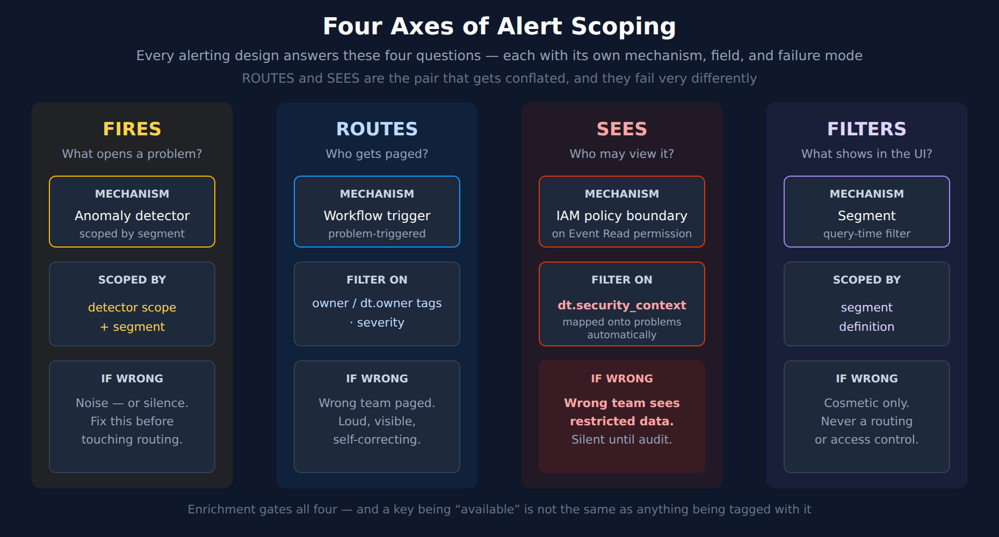
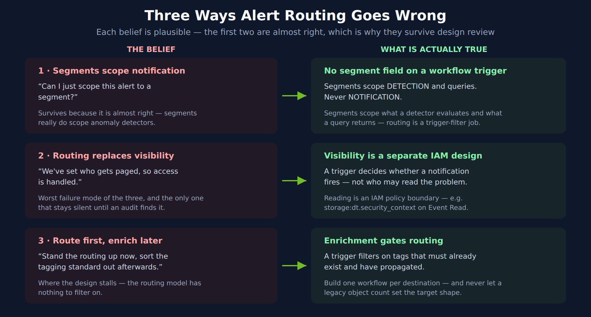

# FAQ-21: How Do I Get the Right Alerts to the Right People?

> **Series:** FAQ — Frequently Asked Questions | **Reference:** 21 — Alert Notification Routing | **Created:** August 2026 | **Last Updated:** 08/27/2026

## Overview

This entry is decision support for the question: **when Davis opens a problem, what determines who hears about it, what they hear, and when?**

The question is almost always asked late — after detectors are configured, after a channel is already noisy, and usually in the same breath as "can we just turn some of these off?" By then the design has usually collapsed four separate concerns into one.

Separating them is the whole answer. Each lives in a different place on the platform, uses a different field, and fails in its own way.

### The four axes

| Axis | Question it answers | Mechanism | Failure mode if wrong |
|---|---|---|---|
| **Fires** | What is worth opening a problem about? | Anomaly detectors, scoped by segments | Noise, or silence |
| **Routes** | Who gets paged? | Problem-triggered workflow trigger filter | Wrong team paged |
| **Sees** | Who may view the problem at all? | IAM access model — see ORGNZ-06 / IAM-05 | Wrong team **sees data they should not** |
| **Filters** | What does a user see in the UI? | Segments | Cosmetic |

Rows 2 and 3 are the pair that gets conflated, and they have very different consequences. This entry names the mechanism for each and points at the series that documents it properly. **It does not restate them.**

Everything below is written for a Gen3 / Grail tenant on its own terms. If you are migrating an older estate, the note in [section 2](#the-four-axes-of-alert-scoping) maps the deprecated constructs onto these four axes — but the model does not depend on having had them.

---

## Table of Contents

1. [Short Answer](#short-answer)
2. [The Four Axes of Alert Scoping](#the-four-axes-of-alert-scoping)
3. [Where Each Element Is Documented](#where-each-element-is-documented)
4. [Right Stuff — Denoise Before You Route](#right-stuff-denoise-before-you-route)
5. [Right People — Route on Labels, Not Entities](#right-people-route-on-labels-not-entities)
6. [Right Time](#right-time)
7. [Three Ways This Goes Wrong](#three-ways-this-goes-wrong)
8. [Recommended Approach](#recommended-approach)
9. [Summary and Next Steps](#summary-and-next-steps)

---

<a id="prerequisites"></a>
## Prerequisites

| Requirement | Details |
|-------------|---------|
| **Applies to** | Any Gen3 / Grail tenant routing Davis problems to humans or to an ITSM system |
| **Audience** | Platform owners, on-call leads, and anyone designing or reworking problem notification |
| **Permissions** | Workflow creation rights; `storage:events:read` for the measurement queries in section 4; IAM policy authoring for the visibility model in section 7 |
| **Related topic series** | ALERT (detection, routing, destinations) · WFLOW (triggers, notification routing, incident management) · ORGNZ (security context, segments) · IAM (policy authoring, boundaries) · MZ2POL (migration from management zones) · AIOPS (Davis problem formation) |
| **Related FAQs** | **FAQ-02** (tagging sources, standards, strategy) — the enrichment prerequisite · **FAQ-06** (can we trust Davis AI) · **FAQ-17** (planning a migration cutover) |

> **Validation status.** The two DQL queries in [section 4](#right-stuff-denoise-before-you-route) were syntax-verified against a live Dynatrace tenant on 08/03/2026. They were **not executed** — the validating token lacked the `storage:events:read` scope. Treat their output shape as expected, not observed. Everything else in this entry is structural guidance and cross-references.

<a id="short-answer"></a>
## 1. Short Answer

**Use Ownership. It is the built-in answer to "who are the right people."**

- **Ownership is tag-based**, with `owner` and `dt.owner` as **default keys available in every monitoring environment** — plus up to three custom keys. Assign them via Kubernetes labels, `oneagentctl --set-host-property`, or process-group environment variables.
- **Route on those tags.** Affected-entity tags are a first-class problem-trigger option, so a team's workflow filters on the ownership tag directly.
- **Or carry `dt.owner` on the event and propagate it to the problem** via *Settings → Dynatrace Intelligence → Root cause analysis → **Problem fields***, then match it in the trigger.
- **Look up contact details at run time** with the Ownership app's `get_owners` workflow action — it returns *"ownership team info with contact details for Slack/Teams/Email/JIRA."* One workflow can then route dynamically instead of one workflow per team.
- **"Available" is not "populated."** The keys exist in every environment; that says nothing about whether a single entity carries an owner, whether team records exist, or whether contact details are filled in. Measure coverage before designing around it — on the tenant used to write this entry, the answer was zero.

> <sub>**Sources:**</sub>
> - <sub>[Assign team ownership (DT docs)](https://docs.dynatrace.com/docs/deliver/ownership/assign-team-ownership) — *"Ownership assignment is based on tags. Tags are key-value pairs stored in Smartscape nodes"*; the `owner` / `dt.owner` default keys</sub>
> - <sub>[Ownership app (DT docs)](https://docs.dynatrace.com/docs/deliver/ownership/ownership-app) — the `get_owners` action and its contact details</sub>
> - <sub>[Problem fields mapping (DT docs)](https://docs.dynatrace.com/docs/dynatrace-intelligence/problems-app/problems-app-custom-problem-field-examples)</sub>
> - <sub>[Problem and event triggers (DT docs)](https://docs.dynatrace.com/docs/analyze-explore-automate/workflows/build/trigger/event-trigger)</sub>

<a id="the-four-axes-of-alert-scoping"></a>
## 2. The Four Axes of Alert Scoping



<!-- MARKDOWN_TABLE_ALTERNATIVE
| Axis | Mechanism | Field | Failure mode |
|------|-----------|-------|--------------|
| Fires | Anomaly detector | Detector scope / segment | Noise or silence |
| Routes | Workflow trigger filter | entity tags, severity, a custom attribute | Wrong team paged |
| Sees | IAM policy boundary (Event Read) | dt.security_context | Wrong team sees restricted data |
| Filters | Segment | Segment definition | Cosmetic only |
For environments where SVG doesn't render
-->

Read the axes left to right as a dependency chain rather than a menu. **Fires** determines whether there is anything to route at all, so detector scoping is upstream of every routing decision — tuning routing to compensate for a noisy detector just distributes the noise more precisely. **Routes** and **sees** then run in parallel on the same problem, answering different questions with different fields. **Filters** sits apart from all three: it changes what a person looking at a screen sees, and nothing else.

The two that matter most are the middle pair, because they look like the same question:

| | Routes | Sees |
|---|---|---|
| Question | Who gets paged about this problem? | Who may view this problem at all? |
| Mechanism | Workflow trigger filter | IAM access model |
| Field | Entity tags, severity, a custom attribute you set | Security context |
| Owner, in practice | Whoever owns alerting | Whoever owns access control |
| Failure mode | Wrong team paged — loud, and it corrects itself | Wrong team sees restricted data — silent until an audit |

Getting routing right does nothing for visibility. They are configured in different places, by different people, and only one of them fails quietly.

> **If you are migrating from management zones.** A management zone did all four of these jobs through a single object, which is why the migration feels like one thing being replaced when it is really four things being separated. The upgrade guide states the **Management Zone** filter is *"No longer supported. Use Grail record-based field filters instead."* **MZ2POL-09** carries the per-profile disposition detail. The four-axis model above does not depend on any of this history.

> <sub>**Sources:** [Problem and event triggers (DT docs)](https://docs.dynatrace.com/docs/analyze-explore-automate/workflows/build/trigger/event-trigger) — the documented trigger option list, which contains no segment field. [Alerting and notifications (DT docs)](https://docs.dynatrace.com/docs/analyze-explore-automate/alerting-and-notifications) — *"We recommend filtering based on the following attributes: Primary Grail fields, Security context, Custom attributes."* [Upgrade guide — alerting and notifications (DT docs)](https://docs.dynatrace.com/docs/manage/upgrade-guide-landing-page/upgrade-guide-alert-notification) — the Management Zone filter statement, quoted verbatim.</sub>

<a id="where-each-element-is-documented"></a>
## 3. Where Each Element Is Documented

This entry is a decision layer. The mechanics live in the topic series, and are better there:

| Element | Read this first | Also see |
|---|---|---|
| End-to-end alerting architecture | ALERT-01 | AIOPS-03 (how Davis forms a problem) |
| Choosing a detector and a threshold model | ALERT-02 | AIOPS-02 (anomaly detection) |
| Routing, destinations, and their cost | ALERT-03 | WFLOW-04 (notification routing) |
| Workflow trigger filter surface | WFLOW-02 | WFLOW-03 (notification basics) |
| ServiceNow / ITSM integration | ALERT-04 | WFLOW-05 (incident management) |
| Problem visibility and the access model | ORGNZ-06 | IAM-04 (policy authoring), IAM-05 (boundary design) |
| Segments — what they scope and what they do not | ORGNZ-08 | ORGNZ-10 (advanced segment definitions) |
| Migrating classic profiles wholesale | MZ2POL-09 | MZ2POL-05 (segments implementation) |
| Workflow governance at scale | WFLOW-09 | — |

If you are running a management-zone migration specifically, **MZ2POL-09** is the procedural counterpart to this entry and carries the per-profile disposition detail this one deliberately omits.

<a id="right-stuff-denoise-before-you-route"></a>
## 4. Right Stuff — Denoise Before You Route

Routing a noisy stream more precisely just distributes the noise more precisely. Two moves come first.

**Trigger on problems, not on individual alerts.** Dynatrace Intelligence ships *"built-in event correlation rules that combine individual alerts into a single problem based on shared topology fields"* — *"any two alerts that reference the same Smartscape entity and arrive within the established timeframe are merged into a single problem."* The problem record carries `dt.davis.event_ids`, *"an array of event IDs that represents all the events collected and merged during the root-cause analysis,"* and when that aggregation happens field values from the separate events are combined into arrays on the problem record. Triggering on the problem is what lets that correlation do its job; triggering on raw alerts bypasses it. The documented framing is blunt: *"One sustained open alert is easier to manage than 30 short-lived alerts that open and close every 2 minutes."*

**Prune the alert library before you re-route it.** The guidance is not to minimize detector count but to remove the badly configured ones — review regularly, delete high-frequency alerts and those bound to orphaned entities, because *"a smaller, well-maintained alert library with a high signal-to-noise ratio produces more accurate results than a large alert library containing noise-creating configurations."*

### Measure before you tune

The two queries below tell you where the volume comes from, which is rarely where people assume. Compare the totals: a large gap between event count and problem count means correlation is doing real work; a small gap means alerts are arriving uncorrelated, which is a detector-configuration problem rather than a routing problem.

> <sub>**Sources:** [Avoid overalerting (DT docs)](https://docs.dynatrace.com/docs/dynatrace-intelligence/use-cases/avoid-overalerting) — correlation rules, the 30-short-lived-alerts framing, and the alert-library pruning guidance, all quoted verbatim. [Davis Problems app (DT docs)](https://docs.dynatrace.com/docs/dynatrace-intelligence/problems-app) — `dt.davis.event_ids` and the array-combining behavior on merge. [Problem and event triggers (DT docs)](https://docs.dynatrace.com/docs/analyze-explore-automate/workflows/build/trigger/event-trigger).</sub>

```dql
// Which problems dominate the last week, deduplicated.
// The top few rows usually account for most of the pager volume.
fetch dt.davis.problems, from: -7d
| filter not(dt.davis.is_duplicate)
| summarize problems = count(), by:{event.name, event.category}
| sort problems desc
| limit 20
```

Then compare that against the raw event stream. A large gap between event count and problem count means Davis is denoising effectively; a small gap means most events are arriving already uncorrelated, which is a detector-scoping problem rather than a routing problem:

```dql
// Raw alert-event volume by category and status.
// Compare the total against the problem count above — the ratio
// tells you how much work Davis denoising is actually doing.
fetch dt.davis.events, from: -7d
| summarize events = count(), by:{event.category, event.status}
| sort events desc
| limit 20
```

<a id="right-people-route-on-labels-not-entities"></a>
## 5. Right People — Ownership Is the Built-In Answer

Start from what the trigger exposes. A problem trigger is configured with:

| Option | What it does |
|---|---|
| **Problem state** | Active only, or active and closed |
| **Event category** | Which Davis categories activate the workflow |
| **Severity** | Filters by level threshold |
| **Affected entities** | Tag-based — all entities, all defined tags, or any defined tag |
| **Minimum duration** *(advanced)* | Postpone until the problem has been open a set duration — see [section 6](#right-time) |
| **Updates** *(advanced)* | Re-trigger when selected fields change |
| **Additional custom filter query** *(advanced)* | A DQL matcher over the problem record |

There is no segment filter and no entity-selector filter. But there **is** a first-class concept of team ownership, and it plugs straight into the tag filter.

### Ownership — the mechanism to reach for first

*"Ownership assignment is based on tags. Tags are key-value pairs stored in Smartscape nodes."* Dynatrace ships two **default keys — `owner` and `dt.owner` — available in every monitoring environment**, and you may define up to three additional custom keys (`owner-1`, `dt.owner-test`, and so on). Each assignment carries a mandatory unique identifier that cannot be changed later, plus an optional modifiable one.

You set ownership where the entity is described:

| Where | How |
|---|---|
| Kubernetes | Labels |
| Hosts | `./oneagentctl --set-host-property owner-1=team-automation` |
| Process groups | Environment variables |

Because ownership *is* tags on Smartscape nodes, the trigger's **affected-entity tag filter** routes on it with no DQL at all. That is the shortest path from "who owns this" to "who gets paged."

### "Available" is not "populated"

The `owner` and `dt.owner` keys exist in every monitoring environment. **That is a statement about the key namespace, not about your data.** None of the following follows from availability:

| Available means | Available does **not** mean |
|---|---|
| The key is valid and will be honored | Any entity actually carries an owner tag |
| You may create ownership teams | Ownership team records exist |
| Teams *can* hold contact details | Those details are filled in |
| Event fields *can* reach the problem record | The Problem fields mapping has been created |

Each of those is work someone has to do, and the tagging is usually the bulk of it. Routing designed on top of unpopulated ownership produces workflows that never fire — and a trigger matching nothing looks exactly like a healthy, quiet estate.

**Measure coverage before you design around it.** Run this against your own tenant first:

```dql
// Ownership coverage — what fraction of hosts actually carry a dt.owner tag.
// Run this BEFORE designing routing on ownership. Repeat per entity type.
smartscapeNodes "HOST"
| fieldsAdd owner_tag = tags[`dt.owner`]
| summarize hosts = count(), by:{has_owner = isNotNull(owner_tag)}
```

Executed against a live tenant on 08/03/2026 this returned a **single row: `has_owner = false`, 8 hosts** — the keys were available and populated on nothing at all. That is the normal starting state, not an anomaly. Swap `"HOST"` for the entity types you intend to route on, and treat anything short of full coverage as scope for the enrichment work in [section 7](#three-ways-this-goes-wrong).

Ownership is still the right mechanism to reach for. It is simply not free, and the gap between "the platform supports this" and "our estate uses this" is where routing projects stall.

### Carrying ownership on the event instead

Entity tags cover problems whose affected entities are tagged. When the alert itself should declare its owner — custom alerts, ingested events, automation-generated events — set `dt.owner` as an **event property** on the alert configuration (documented example: `"dt.owner": "app-team-us-23"`), then propagate it onto the problem record.

The propagation is an explicit setting, not automatic: **Settings → Dynatrace Intelligence → Root cause analysis → Problem fields**, then *New field*, mapping the event field name to the problem field name. Once configured, *"all newly created problems will automatically include field values from the single events for these keys."*

The documented worked example sets several properties on one custom alert — `dt.source_entity`, `event.type: ERROR_EVENT`, `event.name`, `event.description`, `dt.owner: app-team-us-23`, `app-id: app-23` — then maps **both** `dt.owner` and `app-id` through to the problem. `dt.security_context` is mappable the same way, which is how the visibility axis gets its value onto the problem record.

**This mapping step is the one people miss.** Setting `dt.owner` on the event and then filtering the trigger on it will silently match nothing until the Problem fields mapping exists — and a trigger that matches nothing is indistinguishable from a quiet estate.

> **The mapping is not retroactive, and cannot be made so.** *"Problem records in Grail are immutable. This means that you can modify the field mapping configuration at any time, but previously recorded problems that were closed before the modifications will not change."* Add the mapping late and every already-closed problem is permanently without the field. Two consequences worth planning around: create the mapping **before** the parallel-run window, not during it, or your before/after comparison is measuring the mapping rather than the routing; and never expect a backfill to rescue a mapping that was forgotten.

**Not every field needs that mapping.** There are two classes, and confusing them wastes configuration effort:

| Field class | How it reaches the problem |
|---|---|
| Fields the permission system defines as **record permissions** (e.g. `dt.security_context`) | **Automatic** — *"All fields that occur on single violation events and are defined by the Dynatrace permission system as record permissions are automatically mapped onto problems."* |
| Any other custom field (`dt.owner`, `app-id`, …) | **Explicit** — you create the Problem fields mapping yourself |

**Three things the documentation does not settle**, so do not assume them: the maximum number of mapped fields, what happens when merged events carry *conflicting* values for the same field, and how array-valued fields behave. If your design depends on any of these, test it rather than reasoning about it.

### Contact details at run time — one workflow instead of many

The Ownership app supplies workflow actions. **`get_owners`** returns *"ownership team info with contact details for Slack/Teams/Email/JIRA"* for an entity. A workflow can therefore look up the owning team when the problem fires and address the notification dynamically, rather than hard-coding a destination per team.

That inverts the usual granularity advice. With `get_owners` you can run **one workflow that routes to many teams**; without it you fall back to **one workflow per destination**. Choose deliberately — the dynamic form is fewer objects but a longer chain to debug when a notification does not arrive.

**`import_teams`** *"imports and auto-syncs ownership team data in JSON schema and accepts info from ServiceNow and Entra ID"* — so the team roster does not have to be maintained twice.

### When you still need the custom filter

For anything ownership does not express, the additional custom filter query takes a **DQL matcher** — a restricted subset, not full DQL. Core functions are `matchesPhrase`, `matchesValue`, `isNotNull`, `isNull` with logical operators; documented examples look like `matchesValue(process.technology, "nginx")`.

**Do not assume the full matcher surface is available here.** Matcher support differs by surface, and the workflow-trigger variant is reported to be narrower than the OpenPipeline one — numeric comparisons and iterative expressions in particular should not be relied on without checking. Dynatrace's dedicated workflow-trigger matcher page was unreachable at the time of writing (08/03/2026), so confirm what your trigger accepts in the configuration UI. Severity does not belong in the matcher anyway — it is already a first-class trigger option.

> <sub>**Sources:**</sub>
> - <sub>[Assign team ownership (DT docs)](https://docs.dynatrace.com/docs/deliver/ownership/assign-team-ownership) — tag-based assignment, the `owner` / `dt.owner` default keys, custom keys, and the `oneagentctl` example, all quoted verbatim</sub>
> - <sub>[Ownership app (DT docs)](https://docs.dynatrace.com/docs/deliver/ownership/ownership-app) — `get_owners` and `import_teams`, and the contact-detail channels</sub>
> - <sub>[Manage access to problem records (DT docs)](https://docs.dynatrace.com/docs/shortlink/dynatrace-intelligence-problems-use-cases#manage-the-access-to-problem-records) — record-permission fields are mapped onto problems automatically</sub>
> - <sub>[Custom problem field examples (DT docs)](https://docs.dynatrace.com/docs/dynatrace-intelligence/problems-app/problems-app-custom-problem-field-examples) — the `dt.owner` event property and the Problem fields mapping path</sub>
> - <sub>[Problem and event triggers (DT docs)](https://docs.dynatrace.com/docs/analyze-explore-automate/workflows/build/trigger/event-trigger)</sub>
> - <sub>[Alerting and notifications (DT docs)](https://docs.dynatrace.com/docs/analyze-explore-automate/alerting-and-notifications) — *"We recommend filtering based on the following attributes: Primary Grail fields, Security context, Custom attributes."*</sub>
> - <sub>[DQL matcher in OpenPipeline (DT docs)](https://docs.dynatrace.com/docs/platform/openpipeline/reference/dql/dql-matcher-in-openpipeline)</sub>
> - <sub>**Derived:** the one-workflow-per-destination-versus-dynamic-lookup trade-off combines the trigger surface with the `get_owners` action; no single source frames it as a choice</sub>

<a id="right-time"></a>
## 6. Right Time

**Severity tiers the urgency.** Severity is a first-class trigger filter. Route the top level to whatever wakes someone up; route the lower levels to a channel read during business hours.

**Pair every open-notification with a close-notification.** The problem state option takes *active* or *active and closed*. Responders need the all-clear as much as the alarm, and on the ITSM side it is what resolves the ticket rather than leaving a queue of incidents describing conditions that ended days ago.

**Duration suppression is a documented trigger option.** The **Minimum duration** setting (formerly **Delay**) postpones *"the trigger until the problem has been open for at least the configured duration."* Allowed values, in minutes: **5, 10, 15, 30, 60, 120, 240, 1440 (one day), 10080 (one week)**. It evaluates `dt.duration_marker`, *"a field set by Dynatrace Intelligence that accumulates from the moment the problem was first created,"* and *"The trigger starts once when the threshold is crossed on the active phase and, if selected, also once on closure."*

This is the mechanism for suppressing transient blips: a problem that resolves inside the delay window never notifies.

> **A documented conflict, unresolved.** The alert-notification upgrade guide states the classic **Duration** filter is *"No longer supported. Currently there is no alternative to deliver problems that are active longer than X minutes."* The current trigger documentation describes the **Minimum duration** option above, which does exactly that. Both pages are live as of 08/03/2026. The most likely reading is that the upgrade guide predates this option and has not been re-tensed, but that is inference rather than a documented statement — **verify the Minimum duration option in your own tenant before relying on it**, and do not plan a migration around the upgrade guide's "no alternative" claim without checking first. This entry does not resolve the conflict; it records it.

> <sub>**Sources:** [Problem and event triggers (DT docs)](https://docs.dynatrace.com/docs/analyze-explore-automate/workflows/build/trigger/event-trigger) — the Minimum duration option, its allowed values, `dt.duration_marker`, and the firing behavior, all quoted verbatim (re-verified 08/27/2026; the option was renamed from **Delay**, and the docs still use the lowercase word "delay" in the `dt.duration_marker` sentence, which is how the rename went unnoticed). [Upgrade guide — alerting and notifications (DT docs)](https://docs.dynatrace.com/docs/manage/upgrade-guide-landing-page/upgrade-guide-alert-notification) — the conflicting Duration-filter statement, quoted verbatim.</sub>

<a id="three-ways-this-goes-wrong"></a>
## 7. Three Ways This Goes Wrong



<!-- MARKDOWN_TABLE_ALTERNATIVE
| Anti-pattern | Belief | Correction |
|--------------|--------|------------|
| Segments scope notification | "Can I scope this alert to a segment?" | The documented trigger options contain no segment field; segments scope detection and queries |
| Routing replaces visibility | "We set who gets paged, so access is handled" | Notification filtering and access control are different concerns with different owners |
| Route before enrich | "Stand routing up now, tag later" | The trigger filters on tags that must already exist and have propagated |
For environments where SVG doesn't render
-->

### 1. "Can I just scope this alert to a segment?"

It arrives greenfield as the question above and mid-migration as *"we moved to Segments, so our alerting profiles point at segments now."* Both survive because they are *almost* right — segments do scope anomaly detectors.

But the documented problem-trigger options are problem state, event category, severity, affected entities, delay, updates, and the additional custom filter query. **There is no segment field among them.** Segments scope what a detector evaluates and what a query returns; they do not scope who gets notified.

For a migrating estate the upgrade guide is unambiguous on the related point: the **Management Zone** filter is *"No longer supported. Use Grail record-based field filters instead."*

### 2. Setting who gets paged, and calling access handled

Notification filtering and access control are different concerns. A trigger condition decides whether a *notification fires*; it does not decide whether a person may *open the problem and read it*.

Restricting who may read a problem is a **policy boundary**, not a workflow setting. The documented shape is a boundary such as `storage:dt.security_context IN ("app-23");` attached to an **Event Read** permission and assigned to a user group — *"This allows you to segregate and manage access to the Dynatrace Grail data lake based on reading permissions for various user groups."*

Two things follow that make this genuinely separate from routing:

- **The field arrives on its own.** Record-permission fields are mapped onto problems automatically from the violation events, so `dt.security_context` does not need the Problem fields mapping that `dt.owner` does — but it does need to be *set* on the events in the first place.
- **It is configured elsewhere, by someone else.** Policy boundaries live in IAM, not in Workflows. **ORGNZ-06** and **IAM-05** carry the authoring detail.

Getting routing right therefore settles nothing about visibility, and the failure is silent: nobody is paged incorrectly, someone simply reads data they should not.

### 3. Routing before enriching

A workflow trigger's affected-entity filter operates on **tags**, and a custom-attribute filter operates on an attribute something must already have set. Both require enrichment that has already propagated. Sequencing the routing design ahead of the tagging standard produces a routing model with nothing to filter on. **FAQ-02** covers the tagging side; the ordering dependency is the point here.

A related trap for migrating estates: rebuilding every legacy profile as its own workflow recreates an object count that reflected the constraints of the old model rather than any current requirement. Ask what each cluster of profiles was working around before reproducing it.

> <sub>**Sources:**</sub>
> - <sub>[Manage access to problem records (DT docs)](https://docs.dynatrace.com/docs/shortlink/dynatrace-intelligence-problems-use-cases#manage-the-access-to-problem-records) — the automatic record-permission mapping and the `storage:dt.security_context` boundary, quoted verbatim</sub>
> - <sub>[Problem and event triggers (DT docs)](https://docs.dynatrace.com/docs/analyze-explore-automate/workflows/build/trigger/event-trigger) — the complete documented option list, which contains no segment field</sub>
> - <sub>[Alerting and notifications (DT docs)](https://docs.dynatrace.com/docs/analyze-explore-automate/alerting-and-notifications)</sub>
> - <sub>[Upgrade guide — alerting and notifications (DT docs)](https://docs.dynatrace.com/docs/manage/upgrade-guide-landing-page/upgrade-guide-alert-notification) — the Management Zone filter statement, quoted verbatim</sub>

<a id="recommended-approach"></a>
## 8. Recommended Approach

Sequenced, because the dependencies are real:

1. **Enrich first.** Establish the tagging standard and confirm propagation before designing routing. Every dimension you intend to filter on must already exist as a tag or an attribute.
2. **Decide the visibility model separately, and early.** If problems need access restriction, that is IAM work (**ORGNZ-06**, **IAM-05**) — settle it before workflows are built on top of it.
3. **Route on the ownership tags first.** `owner` and `dt.owner` are default tag keys in every monitoring environment and affected-entity tags are a first-class trigger filter, so this needs no custom field and no DQL matcher (§ 1, § 9). Measure coverage before relying on it — *available* is not *populated*; on the validation tenant `dt.owner` resolved on 1 of 12 hosts (08/27/2026). **Only where ownership cannot be populated** for a given signal, standardize one custom attribute (e.g. `alert_group`), set it wherever those events are raised, and match it with a DQL matcher.
4. **Build one workflow per destination.** Filter on affected-entity tags and severity where those suffice, and put anything finer in the additional custom filter query as a DQL matcher.
5. **Set the Minimum duration option** where transient problems should not page, rather than filtering them out downstream — but verify it behaves as documented in your tenant first (see [section 6](#right-time)).
6. **Pair every open-notification with a close-notification.**
7. **Cut over on evidence.** Prove per-team volume parity across an agreed window before retiring whatever the workflows replace. **FAQ-17** covers the cutover discipline.

> <sub>**Sources:** [Problem and event triggers (DT docs)](https://docs.dynatrace.com/docs/analyze-explore-automate/workflows/build/trigger/event-trigger), [Alerting and notifications (DT docs)](https://docs.dynatrace.com/docs/analyze-explore-automate/alerting-and-notifications), [DQL matcher (DT docs)](https://docs.dynatrace.com/docs/platform/openpipeline/reference/dql/dql-matcher-in-openpipeline).</sub>

<a id="summary-and-next-steps"></a>
## 9. Summary and Next Steps

**Five things to carry away:**

1. **Four axes, not one.** Fires, routes, sees, filters — each a different mechanism and a different failure mode.
2. **Ownership is the built-in answer.** `owner` and `dt.owner` are default tag keys in every environment, and affected-entity tags are a first-class trigger filter — so routing on ownership needs no custom field and no DQL. Reach for a custom attribute only where ownership genuinely does not fit.
3. **The custom filter is a DQL matcher, not DQL.** `matchesPhrase`, `matchesValue`, `isNotNull`, `isNull` plus logical operators — and the exact surface differs per matcher context, so verify what the trigger accepts rather than assuming. Anything needing aggregation belongs upstream in enrichment.
4. **Duration suppression exists** as the trigger's **Minimum duration** option — with a live documentation conflict against the upgrade guide that you should verify in your own tenant.
5. **Enrichment gates everything.** You cannot filter on a tag or attribute that does not exist yet.

| If you need… | Read |
|---|---|
| The full trigger filter surface | WFLOW-02 |
| Routing patterns, destinations, and their cost | ALERT-03, WFLOW-04 |
| End-to-end alerting architecture | ALERT-01 |
| How Davis forms and merges a problem | AIOPS-03 |
| The visibility / access model | ORGNZ-06, IAM-05 |
| Per-profile migration disposition | MZ2POL-09 |
| The tagging standard routing depends on | **FAQ-02** |
| Cutover discipline for the parallel run | **FAQ-17** |

---

<sub>*This notebook was AI-generated from community-submitted and publicly available sources. This notebook series is not officially supported by Dynatrace. Always verify information against official Dynatrace documentation.*</sub>
