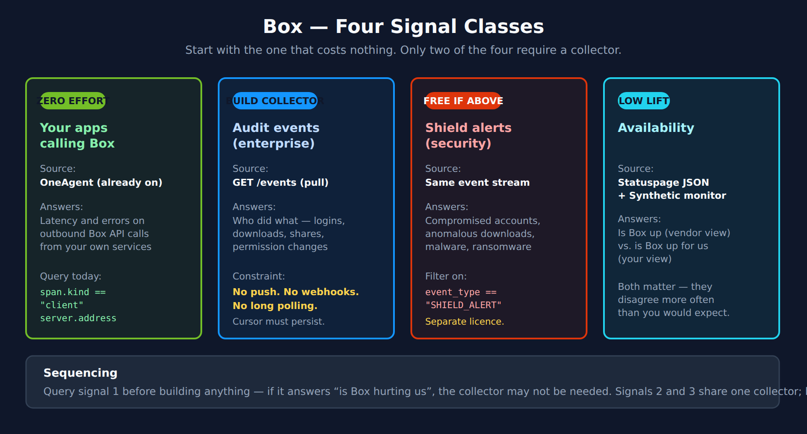
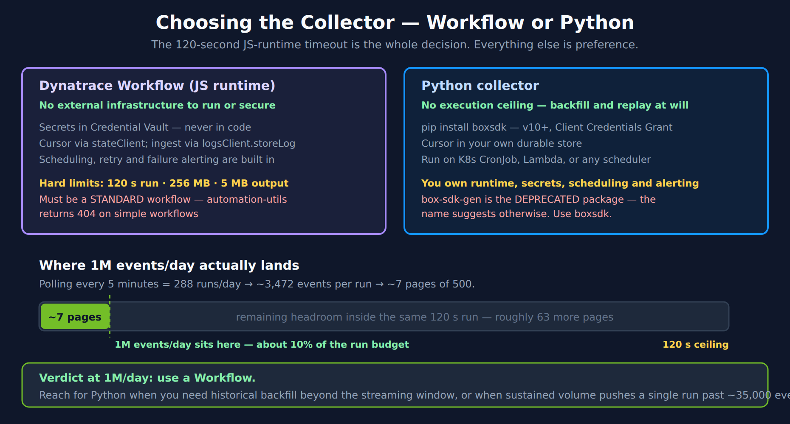
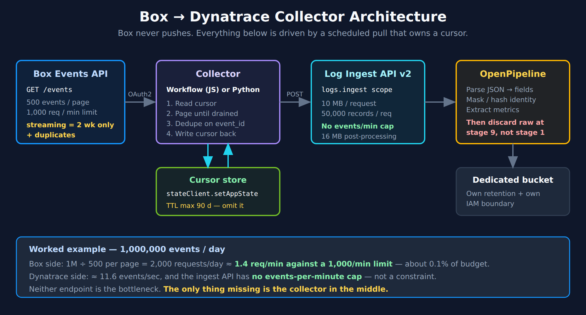

# FAQ-23: How Do I Monitor Box With Dynatrace?

> **Series:** FAQ — Frequently Asked Questions | **Reference:** 23 — Monitoring Box With Dynatrace | **Created:** August 2026 | **Last Updated:** 08/25/2026

## Overview

Box holds the documents. That is the whole reason this integration comes up: the audit trail of who opened, downloaded, shared, and deleted them is a compliance artifact, and it lives in a system nobody in the observability team administers. The request usually arrives phrased as a logging problem — "we need Box logs in Dynatrace" — and is answered as though the only open question were which ingestion endpoint to point at.

It is not. Two things about this integration are commonly assumed the wrong way round, and both change the design:

- **There is no turnkey Dynatrace integration for Box.** No Hub listing, no extension to activate. Verified three independent ways in August 2026 — Hub catalog search, web search, and the Dynatrace documentation assistant — all empty. You are building and owning this.
- **Box cannot push its audit feed to you.** Box webhooks exist, and they are the wrong tool: they attach to individual files and folders, cap at 1,000 resources per application, cannot be set on the root folder, and never carry logins, admin actions, or security alerts. The enterprise audit feed is available *only* by polling, and Box states plainly that it "does not support long polling." Every working design is a scheduled pull that owns a cursor.

That second point is the expensive one. A team that starts from "set up a webhook" will build a receiver, wire it correctly, and then discover that the events they actually needed were never eligible to arrive. This entry exists partly to prevent that specific week.

This entry is a **worked example of FAQ-19**. The generic decisions — signal classes, route selection, extract-then-discard, bucket isolation — are made there; here they are made concretely for Box, with a sizing example at **1,000,000 events per day** drawn from a real migration question.

> **A note on the DQL in this entry.** Box data will not exist in your tenant until the collector runs. Every query below is therefore written to run standalone against a synthetic record using `data record(...)` — **zero bytes scanned, zero cost** — so you can validate the shape before you have ingested anything. All queries were executed against a live tenant on 08/25/2026. Swap `data record(...)` for `fetch logs | filter log.source == "box.events"` once data flows.

---

## Table of Contents

1. [Short Answer](#short-answer)
2. [What Box Is — and Why There Is No Turnkey Integration](#no-turnkey)
3. [The Four Signal Classes](#signal-classes)
4. [The Events API — The Constraint That Shapes Everything](#events-api)
5. [Sizing: A Worked Example at 1,000,000 Events/Day](#sizing)
6. [Choosing the Collector — Workflow or Python](#choosing)
7. [Implementation A — Dynatrace Workflow](#workflow)
8. [Implementation B — Python](#python)
9. [Ingestion, Processing, and Storage](#ingestion)
10. [Field Mapping Starting Point](#field-mapping)
11. [Box Shield Alerts](#shield)
12. [Querying Box Events in Grail](#querying)
13. [Operating the Collector](#operating)
14. [Availability Monitoring](#availability)
15. [Dashboards, Alerting, and SLOs](#downstream)
16. [Implementation Sequence and Checklist](#sequence)
17. [Common Gotchas](#gotchas)
18. [Recommended Approach](#recommended-approach)
19. [References](#references)

---

## Prerequisites

| Requirement | Details |
|-------------|---------|
| **Box licensing** | Business plan or above for the Events API. **Box Shield is a separate SKU** — § 11 explains what its absence removes, and it is worth confirming before scoping |
| **Box admin access** | The service account must be an **enterprise admin or co-admin** holding *"Run new reports and access existing reports."* Without it the API returns nothing useful — which looks identical to "no events" (§ 17) |
| **Box application** | A Box app configured for **Client Credentials Grant** (server-side auth, no user interaction), authorized in the Box Admin Console |
| **Dynatrace environment** | SaaS with **Grail** and **OpenPipeline** |
| **Outbound connectivity** | If collecting via Workflow, `api.box.com` must be on the JS-runtime outbound allowlist (§ 7) — a silent-failure trap |
| **Security sign-off** | This feed carries user identity, file names, and IP addresses. Decide retention and masking before building — see FAQ-19 § 4 and § 6 |
| **Related reading** | **FAQ-19** (the generic pattern this instantiates), **FAQ-20** (the Zscaler worked example), **OPIPE** / **OPLOGS** (OpenPipeline depth), **ORGNZ** (buckets), **WFLOW** (workflows), **ALERT** / **SLO** / **DASH** (downstream) |

---

<a id="short-answer"></a>
## 1. Short Answer

Build a scheduled collector that polls the Box Events API and posts to the Dynatrace Log Ingestion API. At typical enterprise volume — including **1,000,000 events per day** — a Dynatrace Workflow is sufficient and needs no external infrastructure.

**The five decisions, made:**

| Decision | Answer | Why |
|---|---|---|
| **Transport** | Scheduled **pull** from `GET /events` | Box has no push for enterprise events. Webhooks cannot carry this feed (§ 2) |
| **Stream** | `admin_logs_streaming` for live; `admin_logs` for backfill | They are not interchangeable — different retention, ordering, and duplicate behaviour (§ 4) |
| **Collector** | **Workflow** up to ~35,000 events per run; Python beyond that or for deep backfill | The 120-second JS-runtime timeout is the only real boundary (§ 6) |
| **Destination** | Log Ingestion API v2, dedicated `log.source` | No events-per-minute cap; 10 MB / 50,000 records per request (§ 9) |
| **Retention** | Extract metrics, then discard raw by default; dedicated bucket for what you keep | ~1.5 GB/day at 1M events is a real budget line (§ 5) |

**Start with the signal that costs nothing.** If your own applications call Box, OneAgent is already tracing those calls. Query them before building anything — see § 3.

---

<a id="no-turnkey"></a>
## 2. What Box Is — and Why There Is No Turnkey Integration

Box is a cloud content management platform — file storage, sharing, workflow, and governance — operated entirely by Box. In observability terms that single fact settles the architecture: there is no host to install OneAgent on, no process to inject, no infrastructure to discover. Everything you can learn about Box, you learn through its API.

This is the same shape as Zscaler (**FAQ-20**) and Adobe AEM as a Cloud Service (**FAQ-18**), and it is the pattern generalized in **FAQ-19**.

### 2.1 No Hub listing — verified, not assumed

As of August 2026 there is no Dynatrace Hub listing, extension, or first-party integration for Box. This was checked three independent ways — the Hub catalog, general web search, and the Dynatrace documentation assistant — and all three returned nothing.

Per the corpus rule that a negative claim needs a positive source: what is being reported here is the result of three catalog checks on 08/25/2026, not an inference from one empty search. Re-verify before quoting this in a design document; Hub listings appear over time.

The practical consequence is ownership. There is no vendor-maintained connector to inherit, and no upgrade path that will fix your integration for you. That is a normal position — it is simply better decided deliberately in week one than discovered in week three.

### 2.2 Why webhooks are the wrong answer — and why people reach for them

Box does publish webhooks, which is exactly why this goes wrong. They are a real feature that does a different job.

| Box webhooks V2 | Consequence for an audit feed |
|---|---|
| Attach to **specific files or folders**; **cannot be set on the root folder** (ID 0) | There is no account-wide subscription to create |
| Cap of **1,000 webhooks per application + user** combination | You could watch 1,000 folders — not an enterprise |
| Triggers are content actions (upload, copy, move, share, delete) | **No logins, no admin actions, no `SHIELD_ALERT`** |
| Delivery requires a 2xx within 30 s; Box retries 12× over 2 hours | A receiver outage drops events with no cursor to replay from |
| Token expiry degrades the payload to `NO_ACTIVE_SESSION` | Silent partial failure |

Enterprise audit events are reachable only through `GET /events` with `stream_type` set to `admin_logs` or `admin_logs_streaming`, and Box's own documentation states that **"the enterprise event feed does not support long polling."** It is pull-only.

**If someone has recommended a webhook for this, they have answered a different question.** Webhooks are the right tool for reacting to changes in a specific high-value folder — a contract repository, a regulated dataset. They are structurally incapable of carrying the audit trail.

> <sub>**Sources:** [Webhooks (Box Dev Docs)](https://developer.box.com/guides/webhooks/), [Webhook limitations V2 (Box Dev Docs)](https://developer.box.com/guides/webhooks/v2/limitations-v2), [Get Enterprise Events (Box Dev Docs)](https://developer.box.com/guides/events/enterprise-events/for-enterprise/), [Box Hub catalog (Dynatrace)](https://www.dynatrace.com/hub/). **Derived:** § 2.1's no-listing claim is the result of three independent catalog checks on 08/25/2026, not a single search.</sub>

---

<a id="signal-classes"></a>
## 3. The Four Signal Classes

FAQ-19 § 2 splits any third-party SaaS into signal classes and insists you choose which questions you are answering before choosing a transport. For Box there are four, and they differ enormously in cost.



<!-- MARKDOWN_TABLE_ALTERNATIVE
| Signal | Source | Effort | Answers |
|--------|--------|--------|---------|
| Your apps calling Box | OneAgent (already running) | Zero | Latency and errors on outbound Box API calls from your services |
| Audit events | GET /events (pull) | Build a collector | Who did what: logins, downloads, shares, permission changes |
| Shield alerts | Same event stream, SHIELD_ALERT | Free once collector exists | Compromised accounts, anomalous downloads, malware, ransomware |
| Availability | Statuspage JSON + Synthetic monitor | Low | Is Box up (vendor view) vs is Box up for us (your view) |
-->

### 3.1 Start with the signal that costs nothing

If any of your applications call the Box API, OneAgent is **already** capturing those as client spans. No Box configuration, no credentials, no collector. This is the fastest path to an answer and it is routinely skipped.

Run this before you build anything:

```dql
// Signal 1 — your own services calling Box. Requires no Box integration at all.
// Note the field names: server.address and url.full are the stable fields.
// http.url does NOT exist in the semantic dictionary and returns zero rows
// silently — see § 17.
fetch spans, from:-24h
| filter span.kind == "client" and endsWith(server.address, "box.com")
| summarize {calls = count(),
             failures = countIf(span.status_code == "ERROR"),
             p90_ms = percentile(duration, 90) / 1000000},
            by:{server.address}
| fieldsAdd failure_rate_pct = round(100.0 * failures / calls, decimals: 2)
| sort calls desc
```

If that returns rows, you already have Box performance telemetry and can build a dashboard today. If it returns nothing, confirm *why* before concluding your services do not call Box — an empty result here has at least three causes (no Box traffic, no OneAgent on the calling tier, or a mistyped field name), and only one of them is informative.

### 3.2 What each remaining signal is actually for

| Signal | Answers | Does **not** answer |
|---|---|---|
| **Audit events** | Who accessed, shared, downloaded, or deleted what, when, from where | Whether Box was slow or erroring |
| **Shield alerts** | Which of those actions Box's own detection considers a threat | Anything Shield is not licensed to detect |
| **Availability** | Whether Box is reachable and healthy — vendor-declared and observed | Which user was affected, or what they were doing |

The common mistake is expecting audit events to answer performance questions. They are an access record, not a latency record. Box does not publish per-request timing for its own service; if you need Box performance, it comes from signal 1 (your calls) or signal 4 (synthetics), never from the audit feed.

> <sub>**Sources:** [Semantic dictionary fields (DT docs)](https://docs.dynatrace.com/docs/platform/grail/dynatrace-semantic-dictionary), [List user and enterprise events (Box Dev Docs)](https://developer.box.com/reference/get-events). **Derived:** § 3.1's field-name caution comes from executing both forms against a live tenant on 08/25/2026 — `http.url` returned zero rows while scanning 9.8M records.</sub>

---

<a id="events-api"></a>
## 4. The Events API — The Constraint That Shapes Everything

Everything enterprise-wide comes from one endpoint, `GET /events`, in one of two mutually exclusive modes. Choosing between them is the first real design decision, and most teams need both.

| | `admin_logs_streaming` | `admin_logs` |
|---|---|---|
| **Retention** | **2 weeks** | **1 year** |
| **Latency** | Near real-time | Higher |
| **Ordering** | Out of chronological order | Chronological |
| **Duplicates** | **Yes** — dedupe on `event_id` | None |
| **Designed for** | Live monitoring and alerting | Historical query, backfill, investigation |

**Use streaming for the live pipeline and historical for backfill.** They are not alternatives to choose between once; they are two jobs. A collector that only runs streaming has a two-week memory and no way to recover from a longer outage. A collector that only runs historical is too slow to alert on.

### 4.1 The constraints that shape the collector

| Constraint | Value | Design consequence |
|---|---|---|
| **No push** | *"The enterprise event feed does not support long polling"* | Scheduled pull. There is no event-driven option |
| **Page size** | 500 events maximum | Paging loop required; drives the sizing math in § 5 |
| **Cursor** | `stream_position` in, `next_stream_position` out | **Must persist between runs** or you re-ingest or skip |
| **Rate limit** | 1,000 requests/min per user; 429 returns `retry-after` | Exponential backoff. Rarely binding — see § 5 |
| **Permission** | Enterprise admin/co-admin with *"Run new reports…"* | Missing it returns nothing, indistinguishable from no events |

### 4.2 The cursor is the whole design

Everything difficult about this collector reduces to one question: *where did I get to last time?* Box hands you `next_stream_position` with every page; you hand it back on the next call. Lose it and you either replay events you already have (paying twice) or skip events you never got (a compliance gap you cannot detect after the fact).

Because `admin_logs_streaming` retains only two weeks, a lost cursor is not always recoverable. This is the single highest-consequence property of the integration and it drives § 13.

> <sub>**Sources:** [Get Enterprise Events (Box Dev Docs)](https://developer.box.com/guides/events/enterprise-events/for-enterprise/), [List user and enterprise events (Box Dev Docs)](https://developer.box.com/reference/get-events), [Rate Limits (Box Dev Docs)](https://developer.box.com/guides/api-calls/permissions-and-errors/rate-limits), [New Enterprise Event Stream API (Box Support)](https://support.box.com/hc/en-us/articles/4412894211475-New-Enterprise-Event-Stream-API).</sub>

---

<a id="sizing"></a>
## 5. Sizing: A Worked Example at 1,000,000 Events/Day

This section works a real number end to end, because the volume question is usually asked about the wrong endpoint. A migrating customer asked whether a webhook could handle 1M Box events per day; the answer they received addressed only the Dynatrace ingest limits. Both halves matter, and — as it turns out — **neither is the constraint.**

### 5.1 Both endpoints have ample headroom

| Side | Documented limit | At 1M events/day | Verdict |
|---|---|---|---|
| **Dynatrace ingest** | **No events-per-minute cap**; 10 MB and 50,000 records per request | ~11.6 events/sec | Not a constraint |
| **Box Events API** | 500 events/page; 1,000 requests/min per user | 1M ÷ 500 = 2,000 pages/day ≈ **1.4 req/min** | ~0.1% of budget |

1,000,000 events per day is a modest load for both systems. **The bottleneck is neither endpoint — it is that no collector exists between them.** That is the part a question about "which ingestion option handles the volume" does not surface, because the ingest API is the destination, not the connection.

### 5.2 What that means for a Workflow

Polling every 5 minutes gives 288 runs/day and ~3,472 events per run — about **7 pages of 500**. Against a 120-second execution ceiling that is comfortable:

| Quantity | Value | Basis |
|---|---|---|
| Runs per day (5-min schedule) | 288 | Schedule |
| Events per run | ~3,472 | 1M ÷ 288 |
| Pages per run | ~7 | 500 events/page |
| Estimated time per run | ~15 s | ~1–2 s per page — **an estimate, not a documented figure** |
| Execution ceiling | **120 s** | JS-runtime hard limit |
| Approximate headroom used | **~10%** | Derived |

Mark the page-latency assumption clearly and measure it in your own tenant. The documented numbers here — 120 s, 500 events/page, 1,000 req/min, no ingest rate cap — are verified. The per-page round-trip time is not, and it is the one input that could move the conclusion.

### 5.3 The cost line nobody quotes

At roughly 1.5 KB per event:

| | Volume |
|---|---|
| Per day | ~1.5 GB |
| Per month | **~45 GB** |

That is a real DPS line item, and it arrives whether or not anyone budgeted for it. It is also the strongest argument for the extract-then-discard posture in § 9: most of those 45 GB are `PREVIEW` and `DOWNLOAD` events whose analytical value is fully captured by a counter.

Decide retention *before* you turn the collector on. Reducing retention later does not refund what you already ingested.

> <sub>**Sources:** [Log ingestion limits (DT docs)](https://docs.dynatrace.com/docs/shortlink/lma-limits), [Rate Limits (Box Dev Docs)](https://developer.box.com/guides/api-calls/permissions-and-errors/rate-limits), [Get Enterprise Events (Box Dev Docs)](https://developer.box.com/guides/events/enterprise-events/for-enterprise/). **Derived:** § 5.1–5.3 combine the documented per-side limits with a 1M/day rate and a ~1.5 KB average event size; the per-page latency and event size are estimates to verify locally.</sub>

---

<a id="choosing"></a>
## 6. Choosing the Collector — Workflow or Python



<!-- MARKDOWN_TABLE_ALTERNATIVE
| Aspect | Dynatrace Workflow (JS runtime) | Python collector |
|--------|-------------------------------|------------------|
| Infrastructure | None | You run and secure it |
| Execution ceiling | 120 s per run (hard) | None |
| Secrets | Credential Vault | Your own secret store |
| Cursor storage | stateClient app state | Your own durable store |
| Scheduling/retry | Built in | You build it |
| Best for | Steady-state polling up to ~35,000 events/run | Backfill, replay, very high volume |
-->

| | **Workflow (JS runtime)** | **Python** |
|---|---|---|
| **Infrastructure** | None — runs inside Dynatrace | You provision, run, patch, secure |
| **Execution ceiling** | **120 s** per run (hard) | None |
| **Memory / output** | 256 MB / 5 MB output | Yours |
| **Secrets** | Credential Vault | Your own secret store |
| **Cursor** | `stateClient` app state | Your own durable store |
| **Scheduling, retry, failure alerting** | Built in | You build all three |
| **Backfill over months** | Impractical | Natural fit |

**At 1M events/day, use a Workflow.** It clears the ceiling with roughly 90% headroom (§ 5.2) and removes an entire class of operational work — there is no container to keep patched, no secret to rotate outside Dynatrace, and failure alerting is already there.

**Reach for Python when:**

- You need to backfill more than the two-week streaming window, or replay a year of `admin_logs`.
- Sustained volume pushes a single run past roughly 35,000 events (~70 pages).
- Policy requires the collector to live in your own estate.
- You want to enrich against systems the JS runtime cannot reach.

A common and sensible split: **Python for the one-time historical backfill, Workflow for steady state.** They write to the same `log.source` and the same bucket, and the backfill runs once.

> <sub>**Sources:** [JavaScript runtime limits (Dynatrace Developer)](https://developer.dynatrace.com/develop/reference/javascript-runtime/), [Get Enterprise Events (Box Dev Docs)](https://developer.box.com/guides/events/enterprise-events/for-enterprise/). **Derived:** the ~35,000-events-per-run boundary combines the documented 120 s ceiling with the 500-event page size and an estimated per-page latency — verify locally per § 5.2.</sub>

---

<a id="workflow"></a>
## 7. Implementation A — Dynatrace Workflow

The recommended path at typical volume. No infrastructure, secrets stay in the Credential Vault, and scheduling plus failure alerting come free.

### 7.1 Three things to set up first

| Step | What | Why it matters |
|---|---|---|
| **1. Credential Vault entry** | Store the Box `client_id` / `client_secret` as a username/password credential | Never put Box secrets in workflow code — they are readable by anyone who can view the workflow |
| **2. Outbound allowlist** | Add `api.box.com` to `builtin:dt-javascript-runtime.allowed-outbound-connections` | **A non-allowlisted host fails silently.** This is the single most common "my workflow does nothing" cause |
| **3. Standard workflow** | Create a **standard** workflow, not a simple one | `@dynatrace-sdk/automation-utils` returns **404** on simple workflows. Standard workflows also bill differently — see ALERT-03 |

### 7.2 The collector

A single **Run JavaScript** action on a 5-minute schedule. It authenticates, reads the cursor, pages until drained, ingests, and writes the cursor back.

```javascript
import { credentialVaultClient, logsClient } from "@dynatrace-sdk/client-classic-environment-v2";
import { stateClient } from "@dynatrace-sdk/client-state";

const BOX_CREDENTIAL_ID = "CREDENTIALS_VAULT-XXXXXXXXXXXXXXXX";
const BOX_ENTERPRISE_ID = "1234567";
const CURSOR_KEY        = "box-events-cursor";
const LOG_SOURCE        = "box.events";
const PAGE_LIMIT        = 500;
const MAX_PAGES         = 60;      // stay clear of the 120 s ceiling
const INGEST_BATCH      = 1000;    // well under 50,000 records / 10 MB

export default async function () {
  // --- 1. Authenticate (Client Credentials Grant) -------------------------
  const creds = await credentialVaultClient.getCredentialsDetails({
    id: BOX_CREDENTIAL_ID,
  });

  const tokenRes = await fetch("https://api.box.com/oauth2/token", {
    method: "POST",
    headers: { "Content-Type": "application/x-www-form-urlencoded" },
    body: new URLSearchParams({
      grant_type: "client_credentials",
      client_id: creds.username,
      client_secret: creds.password,
      box_subject_type: "enterprise",
      box_subject_id: BOX_ENTERPRISE_ID,
    }).toString(),
  });

  if (!tokenRes.ok) {
    // Fail loudly. A silent auth failure looks exactly like "no events".
    throw new Error(`Box auth failed: ${tokenRes.status} ${await tokenRes.text()}`);
  }
  const { access_token } = await tokenRes.json();

  // --- 2. Read the cursor -------------------------------------------------
  // "now" on first run starts at the live edge. Use 0 to replay everything
  // the streaming window still holds (up to two weeks).
  let streamPosition = "now";
  try {
    const saved = await stateClient.getAppState({ key: CURSOR_KEY });
    if (saved?.value) streamPosition = saved.value;
  } catch (e) {
    // No cursor yet — first run. Any other error should surface.
    if (e?.status !== 404) throw e;
  }

  // --- 3. Page until drained ---------------------------------------------
  const seen = new Set();
  const records = [];
  let pages = 0;

  while (pages < MAX_PAGES) {
    const url =
      `https://api.box.com/2.0/events?stream_type=admin_logs_streaming` +
      `&limit=${PAGE_LIMIT}&stream_position=${encodeURIComponent(streamPosition)}`;

    const res = await fetch(url, {
      headers: { Authorization: `Bearer ${access_token}` },
    });

    if (res.status === 429) {
      // Respect Box's backoff and finish on the next scheduled run.
      break;
    }
    if (!res.ok) {
      throw new Error(`Box events failed: ${res.status} ${await res.text()}`);
    }

    const page = await res.json();
    const entries = page.entries ?? [];

    for (const evt of entries) {
      // admin_logs_streaming can repeat events — dedupe within the run.
      if (seen.has(evt.event_id)) continue;
      seen.add(evt.event_id);

      records.push({
        timestamp: evt.created_at,
        content: JSON.stringify(evt),
        "log.source": LOG_SOURCE,
        "box.event_id": evt.event_id,
        "box.event_type": evt.event_type,
        "box.user.login": evt.created_by?.login,
        "box.item.name": evt.source?.item_name,
        "box.ip_address": evt.ip_address,
      });
    }

    streamPosition = page.next_stream_position;
    pages++;

    // A short page means the stream is drained.
    if (entries.length < PAGE_LIMIT) break;
  }

  // --- 4. Ingest in batches ----------------------------------------------
  for (let i = 0; i < records.length; i += INGEST_BATCH) {
    await logsClient.storeLog({
      type: "application/json; charset=utf-8",
      body: records.slice(i, i + INGEST_BATCH),
    });
  }

  // --- 5. Persist the cursor LAST ----------------------------------------
  // Only after a successful ingest. Writing it earlier means a failed ingest
  // silently loses every event in this batch.
  await stateClient.setAppState({
    key: CURSOR_KEY,
    body: { value: String(streamPosition) },
  });

  return { pages, ingested: records.length, cursor: streamPosition };
}
```

### 7.3 Four details in that code that are load-bearing

| Detail | Why |
|---|---|
| **Cursor written last** | If ingest fails after the cursor advances, those events are gone — and with a two-week window they may be unrecoverable. Write-after-success makes a failed run replay instead of lose |
| **No TTL on the cursor** | `stateClient` TTL (`validUntilTime`) accepts now+1m … now+90d. Set one and your cursor silently expires, resetting the collector. **Omit it** |
| **`MAX_PAGES` guard** | Bounds the run below the 120 s ceiling. A backlog drains across several runs rather than timing out forever on the first |
| **Throwing on auth failure** | An unhandled non-OK response would leave you with an empty ingest that looks identical to a quiet Box tenant |

### 7.4 Alert on the collector, not just on Box

A Workflow that stops running produces no logs — and no logs looks exactly like no activity. Add a second workflow that runs the § 13 staleness query and pages someone when it goes stale. **This is not optional at a two-week retention window.**

> <sub>**Sources:** [JavaScript runtime limits (Dynatrace Developer)](https://developer.dynatrace.com/develop/reference/javascript-runtime/), [client-state SDK (Dynatrace Developer)](https://developer.dynatrace.com/develop/sdks/client-state/), [Credential vault client (Dynatrace Developer)](https://developer.dynatrace.com/develop/sdks/client-classic-environment-v2/), [Client Credentials Grant (Box Dev Docs)](https://developer.box.com/guides/authentication/client-credentials/), [List user and enterprise events (Box Dev Docs)](https://developer.box.com/reference/get-events). **Derived:** § 7.3's write-cursor-last rule combines the documented two-week streaming retention with the absence of any replay mechanism once a cursor advances.</sub>

---

<a id="python"></a>
## 8. Implementation B — Python

Use Python for historical backfill, for replay, or when sustained volume exceeds what a single 120-second run can drain.

### 8.1 Install the right SDK — this one is easy to get backwards

```bash
pip install boxsdk requests
```

**`boxsdk` (v10+) is the current Box Python SDK. `box-sdk-gen` is the deprecated one.** The naming is actively misleading — "gen" sounds like the newer generation, and it was, briefly: it shipped as a standalone package and was deprecated on **17 September 2025** when its functionality was absorbed into the core SDK at v10.

The PyPI release history settles it: `boxsdk` 10.14.0 shipped 05 August 2026, while `box-sdk-gen` has not released since 05 September 2025.

### 8.2 The collector

```python
"""Poll the Box enterprise event stream and ship to Dynatrace.

Steady state:  --stream-type admin_logs_streaming
Backfill:      --stream-type admin_logs --created-after 2026-01-01T00:00:00Z
"""
import argparse
import json
import os
import time
from pathlib import Path

import requests
from boxsdk import Client, CCGAuth

BOX_CLIENT_ID     = os.environ["BOX_CLIENT_ID"]
BOX_CLIENT_SECRET = os.environ["BOX_CLIENT_SECRET"]
BOX_ENTERPRISE_ID = os.environ["BOX_ENTERPRISE_ID"]

DT_ENV_URL   = os.environ["DT_ENV_URL"]      # https://abc12345.live.dynatrace.com
DT_API_TOKEN = os.environ["DT_API_TOKEN"]    # scope: logs.ingest

CURSOR_FILE   = Path(os.environ.get("BOX_CURSOR_FILE", "/var/lib/box/cursor"))
LOG_SOURCE    = "box.events"
PAGE_LIMIT    = 500
INGEST_BATCH  = 1000     # well under the 50,000-record / 10 MB request limits


def box_client() -> Client:
    """Server-side auth. No user interaction, no refresh-token juggling."""
    auth = CCGAuth(
        client_id=BOX_CLIENT_ID,
        client_secret=BOX_CLIENT_SECRET,
        enterprise_id=BOX_ENTERPRISE_ID,
    )
    return Client(auth)


def read_cursor(default: str = "now") -> str:
    return CURSOR_FILE.read_text().strip() if CURSOR_FILE.exists() else default


def write_cursor(position: str) -> None:
    """Write atomically — a torn cursor file is worse than no cursor file."""
    CURSOR_FILE.parent.mkdir(parents=True, exist_ok=True)
    tmp = CURSOR_FILE.with_suffix(".tmp")
    tmp.write_text(str(position))
    tmp.replace(CURSOR_FILE)


def to_dt_record(evt: dict) -> dict:
    """Flatten a Box event into a Dynatrace log record."""
    created_by = evt.get("created_by") or {}
    source     = evt.get("source") or {}
    return {
        "timestamp":       evt.get("created_at"),
        "content":         json.dumps(evt, separators=(",", ":")),
        "log.source":      LOG_SOURCE,
        "box.event_id":    evt.get("event_id"),
        "box.event_type":  evt.get("event_type"),
        "box.user.login":  created_by.get("login"),
        "box.item.name":   source.get("item_name"),
        "box.item.type":   source.get("type"),
        "box.ip_address":  evt.get("ip_address"),
    }


def ingest(records: list[dict]) -> None:
    """POST to the Dynatrace Log Ingestion API, batched."""
    url = f"{DT_ENV_URL}/api/v2/logs/ingest"
    headers = {
        "Authorization": f"Api-Token {DT_API_TOKEN}",
        "Content-Type": "application/json; charset=utf-8",
    }
    for i in range(0, len(records), INGEST_BATCH):
        batch = records[i:i + INGEST_BATCH]
        for attempt in range(5):
            resp = requests.post(url, headers=headers,
                                 data=json.dumps(batch), timeout=30)
            if resp.status_code < 300:
                break
            # 413 means the batch expanded past 10 MB (or 16 MB after
            # preprocessing) — halving is the fix, not retrying.
            if resp.status_code == 413 and len(batch) > 1:
                mid = len(batch) // 2
                ingest(batch[:mid])
                ingest(batch[mid:])
                break
            if resp.status_code in (429, 500, 502, 503, 504):
                time.sleep(2 ** attempt)
                continue
            resp.raise_for_status()
        else:
            raise RuntimeError("Dynatrace ingest failed after 5 attempts")


def collect(stream_type: str, created_after: str | None = None) -> int:
    client = box_client()
    position = read_cursor()
    seen: set[str] = set()
    total = 0

    while True:
        params = {
            "stream_type": stream_type,
            "limit": PAGE_LIMIT,
            "stream_position": position,
        }
        if created_after:
            params["created_after"] = created_after

        # The SDK handles auth, retry and token refresh for us.
        page = client.make_request(
            "GET", client.get_url("events"), params=params
        ).json()

        entries = page.get("entries", [])
        if not entries:
            break

        records = []
        for evt in entries:
            eid = evt.get("event_id")
            # admin_logs_streaming repeats events; admin_logs does not.
            if eid in seen:
                continue
            seen.add(eid)
            records.append(to_dt_record(evt))

        if records:
            ingest(records)
            total += len(records)

        position = page.get("next_stream_position")
        # Persist only after a successful ingest.
        write_cursor(position)

        if len(entries) < PAGE_LIMIT:
            break

    return total


if __name__ == "__main__":
    ap = argparse.ArgumentParser()
    ap.add_argument("--stream-type", default="admin_logs_streaming",
                    choices=["admin_logs_streaming", "admin_logs"])
    ap.add_argument("--created-after", default=None,
                    help="RFC3339 timestamp; admin_logs backfill only")
    args = ap.parse_args()

    count = collect(args.stream_type, args.created_after)
    print(f"ingested {count} events")
```

### 8.3 Running it

| Mode | Command | Notes |
|---|---|---|
| **Steady state** | `python box_collector.py` | Every 5 min via cron, K8s `CronJob`, or a systemd timer |
| **Backfill** | `python box_collector.py --stream-type admin_logs --created-after 2026-01-01T00:00:00Z` | Run once. Use a **separate cursor file** so it cannot clobber the live cursor |

**Keep the two cursors apart.** A backfill sharing the live cursor will drag the streaming collector backwards or forwards unpredictably — the most common way this design corrupts itself.

### 8.4 Where to run it

| Host | Fit |
|---|---|
| **Kubernetes `CronJob`** | Best fit if you already run K8s — secrets, scheduling, and restarts are solved |
| **AWS Lambda / Azure Functions** | Fine; keep the cursor in DynamoDB, Table Storage, or a parameter store rather than a file |
| **A VM with cron** | Works. Ensure the cursor file is on persistent storage, not ephemeral disk |

Whatever runs it needs monitoring of its own — see § 13.

> <sub>**Sources:** [boxsdk on PyPI](https://pypi.org/project/boxsdk/), [Deprecated Box Next Gen Python SDK (Box Dev Docs)](https://developer.box.com/guides/tooling/sdks/python-gen), [Client Credentials Grant (Box Dev Docs)](https://developer.box.com/guides/authentication/client-credentials/), [POST ingest logs (DT docs)](https://docs.dynatrace.com/docs/dynatrace-api/environment-api/log-monitoring-v2/post-ingest-logs), [Log ingestion limits (DT docs)](https://docs.dynatrace.com/docs/shortlink/lma-limits). **Derived:** § 8.1's current-vs-deprecated verdict comes from PyPI release dates checked 08/25/2026 against Box's deprecation notice.</sub>

---

<a id="ingestion"></a>
## 9. Ingestion, Processing, and Storage



<!-- MARKDOWN_TABLE_ALTERNATIVE
| Stage | Component | Key constraint |
|-------|-----------|----------------|
| 1 | Box Events API | 500 events/page; streaming retains 2 weeks; duplicates possible |
| 2 | Collector (Workflow or Python) | Owns the cursor; dedupes on event_id |
| 3 | Log Ingest API v2 | 10 MB and 50,000 records per request; no events/min cap |
| 4 | OpenPipeline | Parse, mask, extract metrics, then discard raw at stage 9 |
| 5 | Dedicated bucket | Own retention and own IAM boundary |
-->

### 9.1 Ingest limits that actually bind

| Limit | Value | Consequence |
|---|---|---|
| Events per minute | **No limit** | Volume is not the problem (§ 5) |
| Payload per request | **10 MB** | Batch by size, not only by count |
| Records per request | **50,000** | Rarely the binding limit — size hits first |
| Post-processing expansion | Rejected above **16 MB** | A batch inside 10 MB can still fail after processing. Halve on 413 |
| Attributes per record | 500 | Ample for Box events |
| Attribute value length | 32 kB | A large `additional_details` can approach this |

### 9.2 Extract, then discard — in that order

The mechanics and the trap are in **FAQ-19 § 4**; do not configure this without reading it. In short:

| Extract | Example | Retention posture |
|---|---|---|
| **Metric** | Event counts by `event_type` and user; download volume by user; failed-login counts | **Keep the metric.** Discard the source record unless separately justified |
| **Business event** | A file in a regulated folder was shared externally | **Keep**, minimal fields |
| **Alert** | `SHIELD_ALERT` (§ 11) | **Keep** with full context |
| **Raw record** | Every `PREVIEW` and `DOWNLOAD` event | **Discard by default.** This is the bulk of your 45 GB/month |

> **The trap, stated once more because it silently defeats the whole design:** `Drop record` at **stage 1** pre-empts every extractor downstream — your metrics never get built. Use **`No storage assignment` at stage 9** instead. Extract first, discard last.

**Field-level controls in the Processing stage, before storage:**

| Field class | Control |
|---|---|
| `created_by.login`, `created_by.name` | **Hash** where the analysis only needs correlation, not identity. Note a hash of a corporate email is enumerable — a control against casual exposure, not a privacy guarantee |
| `source.item_name` | **Consider masking.** File names leak project names, client names, and deal names |
| `ip_address` | Keep — needed for the § 11 and § 12 access analysis |
| `additional_details` on high-volume event types | **Remove.** Cheapest control, apply first |

### 9.3 Bucket isolation

Put Box events in a **dedicated bucket**. Two independent reasons, either sufficient:

- **Retention differs.** An audit trail is typically kept far longer than application logs, and paying application-log retention across 45 GB/month of Box events is expensive.
- **Access differs.** This feed names individuals and the documents they touched. It should be readable by security and compliance, not by everyone who can read application logs. A bucket is the boundary that makes that enforceable — see **ORGNZ**.

> <sub>**Sources:** [Log ingestion limits (DT docs)](https://docs.dynatrace.com/docs/shortlink/lma-limits), [Processing in OpenPipeline (DT docs)](https://docs.dynatrace.com/docs/platform/openpipeline/concepts/processing), [Configure data storage and retention for logs (DT docs)](https://docs.dynatrace.com/docs/analyze-explore-automate/logs/lma-bucket-assignment).</sub>

---

<a id="field-mapping"></a>
## 10. Field Mapping Starting Point

Box events are JSON, so the parse is mechanical. What matters is normalizing to names that read the same as the rest of your data.

| Box field | Suggested Dynatrace field | Notes |
|---|---|---|
| `event_id` | `box.event_id` | **Dedupe key.** Required — streaming repeats events |
| `event_type` | `box.event_type` | Primary dimension. `LOGIN`, `UPLOAD`, `DOWNLOAD`, `SHARE`, `DELETE`, `SHIELD_ALERT`, … |
| `created_at` | `timestamp` | Map to the record timestamp, not a custom field |
| `created_by.login` | `box.user.login` | Consider hashing (§ 9.2) |
| `created_by.id` | `box.user.id` | Stable across renames — prefer for joins |
| `created_by.name` | `box.user.name` | Display only |
| `source.type` | `box.item.type` | `file`, `folder`, `user`, `app_item` |
| `source.id` | `box.item.id` | Stable identifier |
| `source.item_name` | `box.item.name` | Consider masking (§ 9.2) |
| `ip_address` | `box.ip_address` | Retain — needed for access analysis |
| `additional_details` | `box.details.*` | Enterprise-stream only. Shape varies by `event_type` |

**Normalize before you extract.** Metric dimensions and any Smartscape identifiers are computed from fields as they stand at their stage, so renaming after extraction leaves metrics carrying the old dimension names. Rename in Processing, then extract — the same ordering rule as § 9.2.

If you also ingest identity events from elsewhere (Okta, Entra ID), map `box.user.login` onto whatever principal field those feeds use. Correlating a Box download with the sign-in that preceded it is one of the highest-value things this integration enables, and it only works if the principal is spelled the same way in both.

---

<a id="shield"></a>
## 11. Box Shield Alerts

Box Shield is Box's own threat detection. If it is licensed, its alerts arrive **in the same event stream** you are already collecting — no second integration, no extra credential. If it is not licensed, no `SHIELD_ALERT` events exist and nothing below applies.

### 11.1 What Shield detects

| Alert type | Trigger |
|---|---|
| **Suspicious Locations** | Access from unusual or excluded geographies |
| **Suspicious Sessions** | Unusual user-agents, new IPs, implausible travel |
| **Anomalous Downloads** | Download behaviour consistent with data theft |
| **Malicious Content** | Malware detected on upload |
| **Ransomware Activity** | File extensions consistent with ransomware (**Shield Pro only**) |

### 11.2 The alert payload

Shield alerts follow the standard event schema with `event_type == "SHIELD_ALERT"`, carrying an `additional_details.shield_alert` object:

| Field | Use |
|---|---|
| `rule_category`, `rule_name` | Classification — the primary dimension for routing |
| `risk_score` | Numeric severity; good threshold for problem creation |
| `priority` | Box's own severity label |
| `alert_summary` | Context: IPs, affected files, timestamps |
| `link` | Deep link back to the Shield console — **put this in the notification** |
| `rule_response_action` | What Shield already did (e.g. terminated the session) |

The `link` field deserves emphasis. An alert that reaches an analyst without a route back to the vendor console costs several minutes of navigation per incident. Carry it through processing into the notification payload.

### 11.3 Routing them

Shield alerts are the one Box signal that should page someone. Route them per **FAQ-21**:

1. Extract `SHIELD_ALERT` events in OpenPipeline into a **davis event** or business event.
2. Attach ownership so the trigger can route on it — FAQ-21 covers why `dt.owner` on an event needs an explicit, non-retroactive Problem fields mapping.
3. Trigger a **problem-triggered workflow**, filtering on `rule_category` and `risk_score`.
4. **Keep these records.** This is the category where raw retention is justified — § 9.2's discard-by-default posture explicitly exempts it.

```dql
// Shield alert extraction. Runs standalone against a synthetic record — zero
// bytes scanned. Replace the `data record(...)` line with:
//   fetch logs, from:-24h | filter log.source == "box.events"
// once your collector is running.
data record(content = "{\"event_id\":\"a1\",\"event_type\":\"SHIELD_ALERT\",\"created_at\":\"2026-08-25T10:15:02-07:00\",\"created_by\":{\"login\":\"jdoe@example.com\"},\"additional_details\":{\"shield_alert\":{\"rule_category\":\"Anomalous Download\",\"rule_name\":\"Bulk download\",\"risk_score\":78,\"priority\":\"high\",\"alert_id\":\"9911\"}}}")
| parse content, "JSON:evt"
| filter evt[event_type] == "SHIELD_ALERT"
| fieldsAdd box.alert.category   = evt[additional_details][shield_alert][rule_category],
            box.alert.risk_score = evt[additional_details][shield_alert][risk_score],
            box.alert.priority   = evt[additional_details][shield_alert][priority],
            box.user             = evt[created_by][login]
| fields box.alert.category, box.alert.risk_score, box.alert.priority, box.user
```

> <sub>**Sources:** [Shield Alert Events (Box Dev Docs)](https://developer.box.com/guides/events/event-triggers/shield-alert-events), [Box Shield (Box)](https://www.box.com/shield). **Derived:** § 11.3's routing sequence applies FAQ-21's four-axis model to the Shield payload; the recommendation to carry `link` into the notification is an operational inference, not a documented requirement.</sub>

---

<a id="querying"></a>
## 12. Querying Box Events in Grail

Each query below runs standalone at **zero bytes scanned**. Swap the `data record(...)` line for `fetch logs, from:-24h | filter log.source == "box.events"` once data flows.

### 12.1 Parse a raw Box event

If you ingested `content` as the raw JSON (as both collectors in § 7 and § 8 do), this is how you get at the fields at query time. Doing it in OpenPipeline instead is cheaper — see § 9.2 — but this form is useful while validating.

```dql
// Parse a raw Box event record into queryable fields.
// Runs standalone — zero bytes scanned.
data record(content = "{\"event_id\":\"f82c314e-9a01-4f2b-b6d2-1c7a55e0d311\",\"event_type\":\"LOGIN\",\"created_at\":\"2026-08-25T10:15:02-07:00\",\"created_by\":{\"type\":\"user\",\"id\":\"12345\",\"name\":\"Jane Doe\",\"login\":\"jdoe@example.com\"},\"source\":{\"type\":\"user\",\"id\":\"12345\"},\"ip_address\":\"203.0.113.42\"}")
| parse content, "JSON:evt"
| fieldsAdd box.event_id   = evt[event_id],
            box.event_type = evt[event_type],
            box.user       = evt[created_by][login],
            box.ip         = evt[ip_address]
| fields box.event_id, box.event_type, box.user, box.ip
```

### 12.2 Verify deduplication is working

`admin_logs_streaming` returns duplicates by design. At 1M events/day an unnoticed duplicate rate is a direct and recurring cost. Run this weekly.

```dql
// Duplicate rate on the Box feed. Anything above ~0 means dedupe is not
// working — check that the collector's `seen` set spans the whole run.
// Runs standalone against synthetic records — zero bytes scanned.
data record(box.event_id = "evt-001", box.event_type = "LOGIN"),
     record(box.event_id = "evt-001", box.event_type = "LOGIN"),
     record(box.event_id = "evt-002", box.event_type = "DOWNLOAD"),
     record(box.event_id = "evt-003", box.event_type = "SHIELD_ALERT")
| summarize {ingested = count(), unique = countDistinct(box.event_id)}
| fieldsAdd duplicates = ingested - unique
| fieldsAdd duplicate_pct = round(100.0 * duplicates / ingested, decimals: 1)
```

### 12.3 Confirm records landed in the right bucket

A bucket misassignment is silent — the data arrives, is queryable, and quietly inherits the wrong retention and the wrong access boundary.

```dql
// Which bucket are Box records actually in? Expect your dedicated bucket,
// not `default_logs`. An empty result means no Box data yet — not success.
fetch logs, from:-24h
| filter log.source == "box.events"
| summarize records = count(), by:{dt.system.bucket}
| sort records desc
```

### 12.4 Daily volume against the sizing assumption

Confirm reality matches the § 5 budget. A sustained overshoot is the earliest warning that retention posture needs revisiting.

```dql
// Daily Box event volume vs. a 1M/day planning assumption.
// Use interval:24h — interval:1d raises a calendar-duration warning.
fetch logs, from:-7d
| filter log.source == "box.events"
| makeTimeseries events = count(), interval:24h
| fieldsAdd daily_avg = arrayAvg(events)
| fieldsAdd pct_of_1m_budget = round(100.0 * arrayAvg(events) / 1000000, decimals: 1)
```

---

<a id="operating"></a>
## 13. Operating the Collector

This section is not optional, and it is the one most often skipped.

**The failure mode:** the collector stops. It produces no logs. No logs is indistinguishable from a quiet Box tenant. Nobody notices. Two weeks later the `admin_logs_streaming` window has rolled past the gap and **those events are permanently unrecoverable** — no replay, no backfill, no support ticket that recovers them.

Because Box retains the streaming feed for only two weeks, your detection window for a collector outage is *shorter than two weeks*. Alert on it.

### 13.1 The staleness query — and the bug in the obvious version

The natural way to write this check has a defect worth seeing, because it fails in the exact direction that hurts.

```
| fieldsAdd collector_status = if(minutes_since_last > 15, "STALLED", else: "OK")
```

When the collector has **never** run, `last_event` is null, so `now() - last_event` is null, `round(null)` is null, and `null > 15` evaluates false — landing on **`"OK"`**. The health check reports healthy precisely when there is no data at all. Verified against a live tenant on 08/25/2026: this form returned `collector_status: "OK"` alongside `events: 0`.

Test the record count explicitly:

```dql
// Collector health. Note the explicit events == 0 branch: without it, a
// collector that has NEVER run reports "OK", because null > 15 is false.
// Verified against a live tenant 08/25/2026.
fetch logs, from:-24h
| filter log.source == "box.events"
| summarize {last_event = takeMax(timestamp), events = count()}
| fieldsAdd minutes_since_last = round((now() - last_event) / 1m, decimals: 1)
| fieldsAdd collector_status = if(events == 0, "NO DATA — collector never ran or is misconfigured",
                               else: if(minutes_since_last > 15, "STALLED",
                               else: "OK"))
```

### 13.2 What to alert on

| Condition | Severity | Why |
|---|---|---|
| No Box events for **> 15 min** | High | At a 5-min schedule, three missed runs is a real outage |
| No Box events **ever** (`events == 0`) | High | Misconfiguration — usually the outbound allowlist or the admin permission |
| Duplicate rate rising above ~0 | Medium | Dedupe broken; you are paying twice |
| Daily volume deviating sharply from baseline | Medium | Either a Box-side change or a partial collection failure |
| Workflow execution failure | High | Route via **WFLOW** — it is already built in |

### 13.3 Recovering from an outage

| Outage length | Recovery |
|---|---|
| **< 2 weeks** | Reset the cursor to `0` and re-run. The streaming window still holds the events; dedupe on `event_id` protects against the overlap |
| **> 2 weeks** | Streaming cannot help. Backfill with `admin_logs` and `created_after` (§ 8.3) — up to one year, chronological and duplicate-free |
| **Cursor lost, collector healthy** | Same as above: pick the stream by how far back the gap goes |

The existence of a one-year `admin_logs` backfill path is exactly why § 8's Python collector is worth having even in a Workflow-first design. **Build it before you need it** — writing a backfill tool during an active compliance gap is not when you want to be learning the API.

> <sub>**Sources:** [Get Enterprise Events (Box Dev Docs)](https://developer.box.com/guides/events/enterprise-events/for-enterprise/). **Derived:** § 13.1's null-comparison behaviour was observed directly by executing both query forms against a live tenant on 08/25/2026.</sub>

---

<a id="availability"></a>
## 14. Availability Monitoring

Two different questions, two different answers, and they disagree more often than you would expect.

| Question | Source | What it tells you |
|---|---|---|
| **Is Box up?** | `https://status.box.com/api/v2/status.json` | Box's own declaration, per component |
| **Is Box up *for us*?** | Dynatrace Synthetic HTTP monitor | Reachability and latency from your locations and networks |

### 14.1 The Box status feed

Box runs a Statuspage instance with a public JSON API — verified reachable and well-formed on 08/25/2026:

| Endpoint | Returns |
|---|---|
| `/api/v2/status.json` | Overall indicator and description |
| `/api/v2/summary.json` | Per-component status — Content API, Box Web Application, Login/SSO, Uploads/Downloads, Box Platform / API, and others |

`summary.json` is the more useful of the two: "Box is up" is far less actionable than "the Content API is degraded", especially when your integration depends on exactly that component.

Poll it from the same Workflow that collects events — it is one extra `fetch` and requires no authentication.

### 14.2 Synthetic monitoring — when it adds something

A vendor status page reports what the vendor has decided to declare, on the vendor's timeline. A synthetic monitor reports what your users would actually experience. Add synthetics when:

- Box is on a critical business path and you need independent confirmation before opening a vendor ticket.
- You need per-location or per-network detail — a problem in one office is invisible to a global status page.
- You want Box availability in an SLO (§ 15) and need a signal you control the measurement of.

Point an HTTP monitor at a stable, authenticated-free endpoint and alert on both availability and latency. Do not point synthetics at the Events API — you would be consuming your own rate-limit budget to test a service you are already polling.

> <sub>**Sources:** [Box status page (Box)](https://status.box.com). **Derived:** § 14.1's endpoint list and component names were read directly from the live Statuspage API on 08/25/2026.</sub>

---

<a id="downstream"></a>
## 15. Dashboards, Alerting, and SLOs

### 15.1 Dashboards worth building

| Dashboard | Audience | Content |
|---|---|---|
| **Box security posture** | Security | Shield alerts by category and risk score; external shares; failed logins; access from new geographies |
| **Box usage** | IT / business | Active users, uploads and downloads by volume, most-active folders, storage trend |
| **Box integration health** | Observability team | Collector freshness (§ 13), duplicate rate, daily volume vs. budget, ingest failures |
| **Your apps ↔ Box** | Application teams | Client-span latency and error rate against `box.com` (§ 3.1) |

The third one is the one teams forget, and it is the one that protects the other three. A security dashboard fed by a dead collector shows an encouraging absence of alerts.

### 15.2 What deserves an alert

| Signal | Alert? | Notes |
|---|---|---|
| `SHIELD_ALERT` above a risk-score threshold | **Yes** | Page security. Route per FAQ-21 |
| Collector stale or absent | **Yes** | § 13 — highest-consequence operational alert here |
| Failed-login spike | **Yes** | Credential-stuffing signal |
| External share of a regulated folder | **Yes**, if you can identify those folders | Otherwise noise |
| Individual downloads | **No** | Volume without signal. Use Shield's anomaly detection |
| Box status page degradation | **Maybe** | Informational unless Box is on a critical path |

### 15.3 SLOs

Box is a vendor service — you cannot control its reliability, so an SLO on Box itself is a reporting instrument, not an engineering target. What genuinely belongs in an SLO is **your integration**:

| SLO | SLI | Why it is the right target |
|---|---|---|
| **Audit completeness** | % of 5-min windows with at least one successful collection | Directly measures the compliance guarantee you actually made |
| **Collection freshness** | % of time the newest event is < 15 min old | The detection window that keeps § 13 honest |

The first of those is the one an auditor will ask about. See the **SLO** series for construction.

---

<a id="sequence"></a>
## 16. Implementation Sequence and Checklist

### 16.1 Sequence

| Phase | Do | Gate before moving on |
|---|---|---|
| **1. Free signal** | Run the § 3.1 span query | Know whether you already have Box performance data |
| **2. Scope** | Decide which signal classes you need and why | Written answer to "which questions are we buying?" |
| **3. Box side** | Create the app (CCG), authorize it, grant admin + reports permission | A manual `curl` against `/events` returns entries |
| **4. Dynatrace side** | Credential Vault entry, `api.box.com` allowlisted, bucket created | Allowlist confirmed — silent failures start here |
| **5. Collector** | Build per § 7 (or § 8), run at low frequency | Events arriving in the right bucket (§ 12.3) |
| **6. Processing** | OpenPipeline: parse, mask, extract metrics, discard raw | Metrics exist *and* raw volume has dropped |
| **7. Operate** | Staleness alert (§ 13), duplicate check, volume check | Alerts proven by deliberately stopping the collector |
| **8. Downstream** | Dashboards, Shield routing, SLOs | — |

**Phase 7 is proven by breaking it on purpose.** An untested staleness alert is an assumption, and the cost of that assumption being wrong is a permanent, undetectable audit gap.

### 16.2 Administrator checklist

**Box side**

- [ ] Box app created with **Client Credentials Grant**
- [ ] App authorized in the Box Admin Console (a fresh app is *not* authorized by default)
- [ ] Service account is enterprise admin/co-admin with **"Run new reports and access existing reports"**
- [ ] Confirmed `GET /events?stream_type=admin_logs_streaming` returns entries with a manual call
- [ ] Shield licensing confirmed (or § 11 knowingly skipped)

**Dynatrace side**

- [ ] `client_id` / `client_secret` in the **Credential Vault** — not in workflow code
- [ ] **`api.box.com` on the JS-runtime outbound allowlist** (Workflow path only)
- [ ] Collector is a **standard** workflow, not simple
- [ ] Dedicated bucket created with agreed retention
- [ ] `logs.ingest` token scope (Python path only)
- [ ] OpenPipeline: parse → mask/hash → extract metrics → **`No storage assignment` at stage 9**, never `Drop record` at stage 1

**Operations**

- [ ] Cursor persisted, **no TTL**, written only after successful ingest
- [ ] Staleness alert live **and tested by stopping the collector**
- [ ] Duplicate-rate check scheduled
- [ ] Backfill path (§ 8) built and tested *before* it is needed
- [ ] Retention and masking signed off by whoever owns the data

---

<a id="gotchas"></a>
## 17. Common Gotchas

| # | Gotcha | Symptom | Fix |
|---|---|---|---|
| 1 | **Reaching for webhooks** | Receiver works; the events you need never arrive | Webhooks are file/folder-scoped and carry no audit events. Poll `/events` (§ 2.2) |
| 2 | **Host not on the outbound allowlist** | Workflow succeeds, ingests nothing, logs nothing useful | Add `api.box.com` to `builtin:dt-javascript-runtime.allowed-outbound-connections` |
| 3 | **Missing the reports permission** | API returns 200 with no entries | Grant "Run new reports and access existing reports" to the service account |
| 4 | **TTL on the cursor** | Collector silently resets weeks later | `stateClient` TTL caps at 90 days. Omit `validUntilTime` |
| 5 | **Cursor written before ingest** | Events vanish on a failed ingest | Write the cursor only after ingest succeeds (§ 7.3) |
| 6 | **Not deduplicating** | Inflated counts and ingest cost | `admin_logs_streaming` repeats events. Dedupe on `event_id` (§ 12.2) |
| 7 | **`http.url` in span queries** | Zero rows, reads as "no Box traffic" | The field does not exist. Use `server.address` / `url.full` (§ 3.1) |
| 8 | **Staleness check returns "OK" with no data** | Dead collector reports healthy | `null > 15` is false. Test `events == 0` explicitly (§ 13.1) |
| 9 | **`Drop record` at stage 1** | Raw discarded *and* metrics never built | Use `No storage assignment` at stage 9 (§ 9.2) |
| 10 | **`box-sdk-gen` instead of `boxsdk`** | Building on a deprecated SDK | `boxsdk` v10+ is current (§ 8.1) |
| 11 | **Simple workflow** | `automation-utils` returns 404 | Use a standard workflow (§ 7.1) |
| 12 | **Backfill sharing the live cursor** | Live collector jumps backwards or forwards | Separate cursor per stream type (§ 8.3) |
| 13 | **Renaming fields after extraction** | Metrics carry stale dimension names | Normalize in Processing, then extract (§ 10) |
| 14 | **413 on ingest** | Batch inside 10 MB still rejected | Payload expands during processing; ceiling is 16 MB. Halve the batch (§ 9.1) |
| 15 | **`interval:1d`** | Calendar-duration warning | Use `interval:24h` (§ 12.4) |

Gotchas 1, 7, and 8 share a shape worth naming: **each produces a confident, plausible, wrong answer rather than an error.** A webhook that delivers nothing, a span query that returns zero, and a health check that says OK all look like success. Every one of them was reproduced during the research for this entry.

---

<a id="recommended-approach"></a>
## 18. Recommended Approach

**Query your own spans first.** If your services call Box, that data exists now and costs nothing (§ 3.1). It may answer the question that prompted the project.

**Then build one collector, in a Workflow.** At 1M events/day a Workflow clears the 120-second ceiling with roughly 90% headroom, keeps secrets in the Credential Vault, and inherits scheduling and failure alerting. Poll `admin_logs_streaming` every 5 minutes, dedupe on `event_id`, persist the cursor with `stateClient` and no TTL, and write that cursor only after a successful ingest.

**Write the Python backfill before you need it.** It is the only recovery path for an outage longer than two weeks, and the worst time to write it is during one.

**Decide retention before switching on.** At ~45 GB/month, extract-then-discard is not an optimization — it is the difference between a proportionate cost and an unpleasant surprise. Keep Shield alerts and regulated-folder activity; discard the `PREVIEW` and `DOWNLOAD` bulk once a counter has captured it.

**Alert on the collector, and prove the alert works by stopping it.** Everything else in this entry protects data you have. This is the only control that protects data you have not collected yet — and Box's two-week streaming window means an unnoticed outage becomes permanent.

**What "done" looks like:** Shield alerts routed to security with a working console link; a security dashboard whose freshness you can vouch for; audit records in a bucket with retention and access someone signed; and a staleness alert that has been tested by breaking it on purpose.

---

<a id="references"></a>
## 19. References

**Box — API, authentication, and limits**

- [List user and enterprise events (Box Dev Docs)](https://developer.box.com/reference/get-events) — the endpoint, stream types, and pagination
- [Get Enterprise Events (Box Dev Docs)](https://developer.box.com/guides/events/enterprise-events/for-enterprise/) — *"the enterprise event feed does not support long polling"*; the two-week vs one-year retention split
- [New Enterprise Event Stream API (Box Support)](https://support.box.com/hc/en-us/articles/4412894211475-New-Enterprise-Event-Stream-API)
- [Rate Limits (Box Dev Docs)](https://developer.box.com/guides/api-calls/permissions-and-errors/rate-limits) — 1,000 requests/min per user; `retry-after` on 429
- [Client Credentials Grant (Box Dev Docs)](https://developer.box.com/guides/authentication/client-credentials/)
- [Webhooks (Box Dev Docs)](https://developer.box.com/guides/webhooks/) and [Webhook limitations V2 (Box Dev Docs)](https://developer.box.com/guides/webhooks/v2/limitations-v2) — why webhooks cannot carry this feed
- [Shield Alert Events (Box Dev Docs)](https://developer.box.com/guides/events/event-triggers/shield-alert-events)
- [boxsdk on PyPI](https://pypi.org/project/boxsdk/) and [Deprecated Box Next Gen Python SDK (Box Dev Docs)](https://developer.box.com/guides/tooling/sdks/python-gen) — which SDK is current
- [Box status page (Box)](https://status.box.com)

**Dynatrace — ingestion, runtime, processing**

- [Log ingestion (DT docs)](https://docs.dynatrace.com/docs/analyze-explore-automate/logs/lma-log-ingestion)
- [POST ingest logs (DT docs)](https://docs.dynatrace.com/docs/dynatrace-api/environment-api/log-monitoring-v2/post-ingest-logs)
- [Log ingestion limits (DT docs)](https://docs.dynatrace.com/docs/shortlink/lma-limits) — no events/min cap; 10 MB / 50,000 records; the 16 MB post-processing ceiling
- [JavaScript runtime reference (Dynatrace Developer)](https://developer.dynatrace.com/develop/reference/javascript-runtime/) — the 120 s / 256 MB / 5 MB limits
- [client-state SDK (Dynatrace Developer)](https://developer.dynatrace.com/develop/sdks/client-state/) — cursor persistence and the 90-day TTL ceiling
- [client-classic-environment-v2 SDK (Dynatrace Developer)](https://developer.dynatrace.com/develop/sdks/client-classic-environment-v2/) — credential vault and `logsClient.storeLog`
- [Processing in OpenPipeline (DT docs)](https://docs.dynatrace.com/docs/platform/openpipeline/concepts/processing)
- [Configure data storage and retention for logs (DT docs)](https://docs.dynatrace.com/docs/analyze-explore-automate/logs/lma-bucket-assignment)

---

<sub>*This notebook was AI-generated from community-submitted and publicly available sources. This notebook series is not officially supported by Dynatrace. Always verify information against official Dynatrace documentation.*</sub>
