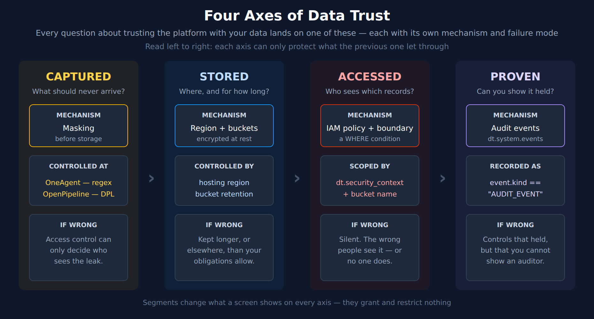
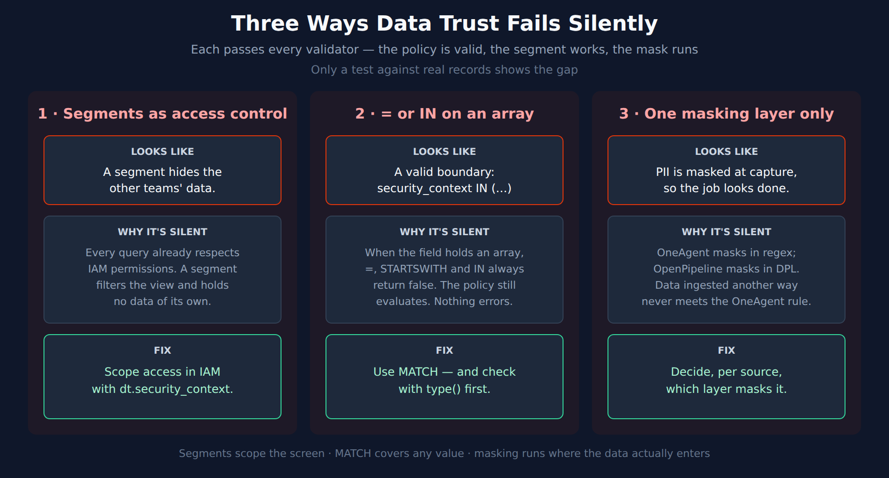

# FAQ-24: Can We Trust Dynatrace With Our Data?

> **Series:** FAQ — Frequently Asked Questions | **Reference:** 24 — Trusting the Platform With Your Data | **Created:** September 2026 | **Last Updated:** 09/10/2026

## Overview

This FAQ is decision support for the question: **how do we know our observability data is handled the way our obligations require — what gets collected, where it is kept, who can see it, and how we prove it?**

It is the platform counterpart to **FAQ-06: Can We Trust Davis AI?**, which answers the same question for the AI features. This entry covers the data itself.

The question usually arrives as one worry — "is our data safe in Dynatrace?" — but it is four separate questions, each answered by a different control in a different place on the platform. Most designs that go wrong ask one control to do another's job: access rules standing in for masking, or segments standing in for access rules.

### The four axes

| Axis | Question it answers | Mechanism | Failure mode if wrong |
|---|---|---|---|
| **Captured** | What should never arrive? | Masking at capture (OneAgent) or at ingest (OpenPipeline) | Access control can only decide who sees the leak |
| **Stored** | Where does it live, and for how long? | Hosting region, encryption, bucket retention | Kept longer, or elsewhere, than your obligations allow |
| **Accessed** | Who can see which records? | IAM policies and boundaries on `dt.security_context` | Silent — the wrong people see it, or no one does |
| **Proven** | Can you show the controls held? | Audit logs and audit events | Controls that held, but that you cannot demonstrate |

This entry routes rather than restates. The mechanics live in the ORGNZ, IAM, OPLOGS and OPMIG series, and are better there; what this entry adds is the map between them and the three failures that sit in the gaps.

---

## Table of Contents

1. [Short Answer](#short-answer)
2. [The Four Axes of Data Trust](#the-four-axes-of-data-trust)
3. [Where Each Element Is Documented](#where-each-element-is-documented)
4. [Captured — Mask Before You Restrict](#captured)
5. [Stored — Region, Encryption, Retention](#stored)
6. [Accessed — Buckets, Security Context, Boundaries](#accessed)
7. [Proven — Audit and Governance](#proven)
8. [Three Ways This Goes Wrong](#three-ways-this-goes-wrong)
9. [Recommended Approach](#recommended-approach)
10. [Summary and Next Steps](#summary-and-next-steps)

---

<a id="prerequisites"></a>
## Prerequisites

| Requirement | Details |
|-------------|---------|
| **Applies to** | Any Dynatrace SaaS environment on Grail |
| **Audience** | Platform owners, security and compliance reviewers, and anyone answering a customer's or an auditor's "can we trust it" questionnaire |
| **Format** | Decision support and routing — the mechanics live in the topic series listed below |
| **Permissions** | `storage:logs:read` for the checks in section 6; Account Management access to read audit logs in section 7 |
| **Related topic series** | ORGNZ (buckets, security context, permissions, segments) · IAM (governance, policies, boundaries, audit) · OPLOGS / OPMIG (masking and processing) · MZ2POL (migrating from management zones) · MOBL / WEBRUM (end-user privacy) |
| **Related FAQs** | **FAQ-06** (can we trust Davis AI) · **FAQ-15** (how DPL works — the pattern language OpenPipeline masking uses) · **FAQ-21** (the right alerts to the right people — the same access model, seen from the alerting side) |

> **Validation status.** The three DQL queries in [section 6](#accessed) were executed against a live Dynatrace tenant on 09/10/2026, and every quotation in this entry was checked against the page it cites on the same date.

<a id="short-answer"></a>
## 1. Short Answer

**Trust is four separate controls, and each one only protects what the one before it let through.**

- **Captured — mask before you restrict.** Mask sensitive data at capture with OneAgent where you can, so the clear-text value never leaves your environment. Mask at ingest in OpenPipeline for data that never passes through OneAgent. Access control applied to data that should never have arrived only decides who sees the leak.
- **Stored — residency is an environment decision.** Dynatrace SaaS stores data in AWS, Azure or Google Cloud data centers, encrypted at rest and in transit, with backups kept in the same region, and deletes it when its retention period ends.
- **Accessed — scope on `dt.security_context`.** Use buckets to separate storage, retention and cost; use `dt.security_context` for who sees which records. Check two things first: how many records carry a security context at all, and whether it ever holds more than one value — on an array, `=` and `IN` conditions match nothing.
- **Proven — audit is where you show it.** Account-level IAM changes are audited and kept for up to ten years; activity inside the environment is recorded as audit events in `dt.system.events`.
- **Segments restrict nothing.** They change what a screen shows. Every query already runs inside the IAM permissions of the person running it.

<a id="the-four-axes-of-data-trust"></a>
## 2. The Four Axes of Data Trust



<!-- MARKDOWN_TABLE_ALTERNATIVE
| Axis | Mechanism | Controlled by | Failure mode |
|------|-----------|---------------|--------------|
| Captured | Masking before storage | OneAgent (regular expressions), OpenPipeline (DPL) | Access control can only decide who sees the leak |
| Stored | Region and buckets, encrypted at rest | Hosting region, bucket retention | Kept longer, or elsewhere, than obligations allow |
| Accessed | IAM policy and boundary | dt.security_context, bucket name | Silent: the wrong people see it, or no one does |
| Proven | Audit events | event.kind == "AUDIT_EVENT" in dt.system.events | Controls that held, but cannot be demonstrated |
For environments where SVG doesn't render
-->

Read the axes left to right as a dependency chain rather than a menu. Each one can only protect what the previous one let through:

- **Captured before Stored.** Whatever arrives is stored. Retention and region decide how long and where — not whether it should be there at all.
- **Stored before Accessed.** Access control governs data that exists. It cannot remove a card number from a log line; it can only choose who may read the line.
- **Accessed before Proven.** An audit trail records what the controls did. It cannot make a missing control exist after the fact.

The pair most often conflated is **Captured** and **Accessed**, because both sound like "protecting sensitive data":

| | Captured | Accessed |
|---|---|---|
| Question | Should this ever be stored? | Who may read what is stored? |
| Mechanism | Masking rule | IAM policy and boundary |
| Acts on | The value inside a record | Whole records |
| Fails as | A sensitive value stored in clear text | The right record, read by the wrong person |
| Takes effect | On data captured or ingested after the rule exists | On the next query |

> <sub>**Derived:** the dependency-chain reading and the Captured-versus-Accessed contrast combine the masking methods in section 4 with the permission model in section 6.</sub>

<a id="where-each-element-is-documented"></a>
## 3. Where Each Element Is Documented

This entry is a decision layer. The mechanics live in the topic series, and are better there:

| Element | Read this first | Also see |
|---|---|---|
| Masking at capture (OneAgent) | OPLOGS-08 | FAQ-15 (pattern languages) |
| Masking at ingest (OpenPipeline) | OPMIG-08 | OPLOGS-03 (processing) |
| End-user privacy in RUM and Session Replay | MOBL-09 | WEBRUM-07 |
| Buckets and retention | ORGNZ-02, ORGNZ-03 | ORGNZ-05 (bucket-level access) |
| The Grail permission model | ORGNZ-04 | ORGNZ-07 (combining mechanisms) |
| Security context | ORGNZ-06 | IAM-05 (boundary design) |
| Policy authoring and boundaries | IAM-04, IAM-05 | IAM-10 (templated policies) |
| Governance model and ownership | IAM-01 | IAM-03 (groups), IAM-06 (user lifecycle) |
| Audit and compliance reporting | IAM-07 | IAM-09 (troubleshooting access) |
| Segments — what they scope and what they do not | ORGNZ-08 | ORGNZ-10 |
| Migrating from management zones | MZ2POL-02, MZ2POL-04 | MZ2POL-05 (segments) |
| Trusting the AI features | FAQ-06 | — |

If the question in front of you sits in one row, go to that series. Come back here when it spans several.

<a id="captured"></a>
## 4. Captured — Mask Before You Restrict

Dynatrace offers two places to mask, and the difference between them is a trust decision rather than a technical preference. From the masking methods page:

- **Masking at capture** — *"This approach allows masking sensitive data in your environment, hosts, or processes before it's transferred to the Dynatrace SaaS environment."*
- **Masking at ingest** — *"This approach allows masking sensitive data once it arrives in the Dynatrace SaaS environment, and before it's stored in Grail."* Its advantage, in the same page's words: *"The key advantage of this method is that it works across log ingest channels."*

The trade-off is stated plainly on the OneAgent masking page: *"if you choose to mask your data during Log processing, your data will leave your environment as log processing occurs on the Dynatrace side."* Capture-time masking keeps the clear-text value inside your infrastructure. Ingest-time masking reaches data OneAgent never touched.

That second point is the one that catches teams out. A OneAgent rule applies only to what OneAgent captures: *"If you import your data to Dynatrace via generic ingest, you need to mask the sensitive data on the source level, before ingestion."* Logs arriving over the API, from an OpenTelemetry Collector, or through a log shipper never meet the OneAgent rule. For those, the choice is between masking at the source and masking in OpenPipeline.

**The two layers use different pattern languages.** A OneAgent rule's search expression is *"A regular expression to match the string that you want to mask."* OpenPipeline masking runs in the processing stage — the stage where, per the OpenPipeline docs, *"Fields are edited, and sensitive data is masked."* Its pattern functions take DPL, not regular expressions. A rule written once is therefore not a rule applied everywhere; **FAQ-15** covers the translation, including the places where regular-expression habits give the wrong answer in DPL.

| | Without a masking plan | With one | Impact |
|---|---|---|---|
| Where clear text exists | Wherever the data first lands | Only inside your environment, for captured data | Fewer places to defend |
| Non-OneAgent channels | Masked by nothing | Masked at the source or in OpenPipeline | Closes the silent gap |
| Rule maintenance | One rule assumed to cover everything | One rule per layer, in that layer's language | Coverage you can actually state |

> <sub>**Sources:** [Methods of masking sensitive data (DT docs)](https://docs.dynatrace.com/docs/analyze-explore-automate/logs/lma-use-cases/methods-of-masking-sensitive-data), [Sensitive data masking in OneAgent (DT docs)](https://docs.dynatrace.com/docs/analyze-explore-automate/logs/lma-log-ingestion/lma-log-ingestion-via-oa/lma-sensitive-data-masking), [Processing in OpenPipeline (DT docs)](https://docs.dynatrace.com/docs/platform/openpipeline/concepts/processing). **Derived:** that OpenPipeline's pattern functions take DPL rather than regular expressions rests on FAQ-15's reading of those functions.</sub>

<a id="stored"></a>
## 5. Stored — Region, Encryption, Retention

**Where it lives.** *"Data is stored in Amazon Web Services (AWS), Microsoft Azure, or Google Cloud data centers."* The region belongs to the environment, so residency is decided when the environment is provisioned — it is not a setting you change on data that already exists. If you carry residency obligations, they are an input to environment design, alongside the account and tenant layout in **IAM-01**.

**How it is protected.** Encryption covers both states:

- At rest: *"All Dynatrace SaaS monitoring data is encrypted at rest using AES-256."*
- In transit: *"All data exchanged between OneAgent, ActiveGate, and Dynatrace Cluster is encrypted in transit."*

Backups stay in the region. For AWS: *"Every 24 hours, Dynatrace SaaS on AWS performs data backups to a different AWS account in the same AWS region."* That is the AWS wording — check the page for the provider your environment runs on. As of 09/10/2026 the page makes no broader statement about data leaving a region; if your obligations turn on that question, take it to Dynatrace directly rather than inferring an answer.

**What it keeps, and for how long.** Dynatrace *"retains only the data that you elect to share and stores it in your Dynatrace Cluster"* and *"automatically deletes data that is older than the configured retention periods."* Retention is configured on Grail buckets, which makes bucket design the retention design — **ORGNZ-02** and **ORGNZ-03** cover it, including when a separate bucket is the right answer for a compliance-driven retention period.

**Dynatrace's own certifications** are published in its Trust Center: *"Learn more about the certifications and compliance frameworks Dynatrace supports in our Trust Portal"* — the list includes SOC 2 Type II and ISO 27001:2022. Those describe Dynatrace as a vendor. They do not make your configuration compliant; the other three axes do that.

> <sub>**Sources:**</sub>
> - <sub>[Data security controls (DT docs)](https://docs.dynatrace.com/docs/manage/data-privacy-and-security/data-security/data-security-controls)</sub>
> - <sub>[Data protection at Dynatrace (DT docs)](https://docs.dynatrace.com/docs/manage/data-privacy-and-security/data-privacy/data-protection)</sub>
> - <sub>[Trust Center (Dynatrace)](https://www.dynatrace.com/company/trust-center/)</sub>
> - <sub>[Data privacy and security (DT docs)](https://docs.dynatrace.com/docs/manage/data-privacy-and-security)</sub>
> - <sub>**Derived:** that residency is decided at provisioning follows from data being stored in the environment's cloud region, with backups kept in the same region</sub>

<a id="accessed"></a>
## 6. Accessed — Buckets, Security Context, Boundaries

**Two mechanisms, two jobs.** Buckets separate storage — retention, cost, and hard compliance boundaries. `dt.security_context` scopes access to individual records, and is the field IAM policies and boundaries filter on. Default to security context for general access control, and reach for a separate bucket only when the storage itself must be separate; **ORGNZ-05** sets out when that is the case.

**Setting it.** In OpenPipeline, *"The value of this attribute can be a literal value, for example `TeamA`, or a value copied from another field present on the record."* OneAgent, Kubernetes metadata enrichment and host tags can set it at the source instead — **ORGNZ-06** walks through each path.

**Writing the condition.** A policy scopes on it in a `WHERE` clause or a boundary:

```text
ALLOW storage:logs:read WHERE storage:dt.security_context = "TeamA";
```

The operators available for `storage:dt.security_context` are `=`, `IN`, `startsWith` and `MATCH`. The syntax reference is explicit that operator support varies: *"Not every operator applies to every service attribute."* Check the policy reference for the attribute you are scoping before assuming an operator works.

### Two checks before you write the first policy

**1. How many records carry a security context at all?** A record without the field cannot be matched by a condition on it. It stays visible to anyone whose access is not scoped by security context, and invisible to everyone whose access is. Measure the gap:

```dql
// Share of log records carrying a security context (last hour).
// Records without it cannot be matched by any security-context policy or boundary.
fetch logs, from:-1h
| summarize total = count(), with_sc = countIf(isNotNull(dt.security_context))
| fieldsAdd coverage_pct = round(100.0 * with_sc / total, decimals: 1)
```

On the validation tenant this returned **73.7%** — roughly a quarter of log records carried no security context, so no security-context policy could reach them. The fix is enrichment, not policy: **ORGNZ-06** covers setting the field at the source and in OpenPipeline.

**2. Does it ever hold more than one value?** This decides which operator you may use. From the Grail permissions reference: *"Using `=`, `STARTSWITH` or `IN` when the field holds an array will always return `false`."* And: *"If you expect your record filters might contain an array, use the `MATCH` operator in your IAM statements."* Nothing errors when you get this wrong — the policy is valid, it evaluates, and it matches nothing. Check before choosing:

```dql
// Does dt.security_context ever hold an array? Any "array" row means
// = and IN conditions silently miss those records — use MATCH instead.
fetch logs, from:-1h
| filter isNotNull(dt.security_context)
| fieldsAdd sc_type = type(dt.security_context)
| summarize records = count(), by:{sc_type}
```

On the validation tenant every value was a `string` — about half a million log records in an hour, and a similar number of spans over two hours — so `=` and `IN` were safe there. That is a property of that tenant's enrichment, not of the platform: an enrichment rule that copies an array-valued field into `dt.security_context` changes the answer for every record it touches.

A zero-array result is only worth trusting if the check can see an array at all. This costs nothing to run, and proves it can:

```dql
// Positive control: prove type() reports "array" before trusting a zero-array result.
// Scans no data.
data record(sc = array("team-a", "team-b")), record(sc = "team-a")
| fieldsAdd sc_type = type(sc)
| fields sc, sc_type
```

It returns `array` for the first record and `string` for the second. If it ever returns `string` for both, the type check above is telling you nothing.

**Dynatrace's own pages disagree on this point.** The security-context use-case page says the field *"Can be a multi-value field and `startsWith` will evaluate for any matching value"* — which contradicts the Grail permissions reference quoted above. This entry follows the stricter statement: when in doubt, use `MATCH`, which is correct under either reading.

**Entity permissions do not cascade to data.** This is the assumption that follows people out of management zones. Verbatim: *"Unlike management zones, an IAM policy that is set up to filter entities (allow `storage:entities:read`) will not filter related metrics, logs, or traces."* Scoping which hosts a team can see does not scope those hosts' logs — each data type needs its own permission. **MZ2POL-02** covers the model change in full.

> <sub>**Sources:**</sub>
> - <sub>[Permissions in Grail (DT docs)](https://docs.dynatrace.com/docs/platform/grail/organize-data/assign-permissions-in-grail)</sub>
> - <sub>[Configure advanced permissions with security context (DT docs)](https://docs.dynatrace.com/docs/platform/grail/organize-data/advanced-permission-setup)</sub>
> - <sub>[IAM policy statement syntax and examples (DT docs)](https://docs.dynatrace.com/docs/manage/identity-access-management/permission-management/manage-user-permissions-policies/iam-policystatement-syntax)</sub>
> - <sub>[IAM policy reference (DT docs)](https://docs.dynatrace.com/docs/manage/identity-access-management/permission-management/manage-user-permissions-policies/advanced/iam-policystatements)</sub>
> - <sub>[Grant access to entities with security context (DT docs)](https://docs.dynatrace.com/docs/manage/identity-access-management/use-cases/access-security-context)</sub>
> - <sub>**Derived:** that a record without a security context is invisible to security-context-scoped access and visible to unscoped access follows from a condition on an absent field never matching</sub>

<a id="proven"></a>
## 7. Proven — Audit and Governance

Controls that held are only half of trust. The other half is being able to show it.

**Changes to access are audited at the account level.** *"Dynatrace provides audit logs of all changes to your account-level identity and access (IAM) management settings"* — group permissions and memberships, policies and boundaries among them — and *"Audit log data is stored for up to 10 years (3650 days)."* That answers the question an auditor usually asks first: who changed who can see what, and when.

**Activity inside the environment is a separate record.** Platform audit events live in `dt.system.events` with `event.kind == "AUDIT_EVENT"` — not in `logs`, so an audit query against `logs` finds nothing. **IAM-07** has the queries, and the SOC 2, SOX and HIPAA report patterns built on them; **IAM-09** covers turning a failed-access record into a diagnosis.

**Governance is who owns each control.** An audit trail shows what happened; it does not say whose job it was to prevent it. **IAM-01** sets out the governance model — centralized or federated ownership, and who administers which layer — and **IAM-06** covers the user lifecycle, where most access drift starts.

> <sub>**Sources:** [Account Management audit logs (DT docs)](https://docs.dynatrace.com/docs/manage/account-management/audit-logs). **Derived:** the split between account-level audit logs and environment audit events combines this page with the `dt.system.events` audit records documented in IAM-07.</sub>

<a id="three-ways-this-goes-wrong"></a>
## 8. Three Ways This Goes Wrong



<!-- MARKDOWN_TABLE_ALTERNATIVE
| Failure | Looks like | Why it is silent | Fix |
|---------|------------|------------------|-----|
| Segments as access control | A segment hides other teams' data | Every query already respects IAM permissions; a segment filters the view and holds no data of its own | Scope access in IAM on dt.security_context |
| = or IN on an array | A valid boundary using security_context IN (...) | On an array field, =, STARTSWITH and IN always return false; nothing errors | Use MATCH, and check with type() first |
| One masking layer only | PII masked at capture, so the job looks done | OneAgent masks with regular expressions and OpenPipeline with DPL; data ingested another way never meets the OneAgent rule | Decide, per source, which layer masks it |
For environments where SVG doesn't render
-->

All three pass every validator. The policy is valid, the segment works, the mask runs. Only a test against real records shows the gap.

**1. Segments used as access control.** A segment that shows a team only its own services looks like a permission. It is not one. From the segments documentation: *"All queries, with or without segments, always respect data access permissions enforced by IAM policies."* A segment narrows a view inside the access a person already has; it grants nothing and restricts nothing. Even a segment's own visibility setting is not a control: *"Regardless of configured visibility, any segment can be accessed with storage:filter-segments:read permission."* Scope access in IAM, on `dt.security_context` — **ORGNZ-08** covers what segments are for.

**2. `=` or `IN` on an array-valued security context.** The boundary is valid and the policy evaluates — but, per the Grail permissions reference, *"Using `=`, `STARTSWITH` or `IN` when the field holds an array will always return `false`."* The result is a team that cannot see its own data, with no error anywhere to say why. Run the type check in section 6, and use `MATCH` wherever an array is possible.

**3. One masking layer treated as complete.** A OneAgent masking rule covers what OneAgent captures, and nothing else: *"If you import your data to Dynatrace via generic ingest, you need to mask the sensitive data on the source level, before ingestion."* Data from the API, an OpenTelemetry Collector or a log shipper reaches Grail without meeting that rule. Inventory your ingest channels, and decide for each one which layer masks it.

> <sub>**Sources:** [Visibility of segments (DT docs)](https://docs.dynatrace.com/docs/manage/segments/concepts/segments-concepts-visibility), [Permissions in Grail (DT docs)](https://docs.dynatrace.com/docs/platform/grail/organize-data/assign-permissions-in-grail), [Sensitive data masking in OneAgent (DT docs)](https://docs.dynatrace.com/docs/analyze-explore-automate/logs/lma-log-ingestion/lma-log-ingestion-via-oa/lma-sensitive-data-masking).</sub>

<a id="recommended-approach"></a>
## 9. Recommended Approach

Work the axes in order. Each step assumes the one before it is done.

1. **Decide what should never arrive.** List the sensitive values in your data — card numbers, credentials, personal data — before any access design. Mask at capture wherever OneAgent collects the data, so clear text never leaves your environment.
2. **Inventory your ingest channels.** For every channel OneAgent does not collect — API, OpenTelemetry, log shippers — decide whether to mask at the source or in OpenPipeline, and write that rule in that layer's language.
3. **Settle residency before you provision.** The region belongs to the environment. If residency is an obligation, it is an input to environment design, not a later setting.
4. **Design buckets for storage, not for access.** Use separate buckets for retention, cost, and hard compliance boundaries. Default to `dt.security_context` for who sees what.
5. **Measure security-context coverage.** Run the coverage check in section 6. Every record without the field sits outside every security-context policy — fix it with enrichment.
6. **Check for arrays, then choose the operator.** If `dt.security_context` can ever hold more than one value, use `MATCH`. If you are unsure, use `MATCH` anyway.
7. **Scope entities and data separately.** An entity permission does not scope that entity's logs, metrics or traces.
8. **Keep segments out of the access design.** Use them to narrow views, never to restrict them.
9. **Prove it.** Review the account audit log for access changes and `AUDIT_EVENT` records for activity, and give each control a named owner.

> <sub>**Derived:** the ordering follows the dependency chain in section 2; each step is sourced in the section it summarizes.</sub>

<a id="summary-and-next-steps"></a>
## 10. Summary and Next Steps

"Can we trust Dynatrace with our data?" is four questions: what arrives, where it lives, who sees it, and whether you can prove it. Each has its own control, and each only protects what the one before it let through. The failures that matter are the silent ones — segments standing in for access control, a condition that matches nothing on an array, and a masking rule that never meets the data it was written for.

**Next steps:**

- **ORGNZ-06** — set up `dt.security_context`, then run the two checks in section 6 against your own tenant.
- **IAM-05** — design boundaries on it, using `MATCH` wherever an array is possible.
- **OPLOGS-08** and **OPMIG-08** — build the masking plan for each ingest channel.
- **IAM-07** — put the audit queries on a schedule.
- **FAQ-06** — the same questions, asked of the AI features.

---

<sub>*This notebook was AI-generated from community-submitted and publicly available sources. This notebook series is not officially supported by Dynatrace. Always verify information against official Dynatrace documentation.*</sub>
