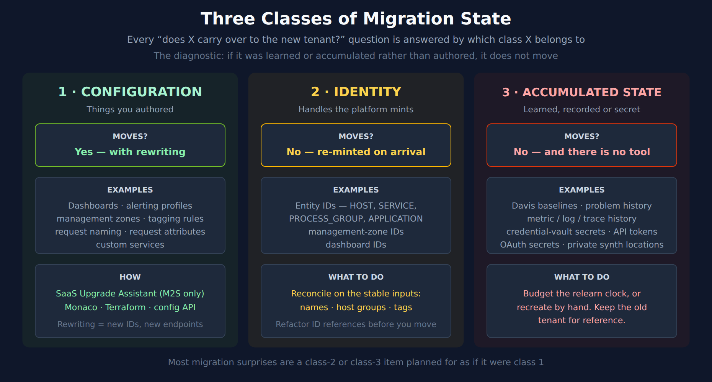
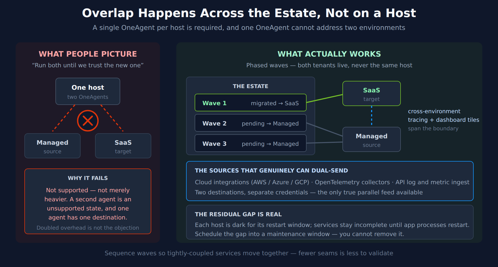

# FAQ-25: What Actually Carries Over When We Migrate to a New Tenant?

> **Series:** FAQ — Frequently Asked Questions | **Reference:** 25 — What Carries Over to a New Tenant | **Created:** September 2026 | **Last Updated:** 09/24/2026

## Overview

This FAQ is decision support for the question every migration team asks in a dozen different shapes: **does *this* survive the move to the new tenant?**

It arrives as "do our entity IDs stay the same?", "can we reuse the baselines?", "can we send to both tenants while we prove the new one?" — and those look like three unrelated questions. They are not. Each is answered the same way, by sorting the thing in question into one of three classes.

### The three classes

| Class | Moves? | Mechanism | Examples |
|---|---|---|---|
| **1 · Configuration** — things you authored | Yes, with rewriting | SaaS Upgrade Assistant, Monaco, Terraform, configuration API | Dashboards, alerting profiles, management zones, tagging rules, request naming, request attributes, custom services |
| **2 · Identity** — handles the platform mints | No — re-minted on arrival | Reconcile on the inputs you control | Entity IDs, management-zone IDs, dashboard IDs |
| **3 · Accumulated state** — learned, recorded or secret | No, and there is no tool | Relearn on a clock, or recreate by hand | Davis baselines, problem history, metric/log/trace history, credential-vault secrets, API tokens |

**The diagnostic, in one line: if it was *learned or accumulated* rather than *authored*, it does not move.**

Nearly every migration surprise is a class-2 or class-3 item that was planned for as though it were class 1 — a dashboard that migrated fine but shows "No data", an alerting profile that came across but never fires, a cutover plan that assumed both tenants could receive the same host.

This entry applies to **any** move to a new tenant — Managed → SaaS, SaaS → SaaS, or tenant consolidation. The classes are identical across all three; only the class-1 tooling differs, and that difference is called out where it matters.

It routes rather than restates. The step-by-step procedures live in the **M2S** and **S2S** series and are better there; what this entry adds is the sorting rule, and the three places the sorting is most often got wrong.

---

## Table of Contents

1. [Short Answer](#short-answer)
2. [Three Classes of Migration State](#three-classes)
3. [Class 1 — Configuration: What Moves, and What Rewrites It](#configuration)
4. [Class 2 — Identity: Everything Gets a New ID](#identity)
5. [Class 3 — Accumulated State: The Relearn Clock](#accumulated-state)
6. [The Dual-Run Question](#the-dual-run-question)
7. [Before You Migrate: The Prep That Pays](#before-you-migrate)
8. [Summary and Next Steps](#summary-and-next-steps)

---

<a id="prerequisites"></a>
## Prerequisites

| Requirement | Details |
|-------------|---------|
| **Applies to** | Any move to a new Dynatrace tenant — Managed → SaaS, SaaS → SaaS, or tenant consolidation |
| **Audience** | Migration leads and platform owners scoping a cutover; anyone answering "does X carry over?" for a customer or an internal stakeholder |
| **Format** | Decision support and routing — the step-by-step procedures live in the M2S and S2S series |
| **Permissions** | The queries in sections 4 and 5 need Grail read access on the target tenant; no configuration permissions are required to run them |
| **Related topic series** | **M2S** (Managed → SaaS, nine steps) · **S2S** (SaaS → SaaS) · **AUTOM** (Monaco, Terraform, config-as-code) · **AIOPS** (how Davis detection learns) · **ORGNZ** / **IAM** (what the target tenant needs before anything arrives) |
| **Related FAQs** | **FAQ-16** (classic entity selectors → Smartscape — the vocabulary behind section 4) · **FAQ-17** (planning a migration cutover — the sequencing this entry feeds) · **FAQ-12** (coverage gaps from partial enablement) |

> **Validation status.** All four DQL queries were executed against a live Dynatrace tenant on 09/21/2026, and every quotation was checked against the page it cites on the same date. Section 4's `id_classic` finding was reproduced on two node types.

<a id="short-answer"></a>
## 1. Short Answer

**Configuration moves. Identity is re-minted. Accumulated state is gone.**

Put concretely, for the three questions that generate the most confusion:

| Question | Answer |
|---|---|
| **Do entity IDs stay the same?** | No. Plan for every classic `HOST-…`, `SERVICE-…`, `PROCESS_GROUP-…` and `APPLICATION-…` id to change. The SaaS Upgrade Assistant exists partly to rewrite them for you, and its own description says so. |
| **Can we reuse the Managed baselines?** | No. Davis relearns from zero in the new tenant. Budget the relearn window and do not switch alerting off while it runs. |
| **Can we send to both tenants at once?** | Not from a host. One OneAgent per host, one destination per OneAgent. The overlap you build is across the estate — phased waves — not on a single machine. |

The single highest-leverage thing you can do before a migration is **make your configuration stop depending on class-2 data**: replace hardcoded entity IDs in dashboards, SLOs, alert filters and workflows with tags, names or host groups. Configuration that refers to entities by a property you control migrates cleanly. Configuration that refers to them by an ID the platform minted does not, and there is no tool that can fully fix that for you.

> <sub>**Sources:** [SaaS Upgrade Assistant (DT docs)](https://docs.dynatrace.com/managed/upgrade/saas-upgrade-assistant) — *"Automation eliminates time-consuming manual tasks, such as updating dashboard ownership or adjusting entity IDs that have changed between environments."*, [Dynatrace OneAgent (DT docs)](https://docs.dynatrace.com/docs/ingest-from/dynatrace-oneagent) — *"A single OneAgent per host is required to collect all relevant monitoring data—even if your hosts are deployed within Docker containers, microservices architectures, or cloud-based infrastructure."*</sub>

<a id="three-classes"></a>
## 2. Three Classes of Migration State



<!-- MARKDOWN_TABLE_ALTERNATIVE
| Class | Moves? | Examples | What to do |
|-------|--------|----------|------------|
| 1 - Configuration (things you authored) | Yes, with rewriting | Dashboards, alerting profiles, management zones, tagging rules, request naming, request attributes, custom services | SaaS Upgrade Assistant (M2S only), Monaco, Terraform, config API. Rewriting means new IDs and new endpoints. |
| 2 - Identity (handles the platform mints) | No - re-minted on arrival | Entity IDs (HOST, SERVICE, PROCESS_GROUP, APPLICATION), management-zone IDs, dashboard IDs | Reconcile on the stable inputs: names, host groups, tags. Refactor ID references before you move. |
| 3 - Accumulated state (learned, recorded or secret) | No, and there is no tool | Davis baselines, problem history, metric/log/trace history, credential-vault secrets, API tokens, OAuth secrets, private synthetic locations | Budget the relearn clock or recreate by hand. Keep the old tenant for reference. |
For environments where SVG doesn't render
-->

The classes are worth internalizing because they **predict the failure mode**, not just the answer.

- A **class-1** item that goes wrong fails *loudly*. The Upgrade Assistant reports the row as failed, Monaco errors, the API returns 400. You get a list and you work through it.
- A **class-2** item that goes wrong fails *silently*. The dashboard migrates, the tile renders, and it shows "No data" — because the entity selector points at an ID that exists only in the tenant you left. Nothing errors; the panel is simply empty, which looks exactly like a quiet night.
- A **class-3** item that goes wrong fails *on a delay*. Alerting is migrated and enabled, and for the first week it is either silent or deafening, because Davis has no history to judge against yet. The instinct is to conclude the detection config is wrong and start tuning it, which bakes the relearn period's noise into your thresholds permanently.

That progression — loud, silent, delayed — is why teams reliably under-plan classes 2 and 3. Class 1 announces its own problems. The other two do not.

<a id="configuration"></a>
## 3. Class 1 — Configuration: What Moves, and What Rewrites It

Configuration is the easy class, with one caveat: "moves" always means "moves **and is rewritten**." Endpoints change, IDs change, and ownership changes. Nothing is a byte-for-byte copy.

### Which tool does the rewriting

| Tool | Available for | Strength | Limit worth knowing |
|---|---|---|---|
| **SaaS Upgrade Assistant** | Managed → SaaS only | Purpose-built; rewrites entity IDs and dashboard ownership for you; per-row deploy results you can archive | Cannot resolve **name conflicts** — consolidating tenants with identically-named configurations needs Monaco instead |
| **Monaco** | Any tenant pair | Handles consolidation and name conflicts; config-as-code | Does not cover Extensions 2.0 |
| **Terraform** | Any tenant pair | Versioned, reviewable, good for the long term | Does not cover Extensions 2.0 |
| **Configuration / Settings API** | Any tenant pair | Total control; the fallback when nothing else covers a type | You own the export/transform/import loop and the error handling |

The Assistant is the default for a Managed → SaaS move. If you are consolidating several Managed tenants into one SaaS tenant, that is the case it cannot handle, and reaching for Monaco *after* the Assistant has produced a pile of name-conflict failures is a worse day than choosing it up front.

### Migrate once, not twice

A Managed → SaaS move is a host-and-path rewrite of every API call. A later upgrade to the latest Dynatrace is a *second* rewrite, and the two are easy to conflate. Endpoints under `/platform/` and the **ingest** paths (`/api/v2/logs/ingest`, `/metrics/ingest`, `/events/ingest`, `/api/v2/otlp`, `/api/bizevents/ingest`) carry forward; most of `/api/config/v1` does not.

The narrow `/api/config/v1` survivors are worth knowing precisely because they sit next to endpoints that do not survive, and the pairs look alike:

| Endpoint | Survives the Gen3 upgrade? |
|---|---|
| `/service/requestNaming` | Yes |
| `/service/requestAttributes` | Yes |
| `/service/customServices` | Yes |
| `/service/conditionalNaming/*` | **No** |
| `/calculatedMetrics/service` | **No** |
| `/calculatedMetrics/mobile` | Yes |

If you are rewriting a script anyway, point it at its Gen3 equivalent in the same pass. **M2S-06** carries the full repointing table, and **AUTOM-02** catalogs the replacements.

### A worked example: per-service request naming

Request naming is a common "how do we move this?" question, and it is a clean class-1 case. The [Request naming API](https://docs.dynatrace.com/docs/dynatrace-api/configuration-api/service-api/request-naming-api) is `/api/config/v1/service/requestNaming`, it survives the Gen3 upgrade, and the export/import loop is:

```bash
# 1. List rule IDs on the source tenant
curl -s -H "Authorization: Api-Token $SRC_TOKEN" \
  "$SRC_URL/api/config/v1/service/requestNaming"

# 2. Fetch each rule's full definition by id
curl -s -H "Authorization: Api-Token $SRC_TOKEN" \
  "$SRC_URL/api/config/v1/service/requestNaming/$RULE_ID"

# 3. Strip the id, then POST the body to the target tenant
curl -s -X POST -H "Authorization: Api-Token $DST_TOKEN" \
  -H "Content-Type: application/json" \
  --data @rule-without-id.json \
  "$DST_URL/api/config/v1/service/requestNaming"
```

Two things to check before running it at scale. Rules whose conditions reference **entity IDs or management zones** are class-1 configuration carrying a class-2 payload — those conditions need remapping (section 4). And rule **order matters**, because naming rules are evaluated in sequence; re-creating them in list order preserves it, re-creating them in parallel does not.

For anything beyond a one-off, prefer config-as-code over a bespoke script: the Terraform provider's [`dynatrace_request_naming`](https://registry.terraform.io/providers/dynatrace-oss/dynatrace/latest/docs/resources/request_naming) resource maps to this same endpoint, with [`dynatrace_request_namings`](https://registry.terraform.io/providers/dynatrace-oss/dynatrace/latest/docs/resources/request_namings) for ordering. Same effort, and the result is versioned rather than a migration-day artifact nobody can reproduce.

> <sub>**Sources:** [Request naming API (DT docs)](https://docs.dynatrace.com/docs/dynatrace-api/configuration-api/service-api/request-naming-api), [SaaS Upgrade Assistant (DT docs)](https://docs.dynatrace.com/managed/upgrade/saas-upgrade-assistant) — *"imports your Dynatrace Managed environment configuration"*, [dynatrace_request_naming (Terraform Registry)](https://registry.terraform.io/providers/dynatrace-oss/dynatrace/latest/docs/resources/request_naming). **Derived:** the survives/does-not-survive table condenses M2S-06's repointing analysis; the rule-ordering caveat follows from naming rules being sequentially evaluated.</sub>

<a id="identity"></a>
## 4. Class 2 — Identity: Everything Gets a New ID

Entity IDs are **environment-scoped**. The new tenant discovers your estate from scratch and mints its own identifiers for everything it finds. There is no setting that changes this and no tool that preserves them — the SaaS Upgrade Assistant's pitch is that it *rewrites* them on your behalf, which is the clearest statement available that they change.

You may hear that some IDs are deterministic hashes of detection inputs, and that a given host therefore sometimes lands on the same id in both tenants. That is occasionally observed, the hashing is undocumented, and it is **not a guarantee**. Do not design a cutover around it.

### What you reconcile on instead

| Instead of | Reconcile on | Why it survives |
|---|---|---|
| `HOST-A1B2C3…` | Host name, host group, host tags | You set them; the agent carries them across with `oneagentctl` |
| `SERVICE-A1B2C3…` | Service name + the detection rules that produce it | Detection rules are class-1 configuration and migrate |
| `APPLICATION-A1B2C3…` | Application name and detection rules | Same |
| A management-zone id | The zone's *rules* (tag-based, not entity-based) | Tag-based rules migrate cleanly; entity-ID rules do not |

### The classic → Smartscape mapping, from the tenant rather than a table

If you are also moving from classic entity selectors to Smartscape while you migrate, the mapping does not need to be looked up in a document — the semantic dictionary publishes it, current for the tenant you run it on, at zero query cost:

```dql
// The complete classic-entity-type to Smartscape-node mapping, read from the
// semantic dictionary. This is the authoritative list for the tenant it runs
// on — it changes with the platform version, so prefer it over any static table.
// Scans no data and returns in milliseconds.
fetch dt.semantic_dictionary.models
| filter data_object == "smartscape.nodes"
| filter isNotNull(classic_models)
| expand classic_models
| fields classic_models, smartscape_node_type, name
| sort classic_models asc
```

On the validation tenant this returned **28 mappings across 23 distinct classic entity types** (09/21/2026). Three rows in that output do not behave like the rest, and each fails silently rather than loudly:

- **`dt.entity.application` and `dt.entity.mobile_application` both map to `FRONTEND`.** A translation that assumes one classic type per node type over-counts — migrate `dt.entity.application` without a `frontend.type == "web"` filter and you silently pick up the mobile apps too.
- **`dt.entity.cloud_application` fans out** to six Kubernetes workload types (`K8S_DEPLOYMENT`, `K8S_STATEFULSET`, `K8S_DAEMONSET`, `K8S_JOB`, `K8S_CRONJOB`, `K8S_REPLICASET`) rather than mapping to one. Check the target type before translating.
- **`dt.entity.custom_application` has no row at all.** There is no `CUSTOM_APPLICATION` node type; querying one returns nothing rather than erroring.

**FAQ-16** covers the full translation — constructs, topology navigation and the gotchas — and is the place to go if this is your main task rather than a side-effect of the migration.

> <sub>**Dictionary:** `dt.semantic_dictionary.models` filtered to `data_object == "smartscape.nodes"` with a non-null `classic_models` — 28 expanded rows over 23 distinct classic types, read 09/21/2026. **Sources:** [SaaS Upgrade Assistant (DT docs)](https://docs.dynatrace.com/managed/upgrade/saas-upgrade-assistant) — *"adjusting entity IDs that have changed between environments"*.</sub>

### The bridge field, and the comparison that silently returns false

Every Smartscape node carries **`id_classic`**, holding the classic `HOST-…` / `SERVICE-…` identifier. It is the natural thing to reconcile a migrated query against an unmigrated one — and the obvious way to use it does not work.

`id` and `id_classic` are **different types**: `id` is a `smartscape_id`, `id_classic` is a `string`. Comparing them with `==` is always `false`, even when the two values print identically side by side. Grail never raises an error — at most it attaches an **INFO-severity notification**, and on a later re-run not even that — so a query runs, returns a full set of rows, and quietly answers the opposite of the question:

```dql
// The id / id_classic comparison trap. Both columns print the SAME value,
// yet `naive` says "different" on every row: `id` is a smartscape_id and
// `id_classic` is a string, so `==` between them is always false.
// Grail never raises an error, and may not attach a notification either.
//
// `toString(id)` is the fix — compare like with like.
smartscapeNodes "HOST"
| fields name, id, id_classic
| fieldsAdd naive   = if(id == id_classic, then: "same", else: "different")
| fieldsAdd correct = if(toString(id) == id_classic, then: "same", else: "different")
| limit 5
```

On the validation tenant (09/21/2026) every row came back `naive = "different"` and `correct = "same"`, with the `id` and `id_classic` columns visibly identical — `HOST-0C9138C82CB5F432` in both. On that run Grail attached an INFO notification:

> *"The `==` operation will always return `false` as `id` is a smartscape id, while `id_classic` is a string."*

Reproduced on a second node type: `smartscapeNodes "SERVICE"` with `toString(id) == id_classic` matched on **23 of 23** services; the bare `==` matched **0 of 23**.

**Do not rely on that notification.** Re-run on 09/24/2026, the same queries gave the same wrong answer with **no notification at all** — the response's `notifications` array was empty, while a control query in the same session still carried its own INFO notification. When the notification appears it is a bonus, not the check: the only reliable guard is comparing like types, which is what `toString(id)` does.

**Why this one matters more than it looks.** Reconciliation is the entire mitigation for class 2 — it is how you prove the target tenant found everything the source tenant had. A reconciliation query built on `id == id_classic` reports that *nothing* matches, which reads exactly like a failed migration. The plausible response to that result is to go looking for a migration problem that does not exist. Worse, the inverse mistake is silent in the other direction: a `filter id == id_classic` used to *narrow* a result set returns zero rows, which reads as "nothing to fix."

The general rule this is an instance of: **in DQL, a comparison between two fields of different types is a false negative, not an error.** It belongs with the corpus's other silent-zero traps — an integer compared against a `duration`, or `==` against an array field.

> <sub>**Dictionary:** `id` is typed `smartscape_id` and `id_classic` is typed `string` on `dt.smartscape.host` and `dt.smartscape.service`; read from the query result's own type metadata, 09/21/2026. **Sources:** behaviour reproduced against a live Dynatrace tenant 09/21/2026 — HOST (7 of 7 nodes) and SERVICE (23 of 23), with the `EQUALITY_COMPARISON_OF_INCOMPATIBLE_TYPES` notification quoted verbatim from the query response. Re-run 09/24/2026: same result (HOST 0 of 5 with `==`, 5 of 5 with `toString`; SERVICE 0 of 22 / 22 of 22), with an empty `notifications` array.</sub>

### Can your estate even be reconciled by name?

Name-based reconciliation is the fallback when IDs change, so it is worth knowing *before* the cutover whether names are actually unique in your estate. Run this on the source tenant while you still have both:

```dql
// Reconciliation readiness. If names are not unique, "match the new tenant's
// hosts against the old tenant's by name" is ambiguous — and you will find out
// during the cutover rather than before it.
smartscapeNodes "HOST"
| summarize hosts = count(),
    with_host_group = countIf(isNotNull(dt.host_group.id)),
    distinct_names  = countDistinct(name)
| fieldsAdd name_collisions = hosts - distinct_names
| fieldsAdd reconcilable = if(name_collisions == 0,
    then: "names are unique - safe to reconcile on name",
    else: "duplicate names - reconcile on host group or tag")
```

On the validation tenant: **7 hosts, 6 with a host group, 7 distinct names** — no collisions, so name matching is safe there. In a real estate the collisions are the interesting number. Duplicate host names are common wherever machines are named from a template (`web-01` in three regions, identical pod names across clusters), and they mean the reconciliation key has to be `name` **plus** host group or a tag rather than `name` alone.

The `with_host_group` count is the second signal: hosts without a host group have one less stable attribute to match on, and host group is the single most useful one to have in place before a migration because `oneagentctl --set-host-group` carries it across the move with the agent.

Swap `"HOST"` for `"SERVICE"`, `"K8S_POD"` or any type from the mapping query above to check the rest of the estate.

> <sub>**Sources:** executed against a live Dynatrace tenant 09/21/2026 — 7 hosts, 6 with `dt.host_group.id`, 7 distinct names, 0 collisions. **Derived:** the "name plus host group or tag" recommendation follows from the collision count being the thing that invalidates a name-only key; no Dynatrace page prescribes a reconciliation key.</sub>

<a id="accumulated-state"></a>
## 5. Class 3 — Accumulated State: The Relearn Clock

Nothing in this class moves, and unlike class 2 there is no bridge field or reconciliation trick. There are only two responses: **wait for it to rebuild**, or **recreate it by hand**.

### Things that rebuild themselves, on a clock

Davis learns normal behaviour from the data it has seen. In a new tenant it has seen nothing, so detection is either silent or noisy until enough history accumulates.

| Baseline type | Roughly how long before it is trustworthy | Why |
|---|---|---|
| Availability | 2–3 days | Binary signal, fast to characterize |
| Response time | 1–2 weeks | Needs weekday/weekend separation |
| Error rate | 1–2 weeks | Needs a representative traffic pattern |
| Resource utilization / traffic | 2–4 weeks | Needs a full business cycle |

Two operational rules matter more than the exact numbers:

- **Do not disable alerting during the relearn window.** It is tempting — the volume is genuinely higher — but switching it off means you emerge from the window with no calibration data and the same unturned thresholds you started with. If the noise is unmanageable, route it somewhere quiet rather than turning it off, so you can measure it.
- **Do not tune during the relearn window either.** Thresholds set against a half-learned baseline get baked in. Give the detectors their window, *then* tune against what actually fired.

If you have alerting that cannot be silent on day one, port the **static** thresholds first and let the adaptive and seasonal detectors catch up behind them. **AIOPS-02** covers which detector type suits which metric.

### Checking the clock in the target tenant

You do not have to guess how far along the relearn is. Per-host history depth is directly queryable, and it is the honest answer to "are these baselines ready yet?":

```dql
// The baseline clock: how many days of history does each host actually have
// in this tenant? A host with a handful of days has no seasonal baseline yet,
// whatever the detector configuration says.
//
// Note interval:24h rather than 1d — calendar durations aren't supported here
// and are silently rewritten, which is noise you don't need in the result.
timeseries cpu = avg(dt.host.cpu.usage), from:-30d, interval:24h, by:{dt.entity.host}
| fieldsAdd days_in_window = arraySize(cpu)
| fieldsAdd days_with_data = arraySize(arrayRemoveNulls(cpu))
| fields dt.entity.host, days_in_window, days_with_data
| sort days_with_data asc
| limit 20
```

Sorted ascending, the top of this list is your answer: the hosts with the least history are the ones whose baselines are least trustworthy, and after a wave cutover they are exactly the hosts you just migrated. On the validation tenant the least-covered hosts showed **1, 2 and 4 days of data in a 31-day window** — no seasonal baseline is meaningful on that, regardless of what the detector is configured to do.

Run it after each wave. It converts "the baselines need a couple of weeks" from a rule of thumb into a per-host fact, and it tells you which teams can start trusting their alerts and which cannot yet.

### Things that do not rebuild, and must be recreated

These have no clock. They are simply absent in the new tenant until a human puts them there:

| Item | Why it cannot move | What to do |
|---|---|---|
| **Credential-vault secrets** | Secrets are not exportable from any tenant | Recreate each credential; inventory them *before* cutover |
| **API tokens** | Same | Create new tokens, update every consumer |
| **OAuth client secrets** | Same | Create new clients |
| **Cloud integration credentials** | Tenant-scoped keys | New integration credentials per tenant |
| **Private synthetic locations** | Bound to the source tenant's ActiveGates | Recreate against the target's ActiveGates |
| **Extensions 2.0** | Covered by neither Monaco nor Terraform | Reinstall from the Hub |
| **Metric / log / trace history** | Stored in the source tenant's Grail | Keep the source tenant readable during the overlap |
| **Problem history** | Same | Export the handful that matter as documentation |

The secrets row is the one that bites hardest on migration day, because it is invisible until something fails to authenticate. **Inventory every credential before the cutover, not during it** — a workflow that silently stops running because its vault entry does not exist in the new tenant looks like a workflow bug, not a migration gap.

> <sub>**Sources:** the history-depth query was executed against a live Dynatrace tenant 09/21/2026 (least-covered hosts: 1, 2 and 4 days within a 31-day window); the `interval:1d` → `24h` rewrite was observed in that query's own response notifications. **Derived:** the "Assistant migrates configuration, therefore accumulated state is out of scope" conclusion combines the SaaS Upgrade Assistant's documented scope (*"imports your Dynatrace Managed environment configuration"*) with the absence of any published export surface for Grail history or Davis models — Dynatrace does not publish an explicit out-of-scope list. **Softened:** the relearn durations are community and field guidance rather than documented figures — treat them as planning estimates and verify against your own data.</sub>

<a id="the-dual-run-question"></a>
## 6. The Dual-Run Question

This section restates rather than routes, because it is the one question where the intuitive answer is not merely incomplete — it is wrong, and acting on it produces an unsupported configuration.



<!-- MARKDOWN_TABLE_ALTERNATIVE
| | What people picture | What actually works |
|---|---|---|
| Shape | One host, two OneAgents, reporting to Managed and SaaS simultaneously | Phased waves: migrated hosts report to SaaS, pending hosts report to Managed. Both tenants live, never the same host. |
| Status | Not supported. A single OneAgent per host is required, and one OneAgent has one destination. Doubled overhead is not the objection. | Supported. Cross-environment tracing and cross-environment dashboard tiles span the boundary during the overlap. |
| Dual-send | Not available from OneAgent | Available from cloud integrations (AWS/Azure/GCP), OpenTelemetry collectors, and API log/metric ingest - two destinations with separate credentials |
| Residual gap | - | Each host is dark for its restart window and services stay incomplete until application processes restart. Schedule it; you cannot remove it. |
For environments where SVG doesn't render
-->

### Why "run both for a while" is not on the menu

Dynatrace documents the constraint directly: *"A single OneAgent per host is required to collect all relevant monitoring data—even if your hosts are deployed within Docker containers, microservices architectures, or cloud-based infrastructure."* And a single OneAgent addresses one environment — multi-tenant reporting is not a supported configuration.

The failure mode here is a reasoning one. Installing a second agent *sounds* like a heavier-but-viable trade-off — you would expect the objection to be CPU and memory, and you would be willing to pay it for a few weeks of certainty. It is not a trade-off. It is an unsupported state, which is a different kind of answer, and treating it as a cost question leads teams to accept a cost they cannot actually buy anything with.

### What the overlap is actually made of

| Requirement | Mechanism |
|---|---|
| **Both tenants carrying real traffic** | Phased waves. Migrated hosts report to the target, pending hosts report to the source. The overlap is real; it is just distributed across the estate rather than stacked on one machine. |
| **Traces that cross the boundary** | Connect the environments and enable cross-environment tracing, so a call from a migrated service into an unmigrated one still stitches into one trace. |
| **A single view during the overlap** | Cross-environment dashboard tiles surface remote-environment metrics on a local dashboard. |
| **Guaranteed continuity on one signal** | The non-OneAgent sources genuinely can dual-send: cloud integrations, OpenTelemetry collectors and API log/metric ingest all take two destinations with separate credentials. |

Three caveats on cross-environment tracing that determine whether it will actually cover your seam:

- It is *"limited to traces of requests that can transfer information about response headers and trace context from the receiving environment, such as HTTP or synchronous requests."* **Asynchronous and messaging boundaries do not stitch.** If your call chain crosses a queue, plan the wave boundary somewhere else.
- The connecting token needs the *"Look up a single trace"* scope (`traces.lookup`), and the OneAgent feature *Cross-environment tracing - Environment and transaction IDs in HTTP response headers* must be turned on.
- **For Managed specifically:** connecting a SaaS environment to a Managed deployment on a URI outside the `dynatrace-managed.com` domain requires contacting a Dynatrace product expert. That is a lead-time item, not a settings toggle — raise it during planning, not on cutover weekend.

### The gap you are left with

A reconfigured host is dark for its restart window, and its services stay incomplete until the **application processes** restart — without that restart you get host metrics but no distributed tracing, no service detection and no code-level visibility. That is the genuine cost of the supported path. Scheduling waves inside existing maintenance windows is what keeps it small; a second agent is not.

Sequence waves so tightly-coupled services move together. Cross-environment tracing covers a seam, but every seam is something to validate, and fewer is better.

> <sub>**Sources:** [Dynatrace OneAgent (DT docs)](https://docs.dynatrace.com/docs/ingest-from/dynatrace-oneagent) — *"A single OneAgent per host is required to collect all relevant monitoring data—even if your hosts are deployed within Docker containers, microservices architectures, or cloud-based infrastructure."*, [Set up cross-environment tracing (DT docs)](https://docs.dynatrace.com/docs/observe/application-observability/distributed-traces/analysis/connect-environments) — *"Cross-environment tracing is limited to traces of requests that can transfer information about response headers and trace context from the receiving environment, such as HTTP or synchronous requests."*, plus the `traces.lookup` scope requirement and the Managed-domain escalation, both quoted from the same page.</sub>

<a id="before-you-migrate"></a>
## 7. Before You Migrate: The Prep That Pays

Ordered by leverage. The first item is worth more than the rest combined.

**1 · Refactor configuration off entity IDs.** Every dashboard tile, SLO definition, alerting filter, management-zone rule and workflow action that names a `HOST-…` or `SERVICE-…` is migration debt that fails silently on arrival. Replace them with tags, names or host groups. This is the only class-2 mitigation that works *before* the fact, and it also makes the configuration better in the tenant you are leaving.

**2 · Make sure your estate is reconcilable.** Run the readiness query in [section 4](#identity). If host names collide, get host groups or tags in place now — `oneagentctl --set-host-group` and `--set-host-tag` carry them across the move with the agent, so setting them on the source tenant is setting them on the target.

**3 · Inventory every secret.** Credential-vault entries, API tokens, OAuth clients, cloud integration credentials. None of them move, and each one absent on cutover day surfaces as something *else* failing — an integration that stops, a workflow that silently no-ops. A list written calmly beforehand is worth hours on the day.

**4 · Decide the wave boundaries against your call graph, not your org chart.** Tightly-coupled services should move together. Where a boundary must cut a call chain, confirm it is an HTTP or synchronous hop — cross-environment tracing will not stitch an asynchronous one.

**5 · Raise the cross-environment connection early if the source is Managed.** The non-`dynatrace-managed.com` case needs a Dynatrace product expert, which is a lead-time dependency.

**6 · Agree what "done" means per wave, in advance.** Entity counts reconciled, no metric gap over 15 minutes, spans flowing (zero spans means application processes were not restarted), logs continuous. **M2S-09** carries these as validation queries.

**7 · Plan the relearn window into the alerting plan, not around it.** Decide before cutover who receives the noisy first fortnight and where it goes. "We will figure out alerting after" is how a relearn window becomes a permanent trust problem.

**8 · Keep the source tenant readable for 2–4 weeks.** It is the only copy of your history. Decommission after validation, not before.

> <sub>**Derived:** this checklist orders the mitigations named in sections 3–6 by how much they reduce silent failure; the ordering is this entry's judgement rather than a documented sequence. **Sources:** the per-wave validation criteria in item 6 are documented as queries in the M2S series.</sub>

<a id="summary-and-next-steps"></a>
## 8. Summary and Next Steps

"Does X carry over?" is one question with three answers, and the class tells you which one applies.

| | Class 1 · Configuration | Class 2 · Identity | Class 3 · Accumulated state |
|---|---|---|---|
| **Moves?** | Yes, rewritten | No, re-minted | No, and no tool |
| **Fails** | Loudly — you get an error list | Silently — tiles render empty | On a delay — week one is silent or deafening |
| **Mitigation** | Pick the right tool up front | Refactor onto tags and names *before* moving | Budget the clock; recreate the secrets |
| **When to act** | Cutover | Weeks before cutover | Weeks after cutover |

The last row is the useful one. The three classes need attention at three *different times*, and a migration plan that treats them as one work package will always under-serve two of them.

### Where to go next

| If you are… | Go to |
|---|---|
| Running a Managed → SaaS migration | **M2S** — nine steps, from discovery to decommission |
| Running a SaaS → SaaS migration or consolidation | **S2S** — including the name-conflict cases the Upgrade Assistant cannot handle |
| Sequencing the cutover itself | **FAQ-17** — the eight cross-journey invariants, Go/No-Go gates and rollback triggers |
| Translating classic entity selectors to Smartscape | **FAQ-16** — the full construct-by-construct mapping |
| Choosing detection types for the new tenant | **AIOPS-02** — which detector for which metric |
| Building the config-as-code path | **AUTOM** — Monaco and Terraform, including the Gen3 endpoint catalog |

> <sub>**Derived:** the fails-loudly / silently / on-a-delay progression and the "three classes need attention at three different times" conclusion are this entry's synthesis of the mechanisms documented in sections 3–6.</sub>

---

<sub>*This notebook was AI-generated from community-submitted and publicly available sources. This notebook series is not officially supported by Dynatrace. Always verify information against official Dynatrace documentation.*</sub>
