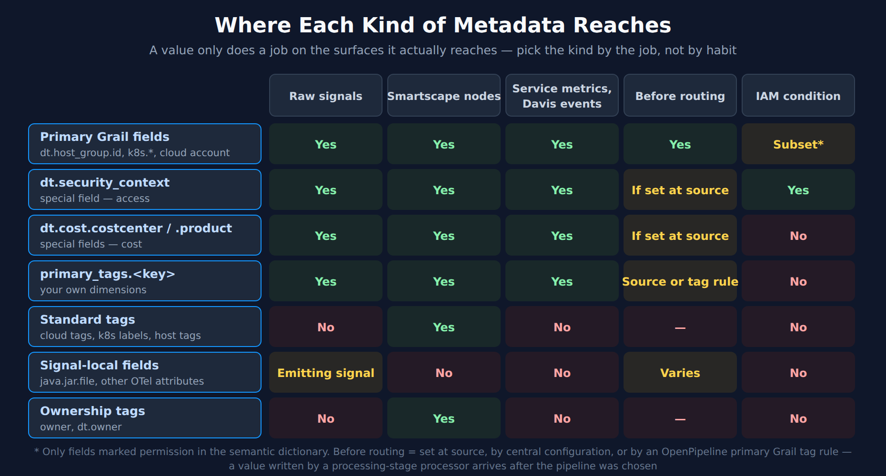
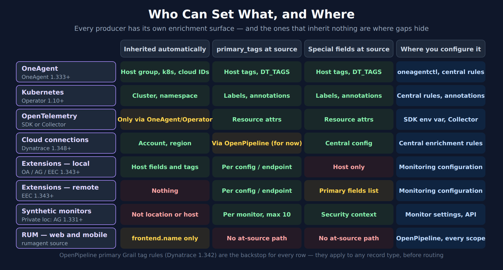

# FAQ-26: What Metadata Should We Set, Where, and Why?

> **Series:** FAQ — Frequently Asked Questions | **Reference:** 26 — Metadata Strategy | **Created:** October 2026 | **Last Updated:** 10/06/2026

## Overview

Every Dynatrace rollout reaches the same meeting: *"what metadata do we need?"* It usually gets answered as a list of tag names — `team`, `env`, `app`, `cost-center` — and the list is rarely the problem. What goes wrong is everything around it: a value is set on the host and never reaches the extension metrics, a team tag appears in logs but not on the RUM data, a cost center is populated while its product partner is not, or a tag that everyone treats as an access boundary turns out not to be usable in a policy at all.

This FAQ treats metadata as three decisions per dimension rather than a list of names:

| Decision | Question | Why it matters |
|---|---|---|
| **1 · The job** | What will the platform *do* with this value — control access, filter, allocate cost, route, alert, track releases? | Each job reads a specific field. A value in the wrong field does not do the job, however well it is named. |
| **2 · The owner** | Which producer sets it — OneAgent, Kubernetes, OpenTelemetry, a cloud connection, an extension, a synthetic monitor, RUM, OpenPipeline? | Every producer has its own enrichment surface. Some inherit metadata; some inherit nothing. |
| **3 · The reach** | Does it arrive on every signal, on derived data, and *before* routing? | A value that arrives after routing cannot choose a bucket; a value that never reaches a signal cannot filter it. |

It is the strategy layer over three existing references, which it routes to rather than restates: **FAQ-02** for tag taxonomy and naming, **K8S-10** for the Kubernetes mechanics, and **ORGNZ-06** for security context.

---

## Table of Contents

1. [Short Answer](#short-answer)
2. [What "Metadata" Means on the Platform](#what-metadata-means)
3. [Why Set It: The Six Jobs](#the-six-jobs)
4. [Where Each Kind Reaches](#where-each-kind-reaches)
5. [Who Sets It: Producer by Producer](#producer-by-producer)
6. [Silent Failure Modes](#silent-failure-modes)
7. [Auditing Coverage with DQL](#auditing-coverage)
8. [Recommended Rollout Order](#rollout-order)
9. [Summary and Next Steps](#summary-and-next-steps)

---

<a id="prerequisites"></a>
## Prerequisites

| Requirement | Details |
|-------------|---------|
| **Applies to** | Latest Dynatrace (Grail, Smartscape on Grail, OpenPipeline) — SaaS |
| **Audience** | Platform owners and architects designing a tagging and enrichment standard; anyone asked "which tags do we need, and where do we set them?" |
| **Format** | Decision support and routing — mechanics live in the linked series |
| **Permissions** | The queries in section 7 need Grail read access to logs, spans, events, problems, user events and synthetic events; the dictionary queries need none |
| **Related topic series** | **ORGNZ** (buckets, segments, security context) · **IAM** (policies and boundaries) · **K8S** (K8S-10 metadata enrichment) · **OPIPE** (OpenPipeline beyond logs) · **SYNTH** · **WEBRUM** / **MOBL** · **FINOPS** (cost allocation) |
| **Related FAQs** | **FAQ-01** host-group naming · **FAQ-02** tagging sources, standards and strategy · **FAQ-21** getting the right alerts to the right people · **FAQ-24** can we trust Dynatrace with our data |

<a id="short-answer"></a>
## 1. Short Answer

**Decide the job first, then put the value in the field that job reads, set by the producer that owns it, as close to the source as that producer allows.**

Five rules carry most of the weight:

1. **Use what is already there.** Host group, Kubernetes cluster and namespace, and cloud account fields are populated automatically. If they answer the question, add nothing.
2. **Only three kinds of value reach everything.** Primary Grail fields, the three special fields (`dt.security_context`, `dt.cost.costcenter`, `dt.cost.product`) and `primary_tags.<key>` are enriched on every signal, on Smartscape nodes, and on derived data such as service metrics and Davis events. Cloud tags, Kubernetes labels and plain host tags, on their own, are not.
3. **Access control needs `dt.security_context` or a permission field — not a primary tag.** The semantic dictionary marks which fields an IAM policy can use. `primary_tags.*` is not one of them.
4. **Set it at source when routing depends on it.** A value written by an OpenPipeline processor arrives after the pipeline was chosen. Source enrichment, central rules, and OpenPipeline *primary Grail tag rules* all apply before routing.
5. **Check the producers that inherit nothing.** Remote extensions, synthetic monitors and RUM do not pick up host or namespace metadata. Each needs its own configuration, and they are where coverage audits find gaps.

> <sub>**Sources:** [Primary Grail fields and tags (DT docs)](https://docs.dynatrace.com/docs/manage/tags/primary-tags) — *"Together, they form the metadata foundation of the Dynatrace platform."*, [Best practices for enriching primary Grail fields and tags (DT docs)](https://docs.dynatrace.com/docs/manage/tags/tags-best-practices) — *"OpenPipeline runs after pipeline routing, so tags derived here can't influence which pipeline a record enters."* **Derived:** rules 3 and 5 are argued in §3 and §5.</sub>

<a id="what-metadata-means"></a>
## 2. What "Metadata" Means on the Platform

"Metadata" covers several different things on the platform, and they do not behave alike. The distinction that matters is not *what the value says* but *where the platform puts it*.

| Kind | Example | Who defines it | Where it lives |
|---|---|---|---|
| **Primary Grail fields** | `dt.host_group.id`, `k8s.cluster.name`, `k8s.namespace.name`, `aws.account.id`, `azure.subscription`, `gcp.project.id` | Dynatrace (semantic dictionary) — populated automatically where the source applies | Every signal, Smartscape nodes, derived signals |
| **Special fields** | `dt.security_context`, `dt.cost.costcenter`, `dt.cost.product` | You set the value; Dynatrace defines the key | Same as primary fields |
| **Primary Grail tags** | `primary_tags.team`, `primary_tags.app`, `primary_tags.stage` | You — any key under the `primary_tags.` prefix | Same as primary fields |
| **Standard tags** | AWS tags, Kubernetes labels and annotations, host and process tags | The source system | **The Smartscape node only** — not raw signals |
| **Signal-local fields** | `java.jar.file`; OpenTelemetry attributes that don't use the `primary_tags.` convention | The producer | The emitting signal only |
| **Ownership tags** | `owner`, `dt.owner`, plus up to three custom keys | You, through the Ownership settings | Tags on Smartscape nodes |

The last three rows are where most surprises come from. A Kubernetes label, a cloud tag or a host tag is real metadata — it shows on the entity — but a segment, bucket rule or alert filter that targets logs or metrics will not see it unless it has been **promoted** into a primary tag or special field. FAQ-02 §2 covers the taxonomy in depth; the rest of this FAQ is about the promotion.

Release identity (`DT_RELEASE_PRODUCT`, `DT_RELEASE_VERSION`, `DT_RELEASE_STAGE`) is a seventh case with its own mechanics, covered in FAQ-02 §3.1. On the validation tenant the matching `deployment.release_*` fields were present in the semantic dictionary as `experimental` without a `primary-field` tag, while the Dynatrace reference page lists them as stable primary fields — treat them as a moving target and check your own tenant's dictionary.

> <sub>**Sources:** [Primary Grail fields and tags (DT docs)](https://docs.dynatrace.com/docs/manage/tags/primary-tags) — *"Dynatrace doesn't automatically enrich them on raw telemetry signals."*, [Primary Grail fields (DT docs)](https://docs.dynatrace.com/docs/semantic-dictionary/tags/primary-fields), [Assign team ownership (DT docs)](https://docs.dynatrace.com/docs/deliver/ownership/assign-team-ownership) — *"Tags are key-value pairs stored in Smartscape nodes."* **Dictionary:** `dt.host_group.id`, `k8s.namespace.name` (`stable`, tagged `primary-field`), `deployment.release_stage` / `deployment.release_product` / `deployment.release_version` (`experimental`, no `primary-field` tag), read 10/06/2026.</sub>

<a id="the-six-jobs"></a>
## 3. Why Set It: The Six Jobs

Metadata is worth exactly the jobs it does. Each job reads specific fields; the table names them and points to the series that implements the job.

| Job | What the platform reads | What you set | Go deeper |
|---|---|---|---|
| **Access control** | Fields tagged `permission` in the semantic dictionary — host group, Kubernetes cluster and namespace, cloud account / subscription / resource group / project — plus `dt.security_context`. For RUM, `frontend.name`. | Nothing, if deployment structure already matches who may see what. `dt.security_context` when one deployment scope holds data for several audiences. | ORGNZ-06, IAM-04, IAM-05, FAQ-24 |
| **Filtering and segments** | Primary fields and `primary_tags.*` — the only values that filter the same way across every signal type | `primary_tags.<key>` for dimensions the built-in fields don't express (team, app, stage) | ORGNZ-08, ORGNZ-10 |
| **Cost allocation** | `dt.cost.costcenter` and `dt.cost.product` | Both — they are read as a pair | FINOPS-01, FINOPS-03 |
| **Routing and retention** | Whatever is on the record *before* routing — primary fields, special fields and primary tags set at source or by a primary Grail tag rule | Enrichment at source, by central rule, or by OpenPipeline primary Grail tag rule | OPIPE-01, ORGNZ-02 |
| **Alert scoping and notification routing** | Primary fields and tags carried on Davis events; ownership tags on the affected entity | `primary_tags.team` (or equivalent) on the telemetry; `owner` / `dt.owner` on entities | FAQ-21, ALERT-03, WFLOW-04 |
| **Release tracking** | Release identity on the process (`DT_RELEASE_*`) | Environment variables at deploy time | FAQ-02 §3.1, AUTOM-07, DASH-06 |

### A primary tag is not an access boundary

This is the single most consequential distinction in the table. Dynatrace documents that a subset of primary Grail fields — those *"marked with the permission tag in the Semantic Dictionary"* — can be used as IAM policy conditions. On the validation tenant the `permission` tag is on `dt.security_context`, `frontend.name`, the host-group, Kubernetes and cloud-account fields, and a handful of event, log and metric fields. It is **not** on `primary_tags.*`.

So `primary_tags.team = "payments"` is an excellent segment filter and routing key, and no use at all as a security boundary. When the same team value must also restrict who sees the data, write it to `dt.security_context` as well — in the same enrichment step, from the same source — so the two never drift apart.

### What enrichment costs

Enrichment is not free. Dynatrace states that *"Enriching data increases the amount of data that is ingested, retained, and queried."* Every key you add is carried on every record from that source. That is the practical argument for the six-job test: a key that does none of the jobs costs something and returns nothing.

> <sub>**Sources:** [Primary Grail fields and tags (DT docs)](https://docs.dynatrace.com/docs/manage/tags/primary-tags) — *"These fields are marked with the permission tag in the Semantic Dictionary."*, [Configure security context (DT docs)](https://docs.dynatrace.com/docs/manage/tags/tags-security-context), [Best practices for RUM data access controls (DT docs)](https://docs.dynatrace.com/docs/platform/upgrade/best-practices/stage-02-post-ingest-enrichment/rum-data-access-controls) — *"The primary way to grant access to specific subsets of RUM data is the frontend.name field."* **Dictionary:** fields tagged `permission` — `dt.security_context`, `frontend.name`, `dt.host_group.id`, `k8s.cluster.name`, `k8s.namespace.name`, `aws.account.id`, `azure.subscription`, `azure.resource.group`, `gcp.project.id` (all `stable`); `primary_tags.__key__` (`experimental`) carries no `permission` tag; read 10/06/2026. **Derived:** "write the team value to `dt.security_context` as well" follows from the permission tagging.</sub>

<a id="where-each-kind-reaches"></a>
## 4. Where Each Kind Reaches

The six jobs read different surfaces — raw signals, Smartscape nodes, derived data, the pre-routing record, an IAM condition. A value only does a job on the surfaces it reaches.



<!-- MARKDOWN_TABLE_ALTERNATIVE
| Kind | Raw signals | Smartscape nodes | Service metrics, Davis events | Before routing | IAM condition |
|---|---|---|---|---|---|
| Primary Grail fields | Yes | Yes | Yes | Yes | Subset (permission-tagged) |
| dt.security_context | Yes | Yes | Yes | If set at source | Yes |
| dt.cost.costcenter / dt.cost.product | Yes | Yes | Yes | If set at source | No |
| primary_tags.<key> | Yes | Yes | Yes | At source or by primary Grail tag rule | No |
| Standard tags (cloud tags, k8s labels, host tags) | No | Yes | No | — | No |
| Signal-local fields | Emitting signal only | No | No | Varies | No |
| Ownership tags (owner, dt.owner) | No | Yes | No | — | No |
For environments where SVG doesn't render
-->

Two rows deserve a closer look.

**Derived data.** Primary tags and special fields carry through to service metrics, Davis events and problems. This was confirmed on the validation tenant: `dt.service.request.count` split cleanly by `dt.security_context`, by `dt.host_group.id` and by two different `primary_tags.*` keys set through central enrichment rules. That is what lets a segment, an alert filter and a dashboard tile all use one value. Signal-local fields do not carry through — Dynatrace says non-convention OpenTelemetry attributes *"aren't automatically propagated across signal types or to Davis events and problems."*

**Before routing.** Two OpenPipeline features look alike and behave differently. *Primary Grail tag rules* (Dynatrace 1.342) are evaluated before routing and apply to any record type. A DQL or *Set security context* processor inside a pipeline runs after routing. Use the first when the value has to pick a pipeline or bucket; the second is fine for values that only filter or restrict access.

> <sub>**Sources:**</sub>
> - <sub>[Primary Grail fields and tags (DT docs)](https://docs.dynatrace.com/docs/manage/tags/primary-tags) — *"Dynatrace enriches all derived signals (service metrics, Davis events, and problems) with the same tags."*</sub>
> - <sub>[Set primary Grail tag rules in OpenPipeline (DT docs)](https://docs.dynatrace.com/docs/platform/openpipeline/get-started/primary-grail-tags) — *"All rules are evaluated before ingest-preprocessing time, before routing, and apply globally, to any incoming record of any type."*</sub>
> - <sub>[Best practices for enriching primary Grail fields and tags (DT docs)](https://docs.dynatrace.com/docs/manage/tags/tags-best-practices) — *"OpenPipeline runs after pipeline routing, so tags derived here can't influence which pipeline a record enters."*</sub>
> - <sub>[Enrich OpenTelemetry with primary Grail fields and tags (DT docs)](https://docs.dynatrace.com/docs/manage/tags/primary-tags/tags-domain-otel)</sub>
> - <sub>**Derived:** the derived-data claim was also checked on `dt.service.request.count` on the validation tenant, 10/06/2026 (§7, last query).</sub>

<a id="producer-by-producer"></a>
## 5. Who Sets It: Producer by Producer

Every producer has its own enrichment surface, its own precedence rules and its own version floor. The diagram is the one-page view; the subsections below give the detail and the trap for each.



<!-- MARKDOWN_TABLE_ALTERNATIVE
| Producer | Version floor | Inherited automatically | primary_tags at source | Special fields at source | Where you configure it |
|---|---|---|---|---|---|
| OneAgent | OneAgent 1.333+ | Host group, Kubernetes, cloud IDs | Host tags, DT_TAGS | Host tags, DT_TAGS | oneagentctl, installer, central rules |
| Kubernetes | Operator 1.10+ | Cluster, namespace | Labels, annotations | Labels, annotations | Central rules, metadata.dynatrace.com annotations, DynaKube |
| OpenTelemetry | SDK or Collector | Only via OneAgent or Operator | Resource attributes | Resource attributes | OTEL_RESOURCE_ATTRIBUTES, Collector processor |
| Cloud connections | Dynatrace 1.348+ | Account, region | Via OpenPipeline (for now) | Central configuration | Ingest enrichment configuration |
| Extensions — local | OneAgent / ActiveGate / EEC 1.343+ | Host fields and tags | Per configuration or endpoint | Host only | Monitoring configuration |
| Extensions — remote | EEC 1.343+ | Nothing | Per configuration or endpoint | Primary fields list | Monitoring configuration |
| Synthetic monitors | Private locations: ActiveGate 1.331+ | Not from location or host | Per monitor, max 10 | Security context per monitor | Monitor settings, API |
| RUM — web and mobile | rumagent ingest source | frontend.name only | No at-source path | No at-source path | OpenPipeline, every relevant scope |
| (Backstop) OpenPipeline primary Grail tag rules | Dynatrace 1.342 | — | Any record type, before routing | — | Settings > OpenPipeline > Primary Grail tags |
For environments where SVG doesn't render
-->

Dynatrace orders the options from cheapest to most effort: rely on built-in fields, enrich at deployment, configure centrally, and only then derive in OpenPipeline. That order holds for every producer below. Dynatrace also describes the model as one where it *"is progressively expanding coverage across signal types and data sources"* — several of the gaps below are labelled "coming soon" on the pages themselves.

### 5.1 OneAgent

Three surfaces, from broadest to narrowest: **central ingest enrichment rules** (environment or host-group scope), **host tags** (installer or `oneagentctl --set-host-tag`), and **`DT_TAGS`** on a single process. Process level wins over host level for that process. Serverless code modules accept `DT_TAGS` only, and on mainframe only process-level enrichment exists, configured in `zremoteagentuserconfig.conf`.

**Version floors — the two pages disagree.** The OneAgent enrichment page says primary field and tag enrichment *"requires OneAgent version 1.333+"*; the upgrade guide's metadata best-practice page says 1.337 for `primary_tags.*` and `dt.security_context`. Plan on the higher of the two. Central ingest enrichment rules need 1.343+.

**The 1.345 trap.** From OneAgent 1.345, host `primary_tags` come only from host tags, not from `hostcustomproperties.conf`. A host that set them as properties stops sending them on upgrade, and nothing errors. FAQ-02 §3 has the audit.

> <sub>**Sources:** [Enrich OneAgent telemetry with primary Grail fields and tags (DT docs)](https://docs.dynatrace.com/docs/manage/tags/primary-tags/tags-domain-oneagent) — *"Primary Grail field and tag enrichment requires OneAgent version 1.333+."*, [Best practices for metadata enrichment (DT docs)](https://docs.dynatrace.com/docs/platform/upgrade/best-practices/stage-02-post-ingest-enrichment/metadata-enrichment) — *"OneAgent version 1.337 or later is required for primary_tags.* and dt.security_context enrichment."*, [What's new in OneAgent 1.345 (DT docs)](https://docs.dynatrace.com/docs/whats-new/oneagent/sprint-345) — *"Starting with OneAgent version 1.345, the OS Agent derives primary_tags from host tags (hostautotag.conf) rather than from host properties (hostcustomproperties.conf) at the host level."*</sub>

### 5.2 Kubernetes

Three methods, set out in full in **K8S-10**: **central rules** that promote namespace labels and annotations you already maintain; **dedicated `metadata.dynatrace.com/` annotations** on a namespace, workload or pod; and **DynaKube resource attributes** for cluster-wide facts. Annotations accept `primary_tags.<key>` and the three special fields. Within annotations, pod beats workload beats namespace.

**The grain trap.** Pod-level annotations don't reach Kubernetes platform data. Dynatrace says they *"don't enrich Kubernetes metrics, events, Smartscape entities, or Prometheus metrics"* — only logs and spans from the annotated pods. A cost center set per pod will therefore never appear on namespace-level CPU or memory metrics. Put anything that platform metrics must carry at **namespace** level.

**The double-injection trap.** When OneAgent injection and OTLP exporter injection are both active on a pod and set the same key, Dynatrace calls the result undefined. Use distinct keys.

> <sub>**Sources:** [Enrich Kubernetes telemetry with primary Grail fields and tags (DT docs)](https://docs.dynatrace.com/docs/manage/tags/primary-tags/tags-domain-k8s) — *"When the same key is set at multiple levels, the pod-level value wins over the workload-level value, and the workload-level value wins over the namespace-level value."*, [Configure cost allocation (DT docs)](https://docs.dynatrace.com/docs/manage/tags/tags-cost-allocation) — *"Pod annotations don't enrich Kubernetes metrics, events, Smartscape entities, or Prometheus metrics."*</sub>

### 5.3 OpenTelemetry

Add values as **resource attributes** — `OTEL_RESOURCE_ATTRIBUTES` at the SDK, or a `resource` processor in the Collector. Any attribute named `primary_tags.<key>` is treated as a primary tag, and `dt.security_context`, `dt.cost.costcenter` and `dt.cost.product` are recognized as well. When both the SDK and the Collector set a key, the last writer wins, which is normally the Collector. Choose `upsert` or `insert` on purpose.

Built-in fields such as `dt.host_group.id` arrive automatically only when the OTLP data comes through OneAgent injection or the Dynatrace Operator. OTLP sent directly or through a standalone Collector gets only what you attach. A central configuration for standalone OpenTelemetry resource attributes is *"planned, but not yet available"* — until it arrives, resource attributes and OpenPipeline are the working paths.

> <sub>**Sources:** [Enrich OpenTelemetry with primary Grail fields and tags (DT docs)](https://docs.dynatrace.com/docs/manage/tags/primary-tags/tags-domain-otel) — *"The dt.security_context, dt.cost.costcenter, and dt.cost.product attributes are also recognized as primary Grail tags automatically."*</sub>

### 5.4 Cloud connections (AWS, Azure, Google Cloud)

Account and region fields are populated automatically on telemetry from a cloud connection. To use your own cloud tags, central configuration maps a cloud tag to `dt.security_context`, `dt.cost.costcenter` or `dt.cost.product`, or forwards it as `aws.tags.<key>`, which is not yet a primary tag. Mapping a cloud tag straight to a **primary tag** is marked *coming soon*. Dynatrace gave September 2026 as the expected availability of this central configuration for cloud tags, so check that it has reached your tenant; until it has, the page points to the cloud connection settings. In the meantime, an OpenPipeline primary Grail tag rule promotes the forwarded field. List two sources in that rule: one for telemetry (`aws.tags.team`) and one for Smartscape nodes (`` `tags:aws`[team] ``).

**Version gate.** These pages apply to **new cloud connections only** and to Dynatrace **1.348+**. SaaS releases reach tenants in a staged rollout, so check that your tenant has the release before you design around it. Classic cloud connections are not covered. FAQ-02 §4 covers naming drift between cloud providers, which is the main reason to normalize in one rule.

> <sub>**Sources:** [Enrich AWS telemetry with primary Grail fields and tags (DT docs)](https://docs.dynatrace.com/docs/manage/tags/primary-tags/tags-domain-aws) — *"This page applies to new cloud connections only."* and *"Primary Grail tags (coming soon): This option is not yet directly available as Target and will be added in one of the next releases."*</sub>

### 5.5 Extensions (Extensions 2.0)

Extensions are where an "it's on the host" assumption fails most often, because there are two kinds and they behave in opposite ways.

| | Local extension (runs on OneAgent) | Remote extension (runs on an ActiveGate EEC) |
|---|---|---|
| Inherits host metadata | **Yes** — primary fields and primary tags from the host, plus `k8s.cluster.name` / `k8s.namespace.name` in Kubernetes | **No** — there is no host to inherit from |
| Primary tags | Per monitoring configuration and per endpoint | Per monitoring configuration and per endpoint |
| Primary fields | Host only — cannot be set explicitly | Set explicitly from a list in the configuration |
| Precedence | Endpoint › configuration › host | Endpoint › configuration |
| Version floor | OneAgent, ActiveGate and EEC 1.343+ | EEC 1.343+ |

The practical consequence: a **remote** database, network or cloud extension sends metrics with no team, no cost center and no security context unless the monitoring configuration supplies them. The page's examples query extension data by `dt.cost.costcenter` and `dt.security_context`, but it doesn't list which primary fields the selector offers. Check the configuration form before relying on one. Where it can't carry the value, an OpenPipeline rule on the metric key prefix is the fallback; OPIPE-01 §6 has the pattern.

Two limits fail silently. More than **20 primary tags** per monitoring configuration are dropped *"without a warning"*. A newly added key can take up to 24 hours to show in app filter dropdowns, even though DQL already sees it.

> <sub>**Sources:** [Enrich extensions with primary Grail fields and tags (DT docs)](https://docs.dynatrace.com/docs/manage/tags/primary-tags/tags-domain-extensions) — *"Remote extensions run on the Extension Execution Controller (EEC) without a OneAgent host, so enrichment cannot be inherited automatically."* and *"Up to 20 primary tags per monitoring configuration; excess tags are silently dropped without a warning."*</sub>

### 5.6 Synthetic monitors

Synthetic monitors carry two kinds of metadata. Both are set **per monitor**, and neither is inherited.

- **Primary Grail tags.** Set them in the monitor's settings or with `primaryGrailTags` in the monitor API body. Browser, HTTP and network availability (NAM) monitors all support them. They go onto every event and metric the monitor produces and onto the monitor's Smartscape node. Limits: at most 10 tags, one value per key.
- **Security context.** A monitor can hold up to 10 security context values. These values control two things: who can see and edit the monitor, through `synthetic:dt.security_context` in IAM policies, and who can read its results, through `storage:dt.security_context`. Dynatrace notes that this enrichment also reaches the browser-monitor results stored in the RUM user-event table. That matters because those results don't support the `frontend.name` scoping RUM normally uses (§5.7), so the security context is the only per-team boundary for them. Setting or changing a monitor's security context needs Latest Dynatrace platform permissions, and users who hold only classic permissions are not restricted by it.

**Nothing is inherited.** A monitor running on a private location in the `payments` host group gets nothing from that host group. Private locations need **ActiveGate 1.331+** for either kind of value to be added to results; older ActiveGates run the monitor but leave its results untagged. Once a monitor has several security context values, the field is an array, so filter it in DQL with `in()` or `matchesValue()` rather than `==`. The Synthetic pages don't mention cost fields, so if you need them, set them in OpenPipeline and confirm with the §7 audit. AUTOM-04 shows a Terraform module that makes the team tag and security context mandatory on every monitor.

> <sub>**Sources:**</sub>
> - <sub>[Primary Grail tags for Synthetic (DT docs)](https://docs.dynatrace.com/docs/observe/digital-experience/synthetic/primary-grail-tags-synthetic) — *"Tags aren't inherited from the Synthetic location, host group, or any other entity."*</sub>
> - <sub>[Synthetic access control (DT docs)](https://docs.dynatrace.com/docs/observe/digital-experience/synthetic/synthetic-access-control) — *"Security contexts are values set on individual Synthetic monitors that allow fine-grained access control."*, *"A monitor supports a maximum of 10 security context values."* and *"user events generated by Synthetic monitors are enriched with the security context values set on those monitors."*</sub>
> - <sub>[Best practices for RUM data access controls (DT docs)](https://docs.dynatrace.com/docs/platform/upgrade/best-practices/stage-02-post-ingest-enrichment/rum-data-access-controls) — *"but does not currently support frontend.name for access scoping."*</sub>

### 5.7 Real User Monitoring — web and mobile

RUM is different from every other producer because nothing about it can be configured at source. Web (RUM JavaScript) and mobile (OneAgent for Mobile) data both arrive through the `rumagent` ingest source, which Dynatrace says *"offers no at-source tag configuration."* All enrichment happens in OpenPipeline.

**The anchor field is `frontend.name`.** It is on every user event and user session, it comes from the frontend definitions, and it is the one RUM field tagged `permission`. Map frontend names to `primary_tags.team` (or `app`) with a DQL processor. Check the name first: Dynatrace notes that `frontend.name` can differ from the display name in Experience Vitals, and a policy written against the display name matches nothing.

**Repeat the rule in every scope.** OpenPipeline keeps one configuration scope per signal type. The RUM enrichment page lists seven where RUM data appears: Smartscape events, User events, User sessions, Events, Davis events, Business events and Timeseries. A rule in *User events* alone leaves RUM-derived metrics, problems and the `FRONTEND` nodes untagged. Dynatrace recommends a **base pipeline** in each scope, set up with pipeline groups, so the tag exists before any team pipeline runs. Use the condition `isNull(primary_tags.team)` so a value set earlier is not overwritten.

**User sessions are arrays.** A web session can span several frontends, so `frontend.name` on `user.sessions` is an array, and the derived `primary_tags.team` becomes an array too. Filter with `matchesValue(...)` or `in(...)`. Any `==` comparison on that array returns no rows and raises no error.

**Access.** `frontend.name` on its own handles per-application access for user events, sessions and RUM metrics. For anything finer, such as specific pages, Dynatrace says to write `dt.security_context` with DQL processors in the same scopes. The only fields you can mask from display are the four built-in sensitive fields (client IP, user tag, latitude, longitude). Nothing you add in OpenPipeline can be marked sensitive.

**Two things the pages leave open.** Cost fields on RUM data aren't mentioned on either RUM page, so treat them as unverified and test with the §7 audit. The two pages also contradict each other on retention: the enrichment page lists *bucket assignment* by `primary_tags.*` as a use, and the access-controls page says *"You cannot currently modify these buckets or create custom RUM buckets."* Until that is settled, don't put RUM retention into your tag design.

> <sub>**Sources:**</sub>
> - <sub>[Enrich RUM telemetry with primary Grail fields and tags (DT docs)](https://docs.dynatrace.com/docs/manage/tags/primary-tags/tags-domain-rum) — *"To configure security context (dt.security_context) for RUM data, use DQL processors in the relevant OpenPipeline configuration scopes."*</sub>
> - <sub>[Best practices for RUM data access controls (DT docs)](https://docs.dynatrace.com/docs/platform/upgrade/best-practices/stage-02-post-ingest-enrichment/rum-data-access-controls) — *"You cannot currently modify these buckets or create custom RUM buckets."*</sub>
> - <sub>**Dictionary:** `frontend.name` (`stable`, tagged `permission`), read 10/06/2026.</sub>

### 5.8 Everything else: APIs, log shippers and CMDBs

Data sent straight to an ingest API or through a log shipper has no enrichment page of its own. Two documented paths reach it. **OpenPipeline primary Grail tag rules** apply to *"any incoming record of any type"* before routing, and each rule takes an ordered list of source fields, using the first that is present. **Set security context** processors cover spans, logs and metrics after routing. When the value isn't on the data at all, for example ownership kept in a CMDB, neither path can create it. The WFLOW-95 lab instead uses a scheduled workflow that writes CMDB values onto hosts as tags, which OneAgent then carries.

> <sub>**Sources:** [Set primary Grail tag rules in OpenPipeline (DT docs)](https://docs.dynatrace.com/docs/platform/openpipeline/get-started/primary-grail-tags), [Configure security context (DT docs)](https://docs.dynatrace.com/docs/manage/tags/tags-security-context) — *"At-source enrichment is always preferred over OpenPipeline-based enrichment for the security context."*</sub>

<a id="silent-failure-modes"></a>
## 6. Silent Failure Modes

Metadata rarely fails with an error. In every row below the data still arrives; it just arrives without the value, so a segment comes back short, a bucket rule never matches, or a policy hides nothing. Each row says how to find it.

| Failure | What you see | How to detect it |
|---|---|---|
| **Host properties after OneAgent 1.345** | A host's `primary_tags.*` disappear on upgrade | Audit `hostcustomproperties.conf` before upgrading (FAQ-02 §3); §7 coverage by host group |
| **Remote extension inherits nothing** | Extension metrics have no team, cost or security context while host data does | §7 audit filtered to the extension's `metric.key` prefix |
| **More than 20 tags on an extension configuration** | The extra keys are missing; no warning is shown | Count the keys in each monitoring configuration |
| **Synthetic tags or security context expected from the location** | Monitor data is untagged or open to everyone | §7 audit, *synthetic events* row |
| **Private location on ActiveGate before 1.331** | Tagged monitors produce untagged results | Same audit, split by location |
| **RUM rule set in one scope only** | User events are tagged; RUM metrics, problems and `FRONTEND` nodes are not | Run the audit against `user.events` and against problems for the same frontend |
| **`==` on a session array** | A filter on `user.sessions` returns nothing | Use `matchesValue()` or `in()` |
| **Pod-level cost or team annotation** | Kubernetes metrics and events lack the value; spans and logs have it | Compare a namespace's span coverage with its metric coverage |
| **Value set in a pipeline processor** | The value is present but the bucket rule never fires | Move it to source or to a primary Grail tag rule (§4) |
| **Primary tag used as an access boundary** | The restriction you wanted can't be written on that field | Check the field's `permission` tag (§7, first query) |
| **Cost center without cost product** | Allocation splits by center but every product reads empty | The `cost_center` and `cost_product` columns in §7 diverge |
| **Enrichment assumed to be retroactive** | Older data lacks the value | Expected behaviour; enrichment only applies going forward. Compare against data from after the change |
| **New key not in app dropdowns** | The value seems to be missing in the UI | Query it in DQL. Dropdowns can lag up to 24 hours |

> <sub>**Sources:** [Best practices for metadata enrichment (DT docs)](https://docs.dynatrace.com/docs/platform/upgrade/best-practices/stage-02-post-ingest-enrichment/metadata-enrichment) — *"Enrichment applies only to signals ingested after the configuration is active."*, [Enrich OneAgent telemetry with primary Grail fields and tags (DT docs)](https://docs.dynatrace.com/docs/manage/tags/primary-tags/tags-domain-oneagent) — *"A newly enriched primary tag key can take up to 24 hours to appear in the filter dropdowns of Dynatrace apps."* **Derived:** the remaining rows restate the per-producer sources cited in §5.</sub>

<a id="auditing-coverage"></a>
## 7. Auditing Coverage with DQL

Dynatrace recommends validating enrichment before building IAM, segments or bucket rules on top of it: *"Resolve enrichment gaps before starting IAM or segment configuration"* These four queries do that. The first costs nothing. The others are scoped to one hour; widen the window only after you have looked at the result.

**Step 1: what the platform treats as primary and permission-relevant.** This reads the semantic dictionary and scans zero bytes. Primary fields and the dictionary change with your tenant's platform version, so read it from your own tenant rather than a static list.

```dql
// Which fields are primary Grail fields, and which can be used in an IAM policy?
// Reads the semantic dictionary for THIS tenant — zero bytes scanned.
fetch dt.semantic_dictionary.fields
| filter in("permission", tags) or in("primary-field", tags)
| fields name, stability,
    primary_field = in("primary-field", tags),
    usable_in_iam = in("permission", tags)
| sort usable_in_iam desc, name asc
```

On the validation tenant (10/06/2026) this returned ten primary fields — host group, Kubernetes cluster and namespace, and seven cloud account, region and resource-group fields. Fifteen fields carried the `permission` tag, among them `dt.security_context` and `frontend.name`. No `primary_tags.*` field was permission-tagged.

**Step 2: which primary tag keys actually exist.** Each tenant defines its own `primary_tags.*` keys, so look before you audit. Run this once per signal type you care about (`logs`, `spans`, `user.events`, `dt.synthetic.events`):

```dql
// Sample which primary tags and special fields are present on recent logs.
// Swap `logs` for spans, user.events, dt.synthetic.events, events ...
fetch logs, from:-30m
| fieldsKeep "primary_tags.*", dt.security_context, dt.cost.costcenter, dt.cost.product, dt.host_group.id
| limit 20
```

**Step 3: coverage by signal type.** This is the main audit. Replace `primary_tags.team` with the key you rely on. Read the result column by column: any column with a high count on one signal and zero on another shows a producer that isn't enriched.

```dql
// Enrichment coverage across signal types — one row per signal.
// Replace primary_tags.team with the key your segments and routing depend on.
// Scans every record in the window: keep it short on a large tenant.
fetch logs, from:-1h
| summarize total = count(), security_context = countIf(isNotNull(dt.security_context)), cost_center = countIf(isNotNull(dt.cost.costcenter)), cost_product = countIf(isNotNull(dt.cost.product)), host_group = countIf(isNotNull(dt.host_group.id)), team_tag = countIf(isNotNull(primary_tags.team))
| fieldsAdd signal = "logs"
| append [fetch spans, from:-1h | summarize total = count(), security_context = countIf(isNotNull(dt.security_context)), cost_center = countIf(isNotNull(dt.cost.costcenter)), cost_product = countIf(isNotNull(dt.cost.product)), host_group = countIf(isNotNull(dt.host_group.id)), team_tag = countIf(isNotNull(primary_tags.team)) | fieldsAdd signal = "spans"]
| append [fetch events, from:-1h | summarize total = count(), security_context = countIf(isNotNull(dt.security_context)), cost_center = countIf(isNotNull(dt.cost.costcenter)), cost_product = countIf(isNotNull(dt.cost.product)), host_group = countIf(isNotNull(dt.host_group.id)), team_tag = countIf(isNotNull(primary_tags.team)) | fieldsAdd signal = "events"]
| append [fetch dt.davis.problems, from:-24h | summarize total = count(), security_context = countIf(isNotNull(dt.security_context)), cost_center = countIf(isNotNull(dt.cost.costcenter)), cost_product = countIf(isNotNull(dt.cost.product)), host_group = countIf(isNotNull(dt.host_group.id)), team_tag = countIf(isNotNull(primary_tags.team)) | fieldsAdd signal = "problems (24h)"]
| append [fetch user.events, from:-1h | summarize total = count(), security_context = countIf(isNotNull(dt.security_context)), cost_center = countIf(isNotNull(dt.cost.costcenter)), cost_product = countIf(isNotNull(dt.cost.product)), host_group = countIf(isNotNull(dt.host_group.id)), team_tag = countIf(isNotNull(primary_tags.team)) | fieldsAdd signal = "user.events (RUM)"]
| append [fetch dt.synthetic.events, from:-1h | summarize total = count(), security_context = countIf(isNotNull(dt.security_context)), cost_center = countIf(isNotNull(dt.cost.costcenter)), cost_product = countIf(isNotNull(dt.cost.product)), host_group = countIf(isNotNull(dt.host_group.id)), team_tag = countIf(isNotNull(primary_tags.team)) | fieldsAdd signal = "synthetic events"]
| fields signal, total, security_context, cost_center, cost_product, host_group, team_tag
```

**Never trust a zero in this table on its own.** A `team_tag` of 0 on every row usually means the key name is wrong, not that nothing is tagged. Run Step 2 first, and treat a zero `total` as no data in the window, not missing enrichment. Note that the `problems` row covers 24 hours because problems are far fewer.

On the validation tenant (10/06/2026), using a key that tenant does enrich, the audit showed three patterns that are typical of a partial rollout:

- **Spans fully covered, logs partly covered.** Every span had a security context. About two thirds of logs did, because the log sources include producers the host enrichment doesn't reach.
- **A cost center with no cost product.** The same logs that had a cost center had no product at all. Allocation by center works there; allocation by product reports nothing.
- **RUM and synthetic data had a security context but no team tag.** Security contexts were set on the frontends' data and on most monitors, but no frontend or monitor carried that team key (§5.6, §5.7). The synthetic rows also show monitors with no security context at all, and those results are open to anyone who can read synthetic data. The host group column is empty on both, as expected: neither producer has a host.

The audit scanned about 4 GB on that tenant for one hour of data. On a larger tenant, run one `fetch` at a time.

**Step 4: confirm that derived data carries the value.** Service metrics are what most SLOs and dashboards read. If a key shows up here, segments and alert filters on service metrics will honour it.

```dql
// Do service metrics carry the security context and your primary tag?
// Replace primary_tags.team with your key. Rows with a null key column are the uncovered share.
timeseries requests = sum(dt.service.request.count), from:-2h,
    by:{dt.security_context, primary_tags.team}
| fieldsAdd total = arraySum(requests)
| fieldsRemove requests, timeframe, interval
| sort total desc
| limit 20
```

On the validation tenant (10/06/2026) `dt.service.request.count` split by `dt.security_context`, `dt.host_group.id` and two different `primary_tags.*` keys. The primary tags had been set through central enrichment rules and reached service metrics with no further configuration.

> <sub>**Sources:** [Best practices for metadata enrichment (DT docs)](https://docs.dynatrace.com/docs/platform/upgrade/best-practices/stage-02-post-ingest-enrichment/metadata-enrichment) — *"Resolve enrichment gaps before starting IAM or segment configuration; gaps propagate into misconfigured access control and broken segmentation."* **Dictionary:** see §3, read 10/06/2026. All four queries executed against the validation tenant on 10/06/2026.</sub>

<a id="rollout-order"></a>
## 8. Recommended Rollout Order

The order runs from the decisions that are cheapest to make to the configuration that is costliest to change.

1. **Write down the jobs.** For each one in §3, decide whether you need it now. If a key does no job, leave it out.
2. **Check what is already there.** Run §7 Step 1 and Step 3 before adding anything. Host groups, namespaces and cloud accounts may already cover access and filtering. FAQ-01 covers getting host groups right.
3. **Fix the vocabulary.** Choose the `primary_tags.*` keys, their value formats and which special fields you need, following the FAQ-02 §5 naming rules. Do this before the agents are installed: values set at install time apply from the first data point, and changing them later means touching every host.
4. **Assign one owner per producer.** Use the §5 diagram. For each producer you run, name who sets each value and where. Prefer central rules over per-host settings, and source settings over OpenPipeline.
5. **Cover the producers that inherit nothing.** Remote extensions, synthetic monitors and RUM each need their own configuration. Add it to the same change, not as a follow-up.
6. **Backstop with OpenPipeline primary Grail tag rules.** Use them to normalize keys that differ by source (`aws.tags.team`, `azure.tags.team`, Kubernetes labels) and to fill gaps. They run before routing, so bucket rules can use the result.
7. **Audit, then build on it.** Re-run §7 until coverage is acceptable for each signal type. Only then build segments (ORGNZ-08/10), IAM boundaries (IAM-05), bucket rules (ORGNZ-02), cost allocation (FINOPS-01) and alert routing (FAQ-21).

> <sub>**Sources:** [Best practices for enriching primary Grail fields and tags (DT docs)](https://docs.dynatrace.com/docs/manage/tags/tags-best-practices) — *"Start at the top and move to the next only if the previous approach doesn't meet your needs."*, [Best practices for metadata enrichment (DT docs)](https://docs.dynatrace.com/docs/platform/upgrade/best-practices/stage-02-post-ingest-enrichment/metadata-enrichment) — *"Plan your Primary Grail Tag schema before installing OneAgent or Dynatrace Operator."*</sub>

<a id="summary-and-next-steps"></a>
## 9. Summary and Next Steps

| Decision | The rule |
|---|---|
| **Job** | Each job reads a specific field. Access uses permission fields or `dt.security_context`. Filtering and routing use primary fields and `primary_tags.*`. Cost uses both `dt.cost.*` fields. |
| **Owner** | Each producer has one surface. Remote extensions, synthetic monitors and RUM inherit nothing, so configure them explicitly. |
| **Reach** | Only primary fields, special fields and primary tags reach every signal and derived data. A value must be set at source or by a primary Grail tag rule to affect routing. |

### Where to go next

| If you need to… | Go to |
|---|---|
| Name keys and values, and resolve conflicts between tagging sources | **FAQ-02** — Tagging: Sources, Standards, and Strategy |
| Design host groups | **FAQ-01** — Host Group Naming Strategy |
| Set up Kubernetes enrichment | **K8S-10** — Metadata Telemetry Enrichment |
| Turn metadata into access control | **ORGNZ-06** Security Context · **IAM-05** Boundary Design · **FAQ-24** |
| Turn metadata into segments | **ORGNZ-08** · **ORGNZ-10** |
| Route and retain data by metadata | **OPIPE-01** · **ORGNZ-02** |
| Allocate cost | **FINOPS-01** |
| Route alerts by ownership | **FAQ-21** · **WFLOW-04** |
| Tag synthetic monitors as code | **SYNTH-01** · **AUTOM-04** |
| Feed CMDB values into tags | **WFLOW-95** LAB |

---

<sub>*This notebook was AI-generated from community-submitted and publicly available sources. This notebook series is not officially supported by Dynatrace. Always verify information against official Dynatrace documentation.*</sub>
