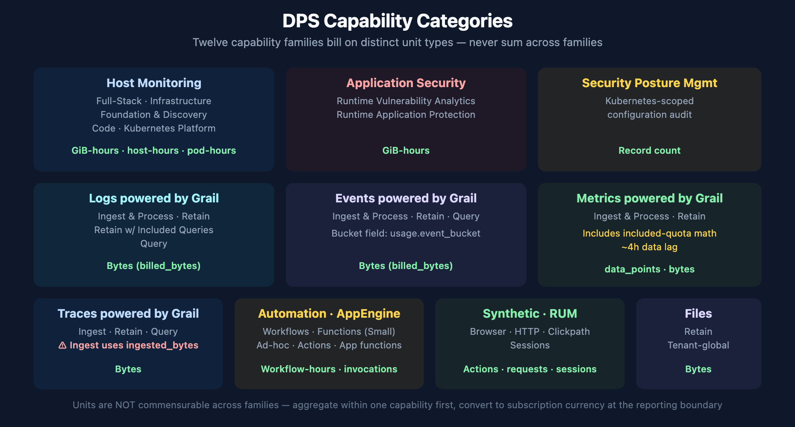
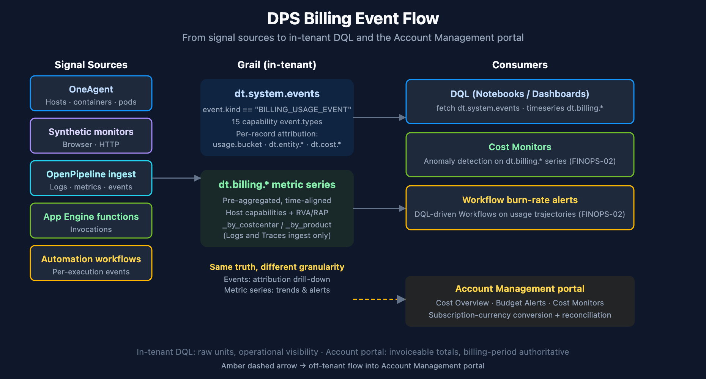
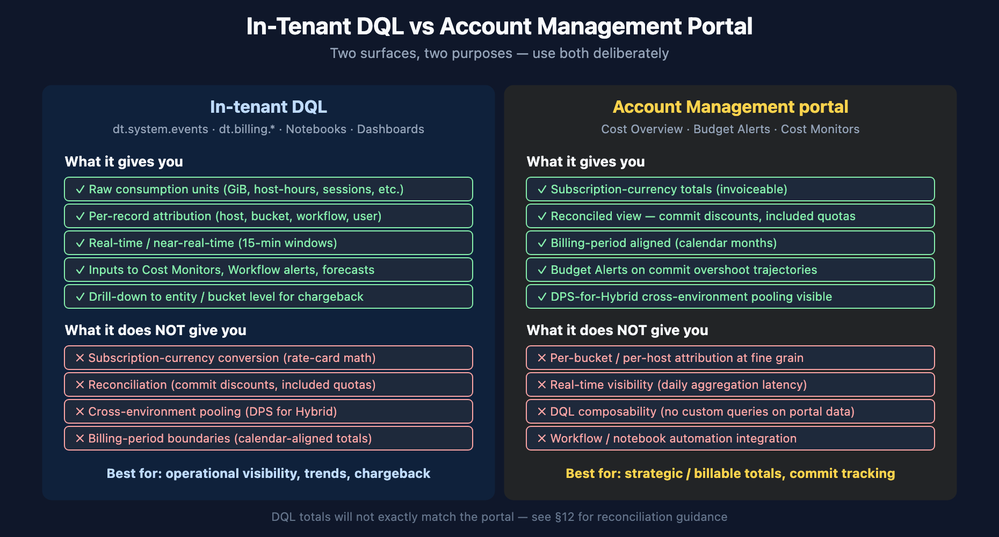

# FINOPS-01: DPS Capability Units and Querying Consumption with DQL

> **Series:** FINOPS — Cost Management & FinOps | **Reference:** 01 — DPS Capability Units and Querying Consumption with DQL | **Created:** May 2026 | **Last Updated:** 10/05/2026

## Overview

*"How much are we using, and where is it going?"* — the single most common DPS question, and the one customers most often answer by squinting at the Subscription portal once a month. This entry is the platform-engineer view of the same question: how DPS consumption is recorded inside the tenant, where the data lives in Grail, what the DQL canon looks like, and how to reconcile in-tenant numbers against the Account Management portal.

**Two surfaces, one truth.** Consumption data appears in two places: as raw per-record `BILLING_USAGE_EVENT` records in `dt.system.events`, and as pre-aggregated `dt.billing.*` metric series. They report the same underlying usage, but at different granularity — choose based on whether you need per-record attribution or fast time-aligned aggregates.

**Per-capability schemas.** There is no universal `billed_*` field. Each capability has its own unit field — `billed_gibibyte_hours` for Full-Stack, `billed_bytes` for log ingest, `data_points` for metrics, `billed_sessions` for RUM, and so on. Mixing units across capabilities is the most common authoring mistake. § 2 lists the unit for each capability.

> **Scope:** Dynatrace SaaS, DPS license model. Classic licensing surfaces some of the same consumption data — the linked Classic-license doc covers the equivalents. Anything called out as **Softened** evolves sprint-to-sprint; verify against current docs before signing off on a procurement review.

---

## Table of Contents

1. [Short Answer](#short-answer)
2. [The DPS Capability Model](#capability-model)
3. [Two Data Surfaces — `dt.system.events` and `dt.billing.*`](#data-surfaces)
4. [Mandatory Patterns — `dedup`, `event.kind`, `billing_type`](#mandatory-patterns)
5. [Querying Host-Based Capabilities](#host-based)
6. [Querying Byte-Based Capabilities](#byte-based)
7. [Querying Count-Based Capabilities](#count-based)
8. [Metrics-Ingest with Included-Quota Subtraction](#metrics-ingest)
9. [Query-Side Billing — Chargeback by App and User](#query-side)
10. [Per-Bucket and Per-Cost-Center Attribution](#attribution)
11. [Common Pitfalls](#pitfalls)
12. [Validating Numbers Against Account Management](#validating)
13. [Bootstrap from the Ready-Made Usage Dashboards](#bootstrap)
14. [Recommended Approach](#recommendation)
15. [Summary and Next Steps](#summary)

---

## Prerequisites

| Requirement | Details |
|-------------|---------|
| **Dynatrace Environment** | SaaS on the Dynatrace Platform Subscription (DPS). Most queries also work on Classic licensing — output reflects DPS-equivalent usage. |
| **Permissions** | `storage:events:read` for `fetch dt.system.events`; `storage:metrics:read` for the `dt.billing.*` metric series; `account-management` role at the account level for cross-checking against the Subscription portal. |
| **Audience** | Platform / Observability Lead (primary); Executive / Procurement (TL;DR and §12). |
| **Related series** | ORGNZ (bucket strategy, retention), OPLOGS (sampling and ingestion control), AUTOM (Cost Allocation app deployment), ADOPT-05 (optimization roadmap and ROI framing). |
| **Companion FINOPS entries** | FINOPS-02 (forecasting + anomaly detection on consumption), FINOPS-03 (the Cut / Tune / Filter optimization decision framework). |

<a id="short-answer"></a>
## 1. Short Answer

| Question | One-line answer |
|----------|-----------------|
| Where does consumption data live? | Per-record: `fetch dt.system.events \| filter event.kind == "BILLING_USAGE_EVENT"`. Pre-aggregated: `timeseries <metric>(dt.billing.<capability>.usage)`. |
| What's the unit field? | Per capability — 7 distinct unit-field families. `billed_gibibyte_hours`, `billed_container_hours`, `billed_pod_hours`, `billed_bytes`, `ingested_bytes` (Traces-Ingest only), `data_points` (Metrics), `billed_synthetic_action_count`, `billed_http_request_count`, `billed_sessions`, `billed_invocations`, or record-count (Workflows). |
| What's the canonical filter pattern? | `event.kind == "BILLING_USAGE_EVENT"` then `dedup event.id` before any aggregation. |
| How do I attribute cost to a team or product? | Use the pre-aggregated `dt.billing.*_by_costcenter` / `_by_product` metric series (Logs and Traces only), or `expand dt.cost.costcenter` / `expand dt.cost.product` on the per-record events. Other capabilities attribute via `usage.bucket`, `dt.entity.host` (moving to `dt.smartscape.host` with SaaS 1.347), or `dt.entity.application`. |
| How fresh is the data? | Most capabilities update every 15 minutes (`usage.start` / `usage.end`). Metrics - Ingest lags by ~4 hours, so query timeframes shorter than 4 hours are incomplete. Automation Workflow uses 1-hour windows. |
| What's the account-level equivalent? | Account Management portal → Subscription → Cost Overview (billable totals), Budget Alerts (commit tracking), Cost Monitors (anomaly detection). The portal applies subscription-currency conversion + reconciliation logic that DQL does not. |
| When does DQL disagree with the portal? | Three typical causes: (a) portal converts raw units to subscription currency, DQL does not; (b) portal includes pending reconciliations; (c) time-zone or time-window alignment. See §12. |

> <sub>**Sources:** [Dynatrace Platform Subscription (DT docs)](https://docs.dynatrace.com/docs/shortlink/dynatrace-platform-subscription), [DPS Hosts capabilities (DT docs)](https://docs.dynatrace.com/docs/shortlink/dps-hosts), [Account Management portal (DT docs)](https://docs.dynatrace.com/docs/shortlink/account-management). The per-capability schema table is derived from live `dt.system.events` schema inspection on a SaaS tenant (2026-05-19) — the capability-to-unit table is in § 2.</sub>

<a id="capability-model"></a>
## 2. The DPS Capability Model



<!-- MARKDOWN_TABLE_ALTERNATIVE
| Category | Capabilities | Unit |
|----------|-------------|------|
| Host Monitoring | Full-Stack · Infrastructure · Foundation · Code · Kubernetes | GiB-hours · host-hours · pod-hours |
| Application Security | RVA · RAP | GiB-hours |
| Security Posture Management | Kubernetes-scoped audit | Record count |
| Logs powered by Grail | Ingest · Retain · Retain w/ Included Queries · Query | Bytes |
| Events powered by Grail | Ingest · Retain · Query | Bytes |
| Metrics powered by Grail | Ingest (with included-quota math) · Retain | data_points · Bytes |
| Traces powered by Grail | Ingest (ingested_bytes!) · Retain · Query | Bytes |
| Automation · AppEngine | Workflow · Functions (Small) | Workflow-hours · invocations |
| Synthetic · RUM | Browser · HTTP · Clickpath · Sessions | Actions · requests · sessions |
| Files | Retain (tenant-global) | Bytes |
| Data | Data Egress (forward to S3 / GCP / Azure) | Bytes (per-destination) |
Units are NOT commensurable — aggregate within one capability first.
-->

DPS bills along **capabilities** — discrete units of platform functionality, each with its own unit of measure and a price defined in the customer's rate card. Capabilities group into categories that match the official documentation taxonomy:

| Category | Capabilities | Unit |
|----------|-------------|------|
| **Host Monitoring** | Full-Stack Monitoring, Infrastructure Monitoring, Foundation & Discovery, Code Monitoring, Kubernetes Platform Monitoring | GiB-hours / host-hours / container-hours / pod-hours |
| **Application Security** | Runtime Vulnerability Analytics (RVA), Runtime Application Protection (RAP) | GiB-hours |
| **Security Posture Management** | Security Posture Management (Kubernetes-scoped) | Record count |
| **Logs powered by Grail** | Ingest & Process, Retain, Retain with Included Queries, Query | Bytes |
| **Events powered by Grail** | Ingest & Process, Retain, Query | Bytes |
| **Metrics powered by Grail** | Ingest & Process (with included-quota subtraction), Retain | Data points / Bytes |
| **Traces powered by Grail** | Ingest & Process, Retain, Query | Bytes (`ingested_bytes` for Ingest, `billed_bytes` for Retain/Query) |
| **Automation** | Automation Workflow | Workflow-hours (record count per hour) |
| **AppEngine Functions** | AppEngine Functions - Small (Ad-hoc, Actions, App functions) | Invocations |
| **Synthetic Monitoring** | Browser Monitor / Clickpath, HTTP Monitor | Synthetic actions / HTTP requests |
| **Real User Monitoring** | RUM session billing | Sessions |
| **Files** | Files - Retain | Bytes |
| **Data** | Data Egress (forward logs / metrics / events to AWS S3, GCP, Azure) | Bytes (uncompressed, counted per destination) |

### Why the unit families matter

A common analysis mistake is summing across capabilities — e.g., `total = sum(billed_bytes) + sum(billed_gibibyte_hours)`. The result is dimensionally meaningless. **Always aggregate within a single capability first**, convert to subscription currency at the reporting boundary, and only then combine totals if a single "how much" number is needed.

The conversion factors (units → subscription currency) are in the rate card attached to the customer's DPS agreement and are also surfaced in the Account Management portal's Cost Overview. They are not exposed via DQL — that's a deliberate separation. DQL gives raw consumption; the portal does the currency math.

> <sub>**Sources:** [Dynatrace Platform Subscription (DT docs)](https://docs.dynatrace.com/docs/shortlink/dynatrace-platform-subscription), [DPS Hosts (DT docs)](https://docs.dynatrace.com/docs/shortlink/dps-hosts), [DPS Application Security (DT docs)](https://docs.dynatrace.com/docs/shortlink/dps-appsec), [DPS Log Management (DT docs)](https://docs.dynatrace.com/docs/shortlink/dps-log-management), [DPS Metrics (DT docs)](https://docs.dynatrace.com/docs/shortlink/dps-metrics), [DPS Traces (DT docs)](https://docs.dynatrace.com/docs/shortlink/dps-traces), [DPS Automation (DT docs)](https://docs.dynatrace.com/docs/shortlink/dps-automation), [DPS AppEngine Functions (DT docs)](https://docs.dynatrace.com/docs/shortlink/dps-appfunctions). The per-capability category taxonomy matches the layout of the official [DPS Usage Details DEMO dashboard](https://docs.dynatrace.com/docs/shortlink/dynatrace-platform-subscription).</sub>

<a id="data-surfaces"></a>
## 3. Two Data Surfaces — `dt.system.events` and `dt.billing.*`



<!-- MARKDOWN_TABLE_ALTERNATIVE
| Stage | Component | Function |
|-------|-----------|----------|
| Signal sources | OneAgent · Synthetic · OpenPipeline · AppEngine · Workflows | Emit billable activity |
| In-tenant Grail | dt.system.events (per-record) · dt.billing.* (pre-aggregated metric series) | Same truth, different granularity |
| Consumers | DQL queries · Cost Monitors · Workflow burn-rate alerts | Operational visibility |
| Off-tenant (amber arrow) | Account Management portal — Cost Overview · Budget Alerts · Cost Monitors | Subscription-currency reconciliation |
-->

Consumption appears in two distinct Grail surfaces. They report the same underlying truth but at different granularity. The right choice depends on the question being asked.

### `dt.system.events` — per-record billing events

Every billable activity emits a record into `dt.system.events` with `event.kind == "BILLING_USAGE_EVENT"`. Records carry per-capability attribution (which host, which bucket, which workflow, which synthetic test). Fields vary per `event.type`.

Use this surface when you need:

- Per-host, per-bucket, per-test, per-workflow attribution
- Query-side billing (`Log Management & Analytics - Query`, `Events - Query`, `Traces - Query`) with `client.application_context` and `user.email`
- Capabilities that don't have a pre-aggregated metric series (Logs - Retain, Events, Metrics - Ingest, Synthetic, RUM, AppEngine, Automation Workflow)
- Custom chargeback expansion via `expand dt.cost.costcenter` / `dt.cost.product`

### `dt.billing.*` — pre-aggregated metric series

For host-based and security capabilities (plus pre-aggregated chargeback views for Logs and Traces), Dynatrace exposes first-class metric series. These are faster to query, naturally time-aligned, and ideal for dashboards and alerts.

| Metric series | Unit | Use |
|---------------|------|------|
| `dt.billing.full_stack_monitoring.usage` | GiB-hours | Full-Stack hourly trend |
| `dt.billing.infrastructure_monitoring.usage` | host-hours | Infrastructure hourly trend |
| `dt.billing.foundation_and_discovery.usage` | host-hours | Discovery-tier hourly trend |
| `dt.billing.code_monitoring.usage` | container-hours | Code Monitoring hourly trend |
| `dt.billing.kubernetes_monitoring.usage` | pod-hours | K8s Platform hourly trend |
| `dt.billing.runtime_vulnerability_analytics.usage` | GiB-hours | RVA hourly trend |
| `dt.billing.runtime_application_protection.usage` | GiB-hours | RAP hourly trend |
| `dt.billing.logs.ingest.usage_by_costcenter` | bytes | Log Ingest chargeback by cost center |
| `dt.billing.logs.ingest.usage_by_product` | bytes | Log Ingest chargeback by product |
| `dt.billing.traces.ingest.usage_by_costcenter` | bytes | Trace Ingest chargeback by cost center |
| `dt.billing.traces.ingest.usage_by_product` | bytes | Trace Ingest chargeback by product |

Use this surface when you need:

- Fast hourly / daily trends without raw-record aggregation overhead
- Dashboard tiles and Davis analyzer inputs
- Pre-aggregated cost-center / product views (Logs, Traces)
- Forecast inputs for Davis Predictive AI (FINOPS-02 deep-dives this)

### Decision

In community practice, the split that works is: if your question is *"how much did capability X cost over time?"* — use `dt.billing.*`. If your question is *"who is consuming what?"* or *"which bucket / host / workflow drove the cost?"* — use `dt.system.events`. Many dashboards combine both: `dt.billing.*` for the top-line trend, `dt.system.events` for drill-down attribution.

> <sub>**Sources:** Both surfaces verified live on a SaaS tenant (2026-05-19) — the `dt.billing.*` metric catalog returned 13 series; `fetch dt.system.events | filter event.kind == "BILLING_USAGE_EVENT"` returned 15 distinct `event.type` values across 7 unit-field families. § 2 carries the capability-to-unit table.</sub>

<a id="mandatory-patterns"></a>
## 4. Mandatory Patterns — `dedup`, `event.kind`, `billing_type`

Two patterns belong in every DPS consumption query, and a third applies to AppEngine Functions. Skipping them produces results that look reasonable but are wrong.

### `dedup event.id` before any aggregation

Dynatrace documents the reason: *"Dynatrace refreshes metering records when correcting measurements."* Without dedup, the same consumption period is counted more than once — Dynatrace's own tutorials put the inflation at 10–30%. The canonical pattern is:

```
fetch dt.system.events
| filter event.kind == "BILLING_USAGE_EVENT"
| filter event.type == "<capability>"
| dedup event.id      // ← every aggregation chain starts here
| summarize ...
```

Dynatrace's cost tutorials call it mandatory in every billing query. In community practice it is also the pattern most often missing from queries passed around between teams — when adapting a community query, verify the dedup is present.

### Always filter on `event.kind`

`dt.system.events` contains many other event kinds beyond billing. Without `filter event.kind == "BILLING_USAGE_EVENT"`, you'll mix billing records with diagnostic events, audit events, and other platform-internal data.

### `billing_type` on AppEngine — exclude non-billable, keep null

**AppEngine Functions - Small** records can carry a `billing_type`, but the field is optional and is often empty. Exclude records explicitly marked non-billable and keep the ones with no value: `billing_type == "BILLABLE" or isNull(billing_type)`. Dynatrace's own AppEngine consumption queries use exactly that form. A strict `billing_type == "BILLABLE"` drops every record whose field is empty and returns **zero rows with no warning** — on the validation tenant (10/05/2026) all 60 AppEngine records in 30 days had a null `billing_type`, so the strict filter reported no AppEngine usage at all.

### `usage.bucket` vs `usage.event_bucket`

`usage.bucket` is present on every bucket-scoped capability observed, including all three Events capabilities. **Events - Ingest & Process** additionally carries `usage.event_bucket`; Events - Retain and Events - Query do not. Group by `usage.bucket`; when unifying across capabilities, `coalesce(usage.bucket, usage.event_bucket)` is a safe fold.

> <sub>**Sources:** [Trace a cost spike to its root cause (DT docs)](https://docs.dynatrace.com/docs/manage-your-costs/control/investigate-a-spike) — *"Dynatrace refreshes metering records when correcting measurements."*; every billing query in that tutorial and in [Forecast costs with run-rate projections (DT docs)](https://docs.dynatrace.com/docs/manage-your-costs/predict/project-run-rate) applies `filter event.kind == "BILLING_USAGE_EVENT"` and `dedup event.id`. [Calculate your consumption of AppEngine Functions (DT docs)](https://docs.dynatrace.com/docs/license/capabilities/appengine-functions/consumption-details) — both example queries filter on `(billing_type == "BILLABLE" OR isNull(billing_type))`. Field coverage read on a SaaS tenant 10/05/2026 (30 days): AppEngine `billing_type` null on 60/60 records; `usage.bucket` on 3,185/3,185 Events Ingest, 1,984/1,984 Events Retain and 8,871/8,871 Events Query records; `usage.event_bucket` on Events Ingest only.</sub>

<a id="host-based"></a>
## 5. Querying Host-Based Capabilities

Host-based capabilities are the easiest to query because of the pre-aggregated `dt.billing.*` metric series. For dashboards and trend views, prefer `timeseries` over `fetch dt.system.events` — it is faster, time-aligned, and the surface FINOPS-02 feeds to Davis forecast and anomaly analyzers.

**Worked example — Full-Stack Monitoring hourly usage:**

```dql
// Full-Stack Monitoring — hourly GiB-hours over the last 24 hours
timeseries hourlyUsage = sum(dt.billing.full_stack_monitoring.usage, rate:1h),
  from:-24h, interval:1h
```

The `rate:1h` parameter normalizes the metric to hourly rate regardless of the underlying ingestion interval. This is the canonical hourly-trend pattern from the official DEMO dashboard.

**Worked example — all host categories combined for a single hourly comparison:**

```dql
// All host-based capabilities, side-by-side hourly trend
timeseries {
  full_stack = sum(dt.billing.full_stack_monitoring.usage, rate:1h),
  infrastructure = sum(dt.billing.infrastructure_monitoring.usage, rate:1h),
  discovery = sum(dt.billing.foundation_and_discovery.usage, rate:1h),
  code = sum(dt.billing.code_monitoring.usage, rate:1h),
  k8s = sum(dt.billing.kubernetes_monitoring.usage, rate:1h)
  },
  from:-7d, interval:1h
```

**Worked example — per-host attribution for Full-Stack (which hosts are driving cost):**

> **SaaS 1.347 — staged tenant rollout; the release notes are still marked pre-release:** billing usage events are moving their host ID from `dt.entity.host` to `dt.smartscape.host`. Verbatim: *"If you use custom DQL queries that reference entity ID attributes in billing usage events, review and update them to the new Smartscape attribute names."* The query below reads `coalesce(toString(dt.smartscape.host), dt.entity.host)`, so it returns the same hosts before and after the change reaches your tenant (on the validation tenant both fields were written, with identical values, on 10/05/2026). [What's new in SaaS 1.347 (DT docs)](https://docs.dynatrace.com/docs/whats-new/saas/sprint-347). One trap when you filter on the new field: `dt.smartscape.host` is a `smartscape_id`, not a string, so `dt.smartscape.host == "HOST-…"` never matches and raises no error. Compare with `toSmartscapeId("HOST-…")`, or compare `toString(dt.smartscape.host)` (verified 10/05/2026: the string comparison returned `false` and both alternatives `true` for the same host).

```dql
// Top-spending hosts by Full-Stack Monitoring (uses per-record events for entity attribution)
fetch dt.system.events, from:-7d
| filter event.kind == "BILLING_USAGE_EVENT" and event.type == "Full-Stack Monitoring"
| dedup event.id
// SaaS 1.347 moves the host ID to dt.smartscape.host; coalesce reads whichever field your tenant writes.
| fieldsAdd host = coalesce(toString(dt.smartscape.host), dt.entity.host)
| summarize { total_gib_hours = sum(billed_gibibyte_hours) }, by:{ host }
| sort total_gib_hours desc
| limit 10
```

Notice the pattern split — when you need *trend* (line/bar over time), use `dt.billing.*`. When you need *attribution* (which entity drives cost), use `dt.system.events`. The two queries complement each other; many dashboards run both side-by-side.

> <sub>**Sources:** [DPS Hosts capabilities (DT docs)](https://docs.dynatrace.com/docs/shortlink/dps-hosts). All three queries verified live on a SaaS tenant (2026-05-19; the trend query re-run 10/05/2026 with its aggregations grouped in `{}`, no notifications); the first query returned real hourly Full-Stack values (e.g., 225.75 GiB-hours/hour during business hours, 162.25 GiB-hours/hour during off-hours).</sub>

<a id="byte-based"></a>
## 6. Querying Byte-Based Capabilities

Logs, Events, Traces, Files, and Data Egress all bill in bytes. Use `fetch dt.system.events` because the per-bucket (or, for egress, per-destination) attribution is essential for chargeback — but be aware of the field-name variation:

| Capability | Unit field | Bucket field |
|------------|-----------|--------------|
| Log Management & Analytics - Ingest & Process | `billed_bytes` | `usage.bucket` |
| Log Management & Analytics - Retain | `billed_bytes` | `usage.bucket` |
| Log Management & Analytics - Retain with Included Queries | `billed_bytes` | `usage.bucket` |
| Log Management & Analytics - Query | `billed_bytes` | (`query_start` instead) |
| Events - Ingest & Process | `billed_bytes` | `usage.bucket` (also `usage.event_bucket`) |
| Events - Retain | `billed_bytes` | `usage.bucket` |
| Events - Query | `billed_bytes` | `usage.bucket` — one record per query per bucket read; time on `query_start` |
| **Traces - Ingest & Process** | **`ingested_bytes`** | `usage.bucket` |
| Traces - Retain | `billed_bytes` | `usage.bucket` |
| Traces - Query | `billed_bytes` | (`query_start` instead) |
| Files - Retain | `billed_bytes` | (none — tenant-global) |
| Data Egress | `billed_bytes` | (per-destination; uncompressed) |

**Traces - Ingest is the outlier** — it uses `ingested_bytes` instead of `billed_bytes`. This is the most common cross-capability footgun.

**Worked example — log ingest by bucket over the last 7 days:**

```dql
// Log Ingest & Process — total GiB ingested per bucket over last 7 days
fetch dt.system.events, from:-7d
| filter event.kind == "BILLING_USAGE_EVENT"
| filter event.type == "Log Management & Analytics - Ingest & Process"
| dedup event.id
| summarize { total_gib = sum(toDouble(billed_bytes)) / 1073741824 }, by:{ usage.bucket }
| sort total_gib desc
| limit 20
```

The `/ 1073741824` divisor converts bytes → GiB (`1024^3`). On a SaaS validation tenant this returned real per-bucket numbers (e.g., `easytrade` 18.5 GiB / 7 days, `default_logs` 8.8 GiB / 7 days).

**Worked example — Trace Ingest using the `ingested_bytes` field:**

```dql
// Trace Ingest — note ingested_bytes, NOT billed_bytes
fetch dt.system.events, from:-7d
| filter event.kind == "BILLING_USAGE_EVENT"
| filter event.type == "Traces - Ingest & Process"
| dedup event.id
| summarize { total_gib = sum(toDouble(ingested_bytes)) / 1073741824 }, by:{ usage.bucket }
| sort total_gib desc
```

**Worked example — hourly log retention bytes per bucket (the canonical area-chart pattern from the DEMO dashboard):**

```dql
// Log Retain — hourly bytes per bucket, area-chart input
fetch dt.system.events, from:-7d
| filter event.kind == "BILLING_USAGE_EVENT"
| filter event.type == "Log Management & Analytics - Retain"
| dedup event.id
| fieldsAdd billing_period = bin(timestamp, 1h)
| fields billing_period, billed_bytes, usage.bucket = coalesce(usage.bucket, usage.event_bucket)
| makeTimeseries billed_bytes = max(billed_bytes), by:{ usage.bucket }, time: billing_period, interval:1h
```

Retention queries use `max(billed_bytes)` rather than `sum()` because each hour's record carries the *cumulative* bucket size — taking the max within the bucket gives the high-water mark for that hour. Summing would double-count.

### Data Egress — forwarding data out of Dynatrace

**Data Egress** is a distinct DPS capability that bills when you forward data (logs, metrics, or events) *out* of Dynatrace to an external destination — currently **AWS S3, GCP, and Azure**. It bills in bytes (`billed_bytes`) measured on the **uncompressed** size, and is counted **once per destination**: routing the same data to N destinations multiplies consumption N×. List price is **$0.15 / GiB** at the time of writing — your rate card may differ.

```
// Data Egress — total GiB forwarded to external destinations over last 7 days
// Doc-cited shape (event.type "Data Egress", billed_bytes); validate in your tenant once egress is configured
fetch dt.system.events, from:-7d
| filter event.kind == "BILLING_USAGE_EVENT"
| filter event.type == "Data Egress"
| dedup event.id
| summarize { total_gib = sum(toDouble(billed_bytes)) / 1073741824 }
```

The account-level equivalent is **Account Management → Subscription → Overview → Cost and usage details → Usage summary → Data Egress**, or the Account Management API `GET /subscriptions/{subscriptionId}/usage`. Because forwarding *is* the cost driver, the optimization levers are *filter before you forward* and *minimize the destination count* — the same shape as the FINOPS-03 Cut / Tune / Filter framework.


> <sub>**Sources:** [DPS Log Management (DT docs)](https://docs.dynatrace.com/docs/shortlink/dps-log-management), [DPS Events (DT docs)](https://docs.dynatrace.com/docs/shortlink/dps-events), [DPS Traces (DT docs)](https://docs.dynatrace.com/docs/shortlink/dps-traces), [Data Egress (DT docs)](https://docs.dynatrace.com/docs/license/capabilities/data/dps-data-egress). The hourly-area-chart pattern is lifted verbatim from the [DPS Usage Details DEMO dashboard](https://docs.dynatrace.com/docs/shortlink/dynatrace-platform-subscription) (Log-Retain tile). The Log / Trace / Retain queries are verified live on a SaaS tenant (2026-05-19); the **Data Egress query is doc-cited, not live-validated** — egress was not configured on the validation tenant, so verify the `event.type` and `billed_bytes` shape in your own tenant once forwarding is enabled.</sub>

<a id="count-based"></a>
## 7. Querying Count-Based Capabilities

Synthetic, RUM, AppEngine, and Automation Workflow bill on counts rather than bytes or hours. The query shape is similar across all four — replace the unit field appropriately.

| Capability | Unit field | Attribution |
|------------|-----------|-------------|
| Browser Monitor / Clickpath | `billed_synthetic_action_count` | `dt.entity.synthetic_test` |
| HTTP Monitor | `billed_http_request_count` | `dt.entity.http_check` |
| Real User Monitoring | `billed_sessions` | `dt.entity.application`, `device.type` |
| AppEngine Functions - Small | `billed_invocations` | `user.email`, `caller.app.id` |
| Automation Workflow | (record count — 1 per standard workflow per hour of existence) | `workflow.title`, `workflow.owner`, `workflow.trigger_type` |

**Automation Workflow records are workflow-hours, not executions.** A deployed standard workflow is billed for every hour it exists, whether it runs once a month or every minute, so execution frequency does not change this capability. Executions are billed elsewhere: each task run is an AppEngine Functions invocation, and any DQL a task runs bills the query capability it reads. Simple and draft-only workflows consume no workflow-hours.

**Worked example — workflow-hours by trigger type:**

```dql
// Automation Workflow — workflow-hours by trigger type (one record = one standard workflow existing for one hour)
fetch dt.system.events, from:-7d
| filter event.kind == "BILLING_USAGE_EVENT" and event.type == "Automation Workflow"
| dedup event.id
| summarize { workflow_hours = count(), workflows = countDistinctExact(workflow.id) }, by:{ workflow.trigger_type }
| sort workflow_hours desc
```

**Worked example — workflow-hours by owner (who owns the deployed standard workflows):**

```dql
// Workflow-hours by owner — candidates for review: delete unused standard workflows, or convert to simple / draft
fetch dt.system.events, from:-7d
| filter event.kind == "BILLING_USAGE_EVENT" and event.type == "Automation Workflow"
| dedup event.id
| summarize { workflow_hours = count(), workflows = countDistinctExact(workflow.id) }, by:{ workflow.owner, workflow.trigger_type }
| sort workflow_hours desc
| limit 10
```

**Worked example — AppEngine Functions by function type excluding records marked non-billable:**

```dql
// AppEngine Functions - Small — invocation count by function type
// (Ad-hoc = workflow-task invocations, Actions = workflow actions, App functions = standalone app code)
fetch dt.system.events, from:-7d
| filter event.type == "AppEngine Functions - Small"
| filter event.kind == "BILLING_USAGE_EVENT"
| filter billing_type == "BILLABLE" or isNull(billing_type)   // the field is often empty — keep nulls
| dedup event.id
| fieldsAdd category = if(matchesPhrase(function.type, "AD_HOC"), "Ad-hoc",
                       else: if(matchesPhrase(function.type, "ACTION"), "Actions",
                       else: if(matchesPhrase(function.type, "STANDARD"), "App functions")))
| summarize { invocations = sum(coalesce(toLong(billed_invocations), 1)) }, by:{ category }
| sort invocations desc
```

**Worked example — synthetic action consumption by test:**

```dql
// Synthetic Browser / Clickpath — action count by test (high-frequency monitors are review candidates)
fetch dt.system.events, from:-7d
| filter event.kind == "BILLING_USAGE_EVENT" and event.type == "Browser Monitor or Clickpath"
| dedup event.id
| summarize { actions = sum(toLong(billed_synthetic_action_count)) }, by:{ dt.entity.synthetic_test }
| sort actions desc
| limit 10
```

> <sub>**Sources:** [DPS Automation (DT docs)](https://docs.dynatrace.com/docs/shortlink/dps-automation), [DPS AppEngine Functions (DT docs)](https://docs.dynatrace.com/docs/shortlink/dps-appfunctions). [Calculate your consumption of Automation Workflow (DT docs)](https://docs.dynatrace.com/docs/license/capabilities/automation/automation) — *"Workflow hours are the number of hours that a workflow has existed in your environment, measured since the point of its creation."*; *"Simple workflows do not directly consume workflow hours"*; *"Each workflow execution triggers AppEngine functions that execute tasks."* [Calculate your consumption of AppEngine Functions (DT docs)](https://docs.dynatrace.com/docs/license/capabilities/appengine-functions/consumption-details) — the `billing_type` filter, `function.type` category mapping and `user.email` / `caller.app.id` attribution. Executed on a SaaS tenant 10/05/2026: every Automation Workflow record is unique per `workflow.id` and hour (21,954 workflow-hours, maximum 1 per hour); manual 10,920 workflow-hours / 65 workflows, schedule 8,232 / 49, event 2,802 / 17 over 7 days — 168 hours per workflow, run or not; the AppEngine query returned 60 Ad-hoc invocations over 30 days, where the strict `billing_type == "BILLABLE"` form returned none. Synthetic query verified 2026-05-19.</sub>

<a id="metrics-ingest"></a>
## 8. Metrics-Ingest with Included-Quota Subtraction

Metrics ingestion is the most subtle capability because it has **included quotas**. Each GiB of memory monitored under Full-Stack Monitoring grants 900 included metric data points per 15-minute interval; each host monitored under Infrastructure Monitoring grants 1,500. Billable Metrics-Ingest is *only the portion of total data points that exceeds the included allowance*.

This is the canonical query from the official DEMO dashboard — annotated:

```dql
// Metrics-Ingest — billable usage after included-quota subtraction
// (canonical pattern; tenant must have ≥4 hours of data; metrics billing lags by ~4 hours)
fetch dt.system.events, from:-7d
| filter event.kind == "BILLING_USAGE_EVENT" and event.type == "Metrics - Ingest & Process"
| dedup event.id
| fieldsAdd monitoring_source = if(monitoring_source == "fullstack" or monitoring_source == "infrastructure",
                                   monitoring_source, else: "other")
| summarize { total_data_points = toLong(sum(data_points)) }, by:{ usage.start, monitoring_source }
| makeTimeseries { total_usage = sum(total_data_points, default: 0) },
    interval:15m, time: usage.start, by:{ monitoring_source }
// Join in the included-quota allowance from dt.billing.*
// dt.billing.*.usage summed per 15-min bucket = GiB-hours (host-hours) in that bucket; × 4 → GiB (hosts);
// × 900 (Full-Stack, per GiB) / × 1500 (Infrastructure, per host) = included points per 15 min
| join [
    timeseries { included_usage = sum(dt.billing.full_stack_monitoring.usage, default: 0) },
      interval:15m, nonempty:true
    | fields monitoring_source = "fullstack", included_usage = 4 * 900 * included_usage[]
    | append [
        timeseries { included_usage = sum(dt.billing.infrastructure_monitoring.usage, default: 0) },
          interval:15m, nonempty:true
        | fields monitoring_source = "infrastructure", included_usage = 4 * 1500 * included_usage[]
      ]
  ], on:{ monitoring_source }, fields:{ included_usage }, kind:leftOuter
| fieldsAdd billed_usage = if(isNotNull(included_usage) and total_usage[] > included_usage[],
                              total_usage[] - included_usage[], else:0)
| fieldsAdd billed_usage = if(isNull(included_usage), total_usage, else: billed_usage)
| fieldsAdd billed_usage = arraySum(billed_usage)
| fieldsKeep monitoring_source, billed_usage
```

**Key elements:**

1. **`monitoring_source` rollup** — collapses fine-grained values into `fullstack`, `infrastructure`, or `other`. Other-source data points (e.g., custom metrics not tied to a host) have no included quota and are billed directly.
2. **15-minute interval** — matches Dynatrace's billing-event window. Don't change this.
3. **The `4 * 900` and `4 * 1500` factors** — a 15-minute bucket of `dt.billing.*.usage` holds GiB-hours (Full-Stack) or host-hours (Infrastructure); `× 4` converts that back to GiB or hosts. `900` is the included data points per GiB of memory per 15-minute interval for Full-Stack; `1500` is the included data points per host per 15-minute interval for Infrastructure. These constants are part of the platform billing model and should not be tuned per-customer.
4. **`kind: leftOuter`** — `other`-source data has no matching included quota; `leftOuter` keeps those rows with `null` included_usage; the next two `fieldsAdd` lines handle that case.
5. **The 4-hour lag** — Metrics-Ingest's `usage.start` is approximately 4 hours behind `timestamp`. Query timeframes shorter than 4 hours will show incomplete data. Always query at least the last 4 hours.

> <sub>**Sources:** Pattern lifted from the [DPS Usage Details DEMO dashboard](https://docs.dynatrace.com/docs/shortlink/dynatrace-platform-subscription) Metrics tile — verbatim including the `4 * 900` / `4 * 1500` constants. [DPS Metrics (DT docs)](https://docs.dynatrace.com/docs/shortlink/dps-metrics). [Full-Stack Monitoring (DT docs)](https://docs.dynatrace.com/docs/license/capabilities/app-infra-observability/full-stack-monitoring) — *"Every contributing GiB of host or application memory adds 900 custom metric data points in each 15-minute interval."* [Infrastructure Monitoring (DT docs)](https://docs.dynatrace.com/docs/license/capabilities/app-infra-observability/infrastructure-monitoring) — *"For each host, 1,500 custom metric data points are included in each 15-minute interval."* Re-executed 10/05/2026 (7 days, no notifications): `fullstack` billed 0, `other` billed 43,195,590 data points. The 4-hour lag caveat is verbatim from the demo dashboard's documentation tile. **Softened:** the `900` / `1500` constants are platform-billing-model values that may change in future DPS rate-card revisions — verify against current docs before relying on them in production reporting.</sub>

<a id="query-side"></a>
## 9. Query-Side Billing — Chargeback by App and User

Three Grail capabilities bill on **query execution** in addition to ingest and retention: Log Management, Events, and Traces. The query-side records carry rich attribution — which app made the query, which user, even which finer-grained source.

| Field | Meaning |
|-------|---------|
| `query_start` | When the query ran (use this for time-bucketing, not `timestamp`) |
| `client.source` | What issued the query — a dashboard URL, an anomaly detector, an automation workflow, or a platform service |
| `client.application_context` | Which app made the query — may be empty on billing records (see below) |
| `query_id` | The query; an Events - Query record is one query × one bucket, so count distinct `query_id`, not records |
| `user.email` | Who ran the query |
| `billed_bytes` | Bytes scanned by the query |

This is the foundation for chargeback by team — a Notebook that scans 50 GiB hourly is a different financial conversation than the same DQL pasted into a one-time investigation.

**Worked example — top query-side consumers by source and user (Logs and Events):**

```dql
// Top query-side consumers — bytes scanned by source and user (Logs and Events)
fetch dt.system.events, from:-30d
| filter event.kind == "BILLING_USAGE_EVENT"
| filter in(event.type, {"Log Management & Analytics - Query", "Events - Query"})
| dedup event.id
| summarize {
    gib_scanned = sum(toDouble(billed_bytes)) / 1073741824,
    query_count = countDistinctExact(query_id)
  }, by:{ event.type, client.source, user.email }
| sort gib_scanned desc
| limit 20
```

**Worked example — query-cost trend over time (use `query_start`, not `timestamp`):**

```dql
// Hourly log-query bytes scanned — bucketed by query_start (NOT timestamp)
fetch dt.system.events, from:-7d
| filter event.kind == "BILLING_USAGE_EVENT"
| filter event.type == "Log Management & Analytics - Query"
| dedup event.id
| summarize { data_read_bytes = sum(billed_bytes) }, by:{ startHour = bin(query_start, 1h) }
| sort startHour asc
```

The query above already covers Events; add Traces with `event.type == "Traces - Query"`. Two schema differences matter when you read the result. An **Events - Query** record is one query × one bucket — on the validation tenant one service user had 408 records for 204 queries over 30 days — so count `countDistinctExact(query_id)`, not records. **Log Management & Analytics - Query** records carry no bucket at all.

**`client.source` vs `client.application_context`.** `client.application_context` is documented on the billing event model but may be empty: on the validation tenant (10/05/2026) it was null on every one of 19,156 Log, Events and Digital Experience Monitoring query billing records in 30 days, and populated only on `QUERY_EXECUTION_EVENT` records (in reverse-DNS form such as `dynatrace.dashboards`). `client.source` carried the attribution on 10,277 of 10,280 Log Query and 8,460 of 8,871 Events Query records — there, one static-threshold anomaly detector accounted for 534 GiB of the 535 GiB of log-query scan. Dynatrace's own spike tutorial groups query billing by `client.source` for the same reason. A **null** `client.source` is not an error: it marks a query with no source context, typically platform-service traffic.

This is also how you settle the question *"does the Distributed Tracing or Services app consume Query DPS?"* for your own estate — swap the filter to `Traces - Query` and group by `client.source`. Two cautions before you read the result as an answer: query-side records are written **only when the capability is actually read**, so an empty result means nobody queried traces in the window, not that the app is free; and a tenant with little trace-query traffic can return nothing at all over 30 days. Widen the timeframe and confirm the capability is in use before drawing a conclusion either way.

> <sub>**Sources:** [Trace a cost spike to its root cause (DT docs)](https://docs.dynatrace.com/docs/manage-your-costs/control/investigate-a-spike) — *"For query billing events, client.source identifies who is scanning data."* Field coverage and the query above executed on a SaaS tenant 10/05/2026 (30 days; top row: Log Query, static-threshold detector, 534.3 GiB over 10,258 queries). [DPS Log Management (DT docs)](https://docs.dynatrace.com/docs/shortlink/dps-log-management), [DPS Events (DT docs)](https://docs.dynatrace.com/docs/shortlink/dps-events), [DPS Traces (DT docs)](https://docs.dynatrace.com/docs/shortlink/dps-traces). Query-side billing fires only when the capability is in active use — on validation tenants with light read traffic, these queries may return zero rows. Verify in your tenant before relying on them for chargeback reporting.</sub>

<a id="attribution"></a>
## 10. Per-Bucket and Per-Cost-Center Attribution

> **Davis AI events in custom buckets are now usage-tracked (SaaS 1.345, 08/11/2026 — staged rollout).** Reported as: Davis AI events are usage-tracked when routed to a bucket other than `default_davis_events`. **Flagged 09/02/2026 — could not be re-verified.** The wording was recorded here as a verbatim quote from the SaaS 1.345 release note, but it is not on that page today (checked two ways: text extraction and a rendered fetch), nor on 1.344, 1.346, or the DPS log-management page. The behaviour is plausible and the operational guidance below stands on its own, but **treat the sourcing as open** — confirm against your own consumption data before relying on the version gate. If you route Davis events to a custom bucket — a common move for retention or access-scoping — that traffic previously escaped ingest usage tracking and now appears in it. **Expect reported usage to rise without ingest volume changing**; the events were always being ingested, they just were not being counted. Budget alerts and month-over-month comparisons calibrated before the rollout will read as a step change, so re-baseline rather than investigating a phantom spike. A transient accounting artifact was also recorded here — one 15-minute timeframe showing less usage and the next showing more, with the total unchanged. **Same sourcing caveat as above:** this was recorded as a verbatim quote from the same release note and could not be re-verified there on 09/02/2026. Davis events left in `default_davis_events` are unaffected.
>
> <sub>Source: [What's new in Dynatrace SaaS 1.345 (DT docs)](https://docs.dynatrace.com/docs/whats-new/saas/sprint-345)</sub>

Three attribution surfaces exist, in increasing order of attribution power:

1. **`usage.bucket` / `usage.event_bucket`** — every byte-based capability includes the bucket name. Effective only if your bucket-naming convention encodes team / product / environment (covered in ORGNZ).
2. **`dt.cost.costcenter[]` / `dt.cost.product[]` arrays** — present on Metrics, Logs - Retain, and a few other capabilities. Each record carries an array of `{key, billed_bytes}` (or `{key, data_points}`) tuples — one per cost center or product the usage is allocated to.
3. **Pre-aggregated `dt.billing.*_by_costcenter` / `_by_product` metric series** — Dynatrace pre-computes the cost-center / product attribution for **Logs - Ingest** and **Traces - Ingest** and exposes them as standard metric series. Fastest to query.

**Worked example — hourly log ingest by cost center using the pre-aggregated metric:**

```dql
// Pre-aggregated log ingest by cost center — fast chargeback view
timeseries logs_by_cc = sum(dt.billing.logs.ingest.usage_by_costcenter),
  from:-7d, interval:1h, by:{ dt.cost.costcenter }
```

**Worked example — manual cost-center attribution via `expand`:**

When the pre-aggregated metric isn't available (Events, Logs - Retain, etc.), expand the per-record array manually:

```dql
// Manual cost-center attribution — Log Retain via expand
// Retain records are hourly snapshots of a cumulative size: sum across buckets within an hour, then average the hours
fetch dt.system.events, from:-24h
| filter event.kind == "BILLING_USAGE_EVENT"
| filter event.type == "Log Management & Analytics - Retain"
| dedup event.id
| expand dt.cost.costcenter
| fieldsAdd costcenter = dt.cost.costcenter[`key`],
            cc_bytes = toDouble(dt.cost.costcenter[`billed_bytes`]),
            hour = bin(timestamp, 1h)
| summarize { hourly_bytes = sum(cc_bytes) }, by:{ costcenter, hour }
| summarize { avg_retained_gib = avg(hourly_bytes) / 1073741824 }, by:{ costcenter }
| sort avg_retained_gib desc
```

Retain is the case where pitfall #6 bites after an `expand`: each record is an hourly snapshot of the bucket's retained size, so summing a day of records multiplies the stored volume by 24. On a validation tenant (10/05/2026) this query returned two cost centers: `unassigned` (~16 TiB retained on average over the day) and `not-allowlisted` (~0.4 TiB); a plain `sum()` over the same day read 383,119 GiB — 24× too high. The `unassigned` bucket is universal — every tenant has it, and reducing its share by populating proper cost-center labels at ingest time is the upstream lever.

**Defining cost-center / product labels:** The values come from data ingested with `dt.cost.costcenter` and `dt.cost.product` attributes — typically applied via OneAgent host properties (covered in the FAQ series entry on tagging sources, standards, and strategy) or via OpenPipeline enrichment rules at ingest. Where host-group granularity is enough, Dynatrace names a preferred route: *"If cost attribution at the host group level is sufficient, the preferred approach is to map deployment-level primary Grail fields such as dt.host_group.id or host.name to dt.cost.costcenter and dt.cost.product via the Cost Allocation stage in OpenPipeline."* Use host tags or `DT_TAGS` when you need finer granularity than the host group. Reducing the `unassigned` share is part of the FINOPS-03 optimization framework.

> <sub>**Sources:** [Configure cost allocation (DT docs)](https://docs.dynatrace.com/docs/manage/tags/tags-cost-allocation) — the host-group route quoted above. [DPS Log Management (DT docs)](https://docs.dynatrace.com/docs/shortlink/dps-log-management) — covers cost-center / product attribution semantics. The `dt.billing.logs.ingest.usage_by_costcenter` and `dt.billing.traces.ingest.usage_by_costcenter` metric series are documented in the same shortlink. Both queries verified live on a SaaS tenant (2026-05-19); the manual-expand query re-executed 10/05/2026 (no notifications) with the results above.</sub>

<a id="pitfalls"></a>
## 11. Common Pitfalls

| # | Pitfall | What goes wrong | Fix |
|---|---------|-----------------|-----|
| 1 | Missing `dedup event.id` | The same consumption period counted more than once when metering records are refreshed — 10–30% high | Add `dedup event.id` immediately after `filter event.kind == "BILLING_USAGE_EVENT"` |
| 2 | Assuming `billed_bytes` is universal | Trace Ingest returns NULL — query silently shows zero | Trace Ingest uses `ingested_bytes`; check the unit for each capability in § 2 |
| 3 | Summing across capabilities | Combining `billed_bytes + billed_gibibyte_hours` produces dimensional nonsense | Aggregate within one `event.type`, convert to currency at the reporting boundary |
| 4 | Filtering on `dt.security_context` for attribution | The field is literally `"BILLING_USAGE_EVENT"` on every record | Use `usage.bucket`, `dt.entity.host` (moving to `dt.smartscape.host` with SaaS 1.347), or `dt.cost.costcenter[]` for attribution |
| 5 | Short timeframes on Metrics-Ingest | Last 4 hours are incomplete — under-reports consumption | Always query Metrics-Ingest with at least 4 hours of timeframe |
| 6 | Using `sum()` on retention bytes | Each hourly record carries the cumulative bucket size; summing inflates by 24× per day | Use `max(billed_bytes)` for Retain event types; `sum()` is correct for Ingest |
| 7 | Forgetting the included-quota subtraction for Metrics-Ingest | Over-reports billable metric consumption by the included allowance | Use the canonical query in §8; the included-quota math is non-trivial |
| 8 | Bucketing query-side billing on `timestamp` | Misaligns with actual query execution time | Bucket on `query_start` for query-side billing events |
| 9 | Grouping Events Retain / Query by `usage.event_bucket` | A single null row — only Events Ingest carries `usage.event_bucket` | Group by `usage.bucket`; `coalesce(usage.bucket, usage.event_bucket)` for cross-capability work |
| 10 | Strict `billing_type == "BILLABLE"` on AppEngine | The field is often null, so the filter drops every record and reports zero usage | `billing_type == "BILLABLE" or isNull(billing_type)` — Dynatrace's own AppEngine queries keep nulls |

> <sub>**Sources:** [Trace a cost spike to its root cause (DT docs)](https://docs.dynatrace.com/docs/manage-your-costs/control/investigate-a-spike) — lists *"Missing dedup event.id"* as a common investigation mistake (pitfall #1). Pitfalls #2–#8 come from live tenant validation against the DPS Usage Details DEMO dashboard's queries (2026-05-19); #9 and #10 were re-read on a SaaS tenant 10/05/2026, and #10's fix is the filter in [Calculate your consumption of AppEngine Functions (DT docs)](https://docs.dynatrace.com/docs/license/capabilities/appengine-functions/consumption-details).</sub>

<a id="validating"></a>
## 12. Validating Numbers Against Account Management



<!-- MARKDOWN_TABLE_ALTERNATIVE
| Surface | Best for | Gives | Doesn't give |
|---------|----------|-------|---------------|
| In-tenant DQL | Operational visibility, trends, chargeback | Raw units, per-record attribution, real-time, drill-down | Subscription currency, reconciliation, billing-period totals |
| Account portal | Strategic billable totals, commit tracking | Subscription currency, reconciled view, billing-period aligned, budget tracking | Fine-grained attribution, real-time, DQL composability |
DQL totals will not exactly match the portal — see this section for reconciliation guidance.
-->

DQL totals will not exactly match the Subscription portal's Cost Overview. This is not a bug — they measure overlapping but distinct things. Three reconciliation factors:

### Factor 1 — Subscription-currency conversion

DQL returns **raw units** (GiB, host-hours, sessions, invocations). The portal applies **rate-card conversion** to express usage in subscription currency. The conversion factors are not exposed in DQL by design — they belong to the agreement, not the tenant.

Host capabilities are metered in 15-minute intervals, and an interval with less than 15 minutes of monitoring is rounded up to 15 minutes. The rounding is per 15-minute interval — the same interval the in-tenant host records cover — so it is reflected in `billed_gibibyte_hours` rather than applied later in the portal, and it is not a source of DQL-vs-portal drift.

**Practical implication:** If you need a subscription-currency total, the portal's Cost Overview is the authoritative source. DQL is for *operational visibility* (what's consuming what, where is the trend going), not *invoiceable totals*.

### Factor 2 — Reconciliation lag

The portal applies post-hoc reconciliation: included quotas, cross-environment commits (DPS for Hybrid), and certain capability-specific true-ups. These adjustments land in the portal but do not modify the per-record `dt.system.events` data.

**Practical implication:** Daily DQL totals will usually be *higher* than the portal's recognized billable totals — DQL counts everything; the portal subtracts included quotas and may apply commitment discounts.

### Factor 3 — Time-window alignment

The portal aligns to billing-period boundaries (typically calendar months in the customer's contract time zone). DQL aligns to whatever time range you query. For monthly reconciliation, query `from:` and `to:` exactly matched to the billing-period start/end in the contract time zone.

Additionally, **Metrics-Ingest has a ~4-hour data lag** — the portal incorporates a corrected view once the lag closes, but a same-day DQL total will under-report metrics specifically.

### When the gap is large

If your DQL total deviates from the portal by more than ~15% for the same period after accounting for the three factors above, investigate:

- Are you missing capabilities? List the `event.type` values your tenant actually emits — `fetch dt.system.events, from:-30d | filter event.kind == "BILLING_USAGE_EVENT" | summarize n = count(), by:{event.type}` — and check that each one is covered by a query.
- Is `dedup event.id` present? Missing dedup inflates totals — Dynatrace's tutorials put it at 10–30%.
- Are retention queries using `sum()` where they should use `max()`? (Pitfall #6.)
- For Metrics-Ingest, did you subtract included quotas? (Section 8.)
- For Traces - Ingest, are you reading `ingested_bytes`? Reading `billed_bytes` returns nothing.

> <sub>**Sources:** [Account Management portal (DT docs)](https://docs.dynatrace.com/docs/shortlink/account-management), [Forecast costs with run-rate projections (DT docs)](https://docs.dynatrace.com/docs/manage-your-costs/predict/project-run-rate) — the 10–30% dedup figure. [Full-Stack Monitoring (DT docs)](https://docs.dynatrace.com/docs/license/capabilities/app-infra-observability/full-stack-monitoring) — *"When a host or container is monitored for fewer than 15 minutes in an interval, GiB-hour consumption is rounded up to 15 minutes before consumption is calculated."* **Derived:** Full-Stack billing records span 900 s, and on a SaaS tenant (10/05/2026) their 24-hour sum (4,026 GiB-h) matched `dt.billing.full_stack_monitoring.usage` (3,984 GiB-h) within about 1%, so the rounding is in the records DQL reads. **Softened:** the specific reconciliation factors the portal applies (commitment discounts, true-ups, DPS-for-Hybrid pooling) evolve per-contract — the three factors above are the generally observable categories, not an exhaustive list of every portal-side adjustment.</sub>

<a id="bootstrap"></a>
## 13. Bootstrap from the Ready-Made Usage Dashboards

Dynatrace ships ready-made **usage dashboards** built on the same billing events this notebook queries: **Usage - Overview** (every rate-card capability, trend, and cost-center breakdown) plus drill-downs — **Usage - Traces**, **Usage - Logs**, **Usage - Metrics**, and **Usage - Full-Stack**. They are the fastest way to get started:

1. In Dynatrace, go to **Dashboards → Ready-made** and search for **Usage - Overview**. Viewing them needs `storage:system:read`.
2. Ready-made dashboards are read-only — save a copy to get an editable version in your tenant.
3. Customize the cost-center / product groupings to match your bucket-naming or `dt.cost.*` labels.
4. Set the timeframe to align with your billing period (see §12).
5. Use the dashboards as the operational view; use this notebook as the query reference when you need to extend or debug.

The queries in §§5–9 were originally adapted from the tiles of the **DPS Usage Details DEMO dashboard**, which earlier revisions of this entry described as linked from the License overview. That page (re-read 09/28/2026) no longer links it, so treat the ready-made Usage dashboards above as the maintained starting point and cross-check the §§5–9 patterns against their tiles when they change.

> <sub>**Sources:** [Ready-made usage dashboards (DT docs)](https://docs.dynatrace.com/docs/manage-your-costs/view/usage-dashboards) — the data *"includes billing usage events and query execution events"*; [Ready-made dashboards (DT docs)](https://docs.dynatrace.com/docs/analyze-explore-automate/dashboards-and-notebooks/ready-made-documents/ready-made-dashboards) — *"Save a copy and customize your copy"*.</sub>

<a id="recommendation"></a>
## 14. Recommended Approach

A workable plan for putting in-tenant consumption visibility in place:

1. **Start with the ready-made Usage dashboards** (§13). Save a copy, customize it, and make it your team's standing consumption view — the one you open most days. Set its refresh cadence to match how often the numbers are actually acted on (daily review does not need a 1-minute refresh); FINOPS-03 §4 covers why dashboard refresh rate is itself a consumption lever on Logs, Events, and Traces.
2. **Adopt the three mandatory patterns** (§4) — `dedup event.id`, `event.kind` filter, and on AppEngine `billing_type == "BILLABLE" or isNull(billing_type)`. Audit any consumption query in your tenant against these before trusting its numbers.
3. **Use the right surface for the question**: `dt.billing.*` for trends and Davis analyzer inputs; `dt.system.events` for attribution and chargeback.
4. **Pre-aggregated chargeback first.** For Logs and Traces ingest, use `dt.billing.*_by_costcenter` / `_by_product` before reaching for `expand dt.cost.costcenter`. It's faster and cleaner.
5. **Set realistic reconciliation expectations.** DQL totals are not invoiceable. The portal is authoritative for billing-period totals; DQL is authoritative for operational visibility.
6. **Reduce the `unassigned` cost-center share** at ingest time, not at query time. The OpenPipeline / OneAgent enrichment patterns covered in ORGNZ and FAQ-02 are the upstream lever.
7. **Pair with FINOPS-02 for forecasting** (when will we hit commit?) and **FINOPS-03 for optimization** (what should we cut, tune, or filter?). FINOPS-01 is the *what is being used* foundation; the next two entries are *what will be used* and *what should change*.

<a id="summary"></a>
## Summary

DPS consumption lives in two places — per-record in `dt.system.events` and pre-aggregated in `dt.billing.*`. The schema is per-capability with seven distinct unit-field families, and the three non-negotiable patterns (`dedup event.id`, `event.kind` filter, and the null-tolerant `billing_type` filter on AppEngine) appear in every well-formed query. The ready-made Usage dashboards are the bootstrap; the queries in §§5–9 are the building blocks. DQL totals will not exactly match the Subscription portal, and that is by design — the portal does subscription-currency conversion and reconciliation that DQL does not. Use both surfaces deliberately.

## Next Steps

- Read **FINOPS-02** for forecasting and anomaly detection on top of the queries in this entry — including Cost Monitors, Davis Predictive AI on `dt.billing.*` metrics, and Workflow-based burn-rate alerting.
- Read **FINOPS-03** for the Cut / Tune / Filter optimization decision framework — once you know what's being consumed (FINOPS-01), the next question is what to do about it.
- Read the **ORGNZ** topic series for bucket strategy and retention policy design — the upstream lever for byte-based capability attribution.
- Read **OPLOGS** for OpenPipeline sampling and filter patterns — the upstream lever for log ingest reduction.
- Open the [Account Management portal](https://docs.dynatrace.com/docs/shortlink/account-management) and run the Cost Overview alongside your DQL totals for one billing period to develop intuition for the reconciliation factors in §12.

---

<sub>*This notebook was AI-generated from community-submitted and publicly available sources. This notebook series is not officially supported by Dynatrace. Always verify information against official [Dynatrace documentation](https://docs.dynatrace.com/docs).*</sub>
