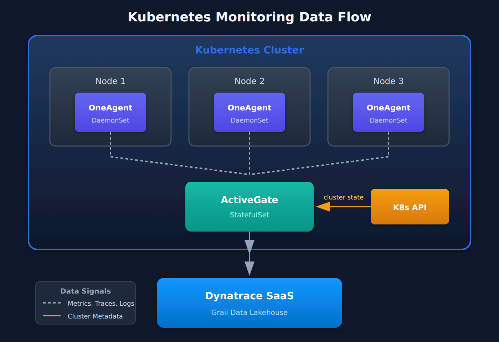
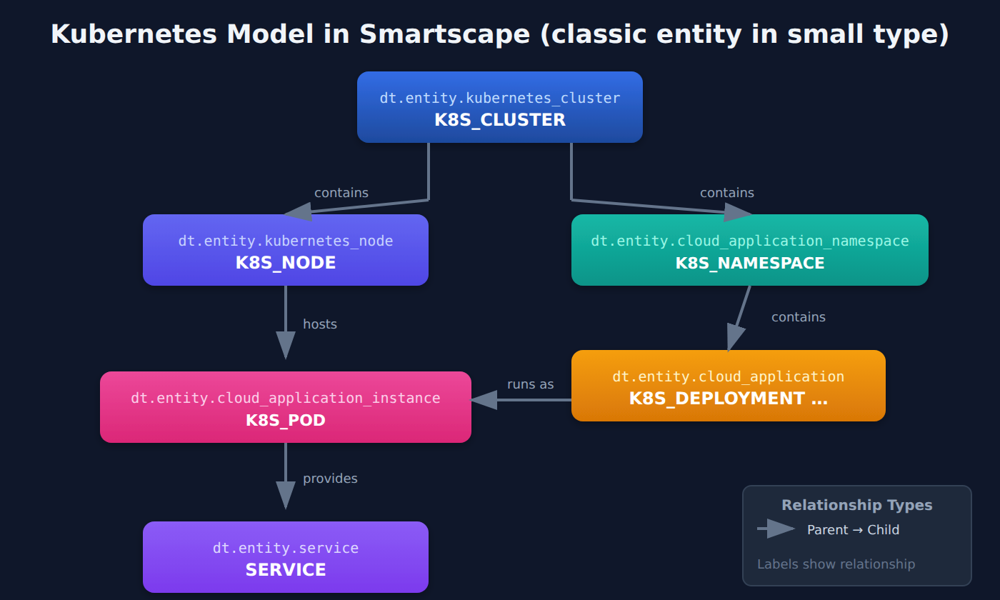

# K8S-01: Kubernetes Monitoring Fundamentals

> **Series:** K8S — Kubernetes Monitoring | **Notebook:** 1 of 14 | **Created:** January 2026 | **Last Updated:** 10/02/2026

## Introduction to Kubernetes Observability with Dynatrace
Kubernetes introduces unique observability challenges: ephemeral workloads, dynamic scaling, complex networking, and multi-layer abstractions. Dynatrace provides comprehensive Kubernetes monitoring through the DynaKube operator, which deploys and manages monitoring components automatically.

---

## Table of Contents

1. [Kubernetes Observability Challenges](#kubernetes-observability-challenges)
2. [Dynatrace Monitoring Architecture](#dynatrace-monitoring-architecture)
3. [Entity Model for Kubernetes](#entity-model-for-kubernetes)
4. [Data Sources and Signals](#data-sources-and-signals)
5. [Key Metrics and Dimensions](#key-metrics-and-dimensions)
6. [Your First Kubernetes Queries](#your-first-kubernetes-queries)
7. [Next Steps](#next-steps)

---

## Prerequisites

| Requirement | Details |
|-------------|----------|
| **Dynatrace Environment** | SaaS with Kubernetes monitoring enabled |
| **Kubernetes Cluster** | Any distribution (EKS, AKS, GKE, OpenShift, etc.) |
| **Permissions** | To run the queries: `storage:metrics:read`, `storage:events:read`, `storage:smartscape:read` (Smartscape nodes) — plus the bucket permissions for the data you query |
| **Knowledge** | Basic Kubernetes concepts (pods, deployments, services) |

<a id="kubernetes-observability-challenges"></a>
## 1. Kubernetes Observability Challenges
Kubernetes environments present unique monitoring requirements:

| Challenge | Description | Dynatrace Solution |
|-----------|-------------|--------------------|
| **Ephemeral Workloads** | Pods come and go constantly | Entity relationships preserved across restarts |
| **Dynamic Scaling** | Replicas change based on load | Automatic discovery of new instances |
| **Multi-Layer Stack** | Infra → K8s → App complexity | Unified view from cluster to code |
| **Distributed Services** | Microservices across namespaces | End-to-end distributed tracing |
| **Resource Constraints** | CPU/memory limits and requests | Resource utilization vs. limits monitoring |
| **Network Complexity** | Service mesh, ingress, CNI | Network flow and latency analysis |

### Traditional vs. Cloud-Native Monitoring

| Aspect | Traditional | Kubernetes |
|--------|-------------|------------|
| **Identity** | IP address, hostname | Labels, selectors, namespaces |
| **Lifecycle** | Long-lived servers | Short-lived pods |
| **Configuration** | Static files | Dynamic ConfigMaps, Secrets |
| **Networking** | Fixed topology | Service discovery, DNS |
| **Scaling** | Manual or scheduled | HPA, VPA, KEDA |

<a id="dynatrace-monitoring-architecture"></a>
## 2. Dynatrace Monitoring Architecture
Dynatrace monitors Kubernetes through multiple components:

### DynaKube Operator Components

| Component | Purpose | Deployment Mode |
|-----------|---------|------------------|
| **OneAgent** | Full-stack monitoring (processes, code) | DaemonSet or application-only |
| **ActiveGate** | Routing; `kubernetes-monitoring` capability queries the K8s API and cAdvisor | StatefulSet in cluster |
| **Prometheus Integration** | Custom metrics ingestion | Optional |

### Deployment Modes

| Mode | Use Case | OneAgent | Code Modules |
|------|----------|----------|---------------|
| **cloudNativeFullStack** | Full visibility, K8s-native | Privileged DaemonSet | Injected via webhook |
| **classicFullStack** (legacy) | Traditional deployment — avoid for new deployments | Privileged DaemonSet | Loaded from host |
| **applicationMonitoring** | App-only, no infra | None | Injected via webhook |
| **hostMonitoring** | Infra-only | DaemonSet | None |

### Data Flow



<!-- MARKDOWN_TABLE_ALTERNATIVE
| Component | Location | Function |
|-----------|----------|----------|
| OneAgent (DaemonSet) | Each Node | Collects metrics, traces, logs |
| ActiveGate (StatefulSet) | In Cluster | Routes data, monitors K8s API |
| K8s API | Control Plane | Provides cluster state metadata |
| Dynatrace SaaS (Grail) | Cloud | Stores and analyzes all telemetry |
For environments where SVG doesn't render
-->

<a id="entity-model-for-kubernetes"></a>
## 3. Entity Model for Kubernetes
Dynatrace creates entities for each Kubernetes resource and maintains relationships between them.

### Kubernetes Node Types (Smartscape)

Queries in this series use **Smartscape** node types (`smartscapeNodes "K8S_…"`). The classic `dt.entity.*` model they replace is shown for reference:

| Smartscape node type | Classic entity (`dt.entity.*`) | Represents |
|----------------------|--------------------------------|------------|
| `K8S_CLUSTER` | `kubernetes_cluster` | Cluster |
| `K8S_NODE` | `kubernetes_node` | Worker node |
| `K8S_NAMESPACE` | `cloud_application_namespace` | Namespace |
| `K8S_DEPLOYMENT`, `K8S_STATEFULSET`, `K8S_DAEMONSET`, `K8S_REPLICASET`, `K8S_JOB`, `K8S_CRONJOB` | `cloud_application` (one classic type for all) | Workloads |
| `K8S_POD` | `cloud_application_instance` | Pod |
| `K8S_SERVICE` | `kubernetes_service` | Kubernetes Service object |
| `SERVICE` | `service` | Detected application service |

Smartscape also models objects the classic model never had — `K8S_INGRESS`, `K8S_CONFIGMAP`, `K8S_PERSISTENTVOLUMECLAIM`, `K8S_HORIZONTALPODAUTOSCALER`, `K8S_DYNAKUBE` and more.

> <sub>**Dictionary:** `fetch dt.semantic_dictionary.models | filter data_object == "smartscape.nodes"` — 23 `K8S_*` node types and their `classic_models`, read 10/02/2026.</sub>

### Entity Relationships



<!-- MARKDOWN_TABLE_ALTERNATIVE
| Parent Entity | Relationship | Child Entity |
|---------------|--------------|--------------|
| KUBERNETES_CLUSTER | contains | KUBERNETES_NODE |
| KUBERNETES_CLUSTER | contains | CLOUD_APPLICATION_NAMESPACE |
| CLOUD_APPLICATION_NAMESPACE | contains | CLOUD_APPLICATION (workload) |
| CLOUD_APPLICATION | runs as | PROCESS_GROUP_INSTANCE (one per pod) |
| KUBERNETES_NODE | hosts | PROCESS_GROUP_INSTANCE |
| PROCESS_GROUP_INSTANCE | provides | SERVICE |
For environments where SVG doesn't render
-->

### Entity Naming

| Resource | Dynatrace Entity Name Pattern |
|----------|-------------------------------|
| Cluster | Cluster name from kubeconfig |
| Namespace | `namespace-name` |
| Deployment | `deployment-name` in namespace |
| Pod | `pod-name` (ephemeral, tied to PGI) |
| Service | Auto-detected from traffic patterns |

<a id="data-sources-and-signals"></a>
## 4. Data Sources and Signals
Dynatrace collects multiple signal types from Kubernetes:

### Metrics and Events

| Collector | What it gathers |
|-----------|-----------------|
| **ActiveGate** with the `kubernetes-monitoring` capability | Cluster topology and state from the Kubernetes API; node- and container-level metrics via cAdvisor; Kubernetes events |
| **OneAgent** (full-stack / host monitoring) | Host and process metrics, code-level traces |
| **Prometheus scraping** (optional) | Application metrics from annotated pods |

### Logs

| Log Type | Collected by | Use Case |
|----------|--------------|----------|
| **Container logs** (stdout/stderr) | Log module — integrated with OneAgent, or the standalone Kubernetes Log module | Application debugging |
| **Kubernetes events** | ActiveGate, from the Kubernetes API — stored as **events** (`event.provider == "KUBERNETES_EVENT"`), not logs | Scheduling, scaling, errors |
| **Node / system logs** | OneAgent log module | Infrastructure issues |

> <sub>**Sources:** [Kubernetes platform monitoring (DT docs)](https://docs.dynatrace.com/docs/ingest-from/setup-on-k8s/how-it-works/kubernetes-monitoring) — *"Uses the Kubernetes API and cAdvisor to get node- and container-level metrics and Kubernetes events"*; [Kubernetes log monitoring (DT docs)](https://docs.dynatrace.com/docs/ingest-from/setup-on-k8s/deployment/k8s-log-monitoring).</sub>

### Traces

| Trace Source | Coverage |
|--------------|----------|
| **OneAgent auto-instrumentation** | Supported languages/frameworks |
| **OpenTelemetry** | Custom instrumentation |
| **Service mesh** | Istio, Linkerd sidecars |

<a id="key-metrics-and-dimensions"></a>
## 5. Key Metrics and Dimensions
### Grail Metric Keys (what DQL queries)

| Metric | Grain | Description |
|--------|-------|-------------|
| `dt.kubernetes.container.cpu_usage` | Container | CPU used (millicores) |
| `dt.kubernetes.container.memory_working_set` | Container | Working-set memory (bytes) |
| `dt.kubernetes.container.cpu_throttled` | Container | CPU throttled |
| `dt.kubernetes.container.requests_cpu` / `.limits_cpu` | Container | CPU requests / limits |
| `dt.kubernetes.container.requests_memory` / `.limits_memory` | Container | Memory requests / limits |
| `dt.kubernetes.container.restarts` / `.oom_kills` | Container | Restarts and OOM kills (counts) |
| `dt.kubernetes.node.cpu_allocatable` / `.memory_allocatable` / `.pods_allocatable` | Node | Allocatable capacity |
| `dt.kubernetes.node.conditions` | Node | Node conditions |
| `dt.kubernetes.pods`, `dt.kubernetes.workloads`, `dt.kubernetes.nodes` | Cluster objects | Object counts |
| `dt.kubernetes.workload.pods_desired`, `dt.kubernetes.workload.conditions` | Workload | Desired pods, conditions |
| `dt.kubernetes.pod.network_received_data` / `_transmitted_data` | Pod | Network bytes |

> <sub>Key list read with `metrics | filter startsWith(metric.key, "dt.kubernetes")` on the validation tenant, 10/02/2026 (24 `dt.kubernetes.*` keys; OneAgent container keys are under `dt.containers.*`).</sub>

### Classic Metric Keys (Metrics API, Data Explorer)

| Metric | Description | Unit |
|--------|-------------|------|
| `builtin:containers.cpu.usagePercent` | CPU usage vs. limit | Percent |
| `builtin:containers.memory.usagePercent` | Memory usage vs. limit | Percent |
| `builtin:kubernetes.workload.requests_cpu` / `limits_cpu` | CPU requests / limits | Millicores |
| `builtin:kubernetes.workload.requests_memory` / `limits_memory` | Memory requests / limits | Bytes |

> **These are `builtin:` keys — the classic Metrics namespace, not Grail.** They are correct for the classic Metrics API, Data Explorer and classic dashboards, but **DQL reads Grail only**: `metrics | filter startsWith(metric.key, "builtin:")` returns **zero rows over 7 days** on a live tenant (08/11/2026), while `startsWith(metric.key, "dt.kubernetes")` returns 27 keys in the same command. A `timeseries avg(builtin:kubernetes.workload.requests_cpu)` therefore charts nothing and reports no error.
>
> For DQL, use the Grail equivalents — and note the **grain differs, not just the prefix**: Grail emits requests and limits at **container** grain (`dt.kubernetes.container.requests_cpu`, `.requests_memory`, `.limits_cpu`, `.limits_memory`), summed by you across `k8s.workload.name` to reach a workload figure. There is no `dt.kubernetes.workload.requests_*`. Full Grail key list and the derivation pattern: **K8S-08 §2**.

> **Request and limit metrics changed what they count in ActiveGate 1.343 / 1.345** — they carry an *effective* pod value: from 1.343 init containers are accounted for, and from 1.345 pod-level `spec.resources` (Kubernetes 1.34+) and pod `overhead` too, which can move a limit *down*. Reserved figures can step at either upgrade with no workload change; usage metrics are unaffected. This matters whenever you compare a request/limit trend across an upgrade boundary — see K8S-08 §2 before drawing capacity conclusions from one.

<a id="your-first-kubernetes-queries"></a>
## 6. Your First Kubernetes Queries
Let's explore common queries for Kubernetes monitoring.

```dql
// Verify Kubernetes clusters are reporting (smartscape topology)
smartscapeNodes "K8S_CLUSTER"
| fields entity.name = name, tags
| sort entity.name asc

// Legacy alternative (deprecated for new content):
// fetch dt.entity.kubernetes_cluster
// | fields entity.name, tags
// | sort entity.name asc

```

```dql
// Count Kubernetes nodes
smartscapeNodes "K8S_NODE"
| summarize nodeCount = count()

// Legacy alternative:
// fetch dt.entity.kubernetes_node
// | summarize nodeCount = count()

```

```dql
// List Kubernetes namespaces
smartscapeNodes "K8S_NAMESPACE"
| fields entity.name = name, tags
| sort entity.name asc
| limit 50

// Legacy alternative:
// fetch dt.entity.cloud_application_namespace
// | fields entity.name, tags
// | sort entity.name asc
// | limit 50

```

```dql
// Container CPU usage — highest consumers
// Sort on a scalar. `sort` on the timeseries array itself compares arrays element by element,
// so the order has nothing to do with the average — reduce with arrayAvg() first.
timeseries cpu = avg(dt.kubernetes.container.cpu_usage), from:-1h,
  by:{k8s.cluster.name, k8s.namespace.name, k8s.pod.name, k8s.container.name}
| fieldsAdd avgCpuMillicores = round(arrayAvg(cpu), decimals: 0)
| fields k8s.cluster.name, k8s.namespace.name, k8s.pod.name, k8s.container.name, avgCpuMillicores
| sort avgCpuMillicores desc
| limit 20
```

```dql
// Container memory usage approaching limits
// "Approaching the limit" needs the limit: compare working set with limits_memory per container.
// Containers with no memory limit drop out (limitMiB is null) — they cannot be OOM-killed for
// exceeding a limit, only by node pressure.
timeseries {
    used = avg(dt.kubernetes.container.memory_working_set),
    lim = avg(dt.kubernetes.container.limits_memory)
  }, from:-1h, by:{k8s.cluster.name, k8s.namespace.name, k8s.pod.name, k8s.container.name}
| fieldsAdd usedMiB = round(arrayAvg(used) / 1048576, decimals: 0),
            limitMiB = round(arrayAvg(lim) / 1048576, decimals: 0)
| filter limitMiB > 0
| fieldsAdd pctOfLimit = round(100 * usedMiB / limitMiB, decimals: 1)
| fields k8s.cluster.name, k8s.namespace.name, k8s.pod.name, k8s.container.name, usedMiB, limitMiB, pctOfLimit
| sort pctOfLimit desc
| limit 20
```

```dql
// Kubernetes events - recent warnings and errors
// Data object corrected 08/12/2026. Kubernetes events are NOT logs. This cell scraped
// `fetch logs` for `log.source` containing "kubernetes" or for content substrings like "BackOff" —
// no log.source matches, and kubelet event text is not in the log stream, so it returned nothing
// while the cluster emitted 231,296 Kubernetes events in the same window.
// They arrive as `fetch events | filter event.provider == "KUBERNETES_EVENT"`, STRUCTURED:
//   dt.kubernetes.event.reason            Unhealthy · BackOff · Killing · FailedScheduling ·
//                                         FailedMount · BackoffLimitExceeded · EvictionThresholdMet …
//   dt.kubernetes.event.message           the human-readable text
//   status                                "WARN" for Kubernetes Warning events, "INFO" for Normal
//   dt.kubernetes.event.involved_object.kind / .name
//   dt.kubernetes.event.count / .first_seen / .last_seen
//   plus k8s.cluster.name · k8s.namespace.name · k8s.pod.name · k8s.workload.name · k8s.node.name
// NOTE: event.type is CUSTOM_INFO on every one of these — it is NOT "Warning". The Warning/Normal
// split is in status ("WARN" / "INFO"). dt.kubernetes.event.important was "true" on all 204,078
// events over 30 days (10/02/2026), so it separates nothing. Enumerate reasons with:
//   fetch events, from:-24h | filter event.provider == "KUBERNETES_EVENT"
//   | summarize n = count(), by:{dt.kubernetes.event.reason} | sort n desc
fetch events, from:-1h
| filter event.provider == "KUBERNETES_EVENT"
| filter status == "WARN"
| fields timestamp, k8s.cluster.name, k8s.namespace.name, dt.kubernetes.event.reason, dt.kubernetes.event.message
| sort timestamp desc
| limit 25
```

```dql
// Pod restarts - find crashlooping workloads
// Data object corrected 08/12/2026. Kubernetes events are NOT logs. This cell scraped
// `fetch logs` for `log.source` containing "kubernetes" or for content substrings like "BackOff" —
// no log.source matches, and kubelet event text is not in the log stream, so it returned nothing
// while the cluster emitted 231,296 Kubernetes events in the same window.
// They arrive as `fetch events | filter event.provider == "KUBERNETES_EVENT"`, STRUCTURED:
//   dt.kubernetes.event.reason            Unhealthy · BackOff · Killing · FailedScheduling ·
//                                         FailedMount · BackoffLimitExceeded · EvictionThresholdMet …
//   dt.kubernetes.event.message           the human-readable text
//   status                                "WARN" for Kubernetes Warning events, "INFO" for Normal
//   dt.kubernetes.event.involved_object.kind / .name
//   dt.kubernetes.event.count / .first_seen / .last_seen
//   plus k8s.cluster.name · k8s.namespace.name · k8s.pod.name · k8s.workload.name · k8s.node.name
// NOTE: event.type is CUSTOM_INFO on every one of these — it is NOT "Warning". The Warning/Normal
// split is in status ("WARN" / "INFO"). dt.kubernetes.event.important was "true" on all 204,078
// events over 30 days (10/02/2026), so it separates nothing. Enumerate reasons with:
//   fetch events, from:-24h | filter event.provider == "KUBERNETES_EVENT"
//   | summarize n = count(), by:{dt.kubernetes.event.reason} | sort n desc
fetch events, from:-24h
| filter event.provider == "KUBERNETES_EVENT"
| filter in(dt.kubernetes.event.reason, {"BackOff", "BackoffLimitExceeded", "Killing"})
| summarize events = count(), by:{k8s.namespace.name, k8s.pod.name, dt.kubernetes.event.reason}
| sort events desc
| limit 25
```

<a id="next-steps"></a>
## 7. Next Steps

Now that you understand Kubernetes monitoring fundamentals, proceed to:

| Next Notebook | Topic |
|---------------|-------|
| **K8S-02: DynaKube Operator Deployment** | Install and configure the operator |
| **K8S-03: GitOps for DynaKube** | Manage DynaKube with ArgoCD/Flux |
| **K8S-04: Cluster Health Monitoring** | Deep-dive into cluster metrics |

---

## Summary

In this notebook, you learned:

- Kubernetes observability challenges and how Dynatrace addresses them
- Dynatrace monitoring architecture (OneAgent, ActiveGate, DynaKube)
- Entity model for Kubernetes resources
- Data sources: metrics, logs, and traces
- Key metrics for container and cluster monitoring
- Basic DQL queries for Kubernetes data using `smartscapeNodes` (modern) with `dt.entity.*` legacy alternatives shown as comments

---

## References

- [Setup on Kubernetes (DT docs)](https://docs.dynatrace.com/docs/ingest-from/setup-on-k8s) — top-level entry point for all K8s monitoring docs
- [How it works (DT docs)](https://docs.dynatrace.com/docs/ingest-from/setup-on-k8s/how-it-works) — architecture, components, and data flow
- [Quickstart (DT docs)](https://docs.dynatrace.com/docs/ingest-from/setup-on-k8s/quickstart) — minimum viable deployment
- [Reference (DT docs)](https://docs.dynatrace.com/docs/ingest-from/setup-on-k8s/reference) — DynaKube parameters, feature flags, network, security, storage, workload mutation
- [Dynatrace Operator (Dynatrace GitHub)](https://github.com/Dynatrace/dynatrace-operator) — source, releases, and Helm chart
- [Effective pod resources (DT docs)](https://docs.dynatrace.com/docs/observe/infrastructure-observability/kubernetes-app/reference/effective-pod-resources) — how request/limit metrics represent the enforced pod value

---

<sub>*This notebook was AI-generated from community-submitted and publicly available sources. This notebook series is not officially supported by Dynatrace. Always verify information against official Dynatrace documentation.*</sub>
