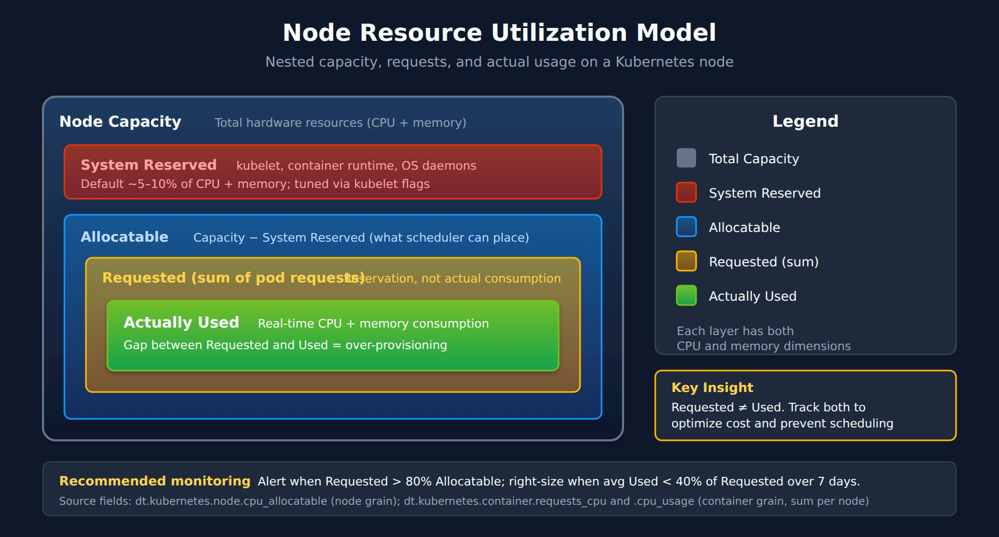

# K8S-04: Cluster Health Monitoring

> **Series:** K8S — Kubernetes Monitoring | **Notebook:** 4 of 13 | **Created:** January 2026 | **Last Updated:** 08/27/2026

## Deep-Dive into Kubernetes Cluster Metrics
Cluster health monitoring provides visibility into the infrastructure layer of Kubernetes: nodes, control plane, and cluster-wide resources. This notebook covers key metrics, thresholds, and DQL queries for proactive cluster management.

---

## Table of Contents

1. [Node Monitoring](#node-monitoring)
2. [Resource Capacity Planning](#resource-capacity-planning)
3. [Control Plane Health](#control-plane-health)
4. [Cluster-Wide Events](#cluster-wide-events)
5. [Cost Optimization Queries](#cost-optimization-queries)
6. [Alerting Strategies](#alerting-strategies)
7. [Dynatrace Component Health](#dynatrace-component-health)
8. [Alerting Strategies](#alerting-strategies)

---

## Prerequisites

| Requirement | Details |
|-------------|----------|
| **Dynatrace Environment** | SaaS with Kubernetes monitoring |
| **DynaKube** | ActiveGate with `kubernetes-monitoring` capability |
| **Permissions** | `metrics.read`, `entities.read`, `logs.read`, `events.read` |
| **Data** | At least 24 hours of cluster data |

## 1. Cluster Health Overview

### Key Health Indicators

| Category | Metrics | Healthy State |
|----------|---------|---------------|
| **Node Status** | Ready/NotReady | All nodes Ready |
| **Pod Scheduling** | Pending pods | No long-pending pods |
| **Resource Pressure** | CPU/Memory pressure | No pressure conditions |
| **Disk Pressure** | Disk space, inode usage | >15% available |
| **Network** | CNI health, DNS latency | <100ms DNS resolution |

### Dynatrace Kubernetes Dashboard

The built-in Kubernetes dashboard provides:
- Cluster overview with node status
- Namespace resource usage
- Workload health summary
- Recent events and problems

Navigate to: **Infrastructure > Kubernetes**

### Release Radar (April 2026): Enhanced Kubernetes Visibility

Three additions to the Kubernetes app's cluster and workload views:

| Capability | What it surfaces | Why it matters |
|---|---|---|
| **Horizontal Pod Autoscaler (HPA)** | HPA is now a first-class object — scaling triggers, current/desired replica counts, and the workloads it drives | See *why* a workload scaled (which metric crossed which threshold) without leaving Dynatrace |
| **Custom Resources (CRs)** | Monitor up to **5 Custom Resources per cluster**, surfacing CRD-heavy ecosystems (Argo, Istio, Cert-Manager, Kyverno, operator-managed databases) | Brings operator/CRD state into the same view as native Kubernetes objects |
| **Cloud configuration in cluster details** | The underlying managed-cluster configuration (EKS, AKS, GKE) shown inline as YAML or JSON | Correlate cluster and cloud state in one place — no jumping to the cloud console |

> **Note:** The per-cluster Custom Resource cap (5) means you choose which CRDs matter most — prioritize the operators whose state actually drives incidents in your environment.

#### Kubernetes Enhanced Object Visibility (ActiveGate 1.327+)

Building on the above, the Kubernetes app now surfaces a broader set of objects and their raw definitions:

- **Additional Kubernetes objects** — Ingress, NetworkPolicies, CRDs, PVCs, PVs, ConfigMaps, and more appear alongside the native cluster/node/namespace/workload views.
- **YAML definitions inline** — view an object's YAML to debug and validate configuration in real time without leaving Dynatrace.
- **Query YAML across clusters with DQL** — surface misconfigurations, missing references, or policy violations across all clusters and namespaces at once.

**Prerequisite:** ActiveGate version 1.327+. Older ActiveGate versions stay in backward-compatibility mode, where an extra **Explorer (Classic)** tab appears. From June 2026, Explorer Classic transitions to *maintenance-only* support — upgrade ActiveGate to 1.327+ to move clusters to the new Explorer before automatic migration. No monitoring data is lost during the transition.

#### Kubernetes Connection Lifecycle — Automatic Stale Cleanup (SaaS 1.344)

Every monitored cluster has a **Kubernetes connection** on the tenant side. Its lifecycle is worth knowing in both directions, because it cuts two ways.

**SaaS 1.344** (released 07/27/2026, **staged tenant rollout from 07/29/2026** — verify it has reached your tenant before relying on it) adds **automatic cleanup of stale Kubernetes connections at a 60-day threshold**:

| Direction | What happens | What you should do |
|---|---|---|
| **Decommissioned cluster** | Its connection stops reporting and is now cleaned up automatically once it crosses 60 days stale — the connection list stops accumulating entries for clusters that no longer exist. | Nothing. This is the behavior you want; it removes a recurring housekeeping chore. |
| **Live but long-idle cluster** | A cluster that is still real but has not reported for 60 days — a lab, a seasonal environment, a cluster whose ActiveGate has been down a long time — **can be reaped by the same rule**, and reconnecting means re-establishing the connection. | Treat "no data for weeks" as an issue to fix rather than a state to tolerate. If an environment is legitimately dormant for months, expect to re-add it and note that in your runbook. |

**Until 1.344 reaches your tenant**, stale connections persist until someone removes them manually — the existing housekeeping step remains the working path, and reviewing the connection list periodically is still worth doing.

SaaS 1.344 also adds **cross-app navigation with context preservation**, so a jump from the Kubernetes app into another app (for example, into logs or a dashboard) carries the cluster/namespace context with it instead of dropping you at an unfiltered start.

```dql
// List all monitored Kubernetes clusters (smartscape topology)
smartscapeNodes "K8S_CLUSTER"
| fields entity.name = name, tags
| sort entity.name asc

// Legacy alternative (deprecated for new content):
// fetch dt.entity.kubernetes_cluster
// | fields entity.name, tags
// | sort entity.name asc

```

<a id="node-monitoring"></a>
## 2. Node Monitoring
### Node Status and Conditions

| Condition | Description | Alert When |
|-----------|-------------|------------|
| **Ready** | Node can accept pods | False for >5 min |
| **MemoryPressure** | Low memory | True |
| **DiskPressure** | Low disk space | True |
| **PIDPressure** | Too many processes | True |
| **NetworkUnavailable** | Network not configured | True |

```dql
// List all Kubernetes nodes (smartscape topology)
smartscapeNodes "K8S_NODE"
| fields entity.name = name, tags
| sort entity.name asc

// Legacy alternative (deprecated for new content):
// fetch dt.entity.kubernetes_node
// | fields entity.name, tags
// | sort entity.name asc

```

```dql
// Node CPU utilization — container usage summed per node, against node allocatable
// There is no dt.kubernetes.node.cpu_usage metric: node-level usage is derived
// by summing the per-container metric. Allocatable is a genuine node-grain metric.
timeseries {
    used = sum(dt.kubernetes.container.cpu_usage),
    allocatable = avg(dt.kubernetes.node.cpu_allocatable)
  }, from:-1h, by:{k8s.cluster.name, k8s.node.name}
| fieldsAdd cpuPercent = round(100 * arrayAvg(used) / arrayAvg(allocatable), decimals: 1)
| fields k8s.cluster.name, k8s.node.name, cpuPercent
| sort cpuPercent desc
| limit 10
```

```dql
// Node memory utilization — working-set memory summed per node, against node allocatable
// Same derivation as CPU above: no dt.kubernetes.node.memory_usage metric exists.
timeseries {
    used = sum(dt.kubernetes.container.memory_working_set),
    allocatable = avg(dt.kubernetes.node.memory_allocatable)
  }, from:-1h, by:{k8s.cluster.name, k8s.node.name}
| fieldsAdd memPercent = round(100 * arrayAvg(used) / arrayAvg(allocatable), decimals: 1)
| filter memPercent > 80
| fields k8s.cluster.name, k8s.node.name, memPercent
| sort memPercent desc
```

```dql
// Node filesystem usage - disk pressure detection
timeseries avgDiskUsage = avg(dt.host.disk.used.percent), from:-1h, by:{dt.entity.host}
| fieldsAdd avgDiskUsageValue = arrayAvg(avgDiskUsage)
| filter avgDiskUsageValue > 80
| sort avgDiskUsageValue desc
```

<a id="resource-capacity-planning"></a>
## 3. Resource Capacity Planning
### Capacity Metrics

| Metric | Description | Use Case | Grail metric key |
|--------|-------------|----------|------------------|
| **Allocatable** | Resources available for pods | Scheduling decisions | `dt.kubernetes.node.cpu_allocatable`, `dt.kubernetes.node.memory_allocatable` |
| **Requested** | Sum of pod requests | Capacity planning | `dt.kubernetes.container.requests_cpu`, `dt.kubernetes.container.requests_memory` |
| **Used** | Actual consumption | Right-sizing | `dt.kubernetes.container.cpu_usage`, `dt.kubernetes.container.memory_working_set` |
| **Limits** | Maximum allowed | Burst capacity | `dt.kubernetes.container.limits_cpu`, `dt.kubernetes.container.limits_memory` |

> **Grain matters more than the label.** *Allocatable* is the only genuinely node-grain family — everything else is emitted **per container** and rolled up by you. There is no `dt.kubernetes.node.cpu_usage`, no `dt.kubernetes.node.memory_usage`, and no `dt.kubernetes.workload.requests_*`; node and workload views are derived by summing the `dt.kubernetes.container.*` series across the dimensions you group by. Enumerate what your tenant actually carries before writing a query:
>
> ```dql
> metrics
> | filter startsWith(metric.key, "dt.kubernetes")
> | summarize n = count(), by:{metric.key}
> | sort metric.key asc
> ```
>
> Note the `metrics` command takes `from:` with **no leading comma** (`metrics from:-2h | …`). Writing `metrics, from:-2h` is a parse error, and a parse error read only for its record count looks exactly like "this tenant has no such metrics."

### Utilization vs. Allocation



<!-- MARKDOWN_TABLE_ALTERNATIVE
| Layer | Description |
|-------|-------------|
| Node Capacity | Total hardware resources |
| System Reserved | kubelet, runtime, OS |
| Allocatable | Available for pods |
| Requested (sum) | Pod requests |
| Actually Used | Real-time usage |

**Key Insight:** Requested ≠ Used. Over-provisioning wastes resources. Monitor both to optimize cluster efficiency.
For environments where SVG doesn't render
-->

> **Capacity planning across an ActiveGate 1.343 upgrade:** the request and limit metrics — `dt.kubernetes.container.requests_cpu` / `requests_memory` and `limits_cpu` / `limits_memory` — **include init containers from ActiveGate 1.343 onward**, so the *Requested* line steps up at the upgrade while *Used* (`dt.kubernetes.container.cpu_usage`, `memory_working_set`) does not move. Read a trend spanning that boundary as **two series, not one** — otherwise the discontinuity reads as a genuine reservation increase and skews right-sizing conclusions. Full explanation: K8S-08 §2.

```dql
// CPU requests by namespace — requests are a container-grain metric, summed to namespace
// (there is no dt.kubernetes.workload.requests_cpu; requests live under container.*)
timeseries cpuReq = sum(dt.kubernetes.container.requests_cpu), from:-1h, by:{k8s.namespace.name}
| fieldsAdd avgReqMillicores = round(arrayAvg(cpuReq), decimals: 0)
| fields k8s.namespace.name, avgReqMillicores
| sort avgReqMillicores desc
| limit 15
```

```dql
// Memory requests by namespace (GiB) — container-grain metric summed to namespace
timeseries memReq = sum(dt.kubernetes.container.requests_memory), from:-1h, by:{k8s.namespace.name}
| fieldsAdd avgReqGiB = round(arrayAvg(memReq) / 1073741824, decimals: 2)
| fields k8s.namespace.name, avgReqGiB
| sort avgReqGiB desc
| limit 15
```

```dql
// Find over-provisioned workloads (low CPU usage)
timeseries avgCpuUsageMillicores = avg(dt.kubernetes.container.cpu_usage), from:-1h, by:{dt.entity.cloud_application}
| fieldsAdd avgCpuUsageMillicoresValue = arrayAvg(avgCpuUsageMillicores)
| sort avgCpuUsageMillicoresValue asc
| limit 20
```

<a id="control-plane-health"></a>
## 4. Control Plane Health
### Control Plane Components

| Component | Function | Key Metrics |
|-----------|----------|-------------|
| **API Server** | REST API for K8s | Request latency, error rate |
| **etcd** | Distributed KV store | Disk sync latency, leader elections |
| **Scheduler** | Pod placement | Scheduling latency, failures |
| **Controller Manager** | Reconciliation loops | Queue depth, sync latency |

### Managed Kubernetes Note

For managed Kubernetes (EKS, AKS, GKE), control plane metrics are limited. Focus on:
- API server response times (client-side)
- Kubernetes events for scheduling issues
- Cloud provider metrics for control plane health

```dql
// Node-level and control-plane events
// Data object corrected 08/12/2026. Kubernetes events are NOT logs. This cell scraped
// `fetch logs` for `log.source` containing "kubernetes" or for content substrings like "BackOff" —
// no log.source matches, and kubelet event text is not in the log stream, so it returned nothing
// while the cluster emitted 231,296 Kubernetes events in the same window.
// They arrive as `fetch events | filter event.provider == "KUBERNETES_EVENT"`, STRUCTURED:
//   dt.kubernetes.event.reason            Unhealthy · BackOff · Killing · FailedScheduling ·
//                                         FailedMount · BackoffLimitExceeded · EvictionThresholdMet …
//   dt.kubernetes.event.message           the human-readable text
//   dt.kubernetes.event.important         "true" marks the warning-class events
//   dt.kubernetes.event.involved_object.kind / .name
//   dt.kubernetes.event.count / .first_seen / .last_seen
//   plus k8s.cluster.name · k8s.namespace.name · k8s.pod.name · k8s.workload.name · k8s.node.name
// NOTE: event.type is CUSTOM_INFO on every one of these — it is NOT "Warning"; severity lives in
// dt.kubernetes.event.important. Enumerate reasons with:
//   fetch events, from:-24h | filter event.provider == "KUBERNETES_EVENT"
//   | summarize n = count(), by:{dt.kubernetes.event.reason} | sort n desc
fetch events, from:-6h
| filter event.provider == "KUBERNETES_EVENT"
| filter isNotNull(k8s.node.name)
| summarize events = count(), by:{k8s.node.name, dt.kubernetes.event.reason}
| sort events desc
| limit 25
```

<a id="cluster-wide-events"></a>
## 5. Cluster-Wide Events

### Where Kubernetes events actually live

Kubernetes events are ingested into the **`events`** object, not into `logs`. Two discriminators are easy to get wrong, and both fail silently:

| Getting it wrong | What actually happens |
|---|---|
| `fetch events \| filter event.kind == "K8S_EVENT"` | **`event.kind` never takes that value.** Over 24 h on a live tenant (08/11/2026) the only values present were `DAVIS_EVENT`, `SYNTHETIC_EVENT`, `FLEET_EVENT` and `DAVIS_PROBLEM`. Kubernetes events carry `event.kind == "DAVIS_EVENT"`, so *kind* cannot discriminate them. Zero rows, no error. |
| `fetch logs \| filter matchesPhrase(log.source, "kubernetes")` | Zero rows **after scanning 46.5 GB** (same tenant, same window). Expensive and empty — the worst combination. |
| `k8s.event.reason` | The field resolves but is **null on every Kubernetes event record**. Another silent zero. |

**The correct discriminator is `event.provider == "KUBERNETES_EVENT"`**, and the reason field is **`dt.kubernetes.event.reason`**. Companion fields on the same records: `dt.kubernetes.event.message`, `.count`, `.first_seen`, `.last_seen`, `.involved_object.kind`, `.involved_object.name`, plus the standard `k8s.cluster.name` / `k8s.namespace.name` / `k8s.pod.name` / `k8s.workload.name` / `k8s.node.name` dimensions.

### Event Reasons to Monitor

Reasons observed on tenant `yhu28601` over 24 h (08/11/2026) — your distribution will differ, so run the summary query below against your own estate rather than assuming this shape:

| Reason | Count (24 h) | Action |
|--------|-------------:|--------|
| **Unhealthy** | 2,084 | Readiness/liveness probe failing — check the probe and the container |
| **BackOff** | 586 | Container restart loop — check logs and exit codes |
| **FailedScheduling** | 433 | No node satisfies requests/affinity/taints |
| **Killing** | 250 | Normal termination during rollout, or eviction |
| **KernelReady** | 136 | Node lifecycle, informational |
| **Failed** / **FailedMount** / **BackoffLimitExceeded** | tens | Image pull, volume, and Job failures |

```dql
// Event summary by reason — run this first to see what your estate actually emits
fetch events, from:-24h
| filter event.provider == "KUBERNETES_EVENT"
| summarize eventCount = count(), by:{dt.kubernetes.event.reason}
| sort eventCount desc
| limit 25
```

```dql
// Scheduling and placement failures — the pods that could not be placed
fetch events, from:-24h
| filter event.provider == "KUBERNETES_EVENT"
| filter dt.kubernetes.event.reason == "FailedScheduling"
| fields timestamp, k8s.cluster.name, k8s.namespace.name,
         dt.kubernetes.event.involved_object.kind,
         dt.kubernetes.event.involved_object.name,
         dt.kubernetes.event.message
| sort timestamp desc
| limit 30
```

```dql
// OOM kills by workload — the metric, not an event
// OOMKilled has no reliable Kubernetes event reason; Dynatrace emits it as a counter
// derived from the container status, written only when at least one kill occurred.
timeseries oom = sum(dt.kubernetes.container.oom_kills), from:-24h,
  by:{k8s.cluster.name, k8s.namespace.name, k8s.workload.name}
| fieldsAdd oomTotal = arraySum(oom)
| filter oomTotal > 0
| fields k8s.cluster.name, k8s.namespace.name, k8s.workload.name, oomTotal
| sort oomTotal desc
| limit 30
```

```dql
// Which namespaces and workloads generate the most event noise
fetch events, from:-24h
| filter event.provider == "KUBERNETES_EVENT"
| summarize eventCount = count(),
    by:{k8s.cluster.name, k8s.namespace.name, k8s.workload.name, dt.kubernetes.event.reason}
| sort eventCount desc
| limit 20
```

<a id="cost-optimization-queries"></a>
## 6. Cost Optimization Queries
### Resource Efficiency Analysis

| Metric | Target | Action If Not Met |
|--------|--------|-------------------|
| **CPU Utilization** | >40% avg | Reduce requests |
| **Memory Utilization** | >50% avg | Reduce requests |
| **Node Utilization** | >60% | Scale down nodes |
| **Idle Pods** | 0 | Review necessity |

```dql
// Find workloads with very low CPU utilization (candidates for right-sizing)
timeseries avgCpuUsageMillicores = avg(dt.kubernetes.container.cpu_usage), from:-1h, by:{dt.entity.cloud_application}
| fieldsAdd avgCpuUsageMillicoresValue = arrayAvg(avgCpuUsageMillicores)
| sort avgCpuUsageMillicoresValue asc
| limit 25
```

```dql
// Memory usage efficiency by workload (low usage = over-provisioned)
timeseries avgMemUsageBytes = avg(dt.kubernetes.container.memory_working_set), from:-1h, by:{dt.entity.cloud_application}
| fieldsAdd avgMemUsageBytesValue = arrayAvg(avgMemUsageBytes)
| sort avgMemUsageBytesValue asc
| limit 25
```

<a id="dynatrace-component-health"></a>
## 7. Dynatrace Component Health

Monitor the health of Dynatrace's own components (OneAgent, ActiveGate) running on your clusters.

### Why Monitor the Monitoring?

| Component | What to Watch | Action Threshold |
|-----------|---------------|------------------|
| **OneAgent** | CPU usage, memory consumption | Sustained memory growth above baseline |
| **ActiveGate** | Memory headroom, pod restarts | Memory headroom < 20%, any OOMKill |
| **CSI Driver** | Volume mount failures | Any mount timeout |
| **Operator** | Reconciliation errors | Failed CR updates |

> **Note:** OneAgent runs without resource limits or requests by default. Headroom queries using `limits_memory` will return no data for OneAgent containers. Use absolute memory usage instead. ActiveGate **does** have limits configured, so headroom queries work for AG.

> **Tip:** These queries use `matchesValue(k8s.container.name, "dynatrace-oneagent")` to isolate Dynatrace components from application workloads.

```dql
// OneAgent CPU usage across clusters (top 20 consumers)
timeseries by:{k8s.cluster.name, k8s.pod.name}, from:-1h,
  oaCpu = avg(dt.kubernetes.container.cpu_usage),
  filter:{matchesValue(k8s.container.name, "dynatrace-oneagent")}
| fieldsAdd avgCpu = arrayAvg(oaCpu)
| sort avgCpu desc
| limit 20
```

```dql
// OneAgent memory usage across clusters (absolute usage — OA has no resource limits by default)
timeseries by:{k8s.cluster.name}, from:-1h,
  memUsage = avg(dt.kubernetes.container.memory_working_set),
  filter:{matchesValue(k8s.container.name, "dynatrace-oneagent")}
| fieldsAdd avgUsageMi = round(arrayAvg(memUsage) / 1048576, decimals: 0)
| sort avgUsageMi desc
```

```dql
// Dynatrace component events (last 24h) — restarts, back-offs, scheduling failures
// Discriminator is event.provider, NOT event.kind (these records carry event.kind == "DAVIS_EVENT").
fetch events, from:-24h
| filter event.provider == "KUBERNETES_EVENT"
| filter k8s.namespace.name == "dynatrace"
| summarize eventCount = count(), by:{k8s.cluster.name, k8s.workload.name, dt.kubernetes.event.reason}
| sort eventCount desc
| limit 50
```

<a id="alerting-strategies"></a>
## 8. Alerting Strategies
### Recommended Alerts

| Alert | Condition | Severity |
|-------|-----------|----------|
| **Node NotReady** | Node condition != Ready for 5 min | Critical |
| **High Node CPU** | CPU > 85% for 15 min | Warning |
| **High Node Memory** | Memory > 90% for 10 min | Critical |
| **Disk Pressure** | Disk > 85% | Warning |
| **Pod Scheduling Failed** | FailedScheduling events | Warning |
| **OOM Kills** | OOMKilled events | Warning |

### Alert Configuration in Dynatrace

Navigate to: **Settings > Anomaly detection > Kubernetes**

Configure:
- Node availability alerts
- Resource saturation thresholds
- Workload health anomalies

### Custom Metric Events

For advanced alerting, use custom metric events with DQL-derived thresholds.

## Next Steps

With cluster health monitoring in place, proceed to:

| Next Notebook | Topic |
|---------------|-------|
| **K8S-05: Workload Monitoring** | Application-level observability |
| **K8S-06: Namespace Organization** | Boundaries and access control |
| **K8S-07: Events and Logs** | Log ingestion and analysis |

---

## Summary

In this notebook, you learned:

- Cluster health overview and key indicators
- Node monitoring for CPU, memory, and disk
- Resource capacity planning with requests vs. usage analysis
- Control plane health considerations
- Cluster-wide event monitoring and analysis
- Cost optimization queries for right-sizing
- Alerting strategies for proactive cluster management

---

## References

- [Set up Dynatrace on Kubernetes (DT docs)](https://docs.dynatrace.com/docs/ingest-from/setup-on-k8s)
- [How K8s monitoring works (DT docs)](https://docs.dynatrace.com/docs/ingest-from/setup-on-k8s/how-it-works)
- [Full observability deployment (DT docs)](https://docs.dynatrace.com/docs/ingest-from/setup-on-k8s/deployment/full-stack-observability)
- [Kubernetes app — clusters and workloads view (DT docs)](https://docs.dynatrace.com/docs/observe/infrastructure-observability/kubernetes-app)
- [Davis Problems app (DT docs)](https://docs.dynatrace.com/docs/dynatrace-intelligence/problems-app)
- [smartscapeNodes command (DT docs)](https://docs.dynatrace.com/docs/platform/grail/dynatrace-query-language)

---

<sub>*This notebook was AI-generated from community-submitted and publicly available sources. This notebook series is not officially supported by Dynatrace. Always verify information against official Dynatrace documentation.*</sub>
