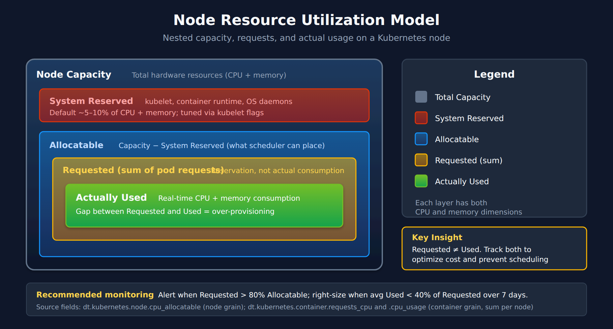

# K8S-04: Cluster Health Monitoring

> **Series:** K8S — Kubernetes Monitoring | **Notebook:** 4 of 14 | **Created:** January 2026 | **Last Updated:** 10/02/2026

## Deep-Dive into Kubernetes Cluster Metrics
Cluster health monitoring provides visibility into the infrastructure layer of Kubernetes: nodes, control plane, and cluster-wide resources. This notebook covers key metrics, thresholds, and DQL queries for proactive cluster management.

---

## Table of Contents

1. [Cluster Health Overview](#cluster-health-overview)
2. [Node Monitoring](#node-monitoring)
3. [Resource Capacity Planning](#resource-capacity-planning)
4. [Control Plane Health](#control-plane-health)
5. [Cluster-Wide Events](#cluster-wide-events)
6. [Cost Optimization Queries](#cost-optimization-queries)
7. [Dynatrace Component Health](#dynatrace-component-health)
8. [Alerting Strategies](#alerting-strategies)

---

## Prerequisites

| Requirement | Details |
|-------------|----------|
| **Dynatrace Environment** | SaaS with Kubernetes monitoring |
| **DynaKube** | ActiveGate with `kubernetes-monitoring` capability |
| **Permissions** | `storage:metrics:read`, `storage:events:read`, `storage:smartscape:read` (plus `storage:entities:read` for the classic `dt.entity.*` fallbacks) |
| **Data** | At least 24 hours of cluster data |

<a id="cluster-health-overview"></a>
## 1. Cluster Health Overview

### Key Health Indicators

| Category | Metrics | Healthy State |
|----------|---------|---------------|
| **Node Status** | Ready/NotReady | All nodes Ready |
| **Pod Scheduling** | Pending pods | No long-pending pods |
| **Resource Pressure** | CPU/Memory pressure | No pressure conditions |
| **Disk Pressure** | Disk space, inode usage | >15% available |
| **Network** | CNI health, DNS latency | <100ms DNS resolution |

### Dynatrace Kubernetes Dashboard

The built-in Kubernetes dashboard provides:
- Cluster overview with node status
- Namespace resource usage
- Workload health summary
- Recent events and problems

Navigate to: **Infrastructure > Kubernetes**

### Enhanced Kubernetes Visibility in the Kubernetes App

Three additions to the Kubernetes app's cluster and workload views:

| Capability | What it surfaces | Why it matters |
|---|---|---|
| **Horizontal Pod Autoscaler (HPA)** | HPA is now a first-class object — scaling triggers, current/desired replica counts, and the workloads it drives | See *why* a workload scaled (which metric crossed which threshold) without leaving Dynatrace |
| **Custom Resources (CRs)** | Monitor up to **5 Custom Resources** (ActiveGate 1.335+), surfacing CRD-heavy ecosystems (Argo, Istio, Cert-Manager, Kyverno, operator-managed databases) | Brings operator/CRD state into the same view as native Kubernetes objects |
| **Cloud configuration in cluster details** | The underlying managed-cluster configuration (EKS, AKS, GKE) shown inline as YAML or JSON | Correlate cluster and cloud state in one place — no jumping to the cloud console |

> **Note:** *"Starting with ActiveGate version 1.335+, ActiveGate supports monitoring up to five CRs."* The cap means you choose which CRDs matter most — prioritize the operators whose state actually drives incidents in your environment.

#### Kubernetes Enhanced Object Visibility (ActiveGate 1.327+)

Building on the above, the Kubernetes app now surfaces a broader set of objects and their raw definitions:

- **Additional Kubernetes objects** — Ingress, NetworkPolicies, CRDs, PVCs, PVs, ConfigMaps, and more appear alongside the native cluster/node/namespace/workload views.
- **YAML definitions inline** — view an object's YAML to debug and validate configuration in real time without leaving Dynatrace.
- **Query YAML across clusters with DQL** — surface misconfigurations, missing references, or policy violations across all clusters and namespaces at once.

**Prerequisite:** ActiveGate version 1.327+. Older ActiveGate versions stay in backward-compatibility mode, where an extra **Explorer (Classic)** tab appears. *"From June 2026, Explorer Classic is transitioning to a 'maintenance only' support mode. Clusters running on ActiveGate version 1.327+ that meet all prerequisites will be accessible the new Explorer."* Upgrade ActiveGate to 1.327+ to move a cluster to the new Explorer.

#### Kubernetes Connection Lifecycle — Stale Connections Are Disabled (SaaS 1.344)

Every monitored cluster has a **Kubernetes connection** on the tenant side. SaaS 1.344 (released 07/27/2026, staged tenant rollout from 07/29/2026) adds: *"Dynatrace will automatically disable stale Kubernetes connection settings if no successful connection has been established for 60 days. This action is recorded in the audit log and can be reversed by re-enabling the connection via the API or the web UI."*

The connection is **disabled, not deleted**, and the change cuts two ways:

| Direction | What happens | What you should do |
|---|---|---|
| **Decommissioned cluster** | After 60 days without a successful connection, its connection setting is disabled automatically. | Nothing required. Delete the setting yourself if you want the list clean — disabling does not remove it. |
| **Live but long-idle cluster** | A cluster that is real but has not connected for 60 days — a lab, a seasonal environment, a cluster whose ActiveGate has been down — is disabled by the same rule. | Treat "no data for weeks" as an issue to fix. To bring a dormant cluster back, re-enable the connection in the web UI or via the API; the audit log records when it was disabled. |

Tenants still on an earlier version keep stale connections enabled until someone removes them.

> <sub>**Sources:** [Getting started with Kubernetes experience (DT docs)](https://docs.dynatrace.com/docs/observe/infrastructure-observability/kubernetes-app/enable-k8s-experience) — *"Starting with ActiveGate version 1.335+, ActiveGate supports monitoring up to five CRs."*, [SaaS 1.344 (DT docs)](https://docs.dynatrace.com/docs/whats-new/saas/sprint-344) — the stale-connection quote.</sub>

SaaS 1.344 also adds **cross-app navigation with context preservation**, so a jump from the Kubernetes app into another app (for example, into logs or a dashboard) carries the cluster/namespace context with it instead of dropping you at an unfiltered start.

```dql
// List all monitored Kubernetes clusters (smartscape topology)
smartscapeNodes "K8S_CLUSTER"
| fields entity.name = name, tags
| sort entity.name asc

// Legacy alternative (deprecated for new content):
// fetch dt.entity.kubernetes_cluster
// | fields entity.name, tags
// | sort entity.name asc

```

<a id="node-monitoring"></a>
## 2. Node Monitoring
### Node Status and Conditions

| Condition | Description | Alert When |
|-----------|-------------|------------|
| **Ready** | Node can accept pods | False for >5 min |
| **MemoryPressure** | Low memory | True |
| **DiskPressure** | Low disk space | True |
| **PIDPressure** | Too many processes | True |
| **NetworkUnavailable** | Network not configured | True |

Dynatrace records node conditions as the metric `dt.kubernetes.node.conditions`, one series per node, `node_condition` and boolean `condition_status`. The query below lists every node currently not Ready or under pressure.

```dql
// List all Kubernetes nodes (smartscape topology)
smartscapeNodes "K8S_NODE"
| fields entity.name = name, tags
| sort entity.name asc

// Legacy alternative (deprecated for new content):
// fetch dt.entity.kubernetes_node
// | fields entity.name, tags
// | sort entity.name asc

```

```dql
// Nodes that are not Ready, or are under memory / disk / PID pressure
// dt.kubernetes.node.conditions writes 1 per (node, node_condition, condition_status) present;
// condition_status is a boolean. bucketsInState counts time buckets: at from:-1h a bucket is
// one minute, at wider timeframes it is longer. Executed 10/02/2026.
timeseries c = max(dt.kubernetes.node.conditions), from:-1h,
  by:{k8s.cluster.name, k8s.node.name, node_condition, condition_status}
| filter (node_condition == "Ready" and condition_status == false)
      or (in(node_condition, {"MemoryPressure", "DiskPressure", "PIDPressure"}) and condition_status == true)
| fieldsAdd bucketsInState = arraySize(arrayRemoveNulls(c))
| fields k8s.cluster.name, k8s.node.name, node_condition, condition_status, bucketsInState
| sort bucketsInState desc
```

```dql
// Node CPU utilization — container usage summed per node, against node allocatable
// There is no dt.kubernetes.node.cpu_usage metric: node-level usage is derived
// by summing the per-container metric. Allocatable is a genuine node-grain metric.
// rollup: avg averages each container within a time bucket before the cross-container sum;
// without it, sum() also adds the 1-min points in each bucket and wide timeframes read ~10x high.
timeseries {
    used = sum(dt.kubernetes.container.cpu_usage, rollup: avg),
    allocatable = avg(dt.kubernetes.node.cpu_allocatable)
  }, from:-1h, by:{k8s.cluster.name, k8s.node.name}
| fieldsAdd cpuPercent = round(100 * arrayAvg(used) / arrayAvg(allocatable), decimals: 1)
| fields k8s.cluster.name, k8s.node.name, cpuPercent
| sort cpuPercent desc
| limit 10
```

```dql
// Node memory utilization — working-set memory summed per node, against node allocatable
// Same derivation as CPU above: no dt.kubernetes.node.memory_usage metric exists.
// rollup: avg averages each container within a time bucket before the cross-container sum;
// without it, sum() also adds the 1-min points in each bucket and wide timeframes read ~10x high.
timeseries {
    used = sum(dt.kubernetes.container.memory_working_set, rollup: avg),
    allocatable = avg(dt.kubernetes.node.memory_allocatable)
  }, from:-1h, by:{k8s.cluster.name, k8s.node.name}
| fieldsAdd memPercent = round(100 * arrayAvg(used) / arrayAvg(allocatable), decimals: 1)
| filter memPercent > 80
| fields k8s.cluster.name, k8s.node.name, memPercent
| sort memPercent desc
```

```dql
// Node filesystem usage - disk pressure detection
timeseries avgDiskUsage = avg(dt.host.disk.used.percent), from:-1h, by:{dt.entity.host}
| fieldsAdd avgDiskUsageValue = arrayAvg(avgDiskUsage)
| filter avgDiskUsageValue > 80
| sort avgDiskUsageValue desc
```

<a id="resource-capacity-planning"></a>
## 3. Resource Capacity Planning
### Capacity Metrics

| Metric | Description | Use Case | Grail metric key |
|--------|-------------|----------|------------------|
| **Allocatable** | Resources available for pods | Scheduling decisions | `dt.kubernetes.node.cpu_allocatable`, `dt.kubernetes.node.memory_allocatable` |
| **Requested** | Sum of pod requests | Capacity planning | `dt.kubernetes.container.requests_cpu`, `dt.kubernetes.container.requests_memory` |
| **Used** | Actual consumption | Right-sizing | `dt.kubernetes.container.cpu_usage`, `dt.kubernetes.container.memory_working_set` |
| **Limits** | Maximum allowed | Burst capacity | `dt.kubernetes.container.limits_cpu`, `dt.kubernetes.container.limits_memory` |

> **Grain matters more than the label.** *Allocatable* is the only genuinely node-grain family — everything else is emitted **per container** and rolled up by you. There is no `dt.kubernetes.node.cpu_usage`, no `dt.kubernetes.node.memory_usage`, and no `dt.kubernetes.workload.requests_*`; node and workload views are derived by summing the `dt.kubernetes.container.*` series across the dimensions you group by. Enumerate what your tenant actually carries before writing a query:
>
> ```dql
> metrics
> | filter startsWith(metric.key, "dt.kubernetes")
> | summarize n = count(), by:{metric.key}
> | sort metric.key asc
> ```
>
> Note the `metrics` command takes `from:` with **no leading comma** (`metrics from:-2h | …`). Writing `metrics, from:-2h` is a parse error, and a parse error read only for its record count looks exactly like "this tenant has no such metrics."

### Utilization vs. Allocation



<!-- MARKDOWN_TABLE_ALTERNATIVE
| Layer | Description |
|-------|-------------|
| Node Capacity | Total hardware resources |
| System Reserved | kubelet, runtime, OS |
| Allocatable | Available for pods |
| Requested (sum) | Pod requests |
| Actually Used | Real-time usage |

**Key Insight:** Requested ≠ Used. Over-provisioning wastes resources. Monitor both to optimize cluster efficiency.
For environments where SVG doesn't render
-->

> **Capacity planning across ActiveGate 1.343 / 1.345 upgrades:** the request and limit metrics — `dt.kubernetes.container.requests_cpu` / `requests_memory` and `limits_cpu` / `limits_memory` — **carry an effective pod value**: init containers are accounted for from ActiveGate 1.343, and pod-level `spec.resources` (Kubernetes 1.34+) and pod `overhead` from 1.345. The *Requested* line can therefore step at either upgrade — up for init containers, up or down for pod-level limits — while *Used* (`dt.kubernetes.container.cpu_usage`, `memory_working_set`) does not move. Read a trend spanning either boundary as **two series, not one** — otherwise the discontinuity reads as a genuine reservation increase and skews right-sizing conclusions. Full explanation: K8S-08 §2.

```dql
// CPU requests by namespace — requests are a container-grain metric, summed to namespace
// (there is no dt.kubernetes.workload.requests_cpu; requests live under container.*)
// rollup: avg averages each container within a time bucket before the cross-container sum;
// without it, sum() also adds the 1-min points in each bucket and wide timeframes read ~10x high.
timeseries cpuReq = sum(dt.kubernetes.container.requests_cpu, rollup: avg), from:-1h, by:{k8s.namespace.name}
| fieldsAdd avgReqMillicores = round(arrayAvg(cpuReq), decimals: 0)
| fields k8s.namespace.name, avgReqMillicores
| sort avgReqMillicores desc
| limit 15
```

```dql
// Memory requests by namespace (GiB) — container-grain metric summed to namespace
// rollup: avg averages each container within a time bucket before the cross-container sum;
// without it, sum() also adds the 1-min points in each bucket and wide timeframes read ~10x high.
timeseries memReq = sum(dt.kubernetes.container.requests_memory, rollup: avg), from:-1h, by:{k8s.namespace.name}
| fieldsAdd avgReqGiB = round(arrayAvg(memReq) / 1073741824, decimals: 2)
| fields k8s.namespace.name, avgReqGiB
| sort avgReqGiB desc
| limit 15
```

```dql
// Requested vs used CPU by namespace — the capacity-planning view of § 3
// Container-grain metrics summed into the namespace (rollup: avg first, see above).
timeseries {
    used = sum(dt.kubernetes.container.cpu_usage, rollup: avg),
    requested = sum(dt.kubernetes.container.requests_cpu, rollup: avg)
  }, from:-24h, by:{k8s.cluster.name, k8s.namespace.name}
| fieldsAdd usedMillicores = round(arrayAvg(used), decimals: 0),
            requestedMillicores = round(arrayAvg(requested), decimals: 0)
| filter requestedMillicores > 0
| fieldsAdd usagePctOfRequest = round(100 * usedMillicores / requestedMillicores, decimals: 1)
| fields k8s.cluster.name, k8s.namespace.name, requestedMillicores, usedMillicores, usagePctOfRequest
| sort requestedMillicores desc
| limit 20
```

<a id="control-plane-health"></a>
## 4. Control Plane Health
### Control Plane Components

| Component | Function | Key Metrics |
|-----------|----------|-------------|
| **API Server** | REST API for K8s | Request latency, error rate |
| **etcd** | Distributed KV store | Disk sync latency, leader elections |
| **Scheduler** | Pod placement | Scheduling latency, failures |
| **Controller Manager** | Reconciliation loops | Queue depth, sync latency |

### Managed Kubernetes Note

For managed Kubernetes (EKS, AKS, GKE), control plane metrics are limited. Focus on:
- API server response times (client-side)
- Kubernetes events for scheduling issues
- Cloud provider metrics for control plane health
- `dt.kubernetes.cluster.readyz` — the cluster's API-server readiness as Dynatrace sees it

```dql
// Node-level and control-plane events
// Data object corrected 08/12/2026. Kubernetes events are NOT logs. This cell scraped
// `fetch logs` for `log.source` containing "kubernetes" or for content substrings like "BackOff" —
// no log.source matches, and kubelet event text is not in the log stream, so it returned nothing
// while the cluster emitted 231,296 Kubernetes events in the same window.
// They arrive as `fetch events | filter event.provider == "KUBERNETES_EVENT"`, STRUCTURED:
//   dt.kubernetes.event.reason            Unhealthy · BackOff · Killing · FailedScheduling ·
//                                         FailedMount · BackoffLimitExceeded · EvictionThresholdMet …
//   dt.kubernetes.event.message           the human-readable text
//   status                                "WARN" for Kubernetes Warning events, "INFO" for Normal
//   dt.kubernetes.event.involved_object.kind / .name
//   dt.kubernetes.event.count / .first_seen / .last_seen
//   plus k8s.cluster.name · k8s.namespace.name · k8s.pod.name · k8s.workload.name · k8s.node.name
// NOTE: event.type is CUSTOM_INFO on every one of these — it is NOT "Warning". The Warning/Normal
// split is in status ("WARN" / "INFO"). dt.kubernetes.event.important was "true" on all 204,078
// events over 30 days (10/02/2026), so it separates nothing. Enumerate reasons with:
//   fetch events, from:-24h | filter event.provider == "KUBERNETES_EVENT"
//   | summarize n = count(), by:{dt.kubernetes.event.reason} | sort n desc
fetch events, from:-6h
| filter event.provider == "KUBERNETES_EVENT"
| filter isNotNull(k8s.node.name)
| summarize events = count(), by:{k8s.node.name, dt.kubernetes.event.reason}
| sort events desc
| limit 25
```

<a id="cluster-wide-events"></a>
## 5. Cluster-Wide Events

### Where Kubernetes events actually live

Kubernetes events are ingested into the **`events`** object, not into `logs`. Two discriminators are easy to get wrong, and both fail silently:

| Getting it wrong | What actually happens |
|---|---|
| `fetch events \| filter event.kind == "K8S_EVENT"` | **`event.kind` never takes that value.** Over 24 h on a live tenant (08/11/2026) the only values present were `DAVIS_EVENT`, `SYNTHETIC_EVENT`, `FLEET_EVENT` and `DAVIS_PROBLEM`. Kubernetes events carry `event.kind == "DAVIS_EVENT"`, so *kind* cannot discriminate them. Zero rows, no error. |
| `fetch logs \| filter matchesPhrase(log.source, "kubernetes")` | Zero rows **after scanning 46.5 GB** (same tenant, same window). Expensive and empty — the worst combination. |
| `k8s.event.reason` | The field resolves but is **null on every Kubernetes event record**. Another silent zero. |

**The correct discriminator is `event.provider == "KUBERNETES_EVENT"`**, and the reason field is **`dt.kubernetes.event.reason`**. Companion fields on the same records: `dt.kubernetes.event.message`, `.count`, `.first_seen`, `.last_seen`, `.involved_object.kind`, `.involved_object.name`, plus the standard `k8s.cluster.name` / `k8s.namespace.name` / `k8s.pod.name` / `k8s.workload.name` / `k8s.node.name` dimensions.

### Event Reasons to Monitor

Reasons observed on tenant `yhu28601` over 24 h (08/11/2026) — your distribution will differ, so run the summary query below against your own estate rather than assuming this shape:

| Reason | Count (24 h) | Action |
|--------|-------------:|--------|
| **Unhealthy** | 2,084 | Readiness/liveness probe failing — check the probe and the container |
| **BackOff** | 586 | Container restart loop — check logs and exit codes |
| **FailedScheduling** | 433 | No node satisfies requests/affinity/taints |
| **Killing** | 250 | Normal termination during rollout, or eviction |
| **KernelReady** | 136 | Node lifecycle, informational |
| **Failed** / **FailedMount** / **BackoffLimitExceeded** | tens | Image pull, volume, and Job failures |

```dql
// Event summary by reason — run this first to see what your estate actually emits
fetch events, from:-24h
| filter event.provider == "KUBERNETES_EVENT"
| summarize eventCount = count(), by:{dt.kubernetes.event.reason}
| sort eventCount desc
| limit 25
```

```dql
// Scheduling and placement failures — the pods that could not be placed
fetch events, from:-24h
| filter event.provider == "KUBERNETES_EVENT"
| filter dt.kubernetes.event.reason == "FailedScheduling"
| fields timestamp, k8s.cluster.name, k8s.namespace.name,
         dt.kubernetes.event.involved_object.kind,
         dt.kubernetes.event.involved_object.name,
         dt.kubernetes.event.message
| sort timestamp desc
| limit 30
```

```dql
// OOM kills by workload — the metric, not an event
// OOMKilled has no reliable Kubernetes event reason; Dynatrace emits it as a counter
// derived from the container status, written only when at least one kill occurred.
timeseries oom = sum(dt.kubernetes.container.oom_kills), from:-24h,
  by:{k8s.cluster.name, k8s.namespace.name, k8s.workload.name}
| fieldsAdd oomTotal = arraySum(oom)
| filter oomTotal > 0
| fields k8s.cluster.name, k8s.namespace.name, k8s.workload.name, oomTotal
| sort oomTotal desc
| limit 30
```

```dql
// Which namespaces and workloads generate the most event noise
fetch events, from:-24h
| filter event.provider == "KUBERNETES_EVENT"
| summarize eventCount = count(),
    by:{k8s.cluster.name, k8s.namespace.name, k8s.workload.name, dt.kubernetes.event.reason}
| sort eventCount desc
| limit 20
```

<a id="cost-optimization-queries"></a>
## 6. Cost Optimization Queries
### Resource Efficiency Analysis

Right-sizing compares what a workload **requests** with what it **uses**. Requests are what the scheduler reserves and what a node pays for; usage below the request is reserved-but-idle capacity.

| Signal | Typical starting point | Action if not met |
|--------|------------------------|-------------------|
| **CPU used / CPU requested** | ~40% or more on average | Reduce requests |
| **Memory working set / memory requested** | ~50% or more on average | Reduce requests — keep headroom for peaks, since memory over the limit is an OOM kill |
| **Node utilization** (§ 2 queries) | ~60% or more | Consolidate or scale down nodes |

These starting points are community practice, not Dynatrace guidance — set yours from the workload's peak-to-average ratio and its tolerance for throttling. Look at a full business cycle (24 h at least) before cutting a request.

```dql
// Right-sizing candidates — CPU requested vs CPU actually used, per workload
// Both metrics are container-grain: sum(..., rollup: avg) adds containers (and replicas) into the
// workload, after averaging each container within a time bucket. An avg() of the per-container
// value would describe a typical container, not the workload, and has no request to compare against.
timeseries {
    used = sum(dt.kubernetes.container.cpu_usage, rollup: avg),
    requested = sum(dt.kubernetes.container.requests_cpu, rollup: avg)
  }, from:-24h, by:{k8s.cluster.name, k8s.namespace.name, k8s.workload.name}
| fieldsAdd usedMillicores = round(arrayAvg(used), decimals: 0),
            requestedMillicores = round(arrayAvg(requested), decimals: 0)
| filter requestedMillicores > 0
| fieldsAdd usagePctOfRequest = round(100 * usedMillicores / requestedMillicores, decimals: 1),
            idleMillicores = requestedMillicores - usedMillicores
| fields k8s.cluster.name, k8s.namespace.name, k8s.workload.name,
         requestedMillicores, usedMillicores, usagePctOfRequest, idleMillicores
| sort idleMillicores desc
| limit 25
```

```dql
// Over-provisioned workloads — memory requested vs working set, per workload (MiB)
timeseries {
    used = sum(dt.kubernetes.container.memory_working_set, rollup: avg),
    requested = sum(dt.kubernetes.container.requests_memory, rollup: avg)
  }, from:-24h, by:{k8s.cluster.name, k8s.namespace.name, k8s.workload.name}
| fieldsAdd usedMiB = round(arrayAvg(used) / 1048576, decimals: 0),
            requestedMiB = round(arrayAvg(requested) / 1048576, decimals: 0)
| filter requestedMiB > 0
| fieldsAdd usagePctOfRequest = round(100 * usedMiB / requestedMiB, decimals: 1),
            idleMiB = requestedMiB - usedMiB
| fields k8s.cluster.name, k8s.namespace.name, k8s.workload.name,
         requestedMiB, usedMiB, usagePctOfRequest, idleMiB
| sort idleMiB desc
| limit 25
```

<a id="dynatrace-component-health"></a>
## 7. Dynatrace Component Health

Monitor the health of Dynatrace's own components (OneAgent, ActiveGate) running on your clusters.

### Why Monitor the Monitoring?

| Component | What to Watch | Action Threshold |
|-----------|---------------|------------------|
| **OneAgent** | CPU usage, memory consumption | Sustained memory growth above baseline |
| **ActiveGate** | Memory headroom, pod restarts | Memory headroom < 20%, any OOMKill |
| **CSI Driver** | Volume mount failures | Any mount timeout |
| **Operator** | Reconciliation errors | Failed CR updates |

> **Note:** A headroom query divides usage by `limits_memory`, so it returns nothing for a container with no limit. OneAgent pods have limits only if you set them (`oneAgentResources` in the DynaKube), so the OneAgent queries below use absolute usage. Confirm the ActiveGate pod has a memory limit (`kubectl -n dynatrace describe pod <activegate-pod>`) before relying on an ActiveGate headroom query.

> **Tip:** These queries use `matchesValue(k8s.container.name, "dynatrace-oneagent")` to isolate Dynatrace components from application workloads.

```dql
// OneAgent CPU usage across clusters (top 20 consumers)
timeseries by:{k8s.cluster.name, k8s.pod.name}, from:-1h,
  oaCpu = avg(dt.kubernetes.container.cpu_usage),
  filter:{matchesValue(k8s.container.name, "dynatrace-oneagent")}
| fieldsAdd avgCpu = arrayAvg(oaCpu)
| sort avgCpu desc
| limit 20
```

```dql
// OneAgent memory usage across clusters (absolute usage — OA has no resource limits by default)
timeseries by:{k8s.cluster.name}, from:-1h,
  memUsage = avg(dt.kubernetes.container.memory_working_set),
  filter:{matchesValue(k8s.container.name, "dynatrace-oneagent")}
| fieldsAdd avgUsageMi = round(arrayAvg(memUsage) / 1048576, decimals: 0)
| sort avgUsageMi desc
```

```dql
// Dynatrace component events (last 24h) — restarts, back-offs, scheduling failures
// Discriminator is event.provider, NOT event.kind (these records carry event.kind == "DAVIS_EVENT").
fetch events, from:-24h
| filter event.provider == "KUBERNETES_EVENT"
| filter k8s.namespace.name == "dynatrace"
| summarize eventCount = count(), by:{k8s.cluster.name, k8s.workload.name, dt.kubernetes.event.reason}
| sort eventCount desc
| limit 50
```

<a id="alerting-strategies"></a>
## 8. Alerting Strategies
### Recommended Alerts

| Alert | Condition | Severity |
|-------|-----------|----------|
| **Node NotReady** | `dt.kubernetes.node.conditions` Ready = false for 5 min (§ 2 query) | Critical |
| **High Node CPU** | CPU > 85% for 15 min | Warning |
| **High Node Memory** | Memory > 90% for 10 min | Critical |
| **Disk Pressure** | DiskPressure = true, or disk > 85% | Warning |
| **Pod Scheduling Failed** | FailedScheduling events | Warning |
| **OOM Kills** | `dt.kubernetes.container.oom_kills` > 0 (§ 5 query — a metric, not an event) | Warning |

The thresholds are common starting points from community practice; tune them to your nodes.

### Built-in Kubernetes alerts

Dynatrace ships Kubernetes anomaly detection as settings at four scopes — `builtin:anomaly-detection.kubernetes.cluster`, `.node`, `.namespace` and `.workload`. The node scope, for example, has *"Detect node readiness issues"* (*"Evaluates node condition 'Ready'"*), *"Detect problematic node conditions"* (MemoryPressure, DiskPressure and the others), and CPU-requests, memory-requests and pod saturation. Turn these on before writing your own.

### Custom alerts

For conditions the built-in settings do not cover, create a custom alert on a DQL query such as the § 2 node-conditions query. From SaaS 1.344 custom alerts live in **Settings**; before that, in the Anomaly Detection app (see K8S-07 § 7).

> <sub>**Sources:** [Kubernetes node anomaly detection schema (DT docs)](https://docs.dynatrace.com/docs/dynatrace-api/environment-api/settings/schemas/builtin-anomaly-detection-kubernetes-node) — *"Evaluates node condition 'Ready'"*.</sub>

## Next Steps

With cluster health monitoring in place, proceed to:

| Next Notebook | Topic |
|---------------|-------|
| **K8S-05: Workload Monitoring** | Application-level observability |
| **K8S-06: Namespace Organization** | Boundaries and access control |
| **K8S-07: Events and Logs** | Log ingestion and analysis |

---

## Summary

In this notebook, you learned:

- Cluster health overview and key indicators
- Node monitoring for CPU, memory, and disk
- Resource capacity planning with requests vs. usage analysis
- Control plane health considerations
- Cluster-wide event monitoring and analysis
- Cost optimization queries for right-sizing
- Alerting strategies for proactive cluster management

---

## References

- [Set up Dynatrace on Kubernetes (DT docs)](https://docs.dynatrace.com/docs/ingest-from/setup-on-k8s)
- [How K8s monitoring works (DT docs)](https://docs.dynatrace.com/docs/ingest-from/setup-on-k8s/how-it-works)
- [Full observability deployment (DT docs)](https://docs.dynatrace.com/docs/ingest-from/setup-on-k8s/deployment/full-stack-observability)
- [Kubernetes app — clusters and workloads view (DT docs)](https://docs.dynatrace.com/docs/observe/infrastructure-observability/kubernetes-app)
- [Davis Problems app (DT docs)](https://docs.dynatrace.com/docs/dynatrace-intelligence/problems-app)
- [smartscapeNodes command (DT docs)](https://docs.dynatrace.com/docs/platform/grail/dynatrace-query-language)
- [Effective pod resources (DT docs)](https://docs.dynatrace.com/docs/observe/infrastructure-observability/kubernetes-app/reference/effective-pod-resources)

---

<sub>*This notebook was AI-generated from community-submitted and publicly available sources. This notebook series is not officially supported by Dynatrace. Always verify information against official Dynatrace documentation.*</sub>
