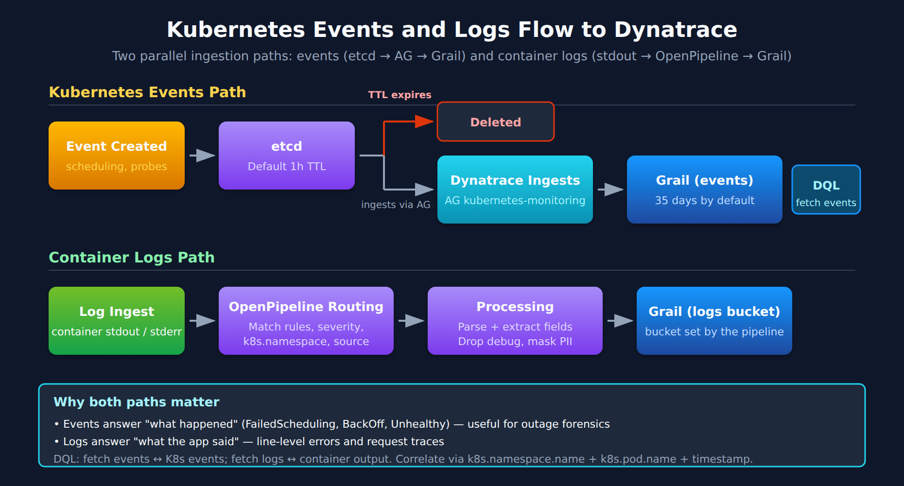

# K8S-07: Kubernetes Events and Log Ingestion

> **Series:** K8S — Kubernetes Monitoring | **Notebook:** 7 of 14 | **Created:** January 2026 | **Last Updated:** 10/02/2026

## Capturing and Analyzing Kubernetes Events and Logs
Kubernetes events and container logs provide crucial insights for debugging and operational awareness. This notebook covers event monitoring, log ingestion configuration, and analysis patterns in Dynatrace.

---

## Table of Contents

1. [Kubernetes Events Overview](#kubernetes-events-overview)
2. [Event Ingestion Configuration](#event-ingestion-configuration)
3. [Container Log Collection](#container-log-collection)
4. [OpenPipeline for K8s Logs](#openpipeline-for-k8s-logs)
5. [Event Analysis Patterns](#event-analysis-patterns)
6. [Log Analysis Patterns](#log-analysis-patterns)
7. [Alerting on Events and Logs](#alerting-on-events-and-logs)

---

## Prerequisites

| Requirement | Details |
|-------------|----------|
| **Dynatrace Environment** | SaaS with log ingestion enabled |
| **DynaKube** | ActiveGate with `kubernetes-monitoring` |
| **Permissions** | `storage:logs:read`, `storage:events:read`; Settings write access to change Kubernetes monitoring settings |
| **Knowledge** | K8S-01 Fundamentals |

<a id="kubernetes-events-overview"></a>
## 1. Kubernetes Events Overview

### Event Types

Kubernetes events are first-class objects that record what happened in the cluster.

| Type | Description | Examples |
|------|-------------|----------|
| **Normal** | Routine operations | Scheduled, Pulled, Created |
| **Warning** | Potential issues | FailedScheduling, BackOff, Unhealthy |

### Event Sources

| Source | Events Generated |
|--------|------------------|
| **Scheduler** | Scheduling decisions, failures |
| **Kubelet** | Pod lifecycle, probe results |
| **Controller Manager** | ReplicaSet scaling, Deployment rollouts |
| **Custom Controllers** | CRD reconciliation events |

### Event Lifecycle



<!-- MARKDOWN_TABLE_ALTERNATIVE
| Stage | Description |
|-------|-------------|
| Event Created | Kubernetes generates event |
| Stored in etcd | Event persisted temporarily |
| TTL expires (1h) | Event deleted from etcd |
| Dynatrace Ingests | Captured before deletion |
| Persisted in Grail | Bucket `default_davis_k8s_ops_events`, 35 days by default |

**Key:** Kubernetes keeps events for 1 hour by default (`--event-ttl`); Dynatrace keeps the ingested copy for the bucket's retention.
For environments where SVG doesn't render
-->

**Important:** Kubernetes events are short-lived. Dynatrace captures them for long-term storage and analysis. On the validation tenant (10/02/2026) they were stored in the `default_davis_k8s_ops_events` bucket, retention 35 days — check `fetch dt.system.buckets` for your own.

<a id="event-ingestion-configuration"></a>
## 2. Event Ingestion Configuration
### ActiveGate Kubernetes Monitoring

Events are read from the Kubernetes API by the ActiveGate with the `kubernetes-monitoring` capability:

```yaml
spec:
  activeGate:
    capabilities:
      - kubernetes-monitoring
      - routing
```

### Event Filtering

Which events are ingested is a **Kubernetes monitoring setting** on the cluster's connection (Kubernetes app → cluster → Settings), not a DynaKube field:

| Setting | What it does |
|---------|--------------|
| **Monitor events** | *"All events are monitored unless event filters are specified. All ingested events are subject to licensing by default."* |
| **Filter events** | *"Include only events specified by Events Field Selectors"* |
| **Events field selectors** | Kubernetes field-selector expressions, for example `type=Warning` or `involvedObject.namespace=checkout` |
| **Include important events** | *"Automatically include all events that are relevant for Davis"* |

### Recommended Configuration

| Use Case | Configuration |
|----------|---------------|
| **Full visibility** | Monitor events on, no filters |
| **Warning focus** | Filter events on, field selector `type=Warning`, Include important events on |
| **Cost control** | As above, plus field selectors limited to the namespaces you need |

> <sub>**Sources:** [Kubernetes monitoring settings schema (DT docs)](https://docs.dynatrace.com/docs/dynatrace-api/environment-api/settings/schemas/builtin-cloud-kubernetes-monitoring) — *"Automatically include all events that are relevant for Davis"*.</sub>

```dql
// Recent Kubernetes events
// Data object corrected 08/12/2026. Kubernetes events are NOT logs. This cell scraped
// `fetch logs` for `log.source` containing "kubernetes" or for content substrings like "BackOff" —
// no log.source matches, and kubelet event text is not in the log stream, so it returned nothing
// while the cluster emitted 231,296 Kubernetes events in the same window.
// They arrive as `fetch events | filter event.provider == "KUBERNETES_EVENT"`, STRUCTURED:
//   dt.kubernetes.event.reason            Unhealthy · BackOff · Killing · FailedScheduling ·
//                                         FailedMount · BackoffLimitExceeded · EvictionThresholdMet …
//   dt.kubernetes.event.message           the human-readable text
//   status                                "WARN" for Kubernetes Warning events, "INFO" for Normal
//   dt.kubernetes.event.involved_object.kind / .name
//   dt.kubernetes.event.count / .first_seen / .last_seen
//   plus k8s.cluster.name · k8s.namespace.name · k8s.pod.name · k8s.workload.name · k8s.node.name
// NOTE: event.type is CUSTOM_INFO on every one of these — it is NOT "Warning". The Warning/Normal
// split is in status ("WARN" / "INFO"). dt.kubernetes.event.important was "true" on all 204,078
// events over 30 days (10/02/2026), so it separates nothing. Enumerate reasons with:
//   fetch events, from:-24h | filter event.provider == "KUBERNETES_EVENT"
//   | summarize n = count(), by:{dt.kubernetes.event.reason} | sort n desc
fetch events, from:-1h
| filter event.provider == "KUBERNETES_EVENT"
| fields timestamp, k8s.cluster.name, k8s.namespace.name, dt.kubernetes.event.reason, dt.kubernetes.event.message
| sort timestamp desc
| limit 50
```

```dql
// Warning-class events only
// Data object corrected 08/12/2026. Kubernetes events are NOT logs. This cell scraped
// `fetch logs` for `log.source` containing "kubernetes" or for content substrings like "BackOff" —
// no log.source matches, and kubelet event text is not in the log stream, so it returned nothing
// while the cluster emitted 231,296 Kubernetes events in the same window.
// They arrive as `fetch events | filter event.provider == "KUBERNETES_EVENT"`, STRUCTURED:
//   dt.kubernetes.event.reason            Unhealthy · BackOff · Killing · FailedScheduling ·
//                                         FailedMount · BackoffLimitExceeded · EvictionThresholdMet …
//   dt.kubernetes.event.message           the human-readable text
//   status                                "WARN" for Kubernetes Warning events, "INFO" for Normal
//   dt.kubernetes.event.involved_object.kind / .name
//   dt.kubernetes.event.count / .first_seen / .last_seen
//   plus k8s.cluster.name · k8s.namespace.name · k8s.pod.name · k8s.workload.name · k8s.node.name
// NOTE: event.type is CUSTOM_INFO on every one of these — it is NOT "Warning". The Warning/Normal
// split is in status ("WARN" / "INFO"). dt.kubernetes.event.important was "true" on all 204,078
// events over 30 days (10/02/2026), so it separates nothing. Enumerate reasons with:
//   fetch events, from:-24h | filter event.provider == "KUBERNETES_EVENT"
//   | summarize n = count(), by:{dt.kubernetes.event.reason} | sort n desc
fetch events, from:-1h
| filter event.provider == "KUBERNETES_EVENT"
| filter status == "WARN"
| summarize events = count(), by:{dt.kubernetes.event.reason, k8s.namespace.name}
| sort events desc
| limit 25
```

<a id="container-log-collection"></a>
## 3. Container Log Collection
### Log Collection Methods

| Method | Source | Configuration |
|--------|--------|---------------|
| **OneAgent Log module** (full-stack) | Container stdout/stderr | Included in the host OneAgent; add `spec.logMonitoring: {}` |
| **Kubernetes Log module** (no host OneAgent) | Container stdout/stderr | DaemonSet deployed by the Operator from `spec.logMonitoring` |
| **Fluent Bit / other forwarders** | Any file or stream | Log ingest API or OTLP endpoint |

### What the Log modules collect

*"It only captures logs that are written to the container's **stdout**/**stderr** streams."* Logs an application writes to files inside the container need a forwarder or a custom log source.

### Log Attributes

| Attribute | Source | Example |
|-----------|--------|----------|
| `k8s.namespace.name` | Container metadata | `checkout` |
| `k8s.pod.name` | Container metadata | `checkout-api-abc123` |
| `k8s.container.name` | Container metadata | `api` |
| `k8s.workload.name` | Container metadata | `checkout-api` |
| `k8s.cluster.name` | Container metadata | `prod-eu-1` |
| `loglevel` | Parsed from content | `ERROR`, `WARN`, `INFO` |

### DynaKube Log Configuration

```yaml
spec:
  logMonitoring: {}
  templates:
    logMonitoring:            # only for the standalone Kubernetes Log module
      imageRef:
        repository: public.ecr.aws/dynatrace/dynatrace-logmodule
        tag: <tag>
```

> <sub>**Sources:** [Kubernetes log monitoring (DT docs)](https://docs.dynatrace.com/docs/ingest-from/setup-on-k8s/deployment/k8s-log-monitoring) — *"It only captures logs that are written to the container's **stdout**/**stderr** streams."*</sub>

```dql
// Container logs by namespace
fetch logs, from:-1h
| filter isNotNull(k8s.namespace.name)
| summarize logCount = count(), by:{k8s.namespace.name}
| sort logCount desc
| limit 15
```

```dql
// Error logs with Kubernetes context
fetch logs, from:-1h
| filter loglevel == "ERROR" or loglevel == "SEVERE"
| filter isNotNull(k8s.namespace.name)
| fields timestamp, k8s.namespace.name, k8s.pod.name, content
| sort timestamp desc
| limit 30
```

<a id="openpipeline-for-k8s-logs"></a>
## 4. OpenPipeline for K8s Logs
### Log Processing Pipeline

OpenPipeline processes logs between ingest and storage. A record arrives at an ingest source, **dynamic routing** sends it to a pipeline whose matcher it satisfies, the pipeline's **processing** stage transforms it, and the **storage** stage assigns its bucket. Pipelines are configured in the OpenPipeline settings (UI, Settings API or Monaco), not as YAML in the cluster.

### Common Processing Rules

| Processor | Use Case | Example |
|-----------|----------|----------|
| **DQL** | Extract fields | `parse content, "JSON:parsed"` |
| **Fields rename / remove** | Tidy fields | Drop a high-cardinality attribute |
| **Masking** (DQL `replacePattern`) | Remove sensitive data | Card numbers, tokens |
| **Drop record** | Drop logs | Debug logs from noisy namespaces |
| **Storage assignment** | Choose the bucket | Retention by namespace or team |

### Example: route Kubernetes logs and parse JSON

- **Routing matcher:** `isNotNull(k8s.namespace.name)`
- **Processing — DQL processor, matcher `startsWith(content, "{")`:**

```dql
parse content, "JSON:parsed"
| fieldsFlatten parsed
```

### Example: drop debug logs

- **Processing — Drop record processor, matcher:** `loglevel == "DEBUG"`

Building, testing and ordering pipelines is covered in the OPLOGS series.

<a id="event-analysis-patterns"></a>
## 5. Event Analysis Patterns
### Key Event Reasons to Monitor

| Reason | Meaning | Action |
|--------|---------|--------|
| **FailedScheduling** | Pod can't be scheduled | Check resource availability |
| **FailedMount** | Volume mount failed | Check PV/PVC config |
| **BackOff** | Container restart backoff | Check logs, fix crash |
| **Unhealthy** | Probe failed | Check probe config, app health |
| **Evicted** | Pod evicted from node | Check node pressure |
| **OOM kill** | Container exceeded its memory limit | Not an event reason — read the `dt.kubernetes.container.oom_kills` metric (K8S-04 §5) |

```dql
// Failed scheduling events
// Data object corrected 08/12/2026. Kubernetes events are NOT logs. This cell scraped
// `fetch logs` for `log.source` containing "kubernetes" or for content substrings like "BackOff" —
// no log.source matches, and kubelet event text is not in the log stream, so it returned nothing
// while the cluster emitted 231,296 Kubernetes events in the same window.
// They arrive as `fetch events | filter event.provider == "KUBERNETES_EVENT"`, STRUCTURED:
//   dt.kubernetes.event.reason            Unhealthy · BackOff · Killing · FailedScheduling ·
//                                         FailedMount · BackoffLimitExceeded · EvictionThresholdMet …
//   dt.kubernetes.event.message           the human-readable text
//   status                                "WARN" for Kubernetes Warning events, "INFO" for Normal
//   dt.kubernetes.event.involved_object.kind / .name
//   dt.kubernetes.event.count / .first_seen / .last_seen
//   plus k8s.cluster.name · k8s.namespace.name · k8s.pod.name · k8s.workload.name · k8s.node.name
// NOTE: event.type is CUSTOM_INFO on every one of these — it is NOT "Warning". The Warning/Normal
// split is in status ("WARN" / "INFO"). dt.kubernetes.event.important was "true" on all 204,078
// events over 30 days (10/02/2026), so it separates nothing. Enumerate reasons with:
//   fetch events, from:-24h | filter event.provider == "KUBERNETES_EVENT"
//   | summarize n = count(), by:{dt.kubernetes.event.reason} | sort n desc
fetch events, from:-7d
| filter event.provider == "KUBERNETES_EVENT"
| filter dt.kubernetes.event.reason == "FailedScheduling"
| fields timestamp, k8s.namespace.name, dt.kubernetes.event.involved_object.name, dt.kubernetes.event.message
| sort timestamp desc
| limit 25
```

```dql
// Restart back-off events (BackOff, BackoffLimitExceeded)
// CrashLoopBackOff is not a reason of its own: it appears in the message text of BackOff events.
// For restart counts, use the dt.kubernetes.container.restarts metric (K8S-05 §2).
// Data object corrected 08/12/2026. Kubernetes events are NOT logs. This cell scraped
// `fetch logs` for `log.source` containing "kubernetes" or for content substrings like "BackOff" —
// no log.source matches, and kubelet event text is not in the log stream, so it returned nothing
// while the cluster emitted 231,296 Kubernetes events in the same window.
// They arrive as `fetch events | filter event.provider == "KUBERNETES_EVENT"`, STRUCTURED:
//   dt.kubernetes.event.reason            Unhealthy · BackOff · Killing · FailedScheduling ·
//                                         FailedMount · BackoffLimitExceeded · EvictionThresholdMet …
//   dt.kubernetes.event.message           the human-readable text
//   status                                "WARN" for Kubernetes Warning events, "INFO" for Normal
//   dt.kubernetes.event.involved_object.kind / .name
//   dt.kubernetes.event.count / .first_seen / .last_seen
//   plus k8s.cluster.name · k8s.namespace.name · k8s.pod.name · k8s.workload.name · k8s.node.name
// NOTE: event.type is CUSTOM_INFO on every one of these — it is NOT "Warning". The Warning/Normal
// split is in status ("WARN" / "INFO"). dt.kubernetes.event.important was "true" on all 204,078
// events over 30 days (10/02/2026), so it separates nothing. Enumerate reasons with:
//   fetch events, from:-24h | filter event.provider == "KUBERNETES_EVENT"
//   | summarize n = count(), by:{dt.kubernetes.event.reason} | sort n desc
fetch events, from:-24h
| filter event.provider == "KUBERNETES_EVENT"
| filter in(dt.kubernetes.event.reason, {"BackOff", "BackoffLimitExceeded"})
| summarize events = count(), by:{k8s.namespace.name, dt.kubernetes.event.involved_object.name}
| sort events desc
| limit 25
```

```dql
// Volume mount and storage failures
// Data object corrected 08/12/2026. Kubernetes events are NOT logs. This cell scraped
// `fetch logs` for `log.source` containing "kubernetes" or for content substrings like "BackOff" —
// no log.source matches, and kubelet event text is not in the log stream, so it returned nothing
// while the cluster emitted 231,296 Kubernetes events in the same window.
// They arrive as `fetch events | filter event.provider == "KUBERNETES_EVENT"`, STRUCTURED:
//   dt.kubernetes.event.reason            Unhealthy · BackOff · Killing · FailedScheduling ·
//                                         FailedMount · BackoffLimitExceeded · EvictionThresholdMet …
//   dt.kubernetes.event.message           the human-readable text
//   status                                "WARN" for Kubernetes Warning events, "INFO" for Normal
//   dt.kubernetes.event.involved_object.kind / .name
//   dt.kubernetes.event.count / .first_seen / .last_seen
//   plus k8s.cluster.name · k8s.namespace.name · k8s.pod.name · k8s.workload.name · k8s.node.name
// NOTE: event.type is CUSTOM_INFO on every one of these — it is NOT "Warning". The Warning/Normal
// split is in status ("WARN" / "INFO"). dt.kubernetes.event.important was "true" on all 204,078
// events over 30 days (10/02/2026), so it separates nothing. Enumerate reasons with:
//   fetch events, from:-24h | filter event.provider == "KUBERNETES_EVENT"
//   | summarize n = count(), by:{dt.kubernetes.event.reason} | sort n desc
fetch events, from:-7d
| filter event.provider == "KUBERNETES_EVENT"
| filter in(dt.kubernetes.event.reason, {"FailedMount", "FailedAttachVolume", "FreeDiskSpaceFailed", "EvictionThresholdMet"})
| fields timestamp, k8s.namespace.name, dt.kubernetes.event.reason, dt.kubernetes.event.message
| sort timestamp desc
| limit 25
```

```dql
// Event frequency by reason (last 24h)
// Data object corrected 08/12/2026. Kubernetes events are NOT logs. This cell scraped
// `fetch logs` for `log.source` containing "kubernetes" or for content substrings like "BackOff" —
// no log.source matches, and kubelet event text is not in the log stream, so it returned nothing
// while the cluster emitted 231,296 Kubernetes events in the same window.
// They arrive as `fetch events | filter event.provider == "KUBERNETES_EVENT"`, STRUCTURED:
//   dt.kubernetes.event.reason            Unhealthy · BackOff · Killing · FailedScheduling ·
//                                         FailedMount · BackoffLimitExceeded · EvictionThresholdMet …
//   dt.kubernetes.event.message           the human-readable text
//   status                                "WARN" for Kubernetes Warning events, "INFO" for Normal
//   dt.kubernetes.event.involved_object.kind / .name
//   dt.kubernetes.event.count / .first_seen / .last_seen
//   plus k8s.cluster.name · k8s.namespace.name · k8s.pod.name · k8s.workload.name · k8s.node.name
// NOTE: event.type is CUSTOM_INFO on every one of these — it is NOT "Warning". The Warning/Normal
// split is in status ("WARN" / "INFO"). dt.kubernetes.event.important was "true" on all 204,078
// events over 30 days (10/02/2026), so it separates nothing. Enumerate reasons with:
//   fetch events, from:-24h | filter event.provider == "KUBERNETES_EVENT"
//   | summarize n = count(), by:{dt.kubernetes.event.reason} | sort n desc
fetch events, from:-24h
| filter event.provider == "KUBERNETES_EVENT"
| summarize events = count(), by:{dt.kubernetes.event.reason, status}
| sort events desc
| limit 25
```

<a id="log-analysis-patterns"></a>
## 6. Log Analysis Patterns
### Error Log Investigation

```dql
// Pattern: Find errors with full context
fetch logs, from:-1h
| filter loglevel == "ERROR"
| filter k8s.namespace.name == "checkout"
| fields timestamp, k8s.pod.name, content
| sort timestamp desc
| limit 50
```

### Log Volume Analysis

```dql
// Pattern: Identify noisy pods
fetch logs, from:-1h
| summarize count = count(), by:{k8s.pod.name}
| sort count desc
| limit 10
```

### Exception Tracking

```dql
// Pattern: Find stack traces
fetch logs, from:-1h
| filter matchesPhrase(content, "Exception") or matchesPhrase(content, "Traceback")
| fields timestamp, k8s.namespace.name, content
| sort timestamp desc
| limit 20
```

```dql
// Log volume by pod (find noisy pods)
fetch logs, from: now() - 1h
| filter isNotNull(k8s.pod.name)
| summarize logCount = count(), by:{k8s.pod.name}
| sort logCount desc
| limit 15
```

```dql
// Exception and error messages
fetch logs, from:-1h
| filter matchesPhrase(content, "Exception") or matchesPhrase(content, "error") or matchesPhrase(content, "failed")
| filter isNotNull(k8s.namespace.name)
| fields timestamp, k8s.namespace.name, k8s.pod.name, content
| sort timestamp desc
| limit 30
```

```dql
// Log level distribution by namespace
fetch logs, from: now() - 1h
| filter isNotNull(k8s.namespace.name) and isNotNull(loglevel)
| summarize count = count(), by:{k8s.namespace.name, loglevel}
| sort count desc
| limit 30
```

<a id="alerting-on-events-and-logs"></a>
## 7. Alerting on Events and Logs
### Event-Based Alerts

| Alert | Condition | Severity |
|-------|-----------|----------|
| **Failed Scheduling** | FailedScheduling events > 5 in 10 min | Warning |
| **Crash Loop** | BackOff events (reason `BackOff`) | Warning |
| **OOM Kills** | `dt.kubernetes.container.oom_kills` > 0 (a metric, not an event) | Critical |
| **Volume Failures** | FailedMount events | Critical |

### Log-Based Alerts

| Alert | Condition | Severity |
|-------|-----------|----------|
| **Error Spike** | Error log count > baseline | Warning |
| **Critical Errors** | Specific error patterns | Critical |
| **No Logs** | Log volume drops to 0 | Warning |

### Custom alerts on logs and events

Build the alert as a **custom alert on a DQL query** — a `makeTimeseries` count of matching log records or Kubernetes events — with a static threshold or an adaptive baseline. Where you create it depends on your tenant version: *"Starting with Dynatrace version 1.344, custom alerts have moved to Settings. Because Anomaly Detection is deprecated, we highly recommend that you use Settings to access your existing configurations and create new ones."* SaaS 1.344 rolls out to tenants in stages; on earlier versions the **Anomaly Detection** app is where custom alerts are created. ALERT-02 covers choosing the detector, and ALERT-03 routing the problem it raises.

> <sub>**Sources:** [Anomaly Detection (DT docs)](https://docs.dynatrace.com/docs/dynatrace-intelligence/anomaly-detection/anomaly-detection-app) — *"Starting with Dynatrace version 1.344, custom alerts have moved to Settings."*</sub>

## Next Steps

With event and log monitoring configured, proceed to:

| Next Notebook | Topic |
|---------------|-------|
| **K8S-08: DQL for Kubernetes** | Advanced query patterns |
| **K8S-09: Troubleshooting** | Debugging K8s monitoring |

---

## Summary

In this notebook, you learned:

- Kubernetes event types and sources
- Event ingestion configuration via DynaKube
- Container log collection methods
- OpenPipeline for log processing
- Event analysis patterns for common issues
- Log analysis patterns for debugging
- Alerting strategies for events and logs

---

## References

- [Kubernetes log monitoring (DT docs)](https://docs.dynatrace.com/docs/ingest-from/setup-on-k8s/deployment/k8s-log-monitoring)
- [Set up Dynatrace on Kubernetes (DT docs)](https://docs.dynatrace.com/docs/ingest-from/setup-on-k8s)
- [Logs (DT docs)](https://docs.dynatrace.com/docs/analyze-explore-automate/logs)
- [Log processing with OpenPipeline (DT docs)](https://docs.dynatrace.com/docs/analyze-explore-automate/logs/lma-log-processing/lma-openpipeline)
- [OpenPipeline (DT docs)](https://docs.dynatrace.com/docs/platform/openpipeline)
- [Kubernetes app — events view (DT docs)](https://docs.dynatrace.com/docs/observe/infrastructure-observability/kubernetes-app)
- [Dynatrace Operator releases (Dynatrace GitHub)](https://github.com/Dynatrace/dynatrace-operator/releases)

---

<sub>*This notebook was AI-generated from community-submitted and publicly available sources. This notebook series is not officially supported by Dynatrace. Always verify information against official Dynatrace documentation.*</sub>
