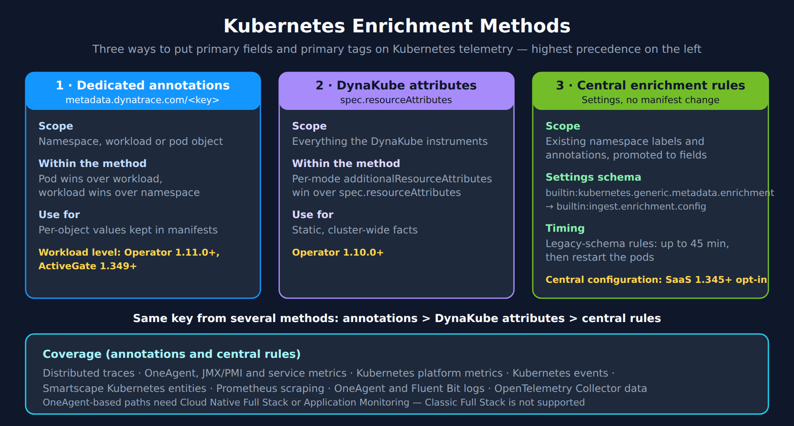

# K8S-10: Metadata Telemetry Enrichment

> **Series:** K8S — Kubernetes Monitoring | **Notebook:** 10 of 14 | **Created:** January 2026 | **Last Updated:** 10/06/2026

## Enriching All Telemetry with Kubernetes Metadata
Kubernetes metadata enrichment automatically adds labels and annotations from your Kubernetes resources to all telemetry signals. This is the **recommended approach** for adding context to your observability data because it enriches everything: metrics, logs, traces, events, and entities.

---

## Table of Contents

1. [Why Metadata Enrichment?](#why-metadata-enrichment)
2. [Enrichment Methods Comparison](#enrichment-methods-comparison)
3. [DynaKube Configuration](#dynakube-configuration)
4. [Configuring Settings-Based Enrichment](#configuring-settings-based-enrichment)
5. [Namespace Selectors](#namespace-selectors)
6. [Understanding Enrichment Files](#understanding-enrichment-files)
7. [Querying Enriched Data](#querying-enriched-data)
8. [Use Cases](#use-cases)
9. [Settings API](#settings-api)
10. [Troubleshooting](#troubleshooting)

---

### OneAgent Attribute Enrichment (OneAgent 1.333+)

> **Requires:** OneAgent version **1.333** or later

OneAgent can enrich **all telemetry signals** (metrics, spans, logs, events, entities) with custom metadata at the source — before data reaches the Dynatrace platform. This is more efficient than server-side tagging (auto-tags) because enrichment happens on the host and propagates to all Smartscape nodes.

**Primary Fields** (standardized from Semantic Dictionary):
- `dt.security_context` — data governance and access control
- `dt.cost.costcenter` — cost allocation
- `dt.cost.product` — product attribution

**Primary Tags** (custom key-value pairs):
- `primary_tags.environment` — environment identification (production, staging, etc.)
- `primary_tags.team` — team ownership
- `primary_tags.business_unit` — organizational unit

**Configuration:**

```bash
# Set during OneAgent installation
Dynatrace-OneAgent-Linux.sh --set-host-tag="primary_tags.environment=production" --set-host-tag="dt.security_context=confidential"

# Set on existing agents via oneagentctl
oneagentctl --set-host-tag="primary_tags.environment=production"
oneagentctl --set-host-tag="dt.cost.costcenter=12345"

# Per-process via environment variable (overrides host-level)
DT_TAGS="primary_tags.team=platform primary_tags.environment=production"
```

**Benefits over auto-tagging:**
| Aspect | Auto-Tags (Server-Side) | Attribute Enrichment (Agent-Side) |
|--------|------------------------|----------------------------------|
| When applied | After data arrives at platform | At the source, before transmission |
| Scope | Entity tags only | All signals: metrics, spans, logs, events, entities |
| Grail integration | Limited | Full — feeds OpenPipeline routing, bucket assignment, permissions |
| Cost allocation | Not supported | `dt.cost.costcenter`, `dt.cost.product` fields |
| Security context | Not supported | `dt.security_context` for data governance |

> **See:** [Primary Grail fields and tags enrichment through OneAgent](https://docs.dynatrace.com/docs/ingest-from/dynatrace-oneagent/oneagent-attribute-enrichment)

## Prerequisites

| Requirement | Details |
|-------------|----------|
| **Dynatrace Environment** | SaaS with Grail |
| **Permissions** | `settings:objects:read`, `settings:objects:write` (classic tokens: `settings.read`, `settings.write`) |
| **DynaKube** | Deployed with OneAgent injection, or with `metadataEnrichment.enabled: true` |
| **Kubernetes** | Namespaces with labels/annotations to enrich |

<a id="why-metadata-enrichment"></a>
## 1. Why Metadata Enrichment?
Kubernetes metadata enrichment solves a critical observability challenge: **connecting telemetry to business context**.

### Common Use Cases

| Use Case | Metadata Example | Benefit |
|----------|------------------|----------|
| **Cost allocation** | `cost-center: finance` | Attribute costs to teams |
| **Environment identification** | `env: production` | Filter by deployment stage |
| **Team ownership** | `team: checkout` | Route alerts to owners |
| **Compliance tagging** | `compliance: pci-dss` | Identify regulated workloads |
| **Application grouping** | `app: ecommerce` | Group related services |

### What Gets Enriched

With settings-based enrichment, **all signals** receive metadata:

| Signal Type | Enriched? | Notes |
|-------------|-----------|-------|
| Logs | Yes | All container and pod logs |
| Metrics | Yes | Including Kubernetes platform metrics |
| Spans/Traces | Yes | Distributed tracing data |
| Events | Yes | Kubernetes events |
| Entities | Yes | Smartscape topology |

### Primary Grail Fields and Tags

In addition to settings-based enrichment, Dynatrace automatically propagates certain **Primary Grail Fields** across all signal types. These fields are indexed, require no configuration, and are the foundation for cross-signal data organization:

| Primary Grail Field | DQL Field | Propagation |
|---------------------|-----------|-------------|
| Kubernetes Cluster | `k8s.cluster.name` | All signals |
| Kubernetes Namespace | `k8s.namespace.name` | All signals |
| Host Group | `dt.host_group.id` | All signals |
| AWS Account | `aws.account.id` | All signals |

**Primary Grail Tags** (prefix `primary_tags.`) extend this concept for custom dimensions like `primary_tags.app` or `primary_tags.team`. Use them when Primary Grail Fields don't align with your organizational structure (e.g., shared infrastructure hosting multiple applications).

#### Setting Primary Tags Directly from Kubernetes

The [Kubernetes tag setup (DT docs)](https://docs.dynatrace.com/docs/manage/tags/primary-tags/tags-domain-k8s) page documents dedicated `metadata.dynatrace.com` annotations for primary tags and primary fields:

```yaml
metadata:
  annotations:
    metadata.dynatrace.com/primary_tags.team: payments
    metadata.dynatrace.com/primary_tags.environment: production
    metadata.dynatrace.com/dt.security_context: confidential
    metadata.dynatrace.com/dt.cost.costcenter: it_services
```

They can sit on a namespace, a workload object or a pod. Within the annotations, *"the pod-level value wins over the workload-level value, and the workload-level value wins over the namespace-level value."* Across the enrichment methods, *"the priority from highest to lowest is: metadata.dynatrace.com/<key> annotations DynaKube resource attributes Central enrichment rules"* — § 2 compares the three.

| Capability | Minimum versions (Kubernetes tag setup page, read 10/02/2026) |
|---|---|
| Kubernetes primary-field and tag enrichment | Operator 1.10+, OneAgent 1.333+, ActiveGate 1.343+ |
| Workload-level annotations | Operator 1.11.0+, ActiveGate 1.349+ |
| At-source host and process tags (`--set-host-tag`, `DT_TAGS`) | OneAgent 1.333+ |
| Central configuration opt-in | Dynatrace platform 1.345+ (§ 9) |

Operator 1.11.0 (released 10/01/2026) and ActiveGate 1.347 (rollout from 09/30/2026) both announce workload and pod labels and annotations as enrichment sources, but the docs page gates the workload level on **ActiveGate 1.349** — use that figure, and verify your ActiveGate version before relying on workload-level values. Until then, namespace- and pod-level annotations are the working path. Agent and ActiveGate versions lag the tenant version, so check the fleet, not the tenant.

> <sub>**Sources:** [Kubernetes tag setup (DT docs)](https://docs.dynatrace.com/docs/manage/tags/primary-tags/tags-domain-k8s) — *"When the same key is set at multiple levels, the pod-level value wins over the workload-level value, and the workload-level value wins over the namespace-level value."*, [Operator 1.11.0 release notes (DT docs)](https://docs.dynatrace.com/docs/whats-new/dynatrace-operator/dto-fix-1-11-0) — *"the ingest enrichment configuration now supports workload and pod annotations and labels as sources for primary tags and Kubernetes tags."*</sub>

**Cost allocation fields** like `dt.cost.costcenter` and `dt.cost.product` also propagate to service metrics, enabling chargeback reporting across teams.

> **See also:** **ORGNZ-10: Advanced Segment Definitions** covers Primary Grail Fields in depth, including enrichment approaches for dedicated vs. shared infrastructure scenarios.

<a id="enrichment-methods-comparison"></a>
## 2. Enrichment Methods Comparison
Dynatrace offers multiple ways to add Kubernetes metadata. Choose based on your needs:



<!-- MARKDOWN_TABLE_ALTERNATIVE
| Method | Scope | Precedence | Use for |
|--------|-------|------------|---------|
| Dedicated `metadata.dynatrace.com` annotations | Namespace, workload (Operator 1.11.0+, AG 1.349+) or pod | Highest; pod > workload > namespace | Per-object values kept in manifests |
| DynaKube resource attributes | Everything the DynaKube instruments | Middle | Static, cluster-wide facts |
| Central enrichment rules (Settings) | Existing namespace labels and annotations | Lowest | Promoting labels you already have, with no manifest change |

Coverage: annotations and central rules both reach traces, OneAgent/JMX/service metrics, Kubernetes platform metrics, Kubernetes events, Smartscape Kubernetes entities, Prometheus scraping, OneAgent and Fluent Bit logs, and OpenTelemetry Collector data. OneAgent-based paths need Cloud Native Full Stack or Application Monitoring.
For environments where SVG doesn't render
-->

### Choosing a method

- **Central enrichment rules** promote namespace labels and annotations you already maintain, from one place in Settings, with no change to manifests.
- **Dedicated annotations** carry values that differ per workload or pod, and win over every other method when the same key is set twice.
- **DynaKube resource attributes** attach fixed, cluster-wide facts (account, platform team) to everything the DynaKube instruments.

The docs' coverage table marks the same signals for central rules and dedicated annotations, so the choice is about where the value is maintained, not which signals it reaches. OneAgent-based enrichment *"requires the Cloud Native Full Stack or Application Monitoring deployment mode. Classic Full Stack is not supported."*

> <sub>**Sources:** [Kubernetes tag setup (DT docs)](https://docs.dynatrace.com/docs/manage/tags/primary-tags/tags-domain-k8s) — *"OneAgent-based enrichment requires the Cloud Native Full Stack or Application Monitoring deployment mode. Classic Full Stack is not supported."*</sub>

> **New (ActiveGate 1.345 — rollout from 08/25/2026): Kubernetes ingest enrichment supports custom rules.** The release note states plainly that *"ActiveGate now supports ingest enrichment for custom rules."* This adds a third lever alongside the DynaKube-level and settings-based methods compared above: enrichment applied at the ActiveGate on ingest, driven by your own rules rather than only the built-in Kubernetes metadata set. Where you already maintain enrichment in two places, check whether a custom ingest rule consolidates it — and mind precedence, since another enrichment source setting the same key still wins or loses by the precedence order above. One documented limit from the same release note: *"Ingest enrichment rules with conditions are ignored by the ActiveGate."* — a conditional rule silently does nothing on this path, so keep conditional logic in the settings-based method.
>
> The same release adds **`container.runtime.name` to the Smartscape `CONTAINER` node** — useful for fleets running more than one runtime (containerd, CRI-O, gVisor), because it makes "which runtime is this workload on" a queryable dimension rather than a node-labelling exercise. That matters in practice: gVisor is exactly the runtime behind the `dynatrace-webhook` `CrashLoopBackOff` fixed in Operator 1.10.2, and this field is how you find those nodes before an upgrade.

> <sub>**Sources:** [ActiveGate 1.345 release notes (DT docs)](https://docs.dynatrace.com/docs/whats-new/activegate/sprint-345) — custom-rule ingest enrichment and the `container.runtime.name` field on the Smartscape `CONTAINER` node, read 08/28/2026.</sub>

<a id="dynakube-configuration"></a>
## 3. DynaKube Configuration
Metadata enrichment must be enabled in your DynaKube custom resource.

### Enable Metadata Enrichment

```yaml
apiVersion: dynatrace.com/v1beta6
kind: DynaKube
metadata:
  name: dynakube
  namespace: dynatrace
spec:
  apiUrl: https://ENVIRONMENT_ID.live.dynatrace.com/api
  
  # In v1beta6, metadataEnrichment.enabled is false by default; OneAgent
  # injection enables enrichment for injected pods on its own. Set it to
  # true for enrichment without OneAgent injection.
  metadataEnrichment:
    enabled: true
  
  oneAgent:
    cloudNativeFullStack: {}
  
  activeGate:
    capabilities:
      - kubernetes-monitoring
```

### Disable Metadata Enrichment (if needed)

```yaml
spec:
  metadataEnrichment:
    enabled: false
```

### Defining Resource Attributes in the DynaKube (Operator 1.10.0+)

Dynatrace Operator **1.10.0** (released July 15, 2026) adds a cluster-scoped enrichment surface: static resource attributes defined directly in the DynaKube spec. The [Kubernetes tag setup (DT docs)](https://docs.dynatrace.com/docs/manage/tags/primary-tags/tags-domain-k8s) page positions this mechanism in the primary-tag specificity chain below pod/namespace annotations and above central configuration rules. Three spec fields participate:

| Spec field | Applies to | Precedence |
|------------|-----------|------------|
| `.spec.resourceAttributes` | All signals (OneAgent, OTLP, log monitoring, ActiveGate) | Base — overridden by the mode-specific fields below on duplicate keys |
| `.spec.oneAgent.<mode>.additionalResourceAttributes` | OneAgent-emitted signals only | Wins over `.spec.resourceAttributes` on duplicate keys |
| `.spec.otlpExporterConfiguration.additionalResourceAttributes` | OTLP telemetry only | Wins over `.spec.resourceAttributes` on duplicate keys |

```yaml
spec:
  resourceAttributes:
    aws.account.id: "123456789012"
  oneAgent:
    cloudNativeFullStack:
      additionalResourceAttributes:
        my.team: platform
  otlpExporterConfiguration:
    additionalResourceAttributes:
      my.team: platform
```

Constraints documented with the feature:

- A **soft limit of 10 attributes** applies across `.spec.resourceAttributes` and all `additionalResourceAttributes` blocks combined.
- Keys are sanitized (invalid DNS characters replaced); keys over 63 characters violate Kubernetes label limits.
- When both OneAgent and OTLP injection are active on the same pod, **conflicting keys produce undefined behavior** — keep the two mode-specific blocks consistent.
- The values are cluster-scoped and static. Use pod/namespace annotations for per-workload values; use this surface for cluster-wide facts (account IDs, environment, owning platform team).

> **Running an earlier Operator?** These spec fields require Operator 1.10.0+ — on earlier versions the DynaKube rejects them at admission. The namespace/pod annotation path and the settings-based enrichment described in this notebook remain the working paths until your clusters upgrade.

### Tagging Rule Precedence Changed in Operator 1.10.2

**Operator 1.10.2** (released July 30, 2026) fixed a regression in Kubernetes workload and namespace tagging where, when several rules matched the same key, **each subsequent matching rule overwrote the previous one**. From 1.10.2, **only the first matching rule for a given key applies**.

This is a **behaviour change, not only a defect fix**, and it is the one thing to check before upgrading:

| Your rule set | Effect of upgrading to 1.10.2 |
|---|---|
| At most one rule per key | None. The fix is invisible to you. |
| Several rules matching the same key, and you relied on the **last** one winning | **Tag values change.** The first matching rule now wins instead. Audit and reorder before you upgrade. |
| Several rules matching the same key, ordering incidental | Values may change; confirm the winner is the one you want. |

Because these tags flow into `dt.security_context`, cost fields and primary tags, a silent flip changes what IAM boundaries admit and how cost is attributed — the failure is in *routing and access*, not in an error message. Audit first:

```bash
# List the enrichment/tagging rules currently configured
kubectl -n dynatrace get dynakube -o yaml | grep -A20 "resourceAttributes"

# After upgrading, confirm the resulting values on live telemetry
```

```dql
// Which security contexts and primary tags are actually landing on telemetry?
fetch logs, from:-1h
| filter isNotNull(dt.security_context)
| summarize recordCount = count(), by:{k8s.cluster.name, k8s.namespace.name, dt.security_context}
| sort recordCount desc
| limit 50
```

The same release also **starts logging metadata-enrichment rules the Operator cannot apply** instead of disregarding them silently — so after upgrading, the operator log is worth reading once for rules that were never taking effect:

```bash
kubectl -n dynatrace logs -l app.kubernetes.io/name=dynatrace-operator --tail=200 | grep -i enrich
```

> **Adopting on your own schedule.** Operator upgrades roll out per estate, not per tenant. Until 1.10.2 reaches a given cluster, the previous last-rule-wins behaviour is what that cluster exhibits — and everything else in this notebook describes it correctly. Plan the rule audit as part of the upgrade, not after it.

> **See:** [Metadata enrichment (DT docs)](https://docs.dynatrace.com/docs/ingest-from/setup-on-k8s/guides/metadata-automation/metadata-enrichment), [Operator 1.10.0 release notes (DT docs)](https://docs.dynatrace.com/docs/whats-new/dynatrace-operator/dto-fix-1-10-0), [Operator 1.10.2 release notes (DT docs)](https://docs.dynatrace.com/docs/whats-new/dynatrace-operator/dto-fix-1-10-2)

<a id="configuring-settings-based-enrichment"></a>
## 4. Configuring Settings-Based Enrichment
### Access Settings

Rules live in the **Kubernetes telemetry enrichment** setting (schema `builtin:kubernetes.generic.metadata.enrichment`), at environment or cluster scope. § 9 covers the central configuration that replaces this schema from SaaS 1.345.

### Rule Configuration Options

| Field | Description |
|-------|-------------|
| **Metadata type** | `LABEL` or `ANNOTATION` — *"Only namespace-level labels or annotations can be used as source."* |
| **Source** | The label or annotation key on the namespace |
| **Target** | `dt.security_context`, `dt.cost.costcenter` or `dt.cost.product` |
| **Enrich telemetry with label/annotation directly** | Adds the value as a field of its own, for example `k8s.namespace.label.<key>` |

Up to 20 rules. *"New rules may take up to 45 minutes to take effect. Pod restarts are required after the 45 mins to ensure the changes take effect."*

### Example: Capture Team, Cost Center and Environment

If your namespaces have:

```yaml
apiVersion: v1
kind: Namespace
metadata:
  name: checkout
  labels:
    team: checkout-team
    cost-center: engineering
    env: production
```

Create enrichment rules:

| Rule | Metadata Type | Source | Target / option | Field on telemetry |
|------|---------------|--------|-----------------|--------------------|
| 1 | Label | `team` | Target `dt.security_context` | `dt.security_context: checkout-team` |
| 2 | Label | `cost-center` | Target `dt.cost.costcenter` | `dt.cost.costcenter: engineering` |
| 3 | Label | `env` | Enrich directly | `k8s.namespace.label.env: production` |

> <sub>**Sources:** [Kubernetes telemetry enrichment schema (DT docs)](https://docs.dynatrace.com/docs/dynatrace-api/environment-api/settings/schemas/builtin-kubernetes-generic-metadata-enrichment) — *"New rules may take up to 45 minutes to take effect. Pod restarts are required after the 45 mins to ensure the changes take effect."*</sub>

<a id="namespace-selectors"></a>
## 5. Namespace Selectors
By default, enrichment rules apply to **all namespaces**. Use namespace selectors to limit scope.

### DynaKube Namespace Selector

If your DynaKube uses a `namespaceSelector`, ensure it matches the namespaces you want to enrich:

```yaml
spec:
  metadataEnrichment:
    enabled: true
    namespaceSelector:
      matchLabels:
        dynatrace-enrich: enabled
```

### Labeling Namespaces for Enrichment

```bash
# Enable enrichment for a namespace
kubectl label namespace checkout dynatrace-enrich=enabled

# Verify labels
kubectl get namespace checkout --show-labels
```

### Match Expressions

For more complex selection:

```yaml
namespaceSelector:
  matchExpressions:
    - key: env
      operator: In
      values:
        - production
        - staging
```

<a id="understanding-enrichment-files"></a>
## 6. Understanding Enrichment Files
The Dynatrace Operator creates enrichment files that are used by OneAgent and applications.

### File Locations

| File | Location | Purpose |
|------|----------|----------|
| `dt_metadata.json` | `/var/lib/dynatrace/enrichment/` in the pod | JSON format metadata |
| `dt_metadata.properties` | `/var/lib/dynatrace/enrichment/` in the pod | Properties format |

The Operator also writes the same metadata to the `metadata.dynatrace.com` pod annotation, and DynaKube resource attributes to `dt_node_metadata.properties` for host OneAgents.

### Example dt_metadata.json Content

```json
{
  "k8s.cluster.name": "prod-eu-1",
  "k8s.namespace.name": "checkout",
  "k8s.pod.name": "checkout-api-7d9f8c6b4d-x2k9m",
  "k8s.workload.kind": "deployment",
  "k8s.workload.name": "checkout-api"
}
```

### Accessing Enrichment Files in Applications

For manual instrumentation or custom applications:

```python
import json
import os

# Load Dynatrace metadata
enrichment_paths = [
    '/var/lib/dynatrace/enrichment/dt_metadata.json',
]

metadata = {}
for path in enrichment_paths:
    if os.path.exists(path):
        with open(path) as f:
            metadata.update(json.load(f))

print(metadata)
```

> <sub>**Sources:** [Metadata enrichment (DT docs)](https://docs.dynatrace.com/docs/ingest-from/setup-on-k8s/guides/metadata-automation/metadata-enrichment) — *"Dynatrace Operator writes metadata to the enrichment directory at /var/lib/dynatrace/enrichment and to the metadata.dynatrace.com pod annotation."*</sub>

<a id="querying-enriched-data"></a>
## 7. Querying Enriched Data
Once enrichment is configured, you can filter and group by the enriched attributes.

```dql
// Log volume by namespace and team (primary tag)
// primary_tags.team is null until an annotation, DynaKube attribute or central rule sets it.
fetch logs, from:-1h
| filter isNotNull(k8s.namespace.name)
| summarize logCount = count(), by:{k8s.namespace.name, primary_tags.team}
| sort logCount desc
| limit 20
```

```dql
// CPU by cost center — sum() of every container carrying that dt.cost.costcenter value
// rollup: avg averages each container within a time bucket before the cross-container sum;
// without it, sum() also adds the 1-min points in each bucket and wide timeframes read ~10x high.
timeseries cpuMillicores = sum(dt.kubernetes.container.cpu_usage, rollup: avg), from:-1h,
  by:{k8s.cluster.name, dt.cost.costcenter}
| fieldsAdd avgCpuMillicores = round(arrayAvg(cpuMillicores), decimals: 0)
| fields k8s.cluster.name, dt.cost.costcenter, avgCpuMillicores
| sort avgCpuMillicores desc
```

```dql
// Span volume and latency by namespace and service
// dt.service.name, not service.name: service.name is the OpenTelemetry resource attribute and is
// absent on OneAgent spans (on the validation tenant, 10/02/2026, it was set on 4,258 of 304,602
// spans carrying k8s.namespace.name). dt.service.name is set on every span.
fetch spans, from:-1h
| filter isNotNull(k8s.namespace.name)
| summarize {spanCount = count(), avgDurationMs = avg(duration) / 1ms},
    by:{k8s.namespace.name, dt.service.name}
| sort spanCount desc
| limit 20
```

<a id="use-cases"></a>
## 8. Use Cases
### Cost Allocation by Team

Label namespaces with cost centers:

```bash
kubectl label namespace checkout cost-center=checkout-team
kubectl label namespace catalog cost-center=catalog-team
kubectl label namespace shared cost-center=platform
```

Create an enrichment rule with source `cost-center` and target `dt.cost.costcenter`, then query:

```dql
timeseries totalCpu = sum(dt.kubernetes.container.cpu_usage, rollup: avg), from:-1h, by:{dt.cost.costcenter}
```

### Pipeline Routing (Bucket Assignment)

Send logs to different buckets based on enriched metadata. OpenPipeline has no "route" processor for this: inside a pipeline, the bucket is chosen in the **Bucket assignment** stage, where each **Bucket assignment** processor pairs a DQL matching condition with a target bucket. Add one processor per destination:

| Matching condition (DQL) | Bucket |
|---|---|
| `k8s.namespace.label.env == "production"` | `prod_logs_365d` |
| `k8s.namespace.label.env == "staging"` | `staging_logs_35d` |

The stage applies the first matching processor only, so order processors from most to least specific. Matching conditions are DQL: strings take double quotes, and a single-quoted condition such as `k8s.namespace.label.env == 'production'` is rejected.

### Security Context Assignment

The simplest route is an enrichment rule with target `dt.security_context` (§ 4), which sets the field before ingest. To derive it in the pipeline instead, use the **Permission** stage: add a **Set security context** processor with a matching condition such as `k8s.namespace.label.team == "checkout-team"` and the value `team:checkout`.

> <sub>**Sources:** [Processing in OpenPipeline (DT docs)](https://docs.dynatrace.com/docs/platform/openpipeline/concepts/processing) — Bucket assignment stage: *"Assign records to the best fit bucket."* Permission stage: *"Apply security context to the records that match the query."*</sub>

### Grail Permissions

Create IAM policies based on Kubernetes attributes:

```
ALLOW storage:buckets:read WHERE storage:bucket-name STARTSWITH "default_";
ALLOW storage:logs:read WHERE storage:k8s.namespace.name = "checkout";
```

<a id="settings-api"></a>
## 9. Settings API
Manage enrichment rules programmatically via the Settings API.

### Schema

The schema for Kubernetes telemetry enrichment is: `builtin:kubernetes.generic.metadata.enrichment`

> **This schema is being replaced by the central configuration (SaaS 1.345+ — verify your tenant).** Starting with SaaS 1.345 you can opt a cluster, or the whole tenant, into central configuration, and the rules move to `builtin:ingest.enrichment.config`. The examples below still describe the working path until you opt in.
>
> What to know before you opt in:
>
> - **Version floors.** The migration guide lists *"Dynatrace Operator version 1.10 or later"*, *"OneAgent version 1.333 or later"*, *"ActiveGate version 1.343 or later"*, and *"Dynatrace platform version 1.345 or later (required for the central configuration opt-in)"*. Primary Grail tags on edge additionally need *"Dynatrace platform version 1.348 or later and ActiveGate version 1.345 or later"*. SaaS 1.348 is a staged rollout, so check it has reached your tenant.
> - **Automatic migration happens only once.** When you opt in, *"If none exist, your current enrichment setup is automatically migrated to the new central configuration setting in the background. If rules already exist, no automatic migration occurs and your existing setup remains unchanged."* If you create even one rule in the new schema by hand first, you migrate the rest yourself.
> - **Inheritance flips from override to merge.** In the current schema, *"rules defined at the Kubernetes cluster level replace rules defined at the environment level."* In the new schema, *"The new settings merge rules from the environment level with rules from the cluster level, where cluster-level rules take precedence."* So an environment-level rule that a cluster-level rule set silently hid today starts applying to that cluster after migration. Review environment-level rules before you opt in, because tags and cost fields can appear where they never did.
> - **Automation that writes this schema** (the `curl` examples below, Monaco, Terraform) must move to the new schema id. The new rules use a different shape as well: the guide maps a current `Label` rule to a `K8S_NAMESPACE_LABEL` rule with a `target`.
>
> The ready-made *Check your upgrade readiness* dashboard lists clusters whose enrichment rules have not been migrated yet.
>
> <sub>**Sources:** [Migrate to central configuration for Kubernetes telemetry enrichment (DT docs)](https://docs.dynatrace.com/docs/ingest-from/setup-on-k8s/guides/metadata-automation/k8s-enrichment-migration) — all quotes in this callout.</sub>

### List Current Rules

```bash
curl -X GET "https://ENVIRONMENT_ID.live.dynatrace.com/api/v2/settings/objects" \
  -H "Authorization: Api-Token YOUR_TOKEN" \
  -H "Content-Type: application/json" \
  -d '{
    "schemaIds": ["builtin:kubernetes.generic.metadata.enrichment"],
    "scopes": ["environment"]
  }'
```

### Create Rule via API

```bash
curl -X POST "https://ENVIRONMENT_ID.live.dynatrace.com/api/v2/settings/objects" \
  -H "Authorization: Api-Token YOUR_TOKEN" \
  -H "Content-Type: application/json" \
  -d '[
    {
      "schemaId": "builtin:kubernetes.generic.metadata.enrichment",
      "scope": "environment",
      "value": {
        "enabled": true,
        "metadataType": "LABEL",
        "key": "team",
        "prefix": "k8s."
      }
    }
  ]'
```

<a id="troubleshooting"></a>
## 10. Troubleshooting
### Enrichment Not Appearing

| Symptom | Cause | Solution |
|---------|-------|----------|
| No enriched attributes | Rules not propagated | Wait up to 45 minutes after rule creation, then restart the pods |
| Some namespaces missing | namespaceSelector mismatch | Verify DynaKube namespaceSelector |
| Pods not enriched | metadataEnrichment disabled | Check DynaKube spec |

### Verify DynaKube Status

```bash
# Check DynaKube configuration
kubectl -n dynatrace get dynakube -o yaml | grep -A5 metadataEnrichment

```

### Verify Enrichment Files

```bash
# Check enrichment directory exists
kubectl exec -it <pod-name> -- ls -la /var/lib/dynatrace/enrichment/

# View enrichment content
kubectl exec -it <pod-name> -- cat /var/lib/dynatrace/enrichment/dt_metadata.json
```

### Timing Considerations

For the settings-based rules, the schema states: *"New rules may take up to 45 minutes to take effect. Pod restarts are required after the 45 mins to ensure the changes take effect."*

## Summary

In this notebook, you learned:

- The three enrichment methods — dedicated annotations, DynaKube attributes, central rules — and their precedence
- How to enable enrichment in DynaKube
- Creating enrichment rules in Settings, and what each rule field does
- Using namespace selectors to scope enrichment
- Understanding enrichment file locations and formats
- Querying enriched data with DQL
- Practical use cases: cost allocation, routing, security
- Troubleshooting common issues

> **Beyond Kubernetes:** **FAQ-26** covers how the same primary fields and tags are set by every other producer — OneAgent, OpenTelemetry, cloud connections, extensions, synthetic monitors and RUM — and how to audit coverage across all of them.

---

## References

- [Metadata enrichment for K8s telemetry (DT docs)](https://docs.dynatrace.com/docs/ingest-from/setup-on-k8s/guides/metadata-automation/k8s-metadata-telemetry-enrichment)
- [Configure enrichment directory (DT docs)](https://docs.dynatrace.com/docs/ingest-from/setup-on-k8s/guides/metadata-automation/metadata-enrichment)
- [Settings API — K8s Telemetry Enrichment schema (DT docs)](https://docs.dynatrace.com/docs/dynatrace-api/environment-api/settings/schemas/builtin-kubernetes-generic-metadata-enrichment)
- [K8s security context Grail permissions (DT docs)](https://docs.dynatrace.com/docs/ingest-from/setup-on-k8s/k8-security-context)
- [Set up Dynatrace on Kubernetes (DT docs)](https://docs.dynatrace.com/docs/ingest-from/setup-on-k8s)
- [Kubernetes tag setup (DT docs)](https://docs.dynatrace.com/docs/manage/tags/primary-tags/tags-domain-k8s)
- [DynaKube parameters (DT docs)](https://docs.dynatrace.com/docs/ingest-from/setup-on-k8s/reference/dynakube-parameters)

---

<sub>*This notebook was AI-generated from community-submitted and publicly available sources. This notebook series is not officially supported by Dynatrace. Always verify information against official Dynatrace documentation.*</sub>
