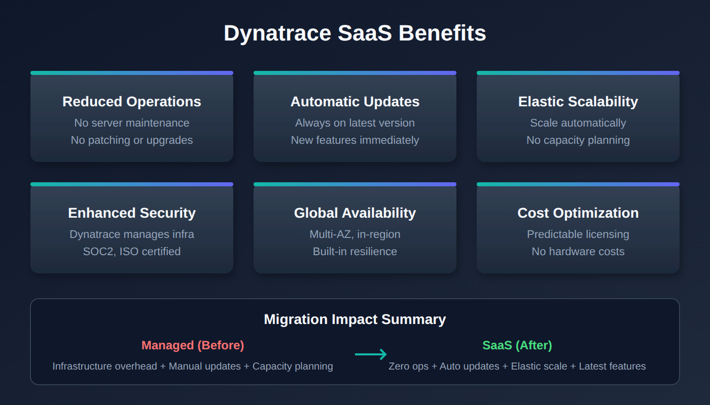

# M2S-01: Step 1 — Discover: Understand SaaS Differences

> **Series:** M2S — Managed to SaaS Migration | **Notebook:** 1 of 9 | **Phase:** Plan | **Step:** Discover | **Created:** March 2026 | **Last Updated:** 10/01/2026

The first step in any Managed-to-SaaS migration is understanding what you are moving to and why. This notebook helps you document the benefits of Dynatrace SaaS for your organization, take inventory of your current Managed environment, and confirm your use cases and goals for the upgrade.

> **M2S Migration Journey — 3 Phases / 9 Steps**
>
> **Plan:** **1. Discover** | 2. Strategize | 3. Design
>
> **Upgrade:** 4. Prepare | 5. Execute | 6. Integrate
>
> **Run:** 7. Enable | 8. Expand | 9. Optimize

### Platform Changes That Affect an M2S Migration

1. **Primary Grail fields and tags enriched at the source** (OneAgent 1.333+) — OneAgent can stamp `dt.security_context`, `dt.cost.costcenter`, `dt.cost.product` and `primary_tags.*` onto every signal it sends. Decide the tag and security-context model in the M2S-03 (Design) step, and set these values in the same `oneagentctl` call that redirects each agent (M2S-05).
2. **Platform tokens** for new automation. Classic API tokens still work for the classic API paths, but new SaaS pipelines against the platform services should use `dt0s16` platform tokens (`Authorization: Bearer …`). Note: `dt0s01` is a SCIM token for account-level user provisioning — it is NOT a platform-token prefix and should not be used for environment-level automation.

**Extensions review** — if Managed carries custom **Extensions Framework 1.0** extensions, migration to SaaS is the natural moment to rebuild them as **Extensions 2.0**, the current extensions framework. Extensions Framework 1.0 reached end of support on 2025-03-31 (its Python 3.8 variant on 2024-10-31). JMX and PMI extensions on Framework 1.0 were carried past that date as deprecated and now have their own end-of-support date, **July 1, 2027**, after which *"they will no longer be supported in SaaS environments."*

> <sub>**Sources:** [Primary Grail fields and tags enrichment through OneAgent (DT docs)](https://docs.dynatrace.com/docs/ingest-from/dynatrace-oneagent/oneagent-attribute-enrichment) — *"OneAgent version 1.333"*; [Tokens and authentication (DT docs)](https://docs.dynatrace.com/docs/dynatrace-api/basics/dynatrace-api-authentication); [End of support announcements (DT docs)](https://docs.dynatrace.com/docs/whats-new/technology/end-of-support-news) — *"EF1 JMX and PMI extensions reach end of support on July 1, 2027."*</sub>

---

## Table of Contents

1. [Why Upgrade to SaaS](#why-upgrade-to-saas)
2. [Review Your Current Environment](#review-your-current-environment)
3. [Confirm Use Cases and Goals](#confirm-use-cases-and-goals)
4. [SaaS Upgrade Assistant Overview](#saas-upgrade-assistant-overview)
5. [What Migrates and What Doesn't](#what-migrates-and-what-doesnt)
6. [Product Safeguards, Limits & SaaS Security Review](#product-safeguards-and-security-review)
7. [Step Completion Checklist](#step-completion-checklist)

---

### Inventory Categories

A complete discovery must cover ALL of these categories — missing any one will create surprises during execution:

| Category | What to Inventory | Migration Method |
|----------|------------------|-----------------|
| **Configurations and settings** | All environment-level settings, entity-level settings | SaaS Upgrade Assistant — confirm each type in the app's review screen |
| **Credential Vault** | All stored credentials, certificates | Manual — secrets cannot be exported |
| **API tokens** | All tokens and their scopes | Manual — recreate with minimal scopes |
| **Extensions** | OneAgent extensions, ActiveGate extensions — are they current or need upgrade? | Manual — evaluate for Extensions 2.0 |
| **External and custom sources** | Cloud integrations (AWS/Azure/GCP), Kubernetes integration, log ingest, custom metrics | Manual — reconfigure each source |
| **Other integrations** | ITSM, CMDB, reports, data lakes, CI/CD pipelines | Manual — update endpoints and tokens |
| **Monitoring components** | OneAgent instances (hosts, PaaS, K8s/OpenShift), ActiveGate instances (routing, extensions, synthetic, zRemote) | Manual — reconfigure each OneAgent (`oneagentctl`) or redeploy it; install new ActiveGates (M2S-04/05) |
| **Dashboards** | All dashboards, their owners, and management zone filters | SaaS Upgrade Assistant — it can update dashboard owners automatically |

> **Tip:** Consider environment clean-up during discovery. Excessive or legacy configuration items can be left behind. Configuration items such as tagging rules and management zones are generally carried by the SaaS Upgrade Assistant, but its documentation publishes no per-type list — treat the app's review screen as the authority, and migrate dashboards selectively.

## Prerequisites

| Requirement | Details |
|-------------|----------|
| **Dynatrace Managed** | Active Managed environment with administrator access |
| **Dynatrace SaaS Tenant** | Provisioned SaaS environment (or planning to provision) |
| **API Tokens** | Tokens with `entities.read`, `settings.read` scopes on Managed |
| **Stakeholder Access** | Ability to document and share findings with decision-makers |



<!-- MARKDOWN_TABLE_ALTERNATIVE
| Benefit Category | Managed | SaaS |
|-----------------|---------|------|
| Infrastructure | Customer-managed clusters | Fully managed by Dynatrace |
| Updates | Manual cluster patching | Automatic bi-weekly updates |
| Availability | Customer-managed HA | 99.5% SLA (99.95% with Enterprise Success and Support) |
| Data Platform | Time-series DB + Elasticsearch | Grail data lakehouse |
| Capabilities | Core monitoring | AppEngine, AutomationEngine, Dynatrace Assist |
For environments where SVG doesn't render
-->

<a id="why-upgrade-to-saas"></a>

## 1. Why Upgrade to SaaS

Moving from Dynatrace Managed to SaaS is not just a hosting change — it unlocks a fundamentally different platform architecture. Understanding these differences helps you build the business case and set expectations with stakeholders.

### Infrastructure and Operations

| Area | Managed | SaaS |
|------|---------|------|
| **Cluster management** | Customer-managed servers, storage, networking | Fully managed by Dynatrace |
| **Scaling** | Manual capacity planning and provisioning | Automatic scaling with licensing |
| **Updates** | Manual cluster patching (scheduled downtime) | Automatic bi-weekly updates (zero downtime) |
| **Availability** | Customer-managed HA/DR | Contractual SLA — 99.5% monthly uptime with Standard Support, 99.95% with Enterprise Success and Support — on a multi-availability-zone architecture |
| **Security patches** | Customer responsibility to apply | Automatic, managed by Dynatrace |

### Platform Capabilities

SaaS provides capabilities that are not available on Managed:

| Capability | Description |
|-----------|-------------|
| **Grail** | Petabyte-scale data lakehouse — unified querying across logs, metrics, traces, events, and entities |
| **DQL** | Dynatrace Query Language — context-aware queries replacing USQL |
| **Notebooks** | Interactive, collaborative analysis documents (you are reading one now) |
| **AppEngine** | Build and deploy custom Dynatrace apps |
| **AutomationEngine** | Advanced workflow engine for alerting, remediation, and orchestration |
| **Dynatrace Assist** | AI-powered assistant for natural-language queries and analysis |
| **OpenPipeline** | Custom data processing, routing, and enrichment at ingest |
| **Business Analytics** | Full business event tracking and conversion funnel analysis |

### Operational Cost Reduction

Migrating to SaaS eliminates operational overhead associated with running Managed clusters:

- No hardware procurement, racking, or lifecycle management
- No cluster OS patching or Dynatrace server upgrades
- No capacity planning for Cassandra, Elasticsearch, or transaction storage
- No backup/restore procedures for cluster data
- No need for dedicated Managed cluster administrators

### Enhanced Security and Compliance

| Compliance | Coverage |
|-----------|----------|
| **SOC 2 Type II** | Annual audit of security controls |
| **ISO 27001** | Information security management certification |
| **HIPAA** | Health data handling compliance |
| **FedRAMP** | US government security authorization (select regions) |
| **Automatic patching** | Security vulnerabilities addressed without customer action |

<a id="review-your-current-environment"></a>

## 2. Review Your Current Environment

Before planning the migration, take a complete inventory of what exists in your Managed environment. This inventory serves two purposes: sizing your SaaS license and identifying configurations that need migration.

> **Note:** DQL queries below run against your **SaaS tenant** (where entity data has been synced or where agents are already reporting). For Managed-only environments, use the **Entities API v2** or **Dynatrace UI** alternatives shown after each query.

### Host Inventory

```dql
// Count total monitored hosts
fetch dt.entity.host
| summarize hostCount = count()

// Smartscape equivalent (dt.entity.* is deprecated but still functional):
//   smartscapeNodes "HOST" | summarize hostCount = count()
// Caveat: Smartscape counts CURRENT live topology and can report fewer hosts than the
// classic entity store, which retains monitored hosts not in active topology. For a
// pre-migration discovery inventory, keep the classic entity-store count above.
```

```dql
// Hosts grouped by OS type
fetch dt.entity.host
| summarize hostCount = count(), by:{osType}
| sort hostCount desc

// Smartscape equivalent (deprecated dt.entity.* still functional):
//   smartscapeNodes "HOST" | summarize hostCount = count(), by:{os.type} | sort hostCount desc
// Field map: osType -> os.type (value form also changes, e.g. LINUX -> OS_TYPE_LINUX).
// The live-topology count caveat from the previous cell applies here too.
```

**Managed alternative (Entities API v2):**

```bash
# Total host count
curl -s "https://{managed-url}/api/v2/entities?entitySelector=type(HOST)&pageSize=1" \
  -H "Authorization: Api-Token {TOKEN}" | jq '.totalCount'
```

### Service Inventory

```dql
// Count total monitored services
fetch dt.entity.service
| summarize serviceCount = count()

// Smartscape equivalent (deprecated dt.entity.* still functional):
//   smartscapeNodes "SERVICE" | summarize serviceCount = count()
// Caveat: Smartscape reflects CURRENT live topology and typically reports fewer services
// than the classic entity store (short-lived / inactive services are omitted). For a
// pre-migration discovery inventory, keep the classic entity-store count above.
```

```dql
// Services grouped by technology
fetch dt.entity.service
| summarize serviceCount = count(), by:{serviceType}
| sort serviceCount desc

// Smartscape equivalent (deprecated dt.entity.* still functional):
//   smartscapeNodes "SERVICE" | summarize serviceCount = count(), by:{dt.service.sdv1_type} | sort serviceCount desc
// Field map: serviceType -> dt.service.sdv1_type (same value labels, e.g. WEB_REQUEST_SERVICE).
// The live-topology count caveat applies here too.
```

### Application Inventory

```dql
// Count monitored web applications
smartscapeNodes "FRONTEND"
| filter frontend.type == "web"
| summarize appCount = count()

// Smartscape (preferred, verified 07/2026): dt.entity.application maps to the FRONTEND node,
// filtered on frontend.type == "web" (mobile apps are the same node with frontend.type ==
// "mobile"). This corrects an earlier note here that claimed no Smartscape equivalent existed.
// FRONTEND also carries id_classic holding the APPLICATION-* id, for joining migrated and
// unmigrated queries. Unlike ActiveGate, `fetch dt.entity.application` does still work and remains
// a genuine fallback — but it reads the classic entity store, which can retain entities Smartscape
// (live topology) no longer lists, so cross-check if the two counts disagree.
// Classic fallback: fetch dt.entity.application | summarize appCount = count()
```

### Synthetic Test Inventory

```dql
// Count synthetic monitors by type (browser, HTTP, multi-protocol) — Step 9 repeats this count
smartscapeNodes "BROWSER_MONITOR", "HTTP_MONITOR", "NETWORK_AVAILABILITY_MONITOR"
| summarize syntheticCount = count(), by:{type}
| sort type asc

// Smartscape (preferred, verified 07/2026): dt.entity.synthetic_test maps to the BROWSER_MONITOR
// node (individual steps are a separate BROWSER_MONITOR_STEP node). HTTP monitors are HTTP_MONITOR,
// multi-protocol monitors NETWORK_AVAILABILITY_MONITOR, private locations SYNTHETIC_LOCATION. This
// corrects an earlier note here that claimed no Smartscape equivalent existed. Unlike ActiveGate,
// `fetch dt.entity.synthetic_test` does still work and remains a genuine fallback — it reads the
// classic entity store, which can retain entities Smartscape (live topology) no longer lists.
// Classic fallback (browser monitors only): fetch dt.entity.synthetic_test | summarize syntheticCount = count()
```

```dql
// Synthetic monitors by type (HTTP, browser, multi-protocol)
// dt.entity.synthetic_test does not expose a 'type' field in Grail entity store;
// use dt.synthetic.events to count distinct monitors by execution event type.
fetch dt.synthetic.events, from:-1h
| filter in(event.type, {"http_monitor_execution", "browser_monitor_execution", "multiprotocol_monitor_execution"})
| summarize testCount = countDistinct(dt.synthetic.monitor.id), by:{event.type}
| sort testCount desc

// Note: event.type values map to monitor types:
//   http_monitor_execution      → HTTP monitor
//   browser_monitor_execution   → Browser (clickpath) monitor
//   multiprotocol_monitor_execution → Network availability (TCP/ICMP/DNS) monitor
```

### OneAgent Version Assessment

Understanding your OneAgent version spread is important because SaaS supports a rolling 9-month (Standard) / 12-month (Enterprise) version window. Agents older than this window must be updated before or during migration.

> **Breaking (SaaS 1.347 — staged tenant rollout from 09/08/2026; the release notes are still marked pre-release):** *"Starting with this release, Dynatrace rejects connections from OneAgent versions 1.241 and earlier."* Falling outside the support window stops fixes; being at or below 1.241 stops **data** once 1.347 reaches your tenant — an agent that old, redirected to SaaS, reports nothing. Managed estates are where agents this old survive, so find them with the query below and upgrade them on Managed **before** redirecting them in Step 5. Until 1.347 reaches your tenant, such agents still connect but are outside support, so the support-window check above remains the working rule. See FAQ-04 for managing OneAgent updates on SaaS.
>
> <sub>**Sources:** [What's new in Dynatrace SaaS 1.347 (DT docs)](https://docs.dynatrace.com/docs/whats-new/saas/sprint-347) — *"Starting with this release, Dynatrace rejects connections from OneAgent versions 1.241 and earlier."*</sub>

```dql
// OneAgent versions across hosts
fetch dt.entity.host
| summarize hostCount = count(), by:{installerVersion}
| sort hostCount desc

// No Smartscape equivalent: installerVersion (OneAgent version) is not a Smartscape node
// field, so this agent-version distribution stays on the classic entity store.
```

### ActiveGate Assessment

```dql
// ActiveGate inventory
smartscapeNodes "ACTIVEGATE"
| summarize activeGateCount = count()

// Correction (verified 07/2026): this cell previously ran `fetch dt.entity.active_gate` and
// carried a note claiming Smartscape had no ActiveGate node. Both were wrong. There is NO classic
// ActiveGate entity type in any spelling (active_gate, environment_active_gate,
// environment_activegate), so the classic query returned zero rows in every tenant —
// indistinguishable from "no ActiveGates deployed". `smartscapeNodes "ACTIVEGATE"` (no
// underscore) is the working path, and it works on tenants today.
// Field maps: entity.name → name, softwareVersion → dt.active_gate.version,
// networkZone → dt.network_zone.id.
// ActiveGate 1.343 (published 07/15/2026, staged tenant rollout from 07/28/2026) deprecates
// GET /api/v2/activeGates, /api/v2/activeGates/{agId} and /api/v2/activeGates/groups in favour of
// this same Smartscape node — the classic entity and the classic REST endpoints were retired as one
// move. If you need a REST surface in the meantime, the classic Entities API v2 selector
// (GET /api/v2/entities?entitySelector=type("ENVIRONMENT_ACTIVE_GATE")) is a different surface and
// may still respond; the DQL `fetch dt.entity.*` form does not.
```

### Environment Size Summary

Record your findings in this table:

| Entity Type | Count | Notes |
|------------|-------|-------|
| Hosts | ___ | Include OS breakdown |
| Services | ___ | Include technology breakdown |
| Applications | ___ | Web and mobile |
| Synthetic Tests | ___ | HTTP, browser, scripted |
| ActiveGates | ___ | Environment and cluster |
| Management Zones | ___ | Will migrate as-is |
| Dashboards | ___ | Classic dashboards migrate; rebuild as modern recommended |

> **Important:** In community practice, a single environment is planned at roughly **25,000 hosts of typical load** (no Dynatrace page states this figure); the platform can technically scale higher, but beyond that threshold plan to split host-unit quota across multiple SaaS tenants/environments. This is a planning guideline, not a hard cap — discuss tenant topology with your Dynatrace account team before proceeding.

<a id="confirm-use-cases-and-goals"></a>

## 3. Confirm Use Cases and Goals

Every migration needs clearly documented motivations and success criteria. Use the table below to identify which benefits matter most to your organization and align them with concrete goals.

### Common Migration Motivations

| Motivation | SaaS Benefit | Success Metric |
|-----------|-------------|----------------|
| Eliminate cluster maintenance | Fully managed infrastructure | Zero hours spent on cluster patching |
| Access new capabilities | Grail, Notebooks, AppEngine, Dynatrace Assist | Teams actively using SaaS-exclusive features |
| Improve availability | 99.5%+ SLA | Reduced monitoring downtime incidents |
| Reduce operational cost | No hardware, patching, capacity planning | Measured reduction in Managed infrastructure spend |
| Enhance security posture | Managed infrastructure, automatic security patches | Faster time-to-patch for vulnerabilities |
| Simplify compliance | SOC 2 Type II, ISO 27001, HIPAA | Inherited compliance controls |
| Consolidate tenants | Single SaaS platform | Fewer environments to manage |
| Enable self-service | IAM policies, Grail permissions | Teams can query their own data without admin requests |

### Documenting Your Goals

For each selected motivation, document:

1. **Current pain point** — What problem does this solve today?
2. **Expected outcome** — What does success look like after migration?
3. **Measurement** — How will you verify the goal was achieved?
4. **Timeline** — When should this benefit be realized (during migration or post-migration)?

> **Tip:** Share this goals document with stakeholders before proceeding to Step 2 (Strategize). Alignment on goals prevents scope creep and sets realistic expectations.

<a id="saas-upgrade-assistant-overview"></a>

## 4. SaaS Upgrade Assistant Overview

The **[SaaS Upgrade Assistant](https://docs.dynatrace.com/managed/upgrade/saas-upgrade-assistant)** is Dynatrace's primary migration tool for Managed-to-SaaS upgrades. Understanding its capabilities early helps you plan what will be automated versus what requires manual effort.

### How It Works

1. **Export** — Download configuration archive from your Managed Cluster Management Console
2. **Upload** — Import the archive into the SaaS Upgrade Assistant app on your target SaaS tenant
3. **Review** — Configurations are grouped by type with error highlighting for incompatible items
4. **Edit** — Fix failed or incompatible configurations individually or in bulk
5. **Deploy** — Push selected configurations to your SaaS environment
6. **Track** — Monitor progress and download deployment result reports (CSV)

### Key Features

| Feature | Description |
|---------|-------------|
| **Automated configuration import** | Most settings and dashboards migrate automatically |
| **Selective import** | Smart dependency-aware import — choose what to deploy per wave |
| **Dashboard ownership migration** | Updates dashboard owners from Managed to SaaS user identifiers |
| **Entity ID adjustment** | Handles entity ID changes between environments |
| **Bulk editing** | Edit and correct failed configurations in batch |
| **Preview changes** | Review all changes before deploying |
| **Progress tracking** | Real-time status with CSV export of results |

### Requirements

| Requirement | Details |
|-------------|----------|
| **Managed version** | No fixed minimum in the SaaS Upgrade Assistant docs — align to the same *major* version as the target SaaS tenant (verify the current requirement in docs) |
| **Version alignment** | Export from the same **major** version as the target SaaS environment to avoid false-positive migration failures (docs example: Managed 1.284.x → SaaS 1.284.x) |
| **IAM policy** | `upgrade-assistant:environments:write` to operate the app, plus `app-engine:apps:install` to install it — both assigned in Account Management |
| **Installation** | Install the SaaS Upgrade Assistant app on your target SaaS tenant |

> **Tip:** Contact your Dynatrace account team for guided migration support. They can help plan waves and troubleshoot incompatible configurations.</cell id="m2s-01-cell-23">

<a id="what-migrates-and-what-doesnt"></a>

## 5. What Migrates and What Doesn't

Understanding portability constraints upfront prevents surprises during execution. The SaaS Upgrade Assistant imports environment configuration and can update dashboard owners and adjust entity IDs, but its documentation publishes no per-type support list. The tables below reflect what migration teams commonly report — confirm each type in the app's review screen before you rely on it. FAQ-25 explains the underlying rule: configuration moves, platform-minted identity is re-minted, and accumulated state (history, baselines, secrets) does not move at all.

### Commonly Carried by the SaaS Upgrade Assistant

| Configuration Type | Notes |
|--------------------|-------|
| Settings and configurations | Application detection, service detection, data privacy |
| Management zones | Migrate as-is; consider converting to Grail permissions post-migration |
| Auto-tagging rules | Tag definitions and conditions |
| Alerting profiles | Alert filtering and notification routing |
| Classic dashboards | Migrate automatically; rebuild as modern dashboards recommended |
| Service detection rules | Custom service naming and merging |
| Request attributes | Capture rules for request metadata |
| Calculated metrics | Service, log, and RUM calculated metrics |
| Maintenance windows | Scheduled suppression windows |

### Requires Manual Recreation

| Configuration Type | Why | Recommended Action |
|--------------------|-----|--------------------|
| **Credentials Vault entries** | Security — secrets cannot be exported | Re-create in SaaS Credentials Vault |
| **API tokens** | Security — tokens are environment-specific | Generate new tokens in SaaS |
| **Webhook endpoints** | URLs may differ for SaaS network paths | Reconfigure notification integrations |
| **Synthetic private locations** | ActiveGate-bound, environment-specific | Deploy new ActiveGates, recreate locations |
| **Custom extensions (1.0)** | EF1 deprecated — must rebuild as Extensions 2.0 | Rebuild using Extensions 2.0 framework |
| **Network zones** | The Upgrade Assistant's Hub listing names network zones as supported — but SaaS ActiveGates must be assigned to them | Confirm they arrived; create missing ones; assign the new ActiveGates (M2S-04 § 6) |
| **Plugin-based integrations** | Legacy plugin framework | Migrate to Extensions 2.0 or ActiveGate extensions |

### Non-Portable (Data)

> **Important:** Historic data does **not** migrate. This includes metrics, logs, traces, user sessions, problems, and detected events. Plan for a baseline period where both Managed and SaaS run in parallel so SaaS accumulates its own history.

| Data Type | Retention Impact |
|-----------|------------------|
| Metrics | New baseline starts from SaaS go-live |
| Logs | No historic log data in SaaS |
| Traces/spans | Distributed traces start fresh |
| User sessions | RUM session data not transferred |
| Problems | detected problem history stays in Managed |
| Deployment events | Release tracking starts fresh |

<a id="product-safeguards-and-security-review"></a>

## 6. Product Safeguards, Limits & SaaS Security Review

During discovery, inventory the product safeguards and platform limits that behave differently on SaaS, and complete a short security and privacy review so nothing surprises you during execution. Several of these settings are **not** carried over automatically by the SaaS Upgrade Assistant and must be re-established manually.

### Capture Rates and Traffic Safeguards

**Adaptive Traffic Management (ATM)** governs how much trace and service-call data is captured. Its behavior depends on your licensing model — confirm which one your target tenant uses before you rely on full trace fidelity.

| Licensing model | Capture behavior | Plan for |
|-----------------|------------------|----------|
| **Classic (host-unit) license** | Safeguard caps apply: roughly **250 full-service calls/min per in-use host unit**, an environment floor of **5,000 full-service calls/min**, and per-process bounds of **50–50,000 calls/min**. | Environments near these caps may sample. Compare captured-vs-total call volume before assuming 100% trace fidelity. |
| **Dynatrace Platform Subscription (DPS) / ATM v3** | **Adaptive** — sampling adjusts to your licensed volume and typically approaches ~100% capture, with **no fixed per-host-unit number**. | DPS tenants scale capture to licensed volume rather than a static cap. Verify your tenant's ATM version, as capture behavior differs from the classic model. |

**SQL bind-variable capture** is off by default and is a **self-service toggle** — *Settings > Server-side service monitoring > Deep monitoring > Database > "Capture SQL bind values"* (global, with an optional process-group override), **not** a Support request. It is DPS-gated, consumes additional trace ingress volume (which can lower the overall OneAgent capture rate on SaaS), and literal values in batched statements are always masked. Inventory where it is enabled on Managed so you can reproduce it deliberately — and narrowly — on SaaS.

**API rate limits** — the Dynatrace API returns **HTTP 429** when request-rate limits are exceeded. Bulk automation during migration (token recreation, configuration import, entity queries) should use backoff/retry rather than tight loops.

### Settings the SaaS Upgrade Assistant Does Not Carry Over

Some cluster-level safeguards are **not** migrated by the SaaS Upgrade Assistant. Record their Managed values during discovery and re-apply them manually during Prepare/Execute:

| Setting | Why it matters | Action |
|---------|----------------|--------|
| Overload prevention — max entry-point PurePaths/traces per process per minute | Protects against trace floods from a single process | Record the Managed value; set manually on SaaS |
| Overload prevention — max user actions per minute (RUM) | Caps RUM ingestion spikes | Record and re-apply manually |

### SaaS Security and Privacy Review

Identity, notification, and data-control surfaces differ on SaaS. Confirm each during discovery:

| Area | Managed | SaaS | Implication |
|------|---------|------|-------------|
| **SSO federation** | SAML, LDAP | **SAML 2.0** federation (plus SCIM provisioning) is what Dynatrace documents for SaaS | Plan SAML 2.0 through your IdP; the IdP must sign the **entire SAML message** (M2S-04 § 3). |
| **Outbound email (SMTP)** | Custom SMTP server (CMC) | Email is sent by Dynatrace; we found no documented custom-SMTP option for SaaS — verify for your contract | If you need your own mail path, route to an internal relay via a webhook or Workflow action. |
| **Data-subject rights** | — | **Privacy Rights** app: export personal data and perform **record-level hard deletion in Grail** through an auditable, multi-reviewer workflow | Use this surface for GDPR/CCPA export and deletion requests. |
| **Network access control** | — | **IP allow-list** (CIDR) for UI and API | Caveat: it protects the latest (Grail/Gen3) UI and API only — it does **not** block the classic `*.live.dynatrace.com` UI or the data-ingest APIs. |
| **Dynatrace Support access** | Customer-grantable | Role-based and approved internally; *"restricted to the Dynatrace corporate network and requires multi-factor authentication when accessed remotely"*; *"every access and all changes are audit logged"*. The data-security page documents no customer grant/deny toggle | Governance shifts from a prospective switch to auditable, least-privilege access. |

> <sub>**Sources:** [Adaptive Traffic Management — classic license (DT docs)](https://docs.dynatrace.com/docs/shortlink/adaptive-traffic-management-saas-classic), [Support for SQL bind variables (DT docs)](https://docs.dynatrace.com/docs/observe/application-observability/distributed-tracing/support-for-sql-bind-variables), [SAML SSO (DT docs)](https://docs.dynatrace.com/docs/shortlink/access-saml), [Email workflow action (DT docs)](https://docs.dynatrace.com/docs/shortlink/email-integration), [Privacy Rights (DT docs)](https://docs.dynatrace.com/docs/shortlink/privacy-rights), [Record deletion in Grail (DT docs)](https://docs.dynatrace.com/docs/shortlink/record-deletion-in-grail), [IP allow-listing (DT docs)](https://docs.dynatrace.com/docs/shortlink/ip-allowlist), [Data security controls (DT docs)](https://docs.dynatrace.com/docs/shortlink/data-security-controls).</sub>

<a id="step-completion-checklist"></a>

## 7. Step Completion Checklist

Before proceeding to Step 2, confirm that you have completed each item:

| Checkpoint | Status |
|-----------|--------|
| SaaS benefits documented and shared with stakeholders | [ ] |
| Current environment inventory complete (hosts, services, applications, synthetics) | [ ] |
| OneAgent version spread assessed (any agents outside support window identified) | [ ] |
| ActiveGate inventory documented | [ ] |
| Migration use cases and goals documented with success metrics | [ ] |
| SaaS Upgrade Assistant requirements understood (version, IAM, installation) | [ ] |
| Non-portable items identified and manual recreation plan noted | [ ] |
| Historic data limitation communicated to stakeholders | [ ] |
| Product safeguards and limits reviewed (ATM capture behavior, SQL bind-variable capture, API rate limits) | [ ] |
| Overload-prevention settings inventoried for manual re-apply on SaaS | [ ] |
| SaaS security review complete (SSO surface, custom SMTP, Privacy Rights, IP allow-list, support-access model) | [ ] |

## Next Step

> **M2S-02: Step 2 — Strategize** — Define your migration approach, timeline, and risk assessment. Choose between big-bang and phased migration, plan your parallel-run period, and identify dependencies and risks.

### Additional Resources

- [SaaS Upgrade Assistant Documentation](https://docs.dynatrace.com/managed/upgrade/saas-upgrade-assistant)
- [SaaS Upgrade Assistant on Dynatrace Hub](https://www.dynatrace.com/hub/detail/saas-upgrade-assistant/)
- [Upgrading from Dynatrace Managed to SaaS](https://www.dynatrace.com/platform/saas-upgrade/)
- [Grail Data Lakehouse](https://docs.dynatrace.com/docs/platform/grail)
- [DQL Reference](https://docs.dynatrace.com/docs/platform/grail/dynatrace-query-language)

---

## Summary

In Step 1, you:

- Documented the key benefits of Dynatrace SaaS compared to Managed
- Inventoried your current environment (hosts, services, applications, synthetics, ActiveGates)
- Confirmed your migration use cases and goals with measurable success criteria
- Understood the SaaS Upgrade Assistant as the primary migration tool
- Identified what migrates automatically, what requires manual recreation, and what data does not transfer
- Reviewed product safeguards, platform limits, and the SaaS security/privacy surface (capture rates, SSO, notifications, privacy controls, support-access model)

---

<sub>*This notebook was AI-generated from community-submitted and publicly available sources. This notebook series is not officially supported by Dynatrace. Always verify information against official Dynatrace documentation.*</sub>
