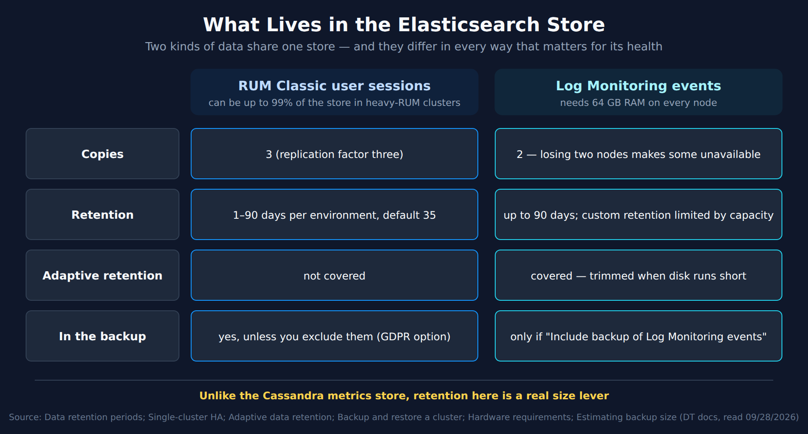

# MCH-04: Elasticsearch Store Health

> **Series:** MCH — Managed Cluster Health | **Notebook:** 4 of 8 | **Created:** September 2026 | **Last Updated:** 09/28/2026

## Overview

Every Managed node runs Elasticsearch, and together those nodes form the **Elasticsearch store**. It holds RUM Classic user sessions and Log Monitoring events. On paper it's a sibling of the Cassandra metrics store (MCH-03), but it behaves very differently. Its two main kinds of data are kept in different numbers of copies, have separate retention settings, and are treated differently by adaptive retention and by the backup.

This notebook is layer 2 of the MCH-01 health model, for Elasticsearch. It covers what the store holds, how to size it, why retention is the main lever for keeping it in bounds, how to check its health, what log-ingest pressure looks like, and what its backup does and does not protect.

**What you'll learn:**

- Why log events survive only one node failure while user sessions survive the same failure with a copy to spare
- How big the store should be, and why RUM can dominate it
- The retention settings that actually shrink it, which Cassandra doesn't have
- How to read `_cluster/health`, and which Elasticsearch events never email you
- What the two-hourly incremental backup contains, and why its files must never be deleted

---

## Table of Contents

1. [Short Answer](#short-answer)
2. [What the Store Holds](#what-it-holds)
3. [Sizing](#sizing)
4. [Retention Is the Size Lever](#retention)
5. [Health Checks](#health-checks)
6. [Log Ingest Pressure](#log-pressure)
7. [Disk and Storage Location](#disk)
8. [Backup — the Elasticsearch Part](#backup)
9. [Failover and Versions](#failover-versions)
10. [What the Documentation Does Not Say](#doc-gaps)
11. [Recommended Approach](#recommendation)
12. [Summary and Next Steps](#summary)

---

## Prerequisites

| Requirement | Details |
|-------------|---------|
| **Dynatrace deployment** | A self-hosted **Dynatrace Managed** cluster. Nothing in this series applies to Dynatrace SaaS. |
| **Access** | Cluster Management Console (CMC) administrator access; root (or `sudo`) on the cluster nodes |
| **Query language** | None. Managed has no Grail, so this series has **no DQL cells**. Every check is a CMC view, a cluster event, or a node command |
| **Read first** | MCH-01 (health model), MCH-02 (the service start order), MCH-03 (the Cassandra store, for contrast) |
| **Version basis** | Written against the Managed documentation read 09/28/2026. The Elasticsearch version note is labeled with the Managed release that introduced it |

<a id="short-answer"></a>
## 1. Short Answer

- **Two kinds of data, two replication factors.** RUM Classic user sessions are kept in three copies. Log Monitoring events are kept in **two**, so *"the failure of two nodes makes some log events unavailable."*
- **RUM can dominate the store.** In heavy-RUM clusters, user sessions *"might take up to 99% of total Elasticsearch storage."*
- **Retention is the size lever here.** User-session retention (1–90 days, default 35) and log retention (up to 90 days) are set per environment. That is the opposite of Cassandra's fixed five years.
- **Healthy means `"status" : "green"`**, or `yellow` on a single-node cluster, in `_cluster/health`.
- **None of the Elasticsearch-specific events email you.** Overload, log-queue and backup problems appear only in CMC Events and Mission Control.
- **The backup is incremental, every two hours.** Never delete its files. Log events are backed up only if you opt in.

> <sub>**Sources:** [Data retention periods (DT docs)](https://docs.dynatrace.com/managed/manage/data-privacy-and-security/data-privacy/data-retention-periods), [Single-cluster high availability (DT docs)](https://docs.dynatrace.com/managed/managed-cluster/high-availability/single-cluster-high-availability), [Estimating cluster backup size (DT docs)](https://docs.dynatrace.com/managed/managed-cluster/operation/estimating-cluster-backup-size), [Backup and restore a cluster (DT docs)](https://docs.dynatrace.com/managed/managed-cluster/operation/back-up-and-restore-a-cluster), [Configure Cluster event notifications (DT docs)](https://docs.dynatrace.com/managed/managed-cluster/configuration/configure-cluster-event-notifications).</sub>

<a id="what-it-holds"></a>
## 2. What the Store Holds

The retention docs name what lives in the store and how many copies each gets:

| Data | Where the docs put it | Copies |
|------|-----------------------|--------|
| **RUM Classic user sessions** | *"Data is stored in Elasticsearch store at DATASTORE_PATH/elasticsearch. Data is replicated across Managed Cluster nodes. Replication factor is set to three."* | 3 |
| **Log Monitoring events** | *"you already use Elasticsearch store at DATASTORE_PATH/elasticsearch to store log files on your Dynatrace Managed Cluster. Replication factor is set to two."* | 2 |
| **RUM Classic mobile crashes** | *"Crash data and stack traces of mobile and custom applications are stored for 35 days."* The section ends with the Elasticsearch-store statement, but also says of the crash counts shown on different pages: *"For these pages, it comes from different storage and has a different retention period."* | Not stated for crash data specifically |



<!-- MARKDOWN_TABLE_ALTERNATIVE
| | RUM Classic user sessions | Log Monitoring events |
|---|---|---|
| Share of the store | Up to 99% in heavy-RUM clusters | — |
| Copies | 3 | 2 — losing two nodes makes some unavailable |
| Retention | 1–90 days per environment, default 35 | Up to 90 days; custom retention limited by capacity |
| Adaptive retention | Not covered | Covered — trimmed when disk runs short |
| In the backup | Yes, unless excluded (GDPR option) | Only if "Include backup of Log Monitoring events" is selected |
For environments where SVG doesn't render
-->

**Why two copies matters for logs.** *"Dynatrace Managed replicates Log Monitoring event data across the Elasticsearch store to two copies. With two copies, if one node fails, another node still holds the data. However, the failure of two nodes makes some log events unavailable. If the nodes come back up, the data becomes available again."* A cluster that tolerates one node loss for metrics and sessions has **no spare** for logs. Once one node is down, the next failure makes some logs unavailable.

**Not everything RUM goes here.** Session Replay has its own store (`DATASTORE_PATH/server/replayData`), and waterfall and JavaScript-error data *"is stored with distributed trace code-level insights and errors"*, which is the transaction store.

> <sub>**Sources:** [Data retention periods (DT docs)](https://docs.dynatrace.com/managed/manage/data-privacy-and-security/data-privacy/data-retention-periods), [Single-cluster high availability (DT docs)](https://docs.dynatrace.com/managed/managed-cluster/high-availability/single-cluster-high-availability). **Derived:** "no spare for logs" applies the two-copy rule to a cluster that has already lost one node.</sub>

<a id="sizing"></a>
## 3. Sizing

The hardware guide sizes the store per node for **35 days of retention**, which is the user-session default:

| Node size | Elasticsearch per node |
|-----------|------------------------|
| Micro | 50 GB |
| Small | 500 GB |
| Medium | 1.5 TB |
| Large | 1.5 TB |
| XLarge | 3 TB |

The table assumes that 35-day default. If you raise retention, size from your own measured growth instead (§5.2).

**RUM volume drives it.** *"In highly intensive RUM environments (50k user sessions per minute), user sessions might take up to 99% of total Elasticsearch storage."* In those clusters, user-session retention and user-session volume *are* the store's size.

**Log Monitoring raises the bar:**

- *"All Managed Cluster nodes must have at least 64 GB total RAM."*
- *"Add more Managed Cluster nodes rather than increasing hardware per node for a more resilient configuration."*
- *"Distribute additional Elasticsearch storage equally across all Managed Cluster nodes."*
- *"Plan custom log retention for environments according to the available hardware."*

**Two storage types are ruled out.** *"High-latency remote volumes such as NFS or CIFS aren't supported for primary storage"*, and specifically for this store, *"Amazon Elastic File System (EFS) isn't supported as primary storage for Elasticsearch, because it may lead to index corruption."*

> <sub>**Sources:** [Hardware requirements (DT docs)](https://docs.dynatrace.com/managed/managed-cluster/installation/managed-hardware-requirements), [Estimating cluster backup size (DT docs)](https://docs.dynatrace.com/managed/managed-cluster/operation/estimating-cluster-backup-size).</sub>

<a id="retention"></a>
## 4. Retention Is the Size Lever

MCH-03 showed that Cassandra's five-year metric retention has no documented setting. The Elasticsearch store is the opposite: both of its main data types have retention you control.

| Data | Retention | Where to set it |
|------|-----------|-----------------|
| RUM Classic user sessions | *"User session data retention is configurable 1–90 days, with a default of 35 days."* | *"Cluster Management Console > Environments > Storage settings"*, per environment |
| Log Monitoring | *"Configurable, with maximum 90 days of retention time"* | Per environment, within the cluster's capacity (below) |
| RUM Classic mobile crashes | 35 days, fixed | — |

Custom log retention is rationed by capacity: *"Depending on the number and size of Managed Cluster nodes and the selected log retention times, only a certain number of environments can use custom log retention. The system reports when no more custom log retention settings are possible based on the predicted current usage."*

**Adaptive retention treats the two differently.** Adaptive data retention shortens retention automatically when disk runs short, and it covers *"transaction storage, Session Replay storage, and Log Monitoring data"*. Logs are covered; **user sessions are not**. When the disk fills, log history is trimmed automatically, while user sessions only shrink if someone lowers their retention.

**The practical rule.** Every environment that raises user-session retention above 35 days, or sets custom log retention, is spending Elasticsearch disk on every node. Review those settings before adding hardware.

> <sub>**Sources:** [Data retention periods (DT docs)](https://docs.dynatrace.com/managed/manage/data-privacy-and-security/data-privacy/data-retention-periods), [Adaptive data retention (DT docs)](https://docs.dynatrace.com/managed/manage/data-privacy-and-security/data-privacy/adaptive-data-retention). **Derived:** "logs trimmed automatically, sessions only by hand" combines the adaptive-retention scope with the per-environment session setting.</sub>

<a id="health-checks"></a>
## 5. Health Checks

### 5.1 Cluster health

On any node:

```bash
curl -s -N -XGET 'http://localhost:9200/_cluster/health?pretty' | grep status
```

The docs' expected answer is *"status" : "green"*, or *"status" : "yellow"* on a one-node setup. In community practice, `yellow` on a multi-node cluster is read as some replica copies not being allocated — the docs don't say what it means here, so treat anything but `green` as a question for Dynatrace support. During a cluster start (MCH-02 §4), the gate is stricter: *"Make sure active_shards_percent_as_number is 100% and number_of_nodes is equal to the number of nodes in the cluster."*

### 5.2 Size, per node

```bash
du -sh /var/opt/dynatrace-managed/elasticsearch/
```

The backup-sizing guide expects *"The size should vary only slightly between nodes."* In community practice, a node that is much larger than its peers is raised with support before it fills — verify against your own trend. Trend the numbers weekly against the size table in §3.

### 5.3 Events

None of these email you. They appear only in CMC Events and Mission Control:

| Event | Severity |
|-------|----------|
| *"Elasticsearch storage service on your Dynatrace Managed cluster might be overloaded!"* | INFO |
| *"ElasticSearch update transient settings failed."* | WARNING |
| *"ElasticSearch backup problem."* | WARNING / SEVERE |

The **process** itself is covered by MCH-02: `dynatrace-elasticsearch.service` in `dynatrace.sh status`, and ports `9200` and `9300` in `dynatrace.sh check` and between nodes.

> <sub>**Sources:** [Backup and restore a cluster (DT docs)](https://docs.dynatrace.com/managed/managed-cluster/operation/back-up-and-restore-a-cluster), [Start/stop/restart a cluster (DT docs)](https://docs.dynatrace.com/managed/managed-cluster/operation/start-stop-restart-cluster), [Estimating cluster backup size (DT docs)](https://docs.dynatrace.com/managed/managed-cluster/operation/estimating-cluster-backup-size), [Configure Cluster event notifications (DT docs)](https://docs.dynatrace.com/managed/managed-cluster/configuration/configure-cluster-event-notifications), [Cluster node ports (DT docs)](https://docs.dynatrace.com/managed/managed-cluster/installation/cluster-node-ports).</sub>

<a id="log-pressure"></a>
## 6. Log Ingest Pressure

When Log Monitoring sends more than the store can take, four events report it. All are WARNING, and none email you:

| Event |
|-------|
| *"Ingested log data is trimmed."* |
| *"Log ingest queue is full."* |
| *"Elasticsearch log queue is full."* |
| *"Elasticsearch log storing failed."* |

The Log Monitoring troubleshooting index has an article for each of the first three messages; start there. The events page itself publishes no response procedure. In community practice, these events are read as log data being delayed or lost, and the responses fall into two groups — verify against the troubleshooting articles for your case. Capacity: more nodes, or more disk spread evenly across them, which the hardware guide recommends for Log Monitoring (§3). Demand: less ingested and retained, through log storage rules and custom retention (§4).

**Measure it, not just the events.** Two self-monitoring metrics cover the ingest side, and self-monitoring metrics *"are available in every Dynatrace Managed and SaaS environment"* (in each environment's Data Explorer, not in the CMC):

| Metric | What the docs say it measures |
|--------|-------------------------------|
| `dsfm:server.log_and_events_monitoring.events_incoming_count` | *"The count of incoming log events"*, with `event.sender` and `event.type` dimensions |
| `dsfm:server.log_and_events_monitoring.events_rejected_count` | *"Count of log events that are rejected due to ingestion limit"*. *"If the metric is frequently above 0, then it may suggest that limits should be increased for that tenant."* |

In community practice, a rising incoming count is watched as the early warning for the pressure events above. A non-zero rejected count points at an environment's ingest limit rather than at the store.

> <sub>**Sources:** [Configure Cluster event notifications (DT docs)](https://docs.dynatrace.com/managed/managed-cluster/configuration/configure-cluster-event-notifications), [Log Monitoring troubleshooting (DT docs)](https://docs.dynatrace.com/managed/analyze-explore-automate/log-monitoring/lmc-troubleshooting), [Hardware requirements (DT docs)](https://docs.dynatrace.com/managed/managed-cluster/installation/managed-hardware-requirements), [Self-monitoring metrics (DT docs)](https://docs.dynatrace.com/managed/analyze-explore-automate/metrics-classic/self-monitoring-metrics).</sub>

<a id="disk"></a>
## 7. Disk and Storage Location

**Where it lives.** `ELASTICSEARCH_DATASTORE_PATH` defaults to `DATASTORE_PATH/elasticsearch`, which is `/var/opt/dynatrace-managed/elasticsearch`. The storage-location table asks for **3 GB** free to install and **1 GB** to upgrade. Those are only install minimums; plan capacity from §3.

**Layout rules** (same as MCH-03 §6): give the store its own local volume, don't nest it inside another store (*"you can't nest datastores within each other"*), and never put it on NFS, CIFS or EFS.

**Moving it** follows the documented change-storage-location procedure, with the Elasticsearch directory and `ELASTICSEARCH_DATASTORE_PATH` in place of Cassandra's:

1. Stop the node: `sudo /opt/dynatrace-managed/launcher/dynatrace.sh stop`
2. Copy the data, keeping permissions: `cp -pR /old_location/elasticsearch/* /new_location/elasticsearch`
3. Fix ownership: `chown -R dynatrace:dynatrace /new_location`
4. Point `ELASTICSEARCH_DATASTORE_PATH` at the new location in `/etc/dynatrace.conf`
5. Apply it: `nohup <PRODUCT_PATH>/installer/reconfigure.sh --no-start &`
6. Start the node: `sudo /opt/dynatrace-managed/launcher/dynatrace.sh start`

In community practice, the move is done one node at a time, with `_cluster/health` checked before each node — the storage-move page doesn't say either.

> <sub>**Sources:** [Change storage location (DT docs)](https://docs.dynatrace.com/managed/managed-cluster/operation/change-storage-location), [Hardware requirements (DT docs)](https://docs.dynatrace.com/managed/managed-cluster/installation/managed-hardware-requirements). **Derived:** the Elasticsearch-specific commands substitute the Elasticsearch directory into the documented procedure, whose worked example uses Cassandra.</sub>

<a id="backup"></a>
## 8. Backup — the Elasticsearch Part

MCH-07 covers backup and disaster recovery as a whole. This section covers what's specific to this store.

**How it works.** *"The snapshot is performed, by default, every 2 hours and it is incremental. Initially, Dynatrace copies the entire data set and then creates snapshots of the differences. Older snapshots are removed gradually once they are five (5) days old."* Replicas are not duplicated: *"the backup excludes the replicated data."*

**Never delete its files.** *"Elasticsearch backs up incrementally, so it needs to be able to append recent changes to the previous backup. Don't remove Elasticsearch backup files."* A cleanup job on the backup share that prunes old files will break the chain.

**It grows on its own schedule.** *"Since Dynatrace keeps some of the older snapshots, backup size grows regardless of the current size on disk."* Also, *"Elasticsearch merges data segments over time, which results in certain duplicates in the backup."* Lowering retention (§4) shrinks the store before it shrinks the backup.

**What's included.** The backup settings (CMC **Settings > Backup**) offer three choices:

| Setting | Effect on this store |
|---------|----------------------|
| *"Exclude user sessions from the backup to remain compliant with GDPR."* | User sessions are backed up unless you tick this |
| *"Include backup of Log Monitoring events."* | Log events are backed up **only if** you tick this |
| Exclude timeseries metric data | No effect here (Cassandra) |

**How much space.** *"While Elasticsearch backup doesn't contain data replicas, because of incremental snapshots, we use total storage for the estimation."* Plan for the full on-disk size of the store across all nodes. In heavy-RUM clusters, excluding user sessions *"might eliminate Elasticsearch backup estimation from the overall formula."*

**When it fails.** *"ElasticSearch backup problem."* is **not emailed** (§5.3). Check CMC **Home** (last backup) and CMC Events.

**Restoring.** Elasticsearch is restored once, on the seed node, before Cassandra:

```bash
sudo /opt/dynatrace-managed/utils/restore-elasticsearch-data.sh <path-to-backup>/<UUID>
```

> <sub>**Sources:** [Backup and restore a cluster (DT docs)](https://docs.dynatrace.com/managed/managed-cluster/operation/back-up-and-restore-a-cluster), [Estimating cluster backup size (DT docs)](https://docs.dynatrace.com/managed/managed-cluster/operation/estimating-cluster-backup-size), [Configure Cluster event notifications (DT docs)](https://docs.dynatrace.com/managed/managed-cluster/configuration/configure-cluster-event-notifications). **Derived:** "log events only if you opt in" and "user sessions unless excluded" read the option wording; the page doesn't state the defaults separately.</sub>

<a id="failover-versions"></a>
## 9. Failover and Versions

**Multi-data-center clusters.** Premium High Availability watches this store as closely as Cassandra: *"If Mission Control (MC) detects that two or more Elasticsearch or Cassandra nodes in a data center (DC) are down for 15 minutes, it automatically stops the server processes in that DC."* Elasticsearch logs for that investigation are under `/var/opt/dynatrace-managed/log/elasticsearch/`.

**Which Elasticsearch you're running (Managed 1.340+).** Elasticsearch is upgraded with Managed itself: *"The Elasticsearch nodes are upgraded to version 8.19 to provide bug and security fixes and leverage performance improvements introduced by this update."* There's nothing to do by hand: *"No manual user intervention or downtime is required"*. As with Cassandra, staying within the supported Managed releases is how the store stays patched.

> <sub>**Sources:** [Multi-data center failover (DT docs)](https://docs.dynatrace.com/managed/managed-cluster/high-availability/failover), [Managed 1.340 release notes (DT docs)](https://docs.dynatrace.com/managed/whats-new/managed/sprint-340).</sub>

<a id="doc-gaps"></a>
## 10. What the Documentation Does Not Say

Checked against the Managed documentation on 09/28/2026 and **not found**:

| Gap | Working assumption in this notebook |
|-----|-------------------------------------|
| Disk watermarks or percentage thresholds for the store | Rely on the generic *Insufficient disk space* event and your own trend (§5.2) |
| What *"might be overloaded"* means, or what to do about it | Treat it like the log-pressure events (§6) |
| Where Davis problems and events are stored | Unknown — neither store is documented as holding them |
| A `dsfm:` self-monitoring metric for the store's own disk or health | Measure on the node (§5). Only log-*ingest* metrics are documented (§6) |

**Two conflicts in the docs:**

- **Snapshot interval.** *Backup and restore a cluster* says *"every 2 hours"*. The *UP information* comparison table says *"Elasticsearch snapshots every 2 days"*. This notebook follows the operational backup page. Confirm the interval your cluster actually runs in CMC **Settings > Backup**.
- **Copy counts.** The backup page says *"there are two replicas in addition to the primary shard"*, which fits user sessions (three copies) but not log events (two). The retention and HA pages are the more specific source per data type (§2).

> <sub>**Sources:** [Backup and restore a cluster (DT docs)](https://docs.dynatrace.com/managed/managed-cluster/operation/back-up-and-restore-a-cluster), [UP information (DT docs)](https://docs.dynatrace.com/managed/upgrade/up-information), [Data retention periods (DT docs)](https://docs.dynatrace.com/managed/manage/data-privacy-and-security/data-privacy/data-retention-periods). **Observed 09/28/2026:** none of the four gaps is filled anywhere in the 2,681 pages under `/managed/` (crawled and searched for Elasticsearch disk thresholds and watermarks, the overload event, event-store statements, and `dsfm:` metric names — the only Elasticsearch-related `dsfm:` metrics found are the two log-ingest counters in §6).</sub>

<a id="recommendation"></a>
## 11. Recommended Approach

1. **Check `_cluster/health` on every node check.** `green` is the answer the docs give for a healthy multi-node cluster; raise anything else with support.
2. **Trend `du -sh /var/opt/dynatrace-managed/elasticsearch/` weekly on every node**, and watch for one node pulling away from the others.
3. **Audit retention before buying hardware.** List every environment with user-session retention above 35 days or with custom log retention, and confirm each one is worth its disk.
4. **Remember logs have one spare, not two.** When a node is down, treat the next failure as a log-availability incident, and bring the node back first.
5. **Read CMC Events for log-pressure and overload events, and chart the two log-ingest metrics.** None of the events email you.
6. **Protect the backup chain.** Size the target at the store's full on-disk size, exclude it from any file-pruning job, and decide deliberately whether log events are included.

<a id="summary"></a>
## 12. Summary and Next Steps

The Elasticsearch store holds RUM Classic user sessions in three copies and Log Monitoring events in two. Heavy RUM can make user sessions almost the whole store. Unlike Cassandra, its size is governed by retention settings you control per environment, although adaptive retention trims logs and leaves user sessions alone. It's healthy when `_cluster/health` is `green`, sizes stay even across nodes, and no log-pressure events appear. Its incremental backup protects user sessions by default, protects log events only on request, and depends on every earlier file staying in place.

**Next in the series:**

| Notebook | Layer |
|----------|-------|
| MCH-05: Cluster ActiveGates and Mission Control Connectivity | 4 — Connectivity |
| MCH-06: Capacity and Scaling | 3 — Capacity (node sizing and scale-out) |
| MCH-07: Backup, Upgrade, and Disaster Recovery | 5 — Lifecycle (full backup and restore) |

---

<sub>*This notebook was AI-generated from community-submitted and publicly available sources. This notebook series is not officially supported by Dynatrace. Always verify information against official [Dynatrace documentation](https://docs.dynatrace.com/managed).*</sub>
