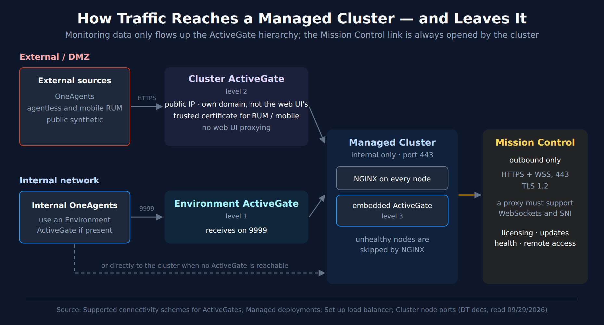

# MCH-05: Cluster ActiveGates and Mission Control Connectivity

> **Series:** MCH — Managed Cluster Health | **Notebook:** 5 of 8 | **Created:** September 2026 | **Last Updated:** 10/02/2026

## Overview

A Managed cluster can be healthy inside and still be failing, if data can't get in or the cluster can't get out. This notebook is layer 4 of the MCH-01 health model: **connectivity**. It covers the path monitoring data takes into the cluster through the ActiveGate hierarchy and the per-node NGINX, the load balancers, DNS and certificates that path depends on, and the cluster's single outbound dependency, its link to Dynatrace Mission Control.

**What you'll learn:**

- How OneAgents and ActiveGates pick a route into the cluster, and when you need a Cluster ActiveGate
- What a load balancer in front of the cluster must and must not do
- Which certificate events never email you, including an expired certificate
- What Mission Control receives, how often, and what stops working when it can't be reached
- How to tell whether your Cluster ActiveGates are healthy and current

---

## Table of Contents

1. [Short Answer](#short-answer)
2. [The Agent Traffic Path](#traffic-path)
3. [NGINX and Load Balancers](#load-balancers)
4. [Endpoints, DNS and Node Roles](#endpoints)
5. [Certificates](#certificates)
6. [The Mission Control Link](#mission-control)
7. [When Mission Control Is Unreachable — and Offline Clusters](#mc-unreachable)
8. [Remote Access for Dynatrace Support](#remote-access)
9. [Cluster ActiveGate Health and Agent-Side Events](#activegate-health)
10. [What the Documentation Does Not Say](#doc-gaps)
11. [Recommended Approach](#recommendation)
12. [Summary and Next Steps](#summary)

---

## Prerequisites

| Requirement | Details |
|-------------|---------|
| **Dynatrace deployment** | A self-hosted **Dynatrace Managed** cluster. Nothing in this series applies to Dynatrace SaaS. |
| **Access** | Cluster Management Console (CMC) administrator access; network access to review firewall, proxy, load-balancer and DNS configuration |
| **Query language** | None. Managed has no Grail, so this series has **no DQL cells**. Every check is a CMC view, a cluster event, or a configuration setting |
| **Read first** | MCH-01 (health model) and MCH-02 §8 (the ports between cluster nodes) |
| **Version basis** | Written against the Managed documentation read 09/29/2026. Release-specific changes are labeled with the Managed version that introduced them |

<a id="short-answer"></a>
## 1. Short Answer

- **Keep the cluster internal.** The docs recommend Cluster ActiveGates as the entry point for anything outside your network, not an exposed cluster.
- **Data only flows up the hierarchy:** Environment ActiveGate → Cluster ActiveGate → the ActiveGate embedded in each node. OneAgent falls back down that list, and connects directly to the cluster if nothing else is reachable.
- **A load balancer in front of the cluster is optional for OneAgent traffic** and useful for web UI and beacon traffic. It must forward to port 443 unaltered and health-check `/rest/health`.
- **Certificate expiry is not emailed.** The expired, expiring and refresh-failed events go only to Mission Control and the CMC Events list.
- **The Mission Control link is outbound only**, over 443. When it drops, monitoring continues, but after 14 days a cluster on classic licensing can no longer exceed its license limit. That drop *is* emailed.
- **Watch Cluster ActiveGate status in the CMC.** An ActiveGate losing its connection is not emailed; running an unsupported ActiveGate version is.

> <sub>**Sources:** [Managed deployments (DT docs)](https://docs.dynatrace.com/managed/managed-cluster/basics/managed-deployments), [Supported connectivity schemes for ActiveGates (DT docs)](https://docs.dynatrace.com/managed/ingest-from/dynatrace-activegate/supported-connectivity-schemes-for-activegates), [Set up load balancer (DT docs)](https://docs.dynatrace.com/managed/managed-cluster/configuration/set-up-load-balancer), [Configure Cluster event notifications (DT docs)](https://docs.dynatrace.com/managed/managed-cluster/configuration/configure-cluster-event-notifications), [Mission Control proactive support (DT docs)](https://docs.dynatrace.com/managed/managed-cluster/basics/mission-control-proactive-support).</sub>

<a id="traffic-path"></a>
## 2. The Agent Traffic Path

### 2.1 The hierarchy

Dynatrace arranges ActiveGates in levels: *"Level 1—Environment ActiveGates"*, *"Level 2—Cluster ActiveGates"*, and *"Level 3—Embedded ActiveGates—ActiveGates embedded within cluster nodes"*. Data moves one way: *"ActiveGates can only send data to higher hierarchy levels."* OneAgent picks its route from that list: *"OneAgent will connect to an Environment ActiveGate, if one is present. It will, however, connect to a Cluster ActiveGate, if no connection to an Environment ActiveGate is possible, and it can even connect directly to a Dynatrace Managed Cluster."*



<!-- MARKDOWN_TABLE_ALTERNATIVE
| Source | First hop | Next hop | Notes |
|--------|-----------|----------|-------|
| External OneAgents, agentless/mobile RUM, public synthetic | Cluster ActiveGate (level 2), over HTTPS | Managed Cluster | Public IP; own domain distinct from the web UI; trusted certificate for RUM/mobile; no web UI proxying |
| Internal OneAgents | Environment ActiveGate (level 1), port 9999, if present | Managed Cluster | Falls back to a Cluster ActiveGate, then directly to the cluster |
| Managed Cluster | NGINX on every node, port 443; embedded ActiveGate (level 3) | — | Internal only; NGINX skips unhealthy nodes |
| Managed Cluster → Mission Control | Outbound only | — | HTTPS + WSS on 443, TLS 1.2; a proxy must support WebSockets and SNI |
For environments where SVG doesn't render
-->

The routes are discovered automatically: *"All Dynatrace components (OneAgents, ActiveGates, Dynatrace Cluster) detect their hostnames and distribute them as communication endpoints among each other to achieve the highest possible connection robustness. This works automatically, unless there are networking devices (proxies, load balancers)"* in between. §3 covers those.

### 2.2 Keep the cluster internal

A basic deployment is one where the *"Managed Cluster is only accessible internally and exposes port 443 for the REST API, OneAgent traffic, and web UI access"*. Reaching it from outside should go through Cluster ActiveGates: *"Exposing the Managed Cluster directly to external networks isn't recommended for security reasons. Instead, use one or more Cluster ActiveGates as mediating proxies for pre-processing of OneAgent and DEM traffic."*

### 2.3 What a Cluster ActiveGate needs

| Requirement | From the docs |
|-------------|---------------|
| A public address | *"A publicly available IP address"* |
| Its own domain and certificate | *"A domain name with a valid SSL certificate"*. *"The domain must differ from the Dynatrace web UI domain."* |
| Scope | *"Cluster ActiveGates don't support proxying of web UI traffic."* |
| Scale | *"For high-load installations with many external hosts, applications, sessions, and synthetic monitors, set up multiple load-balanced Cluster ActiveGates sharing the same domain name and certificate."* |

A Cluster ActiveGate installed with the *Route traffic* purpose *"routes OneAgent, public synthetic, mobile, Real User Monitoring, and REST API traffic"*. Once it's in place, *"Dynatrace reconfigures OneAgent to send monitoring data through the Cluster ActiveGate."*

> <sub>**Sources:** [Supported connectivity schemes for ActiveGates (DT docs)](https://docs.dynatrace.com/managed/ingest-from/dynatrace-activegate/supported-connectivity-schemes-for-activegates), [Managed deployments (DT docs)](https://docs.dynatrace.com/managed/managed-cluster/basics/managed-deployments), [Install a Cluster ActiveGate (DT docs)](https://docs.dynatrace.com/managed/managed-cluster/installation/install-cluster-activegate).</sub>

<a id="load-balancers"></a>
## 3. NGINX and Load Balancers

**Inside the cluster, NGINX already balances.** *"NGINX, which is installed on each Managed Cluster node, performs load balancing and routing of traffic between nodes."* It routes around failed nodes: *"If a node is unreachable, that node is marked as unhealthy, and traffic is forwarded only to healthy nodes."*

**For OneAgent traffic, an external load balancer is optional.** *"Load balancing is less needed for OneAgent traffic because OneAgent is capable of switching between endpoints and performing client-side load balancing."* It pays off for beacon traffic: *"offloading TLS termination to a load balancer is beneficial, particularly if the load balancer has hardware-accelerated TLS handling or autoscaling capabilities"*, and it *"can shield the Managed Cluster from overload and separate the access path between beacon traffic and web UI/OneAgent traffic."*

**If you put one in front, it must:**

| Rule | From the docs |
|------|---------------|
| Forward to NGINX on 443, unaltered | *"Traffic must be forwarded to HTTPS port 443 of NGINX. The request path/parameters must not be altered in any way"* |
| Allow long responses | Timeout *"no less than what's configured in NGINX by default (120 seconds)."* |
| Health-check every node | *"Use the /rest/health URL for the health check with an expected response code of HTTP 200"* |
| Leave sessions to the cluster | *"Session persistence and affinity are configured and realized by the Dynatrace Managed Cluster. No configuration is required."* |
| Track node changes | The target list *"has to be updated after node join or removal."* |

The last rule is the one most easily forgotten: adding or removing a node (MCH-02 §5, MCH-06) is also a load-balancer change.

> <sub>**Sources:** [Set up load balancer (DT docs)](https://docs.dynatrace.com/managed/managed-cluster/configuration/set-up-load-balancer).</sub>

<a id="endpoints"></a>
## 4. Endpoints, DNS and Node Roles

**Public endpoints.** The cluster advertises itself through the address you enter under **Settings > Public endpoints**. Get it wrong and the whole cluster suffers: *"Invalid configuration of DNS might result in data mismatch or lead to a Managed Cluster outage."* The docs' pattern is one name resolving to every node, plus a name per node, for example `dynatrace.mycompany.com A 10.176.0.1, 10.176.0.2, 10.176.0.3` and `n01.dynatrace.mycompany.com A 10.176.0.1`.

**Node roles.** Each node can take web UI traffic, OneAgent traffic, or both (MCH-02 §2.2). Large clusters change the default: *"starting with Dynatrace Managed 1.214, web UI traffic is by default turned off when installing the 13th and subsequent nodes (or 7th and subsequent nodes in a data center for Premium HA)."* A load balancer or DNS name for the web UI should therefore list only nodes that actually serve it.

> <sub>**Sources:** [Configure cluster DNS entries (DT docs)](https://docs.dynatrace.com/managed/managed-cluster/configuration/configure-cluster-dns-entries), [Configure cluster capabilities (DT docs)](https://docs.dynatrace.com/managed/managed-cluster/configuration/configure-cluster-capabilities), [Set up load balancer (DT docs)](https://docs.dynatrace.com/managed/managed-cluster/configuration/set-up-load-balancer). **Derived:** "list only nodes that serve the web UI" combines the web UI default with the load-balancer rule that its target list must track the cluster's nodes.</sub>

<a id="certificates"></a>
## 5. Certificates

**The cluster's certificate.** By default, *"each Managed Cluster receives a dedicated subdomain of dynatrace-managed.com with a trusted SSL certificate."* If you turn that management off, *"Without automatic certificate management, Dynatrace falls back to a self-signed certificate."* To use your own certificate, upload it in PEM format. *"Encrypted private keys aren't supported."* Decrypt the key first:

```bash
openssl rsa -in encrypted.ssl.key -out decrypted.ssl.key
```

**Cluster ActiveGate certificates are managed centrally.** *"After installation, a Cluster ActiveGate uses a self-signed certificate generated by Dynatrace."* Don't change them on the ActiveGate host itself: *"Don't configure SSL certificates directly on the Cluster ActiveGate device. Any certificate uploaded this way will be overwritten by Dynatrace's automatic management."*

**Certificate events never email you.** Every one of them goes only to Mission Control and the CMC Events list:

| Event | Severity | Emailed |
|-------|----------|---------|
| *"SSL certificate expired."* | SEVERE | **No** |
| *"Your SSL certificate will expire soon."* | WARNING | **No** |
| *"Let's Encrypt SSL certificate fetching failure."* | WARNING | **No** |

The docs don't say what stops working when the certificate expires (§10). Two Dynatrace community threads fill some of it. In 2019 a Dynatrace product manager wrote that an expired certificate shows as a browser warning on the web UI and that monitoring should not be affected, and that the automatically managed certificate is refreshed 14 days before it expires ([SSL certificate of the cluster hosts (Dynatrace community)](https://community.dynatrace.com/t5/Open-Q-A/We-are-seeing-that-the-SSL-certificate-of-the-cluster-hosts/td-p/122772)). In 2021, OneAgent and ActiveGate downloads from Managed clusters failed with *certificate has expired* errors during Let's Encrypt's certificate-chain change ([download fails — certificate expired (Dynatrace community)](https://community.dynatrace.com/t5/Dynatrace-Managed-Q-A/Dynatrace-Managed-OneAgent-and-ActiveGate-download-fails-cannot/td-p/173678)). Both are community sources; treat them as community practice.

The docs don't settle it either way. Beacon traffic needs a valid certificate on the Cluster ActiveGate (§2.3), so in community practice certificate expiry dates are tracked outside the cluster, in whatever system already watches your other certificates — verify the expiry dates your cluster presents against that system.

> <sub>**Sources:** [SSL certificate for the Managed Cluster (DT docs)](https://docs.dynatrace.com/managed/managed-cluster/installation/ssl-certificate-managed-cluster), [SSL certificate for a Cluster ActiveGate (DT docs)](https://docs.dynatrace.com/managed/managed-cluster/installation/ssl-certificate-cluster-activegate), [Configure Cluster event notifications (DT docs)](https://docs.dynatrace.com/managed/managed-cluster/configuration/configure-cluster-event-notifications), [Managed deployments (DT docs)](https://docs.dynatrace.com/managed/managed-cluster/basics/managed-deployments).</sub>

<a id="mission-control"></a>
## 6. The Mission Control Link

**Direction and transport.** *"All communication between a Managed Cluster and Mission Control is encrypted and initiated only by the Cluster."* *"Mission Control communication uses HTTPS and WSS over port 443 with TLS v1.2."* *"All cluster nodes must be able to communicate with Mission Control to receive software updates and exchange data."* The documented hosts are `mcsvc.dynatrace.com`, `mcsvc-us.dynatrace.com`, `mcsvc-eu.dynatrace.com` and `mcsvc-ap.dynatrace.com`. The cluster-node-ports page also lists their IP addresses, for firewalls that allow by address.

**What is sent, and how often:**

| Exchange | Frequency |
|----------|-----------|
| License check | *"Once every 5 minutes"* |
| License data | *"Once each hour"* |
| Health check | *"Once every 2 minutes"* |
| Updates | *"Once each hour"* |
| Nodekeeper health check | *"Once per minute for each Cluster node"* |

The health check includes Cluster ActiveGates: *"Per Cluster ActiveGate: ActiveGate ID, ActiveGate IP address, ActiveGate type, ActiveGate state"*, among other fields.

**Through a proxy.** *"The proxy must support WebSockets and the SNI TLS extension."* Set the proxy at install time with `--network-proxy protocol://[user:password@]server-address:port`, or later in the CMC: *"Go to Settings > Internet proxy and edit Proxy configuration for a particular data center."*

**Ciphers (Managed 1.318+).** From 1.318, *"The Mission Control ciphers have been reduced"*. *"Ensure that all connections you establish to Mission Control support these ciphers. If they don't support the listed ciphers, no connection to Mission Control can be established."* In community practice, a TLS-inspecting proxy or firewall in the path is the first thing to check when the link fails after an upgrade — verify its cipher list against the release note.

**Checking it.** *"To verify your connection to Mission Control, select > Check Mission Control connection in the upper-right corner."* The link is also watched for you: *"There is lack of connection to Dynatrace Mission Control."* is a WARNING that **is emailed**, and *"Connection to Dynatrace Mission Control is back again."* follows when it recovers.

> <sub>**Sources:**</sub>
> - <sub>[Mission Control data exchange (DT docs)](https://docs.dynatrace.com/managed/managed-cluster/basics/mission-control-data-exchange), [Cluster node ports (DT docs)](https://docs.dynatrace.com/managed/managed-cluster/installation/cluster-node-ports)</sub>
> - <sub>[Configure internet proxy (DT docs)](https://docs.dynatrace.com/managed/managed-cluster/configuration/configure-internet-proxy), [Cluster Management Console (DT docs)](https://docs.dynatrace.com/managed/managed-cluster/basics/cluster-management-console)</sub>
> - <sub>[Managed 1.318 release notes (DT docs)](https://docs.dynatrace.com/managed/whats-new/managed/sprint-318), [Configure Cluster event notifications (DT docs)](https://docs.dynatrace.com/managed/managed-cluster/configuration/configure-cluster-event-notifications)</sub>

<a id="mc-unreachable"></a>
## 7. When Mission Control Is Unreachable — and Offline Clusters

### 7.1 What a lost link costs

| Area | What the docs say |
|------|-------------------|
| Monitoring | Under DPS, *"Monitoring of your applications isn't affected by a connection outage."* |
| Licensing — classic | *"If a connection outage to Mission Control lasts longer than 14 days (7 days for free trial accounts), the Managed Cluster disallows the ability to exceed the license limit (overages)."* |
| Licensing — DPS | *"the Managed Cluster collects usage data and sends it to Mission Control as soon as the connection is restored."* |
| Retries | *"critical communication requests (such as billing requests or license checks) will be automatically resent once the connection is restored."* |
| Updates | *"If you have turned off the automatic download of installation packages or there is no connection to Mission Control, you will receive an email notification whenever a new installation package is available."* |
| Premium High Availability | *"PHA is available only for online Managed Clusters."* |

The 14-day overage limit is the one with a deadline. Count from the first *lack of connection* email.

### 7.2 Offline clusters

An offline cluster makes the outage permanent by design. It *"uses an offline license that disables all features requiring an internet connection—such as connecting to Mission Control for license reporting and health checks, or receiving automatic cluster updates."* Its certificates are self-signed by default, and license and update changes become manual work.

**Converting to online (Managed 1.338+).** The conversion requires *"Dynatrace Managed version 1.338+"* and *"Cluster connectivity to Mission Control (the conversion script verifies this)"*:

```bash
/bin/sh /opt/dynatrace-managed/installer/convert-to-online.sh --api-token <api-token-value> --online-license <online-license-key>
```

> <sub>**Sources:** [Mission Control proactive support (DT docs)](https://docs.dynatrace.com/managed/managed-cluster/basics/mission-control-proactive-support), [Update a cluster (DT docs)](https://docs.dynatrace.com/managed/managed-cluster/operation/update-cluster), [Multi-data center high availability (DT docs)](https://docs.dynatrace.com/managed/managed-cluster/high-availability/multi-data-centers), [Dynatrace Managed offline (DT docs)](https://docs.dynatrace.com/managed/managed-cluster/installation/dynatrace-managed-offline), [Convert an offline cluster to online (DT docs)](https://docs.dynatrace.com/managed/managed-cluster/installation/cluster-offline-to-online).</sub>

<a id="remote-access"></a>
## 8. Remote Access for Dynatrace Support

The Mission Control link also carries remote access for Dynatrace product experts, and it starts switched on: *"By default, remote access to Mission Control is enabled to provide you with proactive support."* It's controlled in the CMC under **Settings > Remote access permissions**, with three scopes: full access, read-only access, or *Approved*, where *"The cluster administrator needs to approve each request to grant permissions."*

What it can and can't do:

- **Logged.** *"All Dynatrace Managed configuration changes are fully audit-logged and each remote access is logged as a separate event"*, in the CMC Events list.
- **Bounded.** *"The Mission Control team can't access certificates or user credentials. The Mission Control team also can't gain root access to any servers."*

Decide the scope deliberately rather than inheriting the default. The docs don't spell out a revoke procedure (§10); the settings page is where the scope is changed.

> <sub>**Sources:** [Managed deployments (DT docs)](https://docs.dynatrace.com/managed/managed-cluster/basics/managed-deployments), [Configure cluster remote access (DT docs)](https://docs.dynatrace.com/managed/managed-cluster/configuration/configure-cluster-remote-access).</sub>

<a id="activegate-health"></a>
## 9. Cluster ActiveGate Health and Agent-Side Events

### 9.1 Where to look

CMC **Home** shows the ActiveGate count and links to **Deployment Status > ActiveGates**, which lists each one. Two states matter:

- **Out of date.** *"The yellow warning icon indicates that your ActiveGate is behind by more than five versions."*
- **Lost.** Status *Unknown*: *"The connection to this ActiveGate has been lost and no status can be determined."* *"The availability check is performed at 30-minute intervals."*, so a lost ActiveGate can take up to half an hour to show.

The ActiveGate update page was published in 2020 and carries no later update date. Treat its screens as indicative.

### 9.2 Events

| Event | Severity | Emailed |
|-------|----------|---------|
| *"ActiveGate (host=…) lost connection to cluster."* | INFO | **No** |
| *"ActiveGate (host=…) unregistered on cluster."* | INFO | **No** |
| Cluster ActiveGates on an unsupported version (*"Update your Cluster ActiveGate… immediately"*) | SEVERE | Yes |
| *"ActiveGate Token(s) will expire soon."* | WARNING | Yes |
| *"A cluster node can't receive OneAgent traffic."* | SEVERE | **No** |
| *"Cluster traffic control: OneAgent monitoring was disabled on recently connected hosts to avoid cluster overload."* | SEVERE | **No** |

The last two are what connectivity trouble looks like from the cluster's side. One node refusing agent traffic, or the cluster turning off monitoring on new hosts to protect itself, is the point where layer 4 meets layer 3 (capacity, MCH-06).

### 9.3 Self-monitoring metrics

ActiveGates report self-monitoring metrics under `dsfm:active_gate.*`. The Managed docs list 70 of them, with descriptions. Four worth charting for Cluster ActiveGates:

| Metric | What the docs say |
|--------|-------------------|
| `dsfm:active_gate.communication.messages.dropped` | *"Number of messages dropped due to timeouts. Non-zero value may indicate data loss."* |
| `dsfm:active_gate.communication.queue.outgoing.usage` | *"Number of messages queued. Growing value indicates messages are being received at a faster pace than sent out."* |
| `dsfm:active_gate.jvm.heap_memory_used` | JVM heap in use, against `dsfm:active_gate.jvm.heap_memory_available` |
| `dsfm:active_gate.system.cpu_usage` | Host CPU, for the 50% guidance below |

Some keys on that page apply only to SaaS, and the page doesn't say which environment a Cluster ActiveGate reports into. Find them in the metric browser of the environment where your ActiveGates appear.

### 9.4 Sizing and currency

The hardware guide for routing/monitoring ActiveGates, which is the role a *Route traffic* Cluster ActiveGate plays, says the machine *"should not exceed 50% CPU and 80% memory"*, and that *"operating ActiveGates should be able to takeover traffic of the unavailable ActiveGates"*.

Two release changes affect Cluster ActiveGates:

- **Managed 1.332:** *"Removed backward compatibility for ActiveGates older than version 1.172"*. Very old ActiveGates stop working once the cluster reaches 1.332.
- **Managed 1.344:** *"ActiveGate download links now require a token with the UnattendedInstall or ServiceApiProvider scope."* *"Existing UI workflows are not affected."*, but scripted downloads need such a token from 1.344.

> <sub>**Sources:**</sub>
> - <sub>[Cluster Management Console (DT docs)](https://docs.dynatrace.com/managed/managed-cluster/basics/cluster-management-console), [Update Cluster ActiveGate (DT docs)](https://docs.dynatrace.com/managed/managed-cluster/operation/update-dynatrace-managed-activegate)</sub>
> - <sub>[Configure Cluster event notifications (DT docs)](https://docs.dynatrace.com/managed/managed-cluster/configuration/configure-cluster-event-notifications)</sub>
> - <sub>[ActiveGate self-monitoring metrics (DT docs)](https://docs.dynatrace.com/managed/ingest-from/dynatrace-activegate/activegate-sfm-metrics)</sub>
> - <sub>[ActiveGate hardware and system requirements (DT docs)](https://docs.dynatrace.com/managed/ingest-from/dynatrace-activegate/installation/linux/linux-activegate-hardware-and-system-requirements)</sub>
> - <sub>[Managed 1.332 (DT docs)](https://docs.dynatrace.com/managed/whats-new/managed/sprint-332), [Managed 1.344 (DT docs)](https://docs.dynatrace.com/managed/whats-new/managed/sprint-344) release notes, [Install a Cluster ActiveGate (DT docs)](https://docs.dynatrace.com/managed/managed-cluster/installation/install-cluster-activegate)</sub>
> - <sub>**Derived:** applying the routing/monitoring ActiveGate sizing guide to Cluster ActiveGates combines its scope with the *Route traffic* purpose on the install page</sub>

<a id="doc-gaps"></a>
## 10. What the Documentation Does Not Say

**Not found**, in the Managed documentation read 09/29/2026 (the `dsfm:active_gate.*` gap recorded here earlier was filled on 10/02/2026 — §9.3):

| Gap | Working assumption in this notebook |
|-----|-------------------------------------|
| What stops working when the cluster certificate expires | Community answers say monitoring continues and the UI warns (§5); track expiry outside the cluster |
| A procedure for revoking remote access | Change the scope under Settings > Remote access permissions (§8) |
| How agents fail over when a node is removed | The remove-node procedure disables OneAgent traffic on the node first (MCH-02 §5) |

**Conflicts between pages:**

- **Cluster ActiveGate port.** The connectivity-schemes page says *"Cluster ActiveGate receives connections on port 9999."*; the deployments page says *"External communication is only supported over HTTPS (port 443)."* This notebook states neither for the Cluster ActiveGate's inbound hop. Confirm in your firewall rules.
- **Health-check interval.** The data-exchange table says *"Once every 2 minutes"*; the offline comparison table says *"Health-check is updated every 5 minutes"*. This notebook follows the data-exchange page.
- **Where the certificate toggle lives.** The cluster certificate page puts it under **Settings > Preferences**; the Cluster ActiveGate certificate page under **Settings > Public endpoints**.

> <sub>**Sources:** [Self-monitoring metrics (DT docs)](https://docs.dynatrace.com/managed/analyze-explore-automate/metrics-classic/self-monitoring-metrics), [Supported connectivity schemes for ActiveGates (DT docs)](https://docs.dynatrace.com/managed/ingest-from/dynatrace-activegate/supported-connectivity-schemes-for-activegates), [Managed deployments (DT docs)](https://docs.dynatrace.com/managed/managed-cluster/basics/managed-deployments), [Mission Control data exchange (DT docs)](https://docs.dynatrace.com/managed/managed-cluster/basics/mission-control-data-exchange), [Dynatrace Managed offline (DT docs)](https://docs.dynatrace.com/managed/managed-cluster/installation/dynatrace-managed-offline), [SSL certificate for the Managed Cluster (DT docs)](https://docs.dynatrace.com/managed/managed-cluster/installation/ssl-certificate-managed-cluster), [SSL certificate for a Cluster ActiveGate (DT docs)](https://docs.dynatrace.com/managed/managed-cluster/installation/ssl-certificate-cluster-activegate). **Observed 09/29/2026:** the four gaps were searched for across the Managed cluster, ActiveGate and release-note pages (115 pages crawled); none is filled.</sub>

<a id="recommendation"></a>
## 11. Recommended Approach

1. **Keep the cluster internal**, and route every external source through load-balanced Cluster ActiveGates with their own domain and a trusted certificate.
2. **Health-check `/rest/health` on every node** from any load balancer, and add "update the load balancer" to the add-node and remove-node runbooks.
3. **Track certificate expiry outside the cluster.** The cluster reports expiry only to Mission Control and the CMC Events list.
4. **Route the Mission Control events to a watched mailbox.** Lost and restored are both emailed. Treat a lost link as a 14-day clock if you're on classic licensing.
5. **Test the Mission Control link after every proxy or firewall change** with *Check Mission Control connection*. On 1.318+, include cipher support in the test.
6. **Review the remote-access scope** and choose it deliberately.
7. **Check CMC Deployment Status > ActiveGates weekly** for *Unknown* and out-of-date ActiveGates. Losing an ActiveGate is not emailed.

<a id="summary"></a>
## 12. Summary and Next Steps

Connectivity has two directions. Inbound, data climbs a three-level ActiveGate hierarchy into per-node NGINX, which already routes around failed nodes. An external load balancer must forward to 443 unaltered, health-check `/rest/health`, and follow every node change. Outbound, the cluster keeps a single encrypted link to Mission Control for licensing, updates, health and support. Monitoring survives losing it, but license overages, PHA and hands-off updates don't. Two of the most consequential signals here, certificate expiry and a lost ActiveGate, never reach your mailbox.

**Next in the series:**

| Notebook | Layer |
|----------|-------|
| MCH-06: Capacity and Scaling | 3 — Capacity (overload and traffic-control events lead here) |
| MCH-07: Backup, Upgrade, and Disaster Recovery | 5 — Lifecycle (updates depend on the Mission Control link) |

---

<sub>*This notebook was AI-generated from community-submitted and publicly available sources. This notebook series is not officially supported by Dynatrace. Always verify information against official [Dynatrace documentation](https://docs.dynatrace.com/managed).*</sub>
