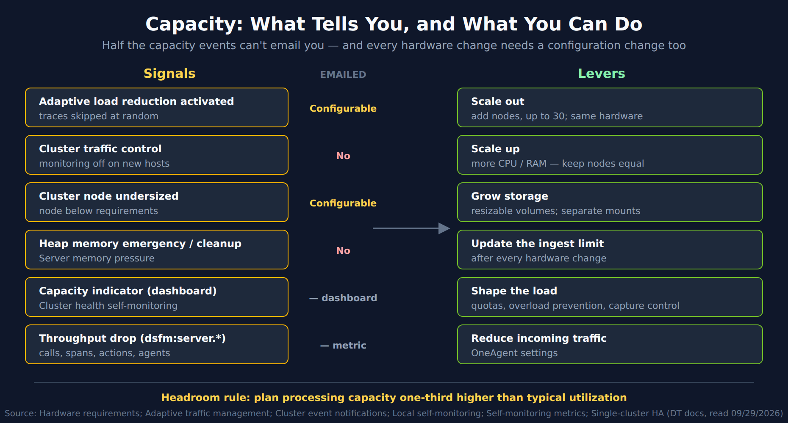

# MCH-06: Capacity and Scaling

> **Series:** MCH — Managed Cluster Health | **Notebook:** 6 of 8 | **Created:** September 2026 | **Last Updated:** 10/02/2026

## Overview

A Managed cluster can have every node up, every store healthy and every link open, and still be failing its users because it can't keep up. This notebook is layer 3 of the MCH-01 health model: **capacity**. It covers how Dynatrace sizes a cluster, the three directions you can grow it in, how much headroom to keep for a node failure, the signals that say you've run out, and the settings that shape how much load reaches the cluster at all.

**What you'll learn:**

- How node size maps to host units, user actions and storage, and why Premium HA halves it
- When to scale out, up, or just add disk
- The headroom rule, and why it exists
- Which capacity events can email you, and which can't
- The environment-level settings that cap load, and the one to change after every hardware change

---

## Table of Contents

1. [Short Answer](#short-answer)
2. [The Sizing Model](#sizing-model)
3. [Three Ways to Scale](#scaling)
4. [Headroom for a Node Failure](#headroom)
5. [Capacity Signals](#signals)
6. [Controls That Shape the Load](#controls)
7. [Adding and Removing Nodes — the Capacity View](#add-remove)
8. [What the Documentation Does Not Say](#doc-gaps)
9. [Recommended Approach](#recommendation)
10. [Summary and Next Steps](#summary)

---

## Prerequisites

| Requirement | Details |
|-------------|---------|
| **Dynatrace deployment** | A self-hosted **Dynatrace Managed** cluster. Nothing in this series applies to Dynatrace SaaS. |
| **Access** | Cluster Management Console (CMC) administrator access; for the self-monitoring metrics, access to the environment where they're reported |
| **Query language** | None. Managed has no Grail, so this series has **no DQL cells**. Every check is a CMC view, a cluster event, a dashboard, or a classic metric |
| **Read first** | MCH-01 (health model), MCH-03 and MCH-04 (store sizing) |
| **Version basis** | Written against the Managed documentation read 09/29/2026 |

## 1. Short Answer

- **Size by host units and peak user actions per node**, from the hardware guide's table, and plan to grow. The docs put it plainly: *"it's more important to be able to add capacity as your monitoring needs increase."*
- **Premium High Availability roughly halves per-node capacity**, so the same load needs about twice the nodes.
- **Keep one-third headroom:** *"Plan for a processing capacity one-third higher than typical utilization."* When a node fails, its traffic moves to the others.
- **Adaptive load reduction is the headline signal.** Occasional episodes are fine; *"consistent use for intervals of 15 minutes or longer"* costs data accuracy. It can email you; cluster traffic control and heap-memory pressure can't.
- **Every hardware change needs a configuration change.** *"Update the Managed Cluster ingest limit via Cluster Management Console or REST API whenever hardware changes."*

> **Sources:** [Hardware requirements (DT docs)](https://docs.dynatrace.com/managed/managed-cluster/installation/managed-hardware-requirements), [Single-cluster high availability (DT docs)](https://docs.dynatrace.com/managed/managed-cluster/high-availability/single-cluster-high-availability), [Adaptive traffic management for Managed (DT docs)](https://docs.dynatrace.com/managed/ingest-from/dynatrace-oneagent/adaptive-traffic-management/adaptive-traffic-management-managed), [Configure Cluster event notifications (DT docs)](https://docs.dynatrace.com/managed/managed-cluster/configuration/configure-cluster-event-notifications).

## 2. The Sizing Model

**Start from the table, and expect to be wrong.** *"Exact sizing of a Managed Cluster isn't always possible, especially in environments with growing traffic. While upfront analysis is useful, it's more important to be able to add capacity as your monitoring needs increase."*

| Node size | Max host units (per node) | Peak user actions/min (per node) | Min spec | Disk IOPS |
|-----------|---------------------------|----------------------------------|----------|-----------|
| Micro | 50 | 1,000 | 4 vCPUs, 32 GB RAM | 500 |
| Small | 300 | 10,000 | 8 vCPUs, 64 GB RAM | 3,000 |
| Medium | 600 | 25,000 | 16 vCPUs, 128 GB RAM | 5,000 |
| Large | 1,250 | 50,000 | 32 vCPUs, 256 GB RAM | 7,500 |
| XLarge | 2,500 | 100,000 | 64 vCPUs, 512 GB RAM | 10,000 |

Storage per node size is in MCH-03 §3 (metrics) and MCH-04 §3 (Elasticsearch). The docs give two worked examples: *"To monitor up to 7,500 host units with a peak load of 300,000 user actions per minute, you need 3 XLarge nodes"*, and *"To monitor 500 host units with a peak load of 25,000 user actions per minute, you need 3 Small nodes"*.

**What a host unit is.** Host units are sized by memory, not by what runs on the host: *"The number of host units that a host uses for consumption calculations depends on the number of GBs of RAM available on the host server."* For full-stack monitoring, *"a host with 16 GB of RAM (or any portion thereof) equates to 1 host unit."*

**Premium HA sizes differently.** The Premium High Availability table gives a Large node 600 host units and 25,000 user actions per minute (standard: 1,250 and 50,000), and an XLarge node 1,250 and 50,000 (standard: 2,500 and 100,000), so roughly half. Its worked example needs twice the nodes for the same load: *"you need 6 XLarge nodes. Place 3 nodes in one data center and 3 nodes in a second data center"*.

**Bigger isn't better.** *"Dynatrace Managed runs resiliently on instances with 1 TB+ RAM/128 cores (2XLarge) and lets you monitor more entities, but this setup doesn't use the hardware optimally. Instead, consider using smaller instances (Large or XLarge)."*

**In the cloud,** the docs list an instance family per provider: AWS `r6i`, Azure `E…as v6`, Google Cloud `n4-highmem`. The guidance is *"Maintain a vCPU to RAM (random access memory) ratio of 1:8 to optimize performance."*

> **Sources:** [Hardware requirements (DT docs)](https://docs.dynatrace.com/managed/managed-cluster/installation/managed-hardware-requirements), [Manage your monitoring environments (DT docs)](https://docs.dynatrace.com/managed/managed-cluster/operation/manage-your-monitoring-environments), [Cloud requirements (DT docs)](https://docs.dynatrace.com/managed/managed-cluster/installation/managed-cloud-requirements). **Derived:** "roughly half" compares the standard and Premium HA rows for the Large and XLarge node sizes on the same page.

## 3. Three Ways to Scale

The hardware guide names three dimensions:

| Dimension | From the docs | What to watch |
|-----------|---------------|---------------|
| **Out** | *"Horizontal scaling: Add more nodes. Dynatrace Managed supports up to 30 Managed Cluster nodes."* | Every node must *"Have the same hardware configuration"* |
| **Up** | *"Vertical scaling: Add more RAM or CPU per node."* | *"When adding CPUs or RAM, keep all nodes equally sized."* |
| **Storage** | *"Storage scaling: Use resizable disk volumes."* | *"Use resizable disk partitions, for example with Logical Volume Manager (LVM)."* and *"Use the same partition size on all Managed Cluster nodes."* |

**Which one?** The docs state a preference in one case. For Log Monitoring: *"Add more Managed Cluster nodes rather than increasing hardware per node for a more resilient configuration."* Scaling out also spreads the three replicas (MCH-03 §3) and the Elasticsearch store across more machines. Storage growth alone suits a cluster whose stores are filling while CPU and memory are comfortable.

Two storage rules make later growth possible: *"Store Dynatrace binaries and the data store on separate mount points so you can resize the data store independently."* and *"Don't store Dynatrace data on the root volume to avoid complexity when resizing later."*

> **Sources:** [Hardware requirements (DT docs)](https://docs.dynatrace.com/managed/managed-cluster/installation/managed-hardware-requirements). **Derived:** "scaling out spreads the replicas" combines the scale-out dimension with replication across nodes (MCH-03 §2, MCH-04 §2).

## 4. Headroom for a Node Failure

A three-node cluster survives losing a node (MCH-01 §4), but the survivors take the load: *"If a node fails, the NGINX load balancer automatically redirects all OneAgent traffic to the remaining working nodes."* If they were already near their limit, the failure turns a redundancy event into a capacity event. The docs' answer is a fixed margin: *"Plan for a processing capacity one-third higher than typical utilization."*

Read the margin against the whole cluster's processing capacity, not one node's: a cluster whose typical load already uses most of its capacity has no room for either a failure or a spike. In community practice, the sizing table's per-node figures (§2) are the reference for "capacity" here — verify with your own load, since the docs don't state how the one-third is measured.

> **Sources:** [Single-cluster high availability (DT docs)](https://docs.dynatrace.com/managed/managed-cluster/high-availability/single-cluster-high-availability).

## 5. Capacity Signals

<!-- MARKDOWN_TABLE_ALTERNATIVE
| Signal | Emailed | Lever |
|--------|---------|-------|
| Adaptive load reduction activated | Configurable | Scale out — add nodes, up to 30, same hardware |
| Cluster traffic control | No | Scale up — more CPU / RAM, keep nodes equal |
| Cluster node undersized | Configurable | Grow storage — resizable volumes, separate mounts |
| Heap memory emergency / cleanup | No | Update the ingest limit after every hardware change |
| Capacity indicator (Cluster health self-monitoring dashboard) | — dashboard | Shape the load — quotas, overload prevention, capture control |
| Throughput drop (dsfm:server.*) | — metric | Reduce incoming traffic — OneAgent settings |
Headroom rule: plan processing capacity one-third higher than typical utilization.
For environments where SVG doesn't render
-->

### 5.1 Adaptive load reduction

The main one. *"Because Dynatrace Managed environments can process a limited number of service calls per minute (depending on the node CPU amount and memory availability)"*, the cluster protects itself when an environment exceeds that: *"New incoming distributed traces are skipped in a random fashion, reducing gradually the number of processed distributed traces."* Brief episodes are fine. *"While occasional activation (for example, to cover spikes) will not harm the fidelity of your monitoring data, consistent use for intervals of 15 minutes or longer can impact the accuracy of your monitoring data and metrics because not all data is processed."*

The docs name the long-term fixes: *"Adding hardware and a new Dynatrace Managed cluster node to provide your Dynatrace Managed cluster with the necessary resources to process the additional data."* and *"Adjusting OneAgent settings to reduce the incoming traffic."*

### 5.2 The events

| Event | Severity | Emailed |
|-------|----------|---------|
| *"Server %d activated Adaptive Load Reduction."* | WARNING | Configurable |
| *"Your Dynatrace Managed cluster node {0} is undersized!"* | SEVERE | Configurable |
| *"Cluster traffic control: OneAgent monitoring was disabled on recently connected hosts to avoid cluster overload."* | SEVERE | **No** |
| *"Heap memory: Server %d started memory emergency mode."* | SEVERE | **No** |

*Configurable* events email by default (MCH-01 §6.2). Traffic control is the most serious of the four, since new hosts stop being monitored, and it is one of the two that never email.

### 5.3 The dashboard and the metrics

- **Capacity indicator.** The *Cluster health self-monitoring* dashboard *"shows aggregated data for all environments in your Managed Cluster, including current utilization and an indicator of whether your Managed Cluster has sufficient capacity for the current load."* It lives in the local self-monitoring environment. Whether every cluster has one is contradicted between two pages (§8).
- **Reading the indicator.** A Dynatrace blog on Managed self-monitoring (Managed 1.230) explains the scale: *"a cluster utilization of 50% should allow you to roughly double the currently processed load before the cluster reaches its maximum capacity."* At the top end, *"Red status: When utilization reaches the red area, the cluster is at maximum capacity."* It adds a caution: *"cluster utilization might show healthy operation (green status) when only 80% of the service calls are captured"*. Read utilization together with the capture rate and adaptive load reduction (§5.1).
- **As a Hub extension.** The *Dynatrace Self-Monitoring (Managed)* extension packages the same intent: *"Check if Dynatrace cluster is properly sized to handle current load."*
- **Throughput.** The self-monitoring metrics `dsfm:server.service_calls.received`, `dsfm:server.spans.received`, `dsfm:server.rum.action_count` and `dsfm:cluster.oneagent.agent_modules` track what reaches the cluster. *"A steady number of monitored hosts and modules, service calls received, and user sessions/actions per minute together indicate a healthy Dynatrace environment. A significant drop in these metrics might indicate a problem"*.

> **Sources:**
> - [Adaptive traffic management for Managed (DT docs)](https://docs.dynatrace.com/managed/ingest-from/dynatrace-oneagent/adaptive-traffic-management/adaptive-traffic-management-managed)
> - [Configure Cluster event notifications (DT docs)](https://docs.dynatrace.com/managed/managed-cluster/configuration/configure-cluster-event-notifications)
> - [Proactive self-monitoring for Dynatrace Managed (Dynatrace blog)](https://www.dynatrace.com/news/blog/proactive-self-monitoring-ensures-seamless-operations-for-dynatrace-managed-at-scale/), [Dynatrace Self-Monitoring (Managed) (Dynatrace Hub)](https://www.dynatrace.com/hub/detail/dynatrace-self-monitoring-managed/)
> - [Local self-monitoring (DT docs)](https://docs.dynatrace.com/managed/managed-cluster/self-monitoring/local-self-monitoring), [Self-monitoring metrics (DT docs)](https://docs.dynatrace.com/managed/analyze-explore-automate/metrics-classic/self-monitoring-metrics)

## 6. Controls That Shape the Load

Capacity is also a matter of how much load you let in. Three sets of controls live on each environment's configuration page in the CMC (**Environments** → an environment).

**Quotas.** You can set the total as well as the monthly and annual quotas for an environment: host units, custom metrics, user sessions, synthetic monitors, log volume and storage. They're hard limits: *"Once any one of these limits is consumed, the respective monitoring will no longer be available"*.

**Cluster overload prevention.** Here you set the environment quota of *"Number of newly monitored entry point traces captured per process/minute"*. *"The default value is 1,000, however, the environment quota can be increased to 100,000."* Within that, each environment's **Adaptive capture control** (Settings > Server-side service monitoring > Deep monitoring) tunes how much of the incoming traffic is captured. Raising both has a price: *"Setting the environment quota and adaptive capture control values too high can cause resource shortages and increase hardware expenditures."*

**The ingest limit, after every hardware change.** *"Update the Managed Cluster ingest limit via Cluster Management Console or REST API whenever hardware changes."* The hardware guide places it in the same section: *"Go to Environments, select your environment, and adjust the limit in Cluster overload prevention settings."* If the cluster scales out but its limits stay where they were, the new capacity sits unused.

> **Sources:** [Manage your monitoring environments (DT docs)](https://docs.dynatrace.com/managed/managed-cluster/operation/manage-your-monitoring-environments), [Adaptive traffic management for Managed (DT docs)](https://docs.dynatrace.com/managed/ingest-from/dynatrace-oneagent/adaptive-traffic-management/adaptive-traffic-management-managed), [Hardware requirements (DT docs)](https://docs.dynatrace.com/managed/managed-cluster/installation/managed-hardware-requirements), [Cluster Management Console (DT docs)](https://docs.dynatrace.com/managed/managed-cluster/basics/cluster-management-console). **Derived:** "new capacity sits unused" follows from the instruction to update the limit whenever hardware changes.

## 7. Adding and Removing Nodes — the Capacity View

MCH-02 §5 covers the operations and MCH-03 §7 what they do to Cassandra. From a capacity point of view:

**Before adding a node,** every node in a multi-node cluster must *"Have the same hardware configuration"*, *"Synchronize with NTP"*, *"Be in the same time zone"*, *"Communicate over a private network on the required ports"*, *"Have a network latency between nodes of 10 ms or less"*, and *"Have matching Dynatrace Managed system user and group identifiers on all nodes"*.

**Give the new node enough disk.** The docs show the arithmetic: in a two-node cluster whose disks are 9 TB full, *"a third node needs a minimum of 6 TB: (9 TB + 9 TB) / 3 = 6 TB. Anything below the calculated minimum is a misconfiguration."*

**Expect it to take time.** *"Full data synchronization can take a couple of hours."* *"You can't add additional cluster nodes until synchronization completes."* So scaling by several nodes takes several windows, and in a capacity emergency relief arrives node by node.

**Then finish the change:**

- From the 13th node, *"web UI traffic is by default turned off"* (MCH-05 §4).
- Update any load balancer: its target list *"has to be updated after node join or removal."*
- Update the ingest limit (§6).

**Removing a node** puts its load on the survivors. Check the one-third headroom against the smaller cluster first, and remember *"Remove no more than one node at a time."* (MCH-02 §5).

> **Sources:** [Hardware requirements (DT docs)](https://docs.dynatrace.com/managed/managed-cluster/installation/managed-hardware-requirements), [Add a cluster node (DT docs)](https://docs.dynatrace.com/managed/managed-cluster/installation/add-cluster-node), [Configure cluster capabilities (DT docs)](https://docs.dynatrace.com/managed/managed-cluster/configuration/configure-cluster-capabilities), [Set up load balancer (DT docs)](https://docs.dynatrace.com/managed/managed-cluster/configuration/set-up-load-balancer), [Remove a cluster node (DT docs)](https://docs.dynatrace.com/managed/managed-cluster/operation/remove-a-cluster-node). **Derived:** "relief arrives node by node" follows from synchronization blocking the next addition; "check headroom against the smaller cluster" applies §4 to a removal.

## 8. What the Documentation Does Not Say

**Not found**, in the Managed documentation read 09/29/2026:

| Gap | Working assumption in this notebook |
|-----|-------------------------------------|
| A numeric threshold behind the dashboard's "sufficient capacity" indicator, or behind adaptive load reduction | The blog's utilization scale (§5.3) is the closest; treat the events and the indicator as the thresholds |
| How the one-third headroom is measured (CPU, memory, host units, or service calls) | Keep typical load at no more than three-quarters of total capacity on every dimension you can see (§4) |
| Whether the hardware page's *"ingest limit"* is the same setting as the entry-point-traces quota in Cluster overload prevention | Review every setting in that section after a hardware change (§6) |

**One conflict.** Whether every cluster has a local self-monitoring environment. The hosted self-monitoring page says *"All Managed Clusters have a local self-monitoring environment with internal metrics."*; the local self-monitoring page says *"The self-monitoring environment is available only for Dynatrace Managed customers using DDU licensing."* A Dynatrace blog (2022, updated 2024) sides with the hosted page: *"A dedicated self-monitoring Dynatrace environment called Local self-monitoring is now enabled by default on all Dynatrace Managed Clusters."* MCH-01 §6.3 records both. Check your own CMC before planning around the capacity dashboard.

> **Sources:** [Hosted self-monitoring (DT docs)](https://docs.dynatrace.com/managed/managed-cluster/self-monitoring/hosted-self-monitoring), [Local self-monitoring (DT docs)](https://docs.dynatrace.com/managed/managed-cluster/self-monitoring/local-self-monitoring), [Hardware requirements (DT docs)](https://docs.dynatrace.com/managed/managed-cluster/installation/managed-hardware-requirements), [Proactive self-monitoring for Dynatrace Managed (Dynatrace blog)](https://www.dynatrace.com/news/blog/proactive-self-monitoring-ensures-seamless-operations-for-dynatrace-managed-at-scale/), [Adaptive traffic management for Managed (DT docs)](https://docs.dynatrace.com/managed/ingest-from/dynatrace-oneagent/adaptive-traffic-management/adaptive-traffic-management-managed). **Observed 09/29/2026:** the three gaps were searched for across the Managed cluster, self-monitoring and adaptive-traffic-management pages; none is filled.

## 9. Recommended Approach

1. **Size from the table, then plan the second step.** Know which dimension you'll grow in first, and keep the storage layout resizable (separate mounts, LVM).
2. **Keep one-third headroom**, and re-check it whenever load grows and before removing a node.
3. **Treat repeated adaptive load reduction as a capacity finding**, not noise. Episodes of 15 minutes or more mean scaling or reducing load.
4. **Read CMC Events for traffic control and heap-memory events.** Neither emails.
5. **Watch the throughput metrics** (`dsfm:server.*`) for steady growth, and for drops.
6. **Make every hardware change a two-part change:** the hardware, then the ingest limit, load balancer and DNS.
7. **Keep Premium HA sizing separate.** It needs roughly twice the nodes for the same load.

## 10. Summary and Next Steps

Size a Managed cluster from host units and peak user actions per node, expect to grow, and prefer growing out to growing up. Keep one-third headroom so a node failure doesn't become an overload. Adaptive load reduction is the signal that matters most: brief episodes are tolerable, sustained ones cost accuracy. Traffic control and heap pressure never email you. Environment quotas and overload-prevention settings decide how much load reaches the cluster, and have to be revisited every time the hardware changes.

**Next in the series:**

| Notebook | Layer |
|----------|-------|
| MCH-07: Backup, Upgrade, and Disaster Recovery | 5 — Lifecycle |
| MCH-99: Best Practice Summary and Health-Check Checklist | All layers |

---

*This notebook was AI-generated from community-submitted and publicly available sources. This notebook series is not officially supported by Dynatrace. Always verify information against official [Dynatrace documentation](https://docs.dynatrace.com/managed).*
