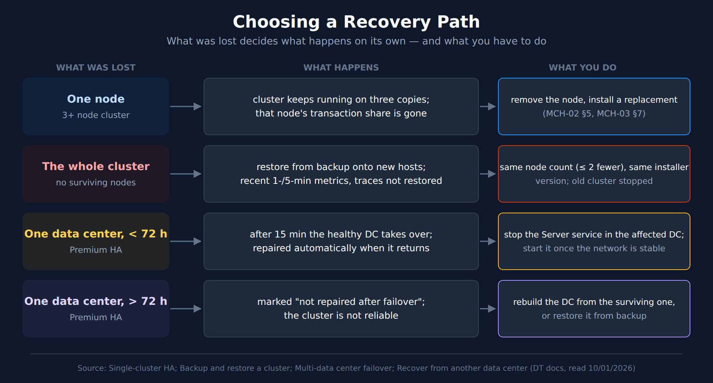

# MCH-07: Backup, Upgrade, and Disaster Recovery

> **Series:** MCH — Managed Cluster Health | **Notebook:** 7 of 8 | **Created:** September 2026 | **Last Updated:** 10/02/2026

## Overview

The last layer of the MCH-01 health model is **lifecycle**: whether the cluster can be recovered when something is lost, and whether it stays current. Both are easy to neglect because they don't fail loudly. A backup that stopped working weeks ago and a cluster that has drifted out of support look exactly like healthy ones until the day they're needed.

This notebook covers what a backup protects and what it doesn't, how to set backups up and keep them working, what a restore needs before it can succeed, how upgrades run and what slows them down, how long each version is supported, how Premium High Availability recovers from losing a data center, and how to pick the right recovery path for what was actually lost.

**What you'll learn:**

- Exactly which data a restore brings back, and which it can't
- The backup-storage mistake that can stop a node from starting
- The preconditions a restore needs, prepared before you need them
- The 24-hour rules, the skip rule and the maintenance window behind every upgrade
- How long a version is supported, and how failover works across two data centers

---

## Table of Contents

1. [Short Answer](#short-answer)
2. [What a Backup Protects — and What It Doesn't](#backup-scope)
3. [Setting Up Backups](#backup-setup)
4. [Restore Readiness](#restore)
5. [Upgrades](#upgrades)
6. [Version Support](#version-support)
7. [Premium High Availability and Data-Center Failover](#pha)
8. [Choosing a Recovery Path](#recovery-paths)
9. [What the Documentation Does Not Say](#doc-gaps)
10. [Recommended Approach](#recommendation)
11. [Summary and Next Steps](#summary)

---

## Prerequisites

| Requirement | Details |
|-------------|---------|
| **Dynatrace deployment** | A self-hosted **Dynatrace Managed** cluster. Nothing in this series applies to Dynatrace SaaS. |
| **Access** | Cluster Management Console (CMC) administrator access; root (or `sudo`) on the cluster nodes; for Premium HA recovery, a Cluster API token with the `ServiceProviderAPI` scope |
| **Shared storage** | A shared file system (for example NFS) mounted at the same path on every node, for backups |
| **Query language** | None. Managed has no Grail, so this series has **no DQL cells** |
| **Read first** | MCH-01 (health model), MCH-03 §9 and MCH-04 §8 (what each store's backup contains) |
| **Version basis** | Written against the Managed documentation read 10/01/2026. Support dates come from the Managed release-notes page as it stood that day |

<a id="short-answer"></a>
## 1. Short Answer

- **A backup is not a full copy.** It restores configuration, longer-term metrics and (unless excluded) user sessions. It never restores transaction storage, never restores recent 1-minute and 5-minute metrics, and restores log events only if you opted in.
- **A missing backup mount can stop a node from starting.** *"If the shared file system mount point isn't available on system boot, Dynatrace won't start on that node."* Make the mount persistent.
- **Prepare the restore before you need it.** It needs the exact installer version from the backup, the same number of nodes (or at most two fewer), matching user IDs, and the old cluster stopped.
- **Upgrades have built-in waits:** 24 hours after a download, and 24 hours between updates. Clusters under three nodes are unavailable while they update.
- **Three releases are supported**, plus a fourth with Enterprise Success and Support. A new release arrives roughly every four weeks, so falling behind happens quickly.
- **Premium HA repairs a lost data center automatically for up to 72 hours.** After that, the data center has to be rebuilt.

> <sub>**Sources:** [Backup and restore a cluster (DT docs)](https://docs.dynatrace.com/managed/managed-cluster/operation/back-up-and-restore-a-cluster), [Update a cluster (DT docs)](https://docs.dynatrace.com/managed/managed-cluster/operation/update-cluster), [Dynatrace Managed release notes (DT docs)](https://docs.dynatrace.com/managed/whats-new/managed), [Mission Control proactive support (DT docs)](https://docs.dynatrace.com/managed/managed-cluster/basics/mission-control-proactive-support), [Multi-data center failover (DT docs)](https://docs.dynatrace.com/managed/managed-cluster/high-availability/failover), [Recover from another data center (DT docs)](https://docs.dynatrace.com/managed/managed-cluster/high-availability/recover-from-data-center).</sub>

<a id="backup-scope"></a>
## 2. What a Backup Protects — and What It Doesn't

*"You can automatically back up Dynatrace Managed configuration data (naming rules, tags, management zones, alerting profiles, and more), time series metric data, and user sessions."* Each of those comes with conditions:

| Data | In the backup? | Details |
|------|----------------|---------|
| Configuration | **Yes** | Daily, with the metrics snapshot |
| Metrics | **Partly** | Daily; excludes the most frequently changing column families (about 80% of storage) and 1-minute and 5-minute data (MCH-03 §9) |
| User sessions | **Yes, unless excluded** | *"Exclude user sessions from the backup to remain compliant with GDPR."* (MCH-04 §8) |
| Log Monitoring events | **Only if included** | *"Include backup of Log Monitoring events."* |
| Transaction storage (traces, code-level data) | **No** | *"Transaction storage data isn't backed up, so when you restore backups you may see gaps in deep monitoring data (for example, distributed traces and code-level traces)."* |

The docs' reasoning for leaving transaction storage out: *"By default, transaction storage data is only retained for 10 days. From a long-term perspective, it's not necessary to include transaction storage data in backups."* The consequence is that after a restore, trace history starts again from the restore point.

> <sub>**Sources:** [Backup and restore a cluster (DT docs)](https://docs.dynatrace.com/managed/managed-cluster/operation/back-up-and-restore-a-cluster).</sub>

<a id="backup-setup"></a>
## 3. Setting Up Backups

**Where.** In the CMC: *"Go to Settings > Backup."* Enable the backup, choose the scope (§2), give *"a full path to the mounted network file storage where backup archives are stored"*, and set a start time. Then keep a copy elsewhere: *"To maximize resilience, save your backup files to an off-site location."*

**The shared file system.** Every node writes to the same place: *"the shared file system needs to be mounted at the same shared directory on each node."* The docs' preference: *"We recommend NFSv4. Due to low performance and resilience, we don't recommend CIFS."* Test that the Dynatrace user can write there, on each node:

```bash
su - dynatrace -s /bin/bash -c "touch /nfs/dynatrace/backup/$(uname -n)"
```

**The mount that can stop a node.** This is the backup setting most likely to cause an outage:

> *"If the shared file system mount point isn't available on system boot, Dynatrace won't start on that node. This may lead to the cluster becoming unavailable. You must disable backups manually to allow Dynatrace to start."*

So *"The shared file system mount must be available at system restart."* Make it persistent, for example in `fstab`. Then a reboot during an NFS outage won't take Dynatrace down with it.

**How much space.** Plan for twice 20% of the metrics store plus the full Elasticsearch store (MCH-03 §9, MCH-04 §8).

**Watching it.** Neither *"Cassandra backup problem."* nor *"ElasticSearch backup problem."* is emailed (MCH-01 §7). CMC **Home** has a *Last backup* field, which *"Displays the date and storage location of the last backup."* Check it on a schedule.

> <sub>**Sources:** [Backup and restore a cluster (DT docs)](https://docs.dynatrace.com/managed/managed-cluster/operation/back-up-and-restore-a-cluster), [Estimating cluster backup size (DT docs)](https://docs.dynatrace.com/managed/managed-cluster/operation/estimating-cluster-backup-size), [Cluster Management Console (DT docs)](https://docs.dynatrace.com/managed/managed-cluster/basics/cluster-management-console), [Configure Cluster event notifications (DT docs)](https://docs.dynatrace.com/managed/managed-cluster/configuration/configure-cluster-event-notifications).</sub>

<a id="restore"></a>
## 4. Restore Readiness

A restore is a reinstall from backup onto prepared machines. Most of what can make it fail is decided before it starts.

### 4.1 Preconditions

| Precondition | From the docs |
|--------------|---------------|
| Clean target hosts | *"To restore a cluster on the same host as the source cluster, make sure to uninstall it first."* |
| Comparable hardware | *"Make sure the machines prepared for the cluster restore have a similar hardware and disk layout as the original cluster and sufficient capacity to handle the load after the restore."* |
| Node count | *"We recommend that you restore the cluster to the same number of nodes as the backed up cluster."* At most two fewer: *"You risk losing the cluster configuration if you attempt to restore to a cluster that is more than two nodes short of the original backed up cluster."* |
| Old cluster stopped | *"Make sure the existing cluster is stopped to prevent two clusters with the same ID connecting to Dynatrace Mission Control."* |
| Matching identities | *"Make sure that system users created for Dynatrace Managed have the same UID:GID identifiers on all nodes."* |
| The same installer | *"To restore the cluster, you need to use the exact same installer version as in the original one."* It is in the backup itself, under each node's `files/<backup-version-number>/` directory |

Before you start, also prepare an inventory: the node IDs (each backup sits in a `node_<node-id>` directory), the new IP address for each node, and which node will be the seed.

### 4.2 The restore order

1. **Run the installer in restore mode** on every node, in parallel, with `--restore`, `--cluster-ip`, `--cluster-nodes`, `--seed-ip` and `--backup-file`.
2. **Start the firewall, Cassandra and Elasticsearch** on each node, then verify both: Cassandra *Status = Up / State = Normal*, Elasticsearch `green` (MCH-03 §5, MCH-04 §5).
3. **Restore Elasticsearch once, on the seed node:** `restore-elasticsearch-data.sh <path-to-backup>/<UUID>`.
4. **Restore Cassandra node by node, seed first:** `restore-cassandra-data.sh`, using each node's backup file.
5. **Optionally repair Cassandra** (MCH-03 §8), then **start Dynatrace** on each node, starting with the seed node.

### 4.3 Rehearse it

The docs don't prescribe a restore test. In community practice, a restore that has never been rehearsed is treated as unproven. Teams run it on spare hosts, with the production cluster left running and the rehearsal kept off the Mission Control network, so the two clusters never connect at once — verify the approach with Dynatrace support before relying on it.

> <sub>**Sources:** [Backup and restore a cluster (DT docs)](https://docs.dynatrace.com/managed/managed-cluster/operation/back-up-and-restore-a-cluster).</sub>

<a id="upgrades"></a>
## 5. Upgrades

### 5.1 The three paths

| Path | How it works |
|------|--------------|
| **Automatic** (the docs' recommendation) | *"By default, installation packages are downloaded automatically from Mission Control as soon as they are available to your cluster."* The update runs in the maintenance window set under **Settings > Automatic update** |
| **Semi-automatic** | Without automatic downloads or a Mission Control connection, you get an email for each new package, download it, and upload it in the CMC |
| **Manual** | Run the update script on each node: *"it's crucial that you manually update one node at a time."* |

### 5.2 The rules that pace it

- **A day after download.** *"After an installation package is downloaded, a 24-hour waiting period is required before an automatic update can run."* An update downloaded today won't run in tonight's window.
- **A day between updates.** *"You wait 24 hours between cluster updates to ensure that all post-processing steps are completed before initiating another update."*
- **Disk.** *"You have at least 5 GB of available disk space on the partition where Dynatrace Managed is installed."*
- **Downtime below three nodes.** *"If your cluster consists of less than 3 nodes, Dynatrace Managed won't be accessible during the update process."*

### 5.3 Skipping versions

*"You can skip a Managed version only if its installed version is divisible by 4."* A cluster on 1.300 can skip 1.302 once 1.304 is released; a cluster on 1.302 can't skip. If you would rather never skip, since Managed 1.324 there's a switch for that: *"Turn on Run Dynatrace cluster updates sequentially without skipping a version."* For clusters that can skip, the docs advise *"waiting until the target version is released if you cannot complete the update process within one month."*

### 5.4 Cadence

*"These software updates are mandatory and are typically released every four weeks."* With the 24-hour rules, a weekly maintenance window, and only some versions skippable, a cluster can only catch up so fast.

> <sub>**Sources:** [Update a cluster (DT docs)](https://docs.dynatrace.com/managed/managed-cluster/operation/update-cluster), [Mission Control proactive support (DT docs)](https://docs.dynatrace.com/managed/managed-cluster/basics/mission-control-proactive-support). **Derived:** "can only catch up so fast" combines the four-week cadence with the 24-hour rules and the skip rule.</sub>

<a id="version-support"></a>
## 6. Version Support

*"New versions are rolled out within configurable maintenance windows."* The release-notes page lists which versions are currently supported. As it stood on 10/01/2026:

| Version | Rollout start | Currently supported |
|---------|---------------|---------------------|
| 1.348 | Sep 28, 2026 (planned) | (planned) |
| 1.346 | Aug 31, 2026 | Yes |
| 1.344 | Aug 03, 2026 | Yes |
| 1.342 | Jul 06, 2026 | Yes |
| 1.340 | Jun 08, 2026 | Only with Enterprise Success and Support |

The table of earlier versions shows the pattern. Standard support for a version ends when the release three versions later rolls out, and Enterprise Success and Support covers it for one more release. For example, 1.338 rolled out May 11, 2026; its standard support ended Aug 03, 2026 (when 1.344 rolled out), and Enterprise Success and Support ended Aug 31, 2026.

**Managed's future.** No end-of-life has been announced. Dynatrace's annual report for fiscal 2026 still describes the offering: *"We also provide options to deploy our platform in customer-provisioned infrastructure, which we call Dynatrace Managed."* It also notes that *"The majority of our customers deploy Dynatrace as a Software-as-a-Service"*. For clusters planning that move, M2S is the series.

**What falling behind costs** goes beyond support. Several changes in this series only reach you through updates: Cassandra and Elasticsearch fixes (MCH-03 §10, MCH-04 §9), and changes to ActiveGate compatibility and Mission Control ciphers (MCH-05).

> <sub>**Sources:** [Dynatrace Managed release notes (DT docs)](https://docs.dynatrace.com/managed/whats-new/managed). [Dynatrace FY2026 Form 10-K (Dynatrace IR)](https://ir.dynatrace.com/sec-filings/all-sec-filings/content/0001773383-26-000019/dt-20260331.htm). **Derived:** the "three versions later" pattern reads the rollout and support-end dates in the page's previous-versions table.</sub>

<a id="pha"></a>
## 7. Premium High Availability and Data-Center Failover

### 7.1 What it is, and what it needs

*"Premium High Availability (PHA) extends Dynatrace Managed high availability across two data centers (DC)."* *"PHA keeps a full, active copy of your data in the second DC."* Its requirements:

- *"Deploy at least six nodes, with three nodes per DC."* *"Size both DCs symmetrically."*
- *"PHA is available only for online Managed Clusters."*
- *"Keep round-trip network latency at 100 ms or less."*
- *"Encrypt the connections between nodes in different DCs. Dynatrace Managed doesn't create or install the required certificates."*
- It's a one-way decision: *"You cannot reverse a migration to PHA."*

### 7.2 How failover works

Mission Control drives it. *"If Mission Control (MC) detects that two or more Elasticsearch or Cassandra nodes in a data center (DC) are down for 15 minutes, it automatically stops the server processes in that DC. MC then marks the DC as unhealthy."* The healthy data center takes over, and a healthy server sends an event and an email. When the failed processes are started again, the servers come back. Where Cassandra was down for three hours or more, Cassandra repairs also run, and responsibility moves back only after they finish: *"Thirty minutes after all Cassandra nodes are repaired, Mission Control requests the Nodekeepers to change the responsibility override"* (MCH-03 §8).

Two conditions apply. *"To transfer responsibility to another DC, it must be healthy at the time of failover."* And the mechanism handles a window: *"PHA automatically repairs network disconnections of up to 72 hours between DCs."*

### 7.3 While a data center is down, and after 72 hours

- **During the outage:** *"To avoid data inconsistency while a DC is unavailable, shut down the Dynatrace Server service on all Cluster nodes in the affected DC. Start the services only when network connectivity is stable again."*
- **Past 72 hours:** *"After 72 hours, Mission Control marks the Managed Cluster as not repaired after failover. Such a Managed Cluster is not reliable."* The data center must then be rebuilt, either from the surviving data center (*Rebuild data center*) or from backup (*Recover from a backup*). Both are long, Cluster-API-driven procedures.

> <sub>**Sources:** [Multi-data center high availability (DT docs)](https://docs.dynatrace.com/managed/managed-cluster/high-availability/multi-data-centers), [Multi-data center failover (DT docs)](https://docs.dynatrace.com/managed/managed-cluster/high-availability/failover), [Recover from another data center (DT docs)](https://docs.dynatrace.com/managed/managed-cluster/high-availability/recover-from-data-center), [Rebuild data center (DT docs)](https://docs.dynatrace.com/managed/managed-cluster/high-availability/rebuild-data-center), [Recover from a backup (DT docs)](https://docs.dynatrace.com/managed/managed-cluster/high-availability/recover-from-backup).</sub>

<a id="recovery-paths"></a>
## 8. Choosing a Recovery Path

What was lost decides the path:



<!-- MARKDOWN_TABLE_ALTERNATIVE
| What was lost | What happens | What you do |
|---------------|--------------|-------------|
| One node (3+ node cluster) | Cluster keeps running on three copies; that node's transaction share is gone | Remove the node, install a replacement (MCH-02 §5, MCH-03 §7) |
| The whole cluster | Restore from backup onto new hosts; recent 1-/5-min metrics and traces are not restored | Same node count (at most two fewer), same installer version, old cluster stopped |
| One data center, under 72 h (Premium HA) | After 15 minutes the healthy DC takes over; repaired automatically when it returns | Stop the Server service in the affected DC; start it once the network is stable |
| One data center, over 72 h (Premium HA) | Marked "not repaired after failover"; the cluster is not reliable | Rebuild the DC from the surviving one, or restore it from backup |
For environments where SVG doesn't render
-->

A single node is the common case, and it needs no restore: *"The Managed Cluster maintains three copies of this data, so Dynatrace Managed continues to operate after the loss of one node."* A full restore from backup is for losing the cluster. Once the cluster's data is gone, the gaps in §2 become permanent.

> <sub>**Sources:** [Single-cluster high availability (DT docs)](https://docs.dynatrace.com/managed/managed-cluster/high-availability/single-cluster-high-availability), [Backup and restore a cluster (DT docs)](https://docs.dynatrace.com/managed/managed-cluster/operation/back-up-and-restore-a-cluster), [Multi-data center failover (DT docs)](https://docs.dynatrace.com/managed/managed-cluster/high-availability/failover), [Recover from another data center (DT docs)](https://docs.dynatrace.com/managed/managed-cluster/high-availability/recover-from-data-center).</sub>

<a id="doc-gaps"></a>
## 9. What the Documentation Does Not Say

**Not found**, in the Managed documentation read 10/01/2026:

| Gap | Working assumption in this notebook |
|-----|-------------------------------------|
| A procedure for testing a restore without disturbing production | Rehearse on isolated hosts, kept off Mission Control (§4.3) |
| Whether Session Replay data is backed up | Assume it isn't. It isn't in the documented scope (§2) |
| A replacement procedure for a single failed node in a single-DC cluster | Remove the node and add a new one (MCH-02 §5) |

**One conflict.** The Elasticsearch snapshot interval: the backup page says *"every 2 hours"*, while the UP information comparison table says *"Elasticsearch snapshots every 2 days"*. This series follows the backup page (MCH-04 §10). Confirm in CMC **Settings > Backup**.

**One caution.** The backup-and-restore page shows *Published Mar 22, 2018* and no later update date, although its content refers to current features. Read its procedure against your installed version.

> <sub>**Sources:** [Backup and restore a cluster (DT docs)](https://docs.dynatrace.com/managed/managed-cluster/operation/back-up-and-restore-a-cluster), [UP information (DT docs)](https://docs.dynatrace.com/managed/upgrade/up-information). **Observed 10/01/2026:** the three gaps were searched for across the Managed cluster operation and high-availability pages; none is filled.</sub>

<a id="recommendation"></a>
## 10. Recommended Approach

1. **Enable backups with a deliberate scope.** Decide on user sessions (GDPR) and log events explicitly, and keep an off-site copy.
2. **Make the backup mount persistent.** A mount that's missing at boot stops Dynatrace starting on that node.
3. **Check CMC Home's *Last backup* weekly.** Backup failures are never emailed.
4. **Keep the restore kit ready:** node inventory, seed choice, matching UID:GID, and the installer version taken from the latest backup.
5. **Let automatic updates run** in a weekly maintenance window, and plan around the two 24-hour waits.
6. **Stay inside the supported releases.** Treat the "Currently supported" column as the deadline.
7. **On Premium HA, know your 72 hours.** Stop the Server service in a failed data center, bring it back while it's still inside 72 hours, and treat anything longer as a rebuild.

<a id="summary"></a>
## 11. Summary and Next Steps

Lifecycle health is the layer you only find out about when it's needed. Backups restore configuration, longer-term metrics and (by default) user sessions. They don't restore transaction storage, recent fine-grained metrics, or log events you didn't opt into, and a missing backup mount can keep a node from starting. A restore needs the exact installer version, a matching node count and the old cluster stopped. Upgrades are paced by two 24-hour waits and the skip rule, and a version is supported for about three releases. Premium HA repairs a lost data center by itself for 72 hours; after that it's a rebuild.

**Next in the series:**

| Notebook | Layer |
|----------|-------|
| MCH-99: Best Practice Summary and Health-Check Checklist | All five layers on one page |

---

<sub>*This notebook was AI-generated from community-submitted and publicly available sources. This notebook series is not officially supported by Dynatrace. Always verify information against official [Dynatrace documentation](https://docs.dynatrace.com/managed).*</sub>
